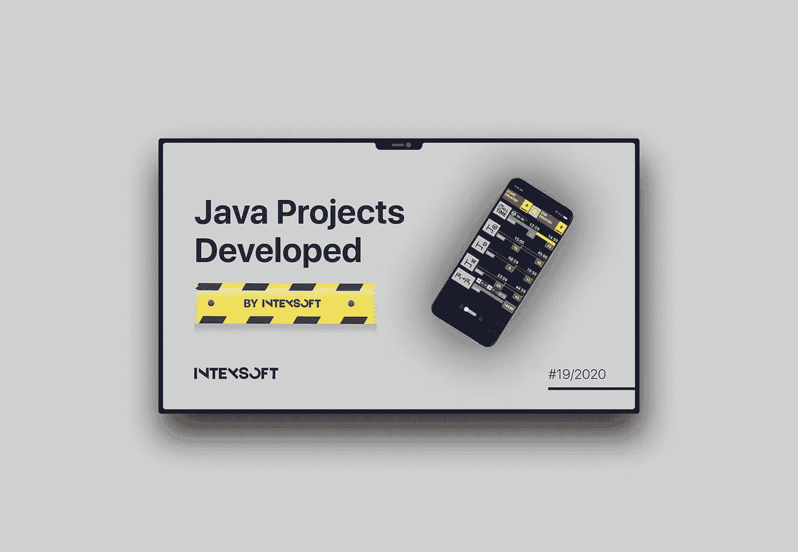
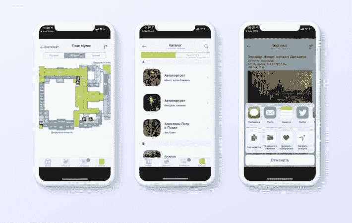
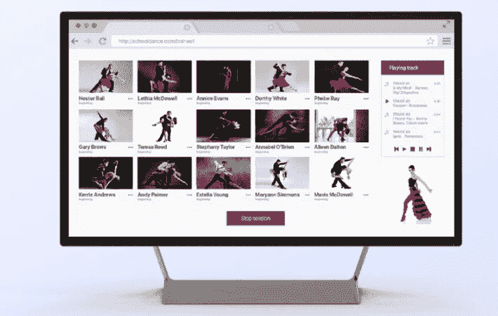

# 我参与过的最有趣的 Java 项目

> 原文：<https://medium.com/javarevisited/the-most-interesting-java-projects-i-worked-with-9d313f5ebf2b?source=collection_archive---------6----------------------->

我的名为 IntexSoft 的公司从创立之初就一直在使用 Java。我们有几个 Java 团队，其中大多数都是[甲骨文认证专家](https://education.oracle.com/oracle-certified-professional-java-se-8-programmer/trackp_357)。我们已经用 [Java 栈](https://intexsoft.com/java-software-development-services/)开发了 100 多个项目。去年我们举行了 20 多次专门讨论 Java 技术的会议。我们已经写了大约 15 篇关于 Java 的文章。

所以现在我想分享我们自己使用 Java 的经验。

# Java 项目

在本文中，我收集了 IntexSoft 开发的 5 个最好的 Java 项目。我希望，你会觉得它们有趣和有用。

## 1.Android 手机应用:AntiBAG Tahograf

客户联系 IntexSoft 为卡车司机开发一款移动应用程序，该程序将**跟踪工作时间**。由于最终用户(在我们的例子中是卡车司机)因违反工作和休息时间而被处以巨额罚款，因此这种应用程序非常受欢迎。

这位客户对商业理念和他自己的平面设计有着清晰的认识。因此，我们的团队根据这些需求编写了项目规范，并开始了开发过程。

在进行一个项目时，我们与该应用的直接终端用户——卡车司机密切合作。这就是为什么开发团队能够实现各种重要的变化。例如，我们找到了交通跟踪误差的解决方案，尤其是在没有信号的长隧道中。

一些关键的应用程序功能:

*   该应用程序每天提醒司机指定他正在驾驶的国家；
*   当司机需要停车或起飞时，会发出声音通知；
*   工作日历；
*   日/夜显示模式；
*   可以在离线模式下工作(仅在首次启动时需要访问互联网)；
*   准确位置的识别(基于 GPS 和网络)。

使用的技术:

*   [Java](/javarevisited/top-5-java-online-courses-for-beginners-best-of-lot-1e1e240a758)
*   本机和自定义 UI 组件
*   碰撞分析

结果，这位客户设法在一周内获得了投资回报，现在这款应用在 Google Play 上的评分为 4.6，下载量超过了 10K。

查看 [Google Play](https://play.google.com/store/apps/details?id=com.intexsoft.intexsofttahograf) 上的应用。

## 2.Android 和 iOS 的移动应用:博物馆指南

该客户聘请 IntexSoft 为 Android 和 T2 iOS 开发移动应用程序。该项目的目标是增加参观人数，让参观博物馆变得更加有趣和互动。

项目中的关键任务是开发一个**虚拟地图，在博物馆中配置导航**，以及**为展厅开发一个虚拟游览功能**。对于虚拟地图和导航配置，我们的开发人员使用了 GPS 系统。对于虚拟旅游功能，我们的开发团队使用全景照片。

此外，我们在离线模式下实现了该应用程序的完整操作，在应用程序中添加了一个新闻页面，并在应用程序中集成了购票功能。

最重要的任务是修改现有的音频指南应用程序，并使其适合有听力障碍的人。

该应用的一些关键特性:

*   博物馆中的虚拟地图和导航；
*   搜索展览室及其相关信息；
*   博物馆的 GPS 导航；
*   展厅中的虚拟参观；
*   购票；
*   获取博物馆新闻；
*   演示模式。

使用的技术(针对 Android):

*   [Java](/javarevisited/10-free-courses-to-learn-java-in-2019-22d1f33a3915?source=collection_home---4------8-----------------------)
*   推送通知
*   谷歌地图 API
*   事件总线
*   安卓注释。

因此，该应用程序现在很受博物馆游客、游客和艺术爱好者的欢迎。

## 3.Web 应用程序:铁路系统的 3D 配置器

客户聘请 IntexSoft 开发一个 3D 配置器，用于设计备件，以及电能消耗的分配和控制。

关键的挑战是开发一个**配置器**来帮助用户创建安装的组件并使用它们。IntexSoft 团队创建了一个**灵活的管理面板**，允许单独加载和处理每个 3D 零件，并设置大量关键参数。开发的系统还允许**在短路和施工电力损失的情况下计算施工耐力**。

我们设置了三种格式的轨道系统几何图形导出— **OBJ** 、 **3DS** 和 **DXF** 。导出的数据可用于进一步的生产过程和销售文件的准备。

该系统还简化了销售过程:客户可以通过添加所需建筑的描述来请求商业报价，公司代表可以计算成本。

该应用程序根据 4 种类型的用户拥有访问权限:匿名(未注册)用户、注册用户(公司的客户/代表)、管理模式和管理员。

该应用的主要特点是:

*   3D 视图变化(旋转)；
*   现有项目的加载和编辑；
*   创建项目文件；
*   请求项目报价；
*   导出轨道系统几何图形(OBJ、3DS、DXF)；
*   短路强度能力的计算；
*   铁路系统功率损耗的计算。

使用的技术:

**前端**

*   [安古拉吉斯](/javarevisited/10-courses-to-learn-angular-for-web-development-6da1bd2856dc)
*   三. js

**后端**

*   [Java 8](/javarevisited/7-best-java-tutorials-and-books-to-learn-lambda-expression-and-stream-api-and-other-features-3083e6038e14?source=collection_home---4------2-----------------------)
*   [弹簧](/@javinpaul/top-10-free-courses-to-learn-spring-framework-for-java-developers-639db9348d25)
*   [冬眠](/javarevisited/top-5-hibernate-online-training-courses-for-beginners-and-advance-java-programmers-469460596b2b)
*   贾斯珀报告
*   搅拌机
*   [Python](/swlh/5-free-python-courses-for-beginners-to-learn-online-e1ca90687caf)

结果，客户得到了一个优化 3D 布局和订单处理开发的产品。顺便说一下，在这个项目中开发的部分功能被客户团队用于其他产品。

## 4.Web 应用:在线舞蹈学校

这位客户是一名专业舞蹈演员，他想出了开发这款应用程序的想法，让舞蹈演员可以教授和培训每个人。于是他聘请 IntexSoft 开发在线舞蹈学校。

这个项目是独一无二的，因为它是为远程集体舞学习而设计的。16 个用户可以参与一节课:一个老师和 15 个学生。

应用程序的工作组织如下

同步问题源于这样一个事实，即每个用户都有不同的连接速度、位置和互联网提供商。为了解决同步和多路复用的问题，开发团队使用了 Wowza 媒体服务器、Amazon 和 FFmpeg 工具。为了在没有任何第三方系统的情况下通过浏览器实现视频流，IntexSoft 团队决定使用 **WebRTC** 技术。

除了流媒体，该应用程序还具有以下功能:通过 PayPal/信用卡支付一节课的费用，通过群聊在课上发送短信和文件，在课后录制舞蹈并发送给老师等。

使用的技术:

**前端**

*   [JavaScript](/javarevisited/12-free-courses-to-learn-javascript-and-es6-for-beginners-and-experienced-developers-aa35874c9a32)
*   [HTML5](/javarevisited/5-free-html-and-css-courses-to-learn-front-end-web-development-online-8b04517c6ecb?source=collection_home---4------0-----------------------)
*   [CSS3](/javarevisited/top-10-free-courses-to-learn-html-5-css-3-and-web-development-872d62d97a97)
*   网络包

**后端**

*   Java 8
*   [Spring Boot](/javarevisited/10-free-spring-boot-tutorials-and-courses-for-java-developers-53dfe084587e?source=collection_home---4------7-----------------------)
*   [美芬](/javarevisited/top-10-free-courses-to-learn-maven-jenkins-and-docker-for-java-developers-51fa7a1e66f6?source=collection_home---4------3-----------------------)
*   [node . js](/javarevisited/7-free-courses-to-learn-node-js-in-2020-2f1dd6722b49)(web 套接字)
*   pkg (npm 包)

**视频流**

*   WebRTC
*   Wowza 媒体服务器
*   FFmpeg

**其他**

*   MongoDB
*   [MySQL](/@javinpaul/top-5-courses-to-learn-mysql-in-2020-4ffada70656f)
*   NGINX
*   亚马逊 EC3
*   [Git](/@javinpaul/top-10-free-courses-to-learn-git-and-github-best-of-lot-967aa314ea)
*   SVN

## 5.Web 应用:高负载数据存储和处理系统

该公司的计费系统已经过时，无法再应对一些重要任务，也无法满足现代需求。因此，他们聘请 IntexSoft 从头开始设计一个新系统。

这是一个**大数据项目**，因为该系统的一个关键特性是大数据阵列的存储和处理。系统规模可以和 Spotify、 **Yandex 相比。音乐**等。它每天处理数十亿个文件，每秒接收大约 60 万条记录。

在这种数据量的条件下，分布式 Cassandra 数据库被用作存储。至于计费，我们的团队使用 Apache Spark 来处理和计算分布式数据。此外，该系统是建立在微服务和分布式架构的基础上。目前，系统中大约有 20 个微服务。

该系统的主要特点:

*   数据收集和处理；
*   数据聚合；
*   数据的计算:付款和费用的核算，根据更新的数据重新计算费用以开具新发票；
*   大量数据的存储；
*   上传数据报告的能力。

使用的技术:

*   Java 语言(一种计算机语言，尤用于创建网站)
*   Spring Boot
*   春天
*   PL/SQL
*   格拉德勒
*   专家
*   神谕
*   兔子 q
*   DSE 卡桑德拉
*   NGINX
*   阿帕奇·卡拉夫
*   阿帕奇火花
*   阿帕奇卡夫卡
*   阿帕奇骆驼
*   格拉夫纳
*   乔洛基亚
*   雄猫
*   动物园管理员
*   阿卡演员
*   其他人

该项目始于 2016 年，现在开发的解决方案是一个完整的领先的数据存储和处理系统。

# 总结

Java 被用于各种项目:从移动应用程序到企业解决方案。我试图列出我的公司开发的最杰出的 Java 项目。它们在领域、复杂性和细节上都有所不同。但是所有这些项目都以一种成功的方式。

*原载于 2020 年 6 月 18 日 https://www.intexsoft.com***。**