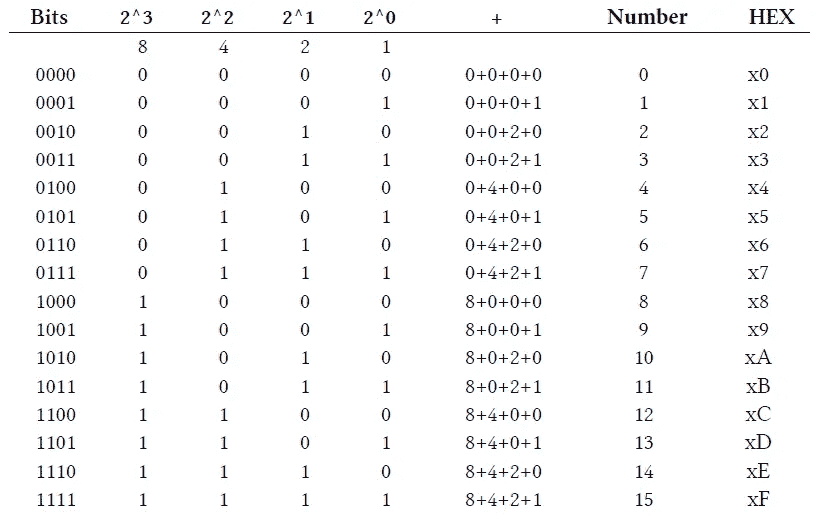
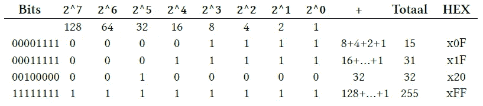
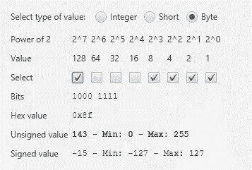
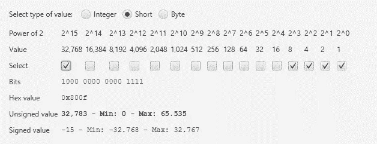

# Java 中负字节值的奥秘

> 原文：<https://medium.com/javarevisited/the-mystery-of-the-negative-byte-value-in-java-8c9923d9239d?source=collection_archive---------1----------------------->

当您将 Java 与底层数据结合使用时，例如网络数据包、串行通信、Raspberry Pi 的 GPIO 十六进制值的数值可能会有些混乱。前一段时间在 Pi4J 论坛上有一个问题，是关于一个被当作字节处理的数值被记录为负数-86，而不是预期值 170。所以这是我试图解释这个谜团的尝试…

# 基础知识

非常短:

*   计算机大脑中的所有逻辑都是一个位，可以是 0 或 1(开或关)。
*   当你组合 8 位时，你得到一个字节。

# 将位转换为数字和十六进制值

使用 2 的幂将多个位的组合转换为一个数字。

在日常生活中，我们习惯于十进制数值，我们把所有东西按 10，20，30 分组。在编程中，十六进制值用得更多，它们的范围是 0 到 15，完美匹配四位的最大值(“1111”)。一个十六进制值被写成 x0 到 xF。

下表显示了范围从“0000”到“1111”的 4 位的所有可能组合:



# 计算一个字节值

一个字节由 8 位组成，范围为 0x00 (= 0)至 0xFF (= 255)。因此，我们需要扩展上表，使其具有 8 位。让我们举几个例子:



# Java 中的值

让我们用下面的代码检查一下 Java 中的值是如何表示的:

```
class PrintLimits {
    public static void main(String[] args) {
        System.out.println("Byte");
        System.out.println("    Min: " + Byte.MIN_VALUE);
        System.out.println("    Max: " + Byte.MAX_VALUE); System.out.println("Short");
        System.out.println("    Min: " + Short.MIN_VALUE);
        System.out.println("    Max: " + Short.MAX_VALUE); System.out.println("Integer");
        System.out.println("    Min: " + Integer.MIN_VALUE);
        System.out.println("    Max: " + Integer.MAX_VALUE); System.out.println("Long");
        System.out.println("    Min: " + Long.MIN_VALUE);
        System.out.println("    Max: " + Long.MAX_VALUE);
    }
}
```

结果我们得到了这些值:

```
Byte
    Min: -128
    Max: 127
Short
    Min: -32768
    Max: 32767
Integer
    Min: -2147483648
    Max: 2147483647
Long
    Min: -9223372036854775808
    Max: 9223372036854775807
```

**嗯，这真是意想不到！一个字节的范围是-128 到 127，而不是 0 到 255？！**为了理解这一点，我们需要知道有符号值和无符号值的区别。

# 有符号与无符号

当您将字节值计算为有符号数值时，主位(最左边的一位)被视为负数(1)或正数(0)的指示符，例如 8 位“1000 1111”:



“1000 1111”既是-15 又是 143，这取决于您是将其作为有符号的还是无符号的来处理。

由两个字节(= 16 位)组成的短码也是如此，例如“1000 0000 0000 1111”:



“1000 0000 0000 1111”既是-15 又是 32.783，这取决于您是将其作为有符号还是无符号来处理。

# 结论

您需要确定在读取数值时如何处理它们，以免混淆有符号值和无符号值！

幸运的是，我们有 Byte.toUnsignedInt(b)函数，以确保我们在记录值时读出正确的值。下面是一个 170 英镑的快速演示，来自 Pi4J 论坛的原始问题:

```
class HexIntegerToString {
    public static void main(String[] args) {
        convertByte((byte) 170);
    } private static void convertByte(byte value) {        
        System.out.println("Byte Unsigned: "
           + Byte.toUnsignedInt(value) + "\tSigned: " + value);
        System.out.println("    Hex value:  0x" 
           + Integer.toHexString(value & 0xFF));
        System.out.println("    Binair:     " 
           + Integer.toBinaryString(value & 0xFF));
    }
}
```

它给出了以下输出:

```
Byte Unsigned: 170      Signed: -86
    Hex value:  0xaa
    Binair:     10101010
```

如果你想尝试用 JavaFX 应用程序将位转换成数值，就像你在上面的截图中看到的那样，在 GitHub 上查看[这个项目的源代码。](https://github.com/FDelporte/JavaOnRaspberryPi/tree/master/Chapter_08_BitsAndBytes/javafx-bits-calculator)

**你可能喜欢的其他文章:**

</javarevisited/top-5-java-online-courses-for-beginners-best-of-lot-1e1e240a758>  </free-code-camp/these-are-the-best-free-courses-to-learn-data-structures-and-algorithms-in-depth-4d52f0d6b35a>  <https://codeburst.io/100-coding-interview-questions-for-programmers-b1cf74885fb7> 