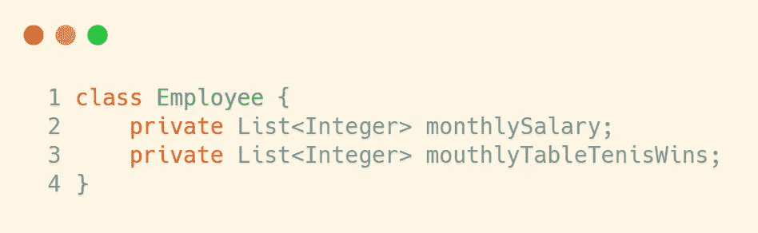
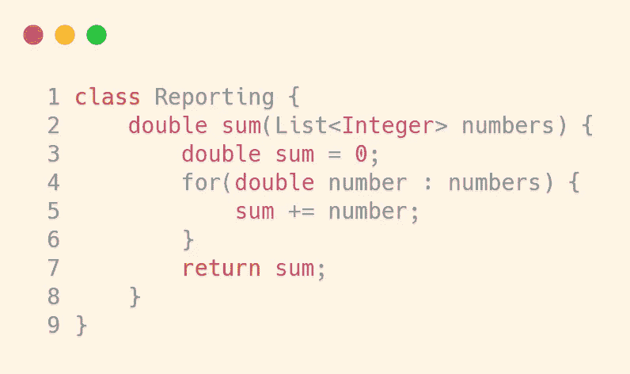
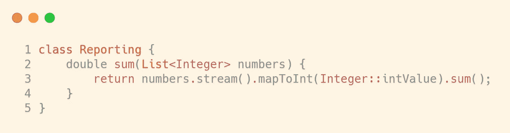

# 重用代码的正确方法

> 原文：<https://medium.com/javarevisited/the-right-way-to-reuse-code-9eabe7696a48?source=collection_archive---------2----------------------->

在本文中，我们将关注如何重用代码。

为什么要重用代码？这条规则有例外吗？重用代码有副作用吗？让我们开始吧。

这篇文章是名为 [**软件实践和编写干净代码**](https://rebrand.ly/spwcc-medium-reuse) — 的深入课程的一部分，你可以去看看。它目前以 87%的折扣出售。

为了使代码更简单，更不容易出错，你应该重用代码。可能每个[初学者编程课程](/javarevisited/7-best-coding-course-to-learn-programming-with-zero-experience-in-2020-52f7d0d9cb80)都会谈到这一点，这很重要。让我们先谈谈基础知识，以及为什么我们应该重用代码，然后我们将看到一个规则的例外，没有多少人知道或想到。

# 基础知识

不为别的——自私一点。重用代码意味着您将编写和维护更少的代码。如果代码越多，代码就越容易出问题。简单的数学。此外，当你有重复的代码，你想改变它，你需要改变它在两个或更多的地方。这样做的问题是，您可能会忘记在所有地方更改它，这将导致不一致。此外，这很耗时。我们知道开发者的时间有多贵，所以尽量节省吧。重复代码还有很多问题，但我们不会谈论它们。这不是一个好的做法，不要这样做。否则我会找到你！

我们看到了重用代码的重要性，所以您应该尽可能多地重用代码。对吗？

# 例外

例外是…商业逻辑。

业务逻辑意味着实际的业务案例。这意味着您正在开发的产品的实际功能。例如:“当您在搜索栏中输入内容并点击搜索时，搜索结果就会显示出来”——这是一个商业案例。当我们有一个业务代码时，我们经常有，我们应该非常小心。我不是说不要重用它，我是说要谨慎。

让我们看一个非常简单的例子，它将向您展示有时重用代码并不是一个好主意，并且可能会使我们的系统变得脆弱。

我们有一个雇员类，其中有两个字段。一个代表员工的月薪，另一个代表每月的乒乓球胜率(因为我们公司有乒乓球锦标赛)。这是两码事，对吧？

我们有一个报告类，其中有一个方法可以计算雇员收到的所有工资的总和。

这是一个简单的方法，将所有的薪水相加并返回。下面是它的一个[流](/javarevisited/7-best-java-collections-and-stream-api-courses-for-beginners-in-2020-3ad18d52c38)版本(我知道不是所有人都知道 Java 流):

现在我们需要开发一个新的功能，一个新的商业案例。我们需要为一名员工生成一份包含所有月度乒乓球胜利的报告。因为我们知道我们总是需要重用代码，所以我们重用相同的方法。这很方便，对吧…现在想象一下:有一项税收增加，我们需要将员工的工资增加 5%。

有两种可能发生的事情:

*   **第一个场景:**更改求和方法，忘记我们使用相同的方法计算每月乒乓球胜率。当我们改变方法时会发生什么？乒乓球比赛的报道也会改变。我们刚刚引入了一个 bug。网球比赛报道和薪水没有任何共同之处。如果你从管理者或用户的角度来看，你会说开发人员是白痴。涨工资怎么能改变乒乓球锦标赛的报道？这是脆弱代码的一个例子。
*   **第二个场景:**我们记得我们在两个地方使用了这种方法。然后我们需要重构代码，把它一分为二。或者更糟:**放一个 if 语句**(这是另一篇文章的主题)。这可能会导致乒乓球锦标赛报告中的错误，如果你从经理或用户的角度来看，这与工资没有任何共同点。所以我们可能会遇到和第一个一样的问题。当然，我们可能不会引入错误，但我们是程序员，我们会做傻事。所以别指望了。

您看到重用业务逻辑通常不是一个好主意，您需要对此保持谨慎。商业逻辑变得紧张。请记住这一点，当您必须重用业务逻辑时，请三思而行。有时这是可以的，但要视情况而定。如果你在一家公司工作，并且你有一个产品负责人(这是一个负责业务逻辑的人)，你可以问他或她你正在工作的特性是否会改变。但是即使他们告诉你不会，也要小心。客户并不总是知道他们想要什么。

我知道我的例子有点傻，但是我需要你从中得到抽象的想法，不要陷入具体的例子中。

# 那么我们什么时候应该重用代码呢？

答案是——在所有其他情况下。如果你有一个逻辑、算法或者你知道不会改变的东西——重用它。即使你知道有些事情可能会改变，问问你自己——这些改变需要发生在你重用代码的所有地方吗？如果是，那么就重用它。想象一下有一个`Employee`和一个`HourlyEmployee` 类。然后，如果你有一个方法来计算一个雇员所有工资的总和，那么重用它是完全可以的。这两个对象非常相似，如果有增税，比如说，它应该发生在 Employee 和 HourlyEmployee 类上。

# 在你离开之前——我们惊人的干净代码课程

如果你喜欢这篇文章，你会喜欢我们关于[干净代码](/javarevisited/clean-code-a-must-read-coding-book-for-programmers-9dc80494d27c?source=---------5------------------)的课程

*   39 场讲座
*   1.5 小时的内容
*   做一个真实的项目来测试你的知识

你可以在这里报名参加课程——[**软件实践与编写干净代码**](https://rebrand.ly/spwcc-medium-reuse) 。它目前以 87%的折扣出售。

