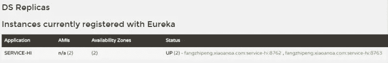
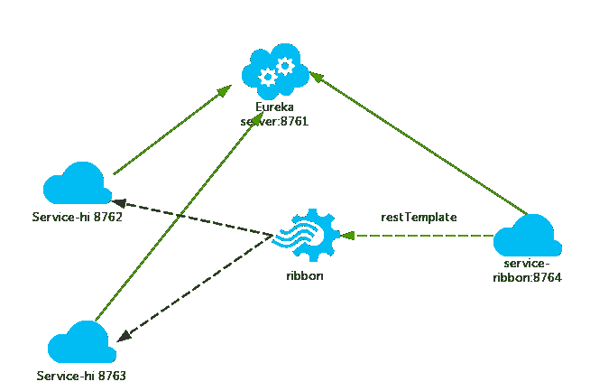

# 有史以来最简单的 SpringCloud 教程|第二章:服务消费者(rest+ribbon) (Finchley 版)

> 原文：<https://medium.com/javarevisited/the-simplest-springcloud-tutorial-in-history-chapter-2-service-consumer-rest-ribbon-finchley-279f80d4ee02?source=collection_archive---------0----------------------->


在上一篇文章中，我谈到了服务的注册和登记。在[微服务架构](https://javarevisited.blogspot.com/2021/09/microservices-design-patterns-principles.html)中，发现部门独立服务，服务与服务之间的通信基于 http restful。[春云](/javarevisited/5-best-courses-to-learn-spring-cloud-and-microservices-1ddea1af7012)有业务服务调用方法，一种是 ribbon+template，另一种是 ribbon+rest。

1.  **丝带介绍**

```
Ribbon is a client side load balancer which gives you a lot of control over the behaviour of HTTP and TCP clients. Feign already uses Ribbon, so if you are using [@FeignClient](http://twitter.com/FeignClient) then this section also applies.
```

Ribbon 是一个负载均衡客户端，可以很好的控制 http 和 tcp 的一些行为。默认情况下，Feign 集成 ribbon。

默认情况下，ribbon 已经实现了这些配置 beans:

*   IClientConfig ribbonClientConfig:DefaultClientConfigImpl
*   I rule ribbon rule:ZoneAvoidanceRule
*   IPing ribbonPing: NoOpPing
*   服务器列表 ribbonServerList:ConfigurationBasedServerList
*   服务器列表过滤器 ribbonServerListFilter:ZonePreferenceServerListFilter
*   iload balancer ribbonLoadBalancer:zoneawareloadbancer

**2。准备工作**

本文基于上一篇文章的项目，启动 eureka-server 项目；启动 service-hi 项目，其端口为 8762；将 service-hi 配置文件的端口改为 8763，并启动它，然后你会发现:service-hi 在 eureka-server 中注册了 2 个实例，相当于一个小集群。

[](https://javarevisited.blogspot.com/2018/02/top-5-spring-microservices-courses-with-spring-boot-and-spring-cloud.html)

**3。构建服务消费者**

创建一个新的 spring-boot 项目，并将其命名为:service-ribbon；
在其 pom.xml 中，它继承了父 pom 文件并引入了以下依赖关系:

```
<?xml version="1.0" encoding="UTF-8"?>
<project ae jx" href="http://maven.apache.org/POM/4.0.0" rel="noopener ugc nofollow" target="_blank">http://maven.apache.org/POM/4.0.0" xmlns:xsi="[http://www.w3.org/2001/XMLSchema-instance](http://www.w3.org/2001/XMLSchema-instance)"
         xsi:schemaLocation="[http://maven.apache.org/POM/4.0.0](http://maven.apache.org/POM/4.0.0) [http://maven.apache.org/xsd/maven-4.0.0.xsd](http://maven.apache.org/xsd/maven-4.0.0.xsd)">
    <modelVersion>4.0.0</modelVersion><groupId>com.forezp</groupId>
    <artifactId>service-ribbon</artifactId>
    <version>0.0.1-SNAPSHOT</version>
    <packaging>jar</packaging><name>service-ribbon</name>
    <description>Demo project for Spring Boot</description><parent>
        <groupId>com.forezp</groupId>
        <artifactId>sc-f-chapter2</artifactId>
        <version>0.0.1-SNAPSHOT</version>
    </parent><dependencies>
        <dependency>
            <groupId>org.springframework.cloud</groupId>
            <artifactId>spring-cloud-starter-netflix-eureka-client</artifactId>
        </dependency>
        <dependency>
            <groupId>org.springframework.boot</groupId>
            <artifactId>spring-boot-starter-web</artifactId>
        </dependency>
        <dependency>
            <groupId>org.springframework.cloud</groupId>
            <artifactId>spring-cloud-starter-netflix-ribbon</artifactId>
        </dependency>
    </dependencies></project>
```

在项目的配置文件中，指定服务的注册地址为[http://localhost:8761/eureka/](http://localhost:8761/eureka/)，程序名为 service-ribbon，程序端口为 8764。配置文件 application.yml 如下所示:

```
eureka:
  client:
    serviceUrl:
      defaultZone: [http://localhost:8761/eureka/](http://localhost:8761/eureka/)
server:
  port: 8764
spring:
  application:
    name: service-ribbon
```

在项目的启动类中，通过 [@EnableDiscoveryClient 向服务中心注册；](https://www.java67.com/2018/12/top-5-spring-cloud-annotations-for-java.html)并将 bean: [restTemplate](https://javarevisited.blogspot.com/2022/05/how-to-set-accept-header-on-spring.html) 注入到程序的 ioc 中；并使用@LoadBalanced 注释来指示此 restRemplate 启用了负载平衡。

```
[@SpringBootApplicatio](http://twitter.com/SpringBootApplicatio)n
[@EnableEurekaClient](http://twitter.com/EnableEurekaClient)
[@EnableDiscoveryClien](http://twitter.com/EnableDiscoveryClien)t
public class ServiceRibbonApplication {public static void main(String[] args) {
        SpringApplication.run( ServiceRibbonApplication.class, args );
    }[@Bean](http://twitter.com/Bean)
    [@LoadBalanced](http://twitter.com/LoadBalanced)
    RestTemplate restTemplate() {
        return new RestTemplate();
    }}
```

编写一个测试类 HelloService，通过 ioc 容器注入的 [restTemplate](https://javarevisited.blogspot.com/2022/03/how-to-send-json-via-post-request-using.html) 消费 service-hi 服务的“/hi”接口。这里我们直接用程序名替换具体的 url 地址。在功能区中，它将基于服务名称。选择一个具体的服务实例，根据服务实例请求时，用具体的 url 替换服务名。代码如下:

```
[@Service](http://twitter.com/Service)
public class HelloService {[@Autowired](http://twitter.com/Autowired)
    RestTemplate restTemplate;public String hiService(String name) {
        return restTemplate.getForObject("[http://SERVICE-HI/hi?name=](http://SERVICE-HI/hi?name=)"+name,String.class);
    }}
```

写一个[控制器](https://javarevisited.blogspot.com/2021/09/how-to-return-different-http-status-from-sprnig-mvc-controller.html)，在控制器中使用调用 HelloService 的方法。代码如下:

```
[@RestController](http://twitter.com/RestController)
public class HelloControler {[@Autowired](http://twitter.com/Autowired)
    HelloService helloService;[@GetMapping](http://twitter.com/GetMapping)(value = "/hi")
    public String hi([@RequestParam](http://twitter.com/RequestParam) String name) {
        return helloService.hiService( name );
    }
}
```

访问 [http://localhost:8764/hi？name=forezp](http://localhost:8764/hi?name=forezp) 在浏览器上多次，浏览器交替显示:

```
hi forezp,i am from port:8762hi forezp,i am from port:8763
```

这说明当我们调用 rest template . getforobject("[http://SERVICE-HI/HI？name=](http://SERVICE-HI/hi?name=) "+name，String.class)方法，我们做了负载均衡，在不同的端口上访问服务实例。

**4。这时的结构**

[](https://javarevisited.blogspot.com/2022/04/difference-between-graphql-and-rest-api.html)

一个服务注册表，eureka 服务器，端口 8761

service-hi 项目使用端口 8762 和 8763 运行两个实例，这两个端口分别在服务注册中心注册。

sercvice-ribbon 端口是 8764，在服务注册中心注册

sercvice-ribbon 通过 restTemplate 调用 service-hi 的 hi 接口时，因为与 ribbon 的负载均衡，会依次调用 service-hi 的 hi 接口:8762 和 8763 端口；

</javarevisited/21-spring-mvc-rest-interview-questions-answers-for-beginners-and-experienced-developers-21ad3d4c9b82>  </javarevisited/top-10-rest-interview-questions-for-java-and-spring-developers-1611e3b78029>  </javarevisited/13-topics-you-should-prepare-for-your-next-spring-boot-interview-5f2993a04ff5> 