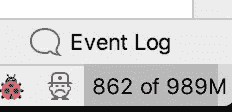
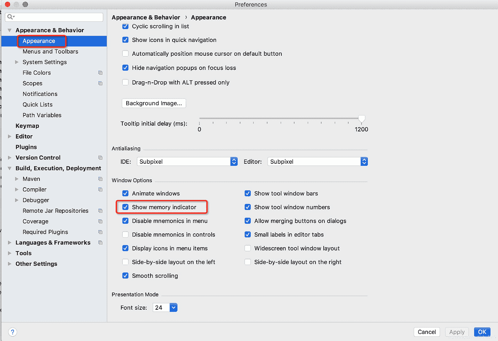
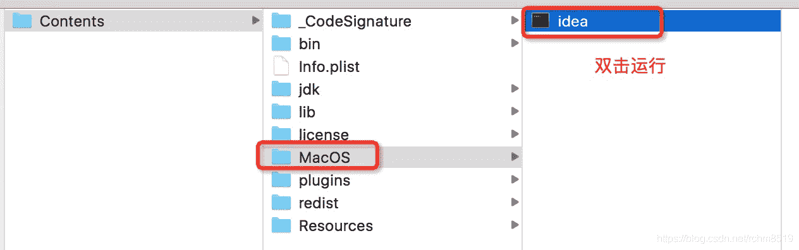
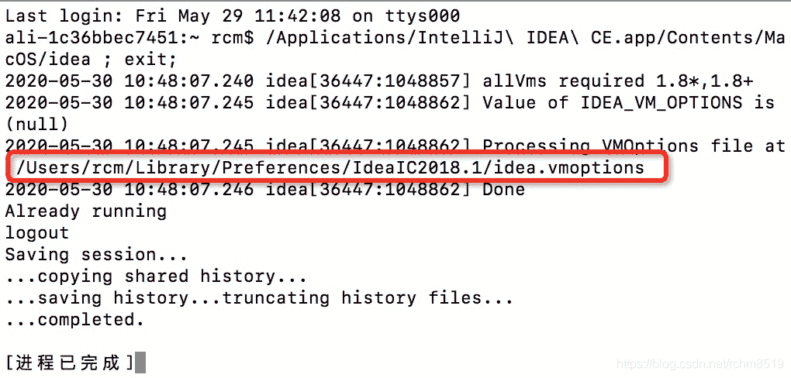
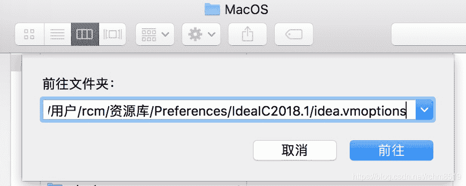

# Mac 电脑下修改 Idea 中内存参数的解决方案行不通

> 原文：<https://medium.com/javarevisited/the-solution-to-modifying-memory-parameters-in-idea-under-mac-computer-does-not-work-a5c463d4e413?source=collection_archive---------2----------------------->

## 在 Mac 下修改 Idea 中的内存参数

[](https://www.java67.com/2020/04/top-5-advanced-courses-to-learn-java-perofrmance-concurrency-memory-management.html)

利亚姆·布里斯在 [Unsplash](https://unsplash.com?utm_source=medium&utm_medium=referral) 上拍摄的照片

W 在使用 idea 时，如果同时打开多个项目，内存往往会满，导致异常死机，有时还会提示内存溢出。此时可以通过[增加 Xmx](https://javarevisited.blogspot.com/2016/10/how-to-increase-heap-size-of-eclipse-OutOfMemoryError.html) 的值来改善。但是 Xmx 值应该怎么调整呢？为什么有人修改 Xmx 值却不生效？本文将详细解释。

# 1.无效方法

在互联网上找到的许多指导您调整 Xmx 的方法一般如下:

1.1 右键单击应用创意—显示包装内容:

[](https://javarevisited.blogspot.com/2016/12/how-to-increase-heap-memory-of-apache.html)

1.2 然后打开 bin 下的 idea.vmoptions，修改 [Xms，Xmx](https://www.java67.com/2016/08/10-jvm-options-for-java-production-application.html) 并保存，重启 idea。

[](https://javarevisited.blogspot.com/2011/11/hotspot-jvm-options-java-examples.html)

但是应该还是有很多朋友发现这个操作没有效果，思路还是卡，风扇还是呼呼转。

1.3 如何检查设置是否生效

其实你可以通过看想法右下角的两个数字来判断设置是否生效，如图:

[](https://javarevisited.blogspot.com/2013/04/what-is-maximum-heap-size-for-32-bit-64-JVM-Java-memory.html)

这里 989 是[最大可用内存](https://javarevisited.blogspot.com/2013/04/what-is-maximum-heap-size-for-32-bit-64-JVM-Java-memory.html)，Xmx(想法本身应该占一小部分)，862 是已用内存。

如果这个数字没有显示在你的右下角，你可以通过点击右上角的“Intellij IDEA”—“Preferences”—“Appearance”来设置，

检查“显示内存指示器”，确定保存。

[](https://javarevisited.blogspot.com/2018/09/top-5-courses-to-learn-intellij-idea-java-and-android-development.html)

# 2.无效的原因

2.1 修改没有生效的原因是什么？

首先，确认自己是否重启了想法。重新启动要求您关闭所有建议窗口，然后打开建议。

如果你确定重启后不生效，那么只有一个原因:修改后的文件不是 idea 实际使用的文件。

2.2 找到正确的配置

如果你想知道你的 idea 允许哪个配置文件，你可以找到内容——在 [MacOS](https://javarevisited.blogspot.com/2022/02/top-5-macos-courses-for-beginners-in.html) 下的 idea 可执行文件，双击运行它

[](https://javarevisited.blogspot.com/2021/08/top-5-courses-to-learn-operating-system.html)

您将看到 idea 启动加载配置文件的路径如下:

[](https://javarevisited.blogspot.com/2022/03/spring-boot-redis-example-in-java.html)

我的 idea 使用的配置文件是:/Users/RCM/Library/Preferences/idea IC 2018.1/idea . VM options

2.3 修改正确的配置

通过转到文件夹命令，可以直接找到该文件并对其进行修改。修改保存后，重启想法生效。

[](https://javarevisited.blogspot.com/2018/02/top-5-spring-microservices-courses-with-spring-boot-and-spring-cloud.html)

我修改后的配置如下:

```
-Xms1024m
-Xmx2048m
-XX:ReservedCodeCacheSize=1024m
-XX:+UseCompressedOops
-Dfile.encoding=UTF-8
-XX:+UseConcMarkSweepGC
-XX:SoftRefLRUPolicyMSPerMB=50
-ea
-Dsun.io.useCanonCaches=false
-Djava.net.preferIPv4Stack=true
-XX:+HeapDumpOnOutOfMemoryError
-XX:-OmitStackTraceInFastThrow
-Xverify:none

-XX:ErrorFile=$USER_HOME/java_error_in_idea_%p.log
-XX:HeapDumpPath=$USER_HOME/java_error_in_idea.hprof
```

修改了三个主要参数:

*   xms 1024m
    -xmx 2048m
    -XX:ReservedCodeCacheSize = 1024m

# 3.更方便的方法

当然，您也可以用一种更简单的方式来设置它:

单击帮助—编辑自定义虚拟机选项，在打开的文件中进行修改，并在修改后重新启动该想法

[](https://javarevisited.blogspot.com/2019/04/top-5-courses-to-learn-jvm-internals.html)[](/javarevisited/7-best-courses-to-learn-jvm-garbage-collection-and-performance-tuning-for-experienced-java-331705180686) [## 2022 年学习 JVM、垃圾收集和性能调优的 7 门最佳课程

### 大家好，对于一个高级 Java 开发人员来说，了解 JVM 是如何工作的以及如何解决…

medium.com](/javarevisited/7-best-courses-to-learn-jvm-garbage-collection-and-performance-tuning-for-experienced-java-331705180686) [](/javarevisited/8-best-java-performance-books-for-experienced-developers-566e44f618c3) [## 有经验的开发人员的 8 本最佳 Java 书籍

### 我最喜欢的 Java 书籍和课程，学习如何编写高性能的 Java 应用程序、JVM 内部机制、垃圾…

medium.com](/javarevisited/8-best-java-performance-books-for-experienced-developers-566e44f618c3)