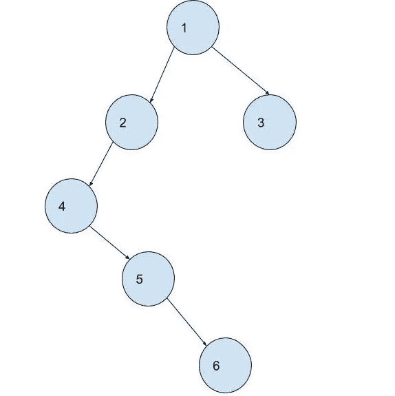

# FAANG 访谈中问到的 15 个二叉树问题

> 原文：<https://medium.com/javarevisited/the-ultimate-guide-to-binary-trees-47112269e6fc?source=collection_archive---------1----------------------->

## 任何你必须知道的关于二叉树的事情！

二叉树是最重要的数据结构之一。如果你一直关注我，你会知道我最近做了一个 **100 天**到**亚马逊挑战**的活动。当我在解决这些问题的时候。我发现这些面试问题有很多相似之处。我会…