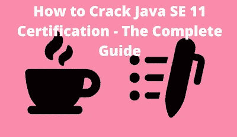
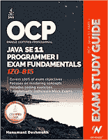
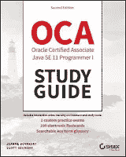
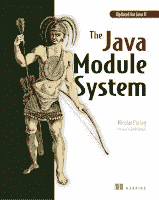

# 如何准备 2023 年 Java SE 11 或 17 开发者认证[1z 0–819 & 1z 0–829]考试？

> 原文：<https://medium.com/javarevisited/the-ultimate-guide-to-prepare-for-java-se-11-developer-certification-1z0-819-exam-753fd04a1c25?source=collection_archive---------0----------------------->

## 如何在 2023 年通过代码为 1z 0–819 的 Java SE 11 认证考试以及资源、书籍、课程和练习测试的链接，成为一名认证 Java 程序员

大家好，如果你想在 2023 年成为 Oracle 认证的 Java 开发人员，那么你有两个选择，要么参加代码为 1z 0–829 的 Java SE 17 认证，要么参加代码为 1z 0–819 的 Java SE 11 认证考试。

虽然获得最新的认证总是更好，但这并不总是可能的，在本文中，我将分享我关于如何通过书籍、课程和练习测试为 2023 年的 Java SE 11 认证做准备的想法。另外，我分享的所有技巧对 Java SE 17 认证 1z 0–829 同样有用，即使你可以使用书籍和课程来准备 80%的新考试。

如果你听说过 Java SE 11 认证是开发者级别的 Java 认证中最难的，那么你没听错。确实是很难破解的认证之一，比 [OCAJP 8](https://javarevisited.blogspot.com/2019/10/top-5-books-courses-to-crack-oracles-java-se-11-certification-OCAJP11.html) 难多了；这是它的前身，一些尝试过它的程序员称它比专业级认证 OCPJP 8 更难。

为了破解 **Java SE 11 认证**，你需要努力准备，但是，与此同时，你也需要知道你应该重点关注哪些领域。你应该在哪些话题上花更多的时间，哪些[书籍](https://javarevisited.blogspot.com/2019/10/top-5-books-courses-to-crack-oracles-java-se-11-certification-OCAJP11.html)和[课程](/javarevisited/5-best-books-courses-and-practice-tests-to-crack-java-se-11-certification-ocajp-11-1z0-815-6c861d6d147f)可以帮助你学习那些重要的话题？

我从大多数给过 Java SE 11 认证的开发人员那里得到的反馈(一半都失败了)是，模块是一个至关重要的话题，由于他们从未真正使用过模块，所以他们真的很难回答那些问题。

Btw，不用担心。如果你遵循这个考试指南，那么你一定会通过考试。这是我久经考验的蓝图，我按照这个模板通过了很多 [Java 认证](https://javarevisited.blogspot.com/2019/12/top-10-it-certifications-for-java-programmers.html)、 [AWS 认证](https://javarevisited.blogspot.com/2019/08/how-to-crack-aws-certified-solution-architect-exam.html)、 [Spring 认证](https://javarevisited.blogspot.com/2018/08/how-to-crack-spring-core-professional-certification-exam-java-latest.html#axzz5j90KOik7)，以及其他软件开发者/云/机器学习认证。就时间而言，如果你的目标不仅仅是通过考试，而是取得高分，你至少需要几个月的时间。我的大部分读者在仅仅 2 个月的准备中就通过了这个考试，但他们也有全职的 Java 工作经验。

如果你是应届毕业生起步，时间会稍微长一点，但那完全没问题。深入理解每个概念比仅仅知道正确答案更重要。毕竟一旦考过就应该是 Java 专家了。

# 2023 年 Java SE 11 开发者认证怎么准备？

不再浪费你的时间，下面是我破解 Java SE 11 程序员认证考试 1 的 6 点公式。

## 1.了解考试主题

通过 Java 11 认证的一个主要问题是教学大纲。如果你看教学大纲，它看起来像 Java 8 认证，但这是一个完全不同的考试。难度要大得多，这种模糊的教学大纲让难度更大。不是很清楚哪些主题在里面，哪些项目在外面。有时，回答其他主题的问题需要一个主题的知识，这就是为什么您需要一个学习指南或课程来准备 Java SE 11 认证。

## 1.Java 模块

该模块在 Java 11 认证考试中随处可见。阅读几本关于模块的书或者参加一个像模块化这样的课程来理解这个主题是一个很好的主意。
2
。Java 8 概念如 Stream
3。Java 文件 IO 概念
4。Java 并发
5。Java 集合框架

我不能列出所有的主题，但这些应该是你最强领域的一部分。当你解决 [**Whizlab 的练习题**](http://shrsl.com/1mekf) 或者在 Udemy 上做类似[这种](https://click.linksynergy.com/deeplink?id=JVFxdTr9V80&mid=39197&murl=https%3A%2F%2Fwww.udemy.com%2Fcourse%2Fjava-se-11-programmer-i-1z0-815-exam-dumps%2F)的模拟测试时你会发现。

## 2.参加一门好课程

除了学习指南，在线课程也是甲骨文 Java 认证的重要组成部分。因为良好的 Java 知识是通过这些认证考试的必要条件，所以在参加考试之前，参加几门综合课程是个好主意，比如<https://click.linksynergy.com/fs-bin/click?id=JVFxdTr9V80&subid=0&offerid=323058.1&type=10&tmpid=14538&RD_PARM1=https%3A%2F%2Fwww.udemy.com%2Fjava-the-complete-java-developer-course%2F>**完整的 Java 大师班，来复习你的知识，填补你理解中的空白。

我还建议参加一个关于 Java 模块系统的课程，比如 Java 9 模块化:首先查看 Pluralsight，深入学习这个高级主题。你会在 Java 11 认证或 OCAJP 11 和 OCJP 11 中发现与模块相关的概念。

除此之外，你还可以参加专门为 Java SE 11 认证准备的培训课程。它们有点贵，因为培训是由 Oracle 提供的，但是如果您负担得起，请尝试一下。或者，在像 Udemy 和 Pluralsight 这样的网站上参加类似的课程，在那里你可以很便宜地找到课程。**

****

## **3.读一本好书和学习指南**

**老实说，如果没有学习指南，准备 Java SE 11 认证或任何其他认证真的很难。它们是通过认证最重要的资源。为什么？因为它们很好地涵盖了考试主题。它们是由专家编写的，他们从长度和宽度上分析每个考试主题，然后将理解该主题所需的内容放在一起。说到 Java 11 认证，考试指南就更重要了，因为大纲不是很清楚。幸运的是，我们有几本很好的 OCAJP 八级和 OCPJP 八级考试学习指南，你可以买下来开始准备。**

## **a)[Hanumant desh mukh 的 Java SE 11 学习指南](https://www.amazon.com/dp/1086955811/?tag=javamysqlanta-20)**

**在撰写本文时，这是 Java SE 11 认证唯一可用的学习指南。它与考试主题密切相关，但也进一步深入解释了该主题，即使它涉及探索一些其他相关概念。非常感谢 Hanumant Deshmukh 编写了这个指南。**

****

## **b) [Java SE 11 认证学习指南](https://www.amazon.com/Oracle-Certified-Professional-Programmer-Study/dp/1119584701?tag=javamysqlanta-20)**

**这是 Jeanne Boyarsky 和 Scott Selikoff 的另一个 Java SE 11 认证学习指南，他们是 Java 认证指南的两位畅销书作者。不幸的是，这还不可用，但在 2019 年 11 月 26 日到来。

如果你不知道，Jeanne 和 Scott 是 Java 认证专家，他们的 OCAJP 8 指南已经帮助数千名 Java 开发者通过了甲骨文的 Java SE 8 认证考试。**

**基于 Jeann 和 Scott 的名声，我强烈推荐这本书，尽管我还没有读过这本书，因为在写这篇文章的时候它还没有出版。**

****

## **c)[Nicolai Parlog 的 Java 模块系统](https://www.amazon.com/Java-Module-System-Nicolai-Parlog/dp/1617294284/?tag=javamysqlanta-20)**

**这不是一本学习指南，而是一本学习 Java 模块系统的书。是给想在 Java SE 11 认证上拿高分，想深入学习 Java 模块化的人看的。**

**这本书深入介绍了什么是 Java 的模块系统，以及如何从中受益。它还提供了许多示例和针对希望使用模块的应用程序的迁移策略。**

****

**顺便说一句，如果你觉得这本书很难，因为题目本身有点难，你也可以从 Pluralsight 上 Sander Mak 的 [Java 9 模块化:First Look](https://pluralsight.pxf.io/c/1193463/424552/7490?u=https%3A%2F%2Fwww.pluralsight.com%2Fcourses%2Fjava-9-modularity-first-look) 课程中得到帮助。对我深入理解这个话题帮助很大。**

**<https://pluralsight.pxf.io/c/1193463/424552/7490?u=https%3A%2F%2Fwww.pluralsight.com%2Fcourses%2Fjava-9-modularity-first-look> ** 

## **4.模拟测试**

**很多人认为模拟考试是可选的，但我不这样认为。依我看，模拟考试可能是唯一最重要的因素，它将决定你在真正的考试中能得多少分。这背后是有逻辑的。

当你在真实的考试中进行[模拟测试](/javarevisited/5-best-books-courses-and-practice-tests-to-crack-java-se-11-certification-ocajp-11-1z0-815-6c861d6d147f?source=---------30------------------)时，比如在一个安静的房间里进行测试，并分配考试所需的实际时间，比如说 180 分钟，那么你就可以真正检查你的进步。**

**你可以找到那个时期你能解决多少问题；你被卡在哪里了？你还能做得更好吗？这种经历有助于你在真正的考试中做得更好。

虽然模拟考试是强制性的，但模拟考试的选择也很重要。如果你选择一个只有简单问题的模拟考试，你并没有真正努力准备，很可能你会在考试中失败，或者得分不够高，无法给人留下印象，这就是为什么我相信久经考验的认证考试提供商，如 [Whizlabs](http://shrsl.com/1mekf) 和 Enthuware。

我强烈推荐自己的 [**Java SE 11 认证实务考试**](https://www.udemy.com/course/java-se-11-certification-exam-1z0-819-practice-tests/?referralCode=6A43D9FD2DD560081062) 。它有许多优点。例如，它包含许多全长模拟测试，非常接近真正的考试。Udemy 还提供主题反馈，这意味着你可以找到自己的优势和劣势，并专注于正确的领域以提高分数。**

**下面是加入的链接— [**Java SE 11 认证实务考试**](https://www.udemy.com/course/java-se-11-certification-exam-1z0-819-practice-tests/?referralCode=6A43D9FD2DD560081062)**

****

**它有超过 250 个以上的问题，并深入解释每个问题，你不仅会了解为什么正确的答案是正确的，而且还会了解为什么其他答案是错误的，这是一个真正不同的学习体验，真的可以在你的最终分数上有所不同。我强烈建议你尝尝它们。他们也有一个免费的测试，你可以衡量你的准备水平。**

**此外，如果您正在准备 Java SE 17 开发人员认证与代码 1z 0–829 考试，那么您应该参加 [**我的 Udemy 课程面向 Java 开发人员的 1z 0–829 实践考试**](https://www.udemy.com/course/1z0-819-certification-oracle-java-17-exam-practice-test/?referralCode=8CCD5C00F8AE1259BBF1) 。这个是最新的，专门为 1z 0-829 考试设计的。**

****

## **5.准备你自己的笔记**

**如果你过去准备过任何认证，那么你会注意到准备自己的笔记真的很有好处。它有助于你更好地理解主题。众所周知，当你写一个话题或者向某人解释这个话题时，你会学得更好。为什么？因为大脑实际上是将数据加载到主存中的。它思考它，所有这些活动使你更好地记住和理解那些概念。自己准备笔记的另一个好处是有助于快速复习。如果你有自己的笔记，你可以在 1 或 2 小时内完成考试所需的所有主题的修订。否则，需要很长时间。**

## **6.参加论坛**

**取得 Java SE 11 认证的另一个重要技巧是参加 CodeRanch 或 JavaRach 之类的论坛。它专门为 OCAJP 11 和 OCPJP 11 设立了认证论坛。**

**通过参加论坛，你总是让自己和同样在准备考试的人保持在一起。你们一起讨论，一起解决问题，同时也了解认证的总体情况。

然后还有人会分享自己的亲身经历与考试，以及自己是如何通过或失败的。这些帖子对准备 [OCAJP 11](https://javarevisited.blogspot.com/2019/10/top-5-books-courses-to-crack-oracles-java-se-11-certification-OCAJP11.html) 和 OCJP 11 的考生来说非常有用，你可以从中学习，并且可以避免他们犯的错误。

你还会发现一些关于认证成功案例的帖子，比如有人得了 90%或 95%，所有这些帖子都会激励你做得更好。你也结识了走过你即将要走的路的人。你可以和他们联系，寻求一些帮助。因为所有这些原因，我认为定期参加认证论坛是通过甲骨文 Java 11 或 [*Java SE 17 认证*](https://javarevisited.blogspot.com/2023/02/250-java-se-17-certification-practice.html) 的关键。

以上就是**如何破解 2023 年 Java SE 11 或 17 认证**。我知道这是一场艰难的考试，通过它对许多开发人员来说并不容易，尤其是在您没有准备的情况下。如果你真的想第一次通过 OCAJP 11 或 OCPJP 17 的认证，或者想获得高分，你需要更加重视模块。
这就是为什么对模块的良好理解是极其重要的。

其他**认证资源**面向Java 程序员和 IT 专业人士**

*   **[Java SE 11 认证官方指南](https://education.oracle.com/oracle-certified-professional-java-se-11-developer/trackp_815)**
*   **[面向程序员的 5 大免费 Java 11 实践测试](https://javarevisited.blogspot.com/2019/07/top-4-java-11-certification-free-mock-exams-practice-tests-ocajp11-ocpjp11-1z0-815-16-questions.html)**
*   **[如何通过 Spring Core Professional 5.0 认证](https://javarevisited.blogspot.com/2018/08/how-to-crack-spring-core-professional-certification-exam-java-latest.html)**
*   **[如何破解 2023 年 AWS 解决方案架构师考试](https://javarevisited.blogspot.com/2019/08/how-to-crack-aws-certified-solution-architect-exam.html)**
*   **[学习数据结构和算法的 10 门免费课程](http://www.java67.com/2019/02/top-10-free-algorithms-and-data.html)**
*   **[通过 AWS 解决方案架构师助理考试的 5 次免费模拟测试](https://javarevisited.blogspot.com/2019/08/top-5-free-aws-solution-architect-Associate-certification-dumps-practice-questions.html)**
*   **[每个软件开发人员都应该学习的 10 件事](https://dev.to/javinpaul/10-things-every-software-developer-should-know-39pe)**
*   **[最佳 AWS 解决方案架构师课程](/javarevisited/top-5-aws-training-courses-to-crack-amazon-web-service-solutions-architect-associate-certification-3f4affa8f660?source=collection_home---4------0-----------------------)**
*   **[最佳 Azure 建筑师 AZ 300 球场](https://javarevisited.blogspot.com/2019/07/top-5-courses-to-crack-azure-architecture-technologies-certification-az-300-exam.html)**
*   **[如何破解甲骨文 2023 年 Java 认证](https://medium.freecodecamp.org/how-to-pass-oracles-java-certifications-a-practical-guide-for-developers-e9b607ba6173)**
*   **[Spring 认证对工作和事业有帮助吗？](https://javarevisited.blogspot.com/2017/07/does-spring-certification-help-in-job-and-career.html)**
*   **[2023 年 Java 开发者路线图](https://javarevisited.blogspot.com/2019/10/the-java-developer-roadmap.html)**
*   **[最佳谷歌云认证课程](https://javarevisited.blogspot.com/2019/07/top-5-google-cloud-platform-gcp-courses-certifications-online.html)**
*   **[通过 AWS 云从业者考试的最佳课程](https://javarevisited.blogspot.com/2020/02/top-5-courses-to-crack-aws-certified-cloud-practitioner-exam-certification-clf-c01.html)**
*   **[最佳 AWS 开发者认证课程](/javarevisited/top-5-online-courses-to-become-aws-certified-developer-associate-in-2020-best-of-lot-9b22baf84ca8)**
*   **[如何破解 Azure 建筑师认证(AZ-300)考试](https://javarevisited.blogspot.com/2020/04/how-to-crack-microsoft-azure-solution-architect-exam-az-300.html)**
*   **[最佳春季认证书籍和课程](/javarevisited/top-5-spring-professional-certification-exam-resources-for-java-developers-3ef9fa42fe13?source=collection_home---4------0-----------------------)**
*   **[2023 年破解 PMP 认证的 5 大球场](https://javarevisited.blogspot.com/2019/09/top-5-courses-to-crack-pmp-project-management-professional-certification-exam.html)**
*   **[程序员学习 Git 的 5 大免费课程](https://javarevisited.blogspot.com/2018/01/5-free-git-courses-for-programmers-to-learn-online.html)**
*   **[OCAJP 和 OCPJP 考试 10 道免费样题](http://www.java67.com/2017/05/10-free-java-8-certification-sample-questions-OCAJP8-OCPJP8-Mock-Exams.html)**
*   **[面向 Java 开发人员的 10 个免费 Java SE 17 练习题](/javarevisited/10-free-java-17-certification-practice-questions-for-oracles-1z0-829-exam-in-2023-f104c4ddf8f1)**

**感谢您阅读本文。如果这些文章和我的技巧已经帮助你通过了 Oracle 的 Java SE 11 认证，那么请把这篇文章分享给你的朋友和同事。

**附言——**如果你是一个 Java 初学者，正在准备认证以增加你的工作和实习机会，那么我强烈建议你参加一个全面的 Java 课程来学习。如果你需要免费课程，那么你可以查看 Medium 上的 [**我最喜欢的免费 Java 课程**](/javarevisited/10-free-courses-to-learn-java-in-2019-22d1f33a3915) 来获得一些想法和参考。**

**<https://www.java67.com/2018/08/top-10-free-java-courses-for-beginners-experienced-developers.html> **