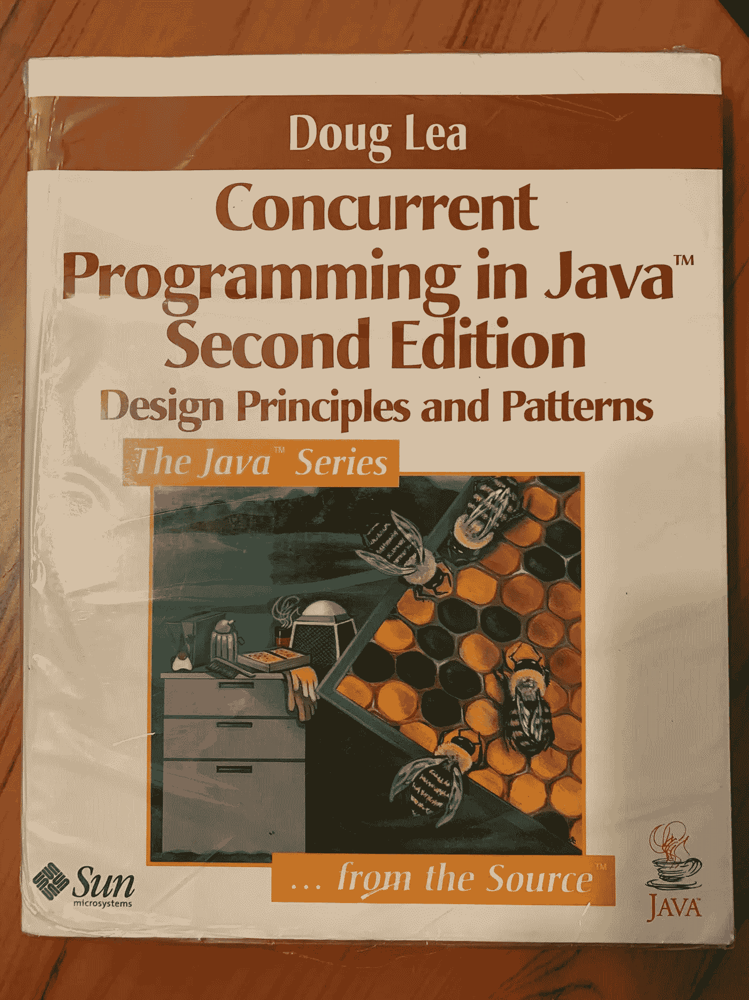
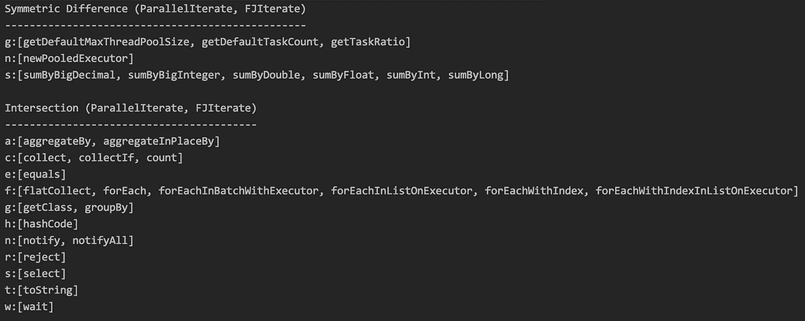
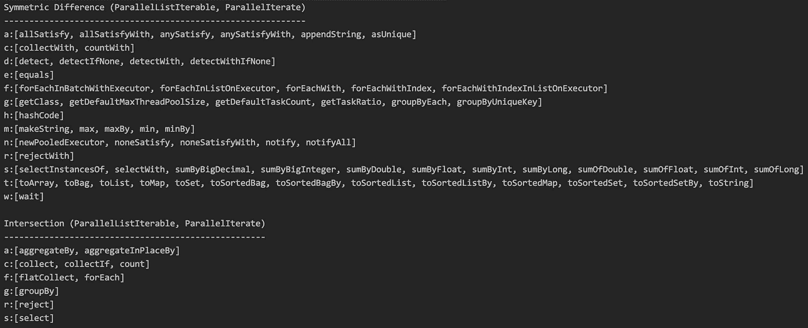
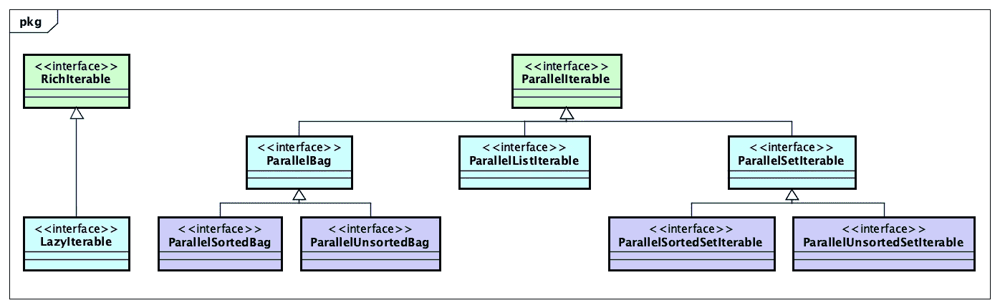
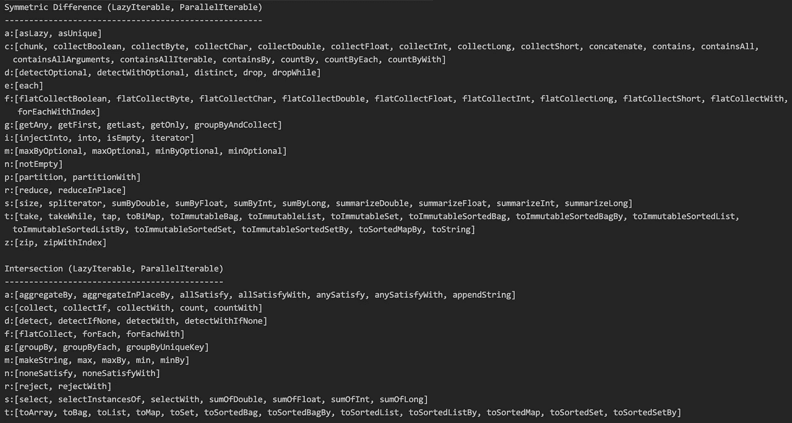
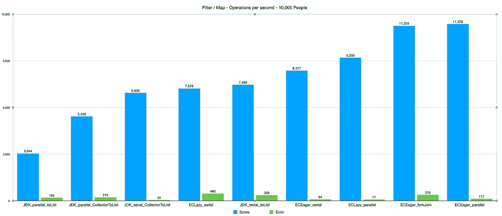
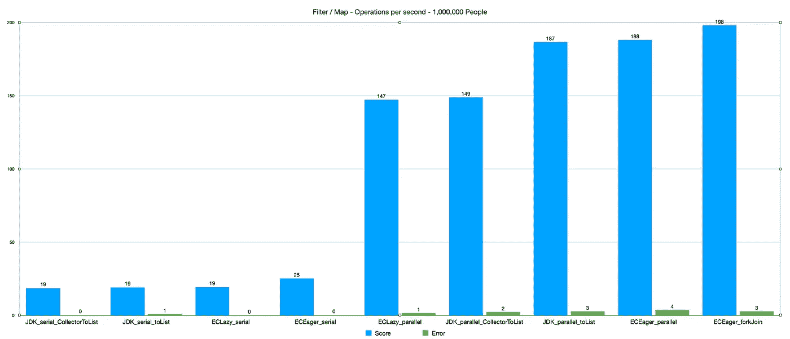
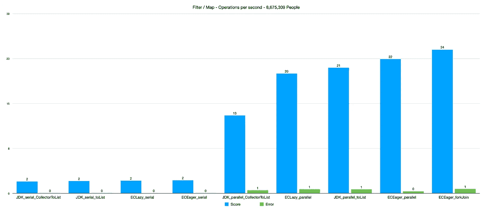

# Eclipse 集合的无与伦比的设计

> 原文：<https://medium.com/javarevisited/the-unparalleled-design-of-eclipse-collections-e4340b00f79f?source=collection_archive---------1----------------------->

探索 [Eclipse 集合中并行性的进化设计](https://github.com/eclipse/eclipse-collections)


照片由 [Jason Yuen](https://unsplash.com/@fanfandyuen?utm_source=medium&utm_medium=referral) 在 [Unsplash](https://unsplash.com?utm_source=medium&utm_medium=referral) 拍摄

# 大量数据、内存和内核

2006 年，我在一家大型金融服务公司从事专有分布式 Java 缓存架构的工作。我们在内存中的一个复杂对象图中缓存并索引了公司的所有交易和头寸，这样我们就可以高速分割它。此时，我已经构建并广泛利用了一个名为 Caramel 的内部库的串行 eager API。这个库最终成为我们现在所知的 [Eclipse 集合](https://github.com/eclipse/eclipse-collections)。

在 2006 年我工作的地方，我们有许多大小为几十亿字节的缓存，联网在一起。有许多大型集合(数百万个对象),我们将在内存中迭代执行各种流水线计算，这些计算通常涉及分组、结网和聚合各种余额。



大约在这个时候，我在最初的`EDU.oswego`并发实用程序库中发现了 Doug Lea 的 Fork/Join 框架。当 Java 5 发布时，Fork/Join 框架最初被排除在`java.util.concurrent`之外。它后来被包含在 Java 7 中。我在 Doug Lea 的[“Java 并发编程”](https://www.oreilly.com/library/view/concurrent-programming-in/0201310090/) (CPJ)和本文[“一个 Java Fork/Join 框架”](http://gee.cs.oswego.edu/dl/papers/fj.pdf)中了解了 Fork/Join 框架。

当我写这篇博客的时候，我去书架上找我的 CPJ，当我找不到的时候，我给自己买了一本全新的。这本书是所有有志的高级 Java 开发人员的必读之作。

# 渴望串行、并行和分叉/连接

焦糖文库最初的方法都是连载的，急切的。我偶尔会添加融合的方法，将一些操作结合在一起以提高性能。比如方法`collectIf`就是`select`(含`filter`)和`collect` ( `map`或`transform`)的组合。再过几年，我们才会在 Eclipse 集合中向 API 添加惰性方法。

有关融合方法的更多信息和示例，请查看下面的博客。

</javarevisited/from-eager-to-fused-to-lazy-66450e290002>  

Caramel 中并行 API 的最初实现是热切的。今天，Eclipse 集合中仍然有一个实用程序类提供了这种急切的并行功能。这个类被命名为`ParallelIterate`。该类最初使用了来自`EDU.oswego` 并发库中的 Fork/Join 框架。在没有 Fork/Join 框架的 Java 5 中引入了`java.util.concurrent`包之后，它后来被转换成使用`Executor`。当在 Java 7 中添加 Fork/Join 框架时，一个名为`FJIterate`的新实用程序类被添加到 GS 集合中。`FJIterate`包含在 Eclipse 集合中自己的模块中，并分布在一个单独的 jar 文件中。`FJIterate`从 2013 年年中就存在了，也就是 Java 7 发布(2011 年 7 月)两年后。如果您想使用它，将需要一个额外的 Maven 依赖项。

```
<**dependency**>
    <**groupId**>org.eclipse.collections</**groupId**>
    <**artifactId**>eclipse-collections-forkjoin</**artifactId**>
    <**version**>${eclipse-collections.version}</**version**>
</**dependency**>
```

`[ParallelIterate](https://www.eclipse.org/collections/javadoc/10.4.0/org/eclipse/collections/impl/parallel/ParallelIterate.html)`和`[FJIterate](https://www.eclipse.org/collections/javadoc/10.4.0/org/eclipse/collections/impl/forkjoin/FJIterate.html)`上可用的方法几乎相同。实现非常相似，主要区别在于`ParallelIterate`使用`Executor`和`FJIterate`使用 Fork/Join 框架。使用`Executor`使`ParallelIterate`更适合一些任务。对于原始的内存计算性能，`FJIterate`有时是更好的选择。

`ParallelIterate`和`FJIterate`都是因为同样的原因建造的。我们希望获得由阵列支持的大型内存数据集的原始并行性能。这两个类都将并行执行任何`Iterable`类型的固定算法集。`ParallelIterate`和`FJIterate`的主要工具是平行的`forEach`。所有其他并行算法都是使用并行`forEach`实现的。`ParallelIterate`和`FJIterate`上的`forEach`有十二种重载形式。重载采用不同的参数，以便尽可能地给予开发人员更多的控制。这种设计的基本原理很简单。我们相信，如果有人能够证明他们将从并行性中受益，那么他们将处于最佳位置来决定如何调整各种参数，以便为他们拥有的并行用例从硬件中获取尽可能多的性能。

## 平行文学

以下是`ParallelIterate`上可用的方法。

  

## FJIterate

以下是`FJIterate`上可用的方法

  

## 平行文学与自由比率

这两个实用程序类上的方法的对称差异和交集如下。



ParallelIterate 和 FJIterate 方法的对称差和交

最大的区别是几个`sumBy`方法被添加到了`ParallelIterate`中，但没有移植到`FJIterate`中。

# 效用的无用

像`ParallelIterate`和`FJIterate`这样的实用类的缺点是方法只能返回单一类型。您只有一个选择，所以如果您想根据输入参数类型从一个方法返回不同的实现，您必须选择一个公共的父类型。`ParallelIterate`和`FJIterate`上的方法以任意一个`java.lang.Iterable`作为输入参数，返回集合的方法(例如`select`、`reject`、`collect`)不得不不幸返回`java.util.Collection`。开发人员可以通过使用同名的重载方法来控制返回类型，这些方法将目标集合作为参数。如果用作源参数的`Iterable`实现了`[BatchIterable](https://www.eclipse.org/collections/javadoc/10.4.0/org/eclipse/collections/impl/parallel/BatchIterable.html)`接口，它将为`ParallelIterate`和`FJIterate`的并行性进行优化。如果源没有实现`BatchIterable`，或者没有实现`java.util.List`，两个实用程序类都将默认在并行化之前将元素复制到一个数组中。

下面是一些使用基本形式的`select`(包含`filter`)和重载形式的`select`(接受目标集合)的`ParallelIterate`的例子。

`ParallelIterate` `select`方法的行为是返回一个类似于传入的`Iterable`类型的类型。对于一个`List`，将返回一个`List`实现。对于`Set`，返回一个`Set`实现。不幸的是，因为这个方法只能有一个签名，所以返回类型必须是最抽象的类型`Collection`。作为一个接口并不十分有用。如果我有时间重构这个实用程序，我将返回`MutableCollection`或`RichIterable`而不是`Collection`。这将使实用程序方法变得更加有用，也许只是稍微少一点无用。

# 懒惰的平行

在 Eclipse 集合中设计和实现惰性并行 API 时，我们采用了不同的方法。我们决定要求开发人员提供一个`Executor`和一个*批量大小*，而不是提供旋钮和开关的多种组合来通过重载进行配置，就像我们对并行实用程序类所做的那样。根据我们七年来支持热切并行的经验，这两个参数似乎是开发人员想要控制的最重要的配置选项。这使得 Eclipse 集合中的惰性并行 API 比 JDK 中的`parallelStream`稍难使用。这是故意的。对于开发人员来说，编写并行代码应该更加困难，因为他们首先需要确定使用并行算法是会加快还是减慢操作。如果开发人员确切地了解他们在做什么，因为他们运行了基准测试并证明并行性确实有助于特定用例的性能，那么他们将处于最佳位置来确定如何配置并行性以获得最佳性能。

eager 和 lazy 并行 API 之间的另一个更重要的区别是，算法可以通过数据结构本身用于 lazy，而不是位于像`ParallelIterate`这样的实用程序类中。

这里有一个例子，它从一百万个整数中过滤出所有的质数。我首先展示了一种流畅的方法，然后将流畅的调用分解成它们的中间结果，以展示中间返回类型。

注意有一个非常特殊的类型叫做`ParallelListIterable`，它是从`asParallel`返回的。这种类型是惰性的，所以在调用终端操作之前不会发生真正的计算。调用`select`后返回相同的类型。方法`toBag`是一个终止操作，导致一个`MutableBag`被创建。现在让我们看看如果初始集合是一个`MutableSet`而不是一个`MutableList`，我们的类型会发生什么。

注意`MutableSet`的`asParallel`的返回类型是`ParallelUnsortedSetIterable`。

## ParallelListIterable 与 parallel literable

如果我们将`ParallelListIterable`上可用的方法与`ParallelIterate`上可用的方法进行比较，就会发现在 Eclipse 集合中增加并行惰性 API 的投资明显增加了。下面显示了两者之间可用方法的对称差异和交集。



ParallelListIterable 和 ParallelIterate 方法的对称差和交

# JDK 流与平行流

你是否注意到 JDK 中`stream`和`parallelStream`的返回类型是相同的？他们都返回`Stream`。您可能认为为方法返回的实现可能是实现相同接口的不同类，但事实并非如此。`stream`和`parallelStream`都返回`ReferencePipeline.Head`的新实例。它们之间的区别是一个名为`parallel`的`boolean`参数。这意味着串行和并行代码路径混合在一起，通常在一个布尔表达式上分开，该表达式涉及对名为`isParallel`的方法的调用，其中并行可能选择不同的路径。我在`AbstractPipeline`中搜索了`isParallel`的用法，发现在父类和四个子类(`ReferencePipeline`、`IntPipeline`、`LongPipeline`、`DoublePipeline`)中有 48 种用法。

有利的一面是，带流的 JDK 中的串行惰性和并行惰性 API 是相同的。为串行和并行使用一个实现类可以保证这一点，因为它们共享完全相同的代码路径。缺点是仅仅通过阅读代码很难理解代码路径，并且很难跟踪，即使有调试器的帮助。

# Eclipse 集合并行性与并行性

我们已经看到`asParallel`的返回类型对于定义该方法的类型是协变的。返回类型将始终是`ParallelIterable`的子类型。`ParallelIterable`与`RichIterable`没有直接关系。在`RichIterable`上定义的方法`asLazy`返回一个`LazyIterable`。`LazyIterable`延伸`RichIterable`。

下面的类图显示了`RichIterable`、`LazyIterable`和`ParallelIterable`之间的继承关系。



丰富的、惰性的和并行的接口

`RichIterable`是`LazyIterable`和 Eclipse 集合中所有容器类型的父类型(例如`MutableList` / `ImmutableList`、`MutableSet` / `ImmutableSet`等)。).`LazyIterable`提供串行懒惰算法实现。

`ParallelIterable`是所有对应的并行惰性适配器的父类型。在 Eclipse 集合中，串行和并行 API 之间有明显的区别。这意味着`LazyIterable`和`ParallelIterable`之间存在不对称。这允许我们将并行 API 限制在那些如果并行化将会有合理的性能优势的算法上。这也允许串行实现尽可能简单，并且并行实现可以针对特定类型进行优化(例如，`Bag`、`List`、`Set`)。

## 可并行与可并行

与`ParallelIterable`相比，`LazyIterable`上有更多可用的方法。如果我们确定实现一个并行版本的懒惰串行方法是有必要和有好处的，那么这总是会随着时间而改变的。



可并行和可并行方法的对称差和交

# 性能基准

几年前我写了一些基准测试，比较了串行、并行、急切、懒惰、对象和基本类型的组合`filter`、`map`、`reduce`和`filter` + `map` + `reduce`。基准测试的代码和结果记录在下面的博客中。正如你将在博客中看到的，我在 JDK 8 上运行了基准测试。

</javarevisited/the-4am-jamestown-scotland-ferry-and-other-optimization-strategies-66365ac415ef>  

当我开始写这个博客时，我决定要写新的基准。我想在 JDK 17 上运行基准测试，这样我就可以看到旧的 eager parallel 和 fork/join 实用程序类如何支持 JDK 最近九个版本中的所有优化。我还想让基准测试代码立即开源，供开发人员自己进行实验，并在他们自己的硬件上得出他们自己的结论。基准是 [BNYM Code Katas repo](https://github.com/BNYMellon/CodeKatas) 中 JMH Kata 模块的一部分。这次我关注的是`filter` + `map`的一个用例。在名为`collectIf`的`ParallelIterate`和`FJIterate`实用程序类上有一个用于`filter` + `map`的融合方法。该方法也可用于

<https://github.com/BNYMellon/CodeKatas/blob/master/jmh-kata/src/test/java/bnymellon/codekatas/jmhkata/FilterMapJMHBenchmark.java>  

JMH 式是我所说的“沙盒式”。您可以将它作为一个沙箱来运行您自己的实验，测试您自己的基准。它可以运行一些初级的 JMH 基准测试，并节省您设置项目做同样事情的时间。

## 五金器具

我使用我的 MacPro“垃圾桶”和以下硬件规格来测量基准:

```
Processor Name: 12-Core Intel Xeon E5
Processor Speed: 2.7 GHz
Number of Processors: 1
Total Number of Cores: 12
L2 Cache (per Core): 256 KB
L3 Cache: 30 MB
Memory: 64 GB
```

## 软件和基准配置

我将 OpenJDK 17 与 Java Streams 和 Eclipse Collections 11.0.0.M2 一起使用。我使用 1.33 版作为测试的基准工具。我运行了 10 次预热迭代，10 次测量迭代使用了 2 个分叉。预热时间和测量时间都是 5 秒。我在测试中使用了`Mode.Throughput` ,以便于阅读。这些数字是以每秒操作数为单位的。 ***数字越大，结果越好。***

## 数据

我使用一个名为`Person`的简单类运行基准测试。`Person`有`name`(`String`)`age`(`int`)`heightInInches`(`double`)`weightInPounds`(`double`)。我运行了以下数据大小的基准测试。

*   `10,000`(过滤器和映射`4,995`值)
*   `100,000`(过滤器和映射`49,942`值)
*   `1,000,000`(过滤器和映射`499,615`值)
*   `8,675,309`(过滤器和映射`4,337,179`值)

## 排行榜

我将图表中的列从最少到最多排序，因此很容易找到最慢(最左边)和最快(最右边)的结果。因此请注意，对于不同的数据大小，列可能会有所不同。

## 结果— 10K 人

最快并行:Eclipse 集合渴望并行(`ParallelIterate` )
最慢并行:JDK 并行`Stream.toList()`

最快连载:Eclipse Collections 急切连载
最慢连载:JDK 连载流`Collectors.toList()`



过滤器/地图—每秒操作数— 10，000 人

## 结果— 10 万人

最快并行:Eclipse 集合渴望并行(`ParallelIterate` )
最慢并行:JDK 并行流`Collectors.toList()`

最快连载:Eclipse Collections 急切连载
最慢连载:JDK 连载流`Collector.toList()`


过滤器/地图—每秒操作数— 100，000 人

## 结果——100 万人

最快的并行:Eclipse 集合渴望 Fork/Join ( `FJIterate` )
最慢的并行:Eclipse 集合懒惰`asParallel()`

最快连载:Eclipse Collections 渴望连载
最慢连载:JDK 连载流`Collector.toList()`



过滤器/地图-每秒操作数-100 万人

## 结果——8，675，309 人

最快并行:Eclipse Collections Eager Fork/Join(`FJIterate`)
最慢并行:JDK 并行流`Collectors.toList()`

最快连载:Eclipse Collections 渴望连载
最慢连载:JDK 连载流`Collectors.toList()`



过滤器/地图-每秒操作数-8，675，309 人

## 结果— JMH 输出

下面是上图中使用的原始综合 JMH 输出。还有三个我测试过的大码(`25M`、`50M`、`100M`)，我没有包括它们的图表。我不得不在它们上从每秒操作数切换到每毫秒操作数，所以我不想让图形变得混乱。对于特大尺寸， ***数字越小越好*** 。大数据量的结果与 Eclipse 集合 Eager Fork/Join ( `FJIterate`)是并行最快的一致。Eclipse Collections Eager Serial 是除最大测试之外所有测试中最快的，其中 JDK Serial `Stream.toList()`名列榜首。

# 一些经验教训

在 Eclipse 集合中构建并行 eager 实用程序类超过 15 年之后，我学到了一些东西。我已经忘记了一路上学到的一些经验，但是写这篇博客帮助我在编写代码的时候重新发现了其中的一些。编写高效的并行算法是极其艰苦的工作，您将花费大量时间运行和重新运行基准测试。这是一个兔子洞，如果你掉进去了，你会损失几天或几周的寿命。

有时，您可以针对特定的急切算法进行性能调优，这样与更一般的懒惰算法相比，您可能会获得 5%、10%甚至 20%的加速。如果性能对你真的很重要，那么你可能会发现用较低层次的框架如 Fork/Join 或 Executors 来实现特定的用例是有益的。有时，甚至使用更高级的结构手工编写一个算法，比如具有高效并发数据结构的 parallel `forEach`,也会有很好的回报。

2013 年，购买一台拥有足够数量的内核和 RAM 的个人台式机，我可以对其运行并行基准测试，这似乎是对 Eclipse 集合的一项不错的长期投资。回想起来，我认为这是一笔不错的投资，因为这些年来我一直用这台机器为各种演讲和博客准备基准。我的计划是，在 10 年过去之前，甚至不再考虑升级我的个人电脑。令人惊讶的是，即使在笔记本电脑和台式机中出现了多核的所有承诺，直到最近，我们才看到内核和 RAM 的数量以不到一个完全离谱的价格出现了像样的增长，就像我在 2013 年为我的 Mac Pro“垃圾桶”支付的费用一样。

尽管这些年来我在 MacPro 上运行了很多基准测试，但实际上我并没有对 Eclipse 集合中的任何并行算法进行太多的调优。我之前在以前的雇主那里用一台非常大的机器(24 个内核，256GB RAM)测试过 Eclipse 集合。我们已经看到了我们实现的许多并行急切和懒惰算法的良好加速。正如我上面提到的，我们的并行懒惰算法比并行渴望算法实现得更晚，但自 2014 年末以来也没有真正调整过。 [Craig Motlin](https://medium.com/u/82b613b921f6?source=post_page-----e4340b00f79f--------------------------------) 在 2014 年 6 月做了一个关于 Eclipse 集合并行惰性实现方法的精彩演讲。它对三种不同的实现(Java 8，Scala，Eclipse Collections，以前的 GS Collections)如何针对特定的并行算法进行调优做了很好的解释和总结。我将把它链接到这里，给那些想学习并行算法优化策略的人。

<https://www.infoq.com/presentations/java-streams-scala-parallel-collections/>  

# 未来

既然 JDK 17 已经发布，而且市场上有新的、更便宜的具有更多内核的机器，那么再次测试和调整 Eclipse 集合中的并行算法可能是值得的。扩展当前的并行惰性实现可能也是有用的。对于一些并行用例来说，Java 流似乎正在改进，并且可能仍然会受益于 Eclipse Collections 用来优化特定算法(如`filter`和`map`)的方法。克雷格在上面的演讲中描述了我们使用的方法，所以这绝对值得一看。通常未来可以从过去的经验中获益。

我想重构和清理 Eclipse 集合中的并行 eager 实现，并改善`ParallelIterate`和`FJIterate`之间的对称性。我想做的最大改变是将返回类型从`Collection`改为`RichIterable`或`MutableCollection`。在`ParallelIterate`和`FJIterate`中。

我也希望看到一些人抓住机会继续从事 Eclipse 集合的并行惰性实现的工作。正如我在上面展示的`LazyIterable`和`ParallelIterable`之间的区别一样，还有很多方法没有添加进来。改善对称性有成本也有好处。到目前为止，添加更多并行方法的成本已经超过了收益，这就是为什么我们没有在这个领域做更多的工作。但是对于合适的人来说，他们可能会尝试并行编程，可能会用 M1 Max 测试他们新买的 MacBook Pro 中的所有内核，学习如何构建优化的并行算法的好处可能会超过成本。

我相信并行编程对于更多的 Java 开发人员来说会变得越来越重要。学习如何有效地编程和调优并行算法将是许多开发人员需要学习的内容。来自道格·李的《CPJ》和布莱恩·戈茨的《实践中的 Java 并发》( [JCIP](https://jcip.net/) )等书籍的知识和经验将变得重要和受欢迎。现在我有了我的第二本全新的《CPJ 》,还有我之前签名的《JCIP 》,我准备重新学习并发和并行的课程。

# 最后的想法

我写这个博客的目的是分享我从过去 15 年中学到的一些教训，否则这些教训可能会被发现或完全遗忘。我怀疑大多数使用 Eclipse 集合的开发人员在阅读这篇博客之前会钻研库中可用的并行算法。我希望一些 Java 开发人员阅读这篇博客，并发现它有助于帮助他们了解更多他们以前可能不知道的并行编程方法。如果你读了它并且喜欢它，你可以通过鼓掌和/或评论让我知道。我通常不喜欢在博客中包含微基准，但我认为人们会发现它们足够有趣，足以开始调查和了解更多。带着巨大的怀疑和两磅的怀疑来接受我的基准。我不建议根据它们做任何决定。我强烈建议为您自己的特定用例编写您自己的应用程序基准，并自行确定某个特定方法是否会帮助您实现更好或更差的性能。正如我在上面链接的博客中所推荐的:

> 先证明再并行。

感谢阅读！

*我是*[*Eclipse Collections*](https://github.com/eclipse/eclipse-collections)*OSS 项目在*[*Eclipse Foundation*](https://projects.eclipse.org/projects/technology.collections)*的项目负责人。* [*月食收藏*](https://github.com/eclipse/eclipse-collections) *是开投* [*投稿*](https://github.com/eclipse/eclipse-collections/blob/master/CONTRIBUTING.md) *。如果你喜欢这个库，你可以在 GitHub 上让我们知道。*