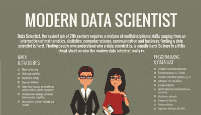
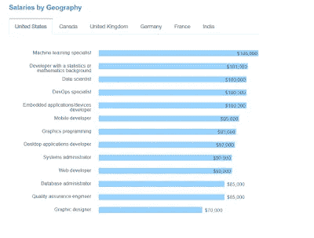

# 2023 年，薪酬最高的 10 项技术工作程序员可以提高他们的薪酬

> 原文：<https://medium.com/javarevisited/these-are-the-highest-paying-tech-jobs-programmers-can-aim-to-increase-their-pay-c59e1eeb6904?source=collection_archive---------0----------------------->

## 通过资源链接学习这些工作所需的技能

米娅·贝克在 [Unsplash](https://unsplash.com?utm_source=medium&utm_medium=referral) 上拍摄的照片

如果你是一名计算机科学毕业生，或者正在考虑在软件开发领域发展事业的人，或者是一名有经验的程序员，正在考虑他的下一个职业发展，但不太确定你应该去哪个领域，那么你来对地方了。

在这篇文章中，我将告诉你**收入最高的 13 个技术工作**，你可以瞄准它们来增加你的薪水和报酬。

你所需要的只是一些编程经验和学习热情。特别是机器学习和数据科学领域，对于初学者和有经验的程序员来说，看起来都非常有前途。

平均而言，一个机器学习专家和数据科学家的收入在 11 万到 12 万美元之间，对他们的需求很大，如果你有兴趣解决现实世界的问题，他们会提供一个令人兴奋的机会。

作为人类，我们总是对程序员和技术人员的工资感到好奇。开发人员抱怨 QA 的工资比他们高，QA 的人说开发人员的工资比他们高。

也有可能坐在你旁边的程序员会比你得到更多，即使他经验更少。[软件开发](https://dev.to/javinpaul/10-things-every-software-developer-should-know-39pe)行业就是这样；谈到薪水，没有标准的规则。

事实上，有更多的例外，但一些技术专家比其他人支付更多也是事实。

我曾经在与招聘人员和招聘经理进行谈判之前，检查 [Glassdoor](https://medium.com/u/a39c61f8b573?source=post_page-----8d72b6b1861c----------------------) 以了解特定技术上的特定工作职位的平均工资，但老实说；它们没有你想象的那么准确。它们充其量只是提供了一个好的基线和一个想法，仅此而已。

相反，我比任何人都更信任 StackOverflow 开发人员调查数据。我一直在看他们的调查，我已经了解了不少关于流行的[技术](http://www.java67.com/2018/01/top-10-web-mobile-and-big-data-framework-libraries-technologies-programmers-should-learn-in-2018.html)、[框架](http://javarevisited.blogspot.sg/2018/01/10-frameworks-java-and-web-developers-should-learn.html)、[库](http://javarevisited.blogspot.sg/2018/01/top-20-libraries-and-apis-for-java-programmers.html)和[编程语言](http://javarevisited.blogspot.sg/2015/07/5-programming-language-every-programmer-learn.html)的事情。在当前的世界里，这篇文章将关注那些你可以把你的职业生涯带到下一个层次的高薪工作。

# 2023 年 13 个薪酬最高的技术工作

这是我列出的薪酬最高的技术工作，包括机器学习专家、 [DevOps 专家、](http://www.java67.com/2018/02/5-free-docker-courses-for-java-and-DevOps-engineers.html)、 [Web 开发人员、](http://javarevisited.blogspot.sg/2018/01/10-frameworks-java-and-web-developers-should-learn.html)、[数据库管理员、](https://javarevisited.blogspot.com/2018/05/top-5-sql-and-database-courses-to-learn-online.html)、系统管理员、[移动开发人员、](https://hackernoon.com/top-5-react-native-courses-for-mobile-application-developers-b82febdf8a46)、图形设计师、质量保证工程师和其他软件技术专业人员。

## 1.机器学习专家

在美国，机器学习专家的平均工资约为 108，000 美元，是各种技术工作中最高的。

许多初创公司，例如优步和大型科技公司，如[谷歌](https://javarevisited.blogspot.com/2012/01/google-interview-questions-answers-top.html)和[微软](https://javarevisited.blogspot.com/2015/12/30-microsoft-interview-questions-for-software-development-engineers.html)，都在寻找机器学习专家来支持自动驾驶汽车等最新创新。

老实说，这是一个研究和编程完美结合的领域，我将在这方面花很多时间。

如果你想成为机器学习专家，建议你通过 [**使用 Python 的机器学习和 R 课程**](https://click.linksynergy.com/fs-bin/click?id=JVFxdTr9V80&subid=0&offerid=323058.1&type=10&tmpid=14538&RD_PARM1=https%3A%2F%2Fwww.udemy.com%2Fmachinelearning%2F) 。它提供了机器学习技术的全面概述。

而且，如果你需要更多的选择，那么你也可以在 **#DevTO** 上查看这个[十大数据科学和机器学习课程的列表](https://dev.to/javinpaul/10-data-science-and-machine-learning-courses-for-programmers-looking-to-switch-career-57kd)

## 2.具有统计学和数学背景的开发人员

在当今以数据为导向的世界中，具有良好的统计和数学背景的人将会很受欢迎，这一点在本次调查中也很明显。

这是美国收入第二高的工作。具有统计或数学背景的开发人员的平均工资约为 101，000 美元，我相信这一数字在未来几年还会增长更多。

如果你从事数据分析业务，那么提高你的统计和数学技能也将对你的职业生涯有很大帮助，如果你想提高你的数据分析数学和统计技能，我建议你参加杜克大学[Coursera](https://medium.com/u/f69fb1ad537a?source=post_page-----8d72b6b1861c----------------------)的[Coursera](https://medium.com/u/99c0fb464c1f?source=post_page-----8d72b6b1861c----------------------)上的[和**统计，这将帮助你掌握统计，包括推理、建模和贝叶斯方法。**](https://click.linksynergy.com/deeplink?id=JVFxdTr9V80&mid=40328&murl=https%3A%2F%2Fwww.coursera.org%2Fspecializations%2Fstatistics)

<https://www.coursera.org/specializations/statistics?ranMID=40328&ranEAID=JVFxdTr9V80&ranSiteID=JVFxdTr9V80-1ByOY2S1l0HqhLovbeFaAg&siteID=JVFxdTr9V80-1ByOY2S1l0HqhLovbeFaAg&utm_content=10&utm_medium=partners&utm_source=linkshare&utm_campaign=JVFxdTr9V80>  

如果你发现 Coursera 的课程很有用，因为它们是由世界各地知名的公司和大学创建的，我建议你加入 Coursera PlusT3 的[课程，这是 Coursera 的一个订阅计划，让你可以无限制地访问他们最受欢迎的课程、专业、专业证书和指导项目。它每年花费大约 399 美元，但它完全值得你的钱，因为你可以获得无限的证书。](https://click.linksynergy.com/deeplink?id=JVFxdTr9V80&mid=40328&murl=https%3A%2F%2Fwww.coursera.org%2Fcourseraplus)

## 3.数据科学家

被大肆宣传的数据科学工作在高薪工作中排名第三。它被吹捧为这十年来最令人兴奋的工作之一，既有令人兴奋的工作，又有令人难以置信的报酬。

数据科学家的平均工资约为 100，000 美元，如果与应用程序开发人员(如 Java 开发人员)相比，这是非常不错的，这也是我的许多朋友通过在线课程学习数据科学以转向更有回报的数据科学家职业的原因。

如果你也是这种情况，我建议你去看看 Udemy 上关于如何成为一名数据科学家的 [**数据科学课程**](https://click.linksynergy.com/fs-bin/click?id=JVFxdTr9V80&subid=0&offerid=323058.1&type=10&tmpid=14538&RD_PARM1=https%3A%2F%2Fwww.udemy.com%2Fdatascience%2F) 。它还很好地概述了学习数据科学并在这个利润丰厚的领域找到工作需要什么。

如果你需要更多的选择，如果你不介意从免费资源中学习，那么你也可以查看这个 [**数据科学和机器学习课程**](https://javarevisited.blogspot.com/2018/03/top-5-data-science-and-machine-learning-online-courses-to-learn-online.html) 的列表。

## 4.DevOps 工程师

这是另一个令人兴奋的职业，尤其是对有经验的程序员来说。DevOps 专家的需求量很大，更侧重于自动化。

DevOps 运动的主要特征是强烈提倡从集成、测试到部署的软件开发的所有步骤的自动化和监控。

全球 DevOps 专家的平均工资约为 10 万美元，是各种编程工作中最高的。

如果你想成为 DevOps 专家，那么 [**学习 DevOps:在**](https://click.linksynergy.com/deeplink?id=JVFxdTr9V80&mid=39197&murl=https%3A%2F%2Fwww.udemy.com%2Flearn-devops-the-complete-kubernetes-course%2F) **[Udemy](https://medium.com/u/b32aa0132f1b?source=post_page-----8d72b6b1861c----------------------) 上的完整 Kubernetes** 课程是一个很好的起点。Udemy 现在也在销售，你只需花 10.99 美元就可以获得这门课程，几乎是免费的。

如果你需要更多的选择，也可以看看我列出的 [**10 个 DevOps 课程给有经验的开发者**](https://javarevisited.blogspot.com/2018/09/10-devops-courses-for-experienced-java-developers.html) **。**

此外，如果您需要指导，那么这个 [DevOps 路线图](https://hackernoon.com/the-2018-devops-roadmap-31588d8670cb?gi=8829080e6d7d)完全可以遵循:

<https://javarevisited.blogspot.com/2018/09/the-2018-devops-roadmap-your-guide-to-become-DevOps-Engineer.html>  

## 5.嵌入式应用开发人员

这是一个非常专业的工作，但是似乎很需要在嵌入式 Linux 和嵌入式 c 语言方面有丰富开发经验的程序员。

在美国，嵌入式应用/设备开发人员的平均工资是 10 万美元，这是第四高工资的工作。

如果你对嵌入式软件开发感兴趣，我建议你通过 [**掌握带嵌入式驱动开发的微控制器**](https://click.linksynergy.com/fs-bin/click?id=JVFxdTr9V80&subid=0&offerid=323058.1&type=10&tmpid=14538&RD_PARM1=https%3A%2F%2Fwww.udemy.com%2Fmastering-microcontroller-with-peripheral-driver-development%2F) 课程来了解更多关于这个领域的知识。

## 6.移动应用开发者

在美国，移动开发人员的平均工资约为 95000 美元，高于网络开发人员，但低于数据科学家 T21 和开发专家 T23。

如果你想成为一名移动开发者，那么根据你的背景，你可以学习 Android 或者 iOS。我建议 Java 开发者用 Android，C/C++开发者用 iOS。

如果你决定学习 Android，可以查看 Udemy 上 Rob Percival 的 [**完整的 Android N 开发者课程**](https://click.linksynergy.com/fs-bin/click?id=JVFxdTr9V80&subid=0&offerid=323058.1&type=10&tmpid=14538&RD_PARM1=https%3A%2F%2Fwww.udemy.com%2Fcomplete-android-n-developer-course%2F) ，如果你想成为世界级的 iOS 开发者，建议你看看 Udemy 的这个 [**iOS 12 和 Swift 4 master class**](https://click.linksynergy.com/deeplink?id=JVFxdTr9V80&mid=39197&murl=https%3A%2F%2Fwww.udemy.com%2Fios-12-app-development-bootcamp%2F)**by**Angela Yu**课程。**

****

**并且，如果你需要更多的自由选择，那么这些[免费 Android](https://www.java67.com/2019/01/top-5-free-android-app-development-courses-for-programmers.html) 和 [iOS 课程](https://javarevisited.blogspot.com/2018/11/5-free-ios-app-development-courses-for.html)的 lits 也是不错的开始。**

## **7.图形编程**

**这是你在技术领域能找到的最安全的工作之一，因为你的团队总是需要一个图形程序员。**

**美国一个图形程序员的平均工资在 93000 美元左右，相比 [Java](https://javarevisited.blogspot.com/2017/12/10-things-java-programmers-should-learn.html#axzz53ENLS1RB) 或者 [Web 开发者](https://hackernoon.com/12-frameworks-java-web-developers-should-learn-in-2018-edae59315244)已经很不错了。**

**不幸的是，学习图形编程需要付出大量的努力:需要积累大量的背景知识(尤其是数学知识)，需要投入大量的编程实践时间，还需要学习大量的图形技术，这每年都会增加新的、更为复杂的层次。**

**如果你想学习更多关于图形编程和设计的知识，那么 [Coursera](https://medium.com/u/99c0fb464c1f?source=post_page-----c59e1eeb6904--------------------------------) 上的[图形设计专精](https://click.linksynergy.com/deeplink?id=JVFxdTr9V80&mid=40328&murl=https%3A%2F%2Fwww.coursera.org%2Fspecializations%2Fgraphic-design)是可以查阅的综合资源之一。**

****

## **8.桌面应用开发人员**

**如果你认为 Web 已经扼杀了桌面应用程序开发，那你就错了，它们仍然生机勃勃。**

**在美国，一名桌面应用程序开发人员的平均收入约为 92，000 美元，高于网络开发人员的平均工资。**

**如果你热爱桌面应用程序编程，并想成为一名桌面应用程序开发人员，我建议你加入 [**电子桌面应用程序:完整的开发人员指南**](https://click.linksynergy.com/deeplink?id=JVFxdTr9V80&mid=39197&murl=https%3A%2F%2Fwww.udemy.com%2Fcourse%2Felectron-react-tutorial%2F) 课程(在 [Udemy](https://medium.com/u/b32aa0132f1b?source=post_page-----c59e1eeb6904--------------------------------) 上)**

**<https://click.linksynergy.com/deeplink?id=JVFxdTr9V80&mid=39197&murl=https%3A%2F%2Fwww.udemy.com%2Fcourse%2Felectron-react-tutorial%2F> ** 

## **9.系统管理员**

**我一直以为系统管理员或者 sysadmin 比应用开发员工资高，其实不是这样。**

**根据这项调查，系统管理员和网站开发者赚的钱是一样的。**

**美国一个系统管理员的平均工资在 9 万美元左右，和一个 Web 开发人员差不多。**

**如果你有兴趣成为一名系统管理员，特别是 Linux 系统管理员，那么我建议你参加 Pluralsight 上的 [**Linux 系统管理基础**](https://pluralsight.pxf.io/c/1193463/424552/7490?u=https%3A%2F%2Fwww.pluralsight.com%2Fcourses%2Flinux-system-administration-fundamentals) 课程。从 Linux 中的系统管理开始是一门极好的课程。**

****

**顺便说一下，你需要一个 [Pluralsight 会员](https://pluralsight.pxf.io/c/1193463/424552/7490?u=https%3A%2F%2Fwww.pluralsight.com%2Fpricing)才能加入这个课程，费用大约是每月 29 美元或每年 299 美元(14%的折扣)。我强烈推荐这个订阅，因为它促进了你的学习，作为一个程序员，你总是需要学习新的东西。或者，你也可以使用他们的 [**10 天免费通行证**](https://pluralsight.pxf.io/c/1193463/424552/7490?u=https%3A%2F%2Fwww.pluralsight.com%2Flearn) 免费观看本课程。**

## **10.Web 开发人员**

**最后，使用最新技术如 [Angular](http://www.java67.com/2018/01/top-5-free-angular-js-online-courses-for-web-developers.html) 、 [React](https://javarevisited.blogspot.com/2018/08/top-5-react-js-and-redux-courses-to-learn-online.html) 以及古老技术如 [Ruby](http://www.java67.com/2018/02/5-free-ruby-and-rails-courses-to-learn-online.html) 和 [PHP](http://www.java67.com/2018/02/5-free-php-and-mysql-courses-for-web-developers.html) 的 Web 开发人员。**

**在美国，网页开发人员的平均工资约为 9 万美元，高于数据库管理员、质量保证员和图形设计师，但低于 Linux 和 Windows 系统管理员和数据科学家。**

**如果你想学习 web 开发并成为一名 web 开发人员，那么 [Colt_Steele](https://medium.com/u/b74a1e474498?source=post_page-----8d72b6b1861c----------------------) 的 [**Web 开发人员训练营**](https://click.linksynergy.com/fs-bin/click?id=JVFxdTr9V80&subid=0&offerid=323058.1&type=10&tmpid=14538&RD_PARM1=https%3A%2F%2Fwww.udemy.com%2Fthe-web-developer-bootcamp%2F) 是一个很好的地方。**

****

## **11.数据库管理员或 DBA**

**DBA 是传统的工作之一，有很多工作保障，没有太多学习挑战。**

**在美国，数据库管理员的平均工资约为 85，000 美元，预计低于 Web 开发人员，但高于 QA 工程师和图形设计师。**

**如果你想了解更多关于数据库管理的知识，建议你通过 [**Oracle DBA 11g/12c —初级 DBA 数据库管理**](https://click.linksynergy.com/fs-bin/click?id=JVFxdTr9V80&subid=0&offerid=323058.1&type=10&tmpid=14538&RD_PARM1=https%3A%2F%2Fwww.udemy.com%2Foracledbatraining%2F) **。****

**这将教你如何在 6 周内成为一名 Oracle 数据库管理员(DBA)，并作为初级 DBA 获得一份高薪工作。**

****

## **12.质量保证工程师(QA)**

**QA 工程师的平均工资约为 85，000 美元，在许多地理位置上高于平面设计师和移动开发人员，但在美国，他们仅高于平面设计师。**

**同样是开发人员的 QA 工程师往往比那些只做手工测试的人挣得更多。**

**我认识几个 QA 人员，他们有一些自动化测试经验，知道他们的工具，比如 Selenium 和 making good money。**

**因此，如果你是一名 QA 工程师，我强烈建议你转向自动化测试，至少学习 Selenium， [Selenium Masterclass](https://click.linksynergy.com/fs-bin/click?id=JVFxdTr9V80&subid=0&offerid=323058.1&type=10&tmpid=14538&RD_PARM1=https%3A%2F%2Fwww.udemy.com%2Fselenium-with-c%2F) 是一个很好的起点。**

****

## **13.美术设计员**

**美国图形设计师的平均工资约为 70，00 美元，与[的数据科学家](https://dev.to/javinpaul/10-data-science-and-machine-learning-courses-for-programmers-looking-to-switch-career-57kd)和[的开发专家](https://javarevisited.blogspot.com/2018/09/10-devops-courses-for-experienced-java-developers.html)相比并不算高，但对图形设计师的需求总是存在的。**

**如果你有一些平面设计技能，那么你也可以做很多报酬不错的在线工作。**

**如果你想成为一名平面设计师，那么我建议你去参加 Udemy 上的 [**成为专业平面设计师**](https://click.linksynergy.com/fs-bin/click?id=JVFxdTr9V80&subid=0&offerid=323058.1&type=10&tmpid=14538&RD_PARM1=https%3A%2F%2Fwww.udemy.com%2Fbecome-a-professional-graphic-designer-udemy%2F) 课程。它会教你如何打入平面设计的世界。**

****

**这个列表的灵感来自于 StackOverflow 的开发者调查，该调查提供了对软件行业的深刻见解，我强烈建议你参与 StackOverflow 的调查并提供你的意见。通过这种方式，我们不仅帮助了他人，还了解了哪些因素有助于做出正确的职业决策。**

****

**以上是关于**薪酬最高的编程工作**。对于那些正在考虑换工作并希望探索更令人兴奋的领域(如 [DevOps](https://javarevisited.blogspot.com/2018/09/the-2018-devops-roadmap-your-guide-to-become-DevOps-Engineer.html) 、机器学习和数据科学)的程序员来说，这是一个很好的列表。DevOps 和机器学习专家以及数据科学家往往拥有全球最高的薪酬，如果你今年正在考虑薪酬，这些可能是你应该瞄准的工作。**

**其他**编程篇**你可能喜欢的
[初学 Python 的 10 个理由](https://javarevisited.blogspot.com/2018/05/10-reasons-to-learn-python-programming.html)
[你可以学习的 10 种编程语言](http://www.java67.com/2017/12/10-programming-languages-to-learn-in.html)
[每个 Java 开发者都应该知道的 10 种工具](http://www.java67.com/2018/04/10-tools-java-developers-should-learn.html)
[学习 Java 编程语言的 10 个理由](http://javarevisited.blogspot.sg/2013/04/10-reasons-to-learn-java-programming.html)
[Java 和 Web 开发者应该学习的 10 个框架](http://javarevisited.blogspot.sg/2018/01/10-frameworks-java-and-web-developers-should-learn.html)
[成为更好的 Java 开发者的 10 个技巧](http://javarevisited.blogspot.sg/2018/05/10-tips-to-become-better-java-developer.html)
[前 5 大 Java 框架要 测试库每个 Java 开发者都应该知道的](http://javarevisited.blogspot.sg/2018/04/top-5-java-frameworks-to-learn-in-2018_27.html)
[2023 年 Web 开发者路线图(前端+后端)](https://dev.to/javinpaul/the-2019-web-development-frontend-backend-roadmap-4le2)
[每个软件开发者都应该知道的 10 件事](https://dev.to/javinpaul/10-things-every-software-developer-should-know-39pe)**

**感谢您阅读本文。如果你喜欢这篇文章，那么请分享给你的朋友和同事。如果您有任何问题或反馈，请留言。**

## **你可能喜欢的其他媒体文章**

**</hackernoon/the-2018-devops-roadmap-31588d8670cb>  </hackernoon/the-2019-web-developer-roadmap-ab89ac3c380e>  </javarevisited/top-10-coursera-certificates-to-start-your-career-in-cloud-data-science-ai-mainframe-and-it-558690c83587> **