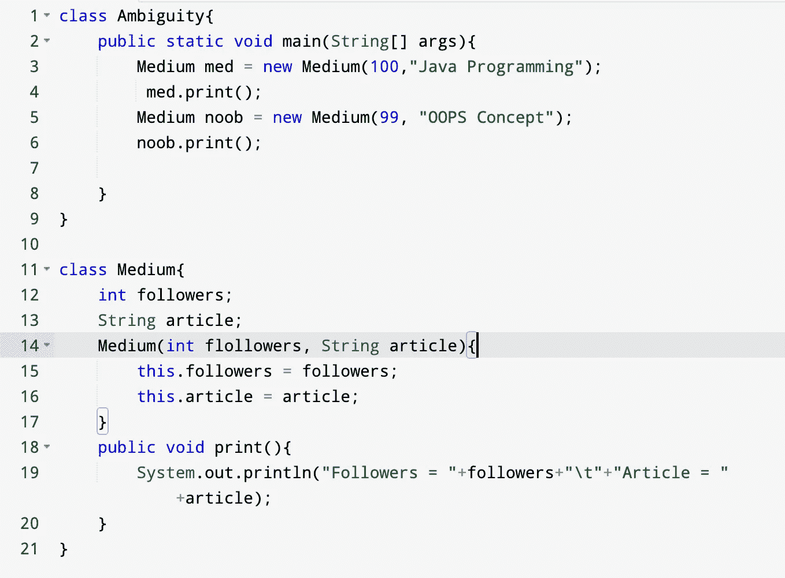

# Java 中的“this”关键字

> 原文：<https://medium.com/javarevisited/this-keyword-in-java-e4718aa153f2?source=collection_archive---------2----------------------->

假设我们有一个程序，它与局部和类级变量范围内的变量同名。

```
class Ambiguity {
    public static void main(String[] args) {
        Opinion op = new Opinion();
        op.print();
    }
}

class Opinion{
    int opt = 10;
    public void print(){
        String opt = "Make an opinion";
        System.out.println(opt);
    }
}
```

所以当你运行这段代码时，你会发现输出是:发表意见。


程序的输出

为了访问类级变量，我们在 java 中使用了“ [this”。“this”是一个关键字，在 java 中充当引用变量。它包含当前对象的地址，因为它也是一个实例引用变量，这是它不能从静态上下文中寻址的原因。](http://www.java67.com/2013/06/difference-between-this-and-super-keyword-java.html)

现在让我们举一个新的例子来深入理解“this”关键字

```
class Ambiguity{
    public static void main(String[] args){
        Medium med = new Medium(100,"Java Programming");
         med.print();
        Medium noob = new Medium(99, "OOPS Concept");
        noob.print();

    }
}

class Medium{
    int followers;
    String article;
    Medium(int flollowers, String article){
        this.followers = followers;
        this.article = article;
    }
    public void print(){
        System.out.println("Followers = "+followers+"\t"+"Article = "+article);
    }
}
```

为了更好地理解这一点，我们将截取一个给出行号的截图。



因此，从主方法开始，正如我们在屏幕截图中看到的，med 是一个对象，它将 100 和“java 编程”作为参数传递给第 14 行中的双参数构造函数，并为其设置传递值。

现在在第 14 行，我们已经将以下值作为 Medium(100，“Java 编程”)传递，现在在下一行，我们使用这个关键字来引用类级别的变量，并将其值设置为 100。

这个。追随者->空

但是如果你这样写. follower = follower——它将类级别的实例变量设置为 100。Article 也是如此。

从这里我们可以说我们可以使用相同的名字作为局部变量和实例变量。当我们直接访问任何变量时，会发生以下情况:

1.  检查该变量是否在局部范围内声明。
2.  如果在局部范围内找到，将使用该变量。
3.  如果在局部范围内没有找到，则检查该变量是否在类范围内声明。
4.  如果找到了，将使用类级别的变量

当局部变量和类级变量同名时，

1.  直接引用局部变量
2.  使用“this”关键字引用类级别变量。

**注意:** ***调用到‘this’必须是构造函数中的第一条语句。***

