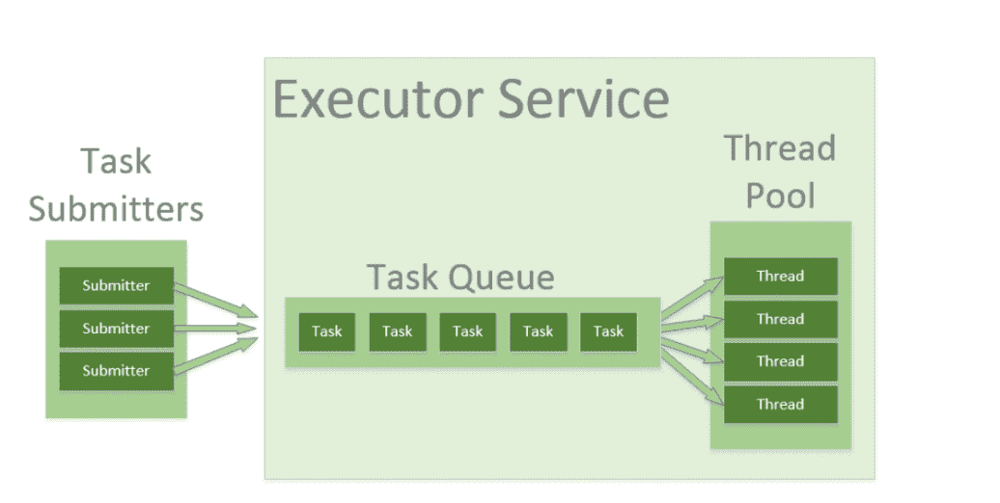
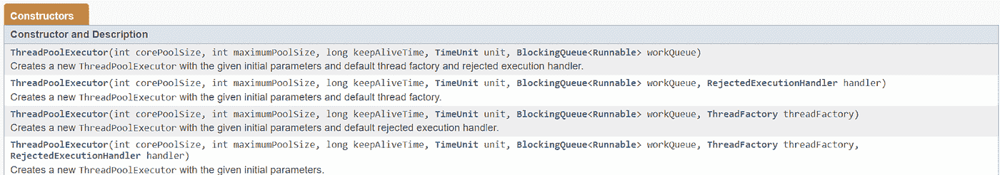

# Java 中的线程池——为什么要在一个应用程序中使用多个线程池！

> 原文：<https://medium.com/javarevisited/thread-pools-in-java-why-use-multiple-thread-pools-in-an-application-2d06d0fa4d79?source=collection_archive---------0----------------------->

线程允许程序同时并行处理不同的任务。在单线程应用程序中，只有一个线程可以执行，这意味着在任何时间点只有一个任务可以运行。

**例子**:

想想任何可以处理多个请求的服务器。以一个数据库服务器为例，它可以并发处理多个请求。如果为数据库服务器的每个请求创建一个线程，那么这个数据库将花费更多的时间来管理线程，而不是像执行 sql 那样计算业务操作。JVM 为每个请求创建线程会导致系统内存不足。

考虑一个 web 服务器应用程序，其中每个 HTTP 请求由一个单独的线程处理。如果应用程序只是为每个新的 HTTP 请求创建一个新的线程，而系统收到的请求超过了它的处理能力，那么当所有这些线程的开销超过了系统的容量时，应用程序将立即停止对所有请求的响应。由于对可以创建的线程数量的限制，应用程序不会像处理 HTTP 请求那样快地处理这些请求，但是它会以系统能够承受的速度处理这些请求。

**这就是我们有线程池的原因，这样我们可以最小化线程的管理，专注于我们的业务逻辑。**

线程池是线程的集合，可以直接处理我们分配的任务。线程也被重用来处理队列中等待的任务。



在上图中。线程池中有 4 个线程，队列中定义了 5 个任务。线程并行处理不同的任务。在任何时间点，都可能有 4 个任务在运行，因为我们有 4 个线程。因此队列中的一个任务实际上会等待被拾取。只有当 4 个线程中的任何一个在完成它们的任务后空闲时，它才会被拾取。

请记住，应用程序中的线程越多，应用程序就越耗时，因为线程管理也是一项任务。因此，线程的创建应该是一个深思熟虑的过程。

我们可以通过多种方式创建线程池:

**1。使用执行者框架:**

我将在下一篇技术文章中详细介绍 Executor 框架。

```
ExecutorService executorService = Executors.newFixedThreadPool(10);
// creates a thread pool with 10 fixed threads ExecutorService executorService = Executors.newCachedThreadPool() 
// Creates a thread pool that creates new threads as needed. This will reuse previously constructed threads when they are available.ExecutorService executorService =Executors.newSingleThreadExecutor() 
// Creates a single thread.
```

**2。ThreadPoolExecutor**

这个类提供了许多可调参数和可扩展性挂钩。程序员通常使用 Executor 框架，因为一切都是为常见场景预先配置的。

该类中的主要配置参数是 corePoolSize、maximumPoolSize 和 keepAliveTime。

corePoolSize 参数是将被实例化并保存在池中的核心线程的数量。当新任务到来时，如果所有核心线程都很忙，并且内部队列已满，则允许池增长到 maximumPoolSize。

记住——默认情况下，即使是核心线程也是在新任务到达时才创建和启动的。

可能会有这样的情况，在激增期间，命中服务器的请求数量更多，这意味着将创建更多的线程来处理任务。一旦请求数量恢复正常，线程就会闲置，没有任何任务可以执行。在这种情况下，如果线程空闲的时间超过了 keepAliveTime，那么多余的线程将被终止。



请阅读本文了解更多信息:[https://docs . Oracle . com/javase/7/docs/API/Java/util/concurrent/threadpoolexecutor . html](https://docs.oracle.com/javase/7/docs/api/java/util/concurrent/ThreadPoolExecutor.html)

在上面的截图中，BlockingQueue 是跟踪要完成的任务的队列。

任何一个[阻塞队列](https://docs.oracle.com/javase/7/docs/api/java/util/concurrent/BlockingQueue.html)都可以用来转移和挂起提交的任务。此队列的使用与池大小调整相互影响:

*   如果运行的线程少于 corePoolSize，执行器总是倾向于添加一个新线程，而不是排队。
*   如果 corePoolSize 或更多线程正在运行，执行器总是更喜欢将请求排队，而不是添加一个新线程。
*   如果请求无法排队，将创建一个新线程，除非它超过 maximumPoolSize，在这种情况下，任务将被拒绝。

**3。ForkJoinPool**

它提供了一些工具，通过尝试使用所有可用的处理器内核来帮助加速并行处理，这是通过分而治之的方法实现的。

这个框架将一个任务分成多个子任务进行异步处理，然后使用 join 聚集来自所有子任务的响应。

```
public static ForkJoinPool forkJoinPool = new ForkJoinPool(2);
// creates a pool with 2 threads
```

> 为什么以及何时我们需要在一个应用中使用多线程池？

当问题是如何在多处理器系统上实现许多短暂的 CPU 密集型任务的并行执行时，线程池通常是答案。

我们经常为一个应用程序创建不同的线程池。在应用程序中可能会有这样的情况，为一个业务逻辑进行繁重的计算需要花费大量的时间。在这种情况下，所有其他请求将在队列中等待被拾取，因为我们的默认线程池正在处理繁重的计算。因此，在这种情况下，我们为不同的业务逻辑创建单独的线程池，以便不同的任务可以在不同的线程池中执行，而不是等待单个线程池完成其繁重的计算。

拥有单独的专用线程池的目的是为了使一个活动不会因为其他活动占用了所有线程而缺乏线程。如果某个服务有自己的线程池，那么它肯定会有一定数量的线程供自己使用，并且对其他服务的需求不敏感。

我们可以有不同的线程池来接受连接、运行批处理作业、与远程 api 的数据库对话。它确实在某种程度上降低了效率，但是**使我们的系统健壮并且容错**。

一个例子是处理两个不同的操作，例如:

1.下载文件

2.在 AWS 中处理文件和上传

我们可以这样有效地解决这个问题:

```
ExecutorService executorDownload = Executors.newSingleThreadExecutor();// 1st thread poolexecutorDownload.execute(task-to-download);ExecutorService executorProcessAndUpload = Executors.newSingleThreadExecutor(); // 2nd thread poolexecutorDownload.execute(task-to-process-and-upload-on-AWS);
```

创建多线程池的缺点:

1.  死锁—所有正在执行的线程都在等待阻塞任务的解决。被阻塞的任务将继续在队列中等待，因为所有线程都被占用，而执行线程依赖于被阻塞的任务。
2.  线程泄漏—如果线程从池中移除以执行任务，但在任务完成后没有返回，则会发生线程泄漏。例如，如果线程抛出一个异常，而池类没有捕捉到这个异常，那么线程将简单地退出，将线程池的大小减少一。
3.  资源颠簸——拥有超过最佳数量的线程可能会导致饥饿问题，从而浪费线程间上下文切换的时间。

就是这样。接下来，我们将创建线程来并行调用多个端点

唱出可完成的未来。

请联系我在 vivek.sinless@gmail.com 的任何工作或任何富有成效的谈话！