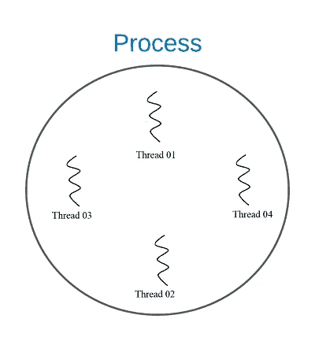
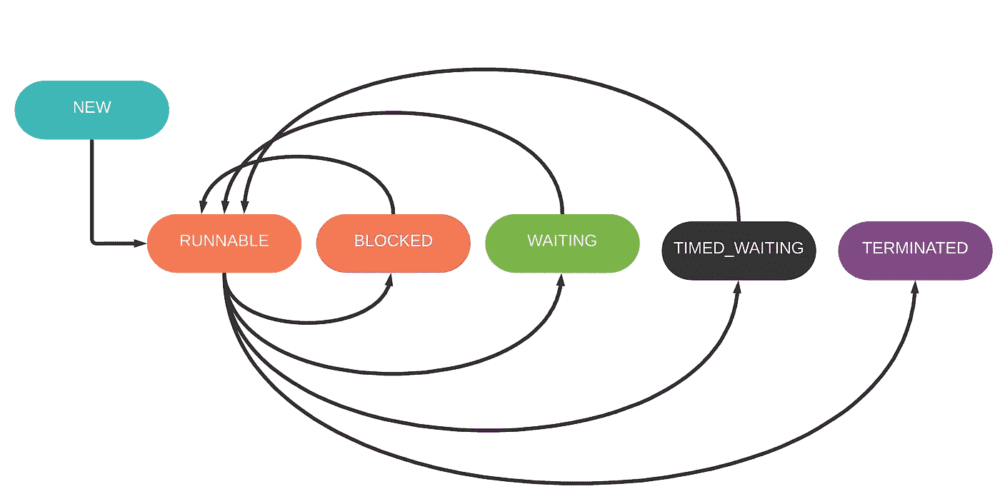
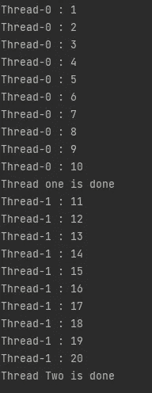

# Java 中的线程

> 原文：<https://medium.com/javarevisited/threads-in-java-4666bf0e418c?source=collection_archive---------1----------------------->


蒂姆·莫斯霍尔德在 [Unsplash](https://unsplash.com/s/photos/thread?utm_source=unsplash&utm_medium=referral&utm_content=creditCopyText) 上的照片

*“看不见的线是最牢固的纽带。”―弗里德里希·尼采*

在了解 Java 中的线程之前，我们首先需要了解一下*多任务*。

多任务处理的基本思想是同时做多件事情。但是计算机能同时完成多项任务吗？实际上，不，在操作系统内核中使用像*分时*这样的技术可以在任务之间快速切换，甚至不会察觉。为此，现代处理器使用“核心”,它是中央处理器内部的一个处理单元。然而，具有多个处理器的计算机可以进行一定程度的多任务处理。

在计算机中，这种多任务处理可以有两种方法，一种是基于进程的方法，另一种是基于线程的方法。

什么是基于进程的多任务处理，它实际上提供了运行多个彼此完全独立的进程的能力，例如，一个网络浏览器运行，同时一个音乐播放器应用程序播放音乐。

基于线程的多任务实际上是由多个线程组成的，一个线程是一个进程所拥有的执行的一小部分，所以一个进程可以有多个线程。这些多线程同时执行。处理器中的“核心”负责充分利用线程。



不是让我们找到关于 Java 中线程的详细视图。

# Java 中的线程是什么？

正如我们所讨论的，线程是执行路径。这可以是程序内部涉及的方法或业务逻辑。为了运行 Java，线程*线程调度器*需要从 CPU 分配一部分资源，Java 程序并不是运行在计算机上的唯一程序，因此 OS 线程也将获得优先级，由于这个原因，预测执行顺序是不可能的(如果没有任何标准照常运行)。

由于预测执行顺序的这种不确定性，程序员不能将一组进程分配到各个线程中并等待结果，因为如果它们之间存在任何依赖关系，那么预期的结果将不会出现。

Java 的 main 方法也是一个线程，确切的说是非守护进程。JVM 的启动以非守护进程线程的启动开始，并且 JVM 将在最后一个非守护进程线程执行结束时退出。

# 线程生命周期



与操作系统上运行的进程一样，线程也有自己的状态，根据时间和优先级，这些线程必须不断地改变它们的状态。

**NEW** —新线程创建但尚未开始的时刻。

**可运行** —线程处于执行模式。

**阻塞**—线程被阻塞，等待监视器锁被释放。

**等待** —只要线程接收到另一个线程的信号，它就会一直等待。

**TIMED_WAITING** —线程正在等待一段特定的时间

**终止** —线程已经退出。

这些线程状态转换不是即时的。*线程调度器*需要根据可用性分配 CPU 时间。

# 创建线程

在 Java 中创建线程主要有两种方法，一种是从 ***Runnable*** 接口中的*implements*

```
public class RunnableThread implements Runnable {
    @Override
    public void run() {
        //functionality to run during thread execution
    }
}
```

另一种方法是从 ***线程*** 类中“*扩展*”。

```
public class ExtendedThread extends Thread{
    @Override
    public void run() {
       //functionality to run during thread execution
    }
}
```

两者看起来是一样的，那么有什么区别呢？用两种不同的方法做同一件事有什么用呢？Java 基于面向对象的原则，我们创建的类应该有适当的层次顺序。
举个例子，如果我们正在创建一辆汽车，

```
Vehicle -> Car -> SUV
```

一个流程会类似于这样，但是万一如果我们要添加一个线程类，它会断开相关类之间的连接，而且也不像 c++这样的语言，Java 不提供多个继承，在这种情况下，没有办法使用多个父类，那时我们就可以使用接口了。

让我们看一个用两种不同方法创建线程的例子。

上面的例子是它从 ***线程*** 类中 ***扩展了*** ，并覆盖了 ***run()*** 方法来添加要运行的功能。有必要超驰吗？不要！但是创建一个线程的想法是运行一些功能，run 方法的责任是保存这些功能，以防万一如果它不覆盖 run()方法它什么也不做。

现在让我们看看如何运行它，

简单地说，我们从类中创建一个对象，并调用方法“***”start()”。*** 好吧，为什么不跑？我们讨论过 run 的职责是持有运行()的功能。但是线程化是一个复杂的过程，它通过与 JVM、OS 通信、创建线程、将它们添加到线程池来处理，所有这些都应该被处理。所有这些进程都将使用***“start()”***方法来处理。

虽然我们可以直接调用 *"run()"* 方法，程序将会正确无误地运行，但是*不会创建单独的线程*，它将在主线程上运行。

现在让我们看看通过使用 *Runnable* 接口来使用另一种方式。

现在情况开始发生变化，不像 Thread 类在使用接口时它现在强制开发者覆盖"***【run()"***方法，否则会导致编译器错误。

当查看实现时，Runnable 类实际上是*函数接口*(它只包含一个抽象方法)。所以现在没有办法继承由*线程*类提供的 *start()* 方法、属性或其他功能。现在我们来看看。🤔

现在，我们必须再次使用 Thread 类作为使用 *Runnable* 接口创建的类的实例(对象)的包装类。我们是这样做的。

通过使用线程对象进行包装，现在它可以使用线程操作所需的所有方法。

Java 为我们提供了不受任何限制地覆盖这些方法的能力，但是这会影响线程的工作方式。当自定义实现正在进行时，在线程类的功能中，最好也引用其父类实现，*(例如——"****super . start()****"*

# 线程中的优先级

线程的执行顺序无法像预期的那样预测，但是在 Java 线程中，它为我们提供了一种机制来为线程分配优先级。

线程优先级是基于*值的*方法，与数据结构不同，它不是基于索引的。Java 定义了线程优先级的范围，

```
public static final int *MIN_PRIORITY* = 1;public static final int *NORM_PRIORITY* = 5;public static final int *MAX_PRIORITY* = 10;
```

但是这些值不限于这些范围，它们可以是从 1 到 10 的值，小于或大于此范围以外的值会导致***“IllegalArgumentException”。***

线程的优先级是可继承的，它们使用主线程优先级的值，除非它没有被显式设置。这里有一个例子，

# 螺纹连接

可能会出现这样的情况，两个或多个不同的线程必须等待完成进程的剩余部分，直到其他线程完成。Java 为这些类型的场景提供了方法***【join()】***。“Join”方法有不同的实现。

*   join() —该方法等待，直到特定的方法完成工作
*   join(长毫秒)—此方法等待，直到某个时间段
*   join(long 毫秒，int 纳秒)—该方法也等待一段时间，但需要一点精确的时间

在上面的例子中，它创建了两个 Java 线程，一个从 1 数到 10，另一个从 11 数到 20。" *threadTwo* " *必须等待*直到" *threadOne* "完成，所以联接应该是 *"threadOne.join()"。* 输出会是这样的结果，



# 线程中的操作

线程有各种各样的其他功能来工作，而不会导致冲突，并具有安全性和分配时间。如果要保持应用程序流畅，这是必要的。Java 很少有有价值的操作。

## 产量

“yield()”是 Thread 类中的一个本机静态方法，它应该处理本机库来完成它的工作。
***" thread . yield()"***所做的就是在方法被调用的时候，给另一个线程提供它的运行时隙。

```
@Override
public void run() {
    for (int i = 0; i < 100; i++) {
        if (i == 66){
            Thread.*yield*();
            //When counter reaches 66 give chance to another thread  
        }
        System.*out*.println(i);
    }
}
```

## 睡眠和中断

“ ***sleep()*** ”方法提供了线程等待一定时间的能力，将线程置于 *TIMED_WAITING* 状态，它有两种定义方式，

```
sleep(long miliseconds)sleep(long miliseconds, int nanoseonds)
```

而 *interrupt()* 方法，等到方法进入 sleep()并触发方法来中断睡眠，但是中断一个非睡眠的方法不会抛出异常它只是遵循通常的路径。

# 参考

Java 线程速成班:[https://youtube.com/playlist?list = PLD-myte BG 3 x 99 o 6 VJ 3 ur 5 p 6 uch 3 mqs wbh](https://youtube.com/playlist?list=PLD-mYtebG3X99o6vJ3uR5P6UcH3MQSWBH)