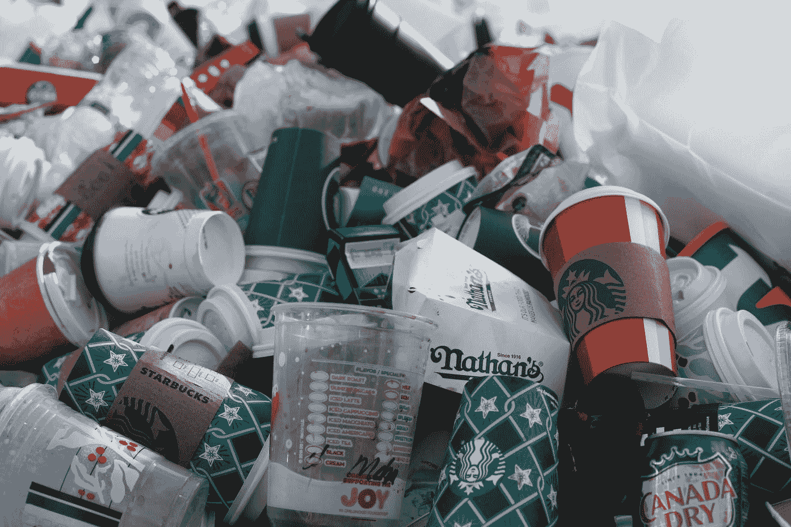

# 是时候告别 Java 中的 finalize 方法了

> 原文：<https://medium.com/javarevisited/time-to-say-goodbye-to-the-finalize-method-in-java-a2f5b7e4f1b1?source=collection_archive---------1----------------------->

现在，finalize 方法已被 Java 弃用。在这篇文章中，让我们探索一下为什么 java 弃用了 finalize 方法，他们引入了什么替代方法来代替 finalize 方法，它的优点是什么…等等

由 [Jasmin Sessler](https://unsplash.com/@jasmin_sessler?utm_source=medium&utm_medium=referral) 在 [Unsplash](https://unsplash.com?utm_source=medium&utm_medium=referral) 拍摄的照片

Object 类有一个 **finalize()** 方法，在尝试从堆中移除对象之前， **GC** 会自动调用该方法。在 [**Java 9**](/javarevisited/5-courses-to-learn-java-9-features-in-depth-373f7afcf9fa) 中…