# 基于遗传算法的定时攻击

> 原文：<https://medium.com/javarevisited/timing-attack-by-genetic-algorithm-b93a4357cd43?source=collection_archive---------2----------------------->

格尔德·奥特曼-皮查拜

在这篇短文中，我们展示了如何使用**遗传算法**来模拟**定时攻击**。我们并不打算严肃对待潜在的真实用例；该演示主要是由设计遗传算法和探索一个不太为人知，但有趣的系统漏洞的乐趣所驱动的。

(准备好香草 Java 吧！)

# 定时攻击

密码验证是许多系统的共同特征。除了每一个加密问题，最基本的想法是比较两个字符串是否相等。下面是一个简单的例子:

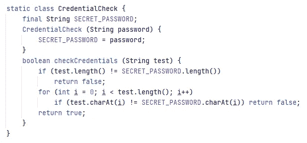

一个基本的密码检查器

当然，在一个真实的系统中，你会比较散列值，但是让我们保持简单。我们想做的是破解这个对象，找回密码。

由我们的 CredentialCheck 对象引发的[字符串](https://javarevisited.blogspot.com/2012/02/how-to-encode-decode-string-in-java.html#axzz54LFhfNxy)上的拓扑以如下方式对字符串前景进行聚类:

*   单个字符串(除了`S`)和`SECRET PASSWOR`一样低，因为它们都没有正确的大小
*   `S`并不比`SICRET PASSWORD`差，因为他们都在第一次角色检查后失败了
*   `SECRET HEJEOPO`比`SICRET PASSWORD`好 6 倍左右

以此类推……从 CredentialCheck 对象的角度来看，这个*也适用于*，并且给出了一个系统**容易受到计时攻击**的完美例子。考虑到尽可能快地返回将是富有成效的，我们不提供常数时间算法。**根据输入的测试字符串，系统采取或多或少的操作来完成其任务**。这是关于实际真实密码的间接信息。

从攻击者的角度来看，我们实际上无法访问操作计数。计时攻击的思想是当攻击者设法 ***测量执行*** 检查所需的时间，并从该测量中获益以猜测关于密码的信息。这种攻击可以通过一个简单的桥来执行:

CredentialCheck 的包装器，用于计算运行时间

## 野蛮力量的第一次审判

使用经过的时间来度量是计时攻击背后的基本思想，但是会带来更多的度量差异！下面的强力测试，我们对 1.000.000 次试验的平均执行时间进行了说明:

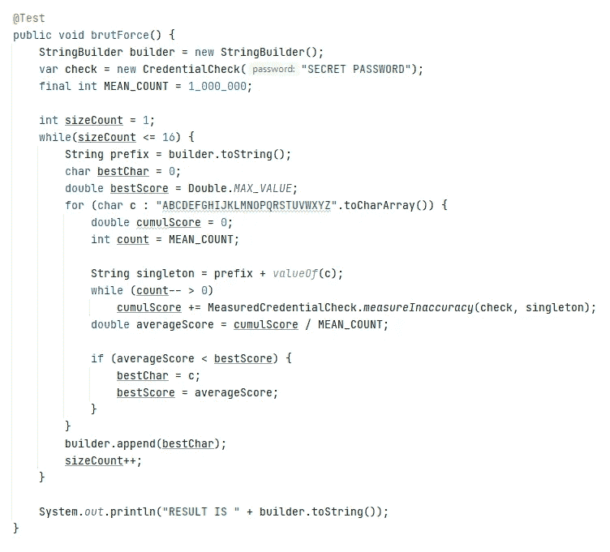

暴力攻击:由于运行时噪音导致的主要故障

我们获得的最佳候选是 AXBQCPTNOEHSTNND，它与我们的密码没有任何共同之处。这个算法的时间长度大约是 1.000.000*26*16 (~2 ⁹)。对平均长度为 1000 的 16 个字符串的每种组合进行强力运算将会得到 1000*26，因此比 2⁸⁵运算多一点。

因此，暴力战略是一个重大失败。然而，我们的系统并不安全…

# 遗传算法

我们的 MeasuredCredentialCheck 给了我们一个测试函数，这个函数测量一个字符串对象的好坏:分数越低，字符串越好；并且仅对于秘密密码达到最小值。

我们认为字符串是由 char 数组驱动的带有遗传 DNA 的生物对象。为了黑自己，我们要实现一个进化(遗传)算法。这个想法是创造一群生物串，并在其上模拟生物进化。

一个生物链在测试中获得的分数赋予了它繁殖的能力。生物链的繁殖被称为*交换*。在复制我们的字符串后，我们还将*突变*他们的 DNA，给种群带来生物多样性。

我们还可以执行许多不同的额外进化操作:复制最好的竞争对手，杀死最差的竞争对手，创建种群孤岛并实现迁移，等等……交叉和突变本身的定义是相当自由的。

无论我们做什么选择，在设计遗传算法时都应该记住一些基本原则:

*   生物多样性真的很重要:减轻突变的影响不一定是个好主意。
*   繁殖应该小心进行:过多的繁殖可能会减慢学习过程，因为在进化过程中给了糟糕的竞争者太多的效率。
*   应该特别注意种群灭绝。首先，保持人口数量不变是个好主意。

通过连续几代的计算，我们希望全球趋势收敛到一个最优配置，并有望破解密码！

## 我们的遗传算法的一般方案

对于我们的遗传算法设计，我们将保持事情简单。

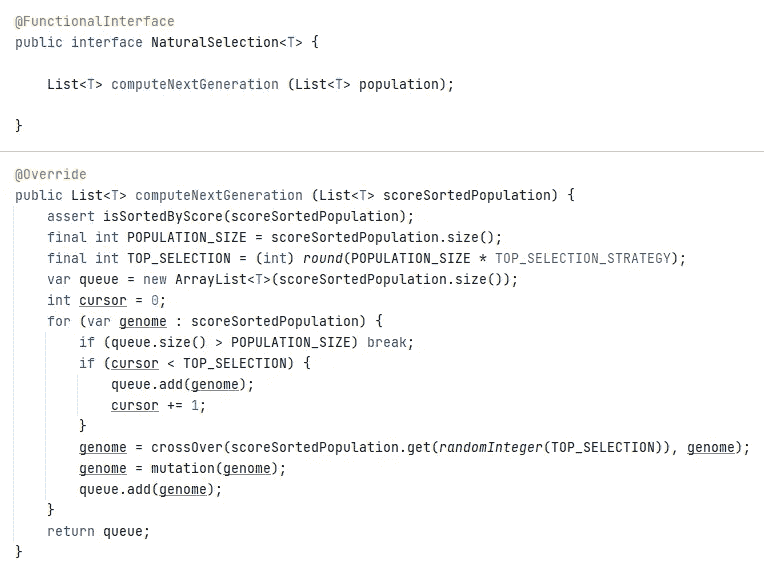

正如您可能看到的(我希望如此，因为我投入了巨大的精力使代码不像普通 Java 那样冗长！)，给定一个假定按效率排序的字符串总体(最好的先排序)，下一个总体被设计为

*   前几名候选人(根据某些配置百分比)
*   变异和交叉的个体
*   截断以获得总人口规模。

第一个条件确保在结果群体中找到最高的候选人。这是为了提高一点进程(我们风扇调整！).交叉和突变并不是每次都发生:NaturalSelection 对象随机操作它们。当它做某事时，它根据以下代数规则来做:

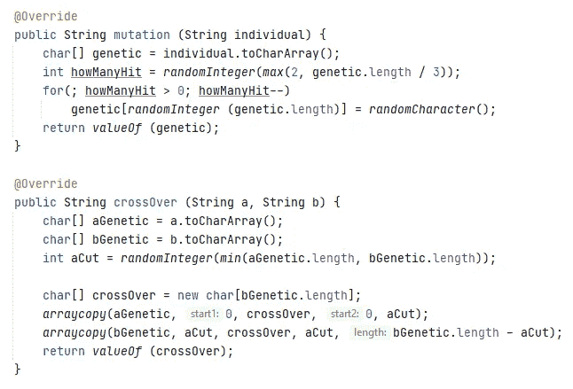

我们的交叉和变异算子

再说一次，我认为在代码中投入足够多的爱可以让它变得非常清楚:突变在字符串 DNA 中随机抽取一些字符，并随机修改它们。`(a,b)`的交叉取`a`的第一段，并相应地用它替换`b`的第一个元素。我们选择了这个交叉，因为我们怀疑(哼哼哼)CredentialCheck 对象是按原样编码的(例如，我们从 github 窃取了信息)。

既然我们知道了自然选择是如何运作的，我们就可以设计我们的进化计划了:

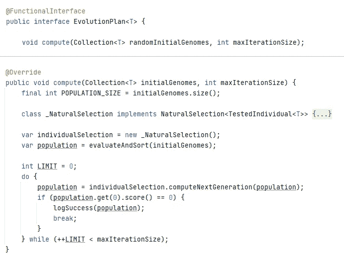

人口进化计划

同样，我认为这里发生的事情应该是清楚的:给定一个初始随机群体，我们评估它(第 0 代)并开始进化过程:计算下一代，如果找到完美的东西就停止，或者等待超时。

## 结果呢

结果挺有意思的。攻击测试如下进行:

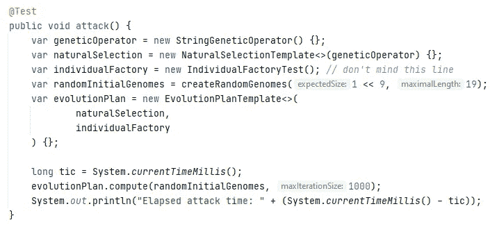

我们从一个很小的群体(2⁹ = 512)开始，每个字符串的大小在 1 到 19 之间，包括 1 和 19。因此，总人口数为 9728 (~2)。攻击经过的时间仅供参考。

遗传算法的成本大致由`O(n log(n) * m)`给出，其中`n`是种群规模，`m`是迭代次数。在这里，1.000 美元约为 2 ⁹，但我们将看到最佳价格在 200 美元左右。不用说，我们没有优化我们的设计(例如，测试长度小于 8 的密码不是很有用)。

运行该算法会得到以下结果:

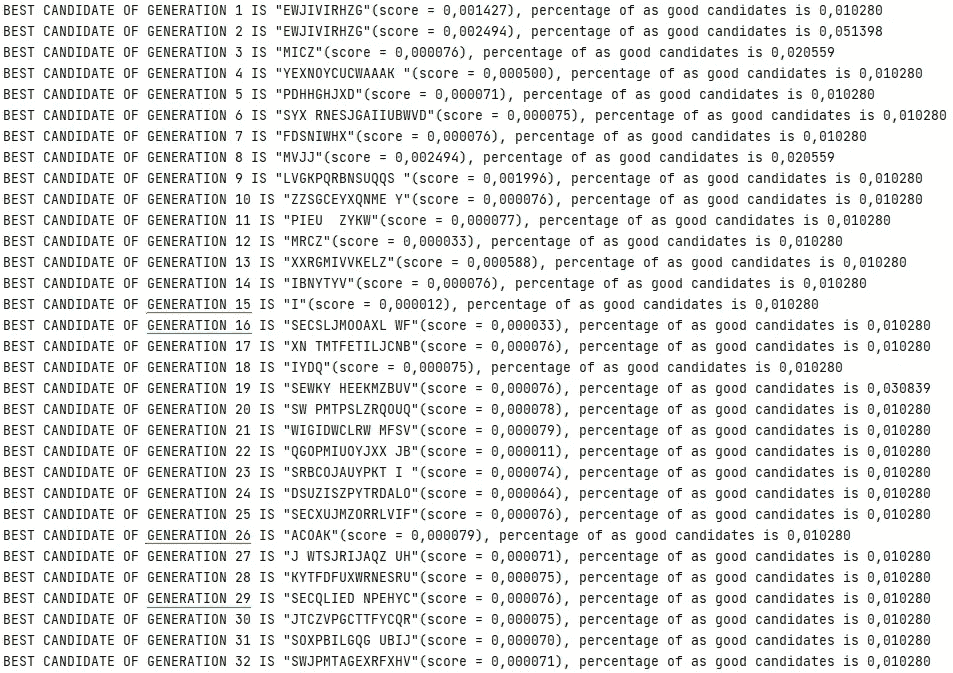

第一代攻击测试

如你所见，开始相当复杂和缓慢。在红色部分，我们发现了两代最佳竞争对手(！)都是很短的字符串。在绿色部分，我们发现了两代“SEC”前缀已经出现在最佳竞争对手中的产品。

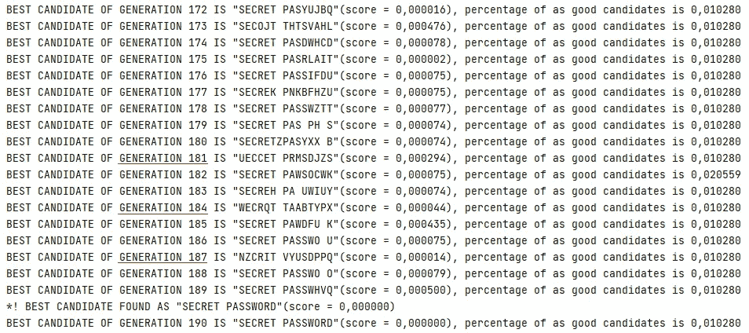

最后几代，就在达到最优之前

大约 1.2 秒后，我们在第 190 代达到了最佳配置(多次运行该算法可能会放弃大约 100 代！).在红色部分，我们发现了 Java 虚拟机有趣的噪声行为。正如你所看到的，这几代的最佳竞争者就像一个单独的字符串一样糟糕！

我们认为这是由于我们测量的极端随机性。有趣的是，尽管那些表现不好但仍然表现最好的人和其他人的比例相同，但总的模式很快恢复到接近秘密通道的状态。

我们认为，与暴力相比，这一过程的遗传本质使得静态正确的模式在 DNA 中得以传递，即使有些世代运气不佳。

事实上，在一段时间后，我们可以注意到最优竞争者的百分比增加了 20%左右。

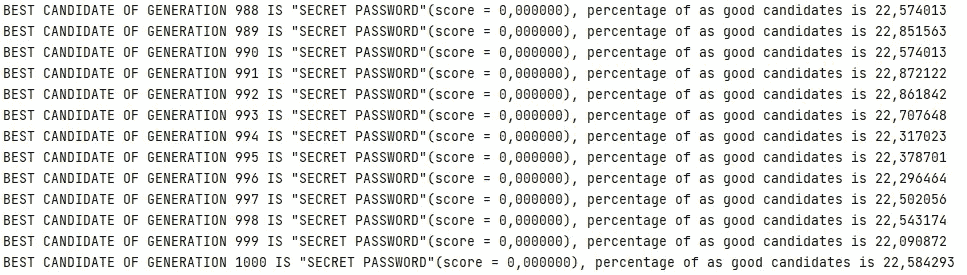

出于信息目的，这里是另一个运行的几何信息，根据 Levenshtein-distance:

## 防止计时攻击

好了，现在我们成功地黑了自己，我们如何保护？嗯，通常很难保护系统免受计时攻击，因为编译器和运行时都可能使用快速结束指令。它也可能来自处理器中的算术运算和相关的东西。

第一步可能是加重 CredentialCheck 对象的重量，使其以常量指令计数结束:

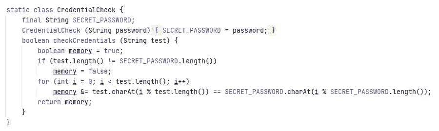

凭证检查的常量指令版本

在这个服务上运行我们的算法是行不通的:

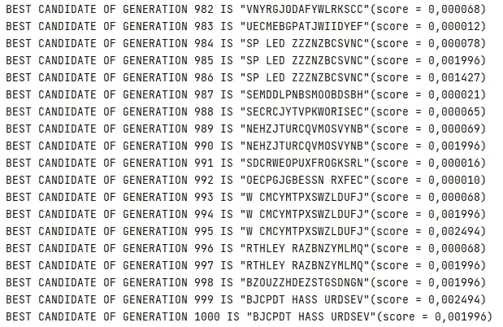

遗传算法对“受保护”版本的悲惨失败

这意味着我们安全了吗？我不知道。但也许我们比以前更安全了！

# 最后的话

下面是我如何花了一些时间，用遗传算法的方法模拟时间攻击的乐趣。虽然这个设置并不完美，但我希望它能激发您对这个或那个主题的好奇心，并让您享受阅读 Java 代码的乐趣。

如果你想知道事物是如何设计的，可以在我的 github([/Jude keyser/geneticitimingattack](https://github.com/Judekeyser/genetictimingattack))上免费获得代码。

感谢任何建设性的反馈。

干杯！