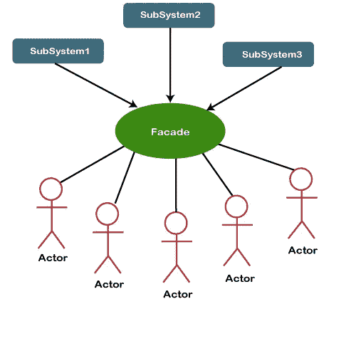

# 使用外观设计模式降低代码复杂性

> 原文：<https://medium.com/javarevisited/toned-down-code-complexity-using-facade-design-pattern-6f21d1e762d?source=collection_archive---------0----------------------->

## 给出一个“表面/正面”使得代码简单明了，易于理解。

内森·范·埃格蒙德在 [Unsplash](https://unsplash.com?utm_source=medium&utm_medium=referral) 上拍摄的照片

facade 是一个类，它为包含许多活动部分的复杂子系统(大量代码)提供简单的接口。这是一个结构化的设计模式，隐藏了太多的复杂性来提高可读性、可理解性和可维护性。

Facade 类作为必要方法的结构和链工作到一个调用者方法中，以从子系统中分离客户端实现。它将大部分工作委托给其他类。通常，[门面](https://javarevisited.blogspot.com/2015/01/adapter-vs-decorator-vs-facade-vs-proxy-pattern-java.html)管理他们使用的对象的整个生命周期。设计模式的主要意图是隐藏大部分复杂性，使子系统易于使用，并将客户端实现与复杂的子系统分离。

# 我们什么时候用门面？

**1。当您需要一个简单的接口来连接复杂的子系统时。**

非常适合非常复杂或难以理解的系统，因为系统有许多相互依赖的类。

此外，随着时间的推移，子系统变得越来越复杂。即使应用[设计模式](/javarevisited/7-best-online-courses-to-learn-object-oriented-design-pattern-in-java-749b6399af59)通常也会导致创建更多的类。子系统可能变得更加灵活，更容易在各种环境中重用，但是它向客户端要求的配置和样板代码的数量越来越多。Facade 试图通过提供子系统中最常用的特性的快捷方式来解决这个问题，这些特性符合大多数客户的需求。

**2。当您想要将子系统组织成层时，请使用 Facade。**

创建立面以定义子系统每个级别的入口点。您可以通过要求多个子系统只通过外观进行通信来减少它们之间的耦合。

R现实世界类比

> 假设我们要手动切换汽车驾驶模式。然后你要执行以下操作才能达到目的。下图显示了这一过程。

> **这可能相当复杂，需要一些知识来正确切换模式。**

*大部分人喜欢一键做事。这就是* [*用户体验*](/javarevisited/6-best-figma-ui-ux-design-courses-for-beginners-94711d31ce61)*【UX】发挥作用的地方。我们喜欢只按一个按钮，不用担心复杂性。这就是门面设计模式背后的概念。*

# 履行

步骤 1:创建接口。

步骤 2:创建实现相同接口的具体类。

步骤 3:创建一个 facade 类。

步骤 4:添加驱动程序代码。

步骤 5:验证输出。

# 结论

让我们回顾一下，看看通过上面的实现是否满足了 facade 设计模式背后的意图。运动模式和舒适模式类别被用作子系统，以隐藏复杂性。`DrivingModeFacade` 类解耦客户端，客户端可以使用单一步骤切换驱动模式。

facade 模式不会强迫我们进行不必要的权衡，因为它只是增加了额外的抽象层。

有时在简单的场景中会过度使用该模式，这将导致冗余的实现。在构建之前，通过研究立面设计模式的目标来确定适用性。

# 包装东西

最后，我希望您对外观设计模式及其用例有一个清晰的概念。

*如果有我说错的地方，欢迎在下面评论！*。*如果您喜欢这篇文章，请点击👏下面这样更多的人可以看到它！确保您在*[***Medium***](/@susithrj)**上关注我，或者在* [***上关注我的博客***](https://susithrj.wordpress.com/)**，以便在有新文章发表时获得更新。***

***快乐编码！👌***