# 2023 年面向初学者和有经验的 Web 开发人员的 10 大有价值的书籍和课程——最好的

> 原文：<https://medium.com/javarevisited/top-10-angular-books-and-courses-for-beginners-and-experienced-web-developers-best-of-lot-9a2dae87f04c?source=collection_archive---------0----------------------->

[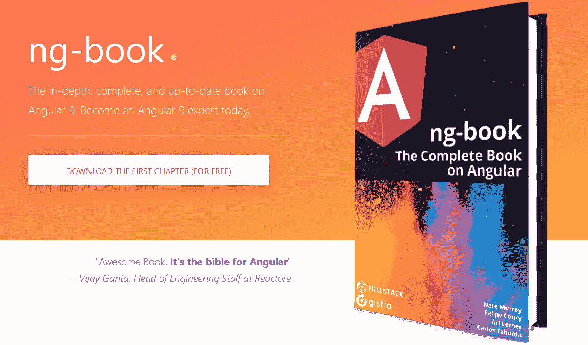](https://gumroad.com/a/221148275/FlvVl)

image _ credit—[Ng-Book—Angular 大全](https://gumroad.com/a/221148275/FlvVl)

大家好，如果你有兴趣学习 [Angular framework](https://hackernoon.com/tagged/Angular) ，这是开发基于组件的 Web GUI 的最流行的 JavaScript 框架之一，并且正在寻找一些很棒的资源，如课程、教程和书籍，那么你来对地方了。

在这篇文章中，我将分享一些最好的资源，如[书籍](https://www.java67.com/2020/03/top-5-books-to-learn-angular-for-beginners.html)、[教程](https://javarevisited.blogspot.com/2022/01/spring-boot-angular-example-tutorial.html)、[课程](https://javarevisited.blogspot.com/2019/04/10-free-angular-and-react-courses-for.html)来学习 Angular 框架，以前称为 [Angular JS](http://www.java67.com/2018/01/top-5-free-angular-js-online-courses-for-web-developers.html) ，现在简称为 [Angular](https://javarevisited.blogspot.com/2018/06/5-best-courses-to-learn-angular.html) 。

它由谷歌支持，因此你不应该担心它在几年后会过时或失去相关性。你在学习 Angular 的过程中所做的任何投资都会在未来几年给你带来丰厚的回报。

根据 StackOverflow 的调查，Angular 是仅次于 jQuery 的第二大流行框架，也是 JavaScript 在 web 开发人员中流行的主要原因之一。

[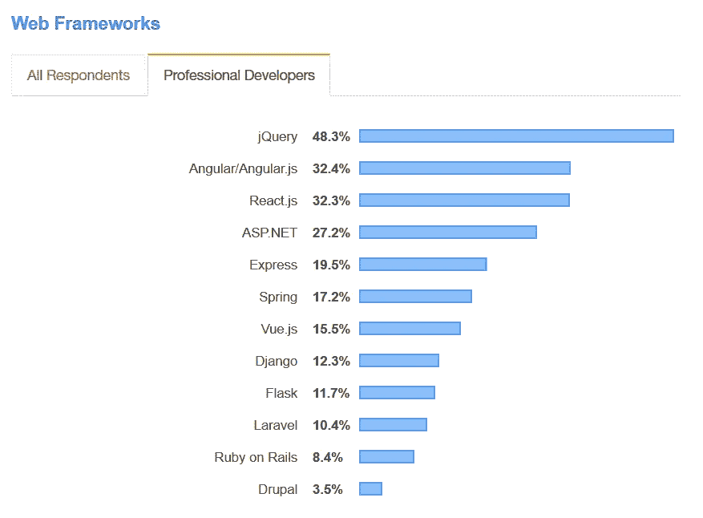](https://dev.to/javinpaul/10-books-tutorials-and-courses-to-learn-angular-in-2019-2m0l)

# 10+面向前端开发人员的最佳角度课程、教程和书籍

在不浪费你更多时间的情况下，这里有我最喜欢的 2023 年学习 Angular 2+的课程、教程和书籍。列表包含免费和付费资源，适合初学者和中级前端开发者。

## [**1。Angular —完整指南**](https://click.linksynergy.com/fs-bin/click?id=JVFxdTr9V80&subid=0&offerid=323058.1&type=10&tmpid=14538&RD_PARM1=https%3A%2F%2Fwww.udemy.com%2Fthe-complete-guide-to-angular-2%2F)

我先告诉你，我是 Max 的教学风格和他的课程的忠实粉丝。它们可能是网上学习 Angular 的最佳资源，毫不奇怪，它们也是 Udemy 上的畅销书。

本课程将帮助你学习 Angular (Angular 2+，包括 Angular 6)并构建令人敬畏的反应式 web 应用程序。

**导师—** [**马克西米利安·施瓦兹米勒**](https://click.linksynergy.com/deeplink?id=JVFxdTr9V80&mid=39197&murl=https%3A%2F%2Fwww.udemy.com%2Fuser%2Fmaximilian-schwarzmuller%2F)

只需查看课程预览，因为它们是免费的，不会占用你太多时间。我相信你会爱上这门课程的。

[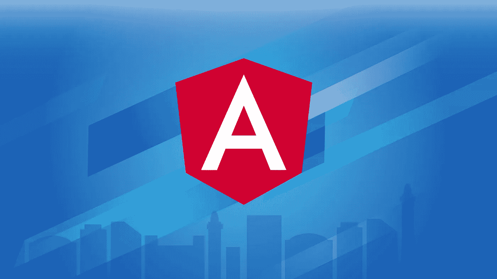](https://click.linksynergy.com/fs-bin/click?id=JVFxdTr9V80&subid=0&offerid=323058.1&type=10&tmpid=14538&RD_PARM1=https%3A%2F%2Fwww.udemy.com%2Fthe-complete-guide-to-angular-2%2F)

## 2.[2023 年 ZTM 学院完成角开发者](https://academy.zerotomastery.io/a/aff_sfk5z7pb/external?affcode=441520_zytgk2dn)

如果你正在寻找一个全面的和最新的课程来学习 Angular 框架，那么这个 29.5 小时长的 ZTM 学院 Angular 在线培训课程是一个最好的开始。

[**ZTM 学院**](https://academy.zerotomastery.io/a/aff_fvgz1fnn/external?affcode=441520_zytgk2dn) 代表零到精通学院，其创始人不是别人，正是广受欢迎的 Udemy 讲师之一 Andrei Negaoie，他创建了这个在线门户网站，以一种费用提供他所有的课程。

这个 30 小时长的课程是由小路易斯·拉米雷斯创建的，它涵盖了所有基本的角度概念，如角度:路由，指令，管道，服务，提前编译等等。它还涵盖了角度设计模式以及使用 RxJS 的反应式编程。

您还将学习如何在您的应用程序中使用 [WebAssembly](/javarevisited/7-best-webassembly-and-blazor-courses-for-beginners-to-learn-online-8e0cdd61be28) 和 [Rust](/javarevisited/7-best-rust-programming-courses-and-books-for-beginners-in-2021-2ed2311af46c) 来提高性能并与 Angular Framework 的功能相结合。

**这里是加入本课程的链接**—[2023 年完成 Angular Developer](https://academy.zerotomastery.io/a/aff_sfk5z7pb/external?affcode=441520_zytgk2dn)

[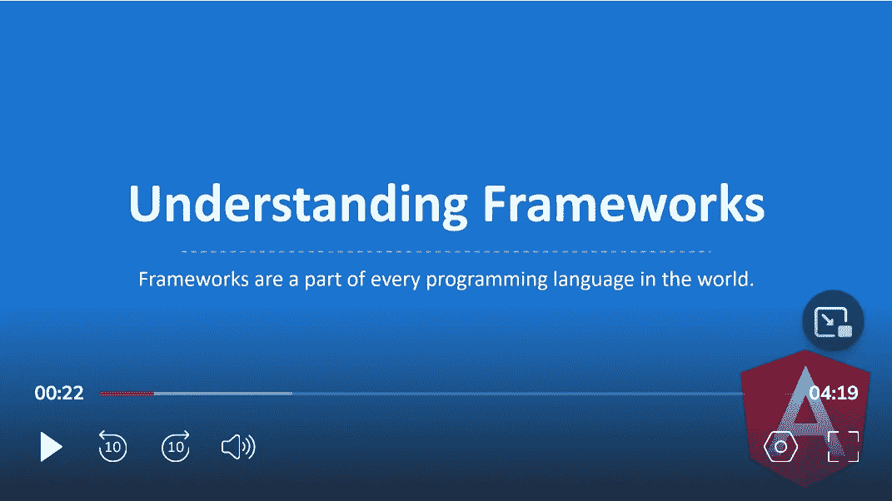](https://academy.zerotomastery.io/a/aff_sfk5z7pb/external?affcode=441520_zytgk2dn)

这个角度课程最棒的一点是，你将构建一个名为“Clip”的出色应用程序，这是一个自托管视频应用程序，用户可以上传并与朋友分享他们的游戏精彩片段。

在这个过程中，您将学习如何安全地上传文件，使用 WebAssembly 提取屏幕截图，以及如何使用 Angular 构建一个广泛的应用程序。您不仅可以与朋友和家人分享，还可以添加到您的 Github 文件夹中，给未来的雇主留下深刻印象。

顺便说一句，你需要一个 [**ZTM 会员**](https://academy.zerotomastery.io/a/aff_c0gnlvf7/external?affcode=441520_zytgk2dn) 才能观看这个课程，这个课程每月花费大约 39 美元，但也提供了许多像这样的超级有趣和有用的课程。你也可以*使用优惠券代码 FRIENDS10 在这门课程或你选择的任何订阅上获得 10%的折扣*。

<https://academy.zerotomastery.io/a/aff_c0gnlvf7/external?affcode=441520_zytgk2dn>  

## 3.[Ng-Book——关于 Angular 的全集](https://gumroad.com/a/221148275/FlvVl)

这本书，也被称为 Ng-Book，经常被称为 Angular 的圣经。如果你正在寻找一个简单而详细的角度世界指南，那么这本书是给你的。

另外，还有什么比框架开发者自己写的书更好的呢？

**作者和撰稿人:**内特·默里·费利佩·库里·阿里·勒纳卡洛斯·塔沃尔达尼克·拉博伊·伯克·荷兰

第一章介绍如何编写第一个 Angular 9 应用程序，第二章介绍如何使用注释和类型将数据绑定到组件以及 Typescript 的介绍。它的价格是 79 美元，你可以在亚马逊或者他们自己的网站上购买。他们还提供了一个**免费章节**，你可以在这里下载[的 PDF。](https://gumroad.com/a/221148275)

如果你愿意，你也可以将这本书与 Maximilian 在 Udemy 上的[**Angular——完整指南**](https://click.linksynergy.com/fs-bin/click?id=JVFxdTr9V80&subid=0&offerid=323058.1&type=10&tmpid=14538&RD_PARM1=https%3A%2F%2Fwww.udemy.com%2Fthe-complete-guide-to-angular-2%2F) 课程结合起来，它也涵盖了 Angular 11，是任何寻求主动学习的人的可靠资源。

## 4.[完整的角度课程:从初级到高级](https://click.linksynergy.com/deeplink?id=JVFxdTr9V80&mid=39197&murl=https%3A%2F%2Fwww.udemy.com%2Fcourse%2Fthe-complete-angular-master-class%2F)

Mosh Hamedani 的一门很棒的课程，旨在掌握 Angular 及其背后的 JavaScript 概念，设计定制指令，并构建单页面应用程序。

如果你是 JavaScript T1 和 T2 Angular T3 的初学者，那么你可以参加这个课程，开始你在 web 开发美丽世界的旅程。

**教官—** [**摩西·哈姆丹奈**](https://codewithmosh.com/?affcode=146684_vi6jt6lm)

[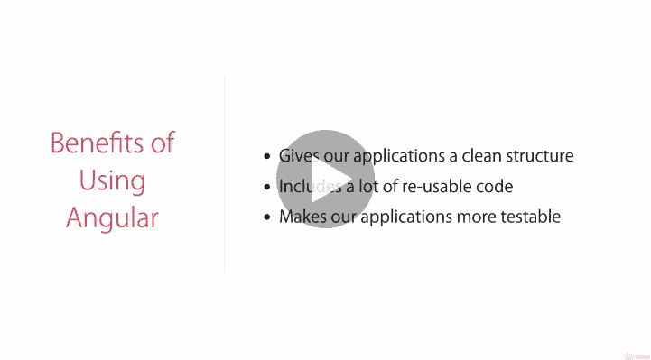](https://click.linksynergy.com/deeplink?id=JVFxdTr9V80&mid=39197&murl=https%3A%2F%2Fwww.udemy.com%2Fcourse%2Fthe-complete-angular-master-class%2F)

顺便说一下，如果你喜欢 Mosh 的教学风格，那么你也可以加入 [**CodeWithMosh**](https://codewithmosh.com/?affcode=146684_vi6jt6lm) 门户网站，在那里你只需支付一笔会员费就可以学习他的所有课程。他有许多很棒的课程，涵盖了基本的编程主题，如 git、JavaScript、SQL、Python 等，我个人认为 [**CodeWithMosh 订阅**](https://codewithmosh.com/p/all-access?affcode=146684_vi6jt6lm) 是值得的。

<https://codewithmosh.com/p/all-access?affcode=146684_vi6jt6lm>  

## **5。** [**棱角分明—教程:英雄之旅**](https://angular.io/tutorial) **【免费】**

这是 Angular 团队的官方教程，所以也是 2023 年学习 Angular 的最新资源。

英雄之旅教程涵盖了 Angular 的基础知识。

在本教程中，您将构建一个应用程序来帮助职业介绍所管理其稳定的英雄。

[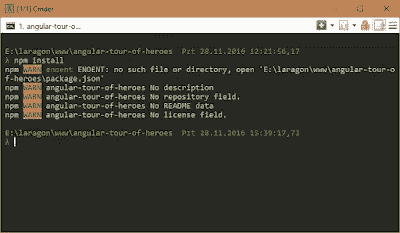](https://angular.io/tutorial)

## 6。专业人士角度 2 笔记【免费书籍】

我是 StackOverflow 的忠实粉丝，每天在做大量编程和 web 开发任务时都会使用它。

这里有很多优秀的开发人员和专家，你有很好的机会向他们学习经验。

一本书怎么样，它是由 StackOverflow 内容组成的？嗯，棱角分明的 2 号笔记对专业人士来说就是这样。这是一本 200 多页的免费电子书，充满了来自 StackOverflow 的技巧和提示。

[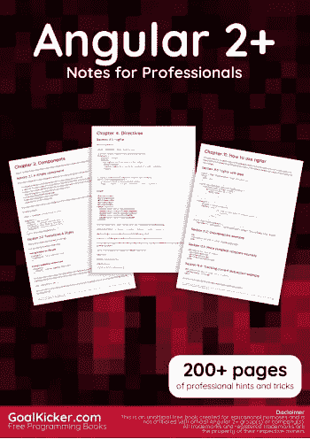](https://goalkicker.com/Angular2Book/)

## [**7。Angular 5 教程—您的第一个 Angular 5 应用程序的逐步指南**](https://www.toptal.com/angular/angular-5-tutorial)

顾名思义，Toptal 是一个寻找任何技术领域顶尖人才的网站，但它也包含一些关于不同技术的最深入的教程。

如果你是 Angular 的新手，那么你可以从这个 Angular 5 教程开始你的旅程。不需要以前的角度经验。

[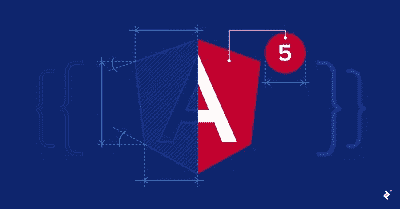](https://javarevisited.blogspot.com/2018/06/5-best-courses-to-learn-angular.html)

## **8。** [**忙碌开发者的棱角速成班**](https://click.linksynergy.com/fs-bin/click?id=JVFxdTr9V80&subid=0&offerid=323058.1&type=10&tmpid=14538&RD_PARM1=https%3A%2F%2Fwww.udemy.com%2Fangular-crash-course%2F)

这是 Udemy 的另一个最畅销的角度课程，顾名思义，这是一个以 go 开始的速成课程。

如果你学习 Angular Web Framework (Angular 2+)的时间有限，那么参加这个课程，只需 10 个小时就能学会 Angular！

**导师—** [**摩西·哈姆丹奈**](https://click.linksynergy.com/deeplink?id=JVFxdTr9V80&mid=39197&murl=https%3A%2F%2Fwww.udemy.com%2Fuser%2Fmoshfeghhamedani%2F)

[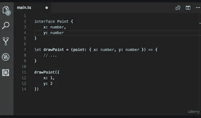](https://click.linksynergy.com/fs-bin/click?id=JVFxdTr9V80&subid=0&offerid=323058.1&type=10&tmpid=14538&RD_PARM1=https%3A%2F%2Fwww.udemy.com%2Fangular-crash-course%2F)

## **9。** [**角度 2+ —自由入门**](https://click.linksynergy.com/fs-bin/click?id=JVFxdTr9V80&subid=0&offerid=323058.1&type=10&tmpid=14538&RD_PARM1=https%3A%2F%2Fwww.udemy.com%2Fgetting-started-with-angular-2%2F)

这是一个从 Udemy 学习 Angular 的免费课程，也是一个很棒的课程。通过遵循 Ryan Chenkie 在本课程中的说明，您可以轻松学会如何构建您的第一个 Angular 2+应用程序。

Udemy 中的[免费角课程主要是为了营销目的而创建的，但它们并不缺乏质量，因为教师希望推广他们最好的内容，以获得 Udemy 平台上数百万学生的关注。](http://www.java67.com/2018/01/top-5-free-angular-js-online-courses-for-web-developers.html)

讲师— [瑞安·陈基](https://medium.com/u/b61197d69fa1?source=post_page-----9a2dae87f04c--------------------------------)

[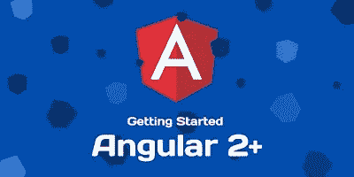](https://click.linksynergy.com/fs-bin/click?id=JVFxdTr9V80&subid=0&offerid=323058.1&type=10&tmpid=14538&RD_PARM1=https%3A%2F%2Fwww.udemy.com%2Fgetting-started-with-angular-2%2F)

## 10。 [**棱角分明—掌握基础知识—自由自在**](https://click.linksynergy.com/fs-bin/click?id=JVFxdTr9V80&subid=0&offerid=323058.1&type=10&tmpid=14538&RD_PARM1=https%3A%2F%2Fwww.udemy.com%2Fangular-mastering-the-basics%2F)

这是另一个免费学习 Angular 的很棒的课程。与马克斯的课程或 T2 的付费课程相比，这是一个相对较短的课程，但它是免费的。

如果你想从一个免费的资源开始，这是从零开始学习角度基础的完美选择。

讲师—vish was Gopinath(@ vish was Gopinath)

[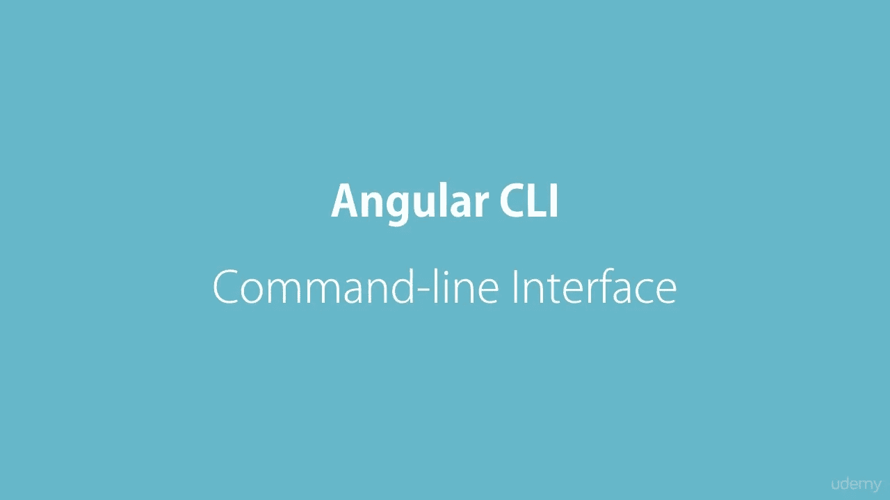](https://click.linksynergy.com/fs-bin/click?id=JVFxdTr9V80&subid=0&offerid=323058.1&type=10&tmpid=14538&RD_PARM1=https%3A%2F%2Fwww.udemy.com%2Fangular-mastering-the-basics%2F)

## **11。** [**棱角分明的快速速成班——免费**](https://click.linksynergy.com/fs-bin/click?id=JVFxdTr9V80&subid=0&offerid=323058.1&type=10&tmpid=14538&RD_PARM1=https%3A%2F%2Fwww.udemy.com%2Fgetting-started-with-angular-2%2F)

Udemy 的另一个超棒的免费角度课程。您可以通过本课程学习使用角度 2°、4°、5°、6°以及更大角度。

这是一门快节奏的课程，非常适合忙碌的开发人员或急于从项目开始学习 Angular 的人。

讲师— [埃德温·迪亚兹](https://medium.com/u/6b250e9546be?source=post_page-----9a2dae87f04c--------------------------------)

[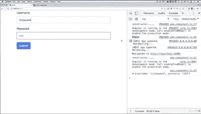](https://click.linksynergy.com/fs-bin/click?id=JVFxdTr9V80&subid=0&offerid=323058.1&type=10&tmpid=14538&RD_PARM1=https%3A%2F%2Fwww.udemy.com%2Fgetting-started-with-angular-2%2F)

## **12。** [**角度:入门—复数视线**](https://pluralsight.pxf.io/c/1193463/424552/7490?u=https%3A%2F%2Fwww.pluralsight.com%2Fcourses%2Fangular-2-getting-started-update)

这是 Pluralsight 的最佳角度课程之一。在本课程中，您将通过快速了解 Angular 的组件、模板和服务，学习如何创建出色的 web 应用程序，并了解最新的应用程序开发技术。

讲师——黛博拉·库拉塔

[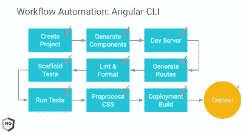](https://pluralsight.pxf.io/c/1193463/424552/7490?u=https%3A%2F%2Fwww.pluralsight.com%2Fcourses%2Fangular-2-getting-started-update)

像任何其他 Pluralsight 课程一样，您需要一个月或年的会员资格才能参加本课程。

月会员费约为 29 美元，[年会员费约为 299 美元(节省 14%)，不仅可以参加这门课程，还可以参加 5000 多门其他技术课程。如果你不确定，你还可以尝试一个](https://pluralsight.pxf.io/c/1193463/424552/7490?u=https%3A%2F%2Fwww.pluralsight.com%2Fpricing) [**10 天免费试用**](http://pluralsight.pxf.io/c/1193463/424552/7490?u=https%3A%2F%2Fwww.pluralsight.com%2Flearn) ，可以免费观看 200 分钟的课程内容。

<http://pluralsight.pxf.io/c/1193463/424552/7490?u=https%3A%2F%2Fwww.pluralsight.com%2Flearn>  

以上就是学习 Angular 2+ Web 框架的一些**最佳教程和在线课程。我还包括了一些课程和书籍，因为它们提供了更全面的学习，而且大多数时候是最好的起点。如果你有任何其他的角度教程，你认为应该在这个列表中，然后随时下降的说明。**

您可能喜欢的其他 **Web 开发资源**:

*   [面向 Web 开发者的 5 大免费 JavaScript 课程](http://www.java67.com/2018/04/top-5-free-javascript-courses-to-learn.html)
    [面向 Java 开发者的 5 大免费 Spring 框架课程](http://www.java67.com/2017/11/top-5-free-core-spring-mvc-courses-learn-online.html)
    [2023 年学习 React Native 的 5 大课程](http://javarevisited.blogspot.sg/2018/02/5-react-native-courses-to-learn-mobile-development-using-JavaScript.html)
    [2023 年学习 Web 开发的 5 大课程](https://javarevisited.blogspot.com/2018/02/top-5-online-courses-to-learn-web-development.html)
    [面向 Web 开发者的 10 大 JavaScript 教程和课程](https://javarevisited.blogspot.com/2018/06/top-10-courses-to-learn-javascript-in.html)
    [2023 年学习 Spring Boot 的 5 大课程](https://javarevisited.blogspot.com/2018/05/top-5-courses-to-learn-spring-boot-in.html)
    [2023 年学习 2023 React JS 开发者路线图](http://www.java67.com/2018/02/5-free-python-online-courses-for-beginners.html)
    [10 JavaScript 框架 Fullstack 开发者应该知道的](http://www.java67.com/2019/01/top-10-javascript-frameworks-and-libraries-for-web-developers.html)
    [5 门免费课程学习 React 框架](http://www.java67.com/2018/02/5-free-react-courses-for-web-developers.html)

## 结束语

谢谢，你坚持到了文章的结尾…祝你在 Angular 的 Web 开发之旅中好运！这当然不容易，但是通过遵循这些资源，你离成为你一直想成为的 Angular 开发者又近了一步。

如果你喜欢这篇文章，那么请分享给你的朋友和同事，别忘了在 Twitter 上关注 [javinpaul](https://twitter.com/javinpaul) ！

**附言——**如果你需要更多的免费资源，可以查看这份[免费 Angular 2+课程](http://www.java67.com/2018/01/top-5-free-angular-js-online-courses-for-web-developers.html)列表，开始准备。

**P. S. S. —** 如果你更喜欢书籍而不是在线课程和教程，并且需要更多的选择，那么你也可以看看这份为初学者准备的 [**前 5 本有棱角的书**](https://www.java67.com/2020/03/top-5-books-to-learn-angular-for-beginners.html) 清单。

<https://www.java67.com/2020/03/top-5-books-to-learn-angular-for-beginners.html>  

## 您可能喜欢的关于 Angular 和 Web 开发的其他媒体文章:

</hackernoon/the-2019-web-developer-roadmap-ab89ac3c380e>  </javarevisited/10-courses-to-learn-angular-for-web-development-6da1bd2856dc>  </javarevisited/top-10-free-courses-to-learn-html-5-css-3-and-web-development-872d62d97a97> 