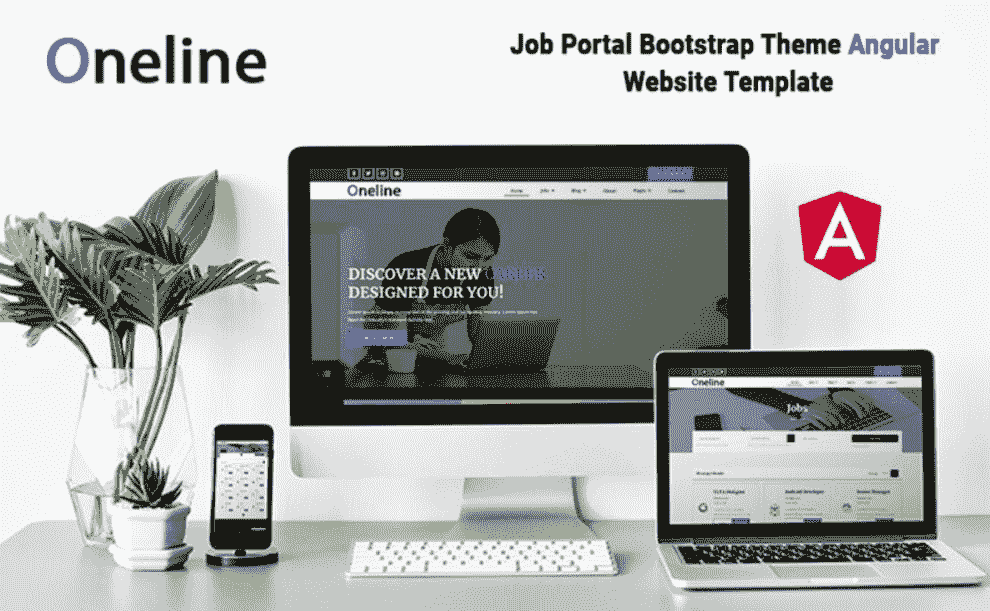
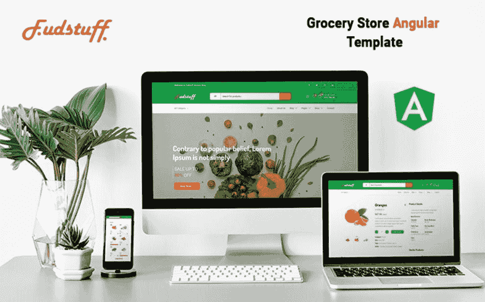
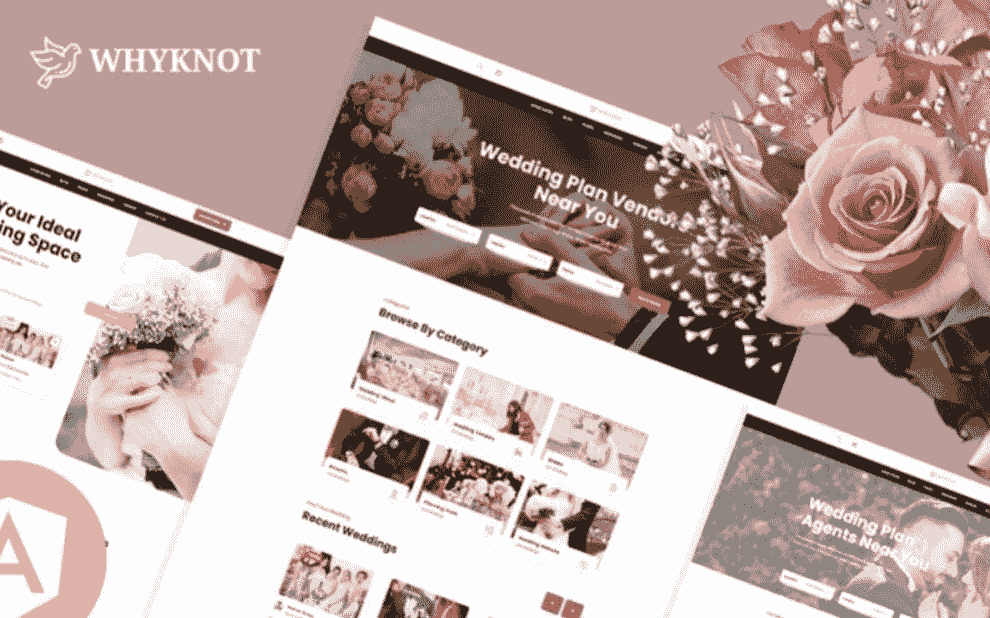
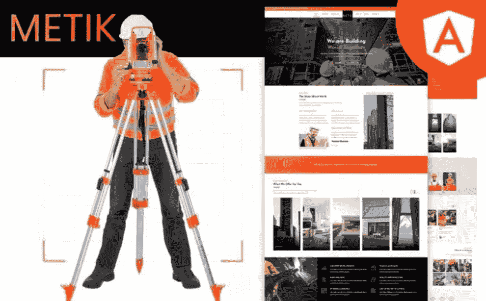
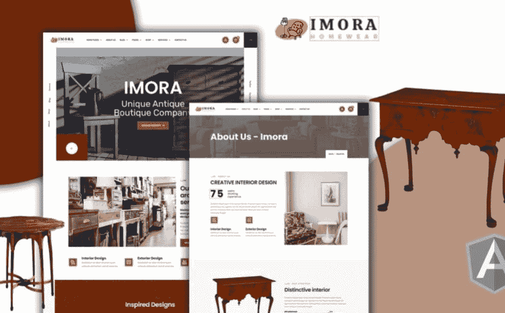
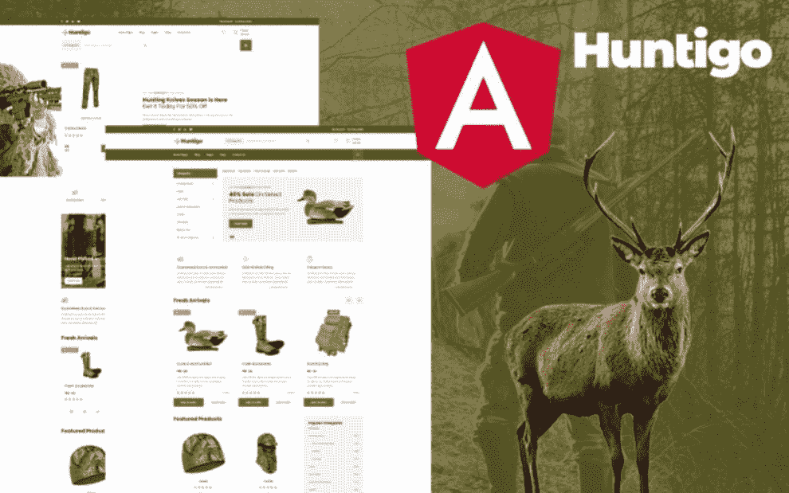
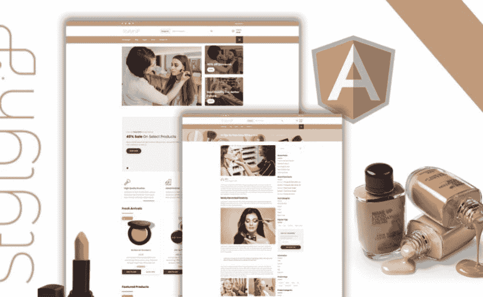

# 十大角度模板:各种目标的独创性选择

> 原文：<https://medium.com/javarevisited/top-10-angular-templates-ingenious-and-original-choices-for-various-goals-f7dab4df5462?source=collection_archive---------1----------------------->

## 十大角度模板:各种目标的独创性选择

许多企业认识到，使用 [Angular framework](/javarevisited/10-courses-to-learn-angular-for-web-development-6da1bd2856dc) 构建 web 和移动应用将有助于他们产生丰富的客户体验、易访问性、速度和效率。

因此，建立在 MVVM 架构上的 JavaScript 框架 [Angular](/javarevisited/10-courses-to-learn-angular-for-web-development-6da1bd2856dc) ，现在被广泛用于创建具有可靠代码的交互式网络和移动应用。今天我们要谈谈 [**棱角模板**](https://www.templatemonster.com/website-templates/oneline-job-portal-angular-template-219671.htmlaff=javarevisited&utm_campaign=angulartemplates&utm_source=javarevisited&utm_medium=referral) 以及为什么值得选择它们。在此之前，了解更多关于 Angular 本身的信息不会是多余的。

1.  Angular 是一个强大的前端工具，它提供的特性可以帮助人们编写易于使用、易于理解和易于维护的代码。
2.  开发人员充分利用这一现代平台，通过卓越的工作效率和一步安装过程创建引人注目的应用程序。
3.  [Angular](/javarevisited/top-10-free-courses-to-learn-angular-framework-in-2020-bb62148c73d3) 使用简单准确的模板语法生成用户界面。
4.  通过使用直观的 API，任何开发人员都可以用很少的代码创建高性能的动画时间轴。
5.  Angular 将模板部分扩展到代码生成，这在今天的 JavaScript 开发工具中已经得到了很大的改进。

# 最引人注目的角度模板精选:10 种流行的壁龛变体

## 1.[单线—工作入口角度模板](https://www.templatemonster.com/website-templates/oneline-job-portal-angular-template-219671.htmlaff=javarevisited&utm_campaign=angulartemplates&utm_source=javarevisited&utm_medium=referral)

OneLine 是适用于在线求职领域的**最佳角度模板**之一。因此，有可能为门户网站、职位列表和求职网站创建一个令人惊叹的在线形象。它设计精美，外观独特，会给观众留下长久的印象。

一个[完全响应的设计](/javarevisited/8-best-responsive-design-courses-for-web-developers-e507f7952774)是首先值得一提的特性之一。它允许人们使用不同的设备浏览你的各种工作职位。除此之外，还有预先制作的网页来吸引尽可能多的潜在访问者。

例如，您可以自由利用工作网格、工作过滤器、图库、预订和许多其他功能。没有必要浪费时间去寻找必要的空缺。由于有了高级搜索功能，只需几秒钟就可以选择想要的工作。你也可以通过添加引人注目的视差效果来自由地吸引人们。

主要特点:

*   背景视频；
*   下拉菜单；
*   团队成员；
*   谷歌地图；
*   博客功能。

[立即购买](https://www.templatemonster.com/website-templates/oneline-job-portal-angular-template-219671.htmlaff=javarevisited&utm_campaign=angulartemplates&utm_source=javarevisited&utm_medium=referral) | [在 MonsterONE](https://www.templatemonster.com/monsterone/tm-membership/?id=219671?aff=javarevisited&utm_campaign=angulartemplates&utm_source=javarevisited&utm_medium=referral) 免费下载

## 2. [Angular — Firebase 登录注册表单模板](https://www.templatemonster.com/specialty-pages/angular-firebase-login-register-form-template-221359.html?aff=javarevisited&utm_campaign=angulartemplates&utm_source=javarevisited&utm_medium=referral)

你正在寻找高质量的长注册表格式角模板吗？在这种情况下，您可能会对这种专业且令人印象深刻的变体感到满意。对于那些需要基于 web 的登录和注册屏幕的人来说，这是一个完美的匹配。

毫无疑问，将这些代码集成到现有的项目中不会花费你任何东西。总的来说，对于这个现成的解决方案，你应该了解些什么？整个应用程序是一个单一的组件。

它附带了一个 auth.service.ts 文件，允许在没有任何问题的情况下更改 [firebase api](/javarevisited/5-best-firebase-and-firestore-courses-for-frontend-developers-88052b0d3e74?source=---------5----------------------------) 。此外，有一个 auth.guard.ts 文件可以保护您的路由免受非注册用户的攻击。您也会很高兴使用 localStorage 获得自动登录功能。

主要特点:

*   吸引人的动画效果；
*   完全可定制的特性；
*   兼容所有主流现代浏览器；
*   与电子商务兼容；
*   简洁而有创意的设计。

[立即购买](https://www.templatemonster.com/specialty-pages/angular-firebase-login-register-form-template-221359.html?aff=javarevisited&utm_campaign=angulartemplates&utm_source=javarevisited&utm_medium=referral) | [试玩](https://www.templatemonsterpreview.com/demo/221359.html?aff=javarevisited&utm_campaign=angulartemplates&utm_source=javarevisited&utm_medium=referral)

## 3. [FudStuff —杂货店棱角网站模板](https://www.templatemonster.com/website-templates/grocery-store-angular-website-template-224089.html?aff=javarevisited&utm_campaign=angulartemplates&utm_source=javarevisited&utm_medium=referral)

有可能在网上找到一堆杂货角模板。然而，并不是每一个都值得你关注。出于这个原因，对于那些需要食品店的人来说，熟悉这个充满活力和不同寻常的主题是至关重要的。

它也适合那些需要推广他们的有机食品品种的人。一个奇妙的色彩组合瞬间吸引眼球。该包装包括所有必需的预制页面，可以展示您的最佳商品。

即使那些从未经历过网站建设过程的人也可以毫不费力地编辑所有的组件。由于完全响应的设计，您可以确保您的潜在客户可以通过所有设备查看网站。

主要特点:

*   视差效应；
*   快速入门包；
*   团队成员；
*   下拉菜单；
*   博客和图库功能。

[立即购买](https://www.templatemonster.com/website-templates/grocery-store-angular-website-template-224089.html?aff=javarevisited&utm_campaign=angulartemplates&utm_source=javarevisited&utm_medium=referral) | [在 MonsterONE](https://www.templatemonster.com/monsterone/tm-membership/?aff=javarevisited&utm_campaign=angulartemplates&utm_source=javarevisited&utm_medium=referral) 免费下载

## 4. [Whyknot —婚礼活动和婚礼策划角度模板](https://www.templatemonster.com/website-templates/whyknot-wedding-events-and-wedding-planner-angular-template-207370.html?aff=javarevisited&utm_campaign=angulartemplates&utm_source=javarevisited&utm_medium=referral)

这个甜蜜的婚礼相关的角度模板的例子可能会满足你的需要。它包括 31 个不同用途的预制页面。它们都包括增强其功能的角形部件。其中，你会找到现成的选项来谈论你的服务、价格、联系人和其他重要信息。

利用这一非凡选择的力量，无论您的编程知识水平如何，您都可以改变各种元素。因此，它将毫不费力地反映出专业的外观和感觉的婚礼行业。

它也有一个跨浏览器兼容的设计，确保人们可以随时查看您的网站。还有平滑的过渡效果，让你更兴奋地浏览你的婚礼服务。

主要特点:

*   吸引人的主页；
*   谷歌字体；
*   背景视频；
*   谷歌地图；
*   下拉菜单。

[立即购买](https://www.templatemonster.com/website-templates/whyknot-wedding-events-and-wedding-planner-angular-template-207370.html?aff=javarevisited&utm_campaign=angulartemplates&utm_source=javarevisited&utm_medium=referral) | [在 MonsterONE 免费下载](https://www.templatemonster.com/monsterone/tm-membership/?id=207370&tmaff=metropolitanthemes?aff=javarevisited&utm_campaign=angulartemplates&utm_source=javarevisited&utm_medium=referral)

## 5. [Metik —终极建筑公司角模板](https://www.templatemonster.com/website-templates/metik-ultimate-construction-company-angular-template-205303.html?aff=javarevisited&utm_campaign=angulartemplates&utm_source=javarevisited&utm_medium=referral)

你需要终极的角度模板来在线展示你的建筑公司吗？在这种情况下，如果您决定浏览一下这个专家现成解决方案的主要特征，那就太好了。首先，黑色和橙色的颜色组合是绝配。

值得一提的是，它拥有完全可定制的设计。换句话说，你可以在没有网站建设经验的情况下做出所有需要的改变。该软件包有 30 个组件，包含在 23 个预先设计的页面中。

您可以自由地使用两种主页风格、服务、作品集和其他选项。还可以添加一个易于使用的联系表单，以便与您的团队进行交流。不要忘记平滑过渡效果，这将使你的网站外观更好。

主要特点:

*   全响应设计；
*   背景视频；
*   谷歌地图；
*   博客功能；
*   谷歌字体。

[立即购买](https://www.templatemonster.com/website-templates/metik-ultimate-construction-company-angular-template-205303.html?aff=javarevisited&utm_campaign=angulartemplates&utm_source=javarevisited&utm_medium=referral) | [在 MonsterONE](https://www.templatemonster.com/monsterone/tm-membership/?id=205303&t?aff=javarevisited&utm_campaign=angulartemplates&utm_source=javarevisited&utm_medium=referral) 免费下载

## 6.I [摩拉——古董角度模板](/javarevisited/8-best-responsive-design-courses-for-web-developers-e507f7952774)

Imora 是为销售家具制作的最引人注目的角模板之一。也将是推广一家古董店的绝佳选择。毫无疑问，你会得到一个完全响应的设计。这是一个必不可少的选择，因为人们将有机会通过桌面和移动设备查看产品组合。

有一大堆预先制作好的页面等着你去填写内容。例如，案例研究、团队、历史、服务、联系人等等。你的访客会准备好将最想要的商品添加到愿望清单中。

你应该做些什么来增加网站的吸引力，让你的观众对产品更感兴趣？你可以尝试添加一个视差效果，让浏览网上商店更有吸引力。还有一个背景视频，将注意力集中在网站上。

主要特点:

*   博客功能；
*   画廊；
*   谷歌字体
*   完全可定制的特性；
*   创意美观的布局。

[立即购买](https://www.templatemonster.com/website-templates/imora-antique-angular-template-204985.html?aff=javarevisited&utm_campaign=angulartemplates&utm_source=javarevisited&utm_medium=referral) | [在 MonsterONE](https://www.templatemonster.com/monsterone/tm-membership/?id=204985&?aff=javarevisited&utm_campaign=angulartemplates&utm_source=javarevisited&utm_medium=referral) 免费下载

## 7.Gloos — Angular 12+管理模板

不可能忘记管理角度模板。熟悉这种基于模块的多布局选择，它可能会打动您的想象力。您将准备好构建各种类型的 web 应用程序。

例如，它可以是基于 Saas 的界面、项目管理应用程序、管理面板、CRM 等等。它包括一个定制的应用程序和结构良好的页面布局。

这些有深色和浅色两种版本。由于多布局设置，您可以自由使用多种布局，而无需对整体结构进行重大更改。如你所知，每条路线可以设置不同的布局。

换句话说，您将获得一个灵活、动态的现成解决方案，使在同一代码库中拥有不同的页面设计成为可能。创建主管理应用程序和身份验证页面，而不隐藏或显示诸如页眉、页脚等布局级别的元素。

主要特点:

*   全响应设计；
*   内容管理仪表板；
*   预先构建的应用程序设计；
*   多种布局；
*   启动项目。

[立即购买](https://www.templatemonster.com/admin-templates/gloos-angular-12-admin-template-186429.html?aff=javarevisited&utm_campaign=angulartemplates&utm_source=javarevisited&utm_medium=referral) | [在 MonsterONE 免费下载](https://www.templatemonster.com/monsterone/tm-membership/?id=186429&t?aff=javarevisited&utm_campaign=angulartemplates&utm_source=javarevisited&utm_medium=referral)

# Huntigo —狩猎和弹药角度模板

似乎没有有效的与狩猎相关的角度模板。无论如何，我们已经设法找到了可以扩大你的客户群的东西。这是一个优质的现代选择，适合各种场景。它的软件包包含了所有重要的文件，是一个创新的、最新的网站。像前面提到的所有选择一样，它有一个完全响应的设计。换句话说，不需要担心所有的组件是否会显示在不同的设备上。他们肯定会的。忘记与界面打交道，专注于让你的内容更有吸引力。有 22 个预制页面满足您的需求。例如，购物车和结帐页面、不同风格的单一产品页面、两个版本的主页以及许多其他页面。不要忘记添加联系表单。这将使你的网站更值得信赖，因为人们可以与团队交流。

主要特点:

*   博客功能；
*   背景视频；
*   下拉菜单；
*   团队成员；
*   视差效果。

[立即购买](https://www.templatemonster.com/website-templates/huntigo-hunting-amp-ammunition-angular-template-175757.html?aff=javarevisited&utm_campaign=angulartemplates&utm_source=javarevisited&utm_medium=referral) | [在 MonsterONE](https://www.templatemonster.com/monsterone/tm-membership/?id=175757&?aff=javarevisited&utm_campaign=angulartemplates&utm_source=javarevisited&utm_medium=referral) 免费下载

# Applio —移动 Web 应用 Angular JS 网站模板

因此，您已经创建了一个需要一些推广的移动应用程序。这些天，你在寻找强大的角度模板来反映你的发明的力量。在这种情况下，抓住这个显著的现成模板将是明智的。它的现代排版和色彩组合很容易给人留下深刻印象。但是，您可以随时定制它们，以确保每个组件都符合您的品牌身份。在将网站发布到互联网上之前，有多个预制页面可以节省您的时间。举个例子，有两种主页变体，每一种都很漂亮，设计得很好。还有预先设计好的页面来展示您的团队、服务、联系人和其他重要细节。此外，您将在包中获得一些额外的图像。

主要特点:

*   预约挂号；
*   愿望清单；
*   博客功能；
*   视差效应；
*   谷歌地图。

[立即购买](https://www.templatemonster.com/website-templates/applio-mobil-web-application-angular-js-website-template-205305.html?aff=javarevisited&utm_campaign=angulartemplates&utm_source=javarevisited&utm_medium=referral) | [在 MonsterONE 免费下载](https://www.templatemonster.com/monsterone/tm-membership/?id=205305&t?aff=javarevisited&utm_campaign=angulartemplates&utm_source=javarevisited&utm_medium=referral)

## 10. [Stylyn —化妆品美容店棱角模板](https://www.templatemonster.com/website-templates/stylyn-cosmetic-and-beauty-shop-angular-template-198885.html)

与美丽相关的角度模板种类繁多。然而，选择最吸引人的选项可能会很复杂。再加上这个超赞的现成解决方案，弄个化妆品店什么都不用花。它极简的外观设计，引人注目的颜色组合，以及令人惊叹的排版将会吸引你的观众。

这里有所有必要的预制页面来分享你的产品组合，让人们记住它。例如，有四种主页变体可供选择。

您还可以使用愿望列表、单一产品页面、联系人、博客等选项。所有这些都很容易定制，这意味着你不需要知道关于编码的一切来获得一个专业的网站。

主要特点:

*   平滑过渡效果；
*   全响应设计；
*   谷歌字体；
*   背景视频；
*   图库页面。

[立即购买](https://www.templatemonster.com/website-templates/stylyn-cosmetic-and-beauty-shop-angular-template-198885.html) | [在 MonsterONE 免费下载](https://www.templatemonster.com/monsterone/tm-membership/?id=198885&t?aff=javarevisited&utm_campaign=angulartemplates&utm_source=javarevisited&utm_medium=referral)

# 几句话作为结论

Angular 是使用最广泛的开发工具，已经得到了全世界开发者社区的广泛认可和支持。随着构建用户界面越来越流行，Angular 社区也在显著发展。

这种工具为行业提供了很多东西，因此提供了一个机会来了解它的特性、功能以及对移动和 web 应用程序开发的好处。

Angular 框架包括一个依赖注入子系统，对于希望更直接地构建应用程序的开发人员来说，这个子系统非常有用。关于[棱角分明的网站模板](https://www.templatemonster.com/custom/website-templates-angular?aff=javarevisited&utm_campaign=angulartemplates&utm_source=javarevisited&utm_medium=referral)，我们能说些什么？你可以理解，他们也值得你的关注。

他们总是提供一个时尚的设计，结合了优秀的布局、排版和配色方案。也有许多预先制作的页面来讲述关于贵公司的所有细节。除此之外，它们的功能也不差。

它有各种各样的选择来吸引尽可能多的游客。其中，有一个联系形式，动画效果，下拉菜单，和许多其他的。

顺便说一句，我们的促销代码'**javarestived**'在所有角度模板上给予 **5%的折扣。我们希望你已经为你的在线项目选择了一些能够脱颖而出的东西。感谢阅读！**

 [## Stylyn -化妆品和美容店角模板

### 化妆品和美容店角模板。我们很高兴推出我们的 stylyn 模板角版本后…

www.templatemonster.com](https://www.templatemonster.com/website-templates/stylyn-cosmetic-and-beauty-shop-angular-template-198885.html)