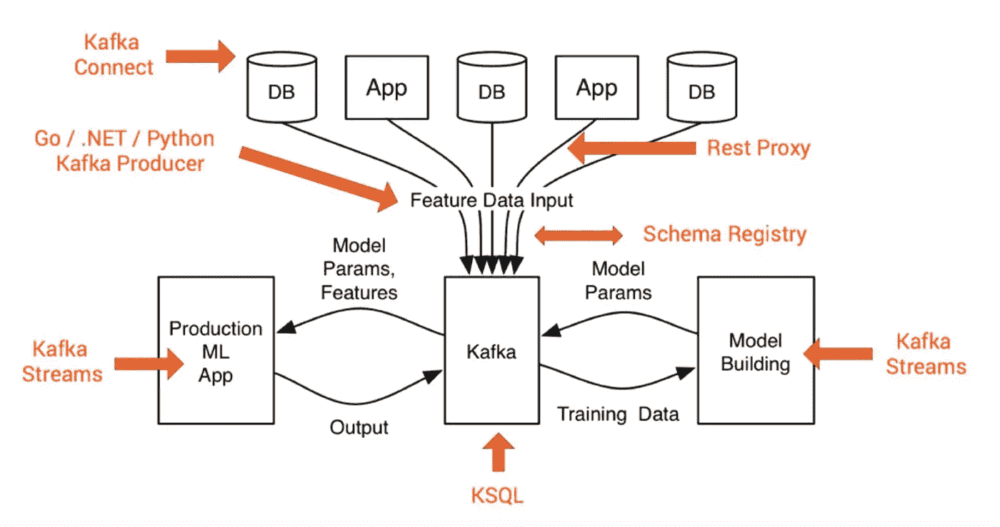
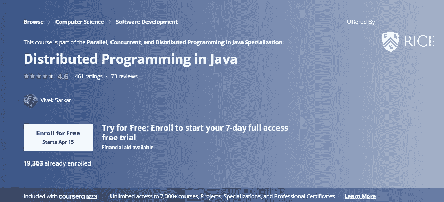
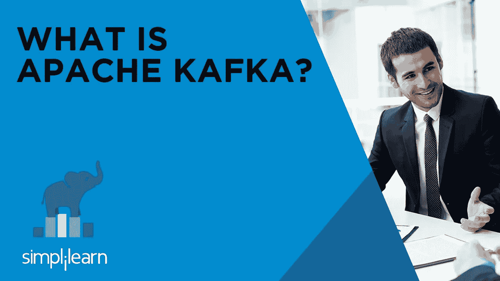

# 2023 年学习阿帕奇卡夫卡的 10 大课程|适合初学者的最佳卡夫卡课程

> 原文：<https://medium.com/javarevisited/top-10-apache-kafka-online-training-courses-and-certifications-621f3c13b38c?source=collection_archive---------0----------------------->

## 以上是 Udemy，Coursera，plural sight 2023 年学习卡夫卡最好的阿帕奇卡夫卡在线培训课程

你可能听说过 Apache Kafka，这是下一代大数据消息系统，每天为 LinkedIn、优步、Airbnb 和 Twitter 等公司处理数十亿条消息。

过去，我曾分享过一些关于[大数据](http://javarevisited.blogspot.sg/2017/12/top-5-courses-to-learn-big-data-and.html)、 [Spark](/swlh/5-free-online-courses-to-learn-big-data-hadoop-and-spark-in-2019-a553e6ccfe30) 和 [Hadoop](http://javarevisited.blogspot.sg/2018/04/top-5-hadoop-courses-to-learn-online.html) 的精彩课程，我的许多读者要求我分享关于阿帕奇卡夫卡的类似建议。如果你对阿帕奇卡夫卡感兴趣，并且正在寻找一些在线学习的课程，那么你来对地方了。

在这篇文章中，我将分享一些[最好的阿帕奇卡夫卡课程](https://javarevisited.blogspot.com/2018/04/top-5-apache-kafka-course-to-learn.html)在线学习。如果你了解大数据，那么你很可能也听说过 Apache Kafka，这款软件可以为任何组织处理数据馈送。这是一个由 Apache 基金会开发的分布式流平台，用于构建实时数据管道。

> *Apache Kafka 最大的优势是其速度和横向可扩展性，这意味着您可以通过添加更多硬件来增加容量和吞吐量。这使得它非常适合处理大数据的公司。*

Apache Kafka 旨在解决大规模数据移动问题，已帮助数百家公司取得了现有消息传递系统无法实现的成功。

你可能不知道 Apache Kafka 是用 [Scala](http://javarevisited.blogspot.sg/2018/01/10-reasons-to-learn-scala-programming.html#axzz550Ppgfxg) 和 [Java](http://javarevisited.blogspot.sg/2013/04/10-reasons-to-learn-java-programming.html#axzz59dMqZlkB) 编写的，它旨在提供一个统一的、高吞吐量、低延迟的平台来处理实时数据馈送。

# 2023 年供初学者在线学习的 10 门最佳阿帕奇卡夫卡课程

以下是 2023 年初学者学习阿帕奇卡夫卡最好的在线课程。这些课程选自 Udemy、Coursera 和 Pluralsight 等顶级学习网站。它们是由阿帕奇卡夫卡专家创作的，受到全球数百万卡夫卡学习者的信赖。让我们详细探索一下

## 1.[阿帕奇卡夫卡系列:初学阿帕奇卡夫卡](https://click.linksynergy.com/deeplink?id=JVFxdTr9V80&mid=39197&murl=https%3A%2F%2Fwww.udemy.com%2Fcourse%2Fapache-kafka%2F)

这是另一个从零开始学习阿帕奇卡夫卡的好课程。对于希望学习 Apache Kafka 基础知识的开发人员和架构师来说，这是一门理想的课程。

在本课程中，Udemy 上的一系列阿帕奇卡夫卡课程的作者、讲师夏羽·马雷克将向您介绍阿帕奇卡夫卡生态系统的一切，从其架构和核心概念到运营。

本课程也是实践操作，因为您将启动一个用于开发目的的个人 Kafka 集群，并创建和配置用于读取和写入数据的主题。

您还将学习如何将 Apache Kafta 与 Spark、Akka、Scala 和 Apache NiFi 等流行的编程和大数据框架相集成。

> 这里是报名链接— [**初学阿帕奇卡夫卡**](https://click.linksynergy.com/deeplink?id=JVFxdTr9V80&mid=39197&murl=https%3A%2F%2Fwww.udemy.com%2Fcourse%2Fapache-kafka%2F)

## 2.[Apache Kafka 入门](https://pluralsight.pxf.io/c/1193463/424552/7490?u=https%3A%2F%2Fwww.pluralsight.com%2Fcourses%2Fapache-kafka-getting-started)

这是从零开始学习阿帕奇卡夫卡的绝佳课程。在本课程中，讲师 Ryan Plant 将向您介绍 Apache Kafka 的所有架构，正是这些架构使 Apache Kafka 能够如此可靠地扩展和运行。

在最初的概述之后，课程转向解释 Apache Kafka 的各个组件，如用于处理实时数据馈送的 Kafka 流，以及如何用 [Java](/javarevisited/10-free-courses-to-learn-java-in-2019-22d1f33a3915) 开发 Apache Kafka 解决方案。

学完本课程后，您应该掌握了使用 Apache Kafka 构建自己的下一代大数据解决方案的所有必要知识。

以下是参加课程的链接—[**Apache Kafka 入门**](https://pluralsight.pxf.io/c/1193463/424552/7490?u=https%3A%2F%2Fwww.pluralsight.com%2Fcourses%2Fapache-kafka-getting-started)

顺便说一下，你需要一个 [Pluralsight 会员](http://pluralsight.pxf.io/c/1193463/424552/7490?u=https%3A%2F%2Fwww.pluralsight.com%2Flearn)才能进入这个课程，这个课程的费用大约是每月 29 美元。但是，如果你愿意，你可以通过注册 10 天的免费试用来付费学习这门课程。

<http://pluralsight.pxf.io/c/1193463/424552/7490?u=https%3A%2F%2Fwww.pluralsight.com%2Flearn>  

## 3. [Apache Kafka 系列—用于数据处理的 Kafka 流](https://click.linksynergy.com/deeplink?id=CuIbQrBnhiw&mid=39197&murl=https%3A%2F%2Fwww.udemy.com%2Fcourse%2Fkafka-streams%2F)

这是另一个关于阿帕奇卡夫卡的精彩课程，作者是夏羽·马雷克。本课程重点介绍 Kafka Streams，这是一个用于构建微服务的客户端库，其中的输入和输出数据存储在 Kafka 集群中。

在本课程中，您将通过 [Java 8](https://www.freecodecamp.org/news/these-are-the-best-free-courses-to-help-you-learn-java-8-and-java-9-a7615c8644ab/?source=search_post---------9) 中的动手示例学习如何使用 Kafka Streams API。不过，在尝试这门课程之前，你应该对 Java 8 和 Apache Kafka 都有很好的理解。

您还将了解 KStream 和 KTable，简单和高级操作，以及精确一次语义，或 EOS，如 Kafka 如何启用 EOS 以及如何在 Kafka 流中激活它。

这里是报名链接— [**阿帕奇卡夫卡数据流**](https://click.linksynergy.com/deeplink?id=CuIbQrBnhiw&mid=39197&murl=https%3A%2F%2Fwww.udemy.com%2Fcourse%2Fkafka-streams%2F)

## 4.[Coursera 中的 Java 分布式编程](https://coursera.pxf.io/c/3294490/1164545/14726?u=https%3A%2F%2Fwww.coursera.org%2Flearn%2Fdistributed-programming-in-java)

这是一门面向 Java 程序员的高级课程，这些程序员愿意学习更多关于分布式编程的知识，而不仅仅是 Kafka。它在 [Java 8](/javarevisited/top-5-java-online-courses-for-beginners-best-of-lot-1e1e240a758) 的背景下教授学习者(行业专业人士和学生)分布式编程的基本概念。

分布式编程使开发人员能够在数据中心使用多个节点来增加吞吐量和/或减少所选应用程序的延迟。本课程也是 Java 专门化 中 [**并行、并发和分布式编程的一部分**](https://www.coursera.org/specializations/pcdp)

学完本课程后，你应该了解如何使用流行的分布式编程框架编写 Java 程序，包括 [Hadoop](https://www.java67.com/2018/05/top-5-free-big-data-courses-to-learn-Hadoop-Apache-Spark.html) 、 [Spark](https://www.java67.com/2018/04/5-free-apache-spark-course-for-java-scala-python-developers.html) 、Sockets、远程方法调用(RMI)、组播 Sockets、Kafka、Message Passing Interface (MPI)，以及将分布式与多线程相结合的不同方法。

这里是报名链接—[**Coursera 中 Java 分布式编程**](https://coursera.pxf.io/c/3294490/1164545/14726?u=https%3A%2F%2Fwww.coursera.org%2Flearn%2Fdistributed-programming-in-java)

如果你发现 Coursera 的课程很有用，因为它们是由知名公司如**谷歌**、 **IBM** 、**亚马逊**和世界上最好的大学创建的，我建议你加入 Coursera 的订阅计划 [**Coursera Plus**](https://coursera.pxf.io/c/3294490/1164545/14726?u=https%3A%2F%2Fwww.coursera.org%2Fcourseraplus)

<https://coursera.pxf.io/c/3294490/1164545/14726?u=https%3A%2F%2Fwww.coursera.org%2Fcourseraplus>  

这种单次订阅可以让你无限制地访问他们最受欢迎的**课程**、**专业**、**专业证书**和**指导项目**。它每年花费大约 399 美元，但是它完全物有所值，因为你可以获得无限制的证书。

## 5. [Apache Kafka 系列— Kafka 集群设置和管理](https://click.linksynergy.com/deeplink?id=CuIbQrBnhiw&mid=39197&murl=https%3A%2F%2Fwww.udemy.com%2Fcourse%2Fkafka-cluster-setup%2F)

这是由 Stéphane Maarek 在 Udemy 上撰写的阿帕奇卡夫卡系列的第三个课程。在本课程中，您将了解 Kafka 集群的设置和管理。

您将在 [AWS](https://javarevisited.blogspot.com/2019/05/top-5-courses-to-crack-aws-solutions-architect-associate-certification-exam-SAA-C01.html#axzz5rHwAwycj) 上设置一个 ZooKeeper 和 Kafka 集群，并学习如何在生产中部署 Kafka。您还将建立一个动物园管理员集群，并了解其在卡夫卡中的作用。

对于希望学习如何在多台服务器上设置 Kafka 集群的系统管理员或架构师来说，这是一门理想的课程

以下是注册链接— [**Apache Kafka 集群设置和管理**](https://click.linksynergy.com/deeplink?id=CuIbQrBnhiw&mid=39197&murl=https%3A%2F%2Fwww.udemy.com%2Fcourse%2Fkafka-cluster-setup%2F)

## 6.[阿帕奇卡夫卡培训由 Edureka](https://click.linksynergy.com/deeplink?id=JVFxdTr9V80&mid=42536&murl=https%3A%2F%2Fwww.edureka.co%2Fkafka-certification-training&LSNSUBSITE=LSNSUBSITE)

Edureka 的 Apache Kafka 认证培训帮助您学习关于 Kafka 架构、配置 Kafka 集群、Kafka 生产者、Kafka 消费者、Kafka 监控的概念。

它旨在提供关于 Kafka 与 [Hadoop](/javarevisited/top-10-courses-to-learn-big-data-and-hadoop-best-of-lot-23ef8691633f) 、Storm 和 [Spark](https://www.java67.com/2018/05/top-5-free-big-data-courses-to-learn-Hadoop-Apache-Spark.html) 的集成的见解，您还将了解如何使用 Kafka Stream APIs、使用 Kafka 实现 Twitter 流，以及通过真实案例研究进行 Flume。

这里是注册链接— [阿帕奇卡夫卡培训由 Edureka](https://click.linksynergy.com/deeplink?id=JVFxdTr9V80&mid=42536&murl=https%3A%2F%2Fwww.edureka.co%2Fkafka-certification-training&LSNSUBSITE=LSNSUBSITE)

<https://click.linksynergy.com/deeplink?id=JVFxdTr9V80&mid=42536&murl=https%3A%2F%2Fwww.edureka.co%2Fkafka-certification-training&LSNSUBSITE=LSNSUBSITE>  

## 4.[阿帕奇卡夫卡认证培训](https://www.simplilearn.com/big-data-and-analytics/apache-kafka-training-tutorial?utm_source=cj&utm_medium=8534939&utm_campaign=Soma%20Sharma)

本课程是 SimpliLearn 中[大数据 Hadoop](https://javarevisited.blogspot.com/2018/04/top-5-hadoop-courses-to-learn-online.html) 架构师硕士课程的一部分，它将教你所有你想知道的关于 Apache Kafka 的知识。这是一门认证课程，因此涵盖了各种主题。

在这个 Apache Kafka 培训课程中，您将学习 Kafka 架构、安装、界面和配置。

该课程从大数据概述开始，然后从安装介绍开始解释 ZooKeeper 和 Apache Kafka。

这里是报名链接— [**阿帕奇卡夫卡认证培训**](https://www.simplilearn.com/big-data-and-analytics/apache-kafka-training-tutorial?utm_source=cj&utm_medium=8534939&utm_campaign=Soma%20Sharma)

## 8.[阿帕奇卡夫卡系列—卡夫卡连线动手学习](https://click.linksynergy.com/deeplink?id=JVFxdTr9V80&mid=39197&murl=https%3A%2F%2Fwww.udemy.com%2Fcourse%2Fkafka-connect%2F)

Kafka Connect 是一个工具，用于在 Apache Kafka 和其他数据系统之间传输可扩展和可靠的流数据。Apache Kafka Connect 是 Apache Kafka 生产者和消费者的通用框架。

Apache Kafka Connect 提供了一个 API、运行时和 REST 服务，使开发人员能够定义连接器，将大型数据集实时移入和移出 Apache Kafka。

在本课程中，您将通过动手练习学习 Kafka 连接器的部署、配置和管理。您还将了解分布式和独立模式，这些模式可以扩展到支持整个组织的大型集中管理服务，也可以扩展到开发、测试和小型生产部署。

**这里是报名链接**——[阿帕奇卡夫卡系列——卡夫卡连线动手学习](https://click.linksynergy.com/deeplink?id=JVFxdTr9V80&mid=39197&murl=https%3A%2F%2Fwww.udemy.com%2Fcourse%2Fkafka-connect%2F)

<https://click.linksynergy.com/deeplink?id=JVFxdTr9V80&mid=39197&murl=https%3A%2F%2Fwww.udemy.com%2Fcourse%2Fkafka-connect%2F>  

## 9. [Apache Kafka 系列—融合模式注册表& REST 代理](https://click.linksynergy.com/deeplink?id=JVFxdTr9V80&mid=39197&murl=https%3A%2F%2Fwww.udemy.com%2Fcourse%2Fconfluent-schema-registry%2F)

本课程是网络上第一个也是唯一一个可用的 Kafka Schema Registry 和 Kafka REST 代理课程。阿帕奇卡夫卡越来越成为必备技能。

本课程将帮助您快速成功地在 Kafka 中使用 Avro，以及融合组件—Kafka 模式注册表和 Kafka REST 代理。就业市场需要具备你新获得的技能的人！

下面是注册链接— [**Apache Kafka 系列—合流模式注册表& REST 代理**](https://click.linksynergy.com/deeplink?id=JVFxdTr9V80&mid=39197&murl=https%3A%2F%2Fwww.udemy.com%2Fcourse%2Fconfluent-schema-registry%2F)

<https://click.linksynergy.com/deeplink?id=JVFxdTr9V80&mid=39197&murl=https%3A%2F%2Fwww.udemy.com%2Fcourse%2Fconfluent-schema-registry%2F>  

## 10. [Apache Kafka 系列— Kafka 安全(SSL SASL Kerberos ACL)](https://click.linksynergy.com/deeplink?id=JVFxdTr9V80&mid=39197&murl=https%3A%2F%2Fwww.udemy.com%2Fcourse%2Fapache-kafka-security%2F)

安全性在任何地方都是一个重要的方面，Apache Kafka 集群也不例外。越来越多的 Apache Kafka 集群正在被保护或希望被保护。

在本课程中，您将学习 Kafka 安全性，包括加密(SSL)、认证(SSL & SASL)和授权(ACL)。如果你在设置 Kafka 安全性时遇到困难，或者无法理解文档，那么这个课程就是为你准备的

顺便说一下，本课程只涉及加密和认证的 SSL 和 SASL Kerberos，不涉及其他机制。它还提供了在多代理设置中启用安全性的概述，但最后一部分留给学生研究和练习。

这里是报名链接— [**阿帕奇卡夫卡系列—卡夫卡安全(SSL SASL Kerberos ACL)**](https://click.linksynergy.com/deeplink?id=JVFxdTr9V80&mid=39197&murl=https%3A%2F%2Fwww.udemy.com%2Fcourse%2Fapache-kafka-security%2F)

以上是 Java 开发人员学习 Apache Kafka 的一些最佳课程。Apache Kafka 是一项突破性的技术，为 2000 多家公司的高速消息传递需求提供了动力，对 Apache Kafka 的良好了解将大大促进您的职业发展。我强烈建议有经验的 Java 开发人员、技术领导和解决方案架构师学习和理解 Apache Kafka。

您可能喜欢的其他**编程资源**:

*   [Web 开发者路线图(前端+后端)](https://dev.to/javinpaul/the-2019-web-development-frontend-backend-roadmap-4le2)
*   [Java 开发人员应该学习的 10 件事](http://javarevisited.blogspot.sg/2017/12/10-things-java-programmers-should-learn.html)
*   [5 面向 JavaScript 开发者的 React 原生课程](http://javarevisited.blogspot.sg/2018/02/5-react-native-courses-to-learn-mobile-development-using-JavaScript.html)
*   [Java 开发人员学习 DevOps 的 10 门免费 Docker 课程](http://javarevisited.blogspot.sg/2018/02/10-free-docker-container-courses-for-Java-Developers.html)
*   [5 面向程序员的数据科学和机器学习课程](https://dzone.com/articles/top-5-data-science-and-machine-learning-course-for)
*   【Java 程序员的 10 个测试工具
*   [devo PS 开发者路线图](https://hackernoon.com/the-2018-devops-roadmap-31588d8670cb?gi=8829080e6d7d)
*   [2023 年你可以学习的 10 项网络、移动和大数据技术](http://www.java67.com/2018/01/top-10-web-mobile-and-big-data-framework-libraries-technologies-programmers-should-learn-in-2018.html)
*   [React 开发者路线图](https://hackernoon.com/the-2018-react-js-roadmap-4d0a43814c02)
*   [通过建筑师 AWS 认证的前 5 门课程](https://hackernoon.com/top-5-online-courses-to-crack-amazon-web-service-aws-solutions-architect-associate-exam-saa-c01-c667514ca72)

感谢您到目前为止阅读本课程。如果您喜欢这些 *Apache Kafka 在线培训课程和认证*，请与您的朋友和同事分享。如果您有任何问题或反馈，请留言。

如果你想学习阿帕奇卡夫卡并寻找免费资源，你也可以在 Udemy 上查看阿帕奇卡夫卡和 Spring Boot(消费者，生产者)课程。它是完全免费的，可以帮助你学习卡夫卡的基础知识。

<https://javarevisited.blogspot.com/2021/12/5-free-courses-to-learn-apache-kafka.html> 