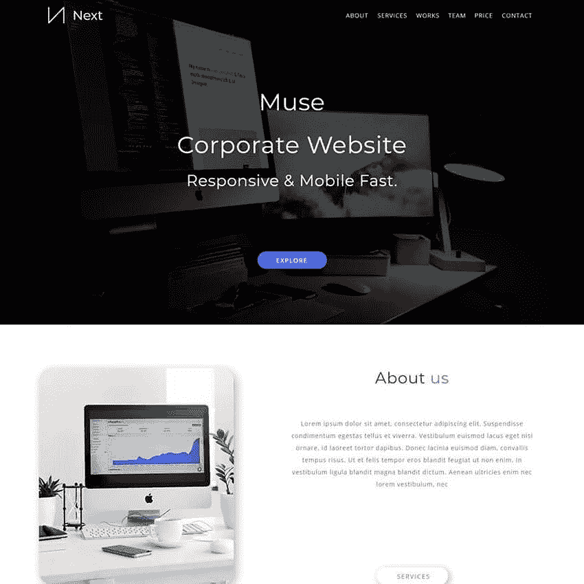
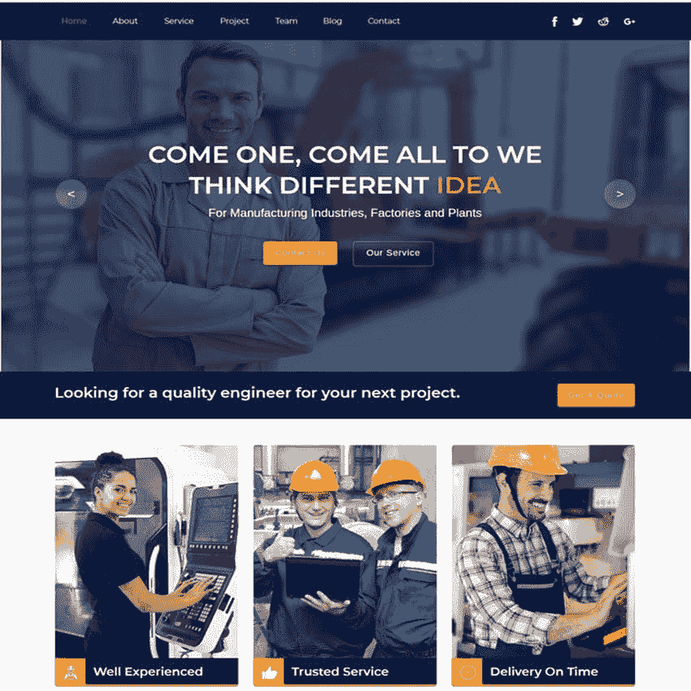
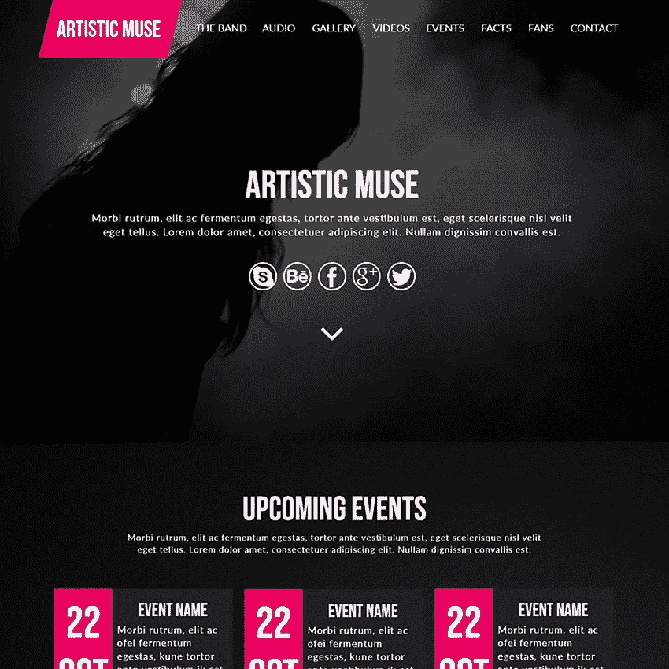
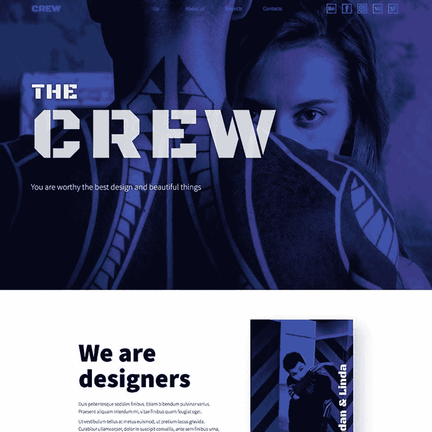
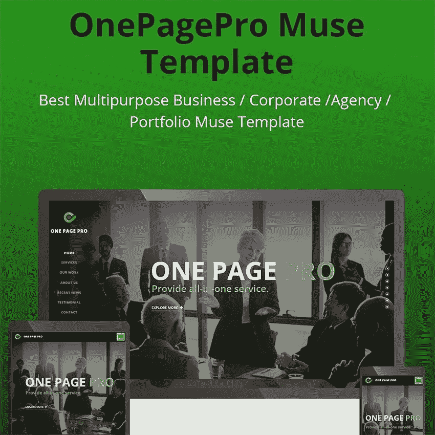
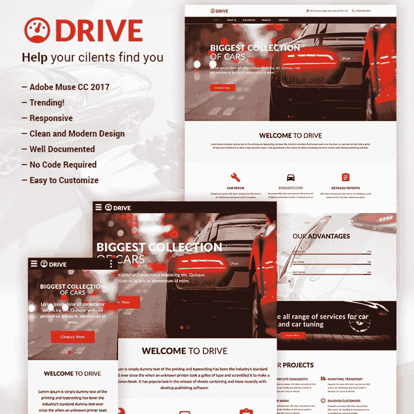
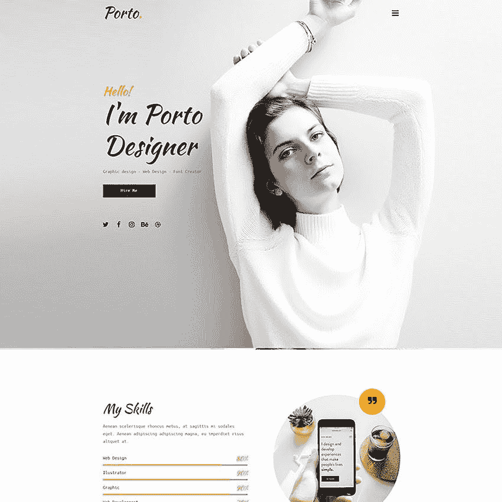
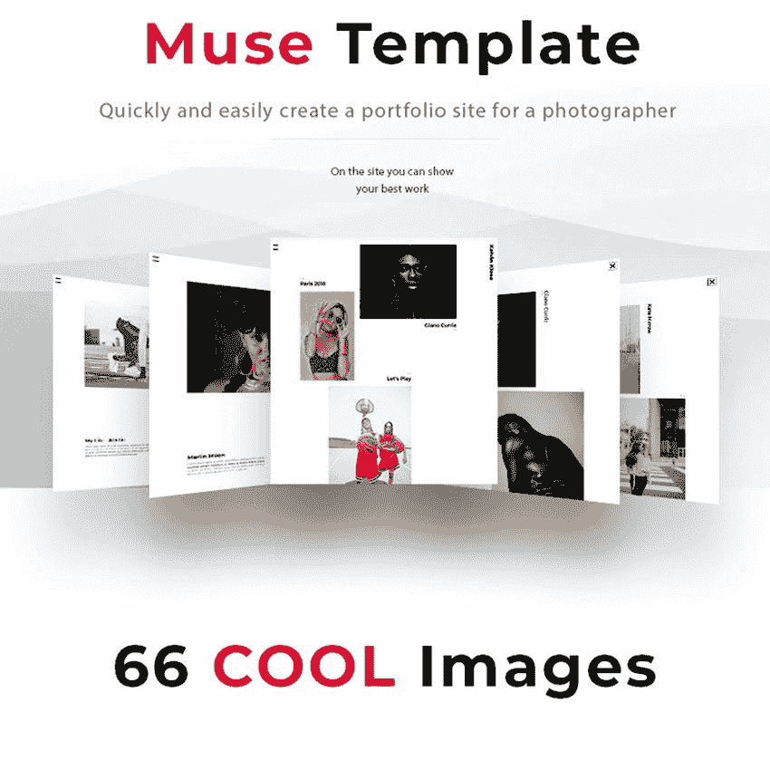
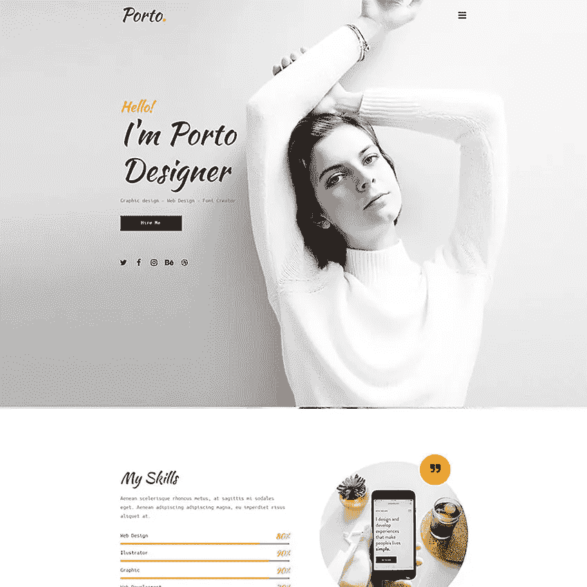
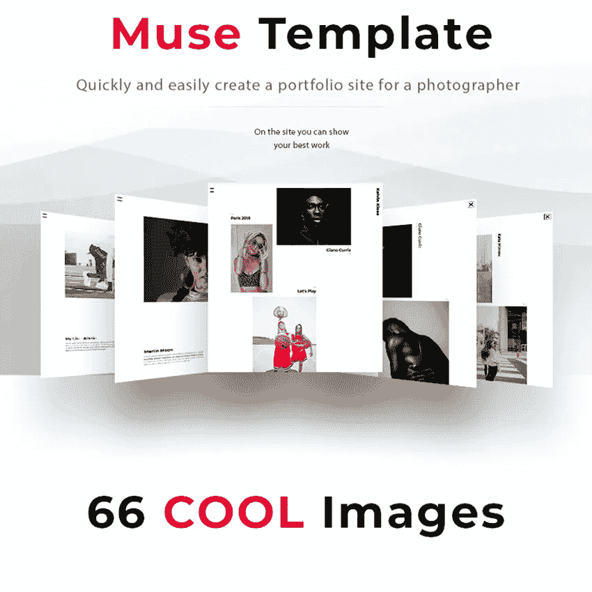

# 令人惊叹的网站的十大最佳 Adobe Muse 模板

> 原文：<https://medium.com/javarevisited/top-10-best-adobe-muse-templates-for-stunning-websites-ef691eb5368c?source=collection_archive---------2----------------------->

所以你需要为你的在线项目建立一个网站，现在你看到了一个很大的选择。起初，你的选择可能包括一些现成的服务，你可以通过拖放来建立一个网站。最后，你可以使用 Adobe Muse。

Adobe Muse 是一个网站构建器，它可以帮助您使用拖放操作来创建网站，而不需要任何编码技能。

# Adobe Muse 功能:

*   易于使用的拖放编辑功能
*   一旦网站上线，可以进行修改
*   内置的响应网站架构，等等

设计过程就像名字暗示的那样简单——首先，你要为你的网站创建一个计划，然后进入设计过程，在不同的设备上预览你的网站，然后导出 HTML 或者发布到主机服务器。

# 以下是我最喜欢的 Adobe Muse 图形和应用资源集:

*   [网页设计者报告](https://www.webdesignerdepot.com/?s=adobe+muse)
*   [Colorlib 博客](https://colorlib.com/wp/?s=muse+templates)
*   [砸杂志赠品](http://www.smashingmagazine.com/tag/freebies)
*   WebdesignerLedger
*   [TemplateMonster 博客](https://www.templatemonster.com/blog/search/muse/?aff=javarevisited&utm_campaign=blog_site_adobe&utm_source=javarevisited&utm_medium=referral)

这里有 **Adobe Muse 模板**帮助你启动下一个项目:

## [下一个创意组合 Muse 模板](https://www.templatemonster.com/adobe-muse-template/next-creative-portfolio-muse-template-78121.html?aff=javarevisited&utm_campaign=blog_site_adobe&utm_source=javarevisited&utm_medium=referral)

下一个创意组合缪斯模板是一个设计简单干净的缪斯模板。它是为创意机构或投资组合设计的。你可以用它来写你的简历或作品集。这是网页设计师，平面设计师，开发人员，摄影师，自由职业者和其他人的完美选择。这个模板与所有现代浏览器兼容，这意味着所有用户都可以查看你的在线项目。模板的内容、选项卡、小部件和其他方面很容易定制，只需几次点击。

# [工业—工业和工厂 Muse 模板](https://www.templatemonster.com/adobe-muse-template/industrial-industry-and-factory-muse-template-79155.html?aff=javarevisited&utm_campaign=blog_site_adobe&utm_source=javarevisited&utm_medium=referral)

当你决定是时候推出一个网站，确保你不要让这个过程太复杂。如果建筑或工业是你工作的行业，只要看看工业-工业和工厂 Muse 模板，以后再感谢我。从头开始设计网站已经是过去的事情了。这个单页的 Adobe Muse 模板为您提供了打造一个人人羡慕的优秀网络空间所需的一切。

Industrial 是一个很棒的工具，具有很好的特性和很容易定制。即使你是第一次创建网站，每个人都可以使用它。

# [Greencare —园艺&美化 Muse 模板](https://www.templatemonster.com/adobe-muse-template/greencare-gardening-landscaping-muse-template-92291.html?aff=javarevisited&utm_campaign=blog_site_adobe&utm_source=javarevisited&utm_medium=referral)

要在网络人群中脱颖而出，你需要使用最好的工具和服务。第一步是专业地建立你的网站。如果你正在寻找最好的美化网站模板，你可能会考虑绿色保健。这是一个园艺和美化缪斯模板，包含两个惊人的主页。它的布局设计现代而优雅。它附带有用的网页，都是美化网站的最佳作品。这些页面包括团队、证明、联系人、服务、博客等等。Greencare 还实现了平滑过渡效果，以实现出色的内容显示。它也是跨浏览器兼容的，所以不管客户或访问者使用什么设备，你的网站看起来都会很出色。

# [艺术乐队缪斯模板](https://www.templatemonster.com/adobe-muse-template/artistic-band-muse-template-82692.html?aff=javarevisited&utm_campaign=blog_site_adobe&utm_source=javarevisited&utm_medium=referral)

你在寻找一个时尚优雅的 Adobe Muse 模板吗？如果你正在创建一个网站，需要看起来专业和现代，那么艺术乐队缪斯模板将是你的完美选择。这是一个最适合艺术家、乐队和自由设计师网站的作品集模板。

艺术乐队缪斯模板有一个整洁的设计，突出了项目的想法和图像，你想把额外的光芒。最后，网站应该是关于你和你的技能，而不是设计本身。艺术乐队缪斯模板是移动和视网膜就绪，并允许您轻松地改变您的页面。

# [剧组—水平视差/登陆页面 Muse 模板](https://www.templatemonster.com/adobe-muse-template/the-crew-horizontal-parallax-landing-page-muse-template-71624.html?aff=javarevisited&utm_campaign=blog_site_adobe&utm_source=javarevisited&utm_medium=referral)

CREW 是一个反应灵敏的 Adobe Muse 模板，具有复杂、简单和整洁的模板，不会引起任何干扰。该工具还具有超强的可修改性，更换方便。

你可以成为一名网页设计师、自由职业者、摄影师、建筑师，这些工作人员会让你受益匪浅。模板的皮肤以正确的方式突出你的工作，并让它出现在正确的人面前。由于灵活的布局，工作人员确保您的最终产品立即适应任何设备或浏览器。

# [OnePagePro Muse 模板](https://www.templatemonster.com/adobe-muse-template/onepagepro-muse-template-69309.html?aff=javarevisited&utm_campaign=blog_site_adobe&utm_source=javarevisited&utm_medium=referral)

您几乎可以立即使用 OnePagePro Muse 模板创建个人网站、代理机构或应用程序登录页面。它有一些预定义的演示，您可以从存档中获得。换句话说，只需几分钟，你就可以拥有一个为发布准备的个性化页面。

100%响应且跨浏览器兼容的 OnePagePro Muse 模板可让您的页面迅速适应任何设备和浏览器。此外，您不需要任何编码技能就可以使用 OnePagePro 并从中获得出色的东西。简单的拖放界面有很大的帮助，尤其是如果你是一个初学者。

# [开车—修车&调音 Muse 模板](https://www.templatemonster.com/adobe-muse-template/drive-car-repair-tuning-muse-template-67379.html?aff=javarevisited&utm_campaign=blog_site_adobe&utm_source=javarevisited&utm_medium=referral)

这种反应灵敏的 Muse 模板最适合汽车维修、汽车服务和保养。模板是基于现代布局。你也可以在任何网站上使用它。驾驶-汽车维修和调整缪斯模板是一个伟大的工具，具有很大的特点和简化的定制。所有的文件都组织得很好。你所需要的是管理你想要出现在你的网站上的元素。这是所有超级容易定制和维护的驱动器，没有人会迷失，而使用它。

# [BizAgent Muse 模板](https://www.templatemonster.com/adobe-muse-template/bizagent-muse-template-67303.html?aff=javarevisited&utm_campaign=blog_site_adobe&utm_source=javarevisited&utm_medium=referral)

BizAgent Muse Template 是一个面向数字营销机构的 Adobe Muse 模板，但自由职业者和其他创意专业人士也将从中受益。您可以先阅读教程，了解使用和定制 BizAgent 的过程。

有了 BizAgent Muse Template，您可以让您的项目在网上大放异彩，并让事情进展顺利。它 100%响应，兼容所有现代网络浏览器和设备。滑块是为你准备的，你可以用你最近的作品或者你最自豪的作品来填充它。

# [波尔图—个人с创意缪斯模板](https://www.templatemonster.com/adobe-muse-template/porto-personal-muse-template-69135.html?aff=javarevisited&utm_campaign=blog_site_adobe&utm_source=javarevisited&utm_medium=referral)

Porto —个人сcreative Muse 模板是一个伟大的工具，它将帮助您将您的才华、项目、技能和服务推向新的高度。设计师，摄影师，代理商，自由职业者，甚至小企业，你都可以从这个优秀的模板中获利，让自己与众不同。Porto 提供了一些非常适合你的功能。从响应性和浏览器友好的设计到全屏滑块、滚动动画、图库和联系人表单，都是 Muse 模板的一部分。

# [摄影师 Kelvin Muse 的作品集模板](https://www.templatemonster.com/adobe-muse-template/the-best-portfolio-of-photographer-kelvin-muse-template-68284.html?aff=javarevisited&utm_campaign=blog_site_adobe&utm_source=javarevisited&utm_medium=referral)

如果你正在寻找一个适合摄影空间的创意 Adobe Muse 模板，最好的摄影师 Kelvin Muse 模板组合就是这样一个。这一令人敬畏的设计将使事情立即向前发展，因为它已经预定义好了一切，随时可以使用。用 Kevin Muse 模板建立网站，不需要任何编码知识。因此，每个人都可以拥有一个有创意的网站，让事情发生——没有例外。这个缪斯模板的外观也非常简洁优雅，很容易适应不同的口味。但是，如果你想定制它，无论如何，让它发生。

如果你不想从零开始设计*，那么你总是可以选择使用 Adobe Muse 模板。作为一名设计博主，我总是尽力为我的读者带来最好的设计。在这篇文章中，我收集了一些最好的 Adobe Muse 模板。*

*所有这些模板都是优质的，你可以在你的个人和专业设计中使用它们。*

*BizAgent Muse Template 是一个面向数字营销机构的 Adobe Muse 模板，但自由职业者和其他创意专业人士也将从中受益。您可以先阅读教程，了解使用和定制 BizAgent 的过程。*

*有了 BizAgent Muse Template，您可以让您的项目在网上大放异彩，并让事情进展顺利。它 100%响应，兼容所有现代网络浏览器和设备。滑块是为你准备的，你可以用你最近的作品或者你最自豪的作品来填充它。*

# *[波尔图—个人с创意缪斯模板](https://www.templatemonster.com/adobe-muse-template/porto-personal-muse-template-69135.html?aff=faun&utm_campaign=blog_site_muse&utm_source=faun&utm_medium=referral)*

**

*Porto —个人сcreative Muse 模板是一个伟大的工具，它将帮助您将您的才华、项目、技能和服务推向新的高度。设计师，摄影师，代理商，自由职业者，甚至小企业，你都可以从这个优秀的模板中获利，让自己与众不同。Porto 提供了一些非常适合你的功能。从响应性和浏览器友好的设计到全屏滑块、滚动动画、图库和联系人表单，都是 Muse 模板的一部分。*

# *[摄影师 Kelvin Muse 的作品集模板](https://www.templatemonster.com/adobe-muse-template/the-best-portfolio-of-photographer-kelvin-muse-template-68284.html?aff=faun&utm_campaign=blog_site_muse&utm_source=faun&utm_medium=referral)*

**

*如果你正在寻找一个适合摄影空间的创意 Adobe Muse 模板，最好的摄影师 Kelvin Muse 模板组合就是这样一个。这一令人敬畏的设计将使事情立即向前发展，因为它已经预定义好了一切，随时可以使用。用 Kevin Muse 模板建立网站，不需要任何编码知识。因此，每个人都可以拥有一个有创意的网站，让事情发生——没有例外。这个缪斯模板的外观也非常简洁优雅，很容易适应不同的口味。但是，如果你想定制它，无论如何，让它发生。*

*如果你不想从零开始设计*，那么你总是可以选择使用 Adobe Muse 模板。作为一名设计博主，我总是尽力为我的读者带来最好的设计。在这篇文章中，我收集了一些最好的 Adobe Muse 模板。**

**所有这些模板都是优质的，你可以在你的个人和专业设计中使用它们。**