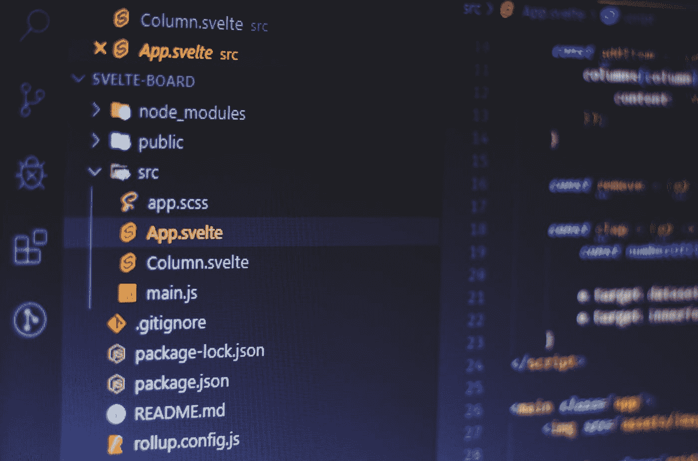
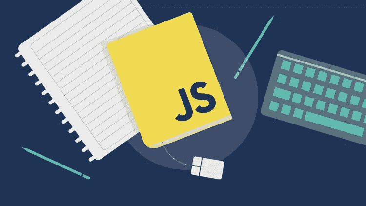
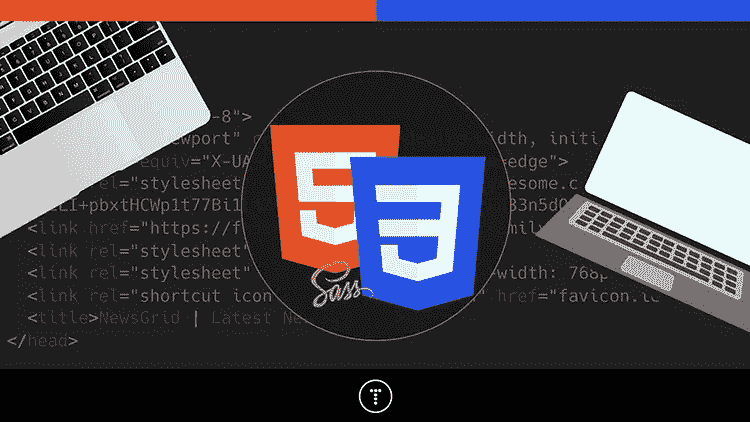
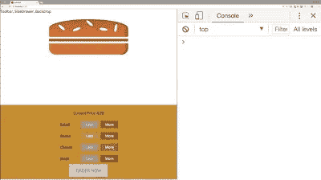
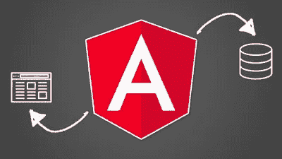
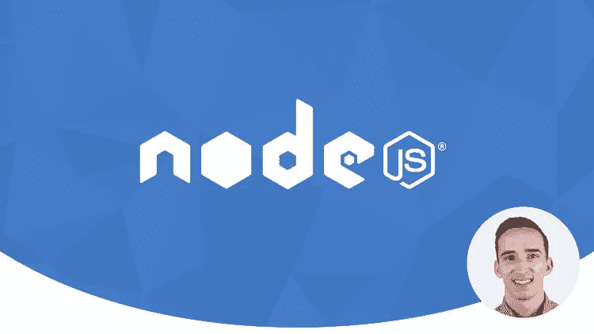
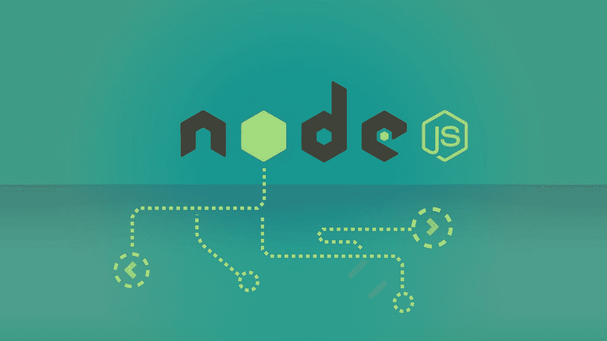
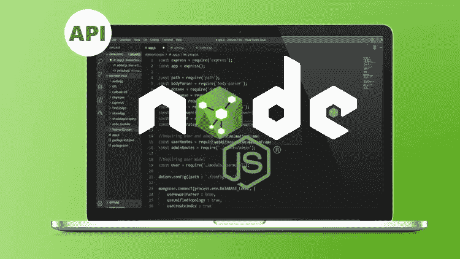

# 2022 年学习 Web 开发的十大最佳 Udemy 课程

> 原文：<https://medium.com/javarevisited/top-10-best-udemy-courses-for-web-development-in-2020-9263f13ee4be?source=collection_archive---------0----------------------->

## 这些是最好的 Udemy 课程，学习 HTML、CSS、JavaScript、Angular、React.js 和 Node.js，成为专业的 web 开发人员。

费伦茨·阿尔马西在 [Unsplash](https://unsplash.com?utm_source=medium&utm_medium=referral) 上的照片

大家好，如果你想学习 web 开发并寻找一些最好的 Udemy 开发课程，那么你来对地方了。

在这篇文章中，我将分享最好的 Udemy 课程，以学习所有必要的 web 开发技术，如 HTML、CSS、JavaScript 和 React.js、Angular.js 和 Node.js 等框架。

你可以通过这些课程在短时间内成为一名网络开发人员，并且不需要花费太多，因为你可能知道 Udemy 现在正在进行他们的 [**年度最大销售**](https://click.linksynergy.com/deeplink?id=JVFxdTr9V80&mid=39197&murl=https%3A%2F%2Fwww.udemy.com%2F)**其中每门课程的价格仅为 9.99 美元，是的，你没听错，仅为 9.99 美元，即使是原价为 200 美元的课程，如果你正在寻找最好的课程**

# **学习 Web 开发的十大 Udemy 课程**

**不管怎样，以下是 Udemy 的十大网络开发课程列表:**

1.  **[完整的 JavaScript 课程 2022:构建真正的项目](https://click.linksynergy.com/fs-bin/click?id=JVFxdTr9V80&subid=0&offerid=323058.1&type=10&tmpid=14538&RD_PARM1=https%3A%2F%2Fwww.udemy.com%2Fthe-complete-javascript-course%2F)作者 Jonas Schmedtmann**
2.  **[完整的 JavaScript 课程 2022:构建真实的项目](https://click.linksynergy.com/fs-bin/click?id=JVFxdTr9V80&subid=0&offerid=323058.1&type=10&tmpid=14538&RD_PARM1=https%3A%2F%2Fwww.udemy.com%2Fthe-complete-javascript-course%2F)Maximilian Schwarzüller 著**
3.  **用 HTML5 和 CSS3 构建响应性的真实世界网站**
4.  **[现代 HTML & CSS 从头开始(包括 Sass)](https://click.linksynergy.com/deeplink?id=JVFxdTr9V80&mid=39197&murl=https%3A%2F%2Fwww.udemy.com%2Fcourse%2Fmodern-html-css-from-the-beginning%2F) 作者 Brad Traversy**
5.  **[**摩登 React with Redux (2022 年更新)**](https://click.linksynergy.com/fs-bin/click?id=JVFxdTr9V80&subid=0&offerid=323058.1&type=10&tmpid=14538&RD_PARM1=https%3A%2F%2Fwww.udemy.com%2Freact-redux%2F) **作者斯蒂芬·格里德****
6.  **[**React 16—Maximillian Schwarz muller 的**](https://click.linksynergy.com/fs-bin/click?id=JVFxdTr9V80&subid=0&offerid=323058.1&type=10&tmpid=14538&RD_PARM1=https%3A%2F%2Fwww.udemy.com%2Freact-the-complete-guide-incl-redux%2F) 完全指南**
7.  **[Angular—Maximillian Schwarz muller 的完整指南](https://click.linksynergy.com/fs-bin/click?id=JVFxdTr9V80&subid=0&offerid=323058.1&type=10&tmpid=14538&RD_PARM1=https%3A%2F%2Fwww.udemy.com%2Fthe-complete-guide-to-angular-2%2F)**
8.  **[完整的 Node.js 开发者课程(第三版)](https://click.linksynergy.com/fs-bin/click?id=JVFxdTr9V80&subid=0&offerid=323058.1&type=10&tmpid=14538&RD_PARM1=https%3A%2F%2Fwww.udemy.com%2Fthe-complete-nodejs-developer-course-2%2F)作者 Andrew Mead**
9.  **[NodeJS —完整指南(MVC、REST APIs、GraphQL、Deno)](https://click.linksynergy.com/deeplink?id=JVFxdTr9V80&mid=39197&murl=https%3A%2F%2Fwww.udemy.com%2Fcourse%2Fnodejs-the-complete-guide%2F) 作者 Max**
10.  **Brad Traversy 编写的带有 Express & MongoDB 的 Node.js API Masterclass**

**现在，让我们深入每一门课程，找出为什么它们是 2022 年 Udemy 学习 web 开发的最佳课程。**

## **[1。完整的 JavaScript 课程 2022:构建真实的项目](https://click.linksynergy.com/fs-bin/click?id=JVFxdTr9V80&subid=0&offerid=323058.1&type=10&tmpid=14538&RD_PARM1=https%3A%2F%2Fwww.udemy.com%2Fthe-complete-javascript-course%2F)(**

**这是我个人最喜欢的，也可能是 Udemy 上最好的 JavaScript 课程。我参加过很多关于 JavaScript 的 Udemy 课程，但是我可以说这是学习 JavaScript 的最好的和完整的基于实践项目的课程。**

**超过 300，000 名学生参加了该课程，近 77，000 名参与者对该课程的平均评分为 4.6 分，这是非常了不起的，充分说明了该课程的质量。

讲师——乔纳斯·施梅特曼**

****这里是加入本课程的链接**——[2022 年完整 JavaScript 课程:构建真实项目](https://click.linksynergy.com/fs-bin/click?id=JVFxdTr9V80&subid=0&offerid=323058.1&type=10&tmpid=14538&RD_PARM1=https%3A%2F%2Fwww.udemy.com%2Fthe-complete-javascript-course%2F)**

****

## **2.[JavaScript—2022 年完全指南(初级+高级)](https://click.linksynergy.com/deeplink?id=JVFxdTr9V80&mid=39197&murl=https%3A%2F%2Fwww.udemy.com%2Fcourse%2Fjavascript-the-complete-guide-2020-beginner-advanced%2F)**

**这是在 Udemy 上学习 JavaScript 的又一门综合课程。这个课程是由我最喜欢的 Udemy 导师 Maximilian Schwarzmuller 创建的，他也是《React 完整指南》和《角度指南》课程的作者，这两个课程是对 web 开发人员最有用的资源。**

**该课程也是 2022 年学习 JavaScript 的最新课程，也是 Udemy 上评分最高的课程之一，近 7000 名参与者的平均评分为 4.6。

**导师** —马克西米连·施瓦兹米勒**

****这里是加入本课程的链接**——[完整的 JavaScript 课程 2022:构建真实的项目](https://click.linksynergy.com/fs-bin/click?id=JVFxdTr9V80&subid=0&offerid=323058.1&type=10&tmpid=14538&RD_PARM1=https%3A%2F%2Fwww.udemy.com%2Fthe-complete-javascript-course%2F)**

****

## **3.[用 HTML5 和 CSS3 构建反应灵敏的真实世界网站](https://click.linksynergy.com/deeplink?id=JVFxdTr9V80&mid=39197&murl=https%3A%2F%2Fwww.udemy.com%2Fcourse%2Fdesign-and-develop-a-killer-website-with-html5-and-css3%2F)**

**这是学习 HTM 5 和 CSS 3 的最好的 Udemy 课程，这是学习 web 开发需要的两个核心 web 技术。**

**本课程包括终身访问 12 小时的视频，11 篇文章和 8 个资源下载。它将教你建立真实网站的真实技能:专业、漂亮、真正有反应的网站。

这是一门基于项目的课程，所以你会先学习理论部分，然后把一切都应用到大项目上。对于想开始学习网页开发和设计的人来说，这是一门完美的课程。**

**讲师—乔纳斯·施梅特曼**

****这里是加入本课程的链接**——[用 HTML5 和 CSS3 构建反应灵敏的真实世界网站](https://click.linksynergy.com/deeplink?id=JVFxdTr9V80&mid=39197&murl=https%3A%2F%2Fwww.udemy.com%2Fcourse%2Fdesign-and-develop-a-killer-website-with-html5-and-css3%2F)**

****

## **4.[现代 HTML & CSS 从头开始(包括 Sass)](https://click.linksynergy.com/deeplink?id=JVFxdTr9V80&mid=39197&murl=https%3A%2F%2Fwww.udemy.com%2Fcourse%2Fmodern-html-css-from-the-beginning%2F)**

**做这个教程，你将学习如何建立多个高质量的网站和 UI 项目。你将从事 flexbox & CSS 网格项目。此外，你将知道如何处理 CSS 变量，过渡，下拉，覆盖，等等。该课程适用于所有技能水平。它包括 21 小时的视频，2 篇文章，和 26 个可供下载的档案。老师用非常熟悉的语气，从基础开始讲解，所以很容易理解。他不怕展示他自己的编码错误，这样你也可以从中吸取教训。**

**讲师——布拉德·特拉弗斯**

****还有，这里是加入这个课程的链接**——[现代 HTML & CSS 从头开始(包括 Sass)](https://click.linksynergy.com/deeplink?id=JVFxdTr9V80&mid=39197&murl=https%3A%2F%2Fwww.udemy.com%2Fcourse%2Fmodern-html-css-from-the-beginning%2F)**

****

## **[**5。现代 React with Redux (2022 更新)**](https://click.linksynergy.com/fs-bin/click?id=JVFxdTr9V80&subid=0&offerid=323058.1&type=10&tmpid=14538&RD_PARM1=https%3A%2F%2Fwww.udemy.com%2Freact-redux%2F)**

**React.js 是学习前端开发必不可少的框架之一，也是学习 Udemy 上 React JS 和 Redux 的最好课程之一。**

**讲师 Stephen Grider 是 JavaScript 前端开发领域最优秀的讲师之一，有超过 23 万名学生注册了他的课程。

他是为旧金山湾区的顶级公司建造复杂 [JavaScript](https://javarevisited.blogspot.com/2018/06/top-10-courses-to-learn-javascript-in.html) 前端的专家，这在本课程中有所展示。

该课程涵盖了 React 和 Redux 的大部分基本概念，如 React 的基础知识、JSX (React 的定制标记语言)、“props”、“state”、eventing 等，还涉及了 ES 6 等新主题以及 Babel 和 WebPack 等高级概念，这些概念对全栈 web 开发人员非常重要。**

**讲师—斯蒂芬·格里德**

****这里是加入本课程的链接**——[现代反应与 Redux (2022 更新)](https://click.linksynergy.com/fs-bin/click?id=JVFxdTr9V80&subid=0&offerid=323058.1&type=10&tmpid=14538&RD_PARM1=https%3A%2F%2Fwww.udemy.com%2Freact-redux%2F)**

****

## **[**6。React 16 —完整指南**](https://click.linksynergy.com/fs-bin/click?id=JVFxdTr9V80&subid=0&offerid=323058.1&type=10&tmpid=14538&RD_PARM1=https%3A%2F%2Fwww.udemy.com%2Freact-the-complete-guide-incl-redux%2F)**

**我是马克西米连·施瓦茨穆勒的忠实粉丝，他可能是 Udemy 或任何其他在线课程网站上 [Angular](http://www.java67.com/2018/01/top-5-free-angular-js-online-courses-for-web-developers.html) 和 [React.js](/@javinpaul/top-5-courses-to-learn-react-js-in-2019-best-of-lot-fa02cd96cdf0) 的最佳讲师。

参加过他的课程，像[**Angular——完全指南**](https://click.linksynergy.com/deeplink?id=JVFxdTr9V80&mid=39197&murl=https%3A%2F%2Fwww.udemy.com%2Fthe-complete-guide-to-angular-2%2F) **和**[**React Native——实用指南**](https://click.linksynergy.com/deeplink?id=JVFxdTr9V80&mid=39197&murl=https%3A%2F%2Fwww.udemy.com%2Freact-native-the-practical-guide%2F) ，我可以说他们简直棒极了，他用这样的方式解释一切，你会毫不费力地理解甚至复杂的概念。

最重要的是，他非常亲力亲为，他从头开始构建应用程序和示例，解释他正在做的每一件事，这使得跟随教师和学习变得容易。**

****导师** —马克西米连·施瓦兹米勒**

****这里是加入本课程的链接** — [反应 16 —完整指南](https://click.linksynergy.com/fs-bin/click?id=JVFxdTr9V80&subid=0&offerid=323058.1&type=10&tmpid=14538&RD_PARM1=https%3A%2F%2Fwww.udemy.com%2Freact-the-complete-guide-incl-redux%2F)**

****

## **7.[角度—完整指南](https://click.linksynergy.com/fs-bin/click?id=JVFxdTr9V80&subid=0&offerid=323058.1&type=10&tmpid=14538&RD_PARM1=https%3A%2F%2Fwww.udemy.com%2Fthe-complete-guide-to-angular-2%2F)**

**这是学习角框架最好的课程之一；它全面、有趣、最新，涵盖了流行的 Angular 框架的最新版本 Angular 9。**

**我也是这门课的指导老师马克西米利安的超级粉丝。他知识渊博，教学技能高超。它不仅告诉你理论，还告诉你如何在生活中做事。**

**正如我所说的，这门课程非常全面，包含超过 440 堂课和 27.5 小时的内容。这意味着你将会学到所有你想知道的关于 Angular 的知识，并且使用 Angular 框架创建一个真实的项目。**

**导师 —马克西米连·施瓦兹米勒**

> **以下是查看本课程的链接— [**Angular —完整指南**](https://click.linksynergy.com/fs-bin/click?id=JVFxdTr9V80&subid=0&offerid=323058.1&type=10&tmpid=14538&RD_PARM1=https%3A%2F%2Fwww.udemy.com%2Fthe-complete-guide-to-angular-2%2F)**

****

## **[8。Node.js 开发者全教程(第三版)](https://click.linksynergy.com/fs-bin/click?id=JVFxdTr9V80&subid=0&offerid=323058.1&type=10&tmpid=14538&RD_PARM1=https%3A%2F%2Fwww.udemy.com%2Fthe-complete-nodejs-developer-course-2%2F)**

**这是 Node.js 上最全面的课程之一。在深入研究 Express JS、Mongoose 和 MongoDB 等优秀工具之前，它涵盖了 Node 的基础知识。

整个课程都基于一个目标:将您变成一名能够开发、测试和部署真实生产应用程序的专业节点开发人员，Andrew Mead 在这方面做得非常好。**

****导师** —安德鲁·米德**

****此处是加入本课程的链接**—[node . js 开发人员完整课程(第三版)](https://click.linksynergy.com/fs-bin/click?id=JVFxdTr9V80&subid=0&offerid=323058.1&type=10&tmpid=14538&RD_PARM1=https%3A%2F%2Fwww.udemy.com%2Fthe-complete-nodejs-developer-course-2%2F)**

****

## **9. [NodeJS —完整指南(MVC、REST APIs、GraphQL、Deno)](https://click.linksynergy.com/deeplink?id=JVFxdTr9V80&mid=39197&murl=https%3A%2F%2Fwww.udemy.com%2Fcourse%2Fnodejs-the-complete-guide%2F)**

**这是在 Udemy 上学习 Node.js 的又一个很棒的课程。这个课程是由我最喜欢的 Udemy 导师之一、AcadMind 的 Maximilian Schwarmuller 创建的。**

**参加了他的[反应课程](https://click.linksynergy.com/deeplink?id=JVFxdTr9V80&mid=39197&murl=https%3A%2F%2Fwww.udemy.com%2Fcourse%2Freact-the-complete-guide-incl-redux%2F)和[角度完全指南](https://click.linksynergy.com/deeplink?id=JVFxdTr9V80&mid=39197&murl=https%3A%2F%2Fwww.udemy.com%2Fcourse%2Fthe-complete-guide-to-angular-2%2F)，我确信这个课程将是另一个宝石，我没有失望。在本课程中，您不仅将学习 Node.js，还将学习许多相关技术，如 Deno.js、REST APIs with Node.js、[graph QL API](/javarevisited/top-5-graphql-tutorials-and-courses-for-beginners-fb5543506fc2)、认证、MongoDB、SQL &等等！**

**总的来说，这是一个在线学习 Node.js 的很好的课程，受到了全世界超过 80K 名开发人员的信任。**

****导师** —马克西米利安·施瓦兹米勒**

****这里是加入本课程的链接**——[NodeJS——完整指南(MVC、REST APIs、GraphQL、Deno)](https://click.linksynergy.com/deeplink?id=JVFxdTr9V80&mid=39197&murl=https%3A%2F%2Fwww.udemy.com%2Fcourse%2Fnodejs-the-complete-guide%2F)**

****

## **11. [Node.js API Masterclass 带 Express & MongoDB](https://click.linksynergy.com/deeplink?id=JVFxdTr9V80&mid=39197&murl=https%3A%2F%2Fwww.udemy.com%2Fcourse%2Fnodejs-api-masterclass%2F)**

**这是在 Udemy 上学习 Node.js、Express 和 MongoDB 的又一个牛逼课程。本课程由最佳 Udemy 讲师之一 Brad Traversy 创建，将通过创建 bootcamp 目录应用程序的真实后端来教您 Node.js**

**以下是您将在本课程中学到的主要内容:**

*   **HTTP 基础(请求/请求周期、状态代码等)**
*   **高级猫鼬查询**
*   **JWT/Cookie 身份验证**

**您还将为 Bootcamp 目录应用程序构建一个全功能的真实世界后端 RESTful API**

****以下是加入本课程**—[node . js API master class With Express&MongoDB](https://click.linksynergy.com/deeplink?id=JVFxdTr9V80&mid=39197&murl=https%3A%2F%2Fwww.udemy.com%2Fcourse%2Fnodejs-api-masterclass%2F)的链接**

****

**以上就是关于 2022 年 Udemy 上学习 Web 开发的**最佳课程。**我提到的课程大多是基于项目的、实践的和引人入胜的，这样你就可以找到一门适合你学习风格的课程，并充分利用它——它们都很好，但选择课程的依据是你是否能与教师沟通。**

**您可能喜欢的其他 **Web 开发资源**:**

*   **[成为全栈式 web 开发人员的 10 门最佳课程](/javarevisited/top-10-online-courses-to-become-a-fullstack-web-developer-in-2020-d608a6b63232)**
*   **[初学者学习棱角的 10 门免费课程](/javarevisited/top-10-free-courses-to-learn-angular-framework-in-2020-bb62148c73d3)**
*   **Web 开发人员的 10 门最佳 JavaScript 课程**
*   **[2022 年 React 开发者路线图](https://javarevisited.blogspot.com/2018/10/the-2018-react-developer-roadmap.html)**
*   **[40 多岁能学编码和 Web 开发吗？](/javarevisited/can-you-learn-programming-and-become-a-web-developer-in-the-40s-and-50s-f9e117f32721)**
*   **[2022 年学习反应的 10 门免费课程](/javarevisited/top-10-free-courses-to-learn-react-js-c14edbd3b35f)**
*   **[2022 年成为全栈网络开发者的 10 门课程](/javarevisited/top-10-online-courses-to-become-a-fullstack-web-developer-in-2020-d608a6b63232)**
*   **[每个软件工程师都应该学会的 10 件事](/swlh/10-things-every-programmer-should-know-26ba37cfcaf4)**
*   **[2022 年我最喜欢学的课程 node . js](/javarevisited/top-10-online-courses-to-learn-node-js-in-depth-8ef0e31ca139)**
*   **[我最喜欢的学习 HTML 和 CSS 的免费课程](/javarevisited/5-free-html-and-css-courses-to-learn-front-end-web-development-online-8b04517c6ecb?source=collection_home---4------0-----------------------)**
*   **[2022 年学习 TypeScript 的前 7 门课程](/javarevisited/7-best-courses-to-learn-typescript-in-depth-58439e1ce729)**
*   **[7 门免费学习网页设计自举的课程](/javarevisited/7-free-courses-to-learn-bootstrap-for-web-designers-and-developers-5135215648f1)**
*   **[我最喜欢的深入学习 Web 开发的课程](/better-programming/my-5-favorite-courses-to-learn-web-development-in-2019-a5e74167f8b2)**

**感谢您阅读本文。如果你喜欢这些最好的 Udemy 课程来学习 web 开发，包括 HTML、CSS、JavaScript、Angular、ReactJS 和 Nodejs，那么请与你的朋友和同事分享它们。如果您有任何问题或反馈，请留言。**

****p . s .**——如果你热衷于学习 Web 开发，但正在寻找一些免费的资源开始，你也可以查看 [**Web 开发人员的 Web 设计:创建漂亮的网站！**](https://click.linksynergy.com/deeplink?id=JVFxdTr9V80&mid=39197&murl=https%3A%2F%2Fwww.udemy.com%2Fcourse%2Fweb-design-secrets%2F) 课程讲解 Udemy。它是由 Jonas Schmedtmann 创建的，已经有超过 49 万名学生加入了这个免费课程。**

**<https://click.linksynergy.com/deeplink?id=JVFxdTr9V80&mid=39197&murl=https%3A%2F%2Fwww.udemy.com%2Fcourse%2Fweb-design-secrets%2F> **