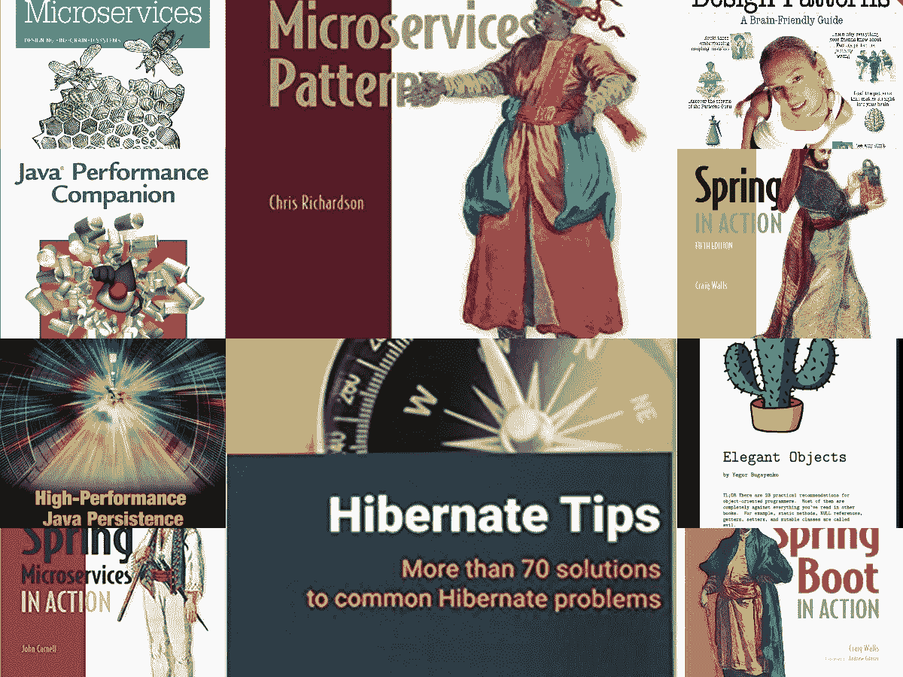
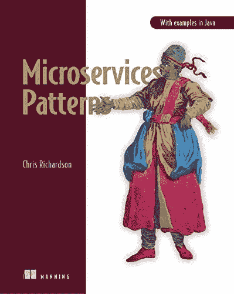
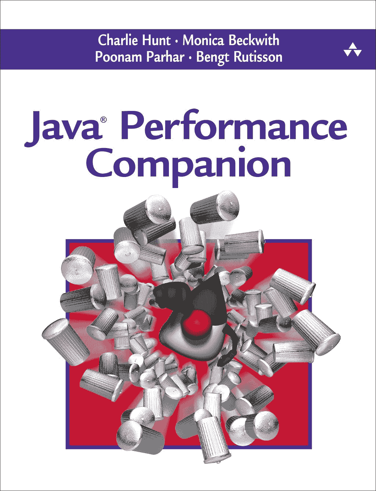
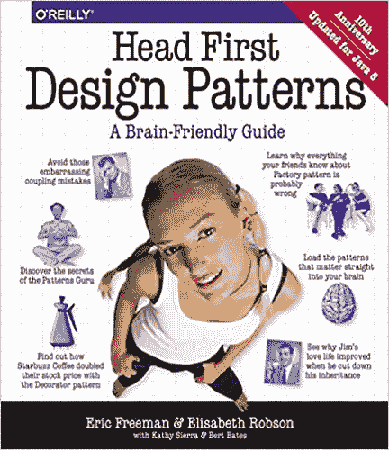
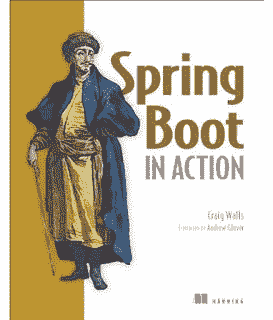
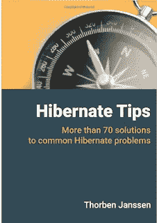
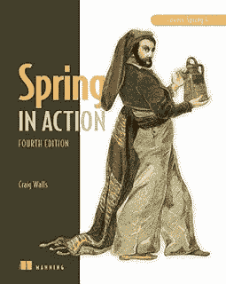

# 2023 年有经验的 Java 程序员应该阅读的 10 本书

> 原文：<https://medium.com/javarevisited/top-10-books-experienced-java-programmers-should-read-73481356d279?source=collection_archive---------0----------------------->

## 我最喜欢的书籍，供有经验的 Java 程序员学习 Spring、Hibernate、微服务、面向对象编程、Java 性能调优等

大家好，如果你认为你已经阅读了所有关于 Java 的基本书籍，并且没有什么新的内容要读，或者你正在为有经验的 Java 程序员寻找高级书籍，那么你来对地方了。

此前，我已经分享了 [**10 门高级 Java 课程**](/javarevisited/11-advanced-core-java-online-courses-to-join-in-2021-46011661257a) 和 [10 门最佳春季课程](/javarevisited/10-best-online-courses-to-learn-spring-framework-in-2020-f7f73599c2fd)，而在这篇文章中，我将分享一些高级书籍，供 Java 程序员学习 2023 年成为一名专业 Java 开发人员所需的必备技能。

Java 在不断变化，Java 16 刚刚发布，现在 Java 17 正在路上，但更重要的是，在过去的 5 到 6 年里，它已经发生了很大的变化，发布了 Java 8 等重要版本，Java 9、10、11、12、13、14、15、16 和 Java 17 中引入了一些有用的特性。

不仅语言在变，Java 虚拟机、垃圾收集器和其他与 Java Web 开发相关的工具也在变；因此，现在是时候看看最近 5 年发布的一些较新的 Java 书籍来学习 Java 的新特性和工具了。

由于我经常收到电子邮件和脸书发来的关于 Java 阅读的好书的信息，我想记下我在过去几年里读过的所有书籍，并推荐给我的读者。

你应该阅读那些支持 Java 8 中引入的 Java 编码新风格的书籍，并学习各种特性，如 [lambdas](/javarevisited/7-best-java-tutorials-and-books-to-learn-lambda-expression-and-stream-api-and-other-features-3083e6038e14?source=---------14------------------) 、 [stream](/javarevisited/7-best-java-collections-and-stream-api-courses-for-beginners-in-2020-3ad18d52c38) 、JDK 增强、G1 垃圾收集器以及过去 5 年中完成的 JVM 性能改进。

在本文中，我将为有经验的 Java 程序员分享过去 5 年中的一些**最佳 Java 书籍。**这个列表包括了 Java 各个方面的书籍，像 Java 8，性能，[多线程](/javarevisited/8-best-multithreading-and-concurrency-courses-for-experienced-java-developers-8acfd3b25094)，集合，JVM 内部，编程面试准备， [Spring 框架](/javarevisited/10-best-spring-framework-books-for-java-developers-360284c37036)， [Spring Boot](/hackernoon/top-5-spring-boot-and-spring-cloud-books-for-java-developers-75df155dcedc?source=---------23------------------) ， [Hibernate](/javarevisited/top-5-books-to-learn-hibernate-for-java-developers-b2cb4b16ccd6?source=---------14------------------) ， [JPA](/javarevisited/top-5-hibernate-online-training-courses-for-beginners-and-advance-java-programmers-469460596b2b) 等等。

虽然它主要包含面向具有 2 到 5 年经验的 Java 程序员的高级书籍，但即使是具有 1 到 2 年经验的 Java 初学者也可能会发现一些值得一读的书籍，如《破解编码面试》或《Java 8 在实践中》。

顺便说一句，如果你想提高你的核心 Java 知识并寻找在线课程，那么你也可以看看 [**完整的 Java 大师班**](https://click.linksynergy.com/fs-bin/click?id=JVFxdTr9V80&subid=0&offerid=323058.1&type=10&tmpid=14538&RD_PARM1=https%3A%2F%2Fwww.udemy.com%2Fjava-the-complete-java-developer-course%2F) 来填补你的核心 Java 知识的空白。这是以结构化方式学习 Java 的最全面和最新的课程之一。

<https://click.linksynergy.com/fs-bin/click?id=JVFxdTr9V80&subid=0&offerid=323058.1&type=10&tmpid=14538&RD_PARM1=https%3A%2F%2Fwww.udemy.com%2Fjava-the-complete-java-developer-course%2F>  

# 2023 年有经验的 Java 程序员的 10 本最佳书籍

这里是我为有经验的 Java 程序员收集的一些最好的书。这份清单包含了关于 Java 8、高级面向对象编程、 [Spring](/javarevisited/top-5-books-and-courses-to-learn-restful-web-services-in-java-using-spring-mvc-and-spring-boot-79ec4b351d12?source=---------17------------------) 、Spring Boot、Hibernate、Java 性能、设计模式和[编程工作面试](/javarevisited/5-coding-interview-books-to-prepare-for-programming-job-interviews-d8f63348afaf)的书籍。你可能已经读过一些你显然可以跳过的书，但是我相信你会喜欢一些你还没有读过的书，并且喜欢一遍又一遍地读。我已经尽力收集了过去 5 年中一些对高级 Java 程序员来说最好的书，但是如果你认为有一本很好的书是我应该阅读并列入这个列表的，那么请随意推荐。

## 1.[微服务模式:Java 中的例子](https://www.amazon.com/Microservices-Patterns-examples-Chris-Richardson/dp/1617294543?tag=javamysqlanta-20)

微服务是近段时间有经验的 Java 开发者最需要学习的东西之一。云计算的发展已经使微服务架构成为有经验的开发人员和软件架构师的一项基本技能，为什么不呢，它与云提供的东西密切相关。它易于在云中部署和扩展。

如果你正在用 Java 开发微服务，那么你必须阅读这本书。由 Chris Richardson 创作的这本书提供了 44 种用 Java 构建和部署微服务应用的设计模式，你可以在你的应用中使用它们。它们经过反复试验，可以解决您在使用微服务时可能面临的许多问题。

通过学习这些微服务模式，您不仅可以创建更好的微服务，还可以了解微服务架构的优点和缺点，以及如何最大化优点和最小化缺点。

如果你还没有看过这本书，那么我强烈推荐你去读，如果你需要学习微服务的课程，我建议你加入 Udemy 上的 28 分钟 [**大师微服务与 Spring Boot**](https://click.linksynergy.com/deeplink?id=CuIbQrBnhiw&mid=39197&murl=https%3A%2F%2Fwww.udemy.com%2Fcourse%2Fmicroservices-with-spring-boot-and-spring-cloud%2F)课程和 Ranga Karnam。从 Java 中的微服务开始，这是一门很好的实践课程。

## [2。Java 性能伴侣](https://www.amazon.com/Java-Performance-Companion-Charlie-Hunt/dp/0133796825?tag=javamysqlanta-20)

这是我最近完成的另一本关于 Java 性能的优秀书籍。您将找到关于 JVM、垃圾收集器和其他 Java 性能工具、实践等的最新信息。它还非常详细地介绍了 G1 垃圾收集器。

它是由 Charlie Hunt 和 Monica Beckwith 写的，Charlie 是我最喜欢的另一本 Java 书《Java Performance》的作者。如果你愿意，也可以将本书与 Udemy 上的 [**Java 应用性能与内存管理**](https://click.linksynergy.com/deeplink?id=JVFxdTr9V80&mid=39197&murl=https%3A%2F%2Fwww.udemy.com%2Fcourse%2Fjava-application-performance-and-memory-management%2F) 课程结合起来，进行一些动手指导。

## [3。头部优先设计模式](http://www.amazon.com/dp/0596007124/?tag=javamysqlanta-20)

这是我很久以来最喜欢的一本书，最近他们发布了一个稍微更新的版本来涵盖 Java 8。您将了解如何使用 Java 8 的新特性实现一些经过测试的设计模式。

如果你需要更多面对面指导的课程，我建议你加入 Udemy 上 Dmitri Nestruk 的[**Java 设计模式**](https://click.linksynergy.com/deeplink?id=JVFxdTr9V80&mid=39197&murl=https%3A%2F%2Fwww.udemy.com%2Fcourse%2Fdesign-patterns-java%2F) 课程。使用 lambda 表达式、流和其他现代特性发现 Java 中经典设计模式的现代实现的最佳课程之一。

## [3。克雷格·沃尔斯的《Spring Boot 在行动》](https://www.amazon.com/Spring-Boot-Action-Craig-Walls/dp/1617292540?tag=javamysqlanta-20)

Spring Boot 使得使用 Spring 框架变得更加容易，这也是它日益流行的原因。如果你在你的项目中使用 Spring Boot 或者打算使用它，这是你应该读的书。

即使不打算用 Spring 的书，也可以看这本书来学习这个优秀的新框架。如果你需要一门课程来结合这本书，我建议你去看看 Spring Boot 的 [**微服务和 Java 博主兼架构师 Ranga Rao Karnam 的 Spring Cloud**](https://click.linksynergy.com/fs-bin/click?id=JVFxdTr9V80&subid=0&offerid=323058.1&type=10&tmpid=14538&RD_PARM1=https%3A%2F%2Fwww.udemy.com%2Fexploring-spring-boot-and-spring-cloud-microservices%2F) 课程。

## [4。高性能 Java 持久性](https://www.amazon.com/High-Performance-Java-Persistence-Vlad-Mihalcea/dp/973022823X?tag=javamysqlanta-20)

这本书是由博客作者 Vlad Mihalcea 写的，他也是 Hibernate 领域的权威。这是一本关于如何使用 JPA 和 Hibernate 编写高性能 Java 应用程序持久层的优秀书籍。

如果您正在从事真实世界的 hibernate 项目，其中性能是一个真正的问题，那么您应该阅读这本书。

如果你需要一些课程来练习这本书，你也可以看看 Vlad 的 [**高性能 Java 持久性马赫**](https://vladmihalcea.teachable.com/p/high-performance-java-persistence-mach-1?utm_source=javarevisited&utm_medium=web&utm_campaign=hpjpmach1&affcode=172599_kuoszt8s) **1** ，它很好地补充了他的书，因为你将直接从 Vlad 那里学习，观看和阅读的结合真的很有效。

## 5.[优雅的物件](https://www.amazon.com/Elegant-Objects-1-Yegor-Bugayenko/dp/1519166915/?tag=javamysqlanta-20)

这是我近年来看的又一本有趣的书。它包含了 30 个关于面向对象编程的实用技巧，可以防止你的代码变坏，正如作者所说。

你可能不同意作者所说的关于 OOP 的一切，但这本书发人深省，让你对面向对象编程和设计有了新的认识。

## [6。破解编码面试:189 道编程题](http://javarevisited.blogspot.com/2016/06/top-5-books-for-programming-coding-interviews-best.html)

如果你准备 Java 编程面试，这是必读的书。它包含了所有编程主题的常见问题，从面试的角度来看，这些问题是必不可少的。

你会发现关于数据结构和算法，Java，SQL，系统设计，网络，甚至软技能的问题。这本书由 Gayle Laakmann McDowell 撰写，他在招聘苹果、谷歌和亚马逊等科技巨头以及写书帮助求职者方面有着丰富的经验。

如果你需要一门课程，请查看 [**探索编码面试:关于教育的编码问题模式**](https://www.educative.io/collection/5668639101419520/5671464854355968?affiliate_id=5073518643380224) 。它将帮助您了解编码问题所基于的模式。

## 7 .[。休眠提示:70 多种常见休眠问题的解决方案](http://www.java67.com/2017/02/2-best-books-to-learn-hibernate-for-Java-Developers.html)

这是另一本由另一位博客作者索本·让桑写的实用书。它是最近几周前发布的。它包含了 70 个有用的 Hibernate 技巧，每个使用 Hibernate 的有经验的 Java Web 开发人员都会喜欢。

你可能已经知道了一些建议，但你肯定会发现一些你从未听说过的新建议。

## [8。Java 性能:权威指南](http://javarevisited.blogspot.sg/2014/07/top-5-java-performance-tuning-books.html)

这是我几年前在 Java 7 发布后读的书，但我仍然喜欢参考它。如果您想了解 JVM 内部机制、Java 和 GC 性能调优，以及一些可能影响性能的 Java 特性，这是一本非常好的书。

如果你还没有读过这本书，那么你现在应该读一读。如果你需要一门课程来配合这本书，我建议你加入 Udemy 上的 [**Java 多线程、并发&性能优化**](https://click.linksynergy.com/deeplink?id=JVFxdTr9V80&mid=39197&murl=https%3A%2F%2Fwww.udemy.com%2Fcourse%2Fjava-multithreading-concurrency-performance-optimization%2F) 课程，这是有经验的 Java Web 开发人员最好的课程之一。

## [9。现代 Java 在行动](http://www.amazon.com/Java-Action-Lambdas-functional-style-programming/dp/1617291994?tag=javamysqlanta-20)

这是我最近读过的关于核心 Java 的最好的书之一。它几乎涵盖了 Java SE 8 版本中引入的所有新特性，如 lambda 表达式、流、方法引用和新的日期和时间 API。

由于每个核心 Java 开发人员迟早都要学习 Java 8，如果你还没有读过这本书，我强烈推荐你去读一读。

如果你愿意，你可以把这本书和这个[课程列表](/javarevisited/top-5-courses-to-learn-new-features-of-java-8-to-java-13-107eb51d2a13)结合起来，学习 Java 8 到 Java 13 之间的所有新特性。

## [10。弹簧动作](http://www.java67.com/2016/12/5-spring-framework-books-for-java-programmers.html)

这是旧的 Spring in Action book 的更新版本，涵盖了 Spring 4。如果您想学习如何在 Spring 项目上使用注释，并想了解所有新的特性和改进，这是值得一读的书。

而且，如果你喜欢课程，我强烈建议你把这本书和 Udemy 上约翰·汤姆森的 [**Spring Framework 5:初学者到大师**](https://click.linksynergy.com/fs-bin/click?id=JVFxdTr9V80&subid=0&offerid=323058.1&type=10&tmpid=14538&RD_PARM1=https%3A%2F%2Fwww.udemy.com%2Fspring-framework-5-beginner-to-guru%2F) 课程结合起来。

以上是过去 5 年**最好的 Java 书籍**，你可以通过阅读来学习 Java 编程语言、JVM、Spring 和 Hibernate。这个列表并不完整，如果你最近读了一本书，觉得很棒，可以在评论区提出来，我会把它列入列表。

这些书对初学者和有经验的 Java Web 开发人员都很有用，但是高级程序员也会从这个列表中受益。

您可能想探索的其他 **Java 和编程文章**

*   [2023 年 Java 开发者路线图](/javarevisited/the-java-programmer-roadmap-f9db163ef2c2)
*   [每个程序员都应该读的 10 本书](http://www.java67.com/2015/07/5-books-learn-java-8-functional-programming.html)
*   [给热心程序员的 10 本算法书](http://www.java67.com/2015/09/top-10-algorithm-books-every-programmer-read-learn.html)
*   [提高编程技能的 5 本必备书籍](http://www.java67.com/2016/02/5-books-to-improve-coding-skills-of.html)
*   [初学者最佳核心 Java 书籍](/javarevisited/5-best-core-java-books-for-beginners-20e3f723e3a)
*   [学习 SQL 和数据库设计的前 5 本书](/javarevisited/5-best-books-to-learn-sql-and-database-design-for-programmers-and-developers-1e7839df2f3e?source=---------7------------------)
*   [学习 UNIX 和 Linux 操作系统的 10 本书](/javarevisited/10-best-linux-unix-and-system-programming-books-for-beginners-2fe750951c9f?source=---8------2-2-----------------3-----)
*   [面向 Java 程序员的五大数据结构和算法书籍](http://javarevisited.blogspot.sg/2015/07/5-data-structure-and-algorithm-books-best-must-read.html)

感谢您阅读本文。如果你喜欢这个给有经验的程序员看的高级 Java 书籍列表，那么请分享给你的朋友和同事。如果您有任何问题、反馈或建议，请在此发表评论。

如果您有任何关于 Java 和相关技术的书籍，您觉得很棒，但不在这个列表中，请提出意见。

**p . s .**——如果你刚刚开始学习 Java，并且正在寻找一些最好的课程来开始你的 Java 之旅，那么你也可以看看这个列表中的 [**最佳核心 Java 课程**](/javarevisited/top-5-java-online-courses-for-beginners-best-of-lot-1e1e240a758) ，这些课程面向初学者和有经验的程序员。

</javarevisited/10-advanced-spring-boot-courses-for-experienced-java-developers-5e57606816bd> 