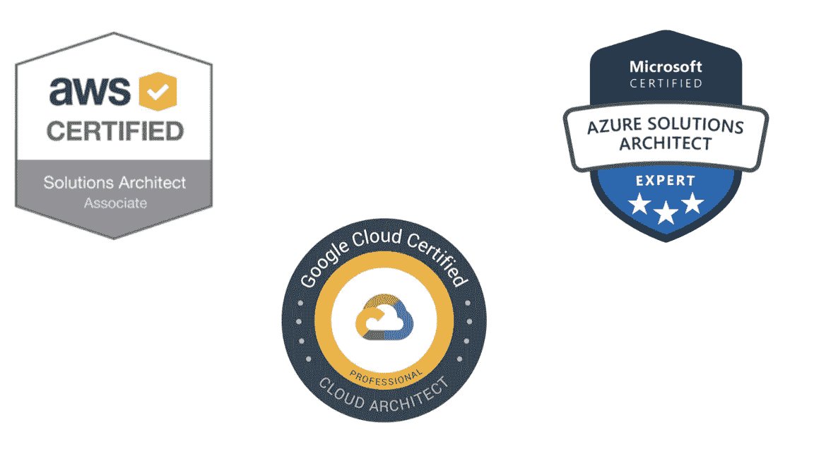
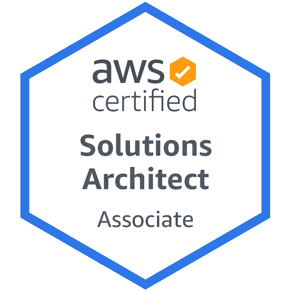
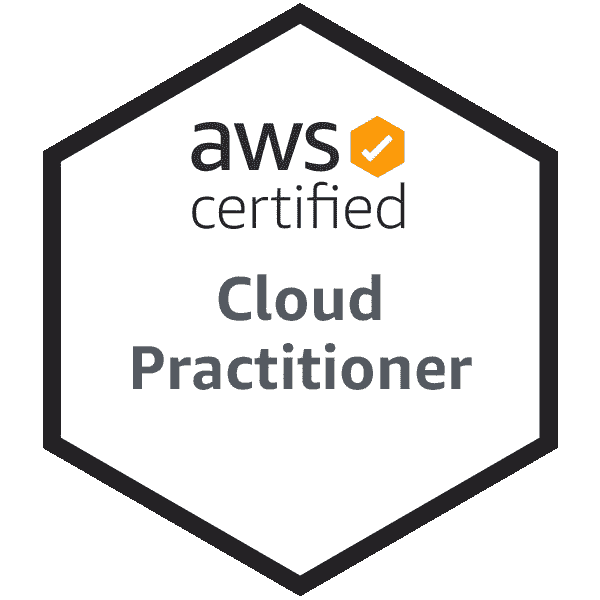
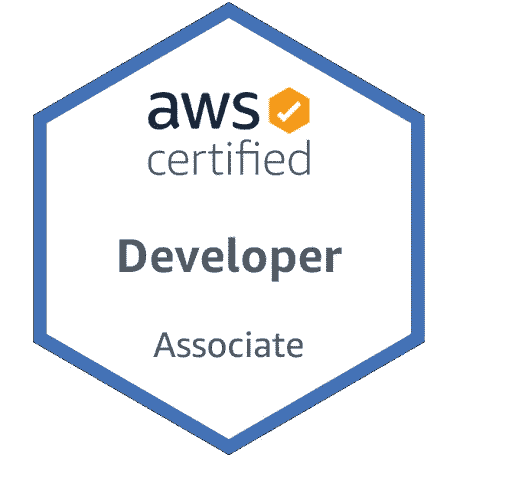
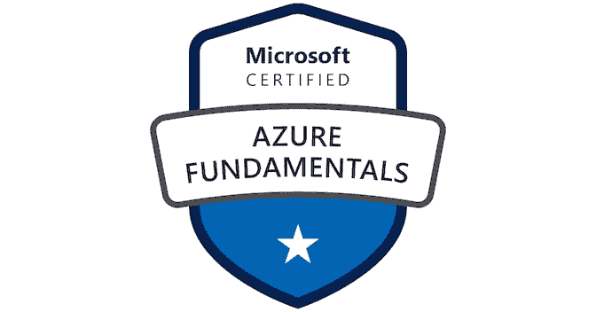
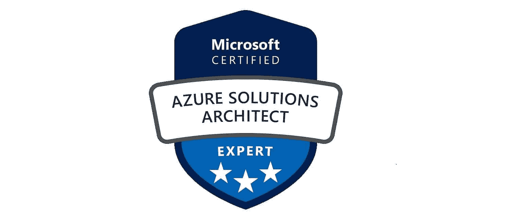
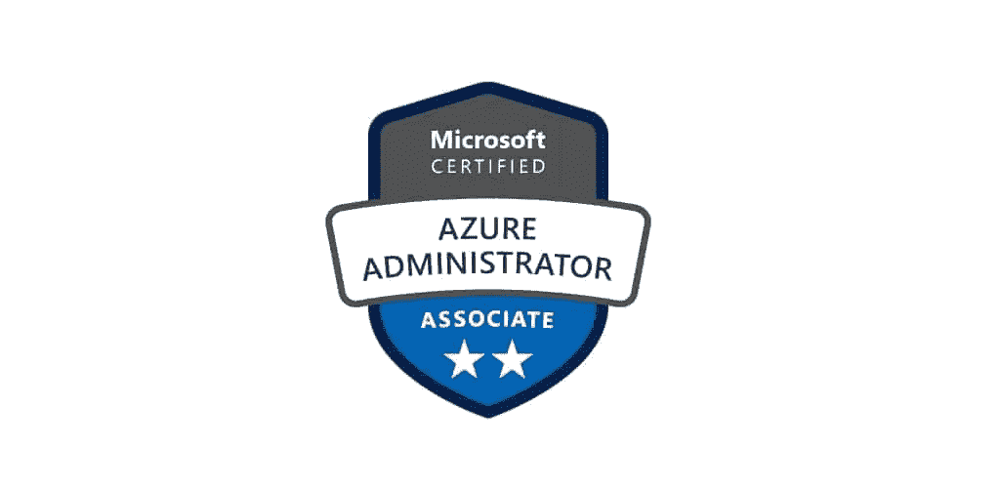
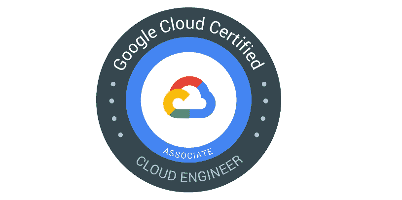
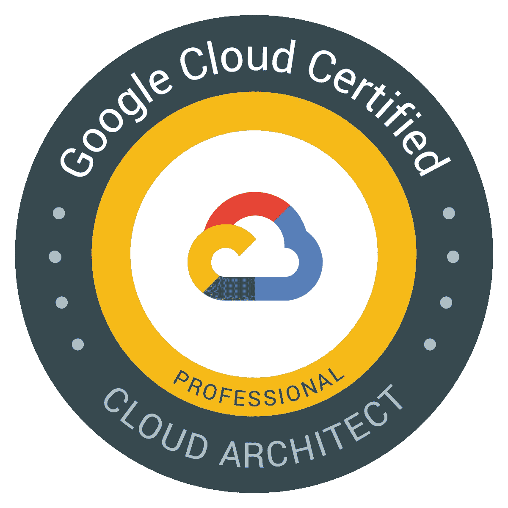
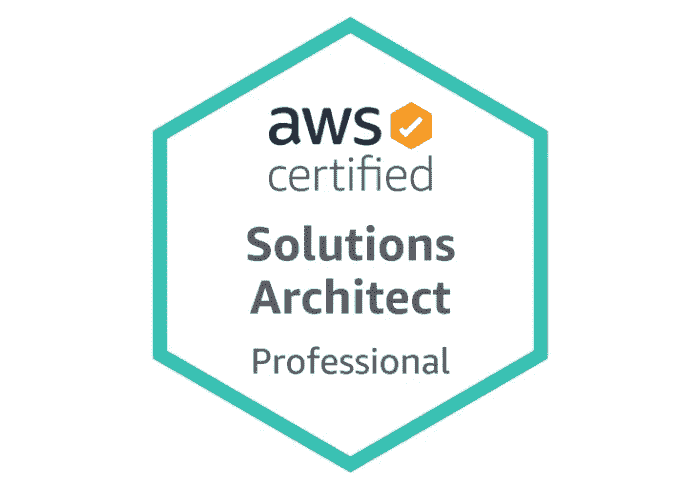

# 2023 年十大云认证目标— [AWS、Azure 和 Google 云平台]

> 原文：<https://medium.com/javarevisited/top-10-cloud-certification-to-aim-in-2022-aws-azure-and-google-cloud-platform-bd054fff0538?source=collection_archive---------0----------------------->

## 程序员、开发人员和 IT 专业人员 2023 年可以争取的最佳云认证列表。这包括 AWS、Azure 和谷歌云认证。

大家好，如果你的目标是在 2023 年获得云认证，但不确定应该获得哪种云认证，那么你来对地方了。早些时候，我已经分享了 Java 开发人员 的 [**最佳 IT 认证列表，今天，我将谈论 2023 年要瞄准的最佳云认证。**](/javarevisited/10-best-it-certifications-for-java-developers-5b4a78e3605d)

您可以浏览云认证列表，并根据您的技能和经验选择最佳认证。我分享了来自[亚马逊 AWS](/javarevisited/5-best-aws-courses-for-beginners-and-experienced-developers-to-learn-in-2021-563212409fbd?source=rss-bb36d8439904------2&utm_source=dlvr.it&utm_medium=linkedin) 、[微软 Azure](/javarevisited/10-best-microsoft-azure-courses-for-beginners-and-experienced-developers-d41a454834c0) 和[谷歌云平台](/javarevisited/5-best-courses-to-learn-google-cloud-platform-gcp-in-2021-169093a3771a)的初学者、开发者、系统管理员和解决方案架构师的最佳云认证。

云计算服务在当今技术中呈指数级增长，并成为知名组织的优先选择，如网飞，他们使用亚马逊 AWS 来运行从托管到数据库和分析的业务。

正因如此，许多云计算以不同的基础设施和服务来到了现实世界，如 [**谷歌云**](/javarevisited/5-best-courses-to-learn-google-cloud-platform-gcp-in-2021-169093a3771a) 和 [**微软 Azure**](/javarevisited/5-best-azure-fundamentals-courses-to-pass-az-900-certification-exam-in-2020-9e602aea035d) 等等。

所有这些云服务的基础架构都很复杂，需要想使用它们的人获得某种证书来处理特定的服务，现在的公司要求人们拥有这些证书来验证他们的技能。

这篇文章将与你讨论一些最好的云认证公司，如[微软 Azure、](https://azure.microsoft.com/en-us/)亚马逊 [**AWS**](https://aws.amazon.com/) 和 [**谷歌云**](https://cloud.google.com/) 拥有这些认证将使你的简历在招聘过程中从其他竞争对手中脱颖而出，你可以比没有这些认证的人获得更高的薪水。

# 2023 年面向初学者和有经验者的 10 项最佳云认证

不要再浪费你的时间了，这里有一个 2023 年最佳云认证的列表。您可以通过这一认证来促进您的职业发展，并作为云计算专家、开发人员和解决方案架构师开始您的云计算职业生涯。

## 1.AWS 认证解决方案架构师助理

这个 AWS 证书是为那些能够完成解决方案架构(如部署 web 应用程序并保护它们)的人设计的，它也面向那些使用 AWS 服务一年的人。

换句话说，这是对希望成为软件架构师或解决方案架构师的有经验的开发人员的最佳云认证。如果你一直在 AWS 云平台上工作，无论是个人还是为我们公司工作，那么你应该通过这个考试来获得技能认证。

考试非常庞大，需要了解很多关于 AWS 服务的东西。如果您的目标是获得这一声望很高的认证，那么 udemy 上的这个 [**AWS 认证解决方案架构师课程**](https://click.linksynergy.com/deeplink?id=JVFxdTr9V80&mid=39197&murl=https%3A%2F%2Fwww.udemy.com%2Fcourse%2Faws-certified-solutions-architect-associate%2F) 可以帮助您获得这些技能。

## 2.AWS 认证云从业者

这是*针对初学者*或任何想开始接触云计算和 AWS 云平台的人的最佳云认证。

如果您想获得助理级或专业认证，请确保获得该认证，让您全面了解 AWS 云服务，如安全和帐户管理等。

这是一个相对容易的考试，你可以通过几周的准备轻松通过。

如果你需要推荐，我强烈推荐你在 Udemy 上查看夏羽·马瑞克的 [**AWS 认证云从业者【新】**](https://click.linksynergy.com/deeplink?id=JVFxdTr9V80&mid=39197&murl=https%3A%2F%2Fwww.udemy.com%2Fcourse%2Faws-certified-cloud-practitioner-new%2F) 课程。夏羽是 AWS 大师，这将帮助你学习和准备考试。

## 3.AWS 认证开发人员-助理

对于想要创建云原生应用的程序员和软件开发人员来说，这是最好的云认证。如果您有一年以上的 AWS 服务管理经验，那么这个助理认证非常适合您，它将教会您如何使用 AWS 核心服务及其架构，在 AWS 上开发和部署应用程序。

与前两项认证(如云从业者和解决方案架构师)相比，这也是最艰难的 AWS 认证之一。仅仅熟悉不同的 AWS 服务是不够的，您需要深入了解它们，以便能够在给定的场景中使用正确的配置。

如果你是一名开发人员和软件工程师，那么我向你强烈推荐这个云认证，因为它将显著提升你的形象，使你有资格获得更多的机会。

正如我所说，考试很难，你需要多种资源来做好准备，但首先，我强烈建议你参加 CloudGuru 的这门课程 [**AWS 认证开发人员**](https://click.linksynergy.com/deeplink?id=JVFxdTr9V80&mid=39197&murl=https%3A%2F%2Fwww.udemy.com%2Fcourse%2Faws-certified-developer-associate%2F) ，它将教你通过考试所需的技能。

## 4.AWS 认证系统运行管理员—助理

该助理认证面向在 AWS 上至少有一年部署、管理和运营经验的人员，并教您根据自己的需求选择合适的服务，以及控制来自 AWS 的数据流等。

换句话说，对于在基础设施方面工作的系统管理员和 IT 专业人员来说，这是最好的云认证。

如果你从事 IT 支持或系统管理员的工作，你可以通过这个认证来进一步提升你的职业生涯。

如果您需要一门课程来准备这项认证，我推荐您参加名为 [**AWS 认证系统运行管理员的课程，Associate**](https://click.linksynergy.com/deeplink?id=JVFxdTr9V80&mid=39197&murl=https%3A%2F%2Fwww.udemy.com%2Fcourse%2Faws-certified-sysops-administrator-associate%2F) 是学习这些技能的好资源。

## 5.微软认证:Azure 基础知识

如果你注意到，所有四大云认证都来自亚马逊 AWS，这是因为 AWS 是最受初创公司和大公司欢迎的公共云平台，但微软 Azure 正在迅速赶上，这反过来又促进了对认证 Azure 云专业人员的需求。

Azure fundamentals 认证更适合个人了解云服务的一些基础，该证书将教你云概念以及如何使用微软 Azure 服务、安全性、隐私和定价。

总之，想学 Azure 的新手最好的云认证。这与 AWS 云从业者非常相似，您只需准备几周就可以通过该认证。

如果你需要建议，那么 udemy [**AZ-900 Azure 考试准备**](https://click.linksynergy.com/deeplink?id=JVFxdTr9V80&mid=39197&murl=https%3A%2F%2Fwww.udemy.com%2Fcourse%2Faz-900-azure-exam-prep-understanding-cloud-concepts%2F) 上的这个课程将在一个课程中解释所有这些，并为考试做准备。

## 6.微软认证:Azure 解决方案架构师专家

对于有经验的程序员、开发人员和希望成为 Azure 专家的 DevOps 工程师来说，这是最好的云认证。

通过该认证考试后，您将具备在 Microsoft Azure 中设计和实施解决方案的技能，其中包括安全性、网络计算和存储。

如果你的公司正在迁移到微软 Azure 云，那么瞄准这个 Azure 认证，提升你的个人资料，也帮助你得到晋升。

说到准备，这是一个庞大的认证，你需要涵盖许多主题，但谢天谢地，有许多课程来学习这些技能，但 udemy 上的这门课程，但 AZ-300/AZ-303 Azure Architecture Technologies 是其中最好的，它将在这个旅程中对你有很大帮助。

## 7.微软认证:Azure 管理员助理

这是另一个位列十大云认证的 Azure 证书。对于系统管理员和从事 IT 支持工作的人来说，这是最好的 Azure 认证。

该证书将帮助您获得实施、管理和监控云服务的经验，例如存储、安全和虚拟环境，以及更多职责。

为了做好准备，你需要了解所有基本的 Azure 服务，以及如何使用、配置它们，并在出现任何问题时进行故障排除。

如果你需要在线课程，我推荐你去看看这个 Udemy 课程 [**AZ-104 微软 Azure 管理员**](https://click.linksynergy.com/deeplink?id=JVFxdTr9V80&mid=39197&murl=https%3A%2F%2Fwww.udemy.com%2Fcourse%2Fexam-az-104-microsoft-azure-administrator%2F) 是学习所有这些技能的好资源。

## 8.谷歌助理云工程师

如果没有公共云市场的另一个大玩家 Google cloud 认证，一份最佳云认证列表是不完整的。在处理大数据和机器学习方面，谷歌云拥有一些最好的功能，这就是为什么许多在这些领域工作的初创公司选择谷歌云的原因。

这是对程序员、开发者、软件工程师最好的 Google cloud 认证。

该证书的持有者将负责在云中部署 web 应用程序，以及监控运营和管理整个企业解决方案，并配置访问和安全性。

关于备考，这个 [**终极谷歌认证助理云工程师**](https://click.linksynergy.com/deeplink?id=JVFxdTr9V80&mid=39197&murl=https%3A%2F%2Fwww.udemy.com%2Fcourse%2Fgoogle-cloud-associate-cloud-engineer-certification%2F) 课程可以帮助你学习并通过考试。

## 9.谷歌专业云架构师

这是另一个受欢迎和受欢迎的谷歌云认证。这类似于 AWS 解决方案架构师和 Azure 技术专家，但在 Google cloud 上。

这是经验丰富的 IT 专业人员的最佳谷歌云认证，他们希望成为谷歌云技术(如大表、大查询和其他 GCP 平台服务)的解决方案架构师。

专业云架构师证书的持有者在组织中扮演着重要的角色，因为他可以设计、开发、部署和管理您的 web 应用程序，并保护它们以及承担更多责任。

关于这一享有盛誉的云认证的准备工作，udemy[**Ultimate Google Certified Professional Cloud Architect**](https://click.linksynergy.com/deeplink?id=JVFxdTr9V80&mid=39197&murl=https%3A%2F%2Fwww.udemy.com%2Fcourse%2Fgoogle-cloud-architect-certifications%2F)上的这门课程是这一证书的良好资源。

## 10.AWS 专业架构师

这是你在 2023 年可以瞄准的终极云认证。它也被认为是最严格的 AWS 云认证，需要丰富的 AWS 云平台经验和知识。

对这一认证的需求非常大，因为 AWS 专家总是短缺，我向专家云专业人员强烈推荐这一点。

这项高级认证将教会您如何在 Amazon AWS 服务器上设计和部署可扩展的 web 应用程序，以及为您的应用程序选择合适的服务和功能，并教会您更多技能。

关于准备工作，您可能需要查阅大量资源和 AWS 论文、文档和课程，但从 udemy [**Ultimate AWS 认证解决方案架构师**](https://click.linksynergy.com/deeplink?id=JVFxdTr9V80&mid=39197&murl=https%3A%2F%2Fwww.udemy.com%2Fcourse%2Faws-solutions-architect-professional%2F) 的这门课程开始，将有助于您完成这一旅程。

这就是你在 2023 年可以获得的**最佳云认证。**这些认证几乎是云计算领域最有用的认证，由亚马逊、谷歌和微软等云提供商自己颁发，获得其中一项认证将为您在这个不断发展的行业中开启成功的职业生涯。

面向 **IT 专业人员**和程序员的其他**认证资源**

*   [如何通过 Spring Core Professional 5.0 认证](https://javarevisited.blogspot.com/2018/08/how-to-crack-spring-core-professional-certification-exam-java-latest.html)
*   [如何成为 Azure 认证管理员助理？](https://javarevisited.blogspot.com/2020/04/how-to-crack-microsoft-az-103-azure-administrator-associate-exam-certification.html)
*   [如何破解甲骨文 2023 年 Java 认证？](https://medium.freecodecamp.org/how-to-pass-oracles-java-certifications-a-practical-guide-for-developers-e9b607ba6173)
*   [破解 AWS 解决方案架构师认证的 5 大课程](https://javarevisited.blogspot.com/2019/05/top-5-courses-to-crack-aws-solutions-architect-associate-certification-exam-SAA-C01.html#axzz5rHwAwycj)
*   [Coursera 十大云计算认证](https://javarevisited.blogspot.com/2020/08/top-10-coursera-certifications-to-learn-cloud-computing-aws.html)
*   [破解 Azure 云架构师(AZ-300)考试的前 5 门课程](https://javarevisited.blogspot.com/2019/07/top-5-courses-to-crack-azure-architecture-technologies-certification-az-300-exam.html#axzz6E6VuRMsx)
*   [破解 AWS DevOps 工程师考试的前 5 门课程](https://javarevisited.blogspot.com/2020/04/top-5-course-to-crack-aws-certified-devops-engineer-professional-exam-certification.html)
*   [破解 AWS 解决方案架构师专业考试的前 5 门课程](https://javarevisited.blogspot.com/2020/04/top-5-course-to-crack-aws-solution-architect-professional-sap-c01-certification-exam.html)
*   [程序员前 5 名 AZ-900 模拟测试](https://javarevisited.blogspot.com/2020/02/top-5-AZ-900-exam-Azure-Fundamentals-certification-practice-tests-and-mock-exams-to.html)
*   [学习 Docker 和 Kubernetes 的十大课程](https://dev.to/javinpaul/top-10-courses-to-learn-docker-and-kubernetes-for-programmers-4lg0)
*   [通过谷歌助理云工程师认证的前 5 门课程](https://javarevisited.blogspot.com/2019/07/top-5-google-cloud-platform-gcp-courses-certifications-online.html)
*   [5 次免费的 AWS 解决方案架构师实践测试](https://javarevisited.blogspot.com/2019/08/top-5-free-aws-solution-architect-Associate-certification-dumps-practice-questions.html)
*   [如何破解 Azure Fundamentals (AZ-900)认证](https://javarevisited.blogspot.com/2020/04/how-to-crack-microsoft-azure-fundamentals-certification-az-900-exam.html)
*   [学习 Docker 和 Kubernetes 的十大课程](https://dev.to/javinpaul/top-10-courses-to-learn-docker-and-kubernetes-for-programmers-4lg0)
*   [成为 GCP 准云工程师的前 5 名课程](https://javarevisited.blogspot.com/2020/05/top-5-course-to-crack-google-cloud-associate-cloud-engineer-certification-exam.html) r
*   [如何通过 AZ-300 Azure 解决方案架构师考试？](https://javarevisited.blogspot.com/2020/04/how-to-crack-microsoft-azure-solution-architect-exam-az-300.html)
*   [通过谷歌助理云工程师认证的前 5 门课程](https://javarevisited.blogspot.com/2019/07/top-5-google-cloud-platform-gcp-courses-certifications-online.html)
*   [通过 AWS 云从业者认证的前 5 门课程](https://javarevisited.blogspot.com/2020/02/top-5-courses-to-crack-aws-certified-cloud-practitioner-exam-certification-clf-c01.html)

感谢您阅读本文。如果你喜欢这些*最佳云认证*，那么请与你的朋友和同事分享。如果这些课程帮助你通过了考试，那么请把它传播出去，让其他人也能受益。

**P. S.** —如果你是云计算的完全初学者，并且正在寻找一些免费课程来学习云计算，那么你也可以在 Udemy 上查看这个 [**云计算简介**](https://click.linksynergy.com/deeplink?id=JVFxdTr9V80&mid=39197&murl=https%3A%2F%2Fwww.udemy.com%2Fcourse%2Fintroduction-to-cloud-computing%2F) **(免费课程)**。超过 210，000 人加入了这个课程，它是完全免费的，你只需要一个 Udemy 帐户就可以加入这个课程。

<https://javarevisited.blogspot.com/2021/11/top-5-websites-to-learn-aws-online-for.html> 