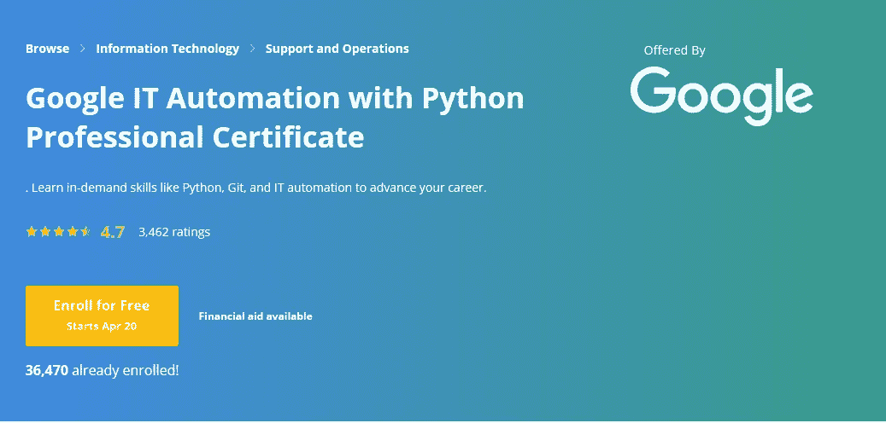
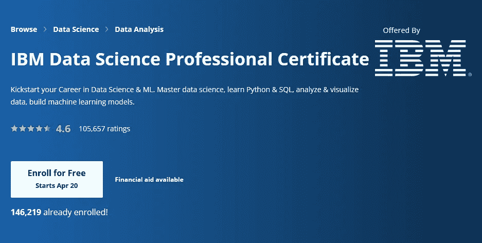
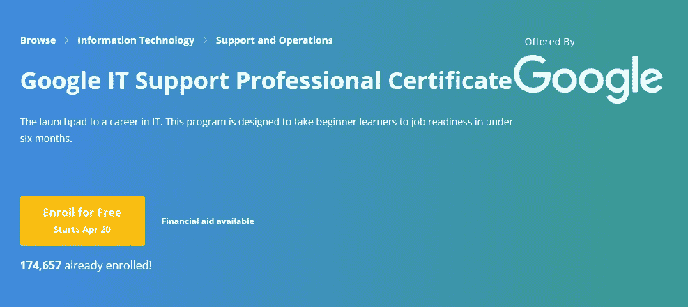
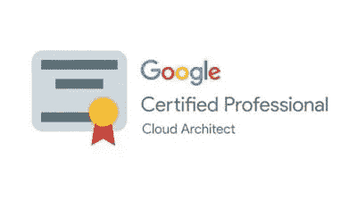
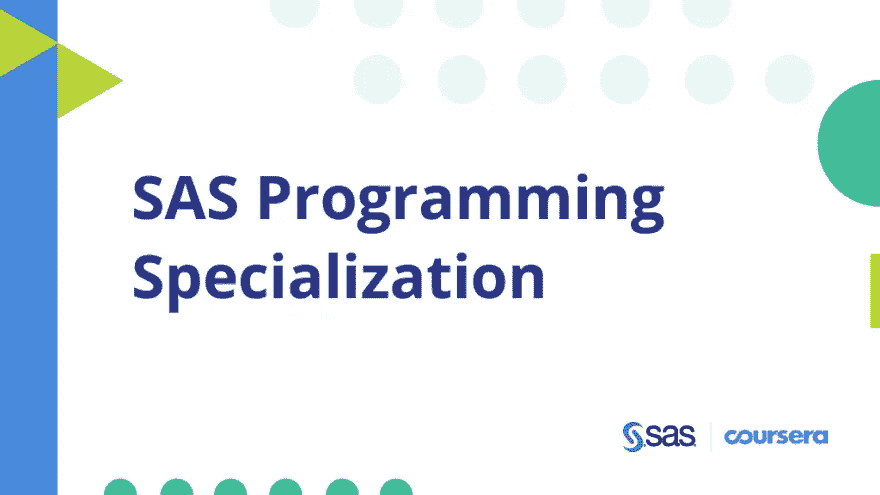
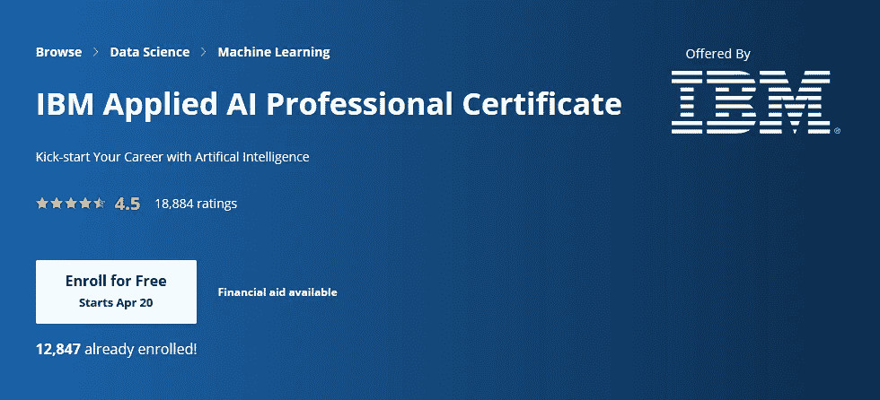
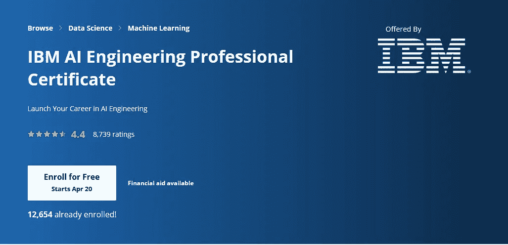
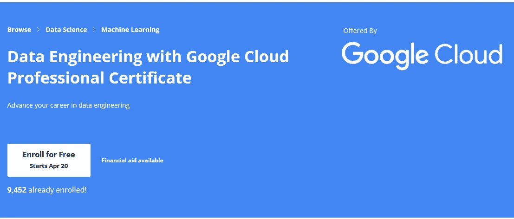
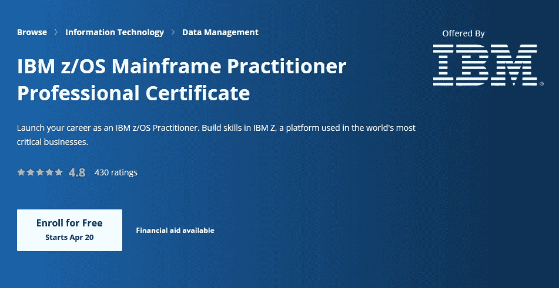
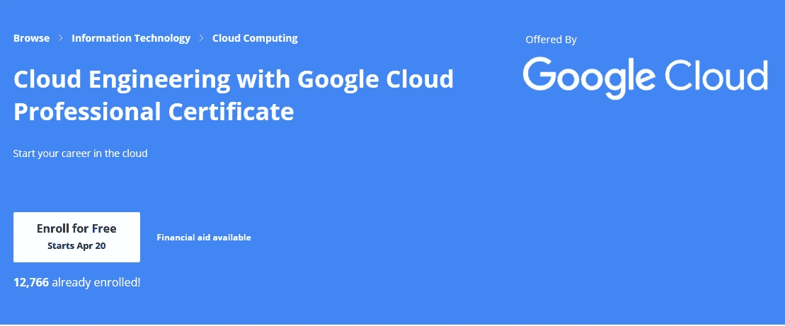

# 十大 Coursera 证书，开启您在云计算、数据科学、人工智能、大型机和 IT 支持领域的职业生涯

> 原文：<https://medium.com/javarevisited/top-10-coursera-certificates-to-start-your-career-in-cloud-data-science-ai-mainframe-and-it-558690c83587?source=collection_archive---------0----------------------->

在 [Unsplash](https://unsplash.com?utm_source=medium&utm_medium=referral) 上由 [Austin Distel](https://unsplash.com/@austindistel?utm_source=medium&utm_medium=referral) 拍摄的照片

你好，伙计们，如果你想在信息技术、数据科学和 IT 支持领域开始或推进你的职业生涯，但缺乏必要的技能和知识，那么你不必失望。 [**Coursera 的专业证书**](https://coursera.pxf.io/c/3294490/1164545/14726?u=https%3A%2F%2Fwww.coursera.org%2Fprofessional-certificates) 可以给你在信息技术、数据科学和 IT 支持方面开始职业生涯的所有知识、技能和证书。

如果你不知道，Coursera 最近推出了职业证书，可以帮助你在不到一年的时间里为一个热门的职业领域做好工作准备。你可以获得职业证书，将你的知识应用到实践项目中，向雇主展示你的技能，并获得职业支持资源。

Coursera 的许多[专业证书](https://coursera.pxf.io/c/3294490/1164545/14726?u=https%3A%2F%2Fwww.coursera.org%2Fprofessional-certificates)也提供了获得行业认可的认证的途径。因为这是一个非常新的概念，我想写下来分享我所知道的一切。

在高层次上，Coursera Professional certification 非常类似于[**Coursera Specializations**](https://coursera.pxf.io/c/3294490/1164545/14726?u=https%3A%2F%2Fwww.coursera.org%2Fcollections%2Ftop-s12ns-2019)，它也捆绑了相关的课程来教你一项受欢迎的技能，并通过在你完成所有作业和项目工作后授予证书来让你做好就业准备。

事实上，他们通过引入 [**职业证书**](https://coursera.pxf.io/c/3294490/1164545/14726?u=https%3A%2F%2Fwww.coursera.org%2Fprofessional-certificates) ，实际上已经使专业化更上一层楼。有了这些证书，Coursera 打算提供负担得起的、与职业相关的培训项目，由来自 IBM、Google、SAS 等顶级公司的专家讲师授课。，以及像密歇根大学这样的大学，向所有想学习热门工作技能以开始科技职业生涯的人开放。

它也非常实惠，因为您可以从今天开始追求您的职业梦想，程序起价为每月 39 美元，免费试用 7 天。你甚至可以免费加入。

# 2023 年开始你在云计算、数据科学和 IT 支持领域职业生涯的 10 个最佳 Coursera 专业证书

在不浪费你更多时间的情况下，这里有一些 Coursera 最受欢迎的专业证书，可以促进你的职业发展，或者学习你需要的新技能，以进入新的职业领域，如信息技术或数据科学。

## **1。** [**谷歌 IT 自动化与 Python 专业证书**](https://coursera.pxf.io/c/3294490/1164545/14726?u=https%3A%2F%2Fwww.coursera.org%2Fprofessional-certificates%2Fgoogle-it-automation)

这种新的初级证书由谷歌开发，共有 6 门课程，旨在为 it 专业人员提供急需的技能，包括 Python、Git 和 IT 自动化，可以帮助你推进职业发展。

在这里报名— [**谷歌 IT 自动化与 Python 专业证书**](https://coursera.pxf.io/c/3294490/1164545/14726?u=https%3A%2F%2Fwww.coursera.org%2Fprofessional-certificates%2Fgoogle-it-automation)

## 2. [IBM 数据科学专业证书](https://coursera.pxf.io/c/3294490/1164545/14726?u=https%3A%2F%2Fwww.coursera.org%2Fprofessional-certificates%2Fibm-data-science)

如果你想在数据科学& ML 领域开始你的职业生涯，那么这是一个非常适合你的专业证书。数据科学被列为最热门的职业之一，对数据科学家的需求正在激增。

IBM 的这份专业证书是为任何对发展技能和经验感兴趣的人准备的，他们将在[数据科学](/javarevisited/top-10-resources-to-learn-data-science-and-machine-learning-best-of-lot-f153e1f44e89)或[机器学习](https://hackernoon.com/10-machine-learning-data-science-and-deep-learning-courses-for-programmers-7edc56078cde)领域从事职业。

它将教你数据科学专业人员需要的所有必要技术，如 [Python](https://javarevisited.blogspot.com/2018/12/10-free-python-courses-for-programmers.html) 和 [SQL](https://dev.to/javinpaul/5-online-courses-to-learn-sql-and-database-for-beginners-best-of-lot-5533) ，分析和可视化数据，建立机器学习模型。

超过 76，173 名学生已经注册了这个项目，如果你需要的话，还可以获得经济资助。

在这里报名— [**IBM 数据科学专业证书**](https://coursera.pxf.io/c/3294490/1164545/14726?u=https%3A%2F%2Fwww.coursera.org%2Fprofessional-certificates%2Fibm-data-science)

## 3.[谷歌 IT 支持专业证书](https://coursera.pxf.io/c/3294490/1164545/14726?u=https%3A%2F%2Fwww.coursera.org%2Fprofessional-certificates%2Fgoogle-it-support)

如果你想在 IT 领域成就一番事业，那么这是你能获得的最好的职业证书之一。它是由世界上最著名的 It 公司之一的谷歌提供的。

本课程将为你的 IT 职业生涯提供一个起点。该计划旨在让初学者在大约六个月内做好工作准备。

**该计划面向任何希望在 IT 支持领域开始新职业生涯的人。不需要经验。**

**相关工作角色** IT 支持专员、技术支持工程师、桌面支持工程师、IT 支持工程师、技术支持专员、IT 桌面支持

**招聘财团**美洲银行、百思买、Cognizant、通用电气数码、H & R Block、Hulu、Infosys、英特尔、Sprint、家得宝、沃尔玛、谷歌等等。

在这里报名— [**谷歌 IT 支持专业证书**](https://coursera.pxf.io/c/3294490/1164545/14726?u=https%3A%2F%2Fwww.coursera.org%2Fprofessional-certificates%2Fgoogle-it-support)

## 4.[云建筑拥有 GCP 专业证书](https://coursera.pxf.io/c/3294490/1164545/14726?u=https%3A%2F%2Fwww.coursera.org%2Fprofessional-certificates%2Fgcp-cloud-architect)

毫无疑问，云计算是一项非常抢手的技能，而且可能是你开始科技职业生涯的必备技能。如果你想在云架构方面推进你的职业生涯，那么这是你可以获得的最好的职业证书，以促进你的职业生涯。它是由谷歌云提供的，这意味着你将从源头上学习。

如果你不知道 [**谷歌云专业云架构师认证**](https://coursera.pxf.io/c/3294490/1164545/14726?u=https%3A%2F%2Fwww.coursera.org%2Fprofessional-certificates%2Fgcp-cloud-architect) 被《全球知识》评为 2023 年薪酬最高的 IT 认证之一，随着越来越多的公司转向云，对[谷歌认证专业人员](https://javarevisited.blogspot.com/2019/07/top-5-google-cloud-platform-gcp-courses-certifications-online.html)的需求巨大

这也是一个实践性很强的项目，您将学习如何部署解决方案要素，包括网络、系统和应用服务等基础设施组件，并且您将通过大量实践 Qwiklabs 项目获得实际经验，您可以与潜在雇主分享这些经验。

在这里报名— [**云架构带 GCP 专业证书**](https://coursera.pxf.io/c/3294490/1164545/14726?u=https%3A%2F%2Fwww.coursera.org%2Fprofessional-certificates%2Fgcp-cloud-architect)

## 5. [SAS 程序员职业证书](https://coursera.pxf.io/c/3294490/1164545/14726?u=https%3A%2F%2Fwww.coursera.org%2Fprofessional-certificates%2Fsas-programming)

如果你想用 SAS 证书开始你的职业生涯，那么你来对地方了。这个由 SAS 和 Coursera 提供的专业证书不仅会帮助你掌握 SAS 基础程序员认证所需的技能，还会给你获得工作面试所需的认可。

**概述**
展示操作数据、组合 SAS 数据集、创建报告以及识别和纠正数据、语法和编程逻辑错误的技能。这些技能为你准备 SAS 基础程序员认证考试。

**这个程序是为那些想学习如何编写 SAS 程序来访问、探索、准备和分析数据的人设计的。SAS 编程在各种职业中都是一项有用的技能，包括业务分析师、研究员、统计学家或数据科学家。**

**相关工作角色**
SAS 程序员

**先决条件**
不需要之前的编程或 SAS 经验。

在这里报名— [**SAS 程序员职业证书**](https://coursera.pxf.io/c/3294490/1164545/14726?u=https%3A%2F%2Fwww.coursera.org%2Fprofessional-certificates%2Fsas-programming)

## 6. [IBM 应用人工智能专业证书](https://coursera.pxf.io/c/3294490/1164545/14726?u=https%3A%2F%2Fwww.coursera.org%2Fprofessional-certificates%2Fapplied-artifical-intelligence-ibm-watson-ai)

如果你想以人工智能开始你的职业生涯，那么这是一个很好的认证。如果你不知道，[人工智能](https://javarevisited.blogspot.com/2019/10/top-5-courses-to-learn-artificial-intelligence-AI.html)或者(AI)正在改造我们的世界。

无论你是学生、开发人员还是技术顾问，了解人工智能并知道如何创建人工智能应用程序都可以让你在职业生涯中占据优势。

这个专业证书由最负盛名的全球 IT 公司之一 IBM 提供，旨在武装你作为人工智能应用程序开发人员的技能。超过 2，611 名学生已经注册参加该计划。

在这里报名— [**IBM 应用 AI 专业证书**](https://coursera.pxf.io/c/3294490/1164545/14726?u=https%3A%2F%2Fwww.coursera.org%2Fprofessional-certificates%2Fapplied-artifical-intelligence-ibm-watson-ai)

## 7. [IBM AI 工程专业证书](https://coursera.pxf.io/c/3294490/1164545/14726?u=https%3A%2F%2Fwww.coursera.org%2Fprofessional-certificates%2Fai-engineer)

如果你想成为一名人工智能工程师，并在[数据科学](/javarevisited/my-favorite-data-science-and-machine-learning-courses-from-coursera-udemy-and-pluralsight-eafc73acc73f)、[机器学习](/@javinpaul/9-data-science-and-machine-learning-courses-by-harvard-ibm-udemy-and-others-12a0c7c23ec1)和[人工智能](/javarevisited/7-best-courses-to-learn-artificial-intelligence-in-2020-26d59d62f6fe)领域成就一番事业，这是一份很好的证书。

**概述** 在这个全面的 6 门课程专业证书结束时，你将完成几个展示你在机器学习和深度学习方面的熟练程度的项目，并具备从事人工智能职业的技能。

**这个项目是为** 这个专业证书适合各种背景的学习者，包括希望进入劳动力市场的学生和希望用需求的人工智能技能来证明自己的现有专业人士。

**相关工作角色** 机器学习工程师、深度学习工程师、AI 工程师、高级数据科学家

在这里报名— [**IBM AI 工程师职业证书**](https://coursera.pxf.io/c/3294490/1164545/14726?u=https%3A%2F%2Fwww.coursera.org%2Fprofessional-certificates%2Fai-engineer)

## 8.[拥有谷歌云专业证书的数据工程](https://coursera.pxf.io/c/3294490/1164545/14726?u=https%3A%2F%2Fwww.coursera.org%2Fprofessional-certificates%2Fgcp-data-engineering)

**概述
作为课程的一部分，你将学习设计、构建、操作、保护和监控数据处理系统。准备谷歌云专业数据工程师认证。**

**该计划面向希望在数据工程领域发展职业生涯的** 工程师和对准备谷歌云专业数据工程师认证考试感兴趣的学习者。

**相关工作角色** 数据工程师、技术主管、数据科学家、技术解决方案工程师、数据分析师

在这里报名— [**谷歌云平台数据工程**](https://coursera.pxf.io/c/3294490/1164545/14726?u=https%3A%2F%2Fwww.coursera.org%2Fprofessional-certificates%2Fgcp-data-engineering)

顺便说一下，如果你想成为谷歌云认证，并证明你在谷歌云平台上设计和构建数据处理系统和操作机器学习模型的能力，你需要注册并通过官方的谷歌云认证考试。如果您需要一些指导和资源，您也可以查看此 GCP 认证 五大 [**课程列表。**](https://javarevisited.blogspot.com/2019/07/top-5-google-cloud-platform-gcp-courses-certifications-online.html)

 [## 在线学习的 5 大谷歌云平台(GCP)课程和认证

### GCP 或谷歌云平台在公共云计算领域的进入时间稍晚，但它已经…

javarevisited.blogspot.com](https://javarevisited.blogspot.com/2019/07/top-5-google-cloud-platform-gcp-courses-certifications-online.html) 

## 9. [IBM z/OS 大型机从业人员职业证书由 IBM 颁发](https://coursera.pxf.io/c/3294490/1164545/14726?u=https%3A%2F%2Fwww.coursera.org%2Fprofessional-certificates%2Fibm-z-mainframe)

这是启动您作为 IBM z/OS 从业者的职业生涯的一个很好的证书。在 IBM Z 中培养技能，这是一个在世界上最关键的业务中使用的平台。

**概述**
大型机是我们开展业务的基础，所有现代大型机都运行在 IBM Z systems 环境中。该证书证明您有能力开始作为 IBM Z 系统管理员的旅程。

**这个项目是为**
准备的。这个证书是为任何想在 IBM Z 开始职业生涯的人准备的。从第一天起，你就拥有了开始在职培训的技能。

**相关工作角色**
大型机系统程序员、大型机系统管理员、大型机应用程序开发人员、系统程序员、系统管理员、DBA 从业者

**雇佣合作伙伴**
IBM

在这里报名— [**IBM 大型机从业人员职业证书**](https://coursera.pxf.io/c/3294490/1164545/14726?u=https%3A%2F%2Fwww.coursera.org%2Fprofessional-certificates%2Fibm-z-mainframe)

## 10.[谷歌云专业证书](https://coursera.pxf.io/c/3294490/1164545/14726?u=https%3A%2F%2Fwww.coursera.org%2Fprofessional-certificates%2Fgcp-data-engineering)云工程

这可能是开始你的云计算职业生涯的最好的 Coursera 认证

**概述**
启动或推进您在云工程领域的职业生涯。学习在谷歌云平台上部署应用、监控运营、管理企业解决方案。

**该计划面向希望在云工程领域发展职业生涯的工程师和有兴趣准备谷歌云助理云工程师认证的学习者。**

**相关工作角色** 云工程师、技术主管、系统管理员、IT 经理、技术解决方案工程师、技术支持助理

在这里报名— [**云工程带 Google 云专业证书**](https://coursera.pxf.io/c/3294490/1164545/14726?u=https%3A%2F%2Fwww.coursera.org%2Fprofessional-certificates%2Fgcp-data-engineering)

# Coursera Plus

如果你觉得 Coursera 的课程很有用，因为它们是由知名公司如谷歌、IBM、亚马逊和世界上最好的大学创建的，我建议你加入 Coursera Plus 的**，这是 Coursera 的一个订阅计划，让你**无限制地访问他们最受欢迎的**课程**、**专业化**、**专业证书**和**指导项目**。它每年花费大约 399 美元，但是它完全物有所值，因为你可以获得无限的证书。****

****

# **6 来自谷歌、IBM 和脸书的 2023 年最佳和最新 Coursera 专业认证**

**到目前为止，我们已经涵盖了 Coursera 最受欢迎的专业认证，但去年谷歌、脸书、IBM 和 Salesforce 推出了一些更有趣的认证，涉及数据分析、项目管理、UI 和 UX 设计、营销、网络安全、云计算和 Fullstack 开发。**

**以下是其中的佼佼者。**

1.  **[**谷歌数据分析专业证书**](https://coursera.pxf.io/c/3294490/1164545/14726?u=https%3A%2F%2Fwww.coursera.org%2Fprofessional-certificates%2Fgoogle-data-analytics) **【已报名 48.6 万】****
2.  **[**谷歌项目管理:专业证书**](https://coursera.pxf.io/c/3294490/1164545/14726?u=https%3A%2F%2Fwww.coursera.org%2Fprofessional-certificates%2Fgoogle-project-management)**【332k 报名】****
3.  **[**谷歌 UX 设计专业证书**](https://coursera.pxf.io/c/3294490/1164545/14726?u=https%3A%2F%2Fwww.coursera.org%2Fprofessional-certificates%2Fgoogle-ux-design)**【270k 学生】****
4.  **[**IBM 网络安全分析师职业证书**](https://coursera.pxf.io/c/3294490/1164545/14726?u=https%3A%2F%2Fwww.coursera.org%2Fprofessional-certificates%2Fibm-cybersecurity-analyst)**【52K 学习者】****
5.  **[**IBM 全栈云开发者专业证书**](https://coursera.pxf.io/c/3294490/1164545/14726?u=https%3A%2F%2Fwww.coursera.org%2Fprofessional-certificates%2Fibm-full-stack-cloud-developer)**【17K 学习者】****
6.  **[**脸书社交媒体营销专业证书**](https://coursera.pxf.io/c/3294490/1164545/14726?u=https%3A%2F%2Fwww.coursera.org%2Fprofessional-certificates%2Ffacebook-social-media-marketing)**【75K 学习者】****

**如果你对这些主题感兴趣，你想在网络安全、UI 设计、项目管理、云计算和全栈开发方面开始你的职业生涯，那么你可以查看这些 Coursera 专业认证，特别是来自谷歌、IBM 和脸书的认证。**

****

**这就是 Coursera 上关于开始或推进你信息技术职业生涯的一些最佳职业证书。我有目的地选择了最受欢迎的，也记住了需求。该清单包括 IT 支持、数据科学、人工智能、谷歌云和情景应用程序方面的专业文档，这些都是急需的技能。**

**这些专业证书不仅会给你经验和知识，还会给你认可。所以，如果你想在 IT 支持、数据科学、人工智能、谷歌云平台或 SAS 领域开始你的职业生涯，就去申请这些证书吧。**

**您可能喜欢的其他**编程和技术文章****

*   **[完整的 DevOps 开发者路线图](https://javarevisited.blogspot.com/2018/09/the-2018-devops-roadmap-your-guide-to-become-DevOps-Engineer.html)**
*   **[面向 Java 和 DevOps 专业人员的 10 门免费 Docker 课程](https://javarevisited.blogspot.sg/2018/02/10-free-docker-container-courses-for-Java-Developers.html)**
*   **[学习 Jenkins 自动化和开发运维的 5 大课程](https://javarevisited.blogspot.com/2018/09/top-5-jenkins-courses-for-java-and-DevOps-Programmers.html)**
*   **[5 门免费 Selenium 课程学习自动化测试](https://javarevisited.blogspot.sg/2018/02/top-5-selenium-webdriver-with-java-courses-for-testers.html)**
*   **[面向 Java 开发人员的 6 门 Maven 课程](http://www.java67.com/2018/02/6-free-maven-and-jenkins-online-courses-for-java-developers.html)**
*   **2023 年 Java 开发人员应该学会的 10 件事**
*   **[完整的前端和后端开发者路线图](https://javarevisited.blogspot.com/2019/02/the-2019-web-developer-roadmap.html)**
*   **Java 开发人员可以从 Spring 框架中学习的 3 个最佳实践**
*   **[2023 年 Java 开发人员应该学习的 10 种工具](http://www.java67.com/2018/04/10-tools-java-developers-should-learn.html)**
*   **[5 个免费弹簧框架和 Spring Boot 课程](http://www.java67.com/2017/11/top-5-free-core-spring-mvc-courses-learn-online.html)**
*   **[React 开发者路线图](https://javarevisited.blogspot.com/2018/10/the-2018-react-developer-roadmap.html)**
*   **[面向 Java JEE 开发者的 5 大 Hibernate 和 JPA 课程](http://javarevisited.blogspot.sg/2018/01/top-5-hibernate-and-jpa-courses-for-java-programmers-learn-online.html)**

**感谢您阅读本文。如果你喜欢这些 *Coursera 专业证书*，那么请分享给你的朋友和同事。如果您有任何问题或反馈，请留言。**

**你也可以观看这篇文章的视频版本，其中我在我的 YouTube 频道上讨论了 Coursera 上的十大认证:**

**[Youtube 上 Coursera 的十大认证](https://www.youtube.com/watch?v=6NKULJuitcU)**

## **你可能喜欢的其他媒体文章**

** [## 10 门数据结构、算法和编程课程，破解任何编码面试

### 许多初级开发人员梦想在大型科技公司工作，但是，说实话，获得你的…

medium.com](/hackernoon/10-data-structure-algorithms-and-programming-courses-to-crack-any-coding-interview-e1c50b30b927)  [## 我最喜欢在线学习的 SQL 和数据库课程

### 大家好，如果你是一名计算机科学毕业生或刚进入编程世界并对学习感兴趣…

medium.com](/hackernoon/top-5-sql-and-database-courses-to-learn-online-48424533ac61)  [## 15 门免费 Python 课程，供初学者在线学习

### 学习 Python 的一些免费在线课程的精选列表。

medium.com](/swlh/5-free-python-courses-for-beginners-to-learn-online-e1ca90687caf)**