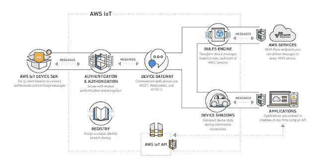
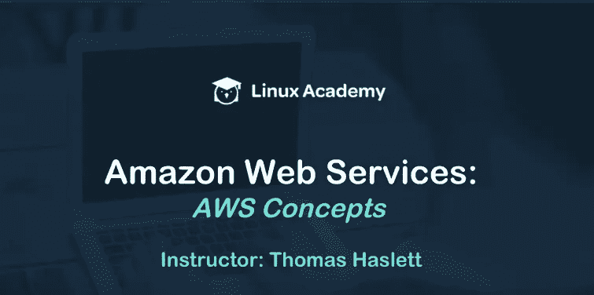
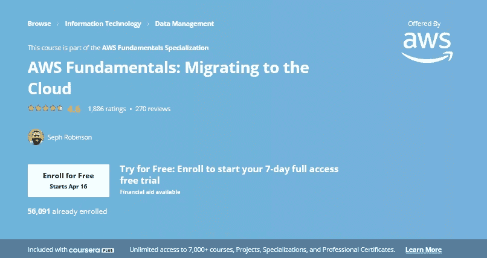
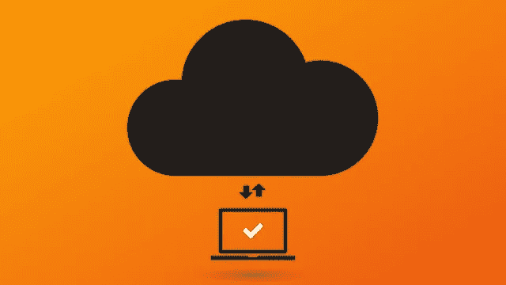
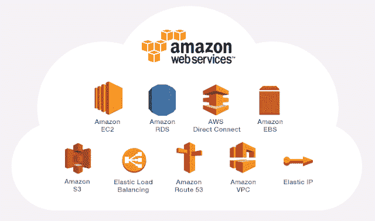
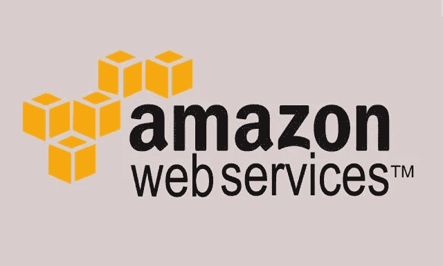

# 我最喜欢的初学者学习亚马逊网络服务(AWS)和云计算的课程——最好的和免费的

> 原文：<https://medium.com/javarevisited/top-10-courses-to-learn-amazon-web-services-aws-cloud-in-2020-best-and-free-317f10d7c21d?source=collection_archive---------0----------------------->

大家好，如果你想学习亚马逊网络服务，俗称 **AWS，**并寻找一些优秀的资源，如书籍、课程和教程，那么你来对地方了。

早些时候，我已经分享了最好的云计算书籍和云计算课程，在这篇文章中，我将分享一些*最好的亚马逊网络服务或 AWS 课程*，它们将帮助你免费学习这项革命性的宝贵技术。

与你在互联网上找到的许多其他免费课程不同，这些是真正的 [**免费 AWS 课程**](http://www.java67.com/2018/05/top-5-amazon-web-services-or-aws-courses-to-learn-online.html) ，它们是由作者和讲师出于宣传和教育目的免费提供的。

你只需要注册他们，然后你就可以在任何时间、任何地点，按照你自己的时间表学习 AWS。

但是，如果你对 AWS 领域或[云](https://javarevisited.blogspot.sg/2018/02/top-5-spring-microservices-courses-with-spring-boot-and-spring-cloud.html)完全陌生，让我给你简单介绍一下**亚马逊网络服务**及其相对于传统基础设施设置的优势。

<https://coursera.pxf.io/c/3294490/1164545/14726?u=https%3A%2F%2Fwww.coursera.org%2Fspecializations%2Faws-java-serverless-development>  

# 什么是亚马逊网络服务(AWS)？利益

AWS 不过是亚马逊的云服务提供商。这是一个革命性的变化，因为它允许您开发应用程序，而不必担心硬件、网络、[数据库](https://hackernoon.com/top-5-sql-and-database-courses-to-learn-online-48424533ac61?source=user_profile---------1---------------------)和运行应用程序所需的其他物理基础设施。

例如，如果您想为您的企业开发一个在线应用程序，您需要大量的服务器、数据库和其他基础设施。

你需要租用一个数据中心，购买服务器、路由器、[数据库](https://javarevisited.blogspot.com/2018/05/top-5-sql-and-database-courses-to-learn-online.html)和其他东西来启动，这对许多企业家来说是痛苦和巨大的障碍。AWS 通过租用他们的基础设施和服务器来解决这个问题，只需支付你自己搭建的象征性费用。

亚马逊在世界各地建立了许多数据中心来支持其核心业务，即支持 Amazon.com 和 AWS 的电子商务业务。

> *AWS 允许亚马逊将其庞大的基础设施出租给有需求的人和企业，以此来赚钱。*

它创造了基础设施即服务的现象，因为现在您只需要为您实际使用的基础设施付费。

例如，如果你建立了自己的数据中心，购买了 10 台[服务器](http://www.java67.com/2016/06/3-difference-between-web-server-vs-application-server-vs-servlet-container.html)和 10 台[数据库](https://javarevisited.blogspot.com/2018/05/top-5-sql-and-database-courses-to-learn-online.html)，但最终只使用了其中的 5 台，那么剩余的就是浪费金钱，而且维护成本也很高。有了亚马逊网络服务，你可以快速摆脱它们。

类似地，**如果你在类似亚马逊网络服务的云上托管你的应用程序，你可以快速扩展。**

如果您发现您的流量在增加，那么您可以快速订购新的服务器，然后您的新基础架构在几个小时内就准备好了，而传统方法需要几天或几个月。

你也不需要雇佣 [UNIX 管理员](https://javarevisited.blogspot.com/2018/02/5-courses-to-learn-shell-scripting-in-linux.html)、[数据库管理员](https://javarevisited.blogspot.com/2018/12/top-5-free-microsoft-sql-server-and-transact-sql-online-courses.html#axzz5hG3koJem)、网络管理员、存储人员等，所有这些都是由亚马逊完成的，因为亚马逊正在大规模进行，所以它可以以低得多的成本提供同样的服务。

简而言之，亚马逊网络服务催生了[云](https://javarevisited.blogspot.sg/2018/02/top-5-spring-microservices-courses-with-spring-boot-and-spring-cloud.html#axzz5Cz1R4cHw)的概念，它允许你将你的业务上线，而不用担心为其提供动力的硬件和基础设施。

<https://coursera.pxf.io/c/3294490/1164545/14726?u=https%3A%2F%2Fwww.coursera.org%2Fspecializations%2Faws-python-serverless-development>  

# 学习亚马逊网络服务(AWS)的十大课程

现在我们知道了什么是 AWS，以及它在基础架构即服务方面提供的优势，是时候深入了解不同的 Amazon 服务了，这些课程将在这方面为您提供帮助。

如果您想总体了解 AWS 和云，或者您正在准备各种 AWS 认证，如 [**AWS 解决方案架构师**](https://javarevisited.blogspot.com/2019/05/top-5-courses-to-crack-aws-solutions-architect-associate-certification-exam-SAA-C01.html#axzz5rDG2YF9D) 、 **AWS 系统运营管理员**或 **AWS 开发人员(助理)**，您可以参加这些课程。这些课程将帮助您开启通往 AWS 美丽世界的旅程。

不过，如果你正在准备 AWS 解决方案架构师考试，我强烈建议你参加由 AWS 英雄夏羽·马瑞克在 Udemy 上开设的 [**终极 AWS 认证解决方案架构师助理 2023**](https://click.linksynergy.com/deeplink?id=JVFxdTr9V80&mid=39197&murl=https%3A%2F%2Fwww.udemy.com%2Fcourse%2Faws-certified-solutions-architect-associate-saa-c02%2F) **co** 课程，这是 AWS 上最好的课程之一。它不是免费的，但它完全值得你花钱。

无论如何，这里列出了学习 AWS 或亚马逊网络服务的最佳免费在线课程。

## **1。** [**亚马逊网络服务——学习和实施 AWS 解决方案**](https://click.linksynergy.com/fs-bin/click?id=JVFxdTr9V80&subid=0&offerid=323058.1&type=10&tmpid=14538&RD_PARM1=https%3A%2F%2Fwww.udemy.com%2Famazon-web-services-aws%2F)

这是学习亚马逊网络服务最好的课程之一，而且是免费的。它遵循通过实例和真实世界场景学习的原则，并反映在他们的课程中。

这是一个简短的 AWS 课程，只有 2 个小时的材料，但它充满力量和紧张。没有废话或翻转，导师 Dhruv 的偏见总是意味着商业。

即使你查看了预览章节，你也会学到很多关于什么是 AWS，它能解决什么问题，它能提供什么好处，以及你为什么要学习它。

**这是参加本课程的链接** — [亚马逊网络服务—学习和实施 AWS 解决方案](https://click.linksynergy.com/fs-bin/click?id=JVFxdTr9V80&subid=0&offerid=323058.1&type=10&tmpid=14538&RD_PARM1=https%3A%2F%2Fwww.udemy.com%2Famazon-web-services-aws%2F)

这个免费的 AWS 课程分为 5 个部分，在第一部分，您将获得 AWS 的介绍和课程的概述，而剩余部分重点关注不同的亚马逊网络服务产品，如亚马逊 S3(简单存储服务)、亚马逊 AWS EC2(弹性云计算)和[数据库](http://www.java67.com/2018/02/5-free-database-and-sql-query-courses-programmers.html)，如 AWS DynamoDB 或 RDB。

总的来说，这是一个学习什么是 AWS 及其不同服务的免费课程。我向任何想学习云和亚马逊 Web 服务(AWS)的程序员强烈推荐这门课程。

顺便说一句，如果你正在准备亚马逊 Web 服务解决方案架构师考试(代码 SAA- C02)，我强烈推荐AWS 英雄夏羽·马雷克的[**终极 AWS 认证解决方案架构师助理 2023**](https://click.linksynergy.com/deeplink?id=JVFxdTr9V80&mid=39197&murl=https%3A%2F%2Fwww.udemy.com%2Fcourse%2Faws-certified-solutions-architect-associate-saa-c02%2F) **课程**。

</javarevisited/how-to-prepare-for-aws-solution-architect-associate-certification-saa-c01-saa-c02-exam-in-2021-a6e7e7e771fc>  

## 2.[AWS 云计算介绍](https://click.linksynergy.com/deeplink?id=CuIbQrBnhiw&mid=39197&murl=https%3A%2F%2Fwww.udemy.com%2Fcourse%2Fintroduction-to-aws-cloud-computing%2F)【免费 Udemy 课程】

这是另一个在 Udemy 上学习亚马逊网络服务的很棒的免费课程。它来自 Udemy，由讲师 Thomas Haslet 教授。

该系列实际上分为两门课程:AWS 概念和 AWS 基础知识。

这是第一部分，下一个课程也是免费的，是这个系列的第二部分。在本课程中，您将从讲师 Thomas Haslet 那里学习云计算和 Amazon Web Service 的概念，他也是 AWS 的认证开发人员。

他持有所有三个 AWS 认证的准水平，如

1.  [**AWS 解决方案架构师(助理)**](https://javarevisited.blogspot.com/2019/05/top-5-courses-to-crack-aws-solutions-architect-associate-certification-exam-SAA-C01.html#axzz5rDG2YF9D)
2.  [**【AWS 系统运行管理员(助理)**](/javarevisited/7-best-aws-sysops-administrator-associate-certification-practice-test-mock-exams-and-dumps-3578d07e4f5b)
3.  [**AWS 开发者(助理)**](/javarevisited/6-best-aws-developer-associate-dva-c001-certification-practice-test-mock-exams-and-dumps-9e24573f509a)
4.  **[AWS 云从业者认证](/javarevisited/10-best-aws-certified-cloud-practitioner-clf-c01-online-courses-and-practice-test-to-crack-ecc0f913091e)**

**本课程面向绝对初学者，从未听说过云或 AWS，但了解什么是硬件、[服务器](http://www.java67.com/2016/06/3-difference-between-web-server-vs-application-server-vs-servlet-container.html)、[数据库](http://www.java67.com/2016/09/sql-5-best-books-to-learn-and-master.html)以及为什么需要它们的人。在这门课程中，你不仅会学到基本概念，还会积累词汇。**

****

**您将找到所有基本 AWS 问题的答案，例如**什么是云？**什么是 AWS？什么是 AWS 核心服务？**AWS 有什么好处？**为什么要用？在这门课中。**

**简而言之，如果您是云新手，这是一门完美的课程。您将通过简单的语言了解 VPC、EC2、S3、RDS 和其他云术语，如果您正在准备 AWS 认证，如解决方案架构师助理一级，我还建议您查看 [**Whizlab 的 AWS 解决方案架构师实践测试+课程**](http://shrsl.com/1l7zg) 以及 Ryan 的课程，这两者都是通过这一著名考试的非常有价值的资源。**

## **3. [AWS 基础:向云迁移](https://coursera.pxf.io/c/3294490/1164545/14726?u=https%3A%2F%2Fwww.coursera.org%2Flearn%2Faws-fundamentals-cloud-migration)【免费审核】**

**这是一门为期四周的课程，重点是将工作负载迁移到 AWS。您将重点分析您当前的环境、规划您的迁移、迁移期间常用的 AWS 服务以及实际的迁移步骤。**

**本课程也是 Coursera 中 [**AWS 基础专业化**](https://coursera.pxf.io/c/3294490/1164545/14726?u=https%3A%2F%2Fwww.coursera.org%2Fspecializations%2Faws-fundamentals) 的一部分，不仅包含本课程，还包含其他 AWS 基础课程，以引导和结构化的方式教授您 AWS。**

**虽然本课程不要求动手实验，但也有动手实验。只有付费的注册学生才能进入实验室。您可以旁听本课程，而无需参加实验。**

****以下是参加本课程的链接** — [AWS 基础知识:向云迁移](https://coursera.pxf.io/c/3294490/1164545/14726?u=https%3A%2F%2Fwww.coursera.org%2Flearn%2Faws-fundamentals-cloud-migration)**

****

**如果你发现 Coursera 的课程很有用，因为它们是由世界各地知名的公司和大学创建的，我建议你加入 Coursera Plus 的<https://coursera.pxf.io/c/3294490/1164545/14726?u=https%3A%2F%2Fwww.coursera.org%2Fcourseraplus>**，这是 Coursera 的一个订阅计划，让你可以无限制地访问他们最受欢迎的课程、专业、专业证书和指导项目。它每年花费大约 399 美元，但是它完全物有所值，因为你可以获得无限的证书。****

****<https://coursera.pxf.io/c/3294490/1164545/14726?u=https%3A%2F%2Fwww.coursera.org%2Fcourseraplus> **** 

## ******4。** [亚马逊 AWS 核心服务——EC2、VPC、S3、IAM、DynamoDB、RDS](https://click.linksynergy.com/deeplink?id=JVFxdTr9V80&mid=39197&murl=https%3A%2F%2Fwww.udemy.com%2Fcourse%2Famazon-aws-core-services-ec2-vpc-s3-iam-dynamodb-rds%2F)****

****这是 Udemy 上免费 AWS 课程的第二部分。如果您还没有阅读第一部分， *AWS 概念*，那么您应该在参加本课程之前先完成该部分，尽管这不是强制性的。****

****与之前的课程相比，本课程对 AWS 核心服务进行了更详细的介绍。它还有许多材料，包括大约 50 个讲座，涵盖了不同的云和 AWS 概念。****

****本课程分为 14 个部分，每个部分涵盖一个关键的 AWS 概念，例如身份和访问管理(IAM)、虚拟私有云(VPC)、 [**简单存储服务**](/javarevisited/7-best-aws-s3-and-dynamodb-courses-for-beginners-in-2021-a8a44b6066da)**【S3】**[**弹性计算云**](/javarevisited/7-best-aws-ec2-amazon-elastic-compute-cloud-online-courses-for-beginners-in-2021-f7a1a55ea719)**【EC2】**、数据库、简单通知服务(SNS)、自动扩展、路由 53、[无服务器 Lambdas](/javarevisited/7-best-serverless-and-aws-lambda-courses-to-learn-in-2021-de1820111c85) 等。****

****简而言之，最全面的 AWS 课程之一，也是免费的。超过 7 万名学生已经注册了这门课程并学习 AWS，我也向所有对云和 [AWS](http://javarevisited.blogspot.sg/2014/05/top-5-cloud-service-providers-companies-Java-IT-professional-know.html) 感兴趣的人强烈推荐这门课程。****

******这里是免费参加本课程的链接** — [亚马逊 AWS 核心服务](https://click.linksynergy.com/deeplink?id=JVFxdTr9V80&mid=39197&murl=https%3A%2F%2Fwww.udemy.com%2Fcourse%2Famazon-aws-core-services-ec2-vpc-s3-iam-dynamodb-rds%2F)****

********

## ******5。** [AWS 开发人员助理培训](https://click.linksynergy.com/deeplink?id=JVFxdTr9V80&mid=39197&murl=https%3A%2F%2Fwww.udemy.com%2Fcourse%2Faws-developer-associate-training%2F)【免费课程】****

****这是另一个有用和令人兴奋的免费 AWS 培训课程，你会喜欢参加 Udemy 的。在本课程中，讲师 Alan Rodrigue 是云和 AWS 的早期采用者，也是最受欢迎的云计算讲师之一，他解释了 Amazon Web Services 的基础知识。****

****本课程也非常注重实践，您将开始注册 AWS，创建您的帐户，然后使用命令行界面来控制 AWS。****

****您还将学习在 AWS 控制台中导航，构建 Windows 和 [Linux](http://www.java67.com/2018/02/5-free-linux-unix-courses-for-programmers-learn-online.html) 服务器，并在 5 分钟内创建一个 WordPress 网站，演示如何利用云满足您的[数据库](https://javarevisited.blogspot.sg/2018/05/top-5-mysql-courses-to-learn-online.html)、服务器和存储需求。****

****本课程还将教你如何构建一个简单的 AWS 无服务器系统。****

****该课程不仅关注 AWS 技术和术语，还会教你一些基础知识，比如云计算的真正定义以及 AWS 如何融入云模型。你也会得到一些真实的图片来找到 AWS 在世界上的位置。****

****但是，最重要的是，您将获得一些基本 AWS 服务的实践经验，例如****

1.  ****AWS S3 —亚马逊简单存储服务****
2.  ****Amazon Lambda —功能即服务****
3.  ****AWS EC2 — AWS 弹性简单计算机服务****

****简而言之，学习亚马逊网络服务和云计算基础知识的最佳免费课程之一。****

******这是参加本课程的链接**——[AWS 开发人员助理培训](https://click.linksynergy.com/deeplink?id=JVFxdTr9V80&mid=39197&murl=https%3A%2F%2Fwww.udemy.com%2Fcourse%2Faws-developer-associate-training%2F)****

********

## ****[⑥**。亚马逊网络服务(AWS) —零到英雄**](https://click.linksynergy.com/fs-bin/click?id=JVFxdTr9V80&subid=0&offerid=323058.1&type=10&tmpid=14538&RD_PARM1=https%3A%2F%2Fwww.udemy.com%2Famazon-web-services-aws-v%2F) **【免费教程】******

****这是另一个简短但真正动手操作的 AWS 课程，将教您如何在 AWS 界面上执行一个常见任务。在仅仅 2 个小时的时间里，你将学会如何基于 Amazon EC2 服务创建一个 WordPress 网站。****

****您还将学习如何创建基于 NodeJS 的 web 应用程序，使用 AWS SES 发送电子邮件，将文件上传到 AWS S3(Amazon 提供的存储解决方案),最后，学习创建并连接到 AWS 关系数据库服务器。****

****简而言之，如果您想使用 AWS 来托管您的应用程序，或者想了解如何利用云来托管您的应用程序，这是一个很好的课程，最重要的是它是免费的。****

******这里是加入这个免费 AWS 课程的链接**——[亚马逊网络服务(AWS)——零到英雄](https://click.linksynergy.com/fs-bin/click?id=JVFxdTr9V80&subid=0&offerid=323058.1&type=10&tmpid=14538&RD_PARM1=https%3A%2F%2Fwww.udemy.com%2Famazon-web-services-aws-v%2F)****

********

## ****7.面向初创企业的 AWS 小时免费视频课程)****

****这是 ExamPro.com 的 Andrew Brown 提供的免费 AWS 课程。这是一门课程，面向早期创业公司和希望以实用的方式应用 AWS 的人，而不仅仅是为了获得 AWS 认证！****

****它涵盖了一些人们通常忽略但却非常有用的 AWS 服务。您将了解如何开始使用 AWS。这是对使用 AWS 感兴趣的早期创业公司的实用指南。您将学习如何创建 AWS 帐户、部署应用程序、调整应用程序预算等等！****

****这是完全免费的，你可以在@Youtube 的 freeCodeCamp youtube 频道上观看。****

## ****8.免费的 AWS 认证解决方案架构师助理学习课程(275 多个视频！)****

****这是 Andrew Brown 为准备 AWS 认证解决方案架构师而开设的另一门免费的 AWS 学习课程，但您也可以通过它来了解 AWS。****

****本学习课程旨在帮助您通过 [**AWS 解决方案架构师助理认证**](https://javarevisited.blogspot.com/2019/05/top-5-courses-to-crack-aws-solutions-architect-associate-certification-exam-SAA-C01.html#axzz5rHwAwycj) 。它是在 2019 年底录制的，但大部分内容仍然有效，所以如果你在 2023 年，正在准备 AWS 认证解决方案架构师考试，你仍然可以使用这门课程进行学习。****

****所有视频都是 [275+视频 YouTube 播放列表](https://www.youtube.com/playlist?list=PLBfufR7vyJJ6FhBhJJSaMkI-m2wyoPy-G)的一部分****

## ****9.免费的 AWS 认证云从业者学习课程(85+视频！)****

****如果你想开始获得一些开发者认证，*AWS 认证云从业者*可能是一个很好的起点，这个免费课程可以帮助你实现这一目标。****

****对于初学者来说，这不是超级技术。你可以在不知道如何编码的情况下获得这个认证。[官方认证描述](https://aws.amazon.com/certification/certified-cloud-practitioner/)建议您具备一些基本的 IT 知识和 *"* ***六个月的 AWS 云工作经验，包括技术、管理、销售、采购或财务等任何职位。"*******

****但是如果你看了这个课程并在你自己的电脑上跟着做，你应该没问题。这门课程将为你详细分解大多数重要的概念。****

****同样，这是完全免费的，你可以在 Youtube 频道上免费观看。****

## ****10. [AWS 云从业者必备](https://coursera.pxf.io/c/3294490/1164545/14726?u=https%3A%2F%2Fwww.coursera.org%2Flearn%2Faws-cloud-practitioner-essentials)【免费 Coursera 课程】****

****这是学习 AWS 基础知识和云计算基础知识的极好课程，重点是开发云原生应用程序。它将向您介绍 AWS 的核心服务和基础设施，最棒的是它是由 AWS 自己提供的。****

****这是一个带有演示的实践课程，您将了解 AWS 云基础架构是如何构建的，了解亚马逊弹性计算云(Amazon EC2)和亚马逊 Lightsail 计算服务。****

****您还将了解 AWS 上的网络，包括如何设置亚马逊虚拟公共云(VPC)和不同的云存储选项，包括亚马逊弹性块存储(EBS)、亚马逊简单存储服务(S3)和亚马逊弹性文件服务(EFS)。****

****在本课程的后面，您将了解 AWS 数据库服务，如 Amazon 关系数据库服务(RDS)和 Amazon DynomoDB。您的讲师还将指导您如何在 AWS 上使用 Amazon CloudWatch 和 Amazon EC2 弹性负载平衡(ELB)和自动扩展来监控和扩展您的应用。****

******以下是参加本课程的链接**——[AWS 云从业者基础知识](https://coursera.pxf.io/c/3294490/1164545/14726?u=https%3A%2F%2Fwww.coursera.org%2Flearn%2Faws-cloud-practitioner-essentials)****

********

****本课程也是您在方便时准备 [**AWS 认证云从业者认证**](/javarevisited/7-free-aws-cloud-practitioner-certification-courses-to-crack-exam-in-2021-f13d6a996019) 的起点。****

****最后，您将了解 AWS 上的安全性，以及在使用 AWS 云平台时如何管理成本。虽然是收费的，但这是 [Coursera](https://javarevisited.blogspot.com/2019/10/top-5-coursera-professional-certificates-for-programmers-IT-professionals.html) 上的**免费审核**课程，这意味着学习是免费的，但如果你需要证书和参加测验和评估，就需要付费。****

## ****11.[全面了解亚马逊网络服务(AWS)](https://www.educative.io/courses/learn-the-a-to-z-of-amazon-web-services-aws?affiliate_id=5073518643380224) 【教育性】****

****这是一门互动课程，旨在了解计算、存储、网络服务等核心 AWS 服务，以及它们如何与身份、移动、路由和安全等其他服务协同工作。****

****本课程由三位 [AWS 解决方案认证架构师](https://javarevisited.blogspot.com/2019/08/how-to-crack-aws-certified-solution-architect-exam.html)设计，他们总共拥有 17 年的行业经验。我们的目标是为您提供您需要的正确深度的知识。****

****如果你不知道 [Educative](https://www.educative.io/subscription?affiliate_id=5073518643380224) 是另一个在线学习平台，它基于文本的交互式学习课程获得了很大的吸引力。阅读通常比观看更快，如果你喜欢阅读文本而不是观看视频，那么这就是结账的平台。****

****它有一些为编码面试做准备的最好的课程，像 [**探索编码面试:编码问题的模式**](https://www.educative.io/collection/5668639101419520/5649050225344512?affiliate_id=5073518643380224) 和 **G** [**探索系统设计面试**](https://www.educative.io/collection/5668639101419520/5649050225344512?affiliate_id=5073518643380224) 。****

****它还有很多免费的资源，比如这个免费的 JavaScript 教程，用来学习基本的技术。你可以免费注册这门课程，但如果你想充分利用这个平台，我建议你购买其会员资格，每月 18 美元 **(** [**半价优惠**](https://www.educative.io/subscription?affiliate_id=5073518643380224) **)** ，对于需要不断学习的程序员和软件工程师来说完全值得。****

****<https://www.educative.io/courses/learn-the-a-to-z-of-amazon-web-services-aws?affiliate_id=5073518643380224> **** 

## ****12.[AWS 的好部分:穿过杂乱的东西](https://www.educative.io/courses/good-parts-of-aws?affiliate_id=5073518643380224)****

****这是学习实用 AWS 的最佳课程之一，你可以在网上找到。这个课程是由一位有着 15 年 AWS 工作经验的前亚马逊工程师创建的。****

****这不是典型的 AWS 参考课程。你不会在 AWS 文档中找到这里分享的大部分知识。这里的目标是帮助你认识到不使用 AWS 的哪些功能是愚蠢的——这些功能已经通过了时间的考验，是互联网上大多数东西的支柱。****

****在本课程中，你将学习一种技术，这种技术可以帮助你做出可靠的技术选择，而不会在面对如此多的选择时手足无措。你将从浏览 AWS 提供的最基本的服务开始，比如 DynamoDB、S3、EC2。每一部分都详细说明了它的用法、优缺点、为什么应该(或不应该)使用它，等等。****

******这里是报名本课程的链接—**[**AWS 的好部分:穿越杂乱**](https://www.educative.io/courses/good-parts-of-aws?affiliate_id=5073518643380224)****

********

****你可以购买这门课程，也可以获得教育会员资格来学习这门课程。如果你问我，我建议你购买<https://www.educative.io/subscription?affiliate_id=5073518643380224>**教育订阅，每月花费**【17 美元】**(现在打五折)，对于需要不断学习的程序员和软件工程师来说完全值得。感谢教育团队提供了这个精彩的课程。******

****本课程在 Gumroad 上也有电子书，如果你喜欢看书，你也可以看看 AWS 电子书中的好部分。如果你用这个链接买书，有 20%的折扣。****

****<https://gumroad.com/a/703100019/MsVlG?offer_code=javinpaul> **** 

## ****13.[ZTM 学院 Amber Israelsen 颁发的 AWS 认证云实践者证书](https://academy.zerotomastery.io/a/aff_1f8vmvjz/external?affcode=441520_zytgk2dn)****

****这是 2023 年学习亚马逊网络服务的又一门高质量、全面、最新的课程。这实际上是二合一课程，您不仅要学习 AWS，还要准备 AWS 认证云从业者考试，成为认证专家。****

****该 AWS 云从业者课程涵盖了 2023 年的所有新信息和最佳实践，重点关注效率。这意味着你不再需要花时间在令人困惑的、过时的、不完整的教程上。****

****您可以使用这一激光聚焦课程来了解要通过 AWS 认证云从业者考试、学习 AWS、获得认证以及获得聘用，您到底需要什么。****

****这门课程最大的好处是，它提供了你跨越界限所需的一切。****

****例如，你将从你的指导老师那里获得**学习策略、技巧、演示、练习题和一次完整的练习考试**，她本人已经多次通过认证*只是为了确保她为你提供最新、最准确的信息和学习策略。*****

*******以下是参加本课程的链接** — [AWS 认证云从业者](https://academy.zerotomastery.io/a/aff_1f8vmvjz/external?affcode=441520_zytgk2dn) r*****

**********

*****顺便说一句，你需要一个 [**ZTM 会员**](https://academy.zerotomastery.io/a/aff_c0gnlvf7/external?affcode=441520_zytgk2dn) 才能观看这个课程，这个课程每月花费大约 39 美元，但也提供了许多像这样的超级有趣和有用的课程。您还可以使用我的代码朋友 10 获得您选择的任何订阅的 10%的折扣。*****

*****<https://academy.zerotomastery.io/a/aff_c0gnlvf7/external?affcode=441520_zytgk2dn>  

以上是关于学习亚马逊网络服务或 AWS 的一些**最好的免费课程。这些在 Udemy 上是绝对免费的课程，但是你需要记住，有时候，一旦教师达到他们的推广目标，他们就会将免费课程转变为付费课程。**

这意味着你应该在加入之前**查看课程价格，如果可能的话，尽早加入，这样你就可以免费参加课程。一旦你注册了这门课程，它就终身免费，你可以随时随地学习。**

即使我目前不打算学习 AWS，我通常也会立即参加课程。通过这种方式，我可以访问课程，一旦我有时间或优先事项发生变化，我就可以开始学习。

您可能想探索的其他**免费编程资源**:

[破解 AWS 解决方案架构师考试前 5 门课程](https://javarevisited.blogspot.com/2019/05/top-5-courses-to-crack-aws-solutions-architect-associate-certification-exam-SAA-C01.html#axzz5rDG2YF9D)
[5 门面向 Web 开发者的免费 JavaScript 课程](http://www.java67.com/2018/04/top-5-free-javascript-courses-to-learn.html)
[5 门面向 JavaScript 开发者的免费课程学习 React JS](http://www.java67.com/2018/02/5-free-react-courses-for-web-developers.html)
[5 门免费课程学习 Core Spring、Spring Boot、 和 Spring MVC](http://www.java67.com/2017/11/top-5-free-core-spring-mvc-courses-learn-online.html)
[5 门免费 Docker 课程面向 Java 和 DevOps 工程师](http://www.java67.com/2018/02/5-free-docker-courses-for-java-and-DevOps-engineers.html)
[5 门课程面向 Java 开发者学习 Maven 和 Jenkins](http://www.java67.com/2018/02/6-free-maven-and-jenkins-online-courses-for-java-developers.html)
[3 门书籍和课程面向 Java 学习 RESTful Web Services](http://www.java67.com/2018/02/3-books-and-courses-to-learn-restful-web-services-with-spring.html)
[5 门课程免费学习区块链技术](http://www.java67.com/2018/02/5-free-blockchain-technology-courses.html)
[7 门免费 Selenium Webdriver 课程面向 Java 和 C#开发者](http://www.java67.com/2018/02/7-free-selenium-web-deriver-courses-for-java-C-developer.html)
[5 门免费课程学习 Servlet、 以及 JDBC](http://www.java67.com/2018/02/5-free-servlet-jsp-and-jdbc-online-courses-for-java-developers.html)
[5 门免费的面向 Web 开发者的 TypeScript 课程](http://www.java67.com/2018/05/top-5-free-typescript-courses-to-learn.html)
[5 门免费的大数据课程学习 Hadoop 和 Spark](http://www.java67.com/2018/05/top-5-free-big-data-courses-to-learn-Hadoop-Apache-Spark.html)

感谢您阅读本文。如果你喜欢这些最好的免费和付费 AWS 在线课程和教程，那么请与你的朋友和同事分享。如果您有任何问题或反馈，请留言。***** 

*******P. S.** —如果您正在准备 AWS 解决方案架构师助理考试(SAA-C02)，我强烈建议您参加由 AWS 英雄夏羽·马雷克在 Udemy 上开设的 **A** [**WS 认证解决方案架构师助理 2023**](https://click.linksynergy.com/deeplink?id=JVFxdTr9V80&mid=39197&murl=https%3A%2F%2Fwww.udemy.com%2Fcourse%2Faws-certified-solutions-architect-associate-saa-c02%2F) 课程。它不是免费的，但它完全值得你花钱，另外，Coursera 上的 [AWS Fundamentals](https://coursera.pxf.io/c/3294490/1164545/14726?u=https%3A%2F%2Fwww.coursera.org%2Fspecializations%2Faws-fundamentals) 也是很好的开始*****

*****<https://coursera.pxf.io/c/3294490/1164545/14726?u=https%3A%2F%2Fwww.coursera.org%2Fspecializations%2Faws-fundamentals> *****