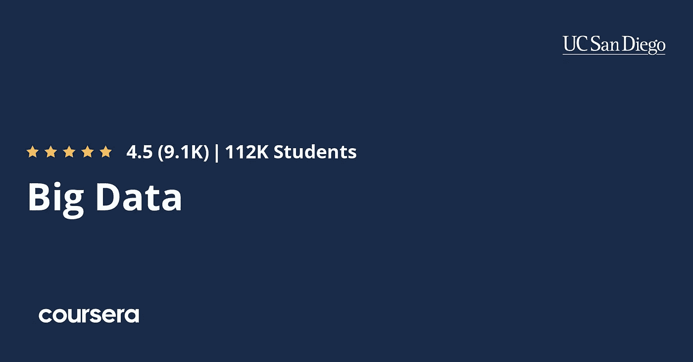
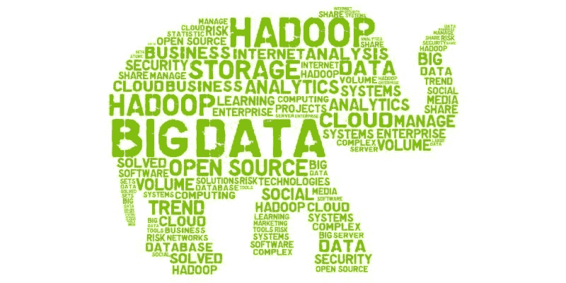

# 2023 年 10 大最佳大数据和 Hadoop 课程—最佳课程

> 原文：<https://medium.com/javarevisited/top-10-courses-to-learn-big-data-and-hadoop-best-of-lot-23ef8691633f?source=collection_archive---------0----------------------->

## 这些是我最喜欢的在线课程，从 Udemy、Coursera 和 Pluralsight 学习大数据、Hadoop、Spark 和 2023 年的相关技术

约书亚·索蒂诺在 [Unsplash](https://unsplash.com?utm_source=medium&utm_medium=referral) 上拍摄的照片

如果你正在学习大数据，或者，想要探索 Hadoop 框架，并且正在寻找一些非常棒的课程，那么你来对地方了。
早些时候，我已经分享了 [**最佳 Apache Spark 课程**](/javarevisited/top-10-apache-kafka-online-training-courses-and-certifications-621f3c13b38c) 和 [**最佳 Apache Kafka 课程**](/javarevisited/top-10-apache-kafka-online-training-courses-and-certifications-621f3c13b38c) 在这篇文章中，我将分享一些最佳 Hadoop 课程，以深入学习 Apache Hadoop。

在过去的几篇文章中，我分享了一些大数据资源和 Apache Spark 资源，这些资源受到了读者的好评。在那之后，我的几个读者给我发了电子邮件，询问一些 Hadoop 资源，如[书籍](/javarevisited/10-best-big-data-and-hadoop-tutorials-books-and-courses-to-learn-in-2020-aaca8cfccb80)、[教程](https://javarevisited.blogspot.com/2019/04/top-10-hadoop-tutorials-for-big-data-developers.html)和[课程](http://javarevisited.blogspot.sg/2018/04/top-5-hadoop-courses-to-learn-online.html)，他们可以利用这些资源更好地学习 Hadoop。

这是 Hadoop 系列的第一篇文章。在接下来的一个月里，我将分享更多关于 Hadoop 和一些优秀资源的信息，例如书籍和教程。

BTW，如果你不知道的话， **Hadoop 是一个开源的用于分析大数据的分布式计算框架**，已经有一段时间了。

许多公司用来处理和分析大数据的经典 MapReduce 模式也运行在 Hadoop 集群上。

Hadoop 的想法很简单:利用计算机网络来处理大量数据，方法是将数据分发到每个节点，然后将各个输出组合起来产生结果。

尽管 MapReduce 是最受欢迎的 Hadoop 特性之一，但 Hadoop 生态系统远不止于此。你有 [HDFS](http://bit.ly/2y817on) ，纱，猪，蜂巢，[卡夫卡](https://javarevisited.blogspot.com/2018/04/top-5-apache-kafka-course-to-learn.html)，HBase， [Spark](http://www.java67.com/2018/04/5-free-apache-spark-course-for-java-scala-python-developers.html) ，Knox，Ranger，Ambari，ZooKeeper，还有很多其他的大数据技术。

BTW，为什么是 Hadoop？**为什么要学习 Hadoop** ？嗯，这是当今 it 行业最流行的技能之一。在美国，大数据开发人员的平均工资约为 112，000 美元，在旧金山，平均工资高达 160，000 美元。

在大数据领域也有许多令人兴奋和有益的机会，这些课程将帮助您了解这些技术，并提高您对整个 Hadoop 生态系统的理解。

# 2023 年学习 Hadoop 和大数据的 10 门最佳在线课程

话不多说，这里是我列出的一些最好的 Hadoop 课程，你可以在线学习和掌握 Hadoop。

## [1。终极实践 Hadoop 课程—驯服您的大数据！](https://click.linksynergy.com/fs-bin/click?id=JVFxdTr9V80&subid=0&offerid=323058.1&type=10&tmpid=14538&RD_PARM1=https%3A%2F%2Fwww.udemy.com%2Fthe-ultimate-hands-on-hadoop-tame-your-big-data%2F)

这是学习 Hadoop 和其他大数据技术的终极课程，因为它涵盖了 Hadoop、MapReduce、HDFS、Spark、Hive、Pig、HBase、 [MongoDB](http://bit.ly/2D2KDzk) 、Cassandra、Flume 等。

在本课程中，您将学习使用 Hadoop 和相关技术设计管理大量数据的分布式系统。

您不仅将学习如何使用 [Pig](http://bit.ly/2CHxnD8) 和 [Spark](https://pluralsight.pxf.io/c/1193463/424552/7490?u=https%3A%2F%2Fwww.pluralsight.com%2Fcourses%2Fapache-spark-fundamentals) 创建脚本来处理 Hadoop 集群上的数据，还将学习如何使用 HBase、 [Cassandra](https://javarevisited.blogspot.com/2019/03/top-5-nosql-database-web-developers-should-learn.html) 和 [MongoDB](http://bit.ly/2CjxgcU) 来分析非关系数据。

它还将教您如何为您的应用选择合适的数据存储技术，以及如何使用 Apache Kafka、 [Sqoop](http://bit.ly/2ChZ01p) 和 Flume 等高速消息传递解决方案将数据发布到您的 Hadoop 集群。

您还将学习使用 [Hive](http://bit.ly/2CHGvYl) 和 [MySQL](https://javarevisited.blogspot.com/2018/05/top-5-mysql-courses-to-learn-online.html) 分析关系数据，以及使用 Drill、Phoenix 和 Presto 交互查询数据。

总的来说，它涵盖了超过 25 种技术，为您提供大数据领域的完整知识。

以下是加入课程的链接— [**终极实践 Hadoop 课程**](https://click.linksynergy.com/fs-bin/click?id=JVFxdTr9V80&subid=0&offerid=323058.1&type=10&tmpid=14538&RD_PARM1=https%3A%2F%2Fwww.udemy.com%2Fthe-ultimate-hands-on-hadoop-tame-your-big-data%2F)

## 10.[Coursera 上的大数据专业化](https://coursera.pxf.io/c/3294490/1164545/14726?u=https%3A%2F%2Fwww.coursera.org%2Fspecializations%2Fbig-data)

这是在线学习大数据的最佳资源之一。和其他 Coursera 专业一样，这个也包含了一些相关的在线课程来教你[大数据](https://javarevisited.blogspot.com/2019/04/top-10-hadoop-tutorials-for-big-data-developers.html)、Neo4j、 [Apache Spark](https://dev.to/javinpaul/top-5-courses-to-learn-big-data-and-hadoop-for-beginners-6g8) 和 [MongoDB](https://javarevisited.blogspot.com/2019/01/top-5-mongodb-online-training-courses.html) 。

一旦你完成了所有的课程和项目，它还会授予你证书。该专业由加州大学圣地亚哥分校提供。48，228 学员们已经从这门精彩的课程中受益匪浅。

该专业有 6 门课程:

1.  [**大数据简介**](https://coursera.pxf.io/c/3294490/1164545/14726?u=https%3A%2F%2Fwww.coursera.org%2Flearn%2Fbig-data-introduction)
2.  [**大数据建模与管理系统**](https://coursera.pxf.io/c/3294490/1164545/14726?u=https%3A%2F%2Fwww.coursera.org%2Flearn%2Fbig-data-management)
3.  [**大数据整合与处理**](https://coursera.pxf.io/c/3294490/1164545/14726?u=https%3A%2F%2Fwww.coursera.org%2Flearn%2Fbig-data-integration-processing)
4.  **利用大数据进行机器学习**
5.  **大数据的图形分析**
6.  [**大数据—顶点工程**](https://coursera.pxf.io/c/3294490/1164545/14726?u=https%3A%2F%2Fwww.coursera.org%2Flearn%2Fbig-data-project)

您还可以免费探索所有这些大数据课程，直到您需要认证。你需要付费才能获得证书，还需要完成所有的作业和项目。

**这里是加入这个大数据计划**——[大数据专业化](https://coursera.pxf.io/c/3294490/1164545/14726?u=https%3A%2F%2Fwww.coursera.org%2Fspecializations%2Fbig-data)的链接

如果你发现 Coursera 的课程很有用，因为它们是由知名公司如**谷歌**、 **IBM** 、**亚马逊**和世界上最好的大学创建的，我建议你加入 Coursera 的订阅计划 [**Coursera Plus**](https://coursera.pxf.io/c/3294490/1164545/14726?u=https%3A%2F%2Fwww.coursera.org%2Fcourseraplus)

 [## Coursera Plus |无限制访问 7，000 多门在线课程

### 用 Coursera Plus 投资你的职业目标。无限制访问 90%以上的课程、项目…

coursera.pxf.io](https://coursera.pxf.io/c/3294490/1164545/14726?u=https%3A%2F%2Fwww.coursera.org%2Fcourseraplus) 

这种单次订阅可以让你无限制地访问他们最受欢迎的**课程**、**专业**、**专业证书**和**指导项目**。它每年花费大约 399 美元，但是它完全值得你的钱，因为你得到了无限的证书。

## [3。Hadoop 课程的构建模块— HDFS、MapReduce 和 YARN](https://pluralsight.pxf.io/c/1193463/424552/7490?u=https%3A%2F%2Fwww.pluralsight.com%2Fcourses%2Fbuilding-blocks-hadoop-hdfs-mapreduce-yarn) [Pluralsight]

处理数十亿条记录并不容易，你需要对分布式计算和底层架构有深刻的理解，以保持事情在控制之下，如果你使用 Hadoop 来做这项工作，那么本课程将教你所有你需要知道的事情。

顾名思义，本课程重点关注 Hadoop 框架的[构建模块](http://bit.ly/2CTUjvO)，例如用于存储的 HDFS、用于处理的 MapReduce 以及用于集群管理的 YARN。

*这里是加入课程的链接—*[*Hadoop 课程的构建模块*](https://pluralsight.pxf.io/c/1193463/424552/7490?u=https%3A%2F%2Fwww.pluralsight.com%2Fcourses%2Fbuilding-blocks-hadoop-hdfs-mapreduce-yarn)

在本课程中，您将首先了解 Hadoop 架构，然后通过设置伪分布式 Hadoop 环境进行一些实际操作。

您将在该环境中提交和监控任务，并慢慢学习如何为分布式系统的稳定性、优化和调度做出配置选择。

在本课程结束时，您应该已经完全了解了**Hadoop 如何工作**及其各个构建模块，例如 HDFS、MapReduce 和 YARN。

## 4.[用 Apache Spark 和 Python 驯服大数据——动手吧！](https://click.linksynergy.com/deeplink?id=JVFxdTr9V80&mid=39197&murl=https%3A%2F%2Fwww.udemy.com%2Fcourse%2Ftaming-big-data-with-apache-spark-hands-on%2F)

这门课动手性很强；在我们一起编写、分析和运行真实代码的过程中，您将花费大部分时间跟随教师——无论是在您自己的系统上，还是在使用 Amazon 的 Elastic MapReduce 服务的云中。

该课程包含超过 5 小时的视频内容和超过 15 个越来越复杂的真实例子，你可以自己构建、运行和学习。

按照你自己的步调，按照你自己的时间表来完成它们。本课程最后概述了其他基于 Spark 的技术，包括 Spark SQL、Spark Streaming 和 GraphX。非常感谢教练弗兰克凯恩创造了这个可怕的课程。

以下是加入本课程的链接— [***用 Python 驯服大数据***](https://click.linksynergy.com/deeplink?id=JVFxdTr9V80&mid=39197&murl=https%3A%2F%2Fwww.udemy.com%2Fcourse%2Ftaming-big-data-with-apache-spark-hands-on%2F)

 [## 用 Apache Spark 和 Python 驯服大数据——动手！

### “大数据”分析是一项热门且极具价值的技能，本课程将向您传授大数据领域最热门的技术

udemy.com](https://click.linksynergy.com/deeplink?id=JVFxdTr9V80&mid=39197&murl=https%3A%2F%2Fwww.udemy.com%2Fcourse%2Ftaming-big-data-with-apache-spark-hands-on%2F) 

## [5。Hadoop 上的 SQL 使用 Hive](https://pluralsight.pxf.io/c/1193463/424552/7490?u=https%3A%2F%2Fwww.pluralsight.com%2Fcourses%2Fsql-hadoop-analyzing-big-data-hive)【plural sight】分析大数据

如果你不知道什么是 Hive，让我给你一个简单的概述。Apache Hive 是一个构建在 Apache Hadoop 之上的数据仓库项目，用于提供数据汇总、查询和分析。

它提供了一个类似 SQL 的接口来查询存储在各种数据库和文件系统中的数据，这些数据库和文件系统集成了 Hadoop 和 NoSQL 数据库，如 [MongoDB](http://bit.ly/2CjxgcU) 和 [Cassandra](http://bit.ly/2xHHkMw) 。

本课程首先解释 Apache Hadoop 的关键概念，如分布式计算、MapReduce，然后详细介绍 Apache Hive。

> 以下是参加课程的链接—[**Hadoop 上的 SQL**](https://pluralsight.pxf.io/c/1193463/424552/7490?u=https%3A%2F%2Fwww.pluralsight.com%2Fcourses%2Fsql-hadoop-analyzing-big-data-hive)

该课程提出了一些现实世界的挑战，以展示 Hive 如何使这项任务更容易完成。

总之，学习如何使用 Hive 查询语言寻找常见大数据问题解决方案的好课程。

## [6。面向初学者的大数据和 Hadoop 亲身实践！](https://click.linksynergy.com/fs-bin/click?id=JVFxdTr9V80&subid=0&offerid=323058.1&type=10&tmpid=14538&RD_PARM1=https%3A%2F%2Fwww.udemy.com%2Fbig-data-and-hadoop-for-beginners%2F)【乌迪米】

如果你是一个初学者，想学习关于 Hadoop 和相关技术的一切，那么这是最适合你的课程。

在本课程中，讲师 Andalib Ansari 将教您 Hadoop 的复杂架构及其各种组件，如 MapReduce、YARN、Hive 和 Pig，用于分析大数据集。

您不仅将了解 Hadoop 的用途和工作原理，还将了解如何在您的机器上安装 Hadoop ，并学习在 Hive 和 Pig 中编写自己的代码来处理大量数据。

> 以下是参加课程的链接— [大数据和 Hadoop 初学者](https://click.linksynergy.com/fs-bin/click?id=JVFxdTr9V80&subid=0&offerid=323058.1&type=10&tmpid=14538&RD_PARM1=https%3A%2F%2Fwww.udemy.com%2Fbig-data-and-hadoop-for-beginners%2F)

除了基本的东西，你还将学习高级概念，如使用 Pig 和 Hive 设计你自己的数据管道。

本课程还为您提供了使用大数据集进行实践的机会。它也是**最受欢迎的 Hadoop 课程之一**在 [Udemy](https://javarevisited.blogspot.com/2019/10/udemy-vs-pluralsight-review-which-is-better-to-learn-code.html) 上，已经有超过 24805 名学生注册，超过 1000 名学生的平均成绩为 4.2。

## [7。学习大数据:Hadoop 生态系统大师班](https://click.linksynergy.com/fs-bin/click?id=JVFxdTr9V80&subid=0&offerid=323058.1&type=10&tmpid=14538&RD_PARM1=https%3A%2F%2Fwww.udemy.com%2Flearn-big-data-the-hadoop-ecosystem-masterclass%2F)【Udemy】

这是从 Udemy 学习大数据的又一个很棒的课程。在本课程讲师中，Edward Viaene 将教您如何使用 batch 处理大数据。

这门课程需要大量的动手操作，但也包含了适量的理论。它包含超过 6 个小时的讲座，教你需要知道的关于 [Hadoop](https://javarevisited.blogspot.com/2019/04/top-10-hadoop-tutorials-for-big-data-developers.html) 的一切。

您还将学习如何安装和配置 Hortonworks 数据平台或 HDP。它提供了一些魔鬼，您可以通过在虚拟机上设置一个 Hadoop 集群，在您的机器上试用这些魔鬼。不过，你需要 8GB 或更多的内存。

**这是加入课程** — [大数据大师班](https://click.linksynergy.com/fs-bin/click?id=JVFxdTr9V80&subid=0&offerid=323058.1&type=10&tmpid=14538&RD_PARM1=https%3A%2F%2Fwww.udemy.com%2Flearn-big-data-the-hadoop-ecosystem-masterclass%2F)的链接

总的来说，这是一门很好的课程，适合任何对[大数据如何工作](http://bit.ly/2CTUjvO)感兴趣的人，以及需要一些实践经验的技术。

## 8.Hadoop 初学者工具包(免费课程)

[本课程](https://click.linksynergy.com/deeplink?id=JVFxdTr9V80&mid=39197&murl=https%3A%2F%2Fwww.udemy.com%2Fcourse%2Fhadoopstarterkit%2F)的目标是一步一步地向您介绍 Hadoop 中的所有核心组件，但更重要的是让 Hadoop 学习体验变得轻松有趣。

通过注册本课程，您还可以免费访问我们的多节点 Hadoop 培训集群，这样您就可以在真正的多节点分布式环境中立即尝试您所学的内容。

这里是免费加入本课程的链接— [**Hadoop Starter Kit(免费)**](https://click.linksynergy.com/deeplink?id=JVFxdTr9V80&mid=39197&murl=https%3A%2F%2Fwww.udemy.com%2Fcourse%2Fhadoopstarterkit%2F)

 [## 免费 Hadoop 教程- Hadoop 初学者工具包

### 本课程的目标是一步一步地向您介绍 Hadoop 中的所有核心组件，以及更多…

udemy.com](https://click.linksynergy.com/deeplink?id=JVFxdTr9V80&mid=39197&murl=https%3A%2F%2Fwww.udemy.com%2Fcourse%2Fhadoopstarterkit%2F) 

## 9.[大数据和 Hadoop 基础知识](https://click.linksynergy.com/deeplink?id=JVFxdTr9V80&mid=39197&murl=https%3A%2F%2Fwww.udemy.com%2Fcourse%2Fbig-data-and-hadoop-essentials-free-tutorial%2F)

本课程构建了对大数据问题和 Hadoop 解决方案的基本理解。本课程将带您了解:

1.  用通俗易懂的例子理解大数据问题。
2.  Hadoop 的历史和出现要追溯到 Hadoop 还不叫 Hadoop 的时候。
3.  是什么让 Hadoop 如此独特和强大？
4.  理解[数据科学](https://dev.to/javinpaul/10-data-science-and-machine-learning-courses-for-programmers-looking-to-switch-career-57kd)和数据工程之间的区别是选择载体或理解工作角色的一大困惑。
5.  最重要的是，通过了解像 Cloudera、MapReduce 和 Hortonworks 这样的 Hadoop 供应商来揭开它们的神秘面纱。

谈到社会证明，这门课程是免费的，受到了超过 120，000 名学生的信任，他们已经在 Udemy 上注册了这门课程。这是一个完全免费的课程，你需要做的就是创建一个 Udemy 账户来参加这个课程。

这里是免费加入本教程的链接— [**大数据与 Hadoop 要领**](https://click.linksynergy.com/deeplink?id=JVFxdTr9V80&mid=39197&murl=https%3A%2F%2Fwww.udemy.com%2Fcourse%2Fbig-data-and-hadoop-essentials-free-tutorial%2F)

 [## 免费大数据教程-大数据和 Hadoop 基础

### 您是否对大数据技术的世界感兴趣，但发现它有点神秘，并将整个事情视为一个大…

udemy.com](https://click.linksynergy.com/deeplink?id=JVFxdTr9V80&mid=39197&murl=https%3A%2F%2Fwww.udemy.com%2Fcourse%2Fbig-data-and-hadoop-essentials-free-tutorial%2F) 

## 10. [Hadoop MapReduce 深度| MapReduce 实时课程](https://click.linksynergy.com/deeplink?id=JVFxdTr9V80&mid=39197&murl=https%3A%2F%2Fwww.udemy.com%2Fcourse%2Fhadoop-mapreduce-in-depth-a-real-time-course-on-mapreduce%2F)

本课程是对“*Hadoop Mapreduce 的哪些概念用在了直播大数据项目中，如何在程序中实现*”这个问题的回答为了回答这个问题，课程中的每个 MapReduce 概念都通过一个 Mapreduce 程序进行了实际解释。

本课程的每堂课都分两步讲解。

*第一步:*解释一个 Hadoop 组件

步骤 2: 实践——如何在 MapReduce 程序中实现该组件。

以下是免费加入本课程的链接— [***Hadoop MapReduce 深度***](https://click.linksynergy.com/deeplink?id=JVFxdTr9V80&mid=39197&murl=https%3A%2F%2Fwww.udemy.com%2Fcourse%2Fhadoop-mapreduce-in-depth-a-real-time-course-on-mapreduce%2F)

 [## Hadoop MAPREDUCE 深度| MAPREDUCE 实时课程

### Mapreduce 框架在处理大数据方面最接近 Hadoop。它被认为是…中的原子处理单元

udemy.com](https://click.linksynergy.com/deeplink?id=JVFxdTr9V80&mid=39197&murl=https%3A%2F%2Fwww.udemy.com%2Fcourse%2Fhadoop-mapreduce-in-depth-a-real-time-course-on-mapreduce%2F) 

以上是关于**学习大数据、Hadoop、**以及 Hive、HDFS、MapReduce、YARAN、Pig 等相关技术的一些最佳课程。Hadoop 是大数据领域最受欢迎的框架之一，对 Hadoop 的良好了解将大大提升你的职业前景，尤其是如果你对大数据感兴趣的话。

其他**编程资源**你可能喜欢的
[2023 年 Java 开发者应该看的 10 本书](http://www.java67.com/2018/02/10-books-java-developers-should-read-in.html)
[2023 年学习 Python 的 5 门课程](http://javarevisited.blogspot.sg/2018/03/top-5-courses-to-learn-python-in-2018.html)
[5 面向程序员的数据科学和机器学习课程](http://javarevisited.blogspot.sg/2018/03/top-5-data-science-and-machine-learning-online-courses-to-learn-online.html#axzz5CdW6rG8R)
[5 面向 JavaScript 开发者的 React Native 课程](http://javarevisited.blogspot.sg/2018/02/5-react-native-courses-to-learn-mobile-development-using-JavaScript.html)
[5 门免费课程 2023 年学习 Spring Boot 和 Spring MVC 的](http://www.java67.com/2017/11/top-5-free-core-spring-mvc-courses-learn-online.html)
[5 门春季微服务课程为 开发者应该在 2023 年学习的](http://javarevisited.blogspot.sg/2018/02/top-5-spring-microservices-courses-with-spring-boot-and-spring-cloud.html)
[5 门课程可以帮助你在 2023 年成为 Scrum 大师](http://javarevisited.blogspot.sg/2018/01/top-5-free-agile-courses-for-programmers.html)
[10 门免费 Docker 课程供 Java 开发者学习 DevOps](http://javarevisited.blogspot.sg/2018/02/10-free-docker-container-courses-for-Java-Developers.html)
[5 门免费 Jenkins 和 Maven 课程供 Java 开发者学习](http://www.java67.com/2018/02/6-free-maven-and-jenkins-online-courses-for-java-developers.html)

## 结束语

谢谢，您已经完成了本文的结尾…祝您的大数据之旅好运！这当然不容易，但通过遵循此路线图和课程，您离成为[大数据专家](https://javarevisited.blogspot.com/2018/10/top-5-carrer-options-for-experienced-java-programmers.html)又近了一步。

如果你喜欢这篇文章，那么请分享给你的朋友和同事，别忘了在 Twitter 上关注 [javinpaul](https://twitter.com/javinpaul) ！

**P.S. —** 如果你需要一些免费资源，可以看看这份 [**免费大数据和 Hadoop 课程的清单，开始**](http://www.java67.com/2018/05/top-5-free-big-data-courses-to-learn-Hadoop-Apache-Spark.html) 你的旅程。

 [## 2023 年学习大数据、Hadoop 和 Spark 的 5 门免费在线课程

### 如果你想学习 2020 年的大数据技术，如 Hadoop、Apache Spark 和 Apache Kafka，并且你正在寻找…

medium.com](/swlh/5-free-online-courses-to-learn-big-data-hadoop-and-spark-in-2019-a553e6ccfe30)  [## 面向 Java 和 Scala 开发人员的 5 门最佳 Apache Spark 课程

### 想学 Java 和 Python 的大数据 Apache Spark 吗？这些是最值得学习的 Apache Spark 课程…

becominghuman.ai](https://becominghuman.ai/5-best-apache-spark-courses-for-java-and-python-developers-bbd9d63eb76c)