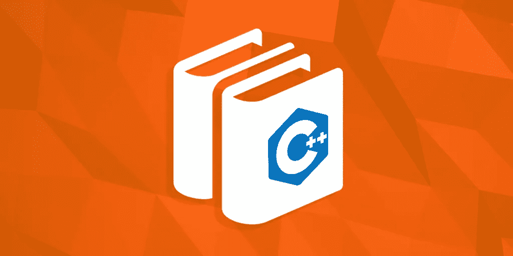
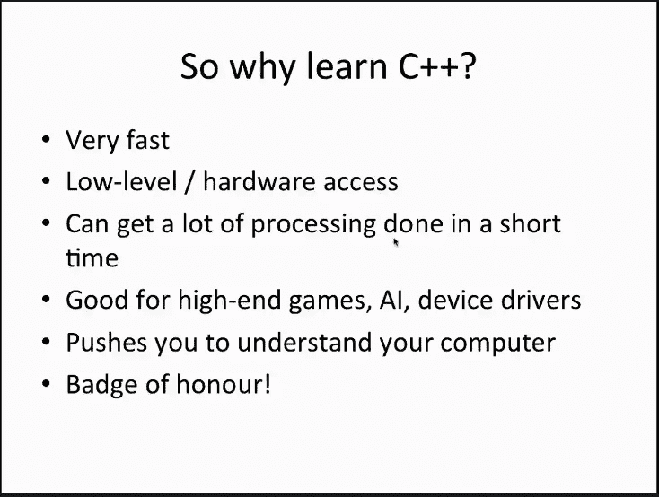
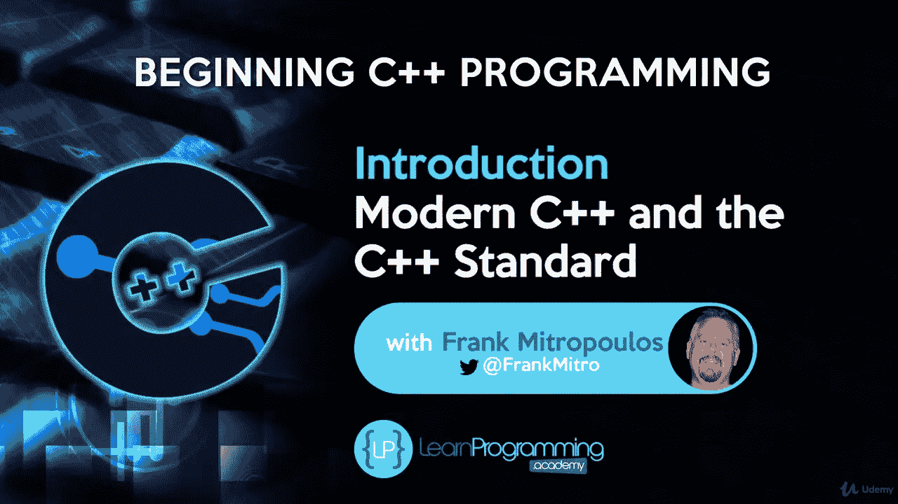
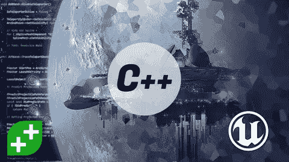
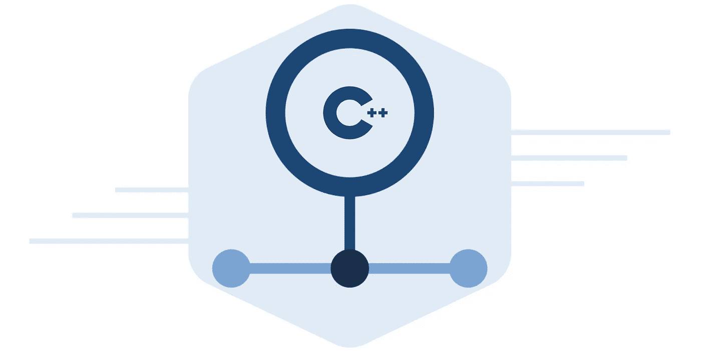
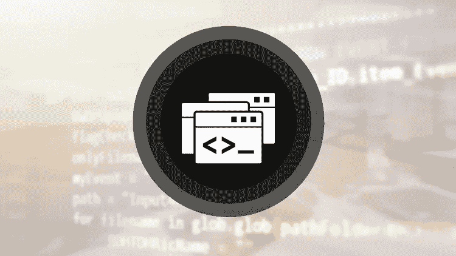
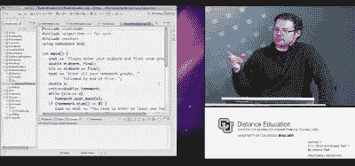

# 2023 年学习 C++我最喜欢的课程——最好的，免费的

> 原文：<https://medium.com/javarevisited/top-10-courses-to-learn-c-for-beginners-best-and-free-4afc262a544e?source=collection_archive---------0----------------------->

形象信用— [教育性](https://www.educative.io/subscription?affiliate_id=5073518643380224)

大家好，你可能知道 [C++](https://www.google.com/search?q=C%2B%2B+hackernoon&rlz=1C5CHFA_enVN829VN829&oq=C%2B%2B+hackernoon&aqs=chrome..69i57.1657j0j1&sourceid=chrome&ie=UTF-8) 是最流行和最强大的面向对象编程语言之一，如果你想做低级的东西，那么它是最好的开始语言。

您会发现用 C++编写的应用程序涉及广泛的领域，如嵌入式编程、服务器端应用程序、游戏，甚至高频交易应用程序。大多数复杂的软件，如操作系统、数据库管理系统和强大的交易系统都是用 C++编写的。

虽然我们中的许多人已经通过使用 [C](http://javarevisited.blogspot.sg/2018/01/top-5-free-data-structure-and-algorithm-courses-java--c-programmers.html) 和 [C++](http://javarevisited.blogspot.sg/2016/09/best-book-to-learn-java-for-c-CPP-programmers.html) 学会了编程，但是让我诚实地告诉你，学习 C++是具有挑战性的。有许多领域很难掌握，比如点，但你会慢慢地学会它们，这就是这些免费 C++课程 会帮助你的地方。

毫无疑问，学习 C++会给你打开几个机会。对优秀的 C++开发人员有着巨大的需求，尤其是在高频交易领域，每一微秒都绝对需要 C++的物质和能力。

C++是一种两全其美的语言，它允许你使用面向对象的程序设计来管理软件的复杂性，但同时，它也允许你接近你的机器并访问你的计算机的所有硬件，这对于其他面向对象的语言如 Java 或 Python 来说是不容易做到的。

这就是为什么 C++被大量用于编写本地设备驱动程序、高端桌面游戏和复杂的[人工智能](https://javarevisited.blogspot.com/2018/10/top-8-python-libraries-for-data-science-machine-learning.html)程序，而这些都需要高性能。

在本文中，我将与您分享一些在您自己的时间和地点免费学习 C++ online 的*最佳免费课程。如果你刚开始编程，或者你有一些编程经验但不熟悉 C++，你可以使用这些课程。*

# 2023 年学习 C++编程的 10 门最佳课程

无论如何，这里是我列出的**一些免费和付费的 C++课程**来成为今年的专家程序员。

## 1.完全初学者的 C++教程

这是一门学习 C++的很棒的课程，你可以在 Udemy 上免费获得。这个[课程](https://click.linksynergy.com/fs-bin/click?id=JVFxdTr9V80&subid=0&offerid=323058.1&type=10&tmpid=14538&RD_PARM1=https%3A%2F%2Fwww.udemy.com%2Ffree-learn-c-tutorial-beginners%2F)从头开始教你强大、快速、流行的 C++编程语言，假设只有基本的计算机知识。

您将从设置您的开发环境开始，然后学习编程的基本语法和构建块。慢慢地，你会进入面向对象编码，学习像[继承](http://javarevisited.blogspot.sg/2015/06/difference-between-inheritance-and-Composition-in-Java-OOP.html#axzz4tUeeQOAU)、[抽象](http://www.java67.com/2015/05/difference-between-abstraction-and.html)、[封装](http://javarevisited.blogspot.sg/2017/04/difference-between-abstraction-and-encapsulation-in-java-oop.html#axzz4rZnBGAiP)等东西。在此之后，您将学习更高级的概念，如指针和内存管理。

**这里是报名本课程的链接—** [完全初学者 C++教程](https://click.linksynergy.com/fs-bin/click?id=JVFxdTr9V80&subid=0&offerid=323058.1&type=10&tmpid=14538&RD_PARM1=https%3A%2F%2Fwww.udemy.com%2Ffree-learn-c-tutorial-beginners%2F)

在课程结束时，你还将学习如何创建一个漂亮的“粒子火”程序，包括游戏开发的基本原则的一知半解。

总之， [**最好的免费课程之一从 C++编程**](https://click.linksynergy.com/fs-bin/click?id=JVFxdTr9V80&subid=0&offerid=323058.1&type=10&tmpid=14538&RD_PARM1=https%3A%2F%2Fwww.udemy.com%2Ffree-learn-c-tutorial-beginners%2F) 开始。学习 C++具有挑战性，但是如果你坚持学习这门课程，保持耐心和毅力，那么没有什么能阻止你成功。已经有超过 400，000 人从这门课程中受益，在如此多的参与者之后，它仍然有 4.4 的平均评分。

## 2.C++编程入门——从入门到超越

本课程将帮助你获得游戏、系统和应用开发所需的现代 C++面向对象编程(OOP)和 STL 技能。

这门课程由 Tim Buchalka 的 Learn Programming Academy 和讲师 Frank J. Mitropoulos 创建，已经帮助了超过 40，719 名学生学习 C++。

谈到社会证明，这门课程在 10，114 个评分中平均有 4.6 个评分，这是惊人的。除英语外，该课程还有波兰语、西班牙语和意大利语版本。

**这里是报名本课程** — [**初学 C++编程**](https://click.linksynergy.com/deeplink?id=JVFxdTr9V80&mid=39197&murl=https%3A%2F%2Fwww.udemy.com%2Fbeginning-c-plus-plus-programming%2F) 的链接

## 3.虚幻引擎 C++开发者:学习 C++制作视频游戏

这门课程将帮助你从基础开始学习 C++。它还将教你如何在虚幻引擎中制作你的前 4 个视频游戏，这是堡垒之夜背后的引擎。互动教程。

由 Ben Tristem 和 GameDev.tv 创建，从游戏开发的角度来看，这是任何学习 C++的人的理想课程。该课程已经帮助超过 182，054 名学生学习 C++和开发游戏。

它也是 Udemy 上课程的 5 颗星之一，来自近 35，161 名开发人员的平均评分为 4.6。除英语外，该课程还有波兰语和意大利语版本。

**这里是报名本课程的链接**——[**虚幻引擎 C++开发者课程**](https://click.linksynergy.com/deeplink?id=JVFxdTr9V80&mid=39197&murl=https%3A%2F%2Fwww.udemy.com%2Funrealcourse%2F)

## 4.从头开始学习 C++

学习 C++不仅可以让你成为一名更好的开发人员，还可以为你作为一名 C++开发人员提供一些高薪工作，如果你想成为一名 C++开发人员，这个免费课程是一个很好的开始。

[**上的这个互动课程是教育性的**](https://www.educative.io/?affiliate_id=5073518643380224) ，教育性团队首先向您介绍 C++中的基本编程概念。它从一个简单的 hello world 程序开始，并继续涵盖常见的概念，如 C++中的条件语句、循环语句和函数。

之后，您将学习指针和数组等基本主题，以及它们赋予程序员编写更好代码的能力。

最后，为了通过交互式的挑战和练习来教授高级概念，如 C++中的类、继承和模板，本课程进行了更深入的探讨。

**这里是加入本课程**的链接——*[***从头学 c++***](https://www.educative.io/courses/learn-cpp-from-scratch?affiliate_id=5073518643380224)*

**

*如果你不知道的话，Educative 是另一个在线学习平台，它基于文本的互动学习课程获得了很大的吸引力。阅读通常比观看更快，如果你喜欢阅读文本而不是观看视频，那么这就是结账的平台。*

*它有一些为编码面试做准备的最好的课程，像[寻找编码面试:编码问题的模式](https://www.educative.io/collection/5668639101419520/5671464854355968?affiliate_id=5073518643380224)和[寻找系统设计面试](https://www.educative.io/collection/5668639101419520/5649050225344512?affiliate_id=5073518643380224)。它还有很多免费资源，比如 t **他的免费 C++教程**来学习必要的技术。感谢法希姆·哈克*

*你可以免费注册这门课程，但如果你喜欢充分利用这个平台，我建议你购买 [**教育订阅**](https://www.educative.io/subscription?affiliate_id=5073518643380224) ，每月花费 18 美元(现在有 50%的折扣)，对于需要不断学习的程序员和软件工程师来说完全值得*

*<https://www.educative.io/subscription?affiliate_id=5073518643380224> * 

## ***5。通过创建【免费】**学习 C++*

*这是另一个在 Udemy 上学习 C++的免费课程。在本课程中，你将通过一次做一个层次的事情和建立技能来学习。本课程首先教你如何让你的计算机准备好使用 Visual Studio 编写 C++程序，Visual Studio 是编写 C++程序最流行的 IDE。*

*之后，您将学习编写 HelloWorld 程序并处理输入和输出，就像编写程序从用户那里获取输入并在控制台上显示输出一样。*

***这里是报名本课程的链接—** [**通过创建**](https://click.linksynergy.com/fs-bin/click?id=JVFxdTr9V80&subid=0&offerid=323058.1&type=10&tmpid=14538&RD_PARM1=https%3A%2F%2Fwww.udemy.com%2Flearn-to-program-cpp%2F) 学习 C++*

**

*您还将学习创建几个应用程序来探索不同的概念，比如创建一个操作[字符串](http://javarevisited.blogspot.com/2015/01/top-20-string-coding-interview-question-programming-interview.html)、自动操作和编写聊天机器人的应用程序。*

*简而言之，对于初学者来说这是一门很棒的课程，对于已经有一段时间没有使用 C++的人来说，这是一门很好的复习课程。*

## ***6。C++，短小精悍，第 1 部分***

*这门免费的 C++课程是为想学习 C++编程的初学者开设的，由科罗拉多大学教授 Jeremy Siek 教授。*

*这是一门由两部分组成的课程，以安德鲁·克尼格和芭芭拉·e·穆的优秀教材《C++速成》为基础。*

*第 1 部分涵盖了加速 C++的前七章，特别是第 0 章到第 6 章，课程的第 2 部分涵盖了加速 C++的后半部分，包括如何编写自己的类和泛型函数。*

***这里是报名参加本课程** — [**C++，简短而甜蜜，第一部分**](https://click.linksynergy.com/fs-bin/click?id=JVFxdTr9V80&subid=0&offerid=323058.1&type=10&tmpid=14538&RD_PARM1=https%3A%2F%2Fwww.udemy.com%2Fcpp-short-and-sweet%2F)*

**

*与教科书类似，该课程很快深入到解决问题和利用 C++标准库，包括[字符串](http://javarevisited.blogspot.sg/2016/09/best-book-to-learn-java-for-c-CPP-programmers.html)，向量和列表。*

*简而言之，这是一门学习 C++的实用课程，重点是教你日常编程中最可能用到的 C++部分。*

## ***7。C++编程基础[免费]***

*这是 Udemy 的又一个免费 C++课程，教你如何编写 C++和基础知识。*

*这门[课程](https://click.linksynergy.com/fs-bin/click?id=JVFxdTr9V80&subid=0&offerid=634352.1&type=10&tmpid=14538&RD_PARM1=https%3A%2F%2Fwww.udemy.com%2Fc-plus-plus-programming-basics%2F)为任何对用简单程序学习 C++感兴趣的人提供了一个 C++的快速概述和介绍。您还将学习如何包含头文件、编写函数以及 C++的其他强大功能。*

*简而言之，这是初学者的完美课程。*

***这里是报名本课程的链接—** [**C++编程基础**](https://click.linksynergy.com/fs-bin/click?id=JVFxdTr9V80&subid=0&offerid=634352.1&type=10&tmpid=14538&RD_PARM1=https%3A%2F%2Fwww.udemy.com%2Fc-plus-plus-programming-basics%2F)*

**

## ***8。开始 C++模板[免费]***

*这是 Udemy 提供的又一个免费 C++课程，教你 C++模板的基础知识。*

*如果你不知道，C++模板是用来创建高性能算法和类的。大多数高性能的库，如活动模板库、Windows 模板库等，都是通过 C++模板实现的。*

*模板对于任何 C++编程新手来说都是一个挑战。但是，本课程将帮助您理解模板的语法。*

*它会带你慢慢了解基础知识，然后慢慢地构建高级概念，如专门化、可变模板等。*

***这里是报名本课程的链接—**[**c++入门模板**](https://click.linksynergy.com/fs-bin/click?id=JVFxdTr9V80&subid=0&offerid=323058.1&type=10&tmpid=14538&RD_PARM1=https%3A%2F%2Fwww.udemy.com%2Fbeg-cpp-temp%2F)*

**

*顺便说一下，这是从课程 [**开始现代 C++**](https://click.linksynergy.com/fs-bin/click?id=JVFxdTr9V80&subid=0&offerid=323058.1&type=10&tmpid=14538&RD_PARM1=https%3A%2F%2Fwww.udemy.com%2Fbeg-modern-cpp%2F) **，**中摘录的，如果你想学习完整的现代 C++，你也可以看看。*

## *9.[面向 C 程序员的 C++，第一部分](https://coursera.pxf.io/c/3294490/1164545/14726?u=https%3A%2F%2Fwww.coursera.org%2Flearn%2Fc-plus-plus-a)*

*本课程是为想用 C++编程的有经验的 C 程序员开设的。这些例子和练习要求对算法和面向对象软件有基本的理解。*

*这门课主要讲 C++ 11，也教你现实世界的图算法。这个课程非常适合寻求更新技能到新的 V11 C++的开发人员。*

*我还建议买一本作者写的书，连同一篇课文或 [Coursera 算法课程](https://coursera.pxf.io/c/3294490/1164545/14726?u=https%3A%2F%2Fwww.coursera.org%2Flearn%2Falgorithms-part1)。该课程由加州大学圣克鲁斯分校提供，讲师是计算机科学系教授 Ira Pohl。*

*该课程已经受到超过 91，399 名程序员的信任，它还提供认证，你可以在 LinkedIn 的个人资料中、打印的简历上或其他文档中共享认证。*

> *可以在这里报名— [**C++ for C 程序员**](https://coursera.pxf.io/c/3294490/1164545/14726?u=https%3A%2F%2Fwww.coursera.org%2Flearn%2Fc-plus-plus-a)*

*<https://coursera.pxf.io/c/3294490/1164545/14726?u=https%3A%2F%2Fwww.coursera.org%2Flearn%2Fc-plus-plus-a> * 

## *10.[面向 C 程序员的 C++，B 部分](https://coursera.pxf.io/c/3294490/1164545/14726?u=https%3A%2F%2Fwww.coursera.org%2Flearn%2Fc-plus-plus-b)*

*这是上述课程的第二部分，重点是 C++ 11 和标准模板库或 STL。*

*对于 C 程序员来说，这是一门入门 C++的好课程。它为您提供了执行日常开发工作所需的所有基础知识，并通过文档或其他资源为您提供了学习剩余 C++的能力。*

*这两门课也是 Coursera 上 [***为大家编码的一部分:C 和 C++专精***](https://coursera.pxf.io/c/3294490/1164545/14726?u=https%3A%2F%2Fwww.coursera.org%2Fspecializations%2Fcoding-for-everyone) **。我强烈推荐任何想学习一些严肃的 C++和入门人工智能的人！***

***这里是报名本课程的链接—** [**程序员 C++，B 部分**](https://coursera.pxf.io/c/3294490/1164545/14726?u=https%3A%2F%2Fwww.coursera.org%2Flearn%2Fc-plus-plus-b)*

**

*如果你觉得 Coursera 的课程有用，因为它们是由知名公司如谷歌、IBM、亚马逊和世界上最好的大学创建的，我建议你加入 Coursera 的订阅计划 [**Coursera Plus**](https://coursera.pxf.io/c/3294490/1164545/14726?u=https%3A%2F%2Fwww.coursera.org%2Fcourseraplus)*

*这种单次订阅可以让你无限制地访问他们最受欢迎的**课程**、**专业**、**专业证书**和**指导项目**。它每年花费大约 399 美元，但是它完全物有所值，因为你可以获得无限的证书。*

*<https://coursera.pxf.io/c/3294490/1164545/14726?u=https%3A%2F%2Fwww.coursera.org%2Fcourseraplus> * 

# *如何从零开始学习 C++编程？*

*我喜欢学习新技术和编程语言，因为它们可以扩展你的知识，提升你的简历，让你在竞争中脱颖而出，但是学习一门新的编程语言并不容易。学习新东西需要时间、练习和奉献。*

*虽然你可以通过遵循我的 3 点公式很容易地学习新东西，在过去的几年里，我已经用它学习了几个新东西，如[科特林](http://javarevisited.blogspot.sg/2018/02/5-courses-to-learn-kotlin-programming-java-android.html#axzz56R4AatoQ)，[码头工人](http://javarevisited.blogspot.sg/2018/02/10-free-docker-container-courses-for-Java-Developers.html#axzz572i5LgQK)，[马文](http://www.java67.com/2018/02/6-free-maven-and-jenkins-online-courses-for-java-developers.html)，[朱尼特](http://www.java67.com/2018/02/5-free-eclipse-and-junit-online-courses-java-developers.html)， [Angular](http://www.java67.com/2018/01/top-5-free-angular-js-online-courses-for-web-developers.html) ， [ReactJS](http://www.java67.com/2018/02/5-free-react-courses-for-web-developers.html) 。很实用，效果很好。*

*第一点是加入免费或付费的在线课程，开始学习一门新的编程语言。一旦你掌握了基本的东西，理解了技术的词汇，你就可以从第二点开始，那就是看书。*

*这也是可选的，如果你参加了一个好的课程，那么你可以立即开始写代码，但如果你想深入学习，选择正确的书是最好的前进方式。*

*一般来说，[书籍](https://javarevisited.blogspot.com/2020/03/top-5-cpp-programming-books-must-read.html)比在线课程包含更多的信息，而且也是由权威人士撰写的主题。对于 C++，你可以在这里看到我的书单[。](https://www.java67.com/2020/04/top-5-books-to-learn-c-and-c-plus-plus-for-beginners.html)*

*在那之后，你应该建立一个项目，这是最重要的一步，在这一步你要运用你所学的所有知识。到了步骤，你就来来回回的去找课程和书重复参考，巩固了你的学习。*

> *如果你遵循这三个步骤，那么你可以很容易地快速学习一门新的编程语言、库、框架或新的东西。*

*以上就是免费学习 C++的一些**最佳课程**。这些课程对于开始学习用 C++编程以及深入学习 c++的讨厌之处来说都是很棒的。*

> *如果你像我一样通过实际构建东西来学习更多东西，那么你也会喜欢 [**虚幻引擎 C++开发人员:学习 C++并制作视频游戏**](http://bit.ly/2F8mJX2) ，它通过构建游戏来教你编程，这是学习新编程语言的一种非常棒的方式。而且，如果你需要更多的资源，看看这个为程序员和初学者提供的免费 C++课程列表。*

*其他**免费在线课程**你可能喜欢探索
[5 门免费课程学习 Git 和 Github](http://javarevisited.blogspot.sg/2018/01/5-free-git-courses-for-programmers-to-learn-online.html#axzz568Oo1Jao)
[5 门免费课程学习 Ruby 和 Rails](http://www.java67.com/2018/02/5-free-ruby-and-rails-courses-to-learn-online.html)
[5 门免费 Docker 课程学习 Java 和 DevOps 工程师](http://www.java67.com/2018/02/5-free-docker-courses-for-java-and-DevOps-engineers.html)
[5 门课程学习 Oracle 和 Microsoft SQL Server 数据库](http://www.java67.com/2018/02/5-free-oracle-and-microsoft-sql-server-online-courses.html)
[5 门免费课程学习面向对象编程](/swlh/5-free-object-oriented-programming-online-courses-for-programmers-156afd0a3a73)
[3 本书籍和课程 Java](http://www.java67.com/2018/02/3-books-and-courses-to-learn-restful-web-services-with-spring.html)
[面向 Web 开发者学习 PHP 和 MySQL 的 5 门课程](http://www.java67.com/2018/02/5-free-php-and-mysql-courses-for-web-developers.html)
[学习 Servlet、JSP、JDBC 的 5 门免费课程](http://www.java67.com/2018/02/5-free-servlet-jsp-and-jdbc-online-courses-for-java-developers.html)
[学习区块链技术的 5 门课程](http://www.java67.com/2018/02/5-free-blockchain-technology-courses.html)*

*感谢您阅读本文。如果你喜欢这些免费的 C++编程课程，请与你的朋友和同事分享。如果您有任何问题或反馈，请留言。*

## *P.S. —如果你想学高级 [C++](https://www.google.com/search?q=C%2B%2B+hackernoon&rlz=1C5CHFA_enVN829VN829&oq=C%2B%2B+hackernoon&aqs=chrome..69i57.1657j0j1&sourceid=chrome&ie=UTF-8) ，我觉得[学高级 C++编程](http://bit.ly/2F7Cxck)是最好的入门。*

*<http://bit.ly/2F7Cxck>  

## 你可能喜欢的其他媒体文章

</javarevisited/top-5-java-online-courses-for-beginners-best-of-lot-1e1e240a758>  </hackernoon/10-data-structure-algorithms-and-programming-courses-to-crack-any-coding-interview-e1c50b30b927>  </javarevisited/top-10-courses-to-learn-devops-for-experienced-programmers-d93b666db151> *