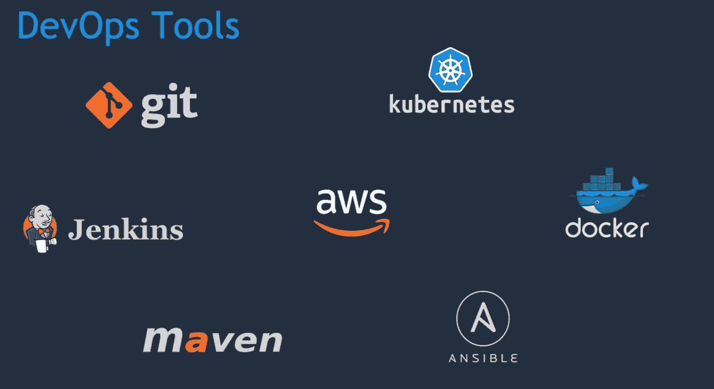
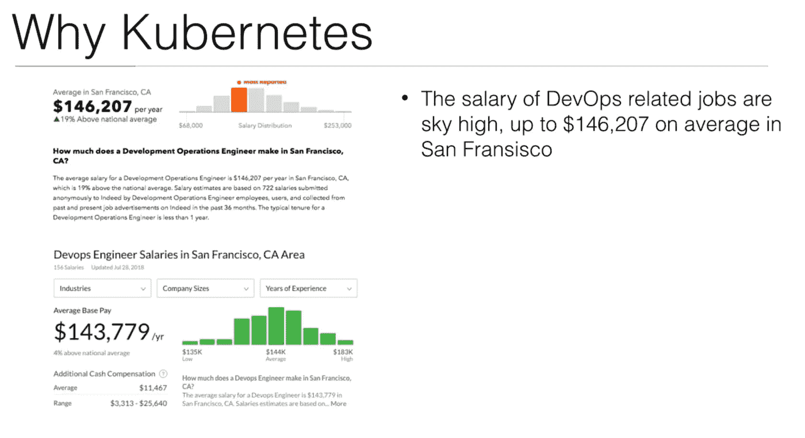
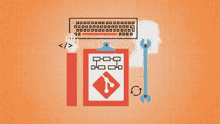
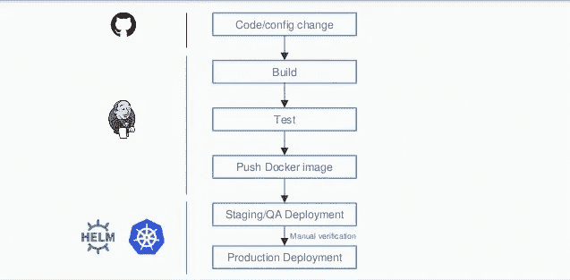

# 我最喜欢的 2023 年有经验程序员学习 DevOps 的在线课程

> 原文：<https://medium.com/javarevisited/top-10-courses-to-learn-devops-for-experienced-programmers-d93b666db151?source=collection_archive---------0----------------------->

## 为什么要学 DevOps？工资多，头疼少，开发体验更好。

DevOps 目前非常热门，有许多工作机会等待着杰出的工程师和 DevOps 专业人士。如果你是一名经验丰富的 Java 程序员，并且想成为一名 DevOps 工程师，那么你来对地方了。

> DevOps 最重要的优势是，它可以帮助您交付更好的软件，并在现代工具和自动化的帮助下，对您的环境和软件开发过程提供更多的控制。

这就是对 DevOps 专业人员的需求呈指数级增长的原因。它也是与[数据科学](http://javarevisited.blogspot.sg/2018/02/top-10-highest-paying-technical-jobs-programmers-software-developers.html#axzz58Gi5STbU)和[机器学习](https://javarevisited.blogspot.com/2018/08/top-5-tensorflow-and-machine-learning-courses-online-programmers.html)专家齐名的高薪工作之一。根据 [Glassdoor](https://medium.com/u/a39c61f8b573?source=post_page-----d93b666db151--------------------------------) 的数据，DevOps 工程师在旧金山的年薪从 10.5 万美元到平均 14.6 万美元不等。这意味着如果你正在寻求加薪或者想在你的黄金日子里通过一些令人兴奋的工作赚更多的钱，学习 DevOps 可能是一个不错的选择。

过去，我曾分享过 [**DevOps 开发人员路线图**](https://hackernoon.com/the-2018-devops-roadmap-31588d8670cb?gi=8829080e6d7d) ，它提供了成为 DevOps 工程师的完整指南和愿景，在本文中，我将分享一些成为 DevOps 工程师可以参加的最佳在线培训课程。顺便说一句，我也会得到报酬，如果你买任何课程，这不是免费从这篇文章的链接。

</hackernoon/the-2018-devops-roadmap-31588d8670cb>  

如今，学习持续集成工具如 [Jenkins](http://www.java67.com/2018/02/6-free-maven-and-jenkins-online-courses-for-java-developers.html) 和容器如 [Docker](https://javarevisited.blogspot.com/2018/02/10-free-docker-container-courses-for-Java-Developers.html) 以及通用 DevOps 技能在技术领域获得了巨大的动力。这类似于几年前的移动应用程序开发。

> 公司希望新的开发者能够管理他们 web 应用程序的整个生命周期。这意味着开发和部署您的应用程序。

为了成为一名有效的 DevOps 工程师，你必须扩展你在软件开发中使用的不同工具的知识，例如像 [Maven](http://www.java67.com/2018/02/6-free-maven-and-jenkins-online-courses-for-java-developers.html) 、 [ANT](http://javarevisited.blogspot.sg/2015/01/difference-between-maven-ant-jenkins-and-hudson.html) 和 [Gradle](https://gradle.org/) 这样的构建工具，像 [JUnit](http://www.java67.com/2018/02/5-free-eclipse-and-junit-online-courses-java-developers.html) 和 [Selenium](http://www.java67.com/2018/02/7-free-selenium-web-deriver-courses-for-java-C-developer.html) 这样的单元测试工具，像 [Docker](https://javarevisited.blogspot.com/2018/02/10-free-docker-container-courses-for-Java-Developers.html) 这样的部署工具，像 New Relic 这样的监控工具。

Chef 和 Puppet 等基础设施自动化工具，Git 和 Github 等源代码控制工具，以及 Jenkins 和 TeamCity 等持续集成工具。这些课程很好地介绍了基本的 DevOps 工具。

# 面向有经验的开发人员的 10 个最佳 DevOps 课程

为了不浪费您的时间，这里是我列出的一些学习 DevOps 的最佳课程，以及在您的软件开发和部署过程中实现自动化所需的基本工具。

## 1. [DevOps 项目:与 Jenkins Ansible Docker Kubernetes 合作的 CI/CD](https://click.linksynergy.com/deeplink?id=JVFxdTr9V80&mid=39197&murl=https%3A%2F%2Fwww.udemy.com%2Fcourse%2Fvalaxy-devops%2F)

Jenkins 可能是 DevOps 工程师最重要的工具，因为它提供了持续集成。

对于一个 [DevOps 专业人员](https://dev.to/javinpaul/the-2019-devops-engineering-roadmap-2klc)，对于持续检查、持续集成和持续部署的良好知识，以及它们之间的区别是必须的。

本课程涵盖了关于 Jenkins 的所有基础知识，并教你建立 [Jenkins 构建管道](https://javarevisited.blogspot.com/2018/09/top-5-jenkins-courses-for-java-and-DevOps-Programmers.html)所需的一切，从持续检查(构建、测试和静态分析)开始，一直到持续部署(部署到试运行和生产)。

[DevOps 项目:Jenkins Ansible Docker Kubernetes 的 CI/CD](https://click.linksynergy.com/deeplink?id=JVFxdTr9V80&mid=39197&murl=https%3A%2F%2Fwww.udemy.com%2Fcourse%2Fvalaxy-devops%2F)

## 2.[学习 DevOps:完整的 Kubernetes 课程](https://click.linksynergy.com/fs-bin/click?id=JVFxdTr9V80&subid=0&offerid=323058.1&type=10&tmpid=14538&RD_PARM1=https%3A%2F%2Fwww.udemy.com%2Flearn-devops-the-complete-kubernetes-course%2F)

十年前谷歌开始运行容器时，没人能达到这种基础设施的灵活性和效率。利用这些知识，Google 发布了一个免费的开源项目 Kubernetes。

如今 [Kubernetes](https://kubernetes.io/) 被小公司和大企业使用，他们希望获得谷歌拥有的效率和速度。本课程将教你如何在 Kubernetes 上运行、部署、管理和维护容器化的 Docker 应用程序

[学习 DevOps:完整的 Kubernetes 课程](https://click.linksynergy.com/fs-bin/click?id=JVFxdTr9V80&subid=0&offerid=323058.1&type=10&tmpid=14538&RD_PARM1=https%3A%2F%2Fwww.udemy.com%2Flearn-devops-the-complete-kubernetes-course%2F)

## 3.[学习 DevOps:持续交付更好的软件](https://click.linksynergy.com/fs-bin/click?id=JVFxdTr9V80&subid=0&offerid=323058.1&type=10&tmpid=14538&RD_PARM1=https%3A%2F%2Fwww.udemy.com%2Flearn-devops-continuously-deliver-better-software%2F)

这是 Udemy 上最完整的 DevOps 课程之一，将向您介绍 DevOps 工程师使用的大多数基本工具和技术。

本课程面向希望交付更好软件的软件工程师和系统管理员，旨在帮助您使用 [Git](https://javarevisited.blogspot.com/2019/05/10-free-websites-to-learn-git-online.html) 、floor、Chef、Ansible、 [Jenkins](https://dzone.com/articles/5-courses-to-learn-jenkins-and-ci-in-2019) 、 [Docker](https://dzone.com/articles/top-10-docker-course-for-java-developers) 和 [Kubernetes](https://www.java67.com/2019/03/5-free-devops-courses-to-learn-jenkins.html) 交付和部署软件。

## 4.[学习路径:现代德文](https://click.linksynergy.com/fs-bin/click?id=JVFxdTr9V80&subid=0&offerid=323058.1&type=10&tmpid=14538&RD_PARM1=https%3A%2F%2Fwww.udemy.com%2Fmodern-devops%2F)

DevOps 以全新的方式看待软件开发。您可以自动化和构建基础架构服务器的配置，然后解决自动化、连续部署、容器和监控方面的问题。

Git、 [Docker](http://www.java67.com/2018/02/5-free-docker-courses-for-java-and-DevOps-engineers.html) 和 Puppet 是现代 DevOps 世界中最重要的工具，本课程将向您介绍。

简而言之，这是一门非常好的入门课程，适用于任何刚接触 DevOps 领域的人，比如系统管理员、开发人员和 IT 专业人员，同时也提供了重要的 DevOps 工具的概述。

<https://click.linksynergy.com/fs-bin/click?id=JVFxdTr9V80&subid=0&offerid=323058.1&type=10&tmpid=14538&RD_PARM1=https%3A%2F%2Fwww.udemy.com%2Fmodern-devops%2F>  

## [**5。DevOps 和开发者的码头工人技术**](https://click.linksynergy.com/fs-bin/click?id=JVFxdTr9V80&subid=0&offerid=323058.1&type=10&tmpid=14538&RD_PARM1=https%3A%2F%2Fwww.udemy.com%2Fdocker-tutorial-for-devops-run-docker-containers%2F)

Docker 是 DevOps 的重要技术之一。它允许您将组件捆绑在一起，并将它们部署在任何平台上的容器上，比如 Linux 或 Windows。

本课程涵盖了 [Docker 容器](https://dev.to/javinpaul/10-free-courses-to-learn-docker-in-2019-56n0)的所有基础知识，并教你关于用 Docker 软件开发和部署现代应用程序所需要知道的一切。

<https://click.linksynergy.com/fs-bin/click?id=JVFxdTr9V80&subid=0&offerid=323058.1&type=10&tmpid=14538&RD_PARM1=https%3A%2F%2Fwww.udemy.com%2Fdocker-tutorial-for-devops-run-docker-containers%2F>  

## 6.[**Docker for devo PS 课程:从开发到生产**](https://click.linksynergy.com/fs-bin/click?id=JVFxdTr9V80&subid=0&offerid=323058.1&type=10&tmpid=14538&RD_PARM1=https%3A%2F%2Fwww.udemy.com%2Fthe-docker-for-devops-course-from-development-to-production%2F)

本课程将向您展示使用 Docker 可以构建什么以及如何构建，同时您将学习 Docker 的基础知识！

我们将一起完成多服务 Flask 和 [Ruby on Rails](http://www.java67.com/2018/02/5-free-ruby-and-rails-courses-to-learn-online.html) 应用程序的开发和部署。

## 7. [**学习 DevOps:使用 Terraform 实现基础设施自动化**](https://click.linksynergy.com/fs-bin/click?id=JVFxdTr9V80&subid=0&offerid=323058.1&type=10&tmpid=14538&RD_PARM1=https%3A%2F%2Fwww.udemy.com%2Flearn-devops-infrastructure-automation-with-terraform%2F)

基础设施自动化是 DevOps 的重要组成部分，Ansible、Chef、Puppet 等工具很有帮助，但 Terraform 最近很受欢迎，如果你正在或即将进入 Ops / DevOps 角色，它是你需要掌握的工具。

Terraform 从相同的原则出发，基础设施即代码，但侧重于基础设施本身的自动化。您的整个云基础架构(实例、卷、网络、IPs)都可以用 terraform 来描述。

在本课程中，您将了解如何通过 terraforming 以及 [AWS](http://www.java67.com/2018/05/top-5-amazon-web-services-or-aws-courses-to-learn-online.html) 、Packer、 [Docker](https://hackernoon.com/10-free-courses-to-learn-docker-for-programmers-and-devops-engineers-7ff2781fd6e0) 、ECR、ECS 和 Jenkins 实现基础设施自动化。

## 8. [**DevOps 与 AWS CodePipeline，Jenkins 与 AWS CodeDeploy**](https://click.linksynergy.com/fs-bin/click?id=JVFxdTr9V80&subid=0&offerid=323058.1&type=10&tmpid=14538&RD_PARM1=https%3A%2F%2Fwww.udemy.com%2Fci-and-cd-with-aws-codepipeline-jenkins-and-aws-codedeploy%2F)

如果您对什么是持续集成(CI)、持续交付和持续部署(CD)以及如何使用 Amazon Web Service(例如 AWS 和 Jenkins)进行开发运维感到困惑，那么这是适合您的课程。

在本课程中，您将学习基本的 DevOps 技能，以及在 AWS 云中的持续集成和持续交付。

<https://click.linksynergy.com/fs-bin/click?id=JVFxdTr9V80&subid=0&offerid=323058.1&type=10&tmpid=14538&RD_PARM1=https%3A%2F%2Fwww.udemy.com%2Fci-and-cd-with-aws-codepipeline-jenkins-and-aws-codedeploy%2F>  

## 9 [**DevOps: CI/CD 与 Jenkins pipelines、Maven、Gradle**](https://click.linksynergy.com/fs-bin/click?id=JVFxdTr9V80&subid=0&offerid=323058.1&type=10&tmpid=14538&RD_PARM1=https%3A%2F%2Fwww.udemy.com%2Fdevops-and-continuous-integration-with-jenkins-pipelines%2F)

这个在线 DevOps 课程将教你如何使用 Jenkins 和它的许多插件来构建复杂的持续集成和持续交付管道。尤其是管道插件。

本课程旨在向您介绍 Jenkins 的来龙去脉以及如何设置 DevOps 管道，即使您几乎没有这方面的经验，也可以帮助您实施这些 DevOps 实践，从而简化您的开发流程。

简而言之，用 Java、Gradle、Maven、Artifactory 和 Sqitch 构建持续集成、持续交付和 DevOps 管道的绝佳课程。

<https://www.udemy.com/course/devops-and-continuous-integration-with-jenkins-pipelines/?LSNPUBID=JVFxdTr9V80&ranEAID=JVFxdTr9V80&ranMID=39197&ranSiteID=JVFxdTr9V80-BWLS9C_3owGMgijI4VkSKA>  

## 10. [**完成与 Docker、Jenkins、GIT、vagger、Maven 的 devo PS**](https://click.linksynergy.com/fs-bin/click?id=JVFxdTr9V80&subid=0&offerid=323058.1&type=10&tmpid=14538&RD_PARM1=https%3A%2F%2Fwww.udemy.com%2Fdevops-docker-complete-guide-hands-on-with-practical%2F)

如果您正在寻找一门既能向您解释开发运维工程师的角色，又能提供基本开发运维工具实践经验的开发运维实践课程，那么这就是适合您的课程。

提供了基本 DevOps 技术的完整教程。您将通过跟随实践指南学习 Docker Mastery、Jenkins、GIT、流浪者和 Maven。

<https://www.udemy.com/course/devops-docker-complete-guide-hands-on-with-practical/?LSNPUBID=JVFxdTr9V80&ranEAID=JVFxdTr9V80&ranMID=39197&ranSiteID=JVFxdTr9V80-ponvoiWJ7OXgITazmtwwfw>  

以上就是 2023 年学习 DevOps 成为 DevOps 工程师的一些**最好的课程。正如我所说，对优秀 DevOps 工程师和软件开发人员的需求呈指数级增长，而市场上没有足够的 DevOps 专业人员来支持这种需求。

这意味着这是一个学习 DevOps 并进入这份更负责任、高薪和令人兴奋的工作的好机会。DevOps 引擎的平均利润从**的 12 万美元**到**的 15 万美元**不等。如果你想在 2023 年成为一名 DevOps 工程师，这些课程是一个很好的起点。

其他**对 DevOps 工程师有用的资源**
[2023 devo PS 开发者路线图](https://javarevisited.blogspot.com/2018/09/the-2018-devops-roadmap-your-guide-to-become-DevOps-Engineer.html)
[10 门免费课程学习 Docker](https://hackernoon.com/10-free-courses-to-learn-docker-for-programmers-and-devops-engineers-7ff2781fd6e0)
[5 门免费课程学习 Kubernetes](https://javarevisited.blogspot.com/2019/01/top-5-free-kubernetes-courses-for-DevOps-Engineer.html)
[10 门免费课程学习 Maven、Jenkins 和 Docker](/javarevisited/top-10-free-courses-to-learn-maven-jenkins-and-docker-for-java-developers-51fa7a1e66f6) [Java 开发者学习 Jenkins 的前 5 门课程](https://javarevisited.blogspot.com/2018/09/top-5-jenkins-courses-for-java-and-DevOps-Programmers.html)
[Top](https://www.java67.com/2019/04/top-5-courses-to-learn-git-and-github.html)**

感谢您阅读本文。如果你喜欢这些 DevOps 课程，请与你的朋友和同事分享。如果您有任何问题或反馈，请留言。