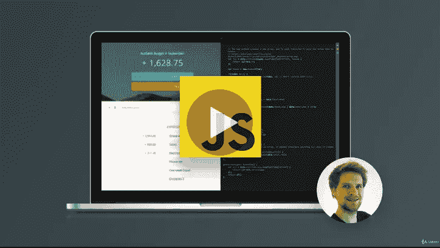
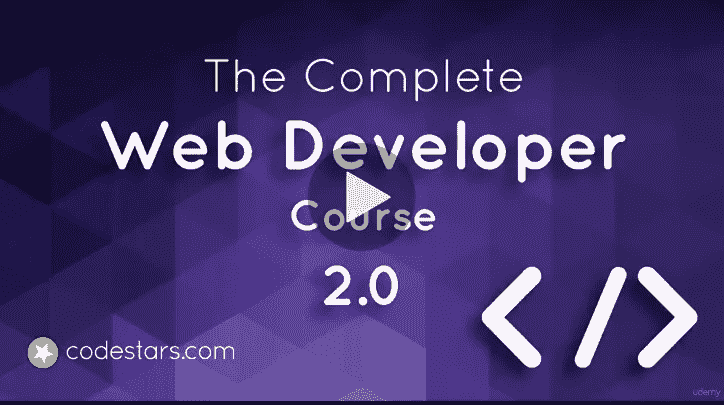
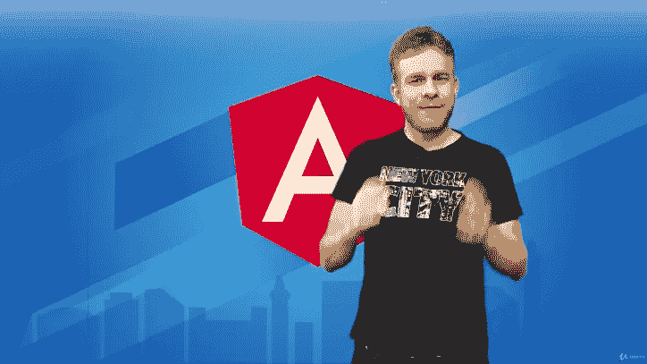
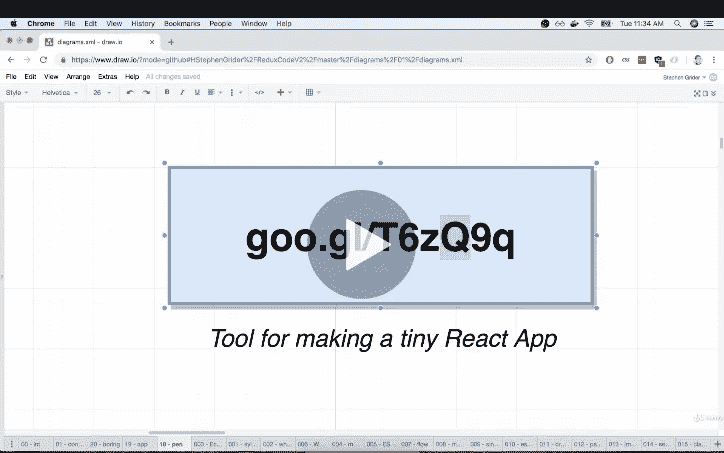

# 2022 年学习前端和后端开发的 10 大课程

> 原文：<https://medium.com/javarevisited/top-10-courses-to-learn-frontend-and-backend-development-in-2020-710d2d57e008?source=collection_archive---------0----------------------->

费伦茨·阿尔马西在 [Unsplash](https://unsplash.com?utm_source=medium&utm_medium=referral) 上的照片

你好伙计们，如果你对学习网页开发感兴趣，或者想在 2022 年成为一名网页开发者，那么你来对地方了。在过去，我已经分享了最好的课程给 [**学习 HTML**](/javarevisited/10-best-html-and-css-courses-for-beginners-in-2021-6757eec00032) ， [**CSS**](/javarevisited/10-best-css-online-courses-for-beginners-and-experienced-developers-54aa2e8c0253) ， [**JavasScript**](/javarevisited/10-best-online-courses-to-learn-javascript-in-2020-af5ed0801645) 和 [**Angular**](/javarevisited/10-courses-to-learn-angular-for-web-development-6da1bd2856dc) 在这篇文章中，我将分享一些我最喜欢的在线课程，你可以参加这些课程来深入学习 Web 开发。

但是，在此之前，让我祝贺你做出了一个了不起的决定。Web 开发是一个令人兴奋的领域，开发者总是受欢迎的。

一旦你学会了如何开发网站，你不仅可以成为一名网站开发人员，还可以成为一名自由职业者，甚至可以为你的创业公司建立一个网站。

学习 [Web 开发](https://dev.to/javinpaul/top-6-courses-to-learn-web-development-best-of-lot-2fae)本身并不难，但是网上的资源太多了，一不小心就很容易迷路，而这正是我可以在你的旅途中指导和帮助你的地方。

我热爱学习。在我一生中的大部分时间里，我都是通过读书来学习，但是自从我在 [Udemy](https://click.linksynergy.com/fs-bin/click?id=JVFxdTr9V80&offerid=323058.9409&type=3&subid=0) 和 [Pluralsight](http://pluralsight.pxf.io/c/1193463/424552/7490?u=https%3A%2F%2Fwww.pluralsight.com%2Flearn) 上看到在线课程后，我大部分时间都是通过在线课程来学习。它们是开始使用新技术的最佳方式，可以让您立即投入使用。

我最近一直在分享一些很好的在线课程，学习新的技术、框架和库。在我的上一篇文章中，我介绍了我在 2022 年 学习 DevOps 的 [**前 10 门课程。今天，我将为初学者列出六个顶级的 web 开发课程。**](https://dev.to/javinpaul/top-10-devops-training-courses-for-programmers-and-software-developers-195n)

顺便说一下，谈到 web 开发，在过去的五到十年里，事情发生了很大的变化。仅仅知道 [HTML](http://www.java67.com/2018/02/5-free-html-and-css-courses-to-learn-web-development.html) 、 [CSS](https://www.java67.com/2019/01/5-free-bootstrap-course-to-learn-online.html) 和 [JavaScript](https://javarevisited.blogspot.com/2018/06/top-10-courses-to-learn-javascript-in.html) 就够了的日子已经一去不复返了。它们仍然是必要的，但还不够，你还需要学习现代 web 开发框架，如 [React](/@javinpaul/top-5-courses-to-learn-react-js-in-2019-best-of-lot-fa02cd96cdf0) 、 [Angular](https://dzone.com/articles/top-5-angular-2-courses-for-web-developers) 和 [Bootstrap](https://www.java67.com/2019/01/5-free-bootstrap-course-to-learn-online.html) 来开发现代 web 应用程序。

这些框架使得 web 开发更加结构化和有组织。它们还允许你从一个单页的 web 应用程序构建到成熟的真实世界的 web 应用程序，如脸书、Airbnb 或优步。

如果你有兴趣学习像 [React](/@javinpaul/top-5-courses-to-learn-react-js-in-2019-best-of-lot-fa02cd96cdf0) 、 [Spring 微服务](https://dev.to/javinpaul/top-10-courses-to-learn-spring-boot-and-microservices-for-java-programmers-3hjg)、 [Redux](https://javarevisited.blogspot.com/2018/08/top-5-react-js-and-redux-courses-to-learn-online.html) 、 [Angular](https://javarevisited.blogspot.com/2018/06/5-best-courses-to-learn-angular.html) 、 [Vue.js](https://javarevisited.blogspot.com/2019/08/top-5-online-courses-to-learn-vue.js-best.html) 这样的前沿技术，那么这些 web 开发课程是很好的开始。通过学习这些课程，您将接触到许多客户端和服务器端技术。

如果你经常阅读我的文章，那么你可能知道我学习新技术或框架的三点公式。我过去曾经学习过许多技术，如 [Git](http://javarevisited.blogspot.sg/2018/01/5-free-git-courses-for-programmers-to-learn-online.html) 、[数据结构和算法](http://javarevisited.blogspot.sg/2018/01/top-5-free-data-structure-and-algorithm-courses-java--c-programmers.html)和 [Hibernate](http://javarevisited.blogspot.sg/2018/01/top-5-hibernate-and-jpa-courses-for-java-programmers-learn-online.html) ，现在我正在使用这种技术学习 [Kotlin](http://javarevisited.blogspot.sg/2018/02/5-courses-to-learn-kotlin-programming-java-android.html#axzz56R4AatoQ) 、 [Docker](http://javarevisited.blogspot.sg/2018/02/10-free-docker-container-courses-for-Java-Developers.html) 和 [Android](http://javarevisited.blogspot.sg/2017/12/top-5-android-online-training-courses-for-Java-developers.html) 以在 2022 年提升我的技术技能。

你通常应该从一个好的在线课程开始，这将帮助你理解最重要的部分并获得一些实践经验，比如如何设置你的开发环境和构建一些简单的应用程序。

一旦你理解了基础知识，你就可以通过阅读一本书来更全面地了解在线课程中涉及的所有概念以及根本没有涉及的主题。

完成本书和在线课程后，您应该能够开发一个真实世界的应用程序来测试您的知识并填补您学习中的空白。

# 2022 年学习前端+后端 Web 开发的 10 门最佳课程

无论如何，这是我列出的 2022 年你可以学习 web 开发的一些最好的在线课程。这些都是很棒的课程，教你很多基本的 web 开发技术，如 [HTML](/javarevisited/5-free-html-and-css-courses-to-learn-front-end-web-development-online-8b04517c6ecb?source=collection_home---4------0-----------------------) 、 [CSS](/javarevisited/top-10-free-courses-to-learn-html-5-css-3-and-web-development-872d62d97a97) 和 [JavaScript、](http://www.java67.com/2018/07/top-5-free-javascript-books-download-pdf-read-online.html)以及你将用来开发 web 应用的框架，如 [React](https://hackernoon.com/top-5-react-native-courses-for-mobile-application-developers-b82febdf8a46) 、 [Angular](https://hackernoon.com/top-10-angular-courses-tutorials-and-books-for-web-developers-e8a8e2c490c2) 和 Bootstrap。

## 1.T [他 2022 年完成网页开发者:零到精通](https://academy.zerotomastery.io/p/complete-web-developer-zero-to-mastery?affcode=441520_zytgk2dn)

这是 2022 年学习 web 开发的最新课程之一。你不仅会学习编码，还会在 2022 年成为一名拥有 HTML、CSS、Javascript、React、Node.js、机器学习&更多的 Web 开发者！。

这也是获得 Web 开发人员、软件开发人员、前端开发人员、Javascript 开发人员和全栈开发人员等工作所需的所有技能的最佳课程之一。

该课程最大的优点是它遵循基于项目的学习方式，并且**您将构建 10 多个真实世界的 Web 开发项目**您可以展示并添加到您的个人 Github repo 中。您还将学习编写干净、高性能、无错误代码的最佳实践。

该课程非常完整，并更新了 ES6/ES7，这是每个 web 开发人员在 2022 年应该学习的内容。唯一的一点是，这个课程更有挑战性(在我看来)，但同样完全值得

> 这里是查看课程的链接—[**2022 年的完全网络开发者:零到精通**](https://academy.zerotomastery.io/p/complete-web-developer-zero-to-mastery?affcode=441520_zytgk2dn)

顺便说一句，你需要一个 [**ZTM 会员**](https://academy.zerotomastery.io/a/aff_c0gnlvf7/external?affcode=441520_zytgk2dn) 来观看这个课程，这个课程每月花费大约 39 美元，但也提供了许多超级吸引人和有用的课程，如他的 [*JavaScript Web 项目:20 个项目来建立你的投资组合*](https://academy.zerotomastery.io/p/javascript-projects?affcode=441520_zytgk2dn) 课程。您还可以使用我的代码 **FRIENDS10** 获得您选择的任何套餐的 10%折扣。

<https://academy.zerotomastery.io/a/aff_c0gnlvf7/external?affcode=441520_zytgk2dn>  

## 2.[完整的 JavaScript 课程:构建真实世界的项目](https://click.linksynergy.com/fs-bin/click?id=JVFxdTr9V80&subid=0&offerid=323058.1&type=10&tmpid=14538&RD_PARM1=https%3A%2F%2Fwww.udemy.com%2Fthe-complete-javascript-course%2F)

JavaScript 是 web 开发人员最重要的技术之一，这就是为什么我在这个列表中包含了一个[完整的 JavaScript 课程]。总之，这是深入学习 JavaScript 的 [**最佳课程之一**](https://click.linksynergy.com/fs-bin/click?id=JVFxdTr9V80&subid=0&offerid=323058.1&type=10&tmpid=14538&RD_PARM1=https%3A%2F%2Fwww.udemy.com%2Fthe-complete-javascript-course%2F) 。

JavaScript 最初是一个纯粹的客户端解决方案，现在允许您在不使用任何其他技术的情况下构建一个完整的应用程序。像 [Node.js](http://javarevisited.blogspot.sg/2018/01/top-5-nodejs-and-express-js-online-courses-for-web-developers.html) 这样的框架使得使用 JavaScript 创建服务器端应用程序变得很容易。

您将学习编码和调试技术，同时还将学习如何使用模块和函数来组织和构建代码。

> 这里是查看课程的链接— [完整的 JavaScript 课程:构建真实世界的项目](https://click.linksynergy.com/fs-bin/click?id=JVFxdTr9V80&subid=0&offerid=323058.1&type=10&tmpid=14538&RD_PARM1=https%3A%2F%2Fwww.udemy.com%2Fthe-complete-javascript-course%2F)

## 3.[完整的 Web 开发者课程 2.0](https://click.linksynergy.com/fs-bin/click?id=JVFxdTr9V80&subid=0&offerid=323058.1&type=10&tmpid=14538&RD_PARM1=https%3A%2F%2Fwww.udemy.com%2Fthe-complete-web-developer-course-2%2F)

这又是一门优秀的[动手 web 开发课程]，你将通过使用 HTML、CSS、Javascript、 [PHP](http://www.java67.com/2018/02/5-free-php-and-mysql-courses-for-web-developers.html) 、 [Python](http://www.java67.com/2018/02/5-free-python-online-courses-for-beginners.html) 、 [MySQL](http://www.java67.com/2018/02/5-free-database-and-sql-query-courses-programmers.html) 等构建网站和移动应用来学习关键的 web 开发技术。

您不仅会学到 HTML、CSS 和 JavaScript 等基础技术，还会学到更高级的技术，如 jQuery 和 Bootstrap。

这个[课程](https://click.linksynergy.com/fs-bin/click?id=JVFxdTr9V80&subid=0&offerid=323058.1&type=10&tmpid=14538&RD_PARM1=https%3A%2F%2Fwww.udemy.com%2Fthe-complete-web-developer-course-2%2F)教你结束开发，比如编写客户端和服务器端代码。您还将学习如何使用更高级的技术来构建自己的响应网站，如 [jQuery](https://hackernoon.com/top-5-free-jquery-courses-for-web-developers-best-of-lot-9f65a1ff25b6) 、 [PHP](https://hackernoon.com/5-free-php-and-mysql-courses-to-learn-web-development-63836cd3e587) 7、 [MySQL 5](https://javarevisited.blogspot.sg/2018/05/top-5-mysql-courses-to-learn-online.html) 和 Twitter [Bootstrap](http://www.java67.com/2019/01/5-free-bootstrap-course-to-learn-online.html) 。

> 这里是查看课程的链接— [完整的 Web 开发者课程 2.0](https://click.linksynergy.com/fs-bin/click?id=JVFxdTr9V80&subid=0&offerid=323058.1&type=10&tmpid=14538&RD_PARM1=https%3A%2F%2Fwww.udemy.com%2Fthe-complete-web-developer-course-2%2F)

## 4.柯尔特·斯蒂尔的网络开发者训练营

如果你只能买一门学习网页开发的课程，那就是它了。本课程将教授许多关键的 web 开发技术，如 HTML、CSS、JS、[节点](http://javarevisited.blogspot.sg/2018/01/top-5-nodejs-and-express-js-online-courses-for-web-developers.html)等。

[课程](https://click.linksynergy.com/fs-bin/click?id=JVFxdTr9V80&subid=0&offerid=323058.1&type=10&tmpid=14538&RD_PARM1=https%3A%2F%2Fwww.udemy.com%2Fthe-web-developer-bootcamp%2F)按照训练营的风格设计，由一名前训练营教练负责。你知道这些训练营有多贵，要花 10，000 到 20，000 美元，而你只花 10 美元就能买到，很神奇吧。

本课程的结构和呈现方式也是独一无二的。这不像其他在线课程，你只是看着教师编码。

它与理论、会议、练习、演示和研究任务的结合更具互动性。简而言之，对于想要从头开始学习 web 开发的初学者来说，这是最好的课程。

> 以下是查看课程的链接—[Web 开发人员训练营](https://click.linksynergy.com/fs-bin/click?id=JVFxdTr9V80&subid=0&offerid=323058.1&type=10&tmpid=14538&RD_PARM1=https%3A%2F%2Fwww.udemy.com%2Fthe-web-developer-bootcamp%2F)

## 5.[高级 Web 开发人员训练营](https://click.linksynergy.com/deeplink?id=JVFxdTr9V80&mid=39197&murl=https%3A%2F%2Fwww.udemy.com%2Fcourse%2Fthe-advanced-web-developer-bootcamp%2F)

这是[之前课程]的下一部分，作者和前训练营教练 Colt _ Steele 将教你先进的 web 开发技术，如[React 16](https://hackernoon.com/the-2018-react-js-roadmap-4d0a43814c02)、[Redux](https://javarevisited.blogspot.com/2018/08/top-5-react-js-and-redux-courses-to-learn-online.html)、D3、ES2015、测试、CSS Flexbox、动画、SVG 和 AJAX。

这门课程最棒的部分是你将使用尖端技术开发真正的网络应用。

您将构建十多个项目，并有几十个代码挑战和解决方案，以理解材料并学习如何应用它。

简而言之，这是一门完美的课程，适合那些对 [HTML](https://hackernoon.com/top-5-free-online-courses-to-learn-html-css-web-development-in-2020-ae8e7466dfa7) 、 [CSS](http://www.java67.com/2018/02/5-free-html-and-css-courses-to-learn-web-development.html) 和 [JavaScript](http://javarevisited.blogspot.sg/2017/02/top-5-javascript-books-to-learn-best-of-lot-must-read.html#axzz57KmATcMj) 有基本了解，并希望探索更先进的概念和技术以在职业生涯中获得更大成功的 web 开发人员

> 以下是查看课程的链接— [高级 Web 开发人员训练营](https://click.linksynergy.com/deeplink?id=JVFxdTr9V80&mid=39197&murl=https%3A%2F%2Fwww.udemy.com%2Fcourse%2Fthe-advanced-web-developer-bootcamp%2F)

## 6.[角度—完整指南](https://click.linksynergy.com/fs-bin/click?id=JVFxdTr9V80&subid=0&offerid=323058.1&type=10&tmpid=14538&RD_PARM1=https%3A%2F%2Fwww.udemy.com%2Fthe-complete-guide-to-angular-2%2F)

【Angular 完全指南】会教你关于 Angular 需要知道的一切。如果某个东西有谷歌做后盾，不知道太重要了。

这门[课程](https://click.linksynergy.com/fs-bin/click?id=JVFxdTr9V80&subid=0&offerid=323058.1&type=10&tmpid=14538&RD_PARM1=https%3A%2F%2Fwww.udemy.com%2Fthe-complete-guide-to-angular-2%2F)将教你如何掌握 [Angular](http://www.java67.com/2018/01/top-5-free-angular-js-online-courses-for-web-developers.html) (Angular 2+，包括 Angular 5)，并使用 Angular.js 的继任者构建令人敬畏的反应式 web 应用，尽管你不需要了解 Angular 1 或 Angular 2，但课程从零开始。

从设置到部署，本课程涵盖了所有内容！您将了解组件、指令、服务、表单、HTTP 访问、身份验证、使用模块和离线编译优化 Angular 应用程序等等。

完成[这门课程](https://click.linksynergy.com/fs-bin/click?id=JVFxdTr9V80&subid=0&offerid=323058.1&type=10&tmpid=14538&RD_PARM1=https%3A%2F%2Fwww.udemy.com%2Fthe-complete-guide-to-angular-2%2F)后，您还将学习如何部署应用程序。

> 这里是查看课程的链接— [Angular —完整指南](https://click.linksynergy.com/fs-bin/click?id=JVFxdTr9V80&subid=0&offerid=323058.1&type=10&tmpid=14538&RD_PARM1=https%3A%2F%2Fwww.udemy.com%2Fthe-complete-guide-to-angular-2%2F)

## 7.安德鲁·米德的网络开发课程

除了这些课程，我还喜欢 Andrew Mead 在 Udemy 上的 4 门课程，[现代 JavaScript Bootcamp](https://click.linksynergy.com/deeplink?id=JVFxdTr9V80&mid=39197&murl=https%3A%2F%2Fwww.udemy.com%2Fcourse%2Fmodern-javascript%2F) ，[完整的 Node.js 开发者课程](https://click.linksynergy.com/deeplink?id=JVFxdTr9V80&mid=39197&murl=https%3A%2F%2Fwww.udemy.com%2Fcourse%2Fthe-complete-nodejs-developer-course-2%2F)，[现代 GraphQL Bootcamp](https://click.linksynergy.com/deeplink?id=JVFxdTr9V80&mid=39197&murl=https%3A%2F%2Fwww.udemy.com%2Fcourse%2Fgraphql-bootcamp%2F) ，以及[完整的 React 开发者课程](https://click.linksynergy.com/deeplink?id=JVFxdTr9V80&mid=39197&murl=https%3A%2F%2Fwww.udemy.com%2Fcourse%2Freact-2nd-edition%2F)。他在 Youtube 上还有一个免费的了不起的盖茨比训练营课程，4.5 小时。

安德鲁·米德在解释事情方面做得很好，你会学到所有你需要的技能，在课程结束后继续你自己的项目。

> 这里是查看课程的链接— [完整的 Node.js 开发者课程](https://click.linksynergy.com/deeplink?id=JVFxdTr9V80&mid=39197&murl=https%3A%2F%2Fwww.udemy.com%2Fcourse%2Fthe-complete-nodejs-developer-course-2%2F)

## 8.[Angela Yu 完成的 2022 年网络开发训练营](https://click.linksynergy.com/deeplink?id=JVFxdTr9V80&mid=39197&murl=https%3A%2F%2Fwww.udemy.com%2Fcourse%2Fthe-complete-web-development-bootcamp%2F)

当我选择网络课程学习 Web 开发之类的东西时，导师可能是最重要的因素。如果你能同意老师的观点，能理解他们的解释方式，那么你应该参加这个课程。

谈论这门课程[安吉拉·于](https://medium.com/u/5a5584f78d27?source=post_page-----710d2d57e008--------------------------------)是一位天生的教练，在谈到训练营式教学时，她可能是 Udemy 中最好的。参加了他的 iOS 和 Swift Bootcamp 课程后，我参加了她的 web 开发课程，我对课程中如此清晰和明确的目标感到惊讶。

这是一个完整的实践课程，你将通过构建应用程序来学习，Angela 解释了用于构建这些应用程序的每一个概念。我向任何喜欢基于项目的学习的人强烈推荐这门课程。

> 这里是查看课程的链接—[2022 年网络开发训练营](https://click.linksynergy.com/deeplink?id=JVFxdTr9V80&mid=39197&murl=https%3A%2F%2Fwww.udemy.com%2Fcourse%2Fthe-complete-web-development-bootcamp%2F)

## 9.[现代与 Redux b](https://click.linksynergy.com/deeplink?id=JVFxdTr9V80&mid=39197&murl=https%3A%2F%2Fwww.udemy.com%2Fcourse%2Freact-redux%2F) y [斯蒂芬·格里德](https://medium.com/u/d058882d8cd2?source=post_page-----710d2d57e008--------------------------------)

React 是前端开发人员最重要的技能之一，如果你想学习 React，那么这可能是最好的在线课程。

在本课程中，Stephen 详细介绍了他的教学风格，即使用图形来简化 redux 这样的复杂概念..他绝大多数视频都很短

我强烈推荐本课程，因为它提供了高质量的图表，有助于解释复杂的 react-redux 主题和对现代 react 概念的深入介绍

> 以下是查看课程的链接— [Modern React with Redux](https://click.linksynergy.com/deeplink?id=JVFxdTr9V80&mid=39197&murl=https%3A%2F%2Fwww.udemy.com%2Fcourse%2Freact-redux%2F)

## 10.[用 HTML5 和 CSS3 建立反应灵敏的真实世界网站](https://click.linksynergy.com/deeplink?id=JVFxdTr9V80&mid=39197&murl=https%3A%2F%2Fwww.udemy.com%2Fcourse%2Fdesign-and-develop-a-killer-website-with-html5-and-css3%2F)作者[乔纳斯·施梅德曼](https://medium.com/u/1144650514a7?source=post_page-----710d2d57e008--------------------------------)

这是 Udemy 中学习 HTML 5 和 CSS3 的最佳课程之一，从它的社交证明中也可以明显看出。数千名学生平均给这门课程打了 4.6 分，这是一个不小的成绩，清楚地表明了这门课程的质量。从理论和动手实践的角度来看，这门课程都非常出色，因为你将参与一个大型项目，这个项目将教会你入门 HTML 5 和 CSS 3 所需的一切。

导师 Jonas Schmemann 还免费提供了他的电子书*《html 5 和 CSS3 网页设计与开发最佳资源》*，你可以把它作为学习的补充资源。

[Jonas Schmedtmann](https://medium.com/u/1144650514a7?source=post_page-----710d2d57e008--------------------------------) 也是 Udemy 最好的导师之一，他的课程质量一流。我第一次接触 Jonas 是通过他的综合 [**完整的 JavaScript 课程 2022**](https://click.linksynergy.com/deeplink?id=JVFxdTr9V80&mid=39197&murl=https%3A%2F%2Fwww.udemy.com%2Fcourse%2Fthe-complete-javascript-course%2F) ，这是另一门侧重于构建真实项目而不仅仅是教授概念的实践课程。如果你想在学习 HTML 5 和 CSS 的同时学习 JavaScript，我也强烈推荐那个课程。

> 这里是查看课程的链接— [用 HTML5 和 CSS3 构建响应性真实世界网站](https://click.linksynergy.com/deeplink?id=JVFxdTr9V80&mid=39197&murl=https%3A%2F%2Fwww.udemy.com%2Fcourse%2Fdesign-and-develop-a-killer-website-with-html5-and-css3%2F)

以上是关于深入学习前端和后端 Web 开发的**最佳课程。**你不需要看完所有的课程，但我建议你先看他们的预告片，然后选择你最能与老师沟通的课程。我个人喜欢柯尔特·斯蒂尔的教学风格，因此，我最喜欢他的课程。

您可能想探索的其他**编程资源文章**

*   [完整的网络开发者路线图](https://dev.to/javinpaul/the-2019-web-development-frontend-backend-roadmap-4le2)
*   [2022 年学习 React Native 的 5 门课程](http://javarevisited.blogspot.sg/2018/02/5-react-native-courses-to-learn-mobile-development-using-JavaScript.html)
*   [学习大数据和 Apache Spark 的 5 门课程](http://javarevisited.blogspot.com/2017/12/top-5-courses-to-learn-big-data-and.html)
*   [免费学习 JavaScript 的 10 个地方](https://hackernoon.com/10-websites-to-learn-javascript-for-beginners-31e13bbdbb5c)
*   [Java 开发者应该学习的 10 个 Web 开发框架](https://dev.to/javinpaul/10-frameworks-java-and-web-developers-can-learn-in-2019-17ke)
*   [完整的 React 开发者路线图](https://hackernoon.com/the-2018-react-js-roadmap-4d0a43814c02)
*   [初学者学习 GraphQL 的 5 大课程](https://hackernoon.com/top-5-graphql-courses-for-beginners-26cad52bcd3e)

感谢您阅读本文。如果你喜欢这些网络开发课程，请与你的朋友和同事分享。如果您有任何问题或反馈，请留言。

</hackernoon/the-2019-web-developer-roadmap-ab89ac3c380e>  </javarevisited/top-15-online-courses-to-learn-docker-kubernetes-and-aws-for-fullstack-developers-and-devops-d8cc4f16e773> 