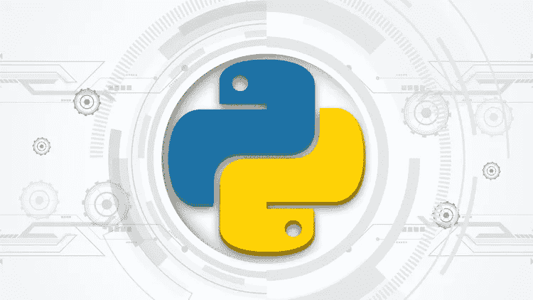
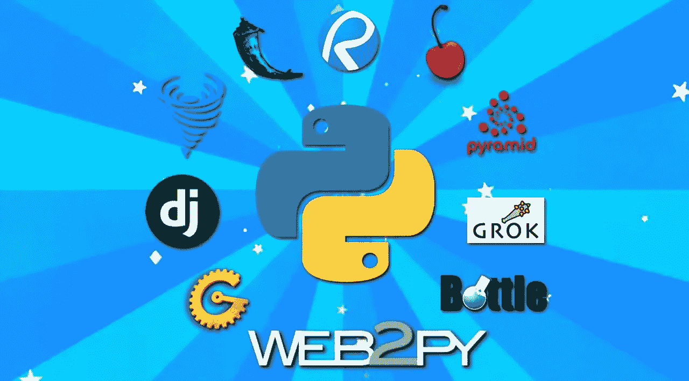
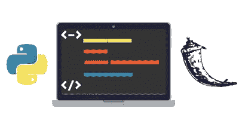
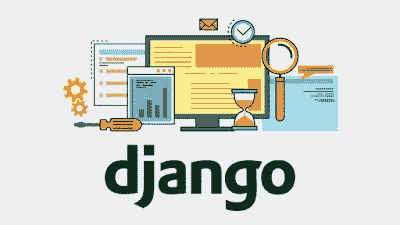
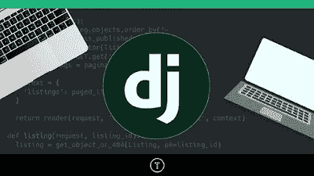
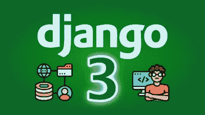

# 2023 年学习 Python 进行 Web 开发的 10 大课程——最佳课程

> 原文：<https://medium.com/javarevisited/top-10-courses-to-learn-python-for-web-development-in-2020-best-of-lot-efe11fb6d212?source=collection_archive---------0----------------------->

## Udemy、Pluralsight、Coursera 和 freeCodecamp 的最佳 Python、Django 和 Flask 在线课程，用于学习 Web 开发的 Python

克里斯蒂娜@ wocintechchat.com 在 [Unsplash](https://unsplash.com?utm_source=medium&utm_medium=referral) 上的照片

H 伙计们，在当今高度互联的数字世界中，网络开发是软件工程师最重要的技能之一。如果你环顾四周，像谷歌、亚马逊、脸书这样价值数十亿美元的企业都是网络应用，它们是最成功的公司。

对 web 开发人员有着巨大的需求，特别是拥有 Python 和 T2 JavaScript 技能的 Web 开发人员。在这篇文章中，你将了解使用 Python 编程语言成为 Web 开发人员的最佳在线课程，Python 编程语言是最流行和最通用的编程语言之一。

web 开发构建网站或 Web 应用程序的科学，客户端和服务器端编程，以及使用不同编程语言的许多框架的 Web 服务器配置，例如 [PHP](/javarevisited/top-10-free-courses-to-learn-php-and-mysql-for-web-development-e96e69982675) 、 [Javascript](/javarevisited/12-free-courses-to-learn-javascript-and-es6-for-beginners-and-experienced-developers-aa35874c9a32) 、 [Python](/javarevisited/10-free-python-tutorials-and-courses-from-google-microsoft-and-coursera-for-beginners-96b9ad20b4e6) 、 [Ruby](/@javinpaul/top-5-free-courses-to-learn-ruby-and-rails-for-beginners-best-of-lot-e149fe03c964) ，以及更多您可以探索的内容。

网页开发也是最快的领域之一，你可以在不到一年的时间里学习并获得职业生涯，并获得平均年薪超过 73，000 美元的工作，预计将成为未来最受欢迎的工作之一，从 2018 年到 2028 年增长 13%。

在这篇文章中，我们将看到一些课程，教你如何成为一名使用 python 编程语言的 web 开发人员，这些课程的好处是让你做好准备在这个领域找到一份工作，而不需要在大学学习几年并获得学位才能找到工作，因为 [Web 开发工作](/javarevisited/7-free-online-courses-to-become-a-web-designer-and-frontend-developer-in-2020-dca73bc7fdc4)需要的经验不仅仅是学位。

# 2023 年 10 大最佳 Python Web 开发课程

在不浪费你更多时间的情况下，这里列出了学习 Web 开发 Python 的最佳课程。我已经包含了学习所有主要 Python web 开发框架的课程，如 [Django](https://www.java67.com/2020/06/top-5-courses-to-learn-django-and-python-for-web-development.html) 、 [Flask](https://javarevisited.blogspot.com/2020/01/top-5-courses-to-learn-flask-for-web-development-with-python.html) 和 Web2Py。

如果您需要来自 [Udemy](/javarevisited/100-free-programming-and-web-development-courses-on-udemy-free-resource-center-3f8415eb5e6f?source=collection_home---4------3-----------------------) 、 [Pluralsight](/javarevisited/7000-free-pluralsight-courses-to-build-in-demand-tech-skills-without-leaving-your-house-40edb50a8cf2) 、 [Coursera](/javarevisited/top-10-coursera-certificates-to-start-your-career-in-cloud-data-science-ai-mainframe-and-it-558690c83587) 以及其他任何 Python web 开发框架的在线学习平台的在线课程推荐，您也可以在评论中告诉我们，我们会为您找到。

## 1. [Django 2.2 & Python](https://click.linksynergy.com/deeplink?id=JVFxdTr9V80&mid=39197&murl=https%3A%2F%2Fwww.udemy.com%2Fcourse%2Fthe-ultimate-beginners-guide-to-django-django-2-python-web-dev-website%2F)

这是在 Udemy 上学习 Django 和 Python 最好的课程之一。它将带您进入如何使用 Django 框架构建 web 应用程序，从一个小的 python 速成班开始，然后深入到您将在该程序中构建的三个 web 应用程序项目。

在本课程中，您将学到:

*   python 速成入门。
*   搭建一个网站的前端和后端。
*   在数字海洋上发布您的项目。

在这个最好的 Udemy 在线课程中，您将使用 Django framework 制作 3 个网站，并训练您如何创建后端和前端。在整个课程中，您将会看到一些编码测验和挑战，以确保您对 Django framework 有坚实的理解，然后在网上发布您的课程，完成课程。

**这里是加入本课程**—[Django 2.2&Python](https://click.linksynergy.com/deeplink?id=JVFxdTr9V80&mid=39197&murl=https%3A%2F%2Fwww.udemy.com%2Fcourse%2Fthe-ultimate-beginners-guide-to-django-django-2-python-web-dev-website%2F)的链接

## 2.[2020 年的完全 Python 开发者:零到精通](https://academy.zerotomastery.io/p/complete-python-developer-zero-to-mastery?affcode=441520_zytgk2dn)

如果你想通过 Django framework 作为一名 web 开发人员开始你的软件工程职业生涯，并且你想学习从 python 初学者到构建 web 应用程序、机器学习算法和网站设计等高级主题的所有知识，那么请确保注册 ZTM 学院的这个在线课程。

在本课程中，您将学到:

*   关于如何用 python 编程的介绍。
*   用 Django 框架构建 12 个 web 应用程序。
*   在你的项目中实现机器学习算法。

在本课程中，您将构建 12 个项目，如[web scrubling](https://javarevisited.blogspot.com/2020/06/top-5-web-scrapping-tools-best-of-lot.html)website python 如何发送电子邮件和短信、分析和可视化数据、使用 python 构建专业的作品集网站，以及更多您可以探索的内容。

**这里是加入这个课程的链接**——[2023 年完成 Python 开发者](https://academy.zerotomastery.io/p/complete-python-developer-zero-to-mastery?affcode=441520_zytgk2dn)

顺便说一句，Andrei Neagoie 还推出了自己的在线门户网站， [ZTMAcademy](https://academy.zerotomastery.io?affcode=441520_zytgk2dn&product_id=FRIENDS10) ，只需一次订阅，你就可以获得他的所有 Python、JavaScript、Deno 和其他技术课程。您也可以使用我的 code friends10 获得 10%的折扣，点击[此处](https://academy.zerotomastery.io/p/academy?affcode=441520_zytgk2dn)享受折扣。

<https://academy.zerotomastery.io/p/academy?affcode=441520_zytgk2dn>  

## 3.[使用 Python 进行全栈 Web 开发(WEB2PY)](https://pluralsight.pxf.io/c/1193463/424552/7490?u=https%3A%2F%2Fwww.pluralsight.com%2Fcourses%2Ffull-stack-web-development-python-web2py)

如果你想学习 Python 中的整个 WEB 开发，比如用一门课程构建前端和后端，并且只使用一个框架，那么你绝对应该学习这门课程，学习如何使用 WEB2PY 从头开始创建一个完整的 web 应用程序。

在本课程中，您将学到:

*   如何使用 web2py 构建完整的 web apps？
*   如何使用 SQLite 和数据库关系？
*   开发一个可靠的 web 应用程序。

您将看到如何使用 SQLite、web 服务器和 [Bootstrap](/javarevisited/7-free-courses-to-learn-bootstrap-for-web-designers-and-developers-5135215648f1) 为您的 web 应用程序创建数据库和关系。在本课程中，您将构建健壮的、数据驱动的 web 应用程序。

这是参加本课程的链接。[使用 Python 的全栈 Web 开发(WEB2PY)](https://pluralsight.pxf.io/c/1193463/424552/7490?u=https%3A%2F%2Fwww.pluralsight.com%2Fcourses%2Ffull-stack-web-development-python-web2py)

顺便说一句，你需要一个 [**Pluralsight 会员**](https://pluralsight.pxf.io/c/1193463/424552/7490?u=https%3A%2F%2Fwww.pluralsight.com%2Fpricing) 才能加入这个课程，费用大约是每月 29 美元，每年 299 美元(14%的折扣)，但它完全值得。另类。你也可以使用他们的 [**10 天免费试用**](https://pluralsight.pxf.io/c/1193463/424552/7490?u=https%3A%2F%2Fwww.pluralsight.com%2Flearn) 来免费观看这个课程。

<https://pluralsight.pxf.io/c/1193463/424552/7490?u=https%3A%2F%2Fwww.pluralsight.com%2Flearn>  

## 4.[用 Flask 和 Python 实现 REST APIs】](https://click.linksynergy.com/deeplink?id=JVFxdTr9V80&mid=39197&murl=https%3A%2F%2Fwww.udemy.com%2Fcourse%2Frest-api-flask-and-python%2F)

Flask 是创建和开发 web 应用程序的最现代的 python 框架之一，也是最容易学习的框架之一，这使得它非常适合初学者，所以如果你想学习这个 Python 框架，并且想开始 flask web 开发人员的职业生涯，那么请在我最喜欢的在线学习平台 [Udemy](https://javarevisited.blogspot.com/2019/08/top-10-udemy-courses-and-certifications-for-programmers.html) 上查看本课程。在本课程中，您将学到以下内容:

1.  Flask 框架介绍。
2.  创建 web 应用程序。
3.  在 Linux 服务器上部署您的 web 应用程序。
4.  用 Python 创建 REST API
5.  Flask-RESTful 和 Flask-SQLAlchemy

您将从 flask 框架的基础开始，您必须熟悉 python 语言，然后您将看到如何使用 Flask、Jinja 模板、 [REST API](/javarevisited/top-5-books-and-courses-to-learn-restful-web-services-in-java-using-spring-mvc-and-spring-boot-79ec4b351d12) 创建网页，处理用户输入，以及最近在 Linux 服务器上部署您的 web 应用程序。

**这里是加入本课程的链接** — [使用 Flask 和 Python 的 REST API](https://click.linksynergy.com/deeplink?id=JVFxdTr9V80&mid=39197&murl=https%3A%2F%2Fwww.udemy.com%2Fcourse%2Frest-api-flask-and-python%2F)

该课程由何塞·萨尔瓦蒂耶拉创建，是 Udemy 上评分最高的课程之一，来自 10K 参与者的平均评分为 4.6 分，超过 55000 名学生注册了该课程，这充分说明了该课程的质量。

## 5. [Python 和 Flask Bootcamp](https://click.linksynergy.com/deeplink?id=JVFxdTr9V80&mid=39197&murl=https%3A%2F%2Fwww.udemy.com%2Fcourse%2Fpython-and-flask-bootcamp-create-websites-using-flask%2F)

Udemy Python 和 flask 课程将教你如何成为一名拥有 Flask 框架的全栈 web 开发人员，这意味着你将学习前端和后端技术。

您将在本课程中学习以下概念:

*   前端和后端技术。
*   如何使用 Flask 框架创建 web 应用程序？
*   创建一个社交网站。

你会从前端技术开始，比如 [HTML](/javarevisited/5-free-html-and-css-courses-to-learn-front-end-web-development-online-8b04517c6ecb) 、 [CSS](/javarevisited/5-free-html-and-css-courses-to-learn-front-end-web-development-online-8b04517c6ecb) 、 [Bootstrap](https://www.java67.com/2019/01/5-free-bootstrap-course-to-learn-online.html) 。然后前进到后端技术，您将使用 flask 创建 web 应用程序，使用 SQLite 创建数据库，并创建一些项目，如社交网站。

**这里是加入本课程的链接** — [Python 和 Flask Bootcamp](https://click.linksynergy.com/deeplink?id=JVFxdTr9V80&mid=39197&murl=https%3A%2F%2Fwww.udemy.com%2Fcourse%2Fpython-and-flask-bootcamp-create-websites-using-flask%2F)

## 6. [Python 和 Django 全栈 Web 开发者训练营](https://click.linksynergy.com/deeplink?id=JVFxdTr9V80&mid=39197&murl=https%3A%2F%2Fwww.udemy.com%2Fcourse%2Fpython-and-django-full-stack-web-developer-bootcamp%2F)

本课程是为没有 python 背景经验的初学者设计的，以便使用 Django 进行后端开发，或者使用前端编程语言，如 HTML、JQuery、CSS、Bootstrap、JavaScript 等等。

在 udemy 课程中你会看到:

*   前端技术如 [HTML](/javarevisited/top-10-free-courses-to-learn-html-5-css-3-and-web-development-872d62d97a97) 、 [JQuery](/better-programming/my-favorite-free-courses-to-learn-jquery-for-beginners-60e126c977ce) 、 [CSS](/javarevisited/5-free-html-and-css-courses-to-learn-front-end-web-development-online-8b04517c6ecb?source=collection_home---4------0-----------------------) 、 [Bootstrap](/javarevisited/7-free-courses-to-learn-bootstrap-for-web-designers-and-developers-5135215648f1) 、 [JavaScript](/javarevisited/10-best-online-courses-to-learn-javascript-in-2020-af5ed0801645) 。
*   Django 等后端技术。
*   从头开始建立一个完整的网站。

该课程由何塞·马西亚尔·波尔蒂利亚创建，在 Udemy 上提供超过 32 小时的视频内容，将带您完成许多实际练习，如创建管理仪表板，以及如何将前端与后端集成，使其成为一个完整的复杂网站。

这里是加入本课程的链接。 [Python 和 Django 全栈 Web 开发者训练营](https://click.linksynergy.com/deeplink?id=JVFxdTr9V80&mid=39197&murl=https%3A%2F%2Fwww.udemy.com%2Fcourse%2Fpython-and-django-full-stack-web-developer-bootcamp%2F)

## 7.[使用 Python 进行全栈 web 开发和人工智能(Django)](https://click.linksynergy.com/deeplink?id=JVFxdTr9V80&mid=39197&murl=https%3A%2F%2Fwww.udemy.com%2Fcourse%2Funaicorn%2F)

如果您没有 python 或前端语言的实践经验，并且想要快速了解它们并跳到全栈 web 开发，那么这是适合您的课程。

在 Udemy 课程中你会看到:

*   使用 [Django 框架](/javarevisited/my-favorite-courses-to-learn-django-for-beginners-2020-ac172e2ab920)构建你网站的后端。
*   如何使用 AWS 主机并将其与您的网站整合。
*   在你的网站中学习和使用[数据科学](/javarevisited/10-free-data-science-online-courses-for-beginners-a5fe78c2cb7b)，人工智能，深度学习算法。

本课程首先向您介绍 python 入门，然后跳转到如何使用 Django 框架和前端技术。它将向您展示如何在您的网站内集成人工智能算法和[数据科学库](https://becominghuman.ai/10-free-courses-to-learn-python-machine-learning-libraries-scikit-learn-numpy-pandas-keras-3c77ba1a6907?source=---------13------------------)来在您的网站内进行分析，这是非常难得的技能。

**这里是加入本课程的链接**——[全栈 web 开发和人工智能与 Python (Django)](https://click.linksynergy.com/deeplink?id=JVFxdTr9V80&mid=39197&murl=https%3A%2F%2Fwww.udemy.com%2Fcourse%2Funaicorn%2F)

## 8. [Python Django Web 框架—初学者完整课程](https://www.youtube.com/watch?v=F5mRW0jo-U4)

如果你正在寻找学习 Django 和 Python Web 开发的免费在线课程，那么你一定要看看 YouTube 上的这个 [freeCodeCamp](https://medium.com/u/8b318225c16a?source=post_page-----efe11fb6d212--------------------------------) 课程。

在这个完全免费的 Django 在线课程中，你将学到使用这个强大的 Python Django 框架创建 web 应用所需的一切

Django 是一个非常流行、功能齐全的服务器端 web 框架，用 Python 编写。Django 允许你快速创建网络应用。

这是在 YouTube 上观看这个免费 Django 课程的链接

## 9. [Python Django 开发到部署](https://click.linksynergy.com/deeplink?id=JVFxdTr9V80&mid=39197&murl=https%3A%2F%2Fwww.udemy.com%2Fcourse%2Fpython-django-dev-to-deployment%2F)

如果你想通过实践练习来学习 Django 和 web 开发，那么这个课程正适合你。本课程旨在带您进入 web 开发的高级阶段，从 [python 编程语言](https://javarevisited.blogspot.com/2019/09/5-websites-to-learn-python-for-free.html)的基本语法开始，一直到 web 应用程序的部署。

以下是您将在本课程中学到的主要内容:

*   如何使用 [Python](https://becominghuman.ai/7-best-python-online-courses-for-beginners-to-learn-programming-abe12cecb1ad) 即使是初学者？
*   用 [Django](/javarevisited/7-free-courses-to-learn-django-framework-in-python-bd50acc8484) 和 [PostgreSQL](/javarevisited/7-best-free-postgresql-courses-for-beginners-to-learn-in-2021-3bf369d73794) 搭建一个房地产网站。
*   构建虚拟环境和部署 web 应用程序。

由 Brad Traversy 创建的这个 Python 和 Django 课程有超过 11 个小时的实践视频和一堆例子，比如创建一个房地产网站。

**这里是加入本课程的链接** — [Python Django 开发到部署](https://click.linksynergy.com/deeplink?id=JVFxdTr9V80&mid=39197&murl=https%3A%2F%2Fwww.udemy.com%2Fcourse%2Fpython-django-dev-to-deployment%2F)

## 10.[使用谷歌云平台的 Python 全栈 Web 开发](https://click.linksynergy.com/deeplink?id=JVFxdTr9V80&mid=39197&murl=https%3A%2F%2Fwww.udemy.com%2Fcourse%2Fdevelop-a-social-web-party-application-with-python%2F)

如果你想使用 flask 框架学习 python 全栈 web 开发，那么你来对地方了。本课程是为中级水平设计的，因此您需要学习一些 python 入门课程，以便与讲师一起完成这些课程。在 Udemy 课程中你会看到:

*   使用 Flask 框架构建了一个真实的聚会 web 应用程序。
*   使用谷歌云存储，API。
*   使用 Mongo DB 存储数据。

在这个大师班中，你将开发一个社交网络应用，如脸书和 Twitter，你将看到如何在 MongoDB 中收集数据，如何使用谷歌位置 API，然后如何使用[谷歌云服务](https://javarevisited.blogspot.com/2020/05/top-5-course-to-crack-google-cloud-associate-cloud-engineer-certification-exam.html)。

**这里是加入本课程的链接** — [使用谷歌云平台的 Python 全栈 Web 开发](https://click.linksynergy.com/deeplink?id=JVFxdTr9V80&mid=39197&murl=https%3A%2F%2Fwww.udemy.com%2Fcourse%2Fdevelop-a-social-web-party-application-with-python%2F)

## 11.【with Python Web 开发的全栈网站

如果你想学习如何用 Django 创建后端，只用一种编程语言创建前端，那么 Django 3——用 Python 创建全栈网站是你应该学习的课程。在这个 Udemy 课程中，你将学到以下内容

*   如何使用 Django 3 框架创建后端？
*   如何使用 Python Anywhere 在线发布您的网站
*   如何使用 Python 创建 3 个令人惊叹的网站？

该课程向您展示了如何将 Python 和前端技术结合到一个完整的网站中，使用 [HTML 5](https://javarevisited.blogspot.com/2019/05/top-5-html-5-and-css-3-courses-for-web-developers.html) 、 [CSS 3](/javarevisited/top-10-free-courses-to-learn-html-5-css-3-and-web-development-872d62d97a97) 和 [Bootstrap 4](/javarevisited/7-free-courses-to-learn-bootstrap-for-web-designers-and-developers-5135215648f1) 作为前端来创建丰富的交互式用户体验。

最后，您将创建一个全功能的待办事项列表管理器网站，用户可以在其中创建帐户，前端使用标准 web 技术和后端 Python 代码进行编码。

**这是加入本课程的链接**—[Django 3—Python Web 开发的全栈网站](https://click.linksynergy.com/deeplink?id=JVFxdTr9V80&mid=39197&murl=https%3A%2F%2Fwww.udemy.com%2Fcourse%2Fdjango-3-make-websites-with-python-tutorial-beginner-learn-bootstrap%2F)

## 结束语

如今，Web 开发已经成为最受欢迎和最受欢迎的工作之一，它在未来几年将会急剧增长，读完这篇文章后，你可能会决定成为一名 web 开发人员，现在你离开始你的职业生涯又近了一步。

其他 **Python** **编程文章**你可能喜欢

*   [2023 年学习 Python 的 10 个理由](https://javarevisited.blogspot.com/2018/05/10-reasons-to-learn-python-programming.html)
*   [深入学习 Python 的 5 大课程](https://www.java67.com/2020/05/top-5-courses-to-learn-python-in-depth.html)
*   [Python vs Java——从哪个开始比较好](/javarevisited/python-or-java-which-programming-language-beginners-should-learn-in-2020-de992b2650ec)
*   [学习数据科学 Python 的 5 本书](https://javarevisited.blogspot.com/2019/08/top-5-python-books-for-data-science-and-machine-learning.html)
*   [初学者学习 Python 的 15 门免费课程](/swlh/5-free-python-courses-for-beginners-to-learn-online-e1ca90687caf)
*   [哈佛和 IBM 的 9 门数据科学课程](https://becominghuman.ai/9-data-science-and-machine-learning-courses-by-harvard-ibm-udemy-and-others-12a0c7c23ec1)
*   每个 Java 开发人员都应该知道的 10 个测试库
*   [来自谷歌和微软的免费 Python 教程](/javarevisited/10-free-python-tutorials-and-courses-from-google-microsoft-and-coursera-for-beginners-96b9ad20b4e6)
*   [Coursera 颁发的 10 个最佳 Python 专业和证书](https://javarevisited.blogspot.com/2020/02/10-best-coursera-courses--for-python.html)
*   [2023 年学习烧瓶的前 5 门课程](https://javarevisited.blogspot.com/2020/01/top-5-courses-to-learn-flask-for-web-development-with-python.html)
*   [面向初学者和中级开发人员的 8 个 Python 项目](/@javinpaul/8-projects-you-can-buil-to-learn-python-in-2020-251dd5350d56)
*   [8 个用于机器学习的 Python 库](https://javarevisited.blogspot.com/2018/10/top-8-python-libraries-for-data-science-machine-learning.html)
*   [2023 年学习 Python 的前 5 本书](https://www.java67.com/2019/08/top-5-books-to-learn-python-for-beginners.html)
*   Web 开发中你可以学习的 5 个 Python 框架

感谢您阅读本文。如果你觉得这些*最好的 Python 和 Web 开发课程*有用，那么请与你的朋友和同事分享。如果您有任何问题或反馈，请留言。

如果你想学习 Python 编程，但负担不起这些在线培训课程的费用，或者正在寻找免费的资源来开始 Python 编程，那么我也建议你看看 Udemy 上的这个[**Python 编程简介**](http://bit.ly/2D5vvnV) 课程。

它完全免费，来自世界各地的 49 万多名学生已经注册了这门课程。

<http://bit.ly/2D5vvnV> 