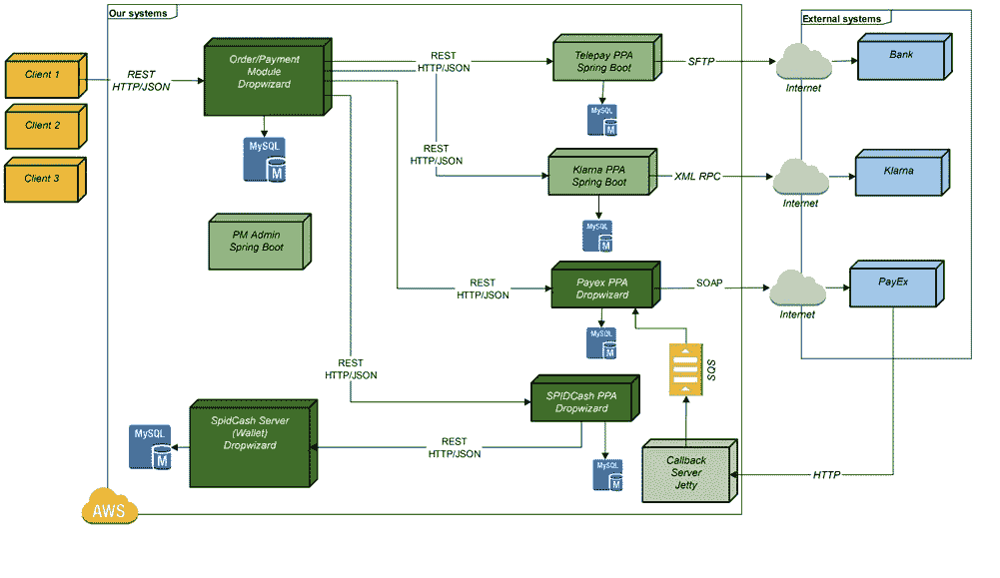
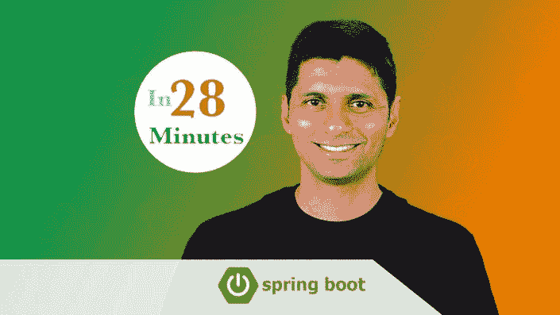
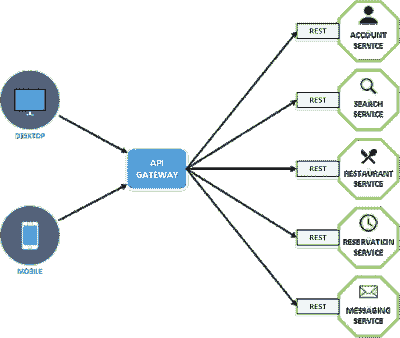
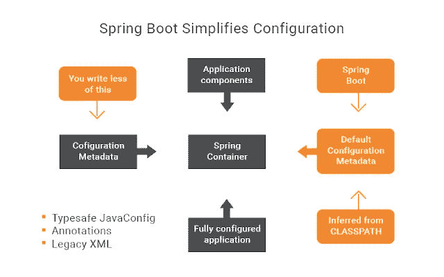
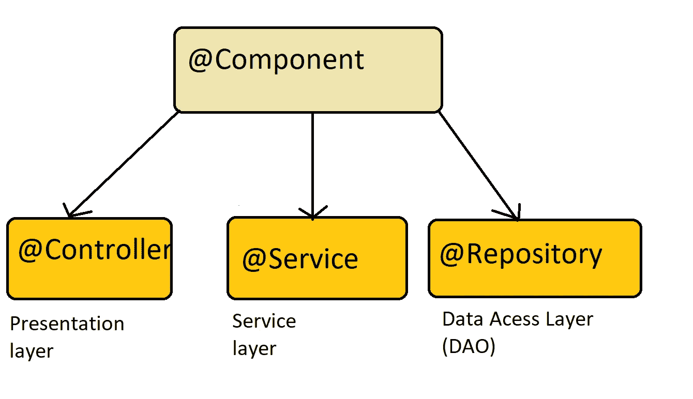
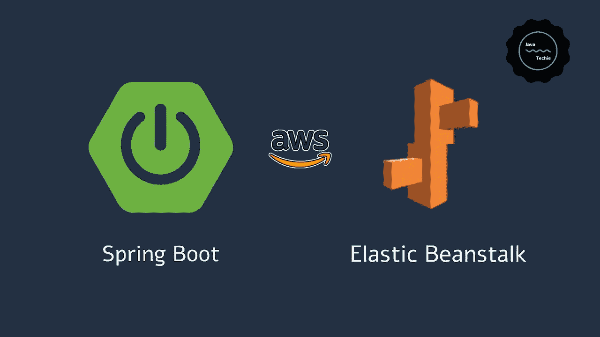
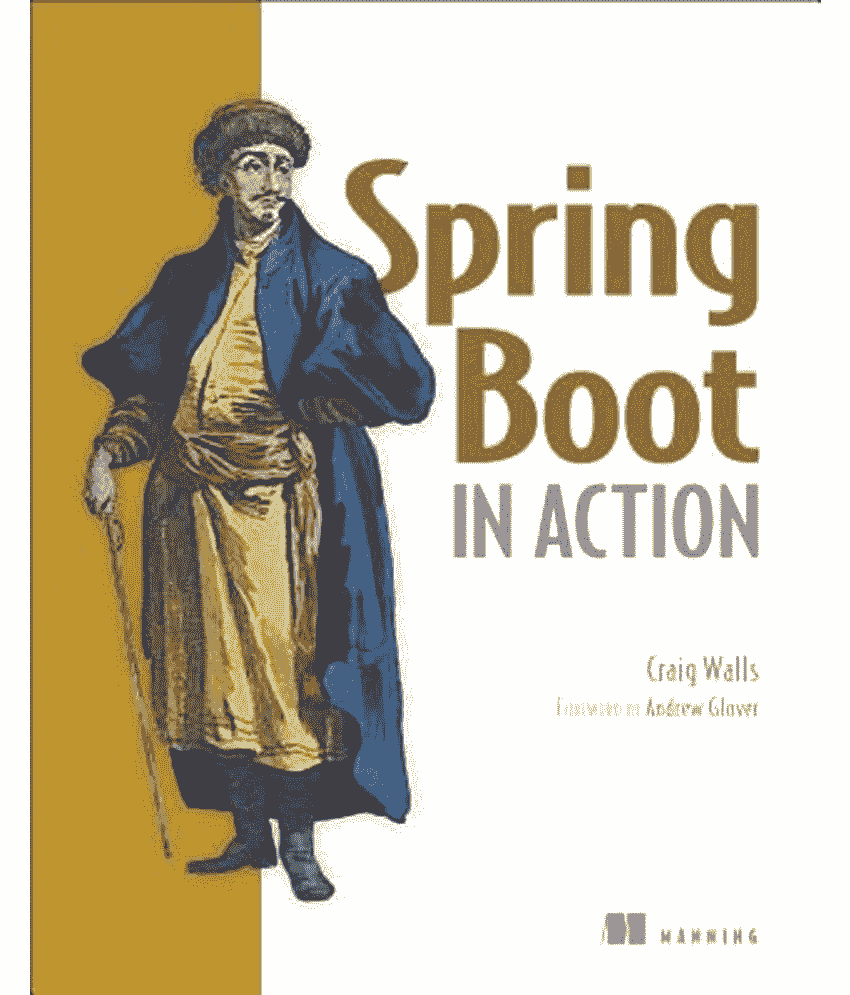
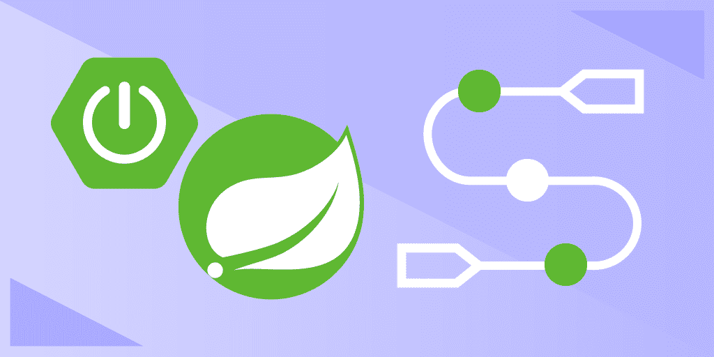

# 我最喜欢的 2023 年学习 Spring Boot 的课程——最好的

> 原文：<https://medium.com/javarevisited/top-10-courses-to-learn-spring-boot-in-2020-best-of-lot-6ffce88a1b6e?source=collection_archive---------0----------------------->

你好，伙计们，如果你有兴趣学习 Spring Boot，并寻找一些很棒的资源，如书籍、教程和在线课程，那么你来对地方了。

之前我已经分享了一些学习 Spring Framework 的好书，包括 Spring Boot ( [见](http://www.java67.com/2016/12/5-spring-framework-books-for-java-programmers.html)，今天我将分享一些**最好的在线 Spring Boot 课程**，你可以自己加入学习 Spring Boot。

过去，我非常喜欢从书本中学习，但是网络课程已经完全改变了这一点。现在，我更喜欢从网上课程开始，比如《Spring Boot 精要》**，然后再去读一本像《Spring Boot 在行动中》****这样的书，进行更全面的学习。******

******不管怎样，在学习 Spring Boot 课程之前，让我们先复习一下什么是 Spring Boot 及其好处，以及为什么要学习它。******

> ******Spring Boot 是 Java 开发人员最好的框架之一，如果你还不知道，可能 2023 年是学习 Spring Boot 的最好时机。******

******就像 Spring 让 Java 开发变得更容易一样， **Spring Boot 通过去掉所有与依赖管理、配置、bean 声明等相关的痛苦，使用 Spring 框架**让 Java 应用开发变得更容易。******

****它让 Java 开发变得非常有趣，特别是通过提供像 [starter dependency](https://javarevisited.blogspot.com/2018/11/top-5-spring-boot-features-java.html) 、自动配置、Spring Boot CLI、Spring Initializer 和 Spring Boot 执行器这样的特性，web 开发变得非常简单，但是，你最喜欢 Spring Boot 的是**它如何让你运行你的 Java 应用程序**。你能猜到吗？****

> ****是的，你猜对了，现在有了 Spring Boot，你可以通过使用经典的 [main 方法](http://www.java67.com/2014/02/can-you-run-java-program-without-main-method.html)像运行核心 Java 应用程序一样运行你的 Spring 应用程序。****

****不需要设置 web 服务器、构建 war 文件并将其部署到 servlet 容器中。只需为您的项目创建一个 Spring boot jar，并使用 jar 命令将它作为核心 java 应用程序运行，就像我们从命令提示符运行任何核心 Java 应用程序一样。****

****您可能想知道如何将这个 JAR 部署到传统的 [web 服务器](http://www.java67.com/2016/06/3-difference-between-web-server-vs-application-server-vs-servlet-container.html)中，比如您的公司正在生产中使用的 Tomcat？别担心。****

****Spring Boot 让你选择创建一个 [JAR](http://www.java67.com/2014/04/how-to-make-executable-jar-file-in-Java-Eclipse.html) 或 [WAR](https://javarevisited.blogspot.com/2014/11/dont-use-systemexit-on-java-web-application.html) 文件，最棒的是你甚至可以从命令提示符下运行 WAR 文件，因为 Spring Boot 有一个内嵌的 tomcat 服务器。****

****因此，**学习 Spring Boot** 将帮助你轻松地开发 Java，因为你现在可以更专注于应用程序逻辑，而不是担心配置和依赖性管理。****

****它现在也成为许多公司使用 [Spring framework](https://javarevisited.blogspot.com/2018/06/top-6-spring-framework-online-courses-Java-programmers.html) 的标准方式，他们正在寻找有一些 Spring Boot 经验的 Java 开发人员。****

****所以，如果你正在寻找 Java 和 Spring 开发方面的下一份工作，学习 Spring Boot 可以大大增加你的机会。****

# ****2023 年 Java 开发人员学习 Spring Boot 的 10 个最佳在线课程****

****这里是我为 Java 和 Spring 开发者列出的学习 Spring Boot 的一些最好的在线课程。当你在 Spring Boot 开始时，有一些春天的经历是很好的，但这不是强制性的。****

****事实上，我建议所有新手从 Spring Boot 开始，最好从最新和流行的技术开始，而不是传统的技术，顺便说一句，如果你仍然想先从 Spring 开始，那么你应该在参加任何这些 Spring Boot 课程之前，先查看一下 [**Spring Framework:初学者到大师**](https://click.linksynergy.com/fs-bin/click?id=JVFxdTr9V80&subid=0&offerid=323058.1&type=10&tmpid=14538&RD_PARM1=https%3A%2F%2Fwww.udemy.com%2Fspring-framework-5-beginner-to-guru%2F) 。****

****在这个列表中，我包括了初学者以及中级和有经验的开发人员的课程。这些课程中的大多数将帮助您学习所有重要的 Spring Boot 功能，如**自动配置**、**启动器依赖**、Spring 初始化器、 [Spring Actuator](https://dzone.com/articles/top-5-spring-boot-features-java-developers-should) 和 Spring CLI，但有些课程是面向目标的，它们还将教您如何使用 Spring Boot 和 Spring Cloud 开发微服务和基于云的应用程序。****

## ****1.[春季&适合初学者的冬眠(包括 Spring Boot)](https://click.linksynergy.com/deeplink?id=CuIbQrBnhiw&mid=39197&murl=https%3A%2F%2Fwww.udemy.com%2Fcourse%2Fspring-hibernate-tutorial%2F)****

****这显然是 Udemy 上 Java 开发人员学习 Spring、Hibernate 和 Spring Boot 的最佳课程。这个单一的课程涵盖了每个 Java 程序员都应该知道的三个基本框架，并很好地涵盖了它们，难怪有超过 20 万人加入了这个课程。****

****这也是最全面的课程之一，有 41 个小时的内容，涵盖许多重要的技能，如:****

1.  ****弹簧 5 芯****
2.  ****Spring Boot 2 号，****
3.  ****面向方面编程或 AOP****
4.  ****Spring MVC****
5.  ****春天安全****
6.  ****弹簧支架****
7.  ****百里香叶，JPA 和冬眠。****

****这个 Udemy 课程由 Chat Darby 创建，对于想要学习 Spring Boot 和 Hibernate 的 Java 程序员来说是一个完美的起点。Chad 是一位热情的老师，他高昂的情绪让你坚持完成这一漫长的课程。****

******这里是加入这个令人敬畏的课程的链接**——[春季&初学者冬眠(包括 Spring Boot)](https://click.linksynergy.com/deeplink?id=CuIbQrBnhiw&mid=39197&murl=https%3A%2F%2Fwww.udemy.com%2Fcourse%2Fspring-hibernate-tutorial%2F)****

********

## ****[2。Spring Boot 微服务与春云初学者到大师](https://click.linksynergy.com/deeplink?id=JVFxdTr9V80&mid=39197&murl=https%3A%2F%2Fwww.udemy.com%2Fcourse%2Fspring-boot-microservices-with-spring-cloud-beginner-to-guru%2F)****

****在本课程中，您将学习如何开发 Spring Boot 微服务并使用 Spring Cloud 进行部署！****

****传统上，大型企业级 Java 应用程序是作为大型整体应用程序开发的。Spring 框架最初是作为 J2EE(现在的 JEE)的替代方案，用于构建这些大型的单体企业应用程序。****

****然而，行业已经发展到青睐[微服务](https://dzone.com/articles/five-best-soa-and-microservice-courses-for-program)。使用微服务有很多好处。你将在本课程中了解到。****

****随着行业的发展，Spring 框架也在发展。Spring Boot 和[春云](https://dzone.com/articles/5-courses-to-learn-spring-cloud-in-2019)是专门针对微服务开发的工具。这是来自[易小轩·汤普森](https://click.linksynergy.com/deeplink?id=CuIbQrBnhiw&mid=39197&murl=https%3A%2F%2Fwww.udemy.com%2Fuser%2Fjohn-thompson-2%2F)的另一个宝石，他在 Udemy 上有许多超级春季课程。****

******以下是加入本课程的链接—** [Spring Boot 微服务与春云初学者到大师](https://click.linksynergy.com/deeplink?id=JVFxdTr9V80&mid=39197&murl=https%3A%2F%2Fwww.udemy.com%2Fcourse%2Fspring-boot-microservices-with-spring-cloud-beginner-to-guru%2F)****

********

## ****[3。学习 Spring Boot —快速 Spring 应用程序开发](https://click.linksynergy.com/fs-bin/click?id=JVFxdTr9V80&subid=0&offerid=323058.1&type=10&tmpid=14538&RD_PARM1=https%3A%2F%2Fwww.udemy.com%2Fspring-boot-intro%2F)****

****这是另一个[优秀的课程](https://click.linksynergy.com/fs-bin/click?id=JVFxdTr9V80&subid=0&offerid=323058.1&type=10&tmpid=14538&RD_PARM1=https%3A%2F%2Fwww.udemy.com%2Fspring-boot-intro%2F)，适合初学者学习 Spring Boot，即没有 Spring Boot 经验的人。****

****它不仅会教你 Spring Boot 的基础知识，还会教你 Spring 框架的基础知识，比如[依赖注入](https://javarevisited.blogspot.sg/2015/06/difference-between-dependency-injection.html)、[控制反转](https://javarevisited.blogspot.com/2012/12/inversion-of-control-dependency-injection-design-pattern-spring-example-tutorial.html#axzz5N1cdCqrn)、应用上下文等等。****

****在本课程中，讲师 Dan Vega，Udemy 上一位受欢迎的 Spring 框架讲师，将教你如何使用 Spring Boot 开发一个 web 应用程序。您将创建一个端到端的 Spring MVC 应用程序。****

****您将使用 Spring Boot 构建 REST 服务，使用 Spring 数据连接到数据库，并使用 Spring Security 保护您的应用程序。您还将学习如何创建应用程序的可执行 JAR。****

****该课程还解释了关键的 Spring Boot 概念，如自动创建项目结构的 Spring Initializer、Starter POMs 或 starter dependencies 以及自动配置。****

> *****链接加入课程:* [***学习 Spring Boot —快速应用***](https://click.linksynergy.com/fs-bin/click?id=JVFxdTr9V80&subid=0&offerid=323058.1&type=10&tmpid=14538&RD_PARM1=https%3A%2F%2Fwww.udemy.com%2Fspring-boot-intro%2F)****

********

****简而言之，学习使用 Spring 框架进行 Java 应用开发的综合课程。你将在仅仅一门课程中学习 [Spring MVC](https://javarevisited.blogspot.com/2018/11/top-20-spring-mvc-interview-questions-answers-for-java-developers.html) 、 [REST](https://javarevisited.blogspot.com/2018/02/top-5-restful-web-services-with-spring-courses-for-experienced-java-programmers.html) 、Spring Data JPA、 [Spring Security](http://www.java67.com/2017/12/top-5-spring-security-online-training-courses.html) 以及其他所有相关的库。****

## ****4.[学春:认证类](https://courses.baeldung.com/p/ls-certification-class?utm_source=javarevisited&utm_medium=web&utm_campaign=lss&affcode=22136_bkwjs9xa)****

****这是另一个[新课程](https://courses.baeldung.com/p/ls-certification-class?utm_source=javarevisited&utm_medium=web&utm_campaign=lss&affcode=22136_bkwjs9xa)从头开始学习 Spring 5 和 Spring Boot 2，由 Baeldung 的欧根·帕拉斯基夫指导，以代码为中心。与列表中的其他课程相比，这有点贵，但如果你能负担得起，这也是一个很好的资源。****

****Eugen 有教授和简化事情的诀窍，他还展示了如何使用现代工具和实践开发 Spring Boot 应用程序。****

> *****链接加入课程:* [***学泉:认证类***](https://courses.baeldung.com/p/ls-certification-class?utm_source=javarevisited&utm_medium=web&utm_campaign=lss&affcode=22136_bkwjs9xa)****

**** [## 学习 Spring:认证类

### 这门课的目的是让你从实际上没有春天的经验，到有一个真实的世界，坚实的把握…

courses.baeldung.com](https://courses.baeldung.com/p/ls-certification-class?utm_source=javarevisited&utm_medium=web&utm_campaign=lss&affcode=22136_bkwjs9xa) 

顺便说一句，如果价格是阻止你参加本课程的原因，还有其他选择，如[**Spring:Master Class**](https://courses.baeldung.com/p/ls-master-class?utm_source=javarevisited&utm_medium=web&utm_campaign=lss&affcode=22136_bkwjs9xa)费用比认证课程低得多，但显然涵盖的主题更少。**** 

## ****5.[100 步学会 Spring Boot——从初学者到专家](https://click.linksynergy.com/fs-bin/click?id=JVFxdTr9V80&subid=0&offerid=323058.1&type=10&tmpid=14538&RD_PARM1=https%3A%2F%2Fwww.udemy.com%2Fspring-boot-tutorial-for-beginners%2F)****

****这是另一个为初学者学习 Spring Boot 和相关图书馆的综合课程。Ranga 也是 Udemy 中另一位受欢迎的 Spring 框架讲师，在教授 Spring 方面有着丰富的经验。****

****在本课程中，您不仅将学习所有关键的 Spring Boot 概念，例如[自动配置](http://www.java67.com/2018/06/top-15-spring-boot-interview-questions-answers-java-jee-programmers.html)、启动器依赖项、Spring 初始值设定项，还将探索更高级的概念，如 Spring Boot 执行器和其他 Spring Boot 开发工具。****

****课程还涵盖了 [Spring MVC](https://javarevisited.blogspot.sg/2017/06/how-spring-mvc-framework-works-web-flow.html) 并教你使用 Spring MVC 和 [Hibernate/JPA](https://javarevisited.blogspot.com/2018/01/top-5-hibernate-and-jpa-courses-for-java-programmers-learn-online.html) 创建一个 web 应用。如果你对 Spring MVC 一无所知，也不用担心。****

****在本课程中，您将学到足够的知识来创建自己的 web 应用程序，如 [DispatcherServlet](http://javarevisited.blogspot.sg/2017/09/dispatcherservlet-of-spring-mvc-10-points-to-remember.html) 、 [ViewResolvers](https://javarevisited.blogspot.com/2017/08/what-does-internalresourceviewresolver-do-in-spring-mvc.html) 、Model、 [Controllers](https://javarevisited.blogspot.com/2017/08/difference-between-restcontroller-and-controller-annotations-spring-mvc-rest.html) 等。****

****本课程的另一个好处是，它将教你使用 Spring Boot 编写优秀的单元和集成测试。****

> *****以下是加入课程的链接:*[***100 步学会 Spring Boot***](https://click.linksynergy.com/fs-bin/click?id=JVFxdTr9V80&subid=0&offerid=323058.1&type=10&tmpid=14538&RD_PARM1=https%3A%2F%2Fwww.udemy.com%2Fspring-boot-tutorial-for-beginners%2F)****

********

****您还将学习 Java 应用程序开发的两个领先测试框架[JUnit 5](https://javarevisited.blogspot.sg/2018/01/10-unit-testing-and-integration-tools-for-java-programmers.html)和 [Mockito](http://bit.ly/2OXM8IR) 。****

****简而言之，这是一门非常棒的课程，适合初学者用 Spring Boot 和相关技术开始学习 Java 开发。****

## ****[**6。创建您的第一个 Spring Boot 应用程序**](https://pluralsight.pxf.io/c/1193463/424552/7490?u=https%3A%2F%2Fwww.pluralsight.com%2Fcourses%2Fspring-boot-first-application)**【plural sight】******

****这是一个关于 Spring Boot 框架的很好的入门课程，你将学习什么是 Spring Boot，它是如何工作的，以及它如何与其他 Spring 模块如 Spring MVC、REST 等一起工作。****

****在 [**这门课**](https://pluralsight.pxf.io/c/1193463/424552/7490?u=https%3A%2F%2Fwww.pluralsight.com%2Fcourses%2Fspring-boot-first-application) 中，你将通过创建一个演示应用程序来学习 Spring Boot。你将一路探索不同的 Spring Boot 特性，如 Spring Initializers，Spring Boot 依赖管理，即 starter POMs，它允许你只声明一个 starter 包，而不是几个单独的库。****

****您还将学习使用 Spring Boot、RESTful web 服务和基于 JavaScript 的 UI 来开发现代 Java web 应用程序。最重要的是 Spring MVC 集成。****

****您还将学习如何外部化属性，并充分利用 Spring Boot 自动配置来减少项目中的配置。****

******这是加入本课程的链接** — [创建你的第一个 Spring Boot 应用](https://pluralsight.pxf.io/c/1193463/424552/7490?u=https%3A%2F%2Fwww.pluralsight.com%2Fcourses%2Fspring-boot-first-application)****

********

****总之，这是初学者学习 Spring Boot 最好的课程之一。完成本课程后，你应该对 Spring Boot 建筑以及它如何与 [Core Spring](https://click.linksynergy.com/fs-bin/click?id=JVFxdTr9V80&subid=0&offerid=323058.1&type=10&tmpid=14538&RD_PARM1=https%3A%2F%2Fwww.udemy.com%2Fspring-framework-5-beginner-to-guru%2F) 协同工作有一个很好的了解。****

****顺便说一下，你需要一个 [Pluralsight 会员](http://pluralsight.pxf.io/c/1193463/424552/7490?u=https%3A%2F%2Fwww.pluralsight.com%2Flearn)才能加入这个课程，费用大约是每月 29 美元或每年 299 美元(14%的折扣)。我向所有程序员强烈推荐这个订阅，因为它提供了超过 7000 个在线课程的即时访问，以学习任何技术技能。或者，你也可以使用他们的 [**10 天免费通行证**](https://pluralsight.pxf.io/c/1193463/424552/7490?u=https%3A%2F%2Fwww.pluralsight.com%2Fpricing%2Ffree-trial) 免费观看这个课程。****

**** [## Pluralsight |个人免费试用

### 了解有关 Pluralsight 免费试用版的更多信息。

pluralsight.pxf.io](https://pluralsight.pxf.io/c/1193463/424552/7490?u=https%3A%2F%2Fwww.pluralsight.com%2Fpricing%2Ffree-trial)**** 

## ****[**7。主微服务有 Spring Boot**和春云](https://click.linksynergy.com/fs-bin/click?id=JVFxdTr9V80&subid=0&offerid=323058.1&type=10&tmpid=14538&RD_PARM1=https%3A%2F%2Fwww.udemy.com%2Fmicroservices-with-spring-boot-and-spring-cloud%2F)****

****这是一门任务型课程，与其他课程略有不同。这也是一门更高级的课程，更适合有经验的 Java 程序员，他们对 Spring 框架有很好的了解，并对 Spring Boot 和 Spring Cloud 有一些基本的了解，这两个领先的框架来自 Spring umbrella，用于为云构建现代 Java 应用程序。****

****在**这门课**中，你将首先从使用 Spring Boot 开发 RESTful web 服务开始，然后慢慢走向 [Spring Cloud](http://javarevisited.blogspot.sg/2018/04/top-5-spring-cloud-courses-for-java.html#axzz5DbV6r2Ll) 和[微服务模式](https://javarevisited.blogspot.sg/2018/02/top-5-spring-microservices-courses-with-spring-boot-and-spring-cloud.html#axzz5Cz1R4cHw)。****

****您将了解关键的微服务和云概念，如使用 Ribbon 的客户端负载平衡、使用 Eureka 命名服务器的动态扩展、使用 Hystrix 的微服务容错等。****

******以下是加入本课程的链接**——[与 Spring Boot、春云一起掌握微服务](https://click.linksynergy.com/fs-bin/click?id=JVFxdTr9V80&subid=0&offerid=323058.1&type=10&tmpid=14538&RD_PARM1=https%3A%2F%2Fwww.udemy.com%2Fmicroservices-with-spring-boot-and-spring-cloud%2F)****

********

****您还将学习一些高级的 REST 概念，如 [*如何使用 Swagger*](http://courses.baeldung.com/p/rest-with-spring-the-master-class?affcode=22136_bkwjs9xa) 对您的 RESTful Web 服务进行版本化和文档化。总的来说，这是 Java 开发人员通过使用 Spring Boot 和 Spring Cloud 向云和微服务迁移的绝佳课程。****

## ****[8。Spring Boot 精要](https://click.linksynergy.com/fs-bin/click?id=JVFxdTr9V80&subid=0&offerid=323058.1&type=10&tmpid=14538&RD_PARM1=https%3A%2F%2Fwww.udemy.com%2Fspring-boot-essentials%2F)【我的初学者最佳课程】****

****这是一个从 Spring Boot 开始的简短课程。我选择这门课是因为它很清晰。讲师非常专注，有很好的声音和解释技巧，这使得它很容易消化新的 Spring Boot 概念。****

****讲师纳尔逊·德加洛通过开发一个 RESTful web 服务来解释 Spring Boot 概念，这也将激发你对这个领域的兴趣。****

****如果你真的很想学习 Spring Boot，你应该选这门课。通过学习这门课程，你可以在几天内学会 Spring Boot。****

****顺便说一句，如果你对 Spring 世界非常陌生，不知道[依赖注入](https://javarevisited.blogspot.com/2015/06/difference-between-dependency-injection.html)、Spring 容器和其他基本概念，我不会推荐你加入这个课程。****

****你最好从这个列表上的其他 Spring boot 课程开始，这些课程解释了 Spring 框架，比如 [**Spring 框架大师班——初学者到专家**](https://click.linksynergy.com/fs-bin/click?id=JVFxdTr9V80&subid=0&offerid=323058.1&type=10&tmpid=14538&RD_PARM1=https%3A%2F%2Fwww.udemy.com%2Fspring-tutorial-for-beginners%2F) **。******

********

## ******9。** [**考 Spring Boot:初学者到宗师**](https://click.linksynergy.com/deeplink?id=JVFxdTr9V80&mid=39197&murl=https%3A%2F%2Fwww.udemy.com%2Fcourse%2Ftesting-spring-boot-beginner-to-guru%2F)**【Udemy】******

****这是一门很好的课程，学习如何在使用 Spring Boot 进行项目开发时编写测试。本课程主要关注 JUnit 5 版本。****

****JUnit 4 和 JUnit 5 之间有一些非常显著的区别。本课程包含一个专门的部分，向您展示如何将您的 JUnit 4 测试迁移到 JUnit 5。****

****随着您的测试需求变得更加复杂，您将需要模仿依赖对象。 [Mockito](/javarevisited/5-courses-to-learn-junit-and-mockito-in-2019-best-of-lot-f217d8b93688) 是 Java 开发人员使用的最流行的模仿库。****

****如果您正在编写 Spring Framework 应用程序，您可能会将依赖对象注入到您的类中。您将学习如何在单元测试中使用 [Mocktio](/javarevisited/top-10-courses-to-learn-eclipse-junit-and-mockito-for-java-developers-4de1e8d62b96) 强大的模仿功能来模仿依赖对象。****

******这是加入本课程的链接**——[测试 Spring Boot:从初学者到大师](https://click.linksynergy.com/deeplink?id=JVFxdTr9V80&mid=39197&murl=https%3A%2F%2Fwww.udemy.com%2Fcourse%2Ftesting-spring-boot-beginner-to-guru%2F)****

********

## ****10.[初学 Spring Boot 的 Spring 框架](https://click.linksynergy.com/deeplink?id=JVFxdTr9V80&mid=39197&murl=https%3A%2F%2Fwww.udemy.com%2Fcourse%2Fspring-5-with-spring-boot-2%2F)****

****在本课程中，您将学习企业世界高度要求的框架:Spring Boot 的 Spring Framework 5。来自 Telusko 的 Navin Reddy 的教练是一个很棒的教练，我看过他的很多 Youtube 视频。****

****这个课程提供了使用 [Spring Boot](https://dzone.com/articles/top-5-books-to-learn-spring-boot-and-spring-cloud) 构建 Spring 框架应用程序的实践经验。****

****本课程是互动和有趣的，因为你将看到 Navin 从头开始编写所有项目的代码。通过学习本课程，您将掌握使用 Spring 框架构建实际应用程序所需的最新技能。****

******这里是加入本课程的链接**——[Spring Framework for 初学者用 Spring Boot](https://click.linksynergy.com/deeplink?id=JVFxdTr9V80&mid=39197&murl=https%3A%2F%2Fwww.udemy.com%2Fcourse%2Fspring-5-with-spring-boot-2%2F)****

********

## ****[11。使用 Elastic Beanstalk 将 Java Spring Boot 应用部署到 AWS](https://click.linksynergy.com/deeplink?id=JVFxdTr9V80&mid=39197&murl=https%3A%2F%2Fwww.udemy.com%2Fcourse%2Fdeploy-java-spring-boot-to-aws-amazon-web-service%2F)****

****软件开发正在向云发展，所有的 Java 应用程序也是如此。作为对 AWS 和云的介绍，这门课程将是一个完美的第一步，尤其是对 Java 开发人员而言。****

****您将了解如何使用弹性 Beanstalk CLI 实现自动化部署，以及如何使用 AWS 代码管道创建连续的交付管道。您将学习如何基于负载自动扩展应用程序，以及如何使用 Elastic Beanstalk 在负载平衡器后面部署多个实例。****

****你将使用**个 AWS 服务**——EC2、S3、AWS CodePipeLine、AWS CodeBuild、SQS、IAM、CloudWatch。****

******这里是参加春季启动课程的链接**——[使用 Elastic Beanstalk 将 Java Spring Boot 应用部署到 AWS](https://click.linksynergy.com/deeplink?id=JVFxdTr9V80&mid=39197&murl=https%3A%2F%2Fwww.udemy.com%2Fcourse%2Fdeploy-java-spring-boot-to-aws-amazon-web-service%2F)****

********

# ****2023 年学习 Spring Boot 的最好方法是什么？****

****我的一些读者也问我**学习新框架的最好方法是什么？嗯，一年前我是个书迷，但现在我认为在线课程是更好的选择。******

****它们更具互动性，你可以在很短的时间内学到很多东西。由于另一个重要原因，它们现在也很便宜。****

****Udemy 上的一些 Spring Boot 课程比打车去超市还省钱，顺便说一句，如果你仍然喜欢从书开始，克雷格·沃尔斯的《Spring Boot 在行动》是最好的开始。****

********

****除了书籍，你还可以加入一个基于文本的互动课程，获得更完整的学习体验。IT 专业人士互动在线学习平台 Educative 提供的春季课程 5 和 Spring Boot 课程 2 的完整指南就是这样一门课程。****

****课程的重点是 Spring Boot 启动项目。您将从 Spring 的基础开始，比如依赖注入、自动连接，然后继续学习 Spring Boot、Spring MVC、Spring JDBC 和 Spring Data JPA。然后，您将深入了解 Spring 对 AOP 和单元测试的支持。****

****本课程的最大收获是，你将能够创建具有依赖注入和控制反转的应用程序。****

****这里是加入这个互动课程的链接— [**春天 5 和 Spring Boot 2**](https://www.educative.io/courses/guide-spring-5-spring-boot-2?affiliate_id=5073518643380224) 完全指南****

********

****而且，如果你发现教育平台和他们的互动课程很有用，那么你还可以获得 [**教育订阅**](https://www.educative.io/subscription?affiliate_id=5073518643380224) ，每月只需 14.9 美元，不仅可以访问本课程，还可以访问他们的 210 多门课程。它非常划算，非常适合准备编码面试****

****以上就是 2023 年学习春装的一些**最佳课程。Spring Boot 是一个非常有用的框架，它给你 Spring 框架的所有功能，而没有它的所有复杂性，这真的提高了生产力。******

****如果您碰巧使用 Groovy，那么您可以使用 Spring CLI 进一步减少 Java web 应用程序的开发时间。如果你问我 2023 年要学什么，我会建议 Spring Boot。****

****它不仅能帮助你轻松地编写基于 Spring 的 Java 应用程序，还能促进你的职业发展。****

****您可能想探索的其他 Java 和 Spring 文章****

****[2023 年 Java 开发人员路线图](https://javarevisited.blogspot.com/2019/10/the-java-developer-roadmap.html)
[2023 年 Java 开发人员应该学习的 10 件事](http://javarevisited.blogspot.sg/2017/12/10-things-java-programmers-should-learn.html)
[学习和掌握 Spring Cloud 的 5 大课程](http://javarevisited.blogspot.sg/2018/04/top-5-spring-cloud-courses-for-java.html)
[2023 年学习 Spring 框架的 5 大免费课程](http://www.java67.com/2017/11/top-5-free-core-spring-mvc-courses-learn-online.html)
[2023 年学习 Spring 安全的 5 大课程](http://www.java67.com/2017/12/top-5-spring-security-online-training-courses.html)
[5 本 Spring 书籍有经验的 Java 开发人员应该阅读的](http://javarevisited.blogspot.sg/2018/04/5-spring-framework-books-experienced-Java-developers-2018.html)
[成为更好的 Java 开发人员的 10 大技巧](http://javarevisited.blogspot.sg/2018/05/10-tips-to-become-better-java-developer.html)****

# ****结束语****

****谢谢，你坚持到了文章的结尾…祝你的 Spring Boot 之旅好运！这当然不会很容易，但是通过学习这些课程，你就朝着掌握春靴的目标前进了一步。****

****如果你喜欢这篇文章，那么请分享给你的朋友和同事，别忘了在 Twitter 上关注 [javinpaul](https://twitter.com/javinpaul) 和在 Medium 上关注 [javinpaul](https://medium.com/u/bb36d8439904?source=post_page-----c2fd7a0282c2----------------------) ！****

****如果你喜欢书，你也可以看看我为 Java 开发者列出的 Spring Boot 顶级书籍清单。****

******P. P. S.** —如果你需要一些免费的资源，你可以看看这个 [**免费 Spring Boot 课程**](http://www.java67.com/2017/11/top-5-free-core-spring-mvc-courses-learn-online.html) 的列表，开始你的旅程。****

**** [## 面向 Java 开发人员的 10 个免费 Spring Boot 课程和教程

### 大家好，作为一个 Java 博客的作者和 Java 开发人员，很多人问我关于课程和书籍的问题…

medium.com](/javarevisited/10-free-spring-boot-tutorials-and-courses-for-java-developers-53dfe084587e) 

## 你可能喜欢的其他中等 Spring Boot 教程

 [## 面向有经验的 Java 开发人员的 10 门高级 Spring Boot 课程

### 高级 Spring Boot 课程为有经验的 Java 开发人员学习 Spring Boot 测试，云和容器…

medium.com](/javarevisited/10-advanced-spring-boot-courses-for-experienced-java-developers-5e57606816bd)  [## 学习 Java 和 Spring 框架中微服务的 7 大课程

### 微服务是软件开发领域的新术语，尤其是在 Java 方面，但它已经在实践中…

medium.com](/javarevisited/top-5-courses-to-learn-microservices-in-java-and-spring-framework-e9fed1ba804d)  [## 我最喜欢的 2023 年学习软件架构的课程——最好的

### 这些是 2023 年学习软件架构并成为解决方案架构师的最佳课程

medium.com](/javarevisited/top-5-courses-to-learn-software-architecture-in-2020-best-of-lot-5d34ebc52e9)****