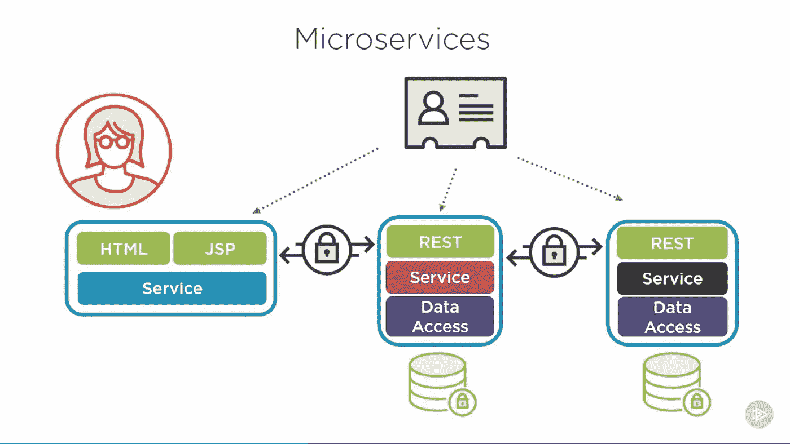
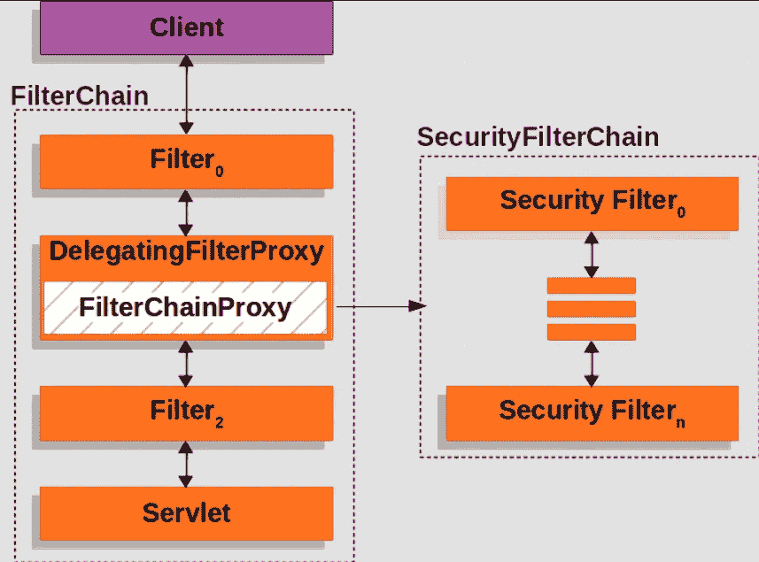
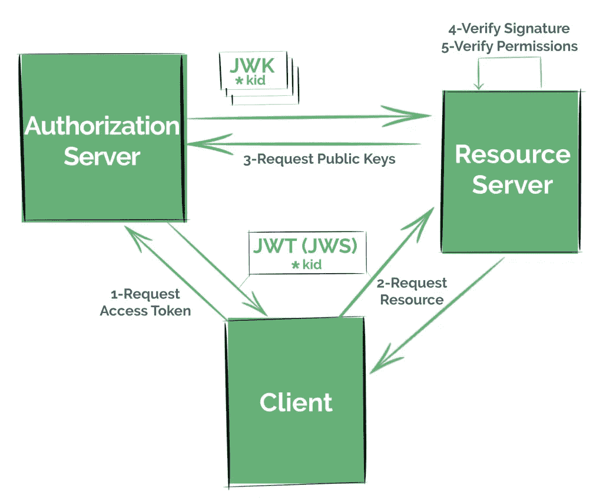
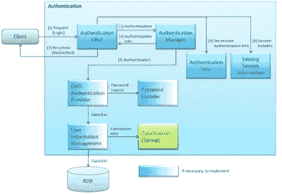
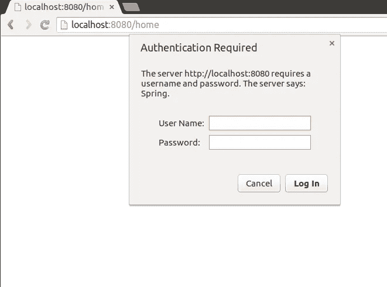
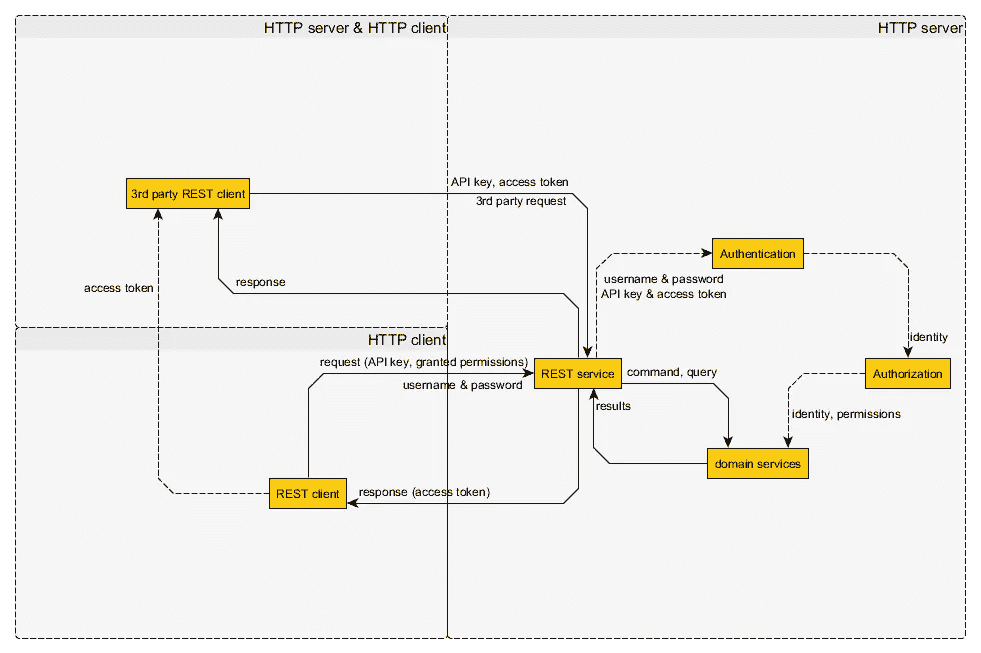
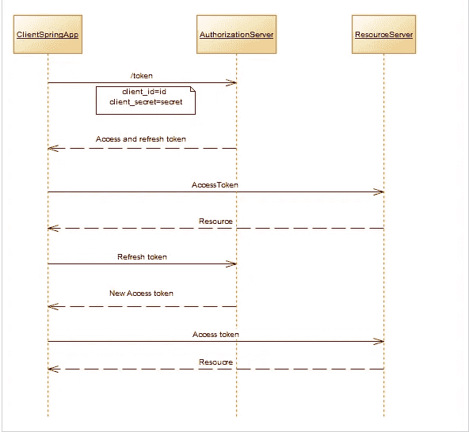

# 2023 年 Java 开发人员学习 Spring Security、OAuth2 和 JWT 与 Spring Boot 的 10 大课程

> 原文：<https://medium.com/javarevisited/top-10-courses-to-learn-spring-security-and-oauth2-with-spring-boot-for-java-developers-8f0222d6066d?source=collection_archive---------0----------------------->

## 这些是来自 Udemy、Pluralsight 和 Baeldung 的最佳 Spring 安全课程，学习如何使用 OAuth2、Spring Security 和 JWT 来保护 Java 应用程序

安全性是现代 web 应用程序最重要的方面之一，无论是 Java web 应用程序。NET，或使用任何其他网络技术写作。在 Java 世界里， [Spring Security](http://javarevisited.blogspot.sg/2017/05/how-to-enable-spring-security-in-java-web-application.html#axzz4xXI47rE6) 统治着安全领域。

它是为数不多的提供许多安全特性的框架之一，比如身份验证、授权、使用 OAuth 的社交登录、会话管理、记住我，以及其他一些现成的有用特性。

因为 Spring security 没有竞争对手，而且它做得非常好，所以它很快成为 Java web 应用程序、[REST API](http://javarevisited.blogspot.sg/2017/08/difference-between-restcontroller-and-controller-annotations-spring-mvc-rest.html)和核心 Java 应用程序中实现安全性的事实上的标准。Spring 框架的兴起当然也有助于巩固它的地位。

如今，Spring 安全性被列为有经验的 Java 开发人员最重要的技能之一，在很多情况下，它也是两个具有相似技能和经验的 Java web 开发人员的区分因素。鉴于安全性的重要性和 Spring security 的流行，许多 Java 开发人员正在学习这个有用的框架，但这并不容易。在应用程序中使用 OAuth、OIDC 和 JWT 来保护您的应用程序似乎是一项艰巨的任务。

你需要花大量的时间来理解安全性以及如何使用 Spring security framework 实现这些方面，这正是一本好书或一个好的在线培训课程所能提供的帮助。我自学了 Spring Security，花费的时间比我预期的要长。我的知识也有一些空白，因为我的学习不全面或有条不紊，但那些日子已经一去不复返了。

现在，有很多很好的 Spring 安全在线课程，比如 Eugen 的 [**Spring 安全大师班**](https://courses.baeldung.com/p/learn-spring-security-the-master-class?utm_source=javarevisited&utm_medium=web&utm_campaign=lss&affcode=22136_bkwjs9xa) ，它不仅教你基础知识，还教你 Spring 安全的高级特性，以及如何根据组织的需要进行定制。

完成这些课程后，您将掌握在现代分布式应用程序中利用 Oauth2、OIDC 和 JWT 所需的 Spring Security 中 Oauth2 支持的技能和知识。

# 2023 年 Java 开发人员的 10 门最佳春季安全、JWT 和 OAuth2 课程

在这篇文章中，我将分享一些来自热门学习网站的最好的在线春季安全培训课程，如 [PluralSight](/javarevisited/top-10-pluralsight-courses-to-learn-programming-and-software-development-during-covid-19-stay-at-30b7d8a4f88f) 、 [Udemy](/javarevisited/pluralsight-or-udemy-d9a94d2e8ee) 和 Baeldung。这个列表包含了针对初学者和有经验的 Java 程序员的 Spring 安全课程。基于您对 Spring Security 的体验，您可以选择课程来增强您的知识并填补您的知识空白。

## 1.[春日安全零至主随 JWT，OAUTH2](https://click.linksynergy.com/deeplink?id=CuIbQrBnhiw&mid=39197&murl=https%3A%2F%2Fwww.udemy.com%2Fcourse%2Fspring-security-zero-to-master%2F)

这是深入学习 Spring Security 的最佳在线课程之一。本 Udemy 课程不仅涵盖了 Spring Security，还涵盖了 JWT (Json Web Token)以及 OAuth2，oauth 2 是在任何 Web 应用程序中实现社交登录的关键。

这个长达 11 小时的最新春季安全课程是由 Eazy bytes 及其 Udemy 最受欢迎和最新的春季安全课程创建的。在本课程中，您将以引人入胜的方式学习 Spring 安全框架的细节及其特性。

您将了解基本的安全概念，什么是 CSRF、CORS、JWT、OAUTH2，如何使用 Spring Security 实现 Java web 应用程序的安全性，web/非 web 应用程序中的方法级安全性，以及使用 Spring Security 在 web 应用程序中应用角色、权限的授权规则

谈到社交证明，这个最佳 Spring 安全课程受到了超过 8，900 名 Java 开发人员的信任，它在 1369 名参与者中的平均评分为 4.6，这令人惊讶。如果你想在 2023 年学习春季安全，我强烈推荐你参加这个课程。它也很实惠，你只需花 10 美元就能在每周的 Udemy 大减价上买到。

**以下是加入本课程的链接**——[春季安全零至大师与 JWT、OAUTH2](https://click.linksynergy.com/deeplink?id=CuIbQrBnhiw&mid=39197&murl=https%3A%2F%2Fwww.udemy.com%2Fcourse%2Fspring-security-zero-to-master%2F)

## 2. [**学春安全:拜尔东**认证班](https://courses.baeldung.com/p/learn-spring-security-the-certification-class?utm_source=javarevisited&utm_medium=web&utm_campaign=lss&affcode=22136_bkwjs9xa)

这是我今天学习 Spring Security 最喜欢的资源。这也是你能得到的最先进和最全面的课程之一。作者尤金·帕拉斯基夫分享了他使用 Spring Security 保护 REST APIs 和 Java Web 应用程序的真实经验。这门课程最好的部分是它总是最新的。

Eugen 非常努力地让本课程保持最新，这就是为什么他根据 Spring Framework 5 和 Spring Security 5 版本中引入的新功能重新编写了几个课程。

**这里是报名参加本课程的链接—** [学习 Spring Security:认证课](https://courses.baeldung.com/p/learn-spring-security-the-certification-class?utm_source=javarevisited&utm_medium=web&utm_campaign=lss&affcode=22136_bkwjs9xa)

不利的一面是，这个课程有点贵，如果你是自掏腰包，也就是说，你的公司没有赞助或报销这个课程，那么你可能会发现你的预算，但如果你能负担得起，那么这肯定是在短时间内学习 Spring security 的最佳课程。

此外，如果负担能力是个问题，你可以选择稍微不太全面的 [**春季安全大师班**](https://courses.baeldung.com/p/learn-spring-security-the-master-class?utm_source=javarevisited&utm_medium=web&utm_campaign=lss&affcode=22136_bkwjs9xa) 课程，这将花费你更少的钱。

## 3. [**弹簧安全基础知识通过**](https://pluralsight.pxf.io/c/1193463/424552/7490?u=https%3A%2F%2Fwww.pluralsight.com%2Fcourses%2Fspring-security-fundamentals)

我第一次知道 plur sight 是在我的一位读者送给我 plur sight 年度会员时，非常感谢他。从那以后，我就因为几门优质课程而迷上了这个网站。

春季安全基础课程是 Bryan Hansen 的春季系列课程之一。你可能已经看过他的 *Spring Fundamentals* 和*Spring MVC 简介*课程，这是我学习核心 Spring 和 Spring MVC 最喜欢的两个资源。

本课程以《春安入门》为基础。您将了解安全应用程序的剖析及其风险。

**这里是报名参加本课程的链接—**[plural sight 的春季安全基础](https://pluralsight.pxf.io/c/1193463/424552/7490?u=https%3A%2F%2Fwww.pluralsight.com%2Fcourses%2Fspring-security-fundamentals)

在本课程中，您将慢慢了解认证和授权等关键安全概念，并学习几个 Spring 安全基本特性，如 [LDAP 认证](http://javarevisited.blogspot.sg/2011/11/ldap-authentication-active-directory.html)和[基于角色的访问控制](http://javarevisited.blogspot.sg/2013/07/role-based-access-control-using-spring-security-ldap-authorities-mapping-mvc.html)。

你也可以免费获得这门课程，因为 Pluarsight 提供了一个 [**10 天的免费试用期**](https://pluralsight.pxf.io/c/1193463/424552/7490?u=https%3A%2F%2Fwww.pluralsight.com%2Flearn) 完成这门课程绰绰有余，顺便说一句，如果你遵循每周至少花 5 个小时学习和提升自己的原则，Pluarsight 的年度会员资格当然物有所值。

## 4. [Spring Security Core:初学者到大师约翰·汤姆逊](https://click.linksynergy.com/deeplink?id=CuIbQrBnhiw&mid=39197&murl=https%3A%2F%2Fwww.udemy.com%2Fcourse%2Fspring-security-core-beginner-to-guru%2F)

这是另一个来自 Udemy 的很棒的 Spring 安全课程，它是由我最喜欢的 Spring boot 教练约翰·汤姆逊创建的，在过去我已经创建了很棒的课程，如 [Spring Framework 5:初学者到大师](https://click.linksynergy.com/deeplink?id=CuIbQrBnhiw&mid=39197&murl=https%3A%2F%2Fwww.udemy.com%2Fcourse%2Fspring-framework-5-beginner-to-guru%2F)和 [*Spring Boot 微服务与 Spring Cloud 初学者到大师*](https://click.linksynergy.com/deeplink?id=JVFxdTr9V80&mid=39197&murl=https%3A%2F%2Fwww.udemy.com%2Fcourse%2Fspring-boot-microservices-with-spring-cloud-beginner-to-guru%2F) *。*

在这个长达 13 个小时的 Spring 安全课程中，你将学到如何使用 Spring security 来保护你的 Spring 框架应用程序的所有知识。

以下是本课程涵盖的关键主题:

*   如何使用 Spring Security 保护 Java Web 应用程序
*   如何防范常见的 Web 安全漏洞(OWASP)
*   如何使用 Spring Security 进行认证和授权？
*   密码管理
*   限制用户访问的最佳实践
*   如何使用测试驱动开发来测试用户访问

谈论社会证明已经有超过 5000 名 Java 开发人员加入了这个课程来深入学习 Spring Security，你也可以这样做。近 590 名学习者对它的平均评分为 4.4，这很令人惊讶。

以下是加入本课程的链接— [**春保核心:初学者到宗师**](https://click.linksynergy.com/deeplink?id=CuIbQrBnhiw&mid=39197&murl=https%3A%2F%2Fwww.udemy.com%2Fcourse%2Fspring-security-core-beginner-to-guru%2F)

## 5.[**Java Spring Security by Udemy**](https://click.linksynergy.com/link?id=JVFxdTr9V80&offerid=323058.65830&type=2&murl=https%3A%2F%2Fwww.udemy.com%2Fjavaspring%2F)

Udemy 是另一个在线自学的好平台。作为一名程序员，我自己通过阅读书籍、博客和参加这些在线课程学习了许多新的框架和技术，Udemy 在其中发挥了很大的作用。这个网站拥有世界上最大的在线培训课程。你会找到任何你想学的课程。我过去曾使用这个网站学习过 Spring 框架和 Spring Boot。

本课程是 Spring Security 的入门课程，因此最适合任何从零开始的 Java 开发人员。它将教会 Java 程序员为他们的 web 应用程序添加健壮的安全性。

**这里是报名参加本课程的链接—**[Udemy](https://click.linksynergy.com/link?id=JVFxdTr9V80&offerid=323058.65830&type=2&murl=https%3A%2F%2Fwww.udemy.com%2Fjavaspring%2F)的 Java Spring Security

就像脸书要求你登录后才能访问你的个人资料页面一样，我将教你如何在你的 [Java web 应用](/javarevisited/top-10-frameworks-full-stack-java-developers-can-learn-in-2020-5995021401e5)中阻止未经授权的用户访问受保护的页面。该课程最棒的部分是不需要之前的春季安全经验，Udemy 现在对该课程提供 90%的折扣，这意味着你只需 10 美元。

## 6. [**学习春季安全基础知识—动手**](https://click.linksynergy.com/fs-bin/click?id=JVFxdTr9V80&subid=0&offerid=323058.1&type=10&tmpid=14538&RD_PARM1=https%3A%2F%2Fwww.udemy.com%2Flearn-spring-security-4-basics-hands-on%2F)

这是 Udemy 的另一个关于春季安全的好课程。这是两个系列课程的第一部分，将深入教你 Spring 安全。

第一门课程通过实践积累基础知识，第二门课程名为“学习 Spring Security 中级—实践”,深入探讨该主题。

在本课程中，您将通过动手编码学习 Spring Security 4 的一些基础知识。我们将使用一个名为“清洁服务中心”的演示 web 应用程序作为示例，看看我们如何将我们的安全层提升到一个新的水平。

**此处是注册本课程的链接—** [学习 Spring 安全基础知识—动手操作](https://click.linksynergy.com/fs-bin/click?id=JVFxdTr9V80&subid=0&offerid=323058.1&type=10&tmpid=14538&RD_PARM1=https%3A%2F%2Fwww.udemy.com%2Flearn-spring-security-4-basics-hands-on%2F)

## [**7。学习 Spring Security 中级—动手**](https://click.linksynergy.com/fs-bin/click?id=JVFxdTr9V80&subid=0&offerid=323058.1&type=10&tmpid=14538&RD_PARM1=https%3A%2F%2Fwww.udemy.com%2Flearn-spring-security-4-intermediate-hands-on%2F)

这是本课程的第二部分，主要关注 Spring 安全性的中级和高级概念。我建议您在参加本课程之前先学习第一门课程，因为如果您不了解 Spring 安全基础知识，您将不会学到太多东西。
您将了解如何处理 web 应用程序开发中与安全性相关的各种问题，以及如何利用 Spring Security 的强大功能来解决这些问题。

**这里是报名本课程的链接—** [学春季安全中级—动手](https://click.linksynergy.com/fs-bin/click?id=JVFxdTr9V80&subid=0&offerid=323058.1&type=10&tmpid=14538&RD_PARM1=https%3A%2F%2Fwww.udemy.com%2Flearn-spring-security-4-intermediate-hands-on%2F)

## 8. [Spring Boot 安全与 OAuth2 从无到有深度](https://click.linksynergy.com/deeplink?id=JVFxdTr9V80&mid=39197&murl=https%3A%2F%2Fwww.udemy.com%2Fcourse%2Fspring-boot-security-and-oauth2%2F)

这是学习 Spring Security 和 OAuth 2 的好课程。在本课程中，您将了解 Spring Security 背后的概念。你将从零开始，理解概念，并逐步应用它们。您还将通过示例非常容易地理解 OAuth 这样的复杂主题。

本课程不要求任何 Spring Securit 知识，这使得它成为初学者的理想课程。

**这里是报名参加本课程的链接—** [Spring Boot 安全与 OAuth2 从零开始深度学习](https://click.linksynergy.com/deeplink?id=JVFxdTr9V80&mid=39197&murl=https%3A%2F%2Fwww.udemy.com%2Fcourse%2Fspring-boot-security-and-oauth2%2F)

## 9. [Spring Security:认证/授权——构筑有效的防御层](https://pluralsight.pxf.io/c/1193463/424552/7490?u=https%3A%2F%2Fwww.pluralsight.com%2Fcourses%2Fspring-security-authentication-authorization-layers-of-defense)

这是在 Pluralsight 上学习基本 Spring 安全的最新课程之一。该课程由 Wojciech Lesniak 创建，是与 Spring Boot 一起学习春季安全的最佳课程之一。

您将开始学习如何在 Spring Boot 配置 Spring 安全，并使用[基本](https://javarevisited.blogspot.com/2018/01/how-http-basic-authentication-works-in.html)、摘要、 [HTTPS](https://javarevisited.blogspot.com/2018/01/how-to-enable-http-basic-authentication-spring-security-java-xml-configuration.html) 、2FA、附加安全问题和电子邮件验证来添加多因素授权。

之后，您将了解错误配置安全性的影响，以及如何保护您的机密和用户凭证。

**这里是报名本课程的链接—**[Spring Security:authentic ation/Authorization—构建有效的防御层](https://pluralsight.pxf.io/c/1193463/424552/7490?u=https%3A%2F%2Fwww.pluralsight.com%2Fcourses%2Fspring-security-authentication-authorization-layers-of-defense)

最后，您将学习如何使用 OAuth2 社交登录外包授权，以及如何使用安全配置、表达式和注释向页面、URL、方法和域对象添加授权。

总体而言， [**最佳春季安全课程之一**](https://javarevisited.blogspot.com/2017/06/3-best-spring-security-online-training-courses-java-programmers.html#axzz5gFUgHxil) 学习多因素认证、页面授权等高级概念，处理常见安全威胁、安全秘密和用户凭证，以及如何在您的 Java 应用上实现社交登录，包括[微服务](/javarevisited/top-5-books-to-learn-spring-boot-and-microservices-for-experienced-java-developers-499a9d921d18)。

## 10.[有效 Oauth2 与春天安全和 Spring Boot 由沃伊切赫莱斯尼亚克](https://pluralsight.pxf.io/c/1193463/424552/7490?u=https%3A%2F%2Fwww.pluralsight.com%2Fcourses%2Foauth2-spring-security-spring-boot)

这是 Pluralsight 上的另一个高级春季安全课程，由前一个课程的作者 Wojciech Lesniak 创建。本课程与“春天安全”和“Spring Boot”一起在 OAuth 2 上进行深度潜水。

在本课程中，您将学习如何利用 Spring Boot 的 Spring Security 来快速有效地为您完成所有繁重的工作。

本课程首先解释 OAuth2、OpenID Connect 和 JSON Web Token 标准的基本概念，以便您能够正确地利用 Spring Security 将社交登录添加到您现有的应用程序中。

**这里是报名本课程的链接—** [**有效 Oauth2 与春天安全和 Spring Boot**](https://pluralsight.pxf.io/c/1193463/424552/7490?u=https%3A%2F%2Fwww.pluralsight.com%2Fcourses%2Foauth2-spring-security-spring-boot)

之后，您将发现如何实现授权服务器的选项，这样您就可以将用户身份验证与应用程序代码完全分离。

最后，您将探索更高级的主题，了解如何根据您独特的安全需求定制框架，以及您可以用来保护分布式系统(如微服务)的各种模式。

顺便说一句，你需要一个 [**Pluralsight 会员**](https://pluralsight.pxf.io/c/1193463/424552/7490?u=https%3A%2F%2Fwww.pluralsight.com%2Flearn) 才能进入这个课程，费用大约是每月 29 美元或每年 299 美元(14%的折扣)。

如果你没有 Pluralsight 会员资格，我鼓励你申请一个，因为它允许你访问他们的 [5000+在线课程](/javarevisited/7000-free-pluralsight-courses-to-build-in-demand-tech-skills-without-leaving-your-house-40edb50a8cf2)，涉及所有最新的主题，如前端和后端开发、机器学习等。它还包括交互式测验、练习和最新的认证材料。

这更像是软件开发人员的网飞，因为学习是我们工作的一个重要部分，Pluralsight 会员资格是在竞争中保持领先的一个很好的方式。

他们还提供了 [**10 天的免费试用**](https://pluralsight.pxf.io/c/1193463/424552/7490?u=https%3A%2F%2Fwww.pluralsight.com%2Flearn) 而没有任何承诺，这不仅是免费访问这门课程的好方法，也是在加入 Pluralsight 之前检查课程质量的好方法。

 [## 对个人来说

### Pluralsight 的使命一直是公平的技术竞争环境。不管你想学什么，或者…

pluralsight.pxf.io](https://pluralsight.pxf.io/c/1193463/424552/7490?u=https%3A%2F%2Fwww.pluralsight.com%2Flearn) 

以上是 Java 开发人员学习 Spring Security 的一些最佳课程。这些课程将为您提供足够的知识和经验来保护您的 Java web 应用程序并在现实世界中启动它。安全是一个非常重要的话题，即使你没有自己创业，也没有为某家公司工作，这是一项非常重要的技能。

其他**有用的 Spring 资源**面向 Java 开发者
[面向 Java 开发者学习 Spring 和 Hibernate 的 5 门课程](http://javarevisited.blogspot.sg/2016/12/top-5-spring-and-hibernate-training-courses-java-jee-programmers.html)
[面向初学者的 5 大免费核心 Java 课程](http://javarevisited.blogspot.sg/2017/11/top-5-free-java-courses-for-beginners.html)
[面向 Java 开发者的 Spring 认证常见问题](http://javarevisited.blogspot.sg/2017/10/spring-certification-faq-frequently-asked-questions-answers.html)
[如何准备 Spring 认证？](http://javarevisited.blogspot.sg/2017/06/how-to-prepare-for-spring-framework-certifications.html)
[春季认证对工作和事业有帮助吗？](http://javarevisited.blogspot.sg/2017/07/does-spring-certification-help-in-job-and-career.html)
[不参加培训班如何通过 Spring 认证？](http://javarevisited.blogspot.sg/2017/05/can-you-take-spring-certification-without-training-course.html)
[Java 开发者 10 门高级 Spring Boot 课程](/javarevisited/10-advanced-spring-boot-courses-for-experienced-java-developers-5e57606816bd)
[2023 年 10 门免费课程学习 Spring Boot](/javarevisited/10-free-spring-boot-tutorials-and-courses-for-java-developers-53dfe084587e)
[7 门课程学习 Java 中的微服务与 Spring Boot](/javarevisited/top-5-courses-to-learn-microservices-in-java-and-spring-framework-e9fed1ba804d?source=collection_home---4------2-----------------------)
[我最喜欢的课程学习 Spring Boot](/javarevisited/top-10-courses-to-learn-spring-boot-in-2020-best-of-lot-6ffce88a1b6e)

感谢你阅读这篇文章，如果你喜欢这些课程，请与你的朋友和同事分享。如果您有任何问题或反馈，请留言。

如果你是 Spring 框架本身的新手，那么我也推荐你参加一个综合性的 Spring 课程，比如 Udemy 上约翰·汤姆逊的 [**Spring Framework 6:初学者到大师**](https://click.linksynergy.com/fs-bin/click?id=JVFxdTr9V80&subid=0&offerid=323058.1&type=10&tmpid=14538&RD_PARM1=https%3A%2F%2Fwww.udemy.com%2Fspring-framework-5-beginner-to-guru%2F) 。这是学习 Spring 6、Spring Boot 3、Spring MVC、Spring Data 和 Spring Security 基础知识的绝佳课程。

 [## Spring Framework 5:初学者到大师教程

### Spring 框架 5:学习 Spring 框架 5，Spring Boot 2，Spring MVC，Spring Data JPA，Spring Data MongoDB…

udemy.com](https://click.linksynergy.com/fs-bin/click?id=JVFxdTr9V80&subid=0&offerid=323058.1&type=10&tmpid=14538&RD_PARM1=https%3A%2F%2Fwww.udemy.com%2Fspring-framework-5-beginner-to-guru%2F)