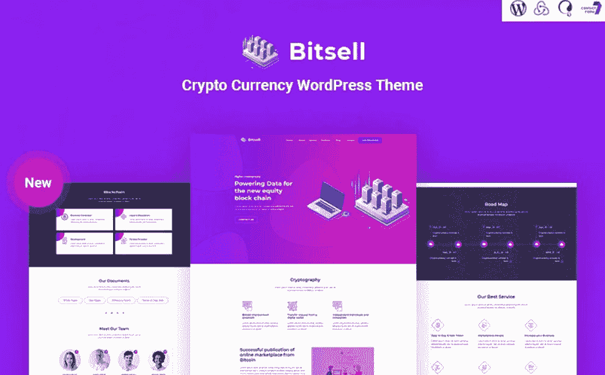
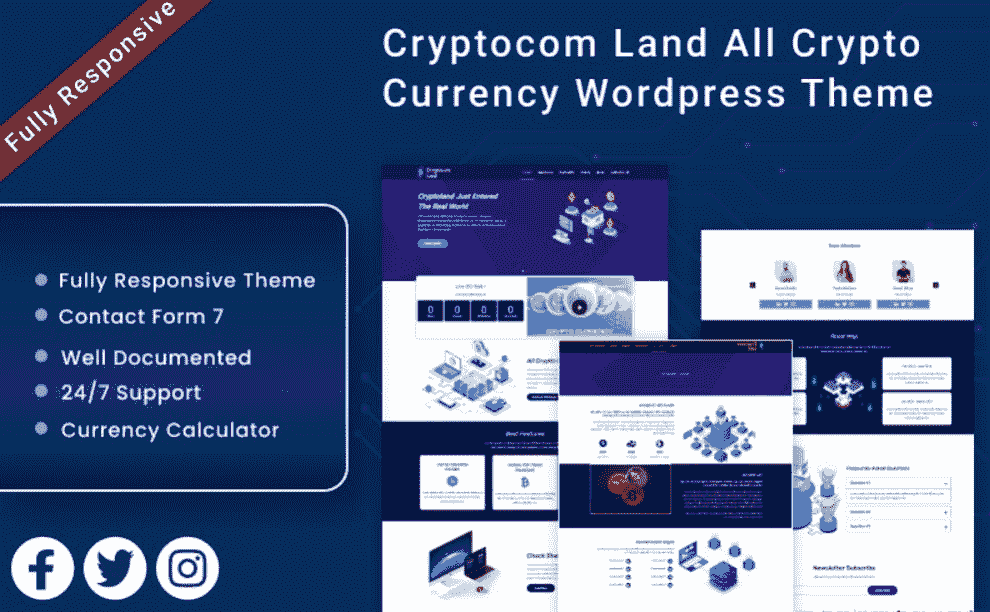

# 十大加密货币网站模板:值得投资吗？

> 原文：<https://medium.com/javarevisited/top-10-cryptocurrency-website-templates-is-it-worth-investing-in-them-eb9078644ef3?source=collection_archive---------0----------------------->

如果你在几年前向一个朋友提到[“加密货币”](https://javarevisited.blogspot.com/2022/01/5-best-courses-to-learn-cryptocurrency.html)，他们会想象出某种影子金融系统，穿着黑色衣服的交易员坐在巨大的计算机系统旁边。

今天，你不仅会在不同的商业新闻中听到这个词，还会在各大出版物的版面上看到这个词。2022 年投资[加密货币](https://www.coursesrank.com/2022/03/top-10-courses-to-learn-trade.html)有可能致富。

然而，也有可能失去你的全部投资。投资加密资产的决定可能令人害怕，但也可能非常有利可图。今天我们要浏览十个[加密货币网站模板](https://www.templatemonster.com/category/cryptocurrency-website-templates?aff=javarevisited&utm_campaign=cryptocurrencytemplates&utm_source=javarevisited&utm_medium=referral)，以满足不同的品味和需求。

# 10 个加密货币网站模板:最有价值的选择

以下是为 WordPress 准备的 10 个最好的网站模板。

## 1. [Alternat — ICO 加密货币响应比特币 WordPress 主题](https://www.templatemonster.com/wordpress-themes/alternat-ico-cryptocurrency-responsive-bitcoin-wordpress-theme-187965.html?aff=javarevisited&utm_campaign=cryptocurrencytemplates&utm_source=javarevisited&utm_medium=referral)

**Alternat** 是最好的加密货币 WordPress 主题之一。它适合那些需要建立一个货币转换器或代币销售网站。它的软件包附带了一个用户友好的 Elementor 页面生成器，使专家和新手都可以体验实时内容编辑过程。

您还将获得 18 种不同的页眉样式和 10 种完全可定制的页脚变体。毫无疑问，它具有完全响应的设计，适用于所有现代媒体设备。因此，没有必要控制网站的每个版本。

主要特点:

*   谷歌字体；
*   联系方式；
*   Woocommerce 能力；
*   菜单和按钮定制；
*   添加了视频。

你可以在这里免费下载这个模板— [**在 monster one**T3【免费下载】](https://www.templatemonsterpreview.com/demo/187965.html?aff=javarevisited&utm_campaign=cryptocurrencytemplates&utm_source=javarevisited&utm_medium=referral)

## 2. [Digmone —加密货币服务 HTML5 登陆页面模板](https://www.templatemonster.com/landing-page-template/digmone-crypto-currency-services-html5-landing-page-template-187462.html?aff=javarevisited&utm_campaign=cryptocurrencytemplates&utm_source=javarevisited&utm_medium=referral)

有许多加密货币网站模板值得您关注，它是最现代和最复杂的选项之一。它也适合那些正在寻找金融和投资现成解决方案的人。

该包包括许多预先设计的部分。其中，你会发现服务，证明书，和价格表。所有这些功能将使你的网站更加可靠，并激发更大的信任。除此之外，人们还可以通过直接的联系方式与你自由交流。

主要特点:

*   视差效应；
*   博客功能；
*   背景视频；
*   图库功能；
*   团队成员。

**这里是免费下载该模板的链接—** [在 MonsterONE](https://www.templatemonster.com/monsterone/tm-membership/?id=187462?aff=javarevisited&utm_campaign=cryptocurrencytemplates&utm_source=javarevisited&utm_medium=referral) 中免费下载

## 3.[Cryptoz——加密货币登陆页面元素或 WordPress 主题](https://www.templatemonster.com/wordpress-themes/cryptoz-cryptocurrency-landing-page-elementor-wordpress-theme-217170.html?aff=javarevisited&utm_campaign=cryptocurrencytemplates&utm_source=javarevisited&utm_medium=referral)

用这个创新的 WordPress 主题来构建一个基于加密的项目将不会花费你任何东西。不管你是否有专业的网站建设技能。

有多种选择可以帮助你尽快获得单页或多页网站。一个了不起的元素或页面生成器是你的好帮手，即使你不熟悉编程。

该软件包还将为您提供不同的定制插件。不要忘记谷歌字体，这将使你的内容更具可读性和引人注目。

主要特点:

*   联系方式；
*   一键导入；
*   演示内容；
*   下拉菜单；
*   谷歌地图。

**这里是免费下载该模板的链接—** [在 MonsterONE](https://www.templatemonster.com/monsterone/tm-membership/?id=217170?aff=javarevisited&utm_campaign=cryptocurrencytemplates&utm_source=javarevisited&utm_medium=referral) 中免费下载

## 4.Cryptonio 加密货币 ICO 登录页面 HTML 模板

您是否正在寻找加密货币网站模板，以使您的登录页面每天都受欢迎？在这种情况下，利用这个设计精美的模板将是明智的。添加关于贵公司的信息和其他商业细节将会很容易。还有机会分享您的团队成员简介。由于订阅了时事通讯，人们将有机会成为你的订户。这是不可能忘记的接触形式，让您的观众变得更接近你的团队。

主要特点:

*   完全响应的设计；
*   博客功能；
*   社交媒体整合；
*   路线图；
*   服务描述。

[详情](https://www.templatemonster.com/landing-page-template/cryptonio-cryptocurrency-ico-landing-page-html-template-217434.html?aff=javarevisited&utm_campaign=cryptocurrencytemplates&utm_source=javarevisited&utm_medium=referral) | [演示](https://www.templatemonsterpreview.com/demo/217434.html?aff=javarevisited&utm_campaign=cryptocurrencytemplates&utm_source=javarevisited&utm_medium=referral)

# 投资——企业博客元素或主题

你最近是否在考虑推出一个非常受欢迎和有吸引力的加密货币博客？在这种情况下，为了您的高效工作，您最好选择类似这个令人惊叹的选项。它也适合那些需要在线项目来了解金融、现代经济趋势和公司新闻的人。一键式安装过程允许您在瞬间开始使用插件和所有元素。此外，它还有一个奖金包，里面有不同用途的免费图片。博客功能使得分享更多有用的技巧成为可能。

主要特点:

*   下拉菜单；
*   全响应设计；
*   WPML 功能；
*   极简外观设计；
*   元素或页面生成器。

[详情](https://www.templatemonster.com/wordpress-themes/investory-corporate-blog-elementor-wordpress-theme-71318.html?aff=javarevisited&utm_campaign=cryptocurrencytemplates&utm_source=javarevisited&utm_medium=referral) | [在 MonsterONE](https://www.templatemonster.com/monsterone/tm-membership/?id=71318?aff=javarevisited&utm_campaign=cryptocurrencytemplates&utm_source=javarevisited&utm_medium=referral) 免费下载

# Bitsell —加密货币响应 WordPress 主题

使用这个精心设计且令人印象深刻的模板，您可以实现多个目标。实际上，对于所有类型的金融科技网站，包括区块链金融科技和其他网站，它都是一个很好的变体。它提供了一堆定制元素，将使您的业务取得成功。例如，它是一个用户友好的 Elementor 页面生成器，允许初学者在没有任何编码技能的情况下控制他们的在线项目。换句话说，您可以毫不费力地拖放必要的元素。不要忘记完全响应的设计，它非常适合不同类型的媒体设备。

主要特点:

*   联系方式；
*   谷歌字体；
*   惊艳的滑块；
*   砖石组合；
*   动画效果。

[详情](https://www.templatemonster.com/wordpress-themes/bitsell-crypto-currency-responsive-wordpress-theme-wordpress-theme-174362.html?aff=javarevisited&utm_campaign=cryptocurrencytemplates&utm_source=javarevisited&utm_medium=referral) | [在 MonsterONE 免费下载](https://www.templatemonster.com/monsterone/tm-membership/?id=174362?aff=javarevisited&utm_campaign=cryptocurrencytemplates&utm_source=javarevisited&utm_medium=referral)

# Cryptocom Land —所有加密货币网站模板

这是一个通用的数字货币网站模板，将满足您的所有需求。你将准备好买卖比特币或创建金融和商业咨询服务演示。一个完全响应的设计确保人们无论使用什么设备和屏幕分辨率都能浏览网站。你会很高兴得到一个货币计算器，它将帮助你在比特币之间转换任何数量的货币。通过订阅时事通讯，你的忠实读者无需花费什么就能获得最新的更新。加上博客页面，分享连接的提示和技巧请加密货币将是小菜一碟。

主要特点:

*   社交媒体整合；
*   与 WooCommerce 的兼容性；
*   包括奖金图像；
*   联系人页面；
*   关于我们和专题页。

[详情](https://www.templatemonster.com/wordpress-themes/cryptocom-land-all-crypto-currency-wordpress-theme-205162.html?aff=javarevisited&utm_campaign=cryptocurrencytemplates&utm_source=javarevisited&utm_medium=referral) | [在 MonsterONE](https://www.templatemonster.com/monsterone/tm-membership/?id=205162?aff=javarevisited&utm_campaign=cryptocurrencytemplates&utm_source=javarevisited&utm_medium=referral) 免费下载

# Minha —加密货币响应网站模板

正如您所了解的，有许多加密货币网站模板，这一富有表现力的选项非常值得您关注。它的软件包将为您提供不同的功能和定制工具，允许您获得一个从人群中脱颖而出的定制网站。首先，您可以利用一键式安装过程，让您的在线项目在瞬间启动并运行。由于一个强大的 Elementor 页面生成器，获得网站的自由非常简单。为了向国际观众传播这个词，请确保使用 WPML 插件。

主要特点:

*   20 种不同的页眉风格；
*   10 个页脚变体；
*   谷歌字体；
*   添加了视频；
*   旋转木马已添加。

[详情](https://www.templatemonster.com/website-templates/minha-cryptocurrency-responsive-website-template-195269.html?aff=javarevisited&utm_campaign=cryptocurrencytemplates&utm_source=javarevisited&utm_medium=referral) | [在 MonsterONE 免费下载](https://www.templatemonster.com/monsterone/tm-membership/?id=195269?aff=javarevisited&utm_campaign=cryptocurrencytemplates&utm_source=javarevisited&utm_medium=referral)

# coin grove——比特币和加密货币元素或 WordPress 主题

一个专业外观和卓越的 WordPress 主题，尽其所能用一个独特的站点证明你。它有很多先进的功能，包括砖石博客，自定义功能，和一个图片库布局。人们会很高兴看到你的主页风格。请记住，您可以在没有专家帮助的情况下，使用一个优秀的 Elementor 页面生成器来更改所有必要的元素。若要添加更多视觉内容，请确保使用 YouTube 和 Vimeo 视频。还有一个客户评价滑块，可以让你的潜在客户对你的服务更有信心。

主要特点:

*   具有宽布局和内容布局的作品集；
*   一键演示安装；
*   类别过滤器；
*   团队成员以令人惊叹的悬停进行列表；
*   社交媒体分享。

[详情](https://www.templatemonster.com/wordpress-themes/coingrove-bitcoin-amp-cryptocurrency-elementor-wordpress-theme-188787.html?aff=javarevisited&utm_campaign=cryptocurrencytemplates&utm_source=javarevisited&utm_medium=referral) | [在 MonsterONE](https://www.templatemonster.com/monsterone/tm-membership/?id=188787?aff=javarevisited&utm_campaign=cryptocurrencytemplates&utm_source=javarevisited&utm_medium=referral) 免费下载

# cryptotend-ICO 和加密货币 HTML 模板

这个加密货币网站模板的惊人例子特别适用于加密货币挖掘和交换在线项目。然而，它也允许为顾问、顾问和加密货币机构建立网站。该软件包提供了建立一个创新网站的所有基本选项。一个原始的主页有深色和浅色两种配色方案。它有精心设计的块，你可以根据你的视觉和喜好编辑和定制。为了尽快建立一个网站，该软件包提供了一个点击演示导入程序。

主要特点:

*   全响应设计；
*   博客功能；
*   联系方式；
*   时事通讯订阅；
*   社交媒体整合。

[详情](https://www.templatemonster.com/website-templates/cryptotend-ico-amp-cryptocurrency-html-template-228726.html?aff=javarevisited&utm_campaign=cryptocurrencytemplates&utm_source=javarevisited&utm_medium=referral) | [在 MonsterONE 免费下载](https://www.templatemonster.com/monsterone/tm-membership?aff=javarevisited&utm_campaign=cryptocurrencytemplates&utm_source=javarevisited&utm_medium=referral/?id=228726)

# 几句话作为结论

加密货币是一种现代融资策略，试图取代纸币或成为一种投资资产。它为大多数人，尤其是那些从未投资过传统资产的人，提供了通过买卖密码赚钱的机会。加密货币的起源可能看起来令人费解，但实际上很简单。首先，你可以从加密货币交易所购买加密货币。当你得到它们时，转账或收款都不会花你一分钱。出于这个原因，最好现在就开始寻找[加密货币 WordPress 主题](https://www.templatemonster.com/category/cryptocurrency-wordpress-themes?aff=javarevisited&utm_campaign=cryptocurrencytemplates&utm_source=javarevisited&utm_medium=referral)和 HTML 模板。感谢阅读！