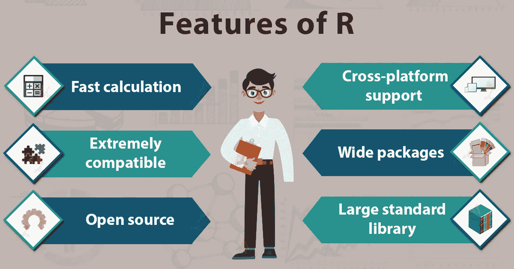
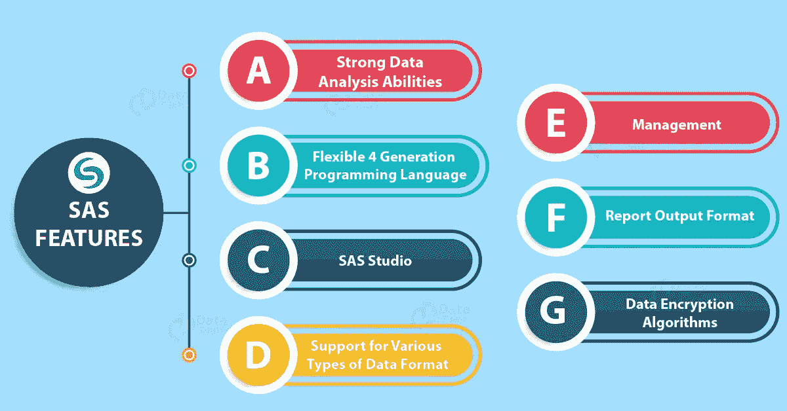
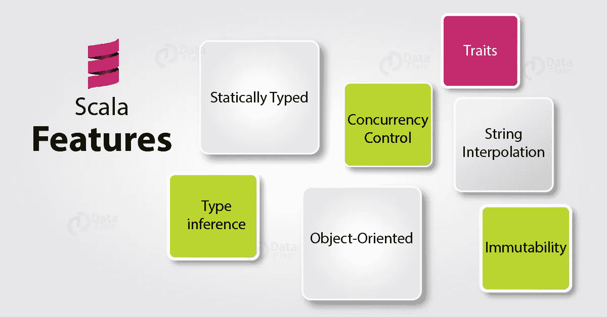

# 2020 年十大数据科学和机器学习编程语言

> 原文：<https://medium.com/javarevisited/top-10-data-science-machine-learning-programming-languages-for-2020-1bd02ee10e48?source=collection_archive---------1----------------------->

## 2020 年你必须知道的数据科学技能

在当今高度集中的市场中，预计将进一步加强，数据科学有志者还没有根据行业需求提升技能和更新自己的解决方案。winning environment 归功于市场上数据科学家和其他数据专家的需求和供应比例不匹配，这构成了一个抓住更好和动态机会的伟大时代。

像 **R、Python、Julia、SQL** 等能够更好地强化数据科学产业的编程语言的知识和使用是必须具备的。

[***学习 Python 成为数据科学家！***](https://techvidvan.com/tutorials/python-tutorial/)

软件开发人员喜欢争论哪种编程语言是最好的。尽管如此，衡量什么是“最好”的标准是令人困惑的。当我们讨论数据科学和机器学习领域的软件开发时，这个问题是永恒的，并且永远不会失去它的重要性。

最有用的编程语言需要语法和使用的简单性，这是抽象的，然而，诸如类型安全性、速度、库和网络支持等因素绝对不是。因此，让我们来看看数据科学和机器学习的十大编程语言。

沿着这些思路，我在这里列出了 2020 年十大数据科学&机器学习编程语言 的清单，有志之士需要知道如何改善他们的职业生涯。

1.  **Python:**

Python 在所有其他编程语言中占有重要地位。它是一种面向对象的、开源的、易于学习的、适应性强的编程语言，并且拥有为数据科学创建的丰富的库和工具。同样，Python 有一个巨大的网络基础，开发者和数据科学家可以在这里提出他们的问题，并回答其他人的问题。数据科学使用 Python 已经有一段时间了，它一直是数据科学家和开发人员的首选。

 [## 2020 年学习 Python 3 的前 5 门课程——最好的

### 2018 年学习 Python 3 的一些最好的在线课程的集合。Python 是最强大而简单的…

javarevisited.blogspot.com](https://javarevisited.blogspot.com/2018/03/top-5-courses-to-learn-python-in-2018.html) 

**2。R:**

r 是一种独特的语言，有一些真正有趣的亮点，这些亮点是不同语言所没有的。这些亮点对于数据科学应用具有重要意义。

[***学 R 成为数据科学明星！***](https://techvidvan.com/tutorials/r-tutorial/)

作为一种向量语言，R 可以一次做很多事情，函数可以被添加到一个特定的向量中，而不用把它放在一个循环中。随着 R 的强度被认识到，它在一个不同的地方找到了用途，从金融研究到遗传学、医学和生物学。

**3。SAS :**

像 R 一样，您可以利用 SAS 进行统计分析。主要的区别是 SAS 不像 r 一样是开源的。尽管如此，它可能是最古老的用于测量的语言。SAS 语言的开发者建立了他们自己的软件套件，用于前沿分析、预见性显示和商业智能。

SAS 是高度可靠的，并得到了专家和分析师的特别肯定。寻求稳定且经过验证的平台的组织使用情景应用程序来满足其分析需求。虽然 SAS 可能是一个闭源软件，但它为统计分析和机器学习提供了广泛的库和包。

**4。SQL:**

SQL(结构化查询语言)是一种特定于领域的语言，用于编程，设计用于组织关系数据库管理系统中的数据。由于数据科学家的工作是将原始数据转化为重要的知识，因此他们基本上使用 SQL 进行数据恢复。要成为一名强大的数据科学家，他们应该知道如何利用 SQL 语言从数据库中获取和集中数据。

**5。Scala:**

Scala 也称为可伸缩语言，是 Java 语言的扩展。它运行在 Java 虚拟机(JVM)上，是实际处理大数据的公认语言之一。Scala 对数据科学家来说是一个重要的工具，因为它既支持未知函数，也支持高要求函数。

[***掌握 Scala 元组的概念***](https://techvidvan.com/tutorials/scala-tuples/)

Scala 被许多人所偏爱，因为它稳定、适应性强、速度快且功能多样。与 Python 相比，Scala 中的编码组织和完成要快得多。你可以应用 Scala 来制作运行大数据的盈利项目。

**6。Java:**

Java 可能是用于商业开发的最古老的语言。Spark、Flink、Hive、Spark 和 Hadoop 等大多数知名大数据工具都是用 Java 编写的。

它拥有数量惊人的用于机器学习和数据科学的库和工具。其中一些是 Weka、Java-ML、MLlib 和 Deeplearning4j，以解决大部分 ML 或数据科学问题。此外，Java 9 得到了被错过的 REPL，它鼓励迭代开发。

**7。Javascript:**

数据科学家应该了解 Javascript，因为它在数据可视化方面超出了预期。有许多库简化了 js 在可视化中的使用，D3.js 就是其中之一，并且在这方面也非常令人惊讶。随着 2018 年发布的 Tensorflow.js，该语言目前已配备为 JavaScript 开发者带来机器学习-在浏览器和服务器端。

**8。Tableau:**

Tableau 是当今数据科学和商业智能专家使用的最著名的数据可视化工具之一。它让你能够以一种智慧和丰富多彩的方式进行深刻而有效的表达。

它的用途不仅仅是制作传统的图表。您可以利用它来挖掘重要的体验，因为它提供了大量的亮点和定制。

**9。朱莉娅:**

Julia 在数据科学和机器学习领域越来越受重视。一些专家现在将它与 Python 进行对比，这可能不合时宜，但这并没有减少 Julia 最稀缺的能力。

这种编程语言是现代的、精英的、重要的和值得注意的，是由一群麻省理工学院的数学家和计算机科学家开发的。它是开源的，通常用于数据操作和逻辑计算。如果你以前接触过 Matlab、R 或 Python，你会很快适应 Julia。Julia 的速度使其成为机器学习和数据科学的惊人语言。

**10。** **MATLAB:**

MATLAB 本地支持传感器、图片、视频、遥测、二进制和其他格式。它提供了洞察力和机器学习有用性的完整安排，以及尖端技术，例如，非线性优化、系统 ID 和大量用于图片和视频处理的预建算法、与金钱相关的建模、控制框架结构。它的数字调度直接扩展到云和集群上的并行处理。

**结尾:**

**数据科学** & **机器学习**是本世纪最热门的两个领域&在 it 行业发展是你能实现的最大梦想。数据科学和机器学习语言的领域很广，然而 **R** 和 **Python** 是最受欢迎的语言，但是我们的目标是告诉您如何使用这些不同的语言。

[***拿这个 Python 新年决议吧！！***](https://techvidvan.com/tutorials/python-tutorial/)

如果你想学 Python，需要资源，也可以看看这个 2020 年顶级 Python 课程[列表:](/better-programming/top-5-courses-to-learn-python-in-2018-best-of-lot-26644a99e7ec)

 [## 2020 年学习 Python 3 的前 5 门课程——最好的

### 2018 年学习 Python 3 的一些最好的在线课程的集合。Python 是最强大而简单的…

javarevisited.blogspot.com](https://javarevisited.blogspot.com/2018/03/top-5-courses-to-learn-python-in-2018.html)