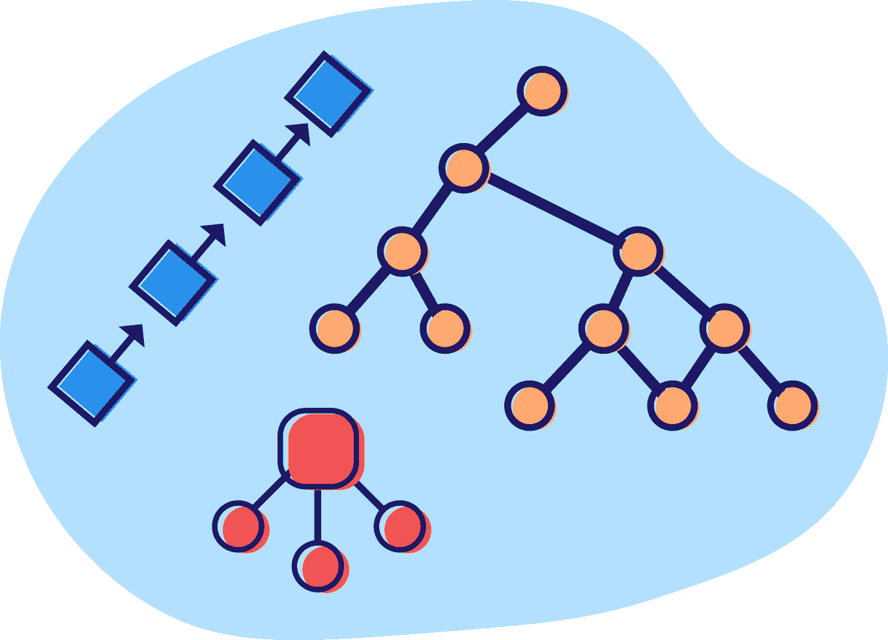
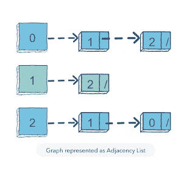
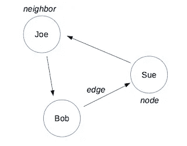
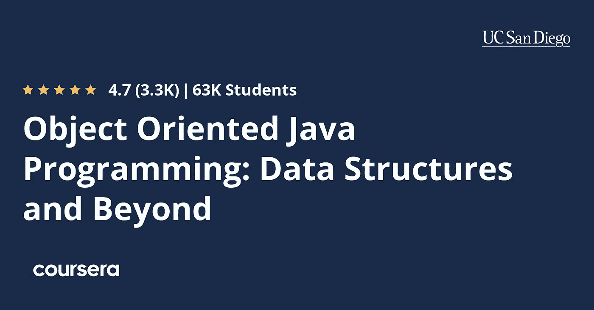
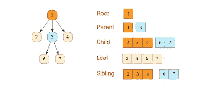
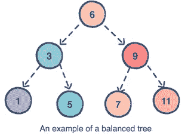
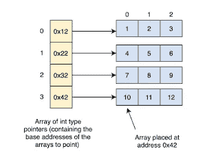
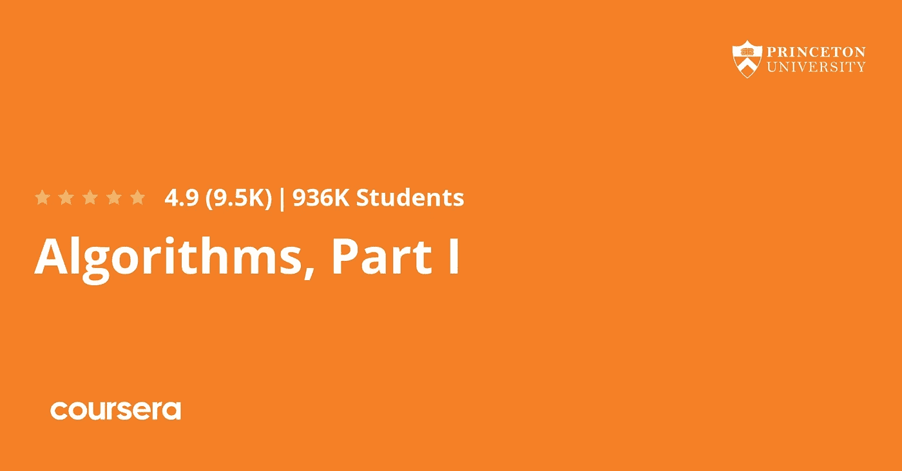
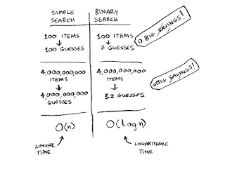

# 2023 年面向 Java 开发者的 10 门最佳数据结构和算法课程

> 原文：<https://medium.com/javarevisited/top-10-data-structure-and-algorithms-courses-for-java-developers-25161ee2edc0?source=collection_archive---------0----------------------->

## 这些是学习 Java 中数据结构和算法的最好的在线课程，其中**包含免费和付费课程**。

image_credit —教育性

大家好，如果你想在 2023 年**学习数据结构和算法**并寻找最好的资源，那么你来对地方了。以前我分享过很多有用的资源像 [**最佳数据结构书籍**](/javarevisited/10-best-books-for-data-structure-and-algorithms-for-beginners-in-java-c-c-and-python-5e3d9b478eb1?source=collection_home---4------3-----------------------) 和[教程](https://www.java67.com/2013/08/ata-structures-in-java-programming-array-linked-list-map-set-stack-queue.html)无论是初学者还是有经验的程序员学习数据结构和算法。我也分享过很多像[这种](http://www.java67.com/2018/06/data-structure-and-algorithm-interview-questions-programmers.html)的数据结构和算法面试题以及它们在 Java 中的解法。

尽管如此，我还是不断收到关于学习 Java 数据结构和算法的最佳在线课程的查询。

即使主题完全独立于编程语言，Java 开发人员肯定喜欢用 Java 教授数据结构和算法的在线课程，这就是为什么我最近关于[最佳算法课程](https://javarevisited.blogspot.com/2018/11/top-5-data-structures-and-algorithm-online-courses.html#axzz5YFaOvjsh)的帖子没有打动我的读者，其中包括来自 [JavaScript](/javarevisited/12-free-courses-to-learn-javascript-and-es6-for-beginners-and-experienced-developers-aa35874c9a32) 和 [Python](/swlh/5-free-python-courses-for-beginners-to-learn-online-e1ca90687caf) 的算法课程。

他们中的一些人还要求[免费的算法课程](https://javarevisited.blogspot.com/2018/01/top-5-free-data-structure-and-algorithm-courses-java--c-programmers.html)而不是付费的，而另一些人则对这种优秀的课程感到满意，不管它是免费的还是付费的。

为了实现我的承诺，我做了更多的研究，并带来了一份新的 Java 数据结构和算法课程清单，其中包含免费和付费课程。

像《深度潜入 Java》这样的一些课程在我之前的列表中很常见，显然是因为这是学习 Java 中算法和数据结构的最佳路径之一。但是，列表中也包含了一些新的课程，如[**数据结构和算法训练营**](https://click.linksynergy.com/deeplink?id=JVFxdTr9V80&mid=39197&murl=https%3A%2F%2Fwww.udemy.com%2Fdata-structures-and-algorithms-bootcamp%2F) **。**

 [## 数据结构和算法训练营

### 本课程旨在让您快速掌握基本的计算机科学概念，您将成为…

udemy.com](https://click.linksynergy.com/deeplink?id=JVFxdTr9V80&mid=39197&murl=https%3A%2F%2Fwww.udemy.com%2Fdata-structures-and-algorithms-bootcamp%2F) 

这一次，我更加关注寻找以有趣和令人兴奋的方式教授基本数据结构的课程，而不是选择涵盖大量数据结构和算法的课程，但没有做到公正。我加入多门课程的另一个原因是，并不是每个人都和我喜欢的老师有联系。每个人都是不同的，他们应该只参加那些他们可以和老师交流的课程，我的意思是他们喜欢声音，解释的风格，和内容本身。如果你参加一个课程，那里的老师既博学又热情，而且有很好的教学技巧，你显然会学到更多的东西，并能长时间保留这些知识。这就是本文的目标，提供在线培训课程和认证，让您的时间和金钱都物有所值。

# 10 大最佳 Java 数据结构和算法课程、课堂、教程和认证

为了不浪费你更多的时间，这里是我为 Java 程序员列出的学习数据结构和算法的一些最好的在线培训课程。

我很小心地选择了用 Java 给出例子的课程，除了最后一本，那是一本有 [Python 例子](/javarevisited/8-projects-you-can-buil-to-learn-python-in-2020-251dd5350d56)的书，抱歉我忍不住告诉你们关于 *Grokking Algorithm book* 的事，我很欣赏它。

## 1.[数据结构和算法:使用 Java 进行深入研究](https://click.linksynergy.com/deeplink?id=JVFxdTr9V80&mid=39197&murl=https%3A%2F%2Fwww.udemy.com%2Fcourse%2Fdata-structures-and-algorithms-deep-dive-using-java%2F)

对于任何想学习数据结构和算法的 Java 程序员来说，这是我的首选课程。这是一门综合性的课程，不仅涵盖数组、链表、二叉查找树、堆栈、队列、哈希表等基本数据结构，还包括堆等高级数据结构和计数排序、基数排序等算法以及其他常数时间排序算法。

还涵盖了大 O 记号，在编码面试的时候给你解释一个解决方案是相当重要的。这是一门付费课程，但不要担心 200 美元的价格，你可以在各种 Udemy 销售上以 10 美元的价格买到它，几乎节省了 90%。

**这里是加入本课程的链接**——[数据结构与算法:Java 的深度应用](https://click.linksynergy.com/deeplink?id=JVFxdTr9V80&mid=39197&murl=https%3A%2F%2Fwww.udemy.com%2Fcourse%2Fdata-structures-and-algorithms-deep-dive-using-java%2F)

## 2.[易于高级的数据结构](https://click.linksynergy.com/deeplink?id=JVFxdTr9V80&mid=39197&murl=https%3A%2F%2Fwww.udemy.com%2Fintroduction-to-data-structures%2F)

这是一门在 Udemy 上学习数据结构和算法的优秀课程。作者是前 Google 软件工程师，他对数据结构和算法有很深的了解。

该课程还充满了可视化图表和有用的动画，这对理解数据结构和算法如何工作至关重要。超过 23000 名学生已经从这个免费课程中受益，如果你想开始你的数据结构之旅，没有比这个更好的在线课程了。

**这里是加入本课程的链接**——[轻松进阶数据结构](https://click.linksynergy.com/deeplink?id=JVFxdTr9V80&mid=39197&murl=https%3A%2F%2Fwww.udemy.com%2Fintroduction-to-data-structures%2F)

## 3.[图论算法](https://click.linksynergy.com/deeplink?id=JVFxdTr9V80&mid=39197&murl=https%3A%2F%2Fwww.udemy.com%2Fgraph-theory-algorithms%2F)

这是另一门关于算法的精彩课程，由前一节课的讲师威廉·费塞特教授。这门课其实是对他上一门课的补充，因为它涵盖了 Graph 这样的高级数据结构，而这一点往往是程序员所忽略的。

如果你知道，这个图可以表示任何彼此相关的东西，比如用道路连接的城市，用电缆连接的路由器，甚至是脸书用户和朋友的联系。

课程**涵盖了基本的图算法**，如广度优先搜索算法、深度优先搜索算法、Dijkstra 算法、非循环图上的最短/最长路径、旅行商问题(TSP)等等。

**这里是加入本课程** — [图论算法](https://click.linksynergy.com/deeplink?id=JVFxdTr9V80&mid=39197&murl=https%3A%2F%2Fwww.udemy.com%2Fgraph-theory-algorithms%2F)的链接

本课程的目标是教你在现实世界中应用图论。由于图可以用于许多常见的现实世界问题，了解图论有助于更好地可视化问题。图算法最显著的优点是它可以表示关系，比如两个人是如何联系的。你可能不知道，但许多社交网站，如脸书、Twitter，使用图算法来找到你的朋友、同事和其他你可能认识的人。

## 4.[面向对象的 Java 编程:数据结构和超越专门化](https://coursera.pxf.io/c/3294490/1164545/14726?u=https%3A%2F%2Fwww.coursera.org%2Fspecializations%2Fjava-object-oriented)

对于 Java 程序员来说，这是关于数据结构和算法的最好的专业课程之一。如果你知道一门 [Coursera specialization](/javarevisited/top-10-coursera-certificates-to-start-your-career-in-cloud-data-science-ai-mainframe-and-it-558690c83587) 是相关课程的组合，旨在培养技能，并且在你完成所有课程并完成要求的项目后提供证书。

本专业有 5 门课程，不仅会教你数据结构，还会教你如何掌握你的软件工程面试。

这里是这个专精所包含的课程列表:
**1。**[**Java 面向对象编程**](https://coursera.pxf.io/c/3294490/1164545/14726?u=https%3A%2F%2Fwww.coursera.org%2Flearn%2Fobject-oriented-java) **2。** [**数据结构与性能**](https://coursera.pxf.io/c/3294490/1164545/14726?u=https%3A%2F%2Fwww.coursera.org%2Flearn%2Fdata-structures-optimizing-performance) **3。**[**Java 高级-数据结构**](https://coursera.pxf.io/c/3294490/1164545/14726?u=https%3A%2F%2Fwww.coursera.org%2Flearn%2Fadvanced-data-structures) **4。** [**精通软件工程面试**](https://coursera.pxf.io/c/3294490/1164545/14726?u=https%3A%2F%2Fwww.coursera.org%2Flearn%2Fcs-tech-interview) **5。顶点:分析(社交)网络数据**

**这里是加入本课程的链接** — [面向对象的 Java 编程:数据结构和超越专门化](https://coursera.pxf.io/c/3294490/1164545/14726?u=https%3A%2F%2Fwww.coursera.org%2Fspecializations%2Fjava-object-oriented)

如果你想学习 Java 中的[数据结构和算法，并想为面试做准备，这对你来说可能是一个有价值的资源。](https://dev.to/javinpaul/10-best-books-to-learn-data-structure-and-algorithms-in-java-python-c-and-c-5743)

如果你发现 Coursera 的课程很有用，因为它们是由知名公司如**谷歌**、 **IBM** 、**亚马逊**和世界上最好的大学创建的，我建议你加入 Coursera 的年度订阅计划 [**Coursera Plus**](https://coursera.pxf.io/c/3294490/1164545/14726?u=https%3A%2F%2Fwww.coursera.org%2Fcourseraplus) 。

这种单次订阅可以让你无限制地访问他们最受欢迎的**课程**、**专业化**、**专业证书**和**指导项目**。它每年花费大约 399 美元，但它完全物有所值，因为你可以获得无限证书。

 [## Coursera Plus |无限制访问 7，000 多门在线课程

### 用 Coursera Plus 投资你的职业目标。无限制访问 90%以上的课程、项目…

coursera.pxf.io](https://coursera.pxf.io/c/3294490/1164545/14726?u=https%3A%2F%2Fwww.coursera.org%2Fcourseraplus) 

## 5.Java 中的数据结构:一个访谈复习者

这是一门极好的进修课程，旨在帮助 Java 程序员学习典型的数据结构和算法。所有代码示例都用 Java 呈现，便于学习和理解。

如果你正在准备[编码面试](https://codeburst.io/100-coding-interview-questions-for-programmers-b1cf74885fb7)，那么你可以查看这个课程来刷新你的数据结构和算法技能。

**下面是加入本课程的链接**—[Java 中的数据结构:一次复习面试](https://www.educative.io/collection/5642554087309312/5724822843686912?affiliate_id=5073518643380224)

## 6.[数据结构与算法训练营](https://click.linksynergy.com/deeplink?id=JVFxdTr9V80&mid=39197&murl=https%3A%2F%2Fwww.udemy.com%2Fdata-structures-and-algorithms-bootcamp%2F)【我的课程】

这是一个完美的课程，适合任何准备编码面试的人，并希望提高他们的数据结构和算法技能。

在本课程中，您不仅将了解数组、[链表、](https://dev.to/javinpaul/review-these-linked-list-interview-questions-before-your-java-python-or-c-programming-interviews-35o4)[哈希表、](https://www.java67.com/2013/02/10-examples-of-hashmap-in-java-programming-tutorial.html)、二叉树、堆和[排序算法](https://hackernoon.com/top-20-searching-and-sorting-algorithms-interview-questions-5a476121fd0f)等基本数据结构，还将了解整个编码面试流程以及如何解决那些常见的编码面试问题。

**这里是加入本课程** — [数据结构与算法训练营](https://click.linksynergy.com/deeplink?id=JVFxdTr9V80&mid=39197&murl=https%3A%2F%2Fwww.udemy.com%2Fdata-structures-and-algorithms-bootcamp%2F)的链接

## 7.[数据结构第一部分和第二部分](https://pluralsight.pxf.io/c/1193463/424552/7490?u=https%3A%2F%2Fwww.pluralsight.com%2Fcourses%2Fads-part1)【多视角教程】

这是一门学习数据结构和算法的优秀入门课程。在本课程中，您不仅将学习日常应用中使用的核心数据结构和算法，还将了解选择每种数据结构的利弊，以及遍历、检索和更新算法。

这是一个分为两部分的课程，第一部分包括[链表](https://hackernoon.com/top-20-linked-list-coding-problems-from-programming-job-interviews-756d4a2bf652)、[栈](https://www.java67.com/2013/08/ata-structures-in-java-programming-array-linked-list-map-set-stack-queue.html)、[队列](https://javarevisited.blogspot.com/2017/03/difference-between-stack-and-queue-data-structure-in-java.html#axzz5dxZIUUxy)、[二叉树](https://www.java67.com/2020/02/top-40-binary-tree-interview-questions.html)和哈希表，第二部分包括数据排序、字符串搜索、集合、AVL 树和并发性问题。

**这里是加入本课程** — [数据结构第一部分和第二部分](https://pluralsight.pxf.io/c/1193463/424552/7490?u=https%3A%2F%2Fwww.pluralsight.com%2Fcourses%2Fads-part1)的链接

顺便说一下，你需要一个 [**Pluralsight 会员**](https://javarevisited.blogspot.com/2019/10/udemy-vs-pluralsight-review-which-is-better-to-learn-code.html) 才能进入这个课程，费用大约为 29 美元/月或 299 美元/年，但如果你想探索，你也可以通过注册他们的 10 天免费试用来免费检查。

 [## Udemy vs Pluralsight Review 2023 -学编码和编程哪个好？

### 伙计们，你们好吗？我再次回答了在线学习者的一个常见疑问…

javarevisited.blogspot.com](https://javarevisited.blogspot.com/2019/10/udemy-vs-pluralsight-review-which-is-better-to-learn-code.html) 

## 8.[算法，第一部分](https://coursera.pxf.io/c/3294490/1164545/14726?u=https%3A%2F%2Fwww.coursera.org%2Flearn%2Falgorithms-part1)【Coursera 免费课程】

这是关于数据结构和算法的最受欢迎的在线课程之一，不仅在 Coursera 上，在其他学习门户网站上也是如此。

如果你读过[**Algorithms 4th Editio**](http://www.amazon.com/Algorithms-4th-Edition-Robert-Sedgewick/dp/032157351X?tag=javamysqlanta-20)n，这是一本针对 Java 开发人员的较好的数据结构书籍，那么你会惊讶地发现，这门课程就是基于这本书，而且教师也是这本书的作者。这是一门分为两部分的课程，第一部分包括基本的数据结构、排序和搜索算法。该课程是免费的，100%在线，这意味着你可以根据自己的时间表学习。

**这里是加入本课程** — [算法的链接，第一部分](https://coursera.pxf.io/c/3294490/1164545/14726?u=https%3A%2F%2Fwww.coursera.org%2Flearn%2Falgorithms-part1)

顺便说一下，如果你计划参加多个 Coursera 课程或专业，那么考虑参加 [**Coursera Plus 订阅**](https://coursera.pxf.io/c/3294490/1164545/14726?u=https%3A%2F%2Fwww.coursera.org%2Fcourseraplus) n，它可以让你无限制地访问他们最受欢迎的课程、专业、专业证书和指导项目。

 [## Coursera Plus |无限制访问 7，000 多门在线课程

### 用 Coursera Plus 投资你的职业目标。无限制访问 90%以上的课程、项目…

coursera.pxf.io](https://coursera.pxf.io/c/3294490/1164545/14726?u=https%3A%2F%2Fwww.coursera.org%2Fcourseraplus) 

## 9.[算法，第二部分](https://coursera.pxf.io/c/3294490/1164545/14726?u=https%3A%2F%2Fwww.coursera.org%2Flearn%2Falgorithms-part2)【免费 Coursera 课程】

这是普林斯顿大学算法课程的第二部分，由计算机科学教授凯文·韦恩和罗伯特·塞奇威克授课。

在第一部分中，您将学习基本的数据结构、排序和[搜索算法](https://javarevisited.blogspot.com/2019/04/top-20-searching-and-sorting-algorithms-interview-questions.html)，而在这一部分中，您将学习 n 种图形和字符串处理算法。

大约需要 32 个小时完成，课程有英语和韩语两种版本。每周的家庭作业也令人印象深刻，有助于你记住所学的知识。

**下面是本课程** — [算法的链接，第二部分](https://coursera.pxf.io/c/3294490/1164545/14726?u=https%3A%2F%2Fwww.coursera.org%2Flearn%2Falgorithms-part2)

## 10 [搜索算法](https://www.amazon.com/Grokking-Algorithms-illustrated-programmers-curious/dp/1617292230/?tag=javamysqlanta-20)

这不是一门在线课程，而是一本我非常欣赏的书。这是我最近读过的关于数据结构和算法的最好的书之一。它不像 CLRS 或 Thomas H. Cormen 的《算法简介》那样全面，但读起来要舒服和愉快得多。

它没有涵盖所有的数据结构和算法，但无论涵盖什么，它都涵盖得很好。它充满了可视化图表，这使得学习更有吸引力，并有助于更好地理解关键概念。

**这里是购买这本书的链接**——[搜索算法](https://www.amazon.com/Grokking-Algorithms-illustrated-programmers-curious/dp/1617292230/?tag=javamysqlanta-20)

总的来说，简单地说，对任何初学者来说都是最好的算法书，强烈推荐给任何想学习算法的人。只有一件事你可能不喜欢，那就是这些例子是用 Python 而不是 Java 编写的，但是这个理论非常棒，仅此一点就值得一提。

## 11.[Java 中的数据结构介绍&算法— LinkedIn 学习](http://linkedin-learning.pxf.io/c/1193463/449670/8005?u=https%3A%2F%2Fwww.linkedin.com%2Flearning%2Fintroduction-to-data-structures-algorithms-in-java)

这是另一个学习 Java 数据结构和算法的好课程，它来自 LinkedIn Learning，LinkedIn 的一个教育网站，包含学习最新技术的有用课程。

在本课程中，讲师 Raghavendra Dixit 将介绍如何使用 Java 编写代码来实现数据结构和算法。在解释了研究这些主题的好处之后，他回顾了算法分析并讨论了数组——一种在大多数编程语言中都存在的数据结构

以下是您将在本课程中学到的主要技能:

1.  如何计算算法的时间和空间复杂度
2.  [递归](https://javarevisited.blogspot.com/2021/11/top-5-courses-to-learn-recursion-for.html)
3.  像数组和链表这样的数据结构
4.  [排队](https://javarevisited.blogspot.com/2022/02/-stack-and-queue-data-structure-interview-questions.html)
5.  [阵](/javarevisited/20-array-coding-problems-and-questions-from-programming-interviews-869b475b9121)
6.  堆

本课程还讲述了如何在 Java 中实现链表，包括堆栈、队列、递归、二分搜索法树、堆等等。

顺便说一句，你需要一个 Linkedin learning 会员资格来观看这个课程，如果你参加一个年度计划，每个月大约花费 18 美元。或者，你也可以使用他们的 [1 个月免费试用](http://linkedin-learning.pxf.io/c/1193463/449670/8005?u=https%3A%2F%2Fwww.linkedin.com%2Flearning%2Fintroduction-to-data-structures-algorithms-in-java)免费观看本课程。

 [## Java 在线课堂数据结构介绍&算法| LinkedIn 学习，原…

### 通过学习一些最常用的数据结构和算法来增强您的编程技能。在…

linkedin-learning.pxf.io](http://linkedin-learning.pxf.io/c/1193463/449670/8005?u=https%3A%2F%2Fwww.linkedin.com%2Flearning%2Fintroduction-to-data-structures-algorithms-in-java) 

以上是学习 Java 数据结构和算法的一些最好的课程。正如我所说的，列表包含免费和付费课程，你可以选择你喜欢的课程。无论你选择什么课程，都要诚实面对，做他们建议的所有练习。

如果你愿意，你也可以通过解决面试中的标准数据结构和算法问题来进行更多的练习。你可以从这个 [**100+数据结构和算法问题**](http://www.java67.com/2018/06/data-structure-and-algorithm-interview-questions-programmers.html) 列表开始。

其他**免费且最好的编程课程**你可能喜欢为程序员探索

*   [2023 年 Java 开发者路线图](https://javarevisited.blogspot.com/2019/10/the-java-developer-roadmap.html)
*   [学习 Linux 命令的 5 门免费课程](https://hackernoon.com/top-5-free-linux-courses-for-programmers-4a433b4edade)
*   [5 个免费学习 Python 的网站](https://javarevisited.blogspot.com/2019/09/5-websites-to-learn-python-for-free.html)
*   [10 门免费学习数据结构和算法的课程](http://www.java67.com/2019/02/top-10-free-algorithms-and-data.html)
*   [50+数据结构与算法面试问题](https://dev.to/javinpaul/50-data-structure-and-algorithms-problems-from-coding-interviews-4lh2)
*   [免费学习 Git 命令的 10 个网站](https://javarevisited.blogspot.com/2019/05/10-free-websites-to-learn-git-online.html)
*   [5 门免费课程，学习核心 Spring、Spring Boot 和 Spring MVC](http://www.java67.com/2017/11/top-5-free-core-spring-mvc-courses-learn-online.html)
*   [2023 年网络开发者路线图](https://javarevisited.blogspot.com/2019/02/the-2019-web-developer-roadmap.html)
*   [Java 开发人员学习 Maven 和 Jenkins 的 5 门课程](http://www.java67.com/2018/02/6-free-maven-and-jenkins-online-courses-for-java-developers.html)
*   [学习 Learn RESTful Web 服务的 3 本书和课程](http://www.java67.com/2018/02/3-books-and-courses-to-learn-restful-web-services-with-spring.html)
*   [深入学习 Docker 的 10 门免费课程](https://javarevisited.blogspot.com/2018/02/10-free-docker-container-courses-for-Java-Developers.html)
*   [程序员学习 Bash 脚本的 5 门免费课程](http://www.java67.com/2019/04/top-5-free-course-to-learn-bash-shell-scripting-linux.html)
*   [学习 Oracle 和微软 SQL Server 数据库的 5 门课程](http://www.java67.com/2018/02/5-free-oracle-and-microsoft-sql-server-online-courses.html)
*   [免费学习区块链技术的 5 门课程](http://www.java67.com/2018/02/5-free-blockchain-technology-courses.html)

感谢您阅读本文。如果你喜欢这些 Java 数据结构和算法课程，那么请分享给你的朋友和同事。如果您有任何问题或反馈，请留言。

**P. S.** —如果你正在寻找一些免费的算法课程来提高你对数据结构和算法的理解，那么你也应该查看这些 [**免费数据结构和算法课程**](https://hackernoon.com/10-free-data-structure-and-algorithm-courses-junior-developers-should-explore-978b72871af5) 的列表，这些课程完全免费

 [## 免费数据结构教程——面向 Noobs 的 Java 数据结构(精简版)

### 本课程将向您介绍以下数据结构单链表双链表，那么为什么还要…

bit.ly](http://bit.ly/2hhloDL) 

你准备好面试了吗？ [**参加 TripleByte 的测验**](https://triplebyte.com/a/aWqVhD4/d) ，直接进入顶级科技公司的最后一轮面试，如 Coursera、Adobe、Dropbox、Grammarly、优步、Quora、Evernote、Twitch 等等。

 [## 三字节:软件工程师求职

### 做个小测验。同时获得多家顶级科技公司的报价。

triplebyte.com](https://triplebyte.com/a/aWqVhD4/d)