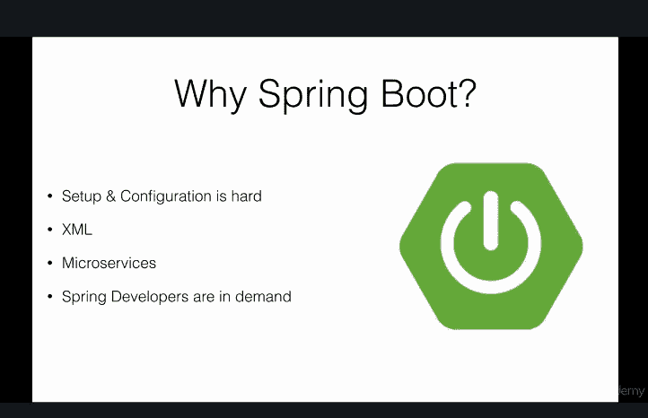
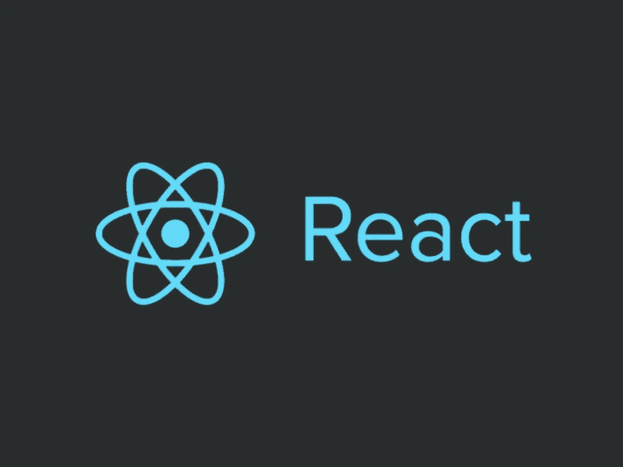
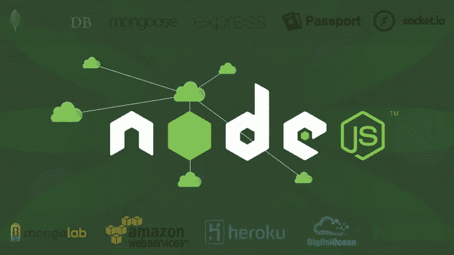
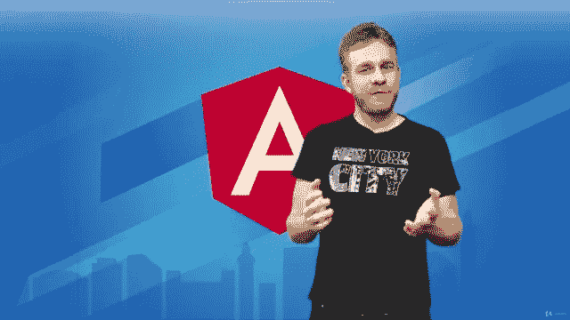
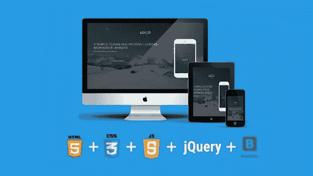
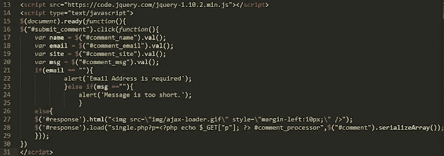
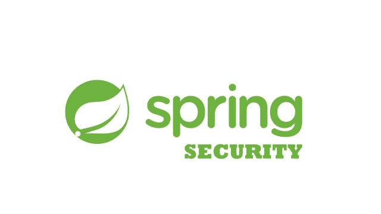
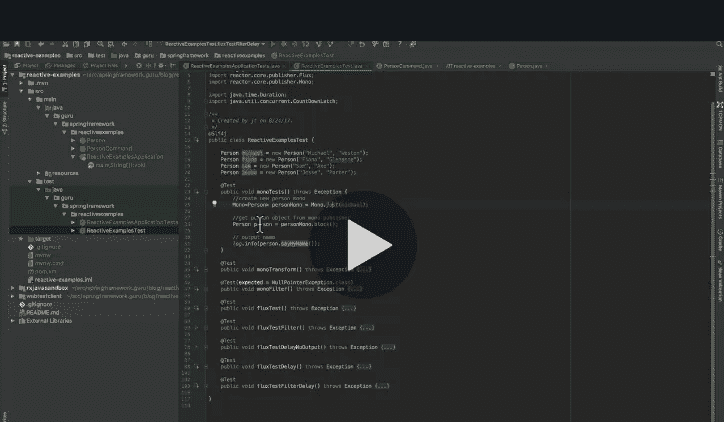

# 2023 年全栈 Java 开发者可以学习的 10 大框架

> 原文：<https://medium.com/javarevisited/top-10-frameworks-full-stack-java-developers-can-learn-in-2020-5995021401e5?source=collection_archive---------0----------------------->

image _ credit—undraw.co

从今年年初开始，我的许多读者一直在问我关于他们应该在 2023 年学习什么的问题。我已经写了一系列的帖子来帮助他们，比如[**2023 年 Java 程序员应该学会的 10 件事**。](https://dev.to/javinpaul/10-things-java-developer-should-learn-1nil)

在这篇文章中，我将分享一些最受欢迎和最有用的框架，你可以在 2023 年学习这些框架，以进一步提高你的技能，促进你的职业发展。

顺便说一句，这些框架不仅仅是为 [Java 开发人员](https://javarevisited.blogspot.com/2018/05/10-tips-to-become-better-java-developer.html)准备的，也是为任何选择 [Java](http://www.java67.com/2018/08/top-10-free-java-courses-for-beginners-experienced-developers.html) 进行后端开发和 [JavaScript](http://www.java67.com/2018/04/top-5-free-javascript-courses-to-learn.html) 进行前端开发的程序员准备的。它们也很受欢迎，学习它们不仅能增加你找到更好工作的机会，还能打开新的机会之门。

正如我以前说过的，技术正在迅速变化，10 年前有效的方法现在可能不适用。程序员面临的最大挑战是保持自己与时俱进。

熟悉流行的[库](https://javarevisited.blogspot.com/2018/01/top-20-libraries-and-apis-for-java-programmers.html)、[框架](https://javarevisited.blogspot.sg/2018/04/top-5-java-frameworks-to-learn-in-2018_27.html#axzz5DmwFLA1K)对开发新的应用程序和您的日常工作大有帮助。这对于有经验的程序员或全栈 Java 开发人员来说尤其重要，因为他们应该知道最新最好的应用程序开发工具，并能为工作推荐合适的工具。

作为一名全栈 Java 开发人员，我知道 [Spring](http://www.java67.com/2017/11/top-5-free-core-spring-mvc-courses-learn-online.html) 、 [Spring Boot](https://javarevisited.blogspot.com/2018/11/top-5-spring-boot-features-java.html) 和[Hibernate但是我还没有学习像](http://javarevisited.blogspot.sg/2016/12/top-5-spring-and-hibernate-training-courses-java-jee-programmers.html) [Spark](http://www.java67.com/2018/04/5-free-apache-spark-course-for-java-scala-python-developers.html) 和 [Hadoop](https://javarevisited.blogspot.com/2018/04/top-5-hadoop-courses-to-learn-online.html) 这样的大数据框架，这是我在 2023 年为自己设定的目标。

# Java 全栈开发者应该在 2023 年探索的 10 个框架

这里是我列出的 10 个流行的框架，你可以期待在 2023 年学习。最近，它们已经改变了你开发 web 应用的方式，特别是 [Angular](http://www.java67.com/2018/01/top-5-free-angular-js-online-courses-for-web-developers.html) 和 [React JS](http://www.java67.com/2018/02/5-free-react-courses-for-web-developers.html) ，现在可能是熟悉它们的时候了

## 1.Spring Boot

我已经使用 Spring 框架很多年了，因此，当我第一次被介绍给 [Spring boot](http://www.java67.com/2018/06/5-best-courses-to-learn-spring-boot-in.html) 时，我对配置的相对缺乏感到非常惊讶。

使用 Spring Boot 编写基于 Spring 的 Java 应用程序就像使用 [main()](http://www.java67.com/2014/02/can-you-run-java-program-without-main-method.html) 方法编写核心 Java 应用程序一样简单。

即使我尝试过 Spring Boot，我还有很多东西要学，这就是为什么它在我 2023 年要学的事情清单上有很长时间了。

我还买了 [**Spring Boot 大师班**](https://click.linksynergy.com/fs-bin/click?id=JVFxdTr9V80&subid=0&offerid=323058.1&type=10&tmpid=14538&RD_PARM1=https%3A%2F%2Fwww.udemy.com%2Fspring-boot-intro%2F) ，这是上个月从 Udemy 学习 Spring Boot 最好的在线课程之一，只花了 10 美元，我期待着在 2023 年使用它。

顺便说一句，如果你不介意从免费资源中学习，那么你也可以看看这个免费 Spring Boot 课程列表。

而且，如果你需要更多的选择，你也可以参考这个优秀的[Spring Boot 初学者课程清单](https://hackernoon.com/top-5-online-courses-to-learn-spring-boot-in-2019-c2fd7a0282c2)。

## 2.阿帕奇火花

这是另一个越来越受欢迎的大数据框架。Apache Spark 是一个快速的内存数据处理引擎，具有优雅和丰富的开发 API，允许数据工作者高效地执行需要快速迭代访问数据集的流、机器学习或 SQL 工作负载。

您可以使用 Spark 进行内存计算，将 ETL、机器学习和数据科学工作负载转移到 Hadoop。

我已经入围了 2023 年 Pluralsight 的 [**阿帕奇火花基础**](https://pluralsight.pxf.io/c/1193463/424552/7490?u=https%3A%2F%2Fwww.pluralsight.com%2Fcourses%2Fapache-spark-fundamentals) 课程。

顺便说一下，你需要一个 [**Pluralsight 会员**](https://pluralsight.pxf.io/c/1193463/424552/7490?u=https%3A%2F%2Fwww.pluralsight.com%2Fpricing) 才能加入这个课程，费用大约是每月 29 美元或每年 299 美元(14%的折扣)。如果你没有这个计划，我强烈推荐你加入，因为它能促进你的学习，而且作为一名程序员，你总是需要学习新的东西。

或者，你也可以使用他们的 **1** [**0 天免费试用**](https://pluralsight.pxf.io/c/1193463/424552/7490?u=https%3A%2F%2Fwww.pluralsight.com%2Flearn) 免费观看本课程。

如果你有同样的想法，你可以去看看那个课程来获得一些灵感，如果你需要一些免费的替代品来四处看看并掌握它，你可以看看这个为 Java、Scala 和 Python 开发人员提供的免费 Apache Spark 课程列表。

## 3.React.js

React 是另一个用于构建用户界面的 JavaScript 库或框架。它就像[棱角分明的](https://javarevisited.blogspot.com/2018/06/5-best-courses-to-learn-angular.html)，但由脸书、Instagram 和一个由个人开发者和公司组成的社区维护。

它允许 web 开发人员创建大型 web 应用程序，无需重新加载页面就可以随时更改。web 开发的世界分为 Angular 和 React，选择什么取决于你。

大多数时候这是由环境决定的，例如，如果你正在做一个基于 React 的项目，那么很明显你需要学习 React。

无论如何，如果你决定在 2023 年学习 React，那么 Max 的[**React 16——完全指南**](http://bit.ly/2AGvUNd) 是一个很好的起点。这是 Max 的另一个杰作，他可能是 Udemy 上最好的角度和反应教练，也可能是目前互联网上最好的教练。

如果你想成为 React 的全栈 Java 开发者，那么我强烈推荐 Udemy 官方网站上 Ranga Rao 的 [**Go Java 全栈与 Spring Boot 和 React**](https://click.linksynergy.com/deeplink?id=JVFxdTr9V80&mid=39197&murl=https%3A%2F%2Fwww.udemy.com%2Fcourse%2Ffull-stack-application-with-spring-boot-and-react%2F) 课程。

而且，如果你正在寻找一些免费的替代品，这个免费 React 课程列表也不错，如果你需要更多的指导，这个 React 开发者路线图也是一个很好的资源。

## 4.节点. js

毫无疑问，JavaScript 是头号编程语言，Node.js 在其中扮演了重要角色。传统上， [JavaScript](https://javarevisited.blogspot.com/2018/06/top-10-courses-to-learn-javascript-in.html) 被用作客户端脚本语言，与 HTML 一起在客户端提供动态行为。

它运行在网络浏览器上，但是 Node.js 允许你在服务器端运行 JavaScript。Node.js 是一个开源的、跨平台的 JavaScript 运行时环境，用于在服务器端执行 JavaScript 代码。

在将动态网页发送到客户端之前，可以使用 node.js 在服务器端创建动态网页。

这意味着您可以用 JavaScript 开发一个从前端到后端的客户端-服务器应用程序。上个月，我在 Udemy 的 10 美元特价上购买了完整的 Node.js 开发者课程 ，我期待着在 2023 年学习它。

## 5.有角的

这是另一个 JavaScript 框架，它在我的学习清单上已经很长时间了。我的确是去年开始学的，但是还有很多东西要学。它提供了一个完全客户端的解决方案。您可以使用 [Angular](https://javarevisited.blogspot.com/2018/06/top-10-angular-tutorials-and-courses-for-web-developers.html#axzz5Ie75bPFF) 在客户端创建动态网页。

Angular 2+提供了声明性模板、[依赖注入](https://javarevisited.blogspot.com/2015/06/difference-between-dependency-injection.html)、端到端工具和集成的最佳实践来解决客户端常见的开发挑战。

因为它是一个 JavaScript 库，所以您可以使用标签将它包含在您的 HTML 页面中。它使用指令扩展 HTML 属性，并使用表达式将数据绑定到 HTML。

由于谷歌落后于 Angular，你也可以放心的性能和定期更新。我强烈认为 Angular JS 或 Angular 2 是长期的，因此，在它身上投资时间是完全合理的。如果你决定在 2023 年学习 Angular 2，那么 [**Angular 2:入门**](https://pluralsight.pxf.io/c/1193463/424552/7490?u=https%3A%2F%2Fwww.pluralsight.com%2Fcourses%2Fangular-2-getting-started) 在 Pluralsight 上是一个很好的起点。

如果你喜欢一种选择，那么 Max 的[**Angular——完整的大师级**](http://bit.ly/2AGzgzN) 是课程的另一个亮点。马克斯是我非常钦佩的导师之一，他的课程非常棒。

如果你更喜欢书本而不是网络课程，或者想把马克斯的课程和书本结合起来，那么我强烈推荐你看看内特·默里、费利佩·库里、阿里·勒纳和卡洛斯·塔沃尔达的电子书。

而且，如果你想成为 Angular 的全栈 Java 开发者，那么我强烈推荐 Udemy 上 28 分钟官方的 Ranga Rao 的 [**Go Java 全栈与 Spring Boot 和 Angular**](https://click.linksynergy.com/deeplink?id=JVFxdTr9V80&mid=39197&murl=https%3A%2F%2Fwww.udemy.com%2Fcourse%2Ffull-stack-application-development-with-spring-boot-and-angular%2F) 课程。

 [## 用 Spring Boot 和 Angular 实现 Java 全栈

### 成为全栈 Java 开发者。用 Angular 和 Spring Boot 构建你的第一个 Java 全栈应用。

udemy.com](https://click.linksynergy.com/deeplink?id=JVFxdTr9V80&mid=39197&murl=https%3A%2F%2Fwww.udemy.com%2Fcourse%2Ffull-stack-application-development-with-spring-boot-and-angular%2F) 

## 6.引导程序

这是另一个流行的开源、[前端 web 框架](http://www.java67.com/2019/01/top-10-javascript-frameworks-and-libraries-for-web-developers.html)，用于设计网站和 web 应用。最初是由推特带给我们的。

Bootstrap 为排版、表单、按钮、导航和其他界面组件提供了基于 HTML 和 CSS 的设计模板，以及可选的 JavaScript 扩展。

Bootstrap 支持响应式网页设计，这意味着网页的布局会根据浏览器的屏幕大小动态调整。

在移动领域，Bootstrap 以其移动优先的设计理念引领潮流，默认强调响应式设计。

如果你是全栈 web 开发者，不知道 Bootstrap，2023 年是学习它的好时机。从零开始的 [**自举**](https://click.linksynergy.com/fs-bin/click?id=JVFxdTr9V80&subid=0&offerid=323058.1&type=10&tmpid=14538&RD_PARM1=https%3A%2F%2Fwww.udemy.com%2Fbootstrap-4-from-scratch-with-5-projects%2F) 是你 2023 年自举之旅的一个很好的起点。

如果你需要一些免费的选择，这个免费的自举课程列表也非常有用。

## 7.jQuery

这是另一个统治世界的 JavaScript 框架。jQuery 一直是我的最爱，我建议每个开发人员都学习 jQuery。它使得客户端脚本编写变得非常容易。

只需编写几行代码，您就可以制作动画、发送 HTTP 请求、重新加载页面以及执行客户端验证。

如果你决定在 2023 年学习 jQuery，那么我建议你看看 [jQuery 大师班](https://click.linksynergy.com/fs-bin/click?id=JVFxdTr9V80&subid=0&offerid=323058.1&type=10&tmpid=14538&RD_PARM1=https%3A%2F%2Fwww.udemy.com%2Fjquery-tutorial%2F)，这是 Udemy 提供的一门免费在线课程，用于学习 jQuery。

## 8.Apache Hadoop

大数据和自动化是 2023 年许多公司的焦点，这就是为什么程序员学习 Hadoop 和 Spark 等大数据技术变得非常重要。

Apache Hadoop 是一个框架，它允许使用简单的编程模型跨计算机集群分布式处理大型数据集。

它旨在从单个服务器扩展到数千台机器，每台机器都提供本地计算和存储。

它基于流行的 Map Reduce 模式和 key 来开发一个可靠的、可伸缩的、分布式的软件计算应用程序。

上个月我已经报名参加了 [**终极实践 Hadoop**](https://click.linksynergy.com/fs-bin/click?id=JVFxdTr9V80&subid=0&offerid=323058.1&type=10&tmpid=14538&RD_PARM1=https%3A%2F%2Fwww.udemy.com%2Fthe-ultimate-hands-on-hadoop-tame-your-big-data%2F) ，如果你决定在 2023 年学习 Hadoop，你也可以加入。

## 9.春天安全

安全是无可替代的，在 2023 年，它将变得更加重要。由于 Spring security 已经成为 Java 世界中 web security 的代名词，所以在 2023 年用 Spring security 的最新版本更新自己是完全有意义的。

Spring security 的新版本 5.0 包括许多错误修复和一个完整的新 OAuth 2.0 模块。

即使你不知道 Spring Security，你也应该考虑在 2023 年学习它，没有比加入欧根帕拉斯基夫的 [**和 OAuth**](https://courses.baeldung.com/p/learn-spring-security-the-master-class?utm_source=javarevisited&utm_medium=web&utm_campaign=lss&affcode=22136_bkwjs9xa) 一起学习 Spring Security 大师课更好的方法了。

## 10.弹簧框架

Spring 框架对于 Java 开发人员来说是最重要的框架，尤其是对于实现应用程序的后端。Spring 框架的最新版本是 Spring Framework 5.0。这给 Java 世界带来了许多激动人心的特性，比如反应式编程模型和 Java 8 和 9 特性的采用。

Spring 5.0 的采用与日俱增，这就是为什么每个 Java 开发人员都应该学习和探索 Spring 5.0 中引入的新特性。如果你需要一些帮助， [**Spring 5.0:初学者到大师**](https://click.linksynergy.com/fs-bin/click?id=JVFxdTr9V80&subid=0&offerid=323058.1&type=10&tmpid=14538&RD_PARM1=https%3A%2F%2Fwww.udemy.com%2Fspring-framework-5-beginner-to-guru%2F) 是一个很好的入门课程。

另一个值得注意的是，Pivotal 提供了 Spring 认证，这并不是很昂贵，并且给你一个机会来获得对你的 Spring 框架技能的认可。

这也是深入学习 Spring 和填补现有知识空白的好方法。如果你想了解更多，我写了关于 [**如何破解 Spring 5.0 专业认证**](https://javarevisited.blogspot.com/2018/08/how-to-crack-spring-core-professional-certification-exam-java-latest.html) ，你也可以查看那篇文章。

从工作、职业和成长的角度来看，这些是 Java 全栈开发人员在**最受欢迎的一些框架。它们中的每一种都有许多替代方案，比如微服务，您也可以选择 MicroNaut 和**

以上就是关于 Java 开发者应该在 2023 年学习哪些框架的全部内容**。这些框架需求量很大，尤其是 Spring、Node.js 和 Angular。学习这些框架不仅会增加你找到工作的机会，还会打开许多机会之门。**

**即使你已经在工作中安顿下来，让自己跟上最新最好的技术对你的职业发展也是必不可少的。**

**所以，我建议你挑几个这样的框架，2023 年学。如果你是一名 Java 开发人员，那么 Apache Spark 是一个不错的选择，但是如果你对编程语言而不是框架或库感兴趣，那么 Kotlin 在 2023 年看起来也不错。**

**其他**编程篇**你可能喜欢的
[2023 年学习 Python 的 10 个理由](https://javarevisited.blogspot.com/2018/05/10-reasons-to-learn-python-programming.html)
[2023 年你可以学习的 10 种编程语言](http://www.java67.com/2017/12/10-programming-languages-to-learn-in.html)
[每个 Java 开发者都应该知道的 10 个工具](http://www.java67.com/2018/04/10-tools-java-developers-should-learn.html)
[学习 Java 编程语言的 10 个理由](http://javarevisited.blogspot.sg/2013/04/10-reasons-to-learn-java-programming.html)
[10 个框架 Java 和 Web 开发者应该学习的 10 个技巧](http://javarevisited.blogspot.sg/2018/01/10-frameworks-java-and-web-developers-should-learn.html)
[2023 年成为一个更好的 Java 开发者 2023 年](http://javarevisited.blogspot.sg/2018/05/10-tips-to-become-better-java-developer.html)
[10 个测试库每个 Java 开发者都应该知道的](https://javarevisited.blogspot.sg/2018/01/10-unit-testing-and-integration-tools-for-java-programmers.html)
[10 个 Coursera 证书开始你的科技生涯](/javarevisited/top-10-coursera-certificates-to-start-your-career-in-cloud-data-science-ai-mainframe-and-it-558690c83587)
[我最喜欢的学习 Python 的书](/javarevisited/my-favorite-books-to-learn-python-in-depth-77465633b46e)
[10 个来自微软和谷歌的免费 Python 教程](/javarevisited/10-free-python-tutorials-and-courses-from-google-microsoft-and-coursera-for-beginners-96b9ad20b4e6)**

## **结束语**

**感谢您阅读本文。你可能会想，有这么多东西要学，有这么多课程要参加，但你不需要担心。**

**很有可能你已经知道了大部分内容，也有很多有用的免费资源可供你使用，我还在这里和那里链接了它们以及最好的资源，这些资源当然不是免费的，但很值钱。**

**说到学习，我特别喜欢 [**Udemy 课程**](https://click.linksynergy.com/fs-bin/click?id=JVFxdTr9V80&offerid=323058.9410&type=3&subid=0) s，因为它们非常实惠，并且以很小的金额提供了很多价值，但是你可以自由选择你想要的课程。**

**说到底，你应该对这里提到的事情有足够的知识和经验。**

**祝你 2023 学习之旅好运！当然**不会很容易**，但是通过遵循这个路线图和指南，你离成为你一直想成为的全栈 Java 开发者又近了一步**

**如果你喜欢这篇文章，那么请考虑关注我的 medium ( [javinpaul](https://medium.com/<a%20class='comment-mentioned-user'%20href='https://dev.to/javinpaul'>@javinpaul</a>%0A) )。如果你想在每篇新文章上得到通知，别忘了在 Twitter 上关注[**javarevited**](https://twitter.com/javarevisited)！**

****附言**。—我建议你成为 Angular 或 React 的全栈 Java 开发人员，以获得两个世界的最佳效果，给你的职业生涯一个推动。如果你想成为 React 的全栈 Java 开发者，那么我强烈推荐 Spring Boot 的 [**Go Java 全栈和 Udemy 上 Ranga Rao 的**](https://click.linksynergy.com/deeplink?id=JVFxdTr9V80&mid=39197&murl=https%3A%2F%2Fwww.udemy.com%2Fcourse%2Ffull-stack-application-with-spring-boot-and-react%2F)28 分钟*官方*课程。**

** [## 与 Spring Boot 一起使用 Java 全栈并做出反应

### Ranga 是 AWS 认证解决方案架构师助理、AWS 认证开发人员助理和 AWS 认证云…

udemy.com](https://click.linksynergy.com/deeplink?id=JVFxdTr9V80&mid=39197&murl=https%3A%2F%2Fwww.udemy.com%2Fcourse%2Ffull-stack-application-with-spring-boot-and-react%2F)**