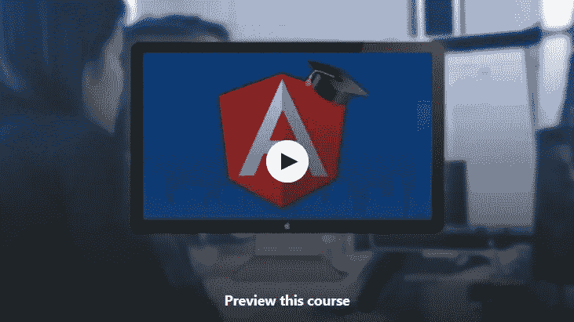
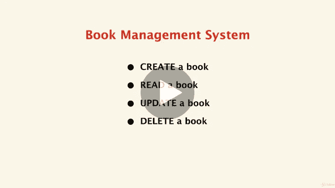
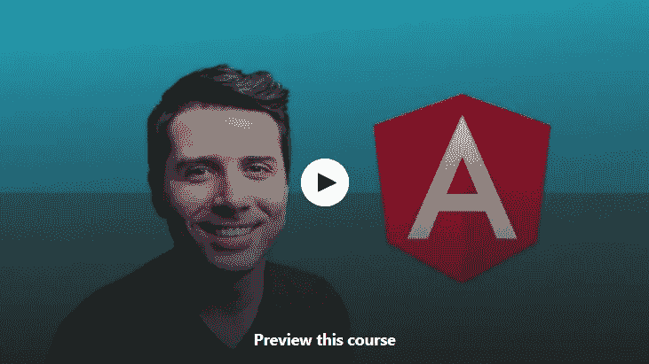
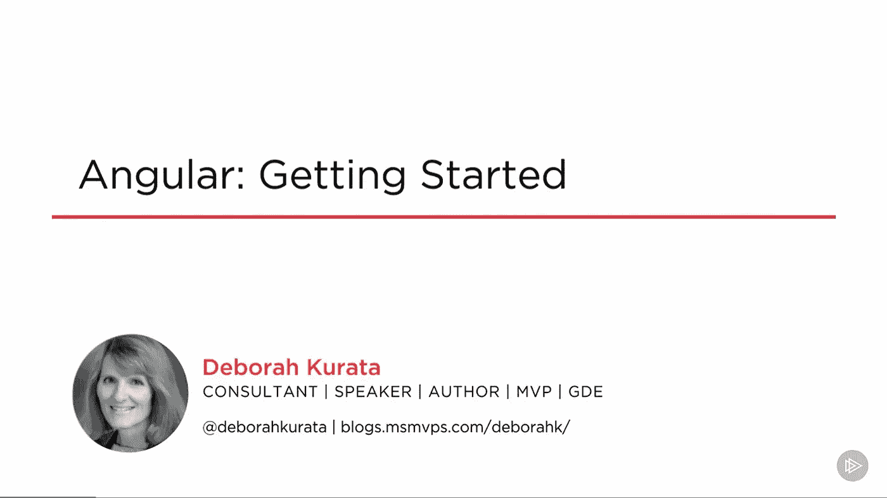
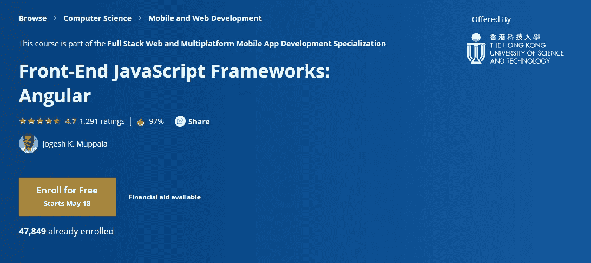
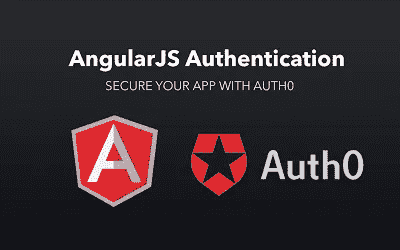
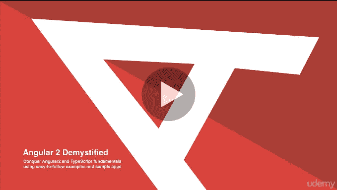
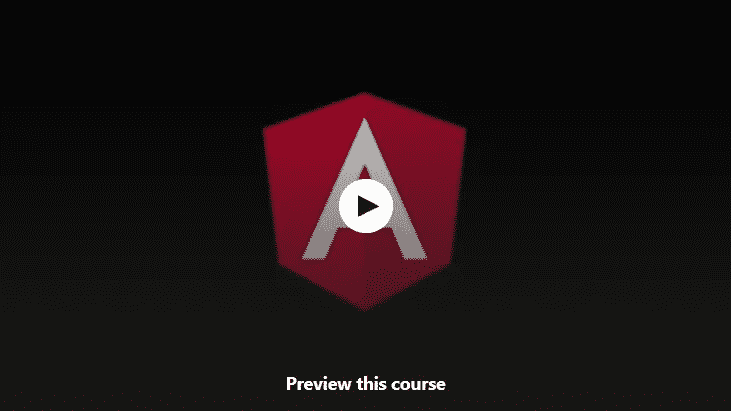
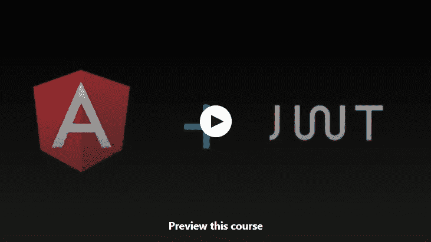
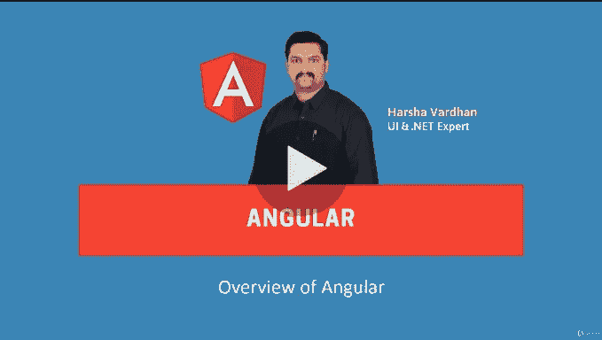

# 2023 年学习 Angular 框架的 10 大免费课程

> 原文：<https://medium.com/javarevisited/top-10-free-courses-to-learn-angular-framework-in-2020-bb62148c73d3?source=collection_archive---------0----------------------->

大家好，如果你想学习 Angular framework，这是谷歌 2023 年前端开发的领先框架之一，并且需要书籍和课程等资源，那么你来对地方了。之前，我已经分享了 [**最佳角度书籍**](/javarevisited/top-10-angular-books-and-courses-for-beginners-and-experienced-web-developers-best-of-lot-9a2dae87f04c) 和 [**最佳角度课程**](/javarevisited/10-courses-to-learn-angular-for-web-development-6da1bd2856dc) 在这篇文章中，我将为初学者分享最佳免费角度课程。

您可能知道 Angular 是用于创建 web 应用程序，尤其是单页面 web 应用程序的最流行的 JavaScript 框架之一。它帮助您在更短的时间内创建复杂的 web 应用程序，许多财富 500 强公司都在使用它。

它是由 Google 维护的，所以你也可以放心，这个强大的框架是以速度和目的构建的，并且是长期的。 [Angular](http://www.java67.com/2017/06/99-angular-js-interview-questions-for.html) 也是世界上最流行的构建单页面应用程序的框架。

该框架最初作为 Angular JS 推出，允许使用模型视图控制器概念构建 web 应用程序，它非常受欢迎，但后来它被完全重写，现在被称为 Angular 或 [Angular 2](https://angular.io/) 。

尽管许多 web 开发人员交替使用 Angular 和 Angular JS，但它们是非常不同的，除了 Angular 之外，它们的名称没有任何共同之处。

如果你想创建优秀的网络应用程序，并紧跟最新的应用程序开发技术，你就需要快速使用 Angular 的组件、模板和服务。

如果你正在考虑现在或不久的将来学习 Angular，这里列出了一些 **10 个最好的在线免费 Angular 课程**。web 开发人员为什么要学 Angular？嗯，Angular 是一个很好的框架，可以创建一个 web 应用程序，为你的简历增加更多的价值。这不仅会推动你的职业发展，还会让你有能力创建自己的网站或创业应用。

如果你想成为一名[全栈 web 开发人员](https://dev.to/javinpaul/top-10-advanced-courses-for-full-stack-java-developers-kop)，你必须了解前端和后端技术，因此我强烈建议即使是 Java 开发人员也要学习 [Angular](/javarevisited/10-courses-to-learn-angular-for-web-development-6da1bd2856dc) 或 [React](/javarevisited/top-10-free-courses-to-learn-react-js-c14edbd3b35f) ，这是脸书支持的另一个类似的框架。这也是我列出的 Java 开发人员应该在 2023 年学习的事情

 [## 2023 年 Java 程序员该学什么？

### 2023 年 Java 程序员可以学习的有用工具、技术、框架和库

medium.com](/javarevisited/what-java-programmers-should-learn-in-2020-648050533c83) 

# 10 个最适合初学者的免费在线课程

在不浪费你更多时间的情况下，这里是我为 web 开发人员列出的一些最佳角度课程。这些课程是从 Udemy、Coursera 和其他在线门户网站学习 Angular 2 的最佳免费资源。

## [1。初学者课程](https://click.linksynergy.com/deeplink?id=JVFxdTr9V80&mid=39197&murl=https%3A%2F%2Fwww.udemy.com%2Fcourse%2Fangular-for-beginners-course%2F)(包括免费电子书)

更新到 Angular 9:Angular 框架的快速介绍，重点是它最常用的部分

在这个课程中，你将学习如何安装 Angular 5，它的补充，模板和样式与 [HTML](/javarevisited/top-10-free-courses-to-learn-html-5-css-3-and-web-development-872d62d97a97) & [CSS](/javarevisited/5-free-html-and-css-courses-to-learn-front-end-web-development-online-8b04517c6ecb?source=collection_home---4------0-----------------------) ，属性和事件绑定，动画，服务，路由器，以及 Angular JS 应用的部署。

**这里是免费报名的链接—** [**棱角分明适合初学者的课程**](https://click.linksynergy.com/deeplink?id=JVFxdTr9V80&mid=39197&murl=https%3A%2F%2Fwww.udemy.com%2Fcourse%2Fangular-for-beginners-course%2F)

顺便说一句，如果你能花一点钱，至少 10.99 美元，那么我也建议你购买 Udemy 的 Maximillian 的**[**Angular:The Complete Guide**](https://click.linksynergy.com/fs-bin/click?id=JVFxdTr9V80&subid=0&offerid=323058.1&type=10&tmpid=14538&RD_PARM1=https%3A%2F%2Fwww.udemy.com%2Fthe-complete-guide-to-angular-2%2F)course。是 Angular online 最好的课程之一。**

**它也非常实惠，因为 Udemy 经常疯狂销售，你可以只花 10.99 美元购买任何课程，当然是原价 200 美元。**

**而且，如果你更喜欢书本而不是在线课程，或者想把马克斯的课程和书本结合起来，那么我强烈推荐你看看内特·默里、费利佩·库里、阿里·勒纳和卡洛斯·塔沃尔达的电子书。**

**这是一本关于角度的深入、完整和最新的书，受到角度专家的强烈推荐。如果你想检查，你可以在这里免费下载第一章**。****

********

## ****[2。构建一个有棱角的 Spring MVC Web 应用](https://click.linksynergy.com/deeplink?id=JVFxdTr9V80&mid=39197&murl=https%3A%2F%2Fwww.udemy.com%2Fcourse%2Fbuild-an-angular-and-spring-mvc-web-application%2F)****

****使用 Angular 和 Spring MVC Angular 的全栈开发刚刚发布，这个免费课程将为您提供所有必要的基础知识，帮助您开始开发 Angular 应用程序。****

****Angular 是构建 web 应用最流行的前端 Javascript 框架之一，另一方面， [Spring MVC](/javarevisited/top-5-courses-to-learn-microservices-in-java-and-spring-framework-e9fed1ba804d?source=collection_home---4------2-----------------------) 也是构建 Java Web 应用最流行的 Java 框架之一，利用它我们可以构建行业标准的 Java/J2EE 企业应用。****

****因此，在本课程中，我们将利用这两种技术，构建一个 web 应用程序。我们要构建的应用程序不是一个简单的 Hello World 应用程序，我们要构建一个端到端的数据库应用程序，我们要执行所有的 CRUD 操作，如创建、读取、更新、删除。****

******这里是免费注册的链接—** [构建一个有棱角有弹性的 MVC Web 应用](https://click.linksynergy.com/deeplink?id=JVFxdTr9V80&mid=39197&murl=https%3A%2F%2Fwww.udemy.com%2Fcourse%2Fbuild-an-angular-and-spring-mvc-web-application%2F)****

********

## ****3.[角 2+](https://click.linksynergy.com/fs-bin/click?id=JVFxdTr9V80&subid=0&offerid=323058.1&type=10&tmpid=14538&RD_PARM1=https%3A%2F%2Fwww.udemy.com%2Fgetting-started-with-angular-2%2F) 入门****

****这是从 Udemy 学习 Angular 的另一个很棒的免费课程。由 Ryan Chenkie 创建，在本课程中，您将学习 Angular 2 的基础知识。您将通过构建 ng2-cribs 来学习如何使用它，ng2-cribs 是一个房地产列表应用程序，允许用户查看列表、搜索和过滤列表，并添加新列表。****

****完成本课程后，你将对如何从头开始构建 Angular 2+应用程序有一个很好的想法，并且你将有一个很好的平台来进一步掌握 Angular。****

******这里是免费报名的链接—**[**Angular 2+**](https://click.linksynergy.com/fs-bin/click?id=JVFxdTr9V80&subid=0&offerid=323058.1&type=10&tmpid=14538&RD_PARM1=https%3A%2F%2Fwww.udemy.com%2Fgetting-started-with-angular-2%2F)入门****

********

## ******4。** [**棱角分明:入门**](https://pluralsight.pxf.io/c/1193463/424552/7490?u=https%3A%2F%2Fwww.pluralsight.com%2Fcourses%2Fangular-2-getting-started-update)****

****这是在 [Pluralsight](/javarevisited/7000-free-pluralsight-courses-to-build-in-demand-tech-skills-without-leaving-your-house-40edb50a8cf2) 上在线学习 Angular 的另一个很棒的课程。由 Deborah Kurata 创建本课程提供了开始构建 Angular 应用程序所需的基础知识。****

****本课程涵盖组件、模板、数据绑定和指令、服务和依赖注入、HTTP 和可观察对象以及导航和路由。****

****您将学习如何设置您的环境，了解组件、模板和数据绑定，以及它们如何协同工作。接下来，您将了解如何用强类型代码构建干净的组件，以及如何构建嵌套组件和如何使用依赖注入来注入您构建的服务。之后，您将了解如何使用 HTTP、导航和路由来检索数据，并且将重温角度设置过程****

******这里是免费报名的链接—** [**棱角分明:入门**](https://pluralsight.pxf.io/c/1193463/424552/7490?u=https%3A%2F%2Fwww.pluralsight.com%2Fcourses%2Fangular-2-getting-started-update)****

********

****顺便说一句，这个课程并不是真正免费的，因为你需要**一个** [**Pluralsight 会员**](http://pluralsight.pxf.io/c/1193463/424552/7490?u=https%3A%2F%2Fwww.pluralsight.com%2Flearn) 才能加入这个课程，但是 Pluralsight 确实提供了一个 **10 天的免费试用期**，这足以完成这个课程。通过这种方式，你不仅可以获得那门课程，还可以获得角度基础知识，这是另一门免费学习角度的好课程。****

**** [## 对个人来说

### Pluralsight 帮助个人学习者获得掌握最新软件开发所需的技术技能…

pluralsight.pxf.io](http://pluralsight.pxf.io/c/1193463/424552/7490?u=https%3A%2F%2Fwww.pluralsight.com%2Flearn)**** 

## ******5。** [前端 JavaScript 框架:Angular](https://coursera.pxf.io/c/3294490/1164545/14726?u=https%3A%2F%2Fwww.coursera.org%2Flearn%2Fangular)【Coursera】****

****这是一个从 Coursera 学习 Angular JavaScript 框架的免费课程，Angular Fundamentals 将教你用 Angular 框架编写应用的基础知识(目前 Ver。6.x)。本课程将使用[打字稿](https://javarevisited.blogspot.com/2018/07/top-5-courses-to-learn-typescript.html)开发角度应用。****

****您将学习如何引导应用程序，以及如何使用角度组件和新的角度语法构建页面和可重用元素。****

****本课程是 [**全栈 Web 和多平台移动应用开发专业**](https://coursera.pxf.io/c/3294490/1164545/14726?u=https%3A%2F%2Fwww.coursera.org%2Fspecializations%2Ffull-stack-mobile-app-development) 的一部分****

****这门课程最棒的一点是，超过 50%的学习者在完成本专业后开始了新的职业生涯，超过 30%的学习者获得了加薪或晋升。****

******这里是免费报名的链接—** [**前端 JavaScript 框架:Angular**](https://coursera.pxf.io/c/3294490/1164545/14726?u=https%3A%2F%2Fwww.coursera.org%2Flearn%2Fangular)****

********

****您还将学习路由、创建可重用服务和依赖注入、构建带验证的表单以及使用 HTTP 和 observables 与服务器通信的基础知识。你甚至将学习如何使用单元测试和端到端 UI 测试来测试所有这些。当你完成这个课程，你将拥有使用 Angular 创建专业和个人网站的基本知识。****

****如果你觉得 Coursera 的课程有用，因为它们是由知名公司如**谷歌**、 **IBM** 、**亚马逊**和世界上最好的大学创建的，我建议你加入 Coursera 的年度订阅计划 [**Coursera Plus**](https://coursera.pxf.io/c/3294490/1164545/14726?u=https%3A%2F%2Fwww.coursera.org%2Fcourseraplus) 。****

****这种单次订阅可以让你无限制地访问他们最受欢迎的**课程**、**专业**、**专业证书**和**指导项目**。它每年花费大约 399 美元，但是它完全物有所值，因为你可以获得无限制的证书。****

**** [## Coursera Plus |无限制访问 7，000 多门在线课程

### 用 Coursera Plus 投资你的职业目标。无限制访问 90%以上的课程、项目…

coursera.pxf.io](https://coursera.pxf.io/c/3294490/1164545/14726?u=https%3A%2F%2Fwww.coursera.org%2Fcourseraplus)**** 

## ****6. [Angular 和 Laravel 认证和密码重置。](https://click.linksynergy.com/deeplink?id=JVFxdTr9V80&mid=39197&murl=https%3A%2F%2Fwww.udemy.com%2Fcourse%2Fangular-laravel-single-page-app-with-authentication-and-password-reset%2F)****

****这是 Udemy 的一门免费的 Angular 课程。在本课程中，您将了解如何使用拉韦尔和 JWT 创建 SPA，以及与传统身份验证相关的挑战，以及如何使用 JSON Web Token。****

****您将了解如何在 Angular 单页应用程序中实现身份验证，以及如何在 Laravel 中创建 API。感谢 [Sarthak Shrivastava](https://medium.com/u/8170a76568a8?source=post_page-----bb62148c73d3--------------------------------) 创建了这个课程。****

****本课程将教你如何应对无状态身份验证时与检查单页面应用程序相关的所有挑战。****

******这里是免费报名的链接—** [Angular 和 Laravel 认证和密码重置。](https://click.linksynergy.com/deeplink?id=JVFxdTr9V80&mid=39197&murl=https%3A%2F%2Fwww.udemy.com%2Fcourse%2Fangular-laravel-single-page-app-with-authentication-and-password-reset%2F)****

********

****这可能是一件棘手的事情，因为前端和后端应用程序是有效分离的，但我们会找到如何利用我们用户的 JWT 来解决这些挑战。****

## ****[7。Angular 2 揭秘](https://click.linksynergy.com/deeplink?id=JVFxdTr9V80&mid=39197&murl=https%3A%2F%2Fwww.udemy.com%2Fcourse%2Fintroduction-to-angular2%2F)(含电子书)****

****征服 Angular2 和 TypeScript 基础——使用 Angular 2 构建出色的移动和 Web 应用程序****

****这是另一个来自 [Udemy](/javarevisited/100-free-programming-and-web-development-courses-on-udemy-free-resource-center-3f8415eb5e6f) 的关于 Angular 的免费课程。在这个 **100%自由角度课程**中，我要假设你这辈子都没碰过角度。

你将学习非常基础的知识，比如如何安装 Angular 4 应用，如何创建自己的服务，以及如何集成 UI 动画。****

******这里是免费报名的链接—** [**角 2 揭秘**](https://click.linksynergy.com/deeplink?id=JVFxdTr9V80&mid=39197&murl=https%3A%2F%2Fwww.udemy.com%2Fcourse%2Fintroduction-to-angular2%2F)****

********

## ****[8。角度—掌握基础知识](https://click.linksynergy.com/deeplink?id=JVFxdTr9V80&mid=39197&murl=https%3A%2F%2Fwww.udemy.com%2Fcourse%2Fangular-mastering-the-basics%2F)****

****这个课程包含了你需要知道的所有基础知识，在一个地方，简单明了！****

****本课程将教你 angular 框架的基本概念，包括服务和路由。****

******这里是免费报名的链接—** [有角度—掌握基础](https://click.linksynergy.com/deeplink?id=JVFxdTr9V80&mid=39197&murl=https%3A%2F%2Fwww.udemy.com%2Fcourse%2Fangular-mastering-the-basics%2F)****

********

## ****9。角度认证—掌握基础知识****

****本课程将教你如何从头开始认证 angular 应用。您将学习如何设置 [MongoDB](https://javarevisited.blogspot.com/2019/01/top-5-mongodb-online-training-courses.html) ，创建[RESTful API](/javarevisited/why-spring-is-the-best-framework-for-developing-rest-apis-in-java-784590e484a4)，以及认证 angular 应用程序。****

****本课程面向希望学习如何使用 Json Web 令牌认证 angular 应用程序的学生****

******这里是免费报名的链接—** [Angular —掌握基础](https://click.linksynergy.com/deeplink?id=JVFxdTr9V80&mid=39197&murl=https%3A%2F%2Fwww.udemy.com%2Fcourse%2Fangular-mastering-the-basics%2F)****

********

## ****[10。绝对初学者的角度基础知识](https://click.linksynergy.com/deeplink?id=JVFxdTr9V80&mid=39197&murl=https%3A%2F%2Fwww.udemy.com%2Fcourse%2Fangular-6-for-beginners-by-harsha%2F)****

****这是另一个从 Udemy 学习 Angular 的免费课程。由 Harsha Vardhan 创建的这个课程将教你 Angular，它涵盖了最近的 Angular 8。****

****本课程也是一门基于项目的课程，您将把它作为课程的一部分来构建，以利用您到目前为止所学的角度技巧。****

******这里是免费报名的链接—** [绝对初学者角度基础](https://click.linksynergy.com/deeplink?id=JVFxdTr9V80&mid=39197&murl=https%3A%2F%2Fwww.udemy.com%2Fcourse%2Fangular-6-for-beginners-by-harsha%2F)****

********

****以上是关于 Web 开发人员的一些最好的免费角度课程。正如我告诉你的，Angular 是最流行的 JavaScript 框架，它帮助你在更短的时间内创建复杂的 web 应用程序。它不仅使你的工作变得容易，而且为你打开了新的机会之门。它在简历上看起来不错，可以帮助你在蓬勃发展的网络开发市场上获得一份高薪工作。

其他**对程序员有用的资源**
[10 个框架 Java Web 开发者要学的](http://javarevisited.blogspot.sg/2018/01/10-frameworks-java-and-web-developers-should-learn.html#axzz53Soo0i1a)
[10 个编程语言探索](http://www.java67.com/2017/12/10-programming-languages-to-learn-in.html)
[5 个免费的 Spring 框架课程对 Java 程序员](http://www.java67.com/2017/11/top-5-free-core-spring-mvc-courses-learn-online.html)
[10 个免费的课程对初学者学习 JavaScript](/javarevisited/12-free-courses-to-learn-javascript-and-es6-for-beginners-and-experienced-developers-aa35874c9a32)
[15 个课程学习 AWS、Docker、 和 Kubernetes](/javarevisited/top-15-online-courses-to-learn-docker-kubernetes-and-aws-for-fullstack-developers-and-devops-d8cc4f16e773)
[10 门课程深入学习 AWS 和云计算](/javarevisited/top-10-courses-to-learn-amazon-web-services-aws-cloud-in-2020-best-and-free-317f10d7c21d)
[10 门免费课程学习面向初学者的 TypeScript](/javarevisited/top-10-free-typescript-courses-to-learn-online-best-of-lot-44bce9da41d1)
[25 个软件设计面试问题](/javarevisited/25-software-design-interview-questions-to-crack-any-programming-and-technical-interviews-4b8237942db0)
[8 个 Python 项目面向初学者的思路](/@javinpaul/8-projects-you-can-buil-to-learn-python-in-2020-251dd5350d56)
[5 门免费核心 Java 课程面向初学者的](http://www.java67.com/2017/11/top-5-free-core-spring-mvc-courses-learn-online.html)
[Top 5 Node JS 和 Express JS 课程面向 Web 开发人员的](http://javarevisited.blogspot.com/2018/01/top-5-nodejs-and-express-js-online-courses-for-web-developers.html#axzz53Q2pdqNE)****

****感谢您阅读本文。如果你喜欢这些免费的 Angular 在线培训课程，那么请分享给你的朋友和同事。如果您有任何问题或反馈，请留言。****

******p . s .**——如果你不介意花几块钱学习 Angular 这样有价值的东西，那么你也可以在 Udemy **上查看 Max 的[**Angular——完整指南**](https://click.linksynergy.com/fs-bin/click?id=JVFxdTr9V80&subid=0&offerid=323058.1&type=10&tmpid=14538&RD_PARM1=https%3A%2F%2Fwww.udemy.com%2Fthe-complete-guide-to-angular-2%2F) 课程。**这是深入学习 Angular 的综合和最新课程之一。****

** [## 主角度 9(以前的角度 2):完整的课程

### 掌握 Angular 9(以前的“Angular 2”)并使用 Angular.js 的继任者构建出色的反应式 web 应用程序

udemy.com](https://click.linksynergy.com/fs-bin/click?id=JVFxdTr9V80&subid=0&offerid=323058.1&type=10&tmpid=14538&RD_PARM1=https%3A%2F%2Fwww.udemy.com%2Fthe-complete-guide-to-angular-2%2F) 

如果你更喜欢书本而不是网络课程，或者想把马克斯的课程和书本结合起来，那么我强烈推荐你看看内特·默里、菲利普·库里、阿里·勒纳和卡洛斯·塔沃尔达的电子书。这是一本关于 Angular13 的深入、完整、最新的书，被 Angular 专家强烈推荐。如果你想检查，你可以在这里免费下载第一章。

**