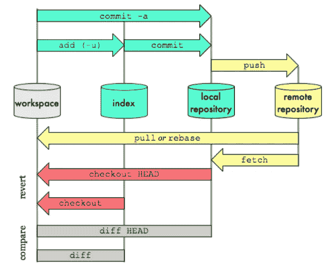
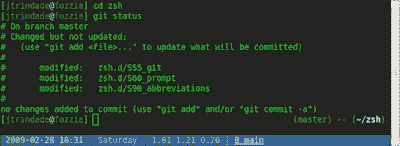
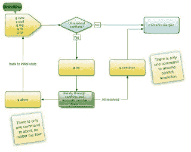

# 2023 年学习 Git 和 Github 的 8 门最佳免费课程——最好的

> 原文：<https://medium.com/javarevisited/top-10-free-courses-to-learn-git-and-github-best-of-lot-967aa314ea?source=collection_archive---------0----------------------->

## 2023 年使用交互式免费在线课程、教程和课堂学习 Git 的完整指南。

大家好，如果你想成为一名程序员或软件开发人员，那么学习 Git 是一个好主意。毫无疑问，Git 是程序员和编码员的重要技能和工具之一，如果你想在 2023 年学习和掌握 Git，如果你一直在寻找一些好的教程和课程，那么你来对地方了。

早些时候，我已经分享了 [**最佳 Git 课程**](/javarevisited/7-best-courses-to-master-git-and-github-for-programmers-d671859a68b2) 以及[**学习 Git 的最佳平台 online**e](/javarevisited/11-best-online-places-to-learn-git-for-beginners-in-2021-6dc2b7c6ef48)，在这篇文章中，我将免费分享一些在线学习 Git 的最佳资源。

老实说，互联网上到处都是 git 教程，简单的谷歌搜索会给你留下成千上万的教程，但最大的问题是你从哪里开始？

如果你有一些关于什么是 [Git](https://git-scm.com/) 、**它是做什么的背景知识，选择一个教程或一篇博客文章是很容易的。以及如何使用它，但是如果你没有太多的背景知识，那么你需要一门能从头开始告诉你所有信息的课程。**

> 我个人喜欢在转到博客帖子之前从书本或在线课程中学习，因为它们通常结构良好。

当你在热门的在线课程网站上搜索 Git 课程时，如 [Udemy](https://click.linksynergy.com/deeplink?id=JVFxdTr9V80&mid=39197&murl=https%3A%2F%2Fwww.udemy.com%2F) 、 [Pluralsight](http://pluralsight.pxf.io/c/1193463/424552/7490?u=https%3A%2F%2Fwww.pluralsight.com%2Flearn) 或 [Coursera](/javarevisited/is-coursera-plus-worth-it-review-7df4915cd326) ，你会在 Udemy 上找到一些综合课程，如 [**Git Complete:权威指南**](https://click.linksynergy.com/fs-bin/click?id=JVFxdTr9V80&subid=0&offerid=562016.1&type=10&tmpid=14538&RD_PARM1=https%3A%2F%2Fwww.udemy.com%2Fgit-complete%2F)

 [## Git Complete:Git 的权威分步指南

### Git 完成这一课程的目的是一个全面的 Git 方法，这意味着没有事先的知识或…

www.udemy.com](https://www.udemy.com/course/git-complete/?LSNPUBID=JVFxdTr9V80&ranEAID=JVFxdTr9V80&ranMID=39197&ranSiteID=JVFxdTr9V80-756A5T5wpZQ87mz.WL9OJQ) 

还有来自 Pluralsight 的 [**Git 基础**](https://pluralsight.pxf.io/c/1193463/424552/7490?u=https%3A%2F%2Fwww.pluralsight.com%2Fcourses%2Fgit-fundamentals) ，它会一步步教你关于 Git 的一切。这些是从 Git 开始的极好的资源。

顺便说一下，你需要一个 [**Pluralsight 会员**](https://pluralsight.pxf.io/c/1193463/424552/7490?u=https%3A%2F%2Fwww.pluralsight.com%2Fpricing) 才能加入这个课程，费用大约是每月 29 美元或每年 299 美元(14%的折扣)。如果你没有这个计划，我强烈推荐你加入，因为它能促进你的学习，而且作为一名程序员，你总是需要学习新的东西。

或者，你也可以使用他们的 **1** [**0 天免费试用**](https://pluralsight.pxf.io/c/1193463/424552/7490?u=https%3A%2F%2Fwww.pluralsight.com%2Flearn) 免费观看本课程。

 [## 对个人来说

### Pluralsight 的使命一直是公平的技术竞争环境。不管你想学什么，或者…

pluralsight.pxf.io](https://pluralsight.pxf.io/c/1193463/424552/7490?u=https%3A%2F%2Fwww.pluralsight.com%2Flearn) 

一些程序员更喜欢从免费资源中学习，我的许多读者问我是否可以分享一些不错但免费的 git 课程，他们可以用这些课程在线自学 Git。

在这篇文章中，我将分享一些最好的免费 git 在线课程，你可以在家或办公室参加。

这些资源在法律上是免费的，我的意思是它们是由它们的创造者出于教育和营销目的免费提供的。如果你发现事实并非如此，请留言，我会删除该课程。

> *如果你不 Git，它是最流行的分布式源代码控制系统之一。*

你肯定使用过其他源代码控制软件，如 CVS、SVN、VSS、DFS 等， [Git](https://git-scm.com/) 是另一个，但它有点不同，因为它是一个**分布式源代码控制系统**，这意味着你在本地分支提交更改，然后在完成后将它们推送到远程服务器(GitHub 库)。

另一方面， **Github 是一个源代码库**，也就是你可以存储你的源代码的地方。

> 在当今世界，程序员的 Git 知识库就像你的 LinkedIn 或脸书账户一样重要。

这是成为一名程序员的社会证明，也是为什么我建议每个程序员都拥有自己的 won Github 账户，里面有他们最好的代码。

你还应该记住，如果你不得不做一个带回家的编码测试，比如用 Java 设计一个自动售货机，现在许多公司用它来筛选不是优秀编码员的候选人，那么

> *与其把你的程序以 zip 文件的形式发送给他们，你不如上传到你的个人 Github 库并给他们发送一个链接。*

*我发现许多面试官对这个简单的行为印象深刻，并想看看你如何将带有增量提交历史的解决方案编码到 Github 中。Github 中的代码审查也很容易。*

如果您必须向任何公司提交测试代码，下次请记住这个技巧。

# 学习 Git 和 Github 的 8 个最佳在线课程(免费)

这里列出了一些最好的在线课程，你可以免费加入学习 Git 和 Github。

这些课程很好地介绍了作为版本控制的 Git，并且概述了一些基本命令，如果你想从命令行使用 Git 的话，比如 push、pull、checkout 等等。

他们完全免费加入，是开始学习 Git 和 Github 的良好资源，但如果你需要更全面的覆盖面，并且不介意支付一些钱来学习像 Git 这样有价值的技术，那么你也可以查看 Udemy 上的[**Github Ultimate:Master Git 和 GitHub**](http://bit.ly/2Q37e50) 以及 Pluralsight 上的 [**Git 基础**](https://pluralsight.pxf.io/c/1193463/424552/7490?u=https%3A%2F%2Fwww.pluralsight.com%2Fcourses%2Fgit-fundamentals) 。Git 上最全面的两门课程。

 [## Git 基础

### 中间 2012 年 5 月 23 日 1h 51m 描述 Git 是一个流行的分布式版本控制系统(DVCS)。在这个…

pluralsight.pxf.io](https://pluralsight.pxf.io/c/1193463/424552/7490?u=https%3A%2F%2Fwww.pluralsight.com%2Fcourses%2Fgit-fundamentals) 

无论如何，让我们从我们的列表开始:

## [1。Git 从 GitHub 开始](https://click.linksynergy.com/fs-bin/click?id=JVFxdTr9V80&subid=0&offerid=562016.1&type=10&tmpid=14538&RD_PARM1=https%3A%2F%2Fwww.udemy.com%2Fgit-started-with-github%2F)【免费教程】

本课程旨在展示 Git 和 GitHub 如何协同工作，重点是 Git 的基本工作流程。

学生可以期望在大约 30 分钟内学会开始使用 Git 所需的最低要求。

您将学习如何为 Windows 和 Mac OS X 设置 Git，然后如何使用 Git 的`help` 命令。

在安装部分之后，课程将介绍整个 Git 基本工作流程，例如从 GitHub 开始，在本地工作，然后将我们的更改发布回 GitHub。

下面是加入课程的链接—[**Git 从 Github**T3 开始](https://click.linksynergy.com/fs-bin/click?id=JVFxdTr9V80&subid=0&offerid=562016.1&type=10&tmpid=14538&RD_PARM1=https%3A%2F%2Fwww.udemy.com%2Fgit-started-with-github%2F)

简而言之，本课程将教你 Git 和 GitHub 的基础知识，由一位评价很高的老师进行清晰的分步指导。

## [2。GIT 5 天终极挑战](https://click.linksynergy.com/fs-bin/click?id=JVFxdTr9V80&subid=0&offerid=562016.1&type=10&tmpid=14538&RD_PARM1=https%3A%2F%2Fwww.udemy.com%2Fthe-ultimate-git-5-day-challenge%2F)【免费 Udemy 课程】

本课程循序渐进地介绍一些基本的 GIT 操作。该课程不会潜得太深，并且在五天中的每一天都是小步前进。

随着您继续学习本课程，我们将了解一个基本的单人工作流程，该流程允许任何人在 Github 或 BitBucket(两个流行的公共 GitHub 存储库)上存储文件。

如果你正在寻找一些实践课程来逐步学习 Git，这是适合你的[课程](https://click.linksynergy.com/fs-bin/click?id=JVFxdTr9V80&subid=0&offerid=562016.1&type=10&tmpid=14538&RD_PARM1=https%3A%2F%2Fwww.udemy.com%2Fthe-ultimate-git-5-day-challenge%2F)。你可以在 Udemy 上找到这个，完全免费，不需要优惠券。

以下是加入课程的链接— [***终极 Git—5 天挑战***](https://click.linksynergy.com/fs-bin/click?id=JVFxdTr9V80&subid=0&offerid=562016.1&type=10&tmpid=14538&RD_PARM1=https%3A%2F%2Fwww.udemy.com%2Fthe-ultimate-git-5-day-challenge%2F)

## 3.Atlassian [Coursera 免费课程]使用 Git 进行版本控制

Git 版本控制课程为您理解 Git 版本控制系统提供了坚实的实践基础。Git 是最初由 Linus Torvalds 创建的开源软件。Git 管理大型和小型项目的团队文件。

这使得团队能够持续改进其产品。它被大多数主要的技术公司使用，并被认为是许多现代编程和 It 工作的知识。

它也是持续交付管道和云原生计算的核心组件。

在[这门课](https://coursera.pxf.io/c/3294490/1164545/14726?u=https%3A%2F%2Fwww.coursera.org%2Flearn%2Fversion-control-with-git)中，你不会学到关于 Git 的所有知识，但是你会对该技术建立一个强有力的概念理解，之后你将能够自信地深入挖掘任何你感兴趣的话题。

本课程假设您之前没有 Git 知识，但是如果您有 Git 经验，您会发现本课程既有用又有挑战性。如果你目前“只知道足够危险的 Git”，这一点尤其正确。

这里是免费加入本课程的链接— [**版本控制与 Git**](https://coursera.pxf.io/c/3294490/1164545/14726?u=https%3A%2F%2Fwww.coursera.org%2Flearn%2Fversion-control-with-git)

除此之外，Coursera 上还有另一个很棒的 Git 课程，Google 的[**Git 和 GitHub 简介**](https://coursera.pxf.io/c/3294490/1164545/14726?u=https%3A%2F%2Fwww.coursera.org%2Flearn%2Fintroduction-git-github) 可以免费旁听。

 [## Git 和 GitHub 简介

### 在本课程中，您将学习如何使用跟踪工具跟踪不同版本的代码和配置文件

coursera.pxf.io](https://coursera.pxf.io/c/3294490/1164545/14726?u=https%3A%2F%2Fwww.coursera.org%2Flearn%2Fintroduction-git-github) 

本课程是[**Google IT Automation with Python Professional Certificate**](https://coursera.pxf.io/c/3294490/1164545/14726?u=https%3A%2F%2Fwww.coursera.org%2Fprofessional-certificates%2Fgoogle-it-automation)的一部分，是 Coursera 上最受欢迎的 Python 认证之一。

 [## 用 Python 实现谷歌 IT 自动化

### 学习像 Python、Git 和 it 自动化这样的热门技能来推进你的职业生涯

coursera.pxf.io](https://coursera.pxf.io/c/3294490/1164545/14726?u=https%3A%2F%2Fwww.coursera.org%2Fprofessional-certificates%2Fgoogle-it-automation) 

如果你觉得 Coursera 的课程很有用，因为它们是由知名公司如谷歌、IBM、亚马逊和世界上最好的大学创建的，我建议你加入 Coursera Plus 的**，这是 Coursera 的一个订阅计划，让你可以无限制地访问他们最受欢迎的**课程**、**专业化**、**专业证书**和**指导项目**。它每年花费大约 399 美元，但它完全值得你的钱，因为你可以获得无限的证书。**

****

## **4.Git 分支的交互式指南**

**[“学习 Git 分支”](https://learngitbranching.js.org/)是在 web 上学习 Git 最直观、最互动的方式。他们提供了一个沙箱和练习来练习不同的 git 命令。**

**这就像在 Git 和 Github 上从事真实世界的项目和执行常见任务一样。如果您阅读了本教程，您将会拥有与从事真实世界 Git 项目的人相同的实践经验。**

**在这个[网站](https://javarevisited.blogspot.com/2019/05/10-free-websites-to-learn-git-online.html)上，你将挑战令人兴奋的关卡，一步一步地演示强大的功能，甚至可能在过程中获得一点乐趣。如果你是初学者，就从第一个开始吧。**

**如果你已经知道一些 Git 基础知识，尝试一些关于合并分支和从其他分支引入提交的高级和具有挑战性的水平。**

** [## 学习 Git 分支

### 一个交互式 Git 可视化工具，用于教育和挑战！

learngitbranching.js.org](https://learngitbranching.js.org/)** 

## **5. [Git 和 GitHub——初学者循序渐进](https://click.linksynergy.com/deeplink?id=JVFxdTr9V80&mid=39197&murl=https%3A%2F%2Fwww.udemy.com%2Fgit-and-github-step-by-step-for-beginners%2F)**

**这是另一个针对初学者的 git 课程。在本课程中，您将学习如何为您的本地环境安装和配置 Git。**

**您还将学习与本地和远程源存储库通信，向本地和远程存储库添加内容，为您的代码创建注释，理解基本的分支和合并，以及从存储库中排除内容类型。**

**简而言之，这是一门通过循序渐进的示例学习基本 git 操作的好课程。**

**以下是加入课程的链接— [***Git，以及针对初学者的 Github***](https://click.linksynergy.com/deeplink?id=JVFxdTr9V80&mid=39197&murl=https%3A%2F%2Fwww.udemy.com%2Fgit-and-github-step-by-step-for-beginners%2F)**

****

## **[**6。命令行基础:Git Bash for Windows**](https://click.linksynergy.com/fs-bin/click?id=JVFxdTr9V80&subid=0&offerid=562016.1&type=10&tmpid=14538&RD_PARM1=https%3A%2F%2Fwww.udemy.com%2Fgit-bash%2F)**

**本课程旨在提供在 Windows 上使用 Git 命令行的实践经验。您将在 [Bash 命令行](http://javarevisited.blogspot.sg/2011/03/unix-command-tutorial-working-fast-in.html)中学习关键概念并专注于基础任务，以便快速提高工作效率。**

**为了在 windows 的命令行上使用 [Git](https://dzone.com/articles/top-5-free-courses-to-learn-git-and-github-in-2019) ，你可以安装 GitBash，一个允许你从你的 Windows 机器上访问 Github 的工具或软件。**

**学生可以在不到一个小时的时间里学会开始使用 Bash shell 所需的最低要求。**

**以下是加入课程的链接—[***Git Bash for Windows***](https://click.linksynergy.com/fs-bin/click?id=JVFxdTr9V80&subid=0&offerid=562016.1&type=10&tmpid=14538&RD_PARM1=https%3A%2F%2Fwww.udemy.com%2Fgit-bash%2F)**

**本课程还包含测验，这将有助于您记住所学的知识。**

**简而言之，对于不熟悉 [Bash](http://bit.ly/2DavlMs) 或终端环境的 Windows 用户来说，这是一个循序渐进的指南。**

****

## **7.用 Bitbucket 云学习 Git**

**这是一个很好的资源，可以通过这个以空间为主题的教程学习 Git 的基础知识。你的任务是学习[基本的 git 命令](https://hackernoon.com/top-5-free-courses-to-learn-git-and-github-best-of-lot-2f394c6533b0)，完成教程并追踪你团队的所有空间站。**

**本教程中介绍了以下 Git 命令:**

1.  **git 克隆，**
2.  **git 配置，**
3.  **git 添加，**
4.  **git 状态，**
5.  **git 提交，**
6.  **git 推，**
7.  **git 拉，**
8.  **git 分支，**
9.  **git 结账，**
10.  **和 git 合并**

 **[## 用 Bitbucket Cloud 学习| Atlassian Git 教程

### 通过这篇空间主题教程学习 Git 的基础知识。你的任务是通过完成…

www.atlassian.com](https://www.atlassian.com/git/tutorials/learn-git-with-bitbucket-cloud)** 

## **8.[学习 Git:你需要知道的一切](https://click.linksynergy.com/deeplink?id=JVFxdTr9V80&mid=39197&murl=https%3A%2F%2Fwww.udemy.com%2Fcourse%2Flearngit%2F)**

**你是一个想现在就开始使用 Git 和 GitHub 的软件开发人员吗？如果你听说过 Git 和 GitHub，但不知道如何开始，本课程将消除猜测**

**本课程涵盖了你前进所需的基本理念，没有太多的填充。非常感谢教练亚当·尤班克斯**

**在课程结束时，您将能够设置 GitHub 帐户，安装 Git，创建和配置新的 Git 和 [GitHub 库](https://github.com/)，为您的软件项目创建变更历史，并将您的软件项目发布到 GitHub。**

**以下是加入课程的链接— [***学习 Git:你需要知道的一切***](https://click.linksynergy.com/deeplink?id=JVFxdTr9V80&mid=39197&murl=https%3A%2F%2Fwww.udemy.com%2Fcourse%2Flearngit%2F)**

****

**以上就是为初学者和有经验的程序员提供的一些最好的免费 Git 在线课程。这些是 Udemy 和 Coursera 授权的免费培训课程，由他们的讲师和创作者免费提供，你可以在 2023 年使用这些课程来学习和掌握 Git。**

**如果你之前没有听说过 git 或者对 Git 知之甚少，这些课程将帮助你填补知识的空白，掌握 Git，比如学习使用 Github，在 Windows 中使用[命令行 Git 客户端](http://bit.ly/2Q37e50)等。**

**在这个过程中，您还将学到一些提高生产率的技巧，以增强您的 Git 工作体验。**

**完成这些课程后，你最好创建一个 Github 帐户(如果你还没有的话),并在那里存储一些你最好的代码。没有什么比一个好的 Github 库更能证明你的编程技能了。这将帮助你找到下一份工作。**

**您可能想探索的其他**免费编程资源**:**

1.  **[面向 Java 开发者的 5 门免费 Spring 框架课程](http://www.java67.com/2017/11/top-5-free-core-spring-mvc-courses-learn-online.html)**
2.  **[5 门免费学习核心 Java 的在线课程](http://javarevisited.blogspot.sg/2017/11/top-5-free-java-courses-for-beginners.html#axzz4zuIICRs9)**
3.  **[5 门免费学习棱角分明的在线培训课程](http://www.java67.com/2018/01/top-5-free-angular-js-online-courses-for-web-developers.html)**
4.  **[面向 Java 和 Web 开发人员的 5 个节点 JS 课程](http://javarevisited.blogspot.sg/2018/01/top-5-nodejs-and-express-js-online-courses-for-web-developers.html)**
5.  **[学习大数据和 Apache Spark 的 5 门课程](http://javarevisited.blogspot.com/2017/12/top-5-courses-to-learn-big-data-and.html)**
6.  **[5 门免费学习数据结构和算法的课程](http://javarevisited.blogspot.sg/2018/01/top-5-free-data-structure-and-algorithm-courses-java--c-programmers.html#axzz55lOcYrUM)**
7.  **【Java 开发者学习 Android 的 5 门课程**
8.  **[面向程序员的 5 门免费数据结构和算法课程](https://javarevisited.blogspot.com/2018/01/top-5-free-data-structure-and-algorithm-courses-java--c-programmers.html)**

## **结束语**

**感谢您阅读本文。如果你发现这些免费课程对学习 Git 有用，请与你的朋友和同事分享。如果您有任何问题或反馈，请留言。**

**如果你喜欢这篇文章，那么请分享给你的朋友和同事，别忘了在 Twitter 上关注[javarestived](https://twitter.com/javarevisited)和在 Medium 上关注 [javinpaul](https://medium.com/u/bb36d8439904?source=post_page-----2f394c6533b0----------------------) ！**

****附言——**如果你不介意花一点钱在值得学习的东西上，那么你也可以在 Udemy 上查看[**GitHub Ultimate:Git 大师和 GitHub —初学者到专家**](http://bit.ly/2Q37e50) 和来自 Pluralsight 的 [**Git 基础**](https://pluralsight.pxf.io/c/1193463/424552/7490?u=https%3A%2F%2Fwww.pluralsight.com%2Fcourses%2Fgit-fundamentals) 。Git 上最全面的两门课程。**

** [## GitHub Ultimate:Git 大师和 GitHub -初学者到专家

### 本课程将全面介绍 GitHub 托管服务，作为 Git 源代码控制工具的配套工具，它…

udemy.com](https://click.linksynergy.com/deeplink?id=JVFxdTr9V80&mid=39197&murl=https%3A%2F%2Fwww.udemy.com%2Fcourse%2Fgithub-ultimate%2F)**