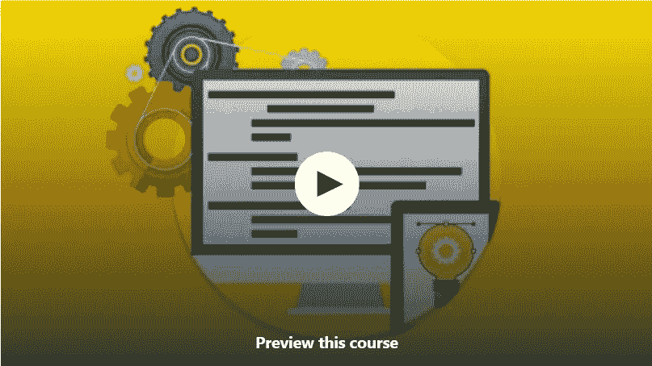
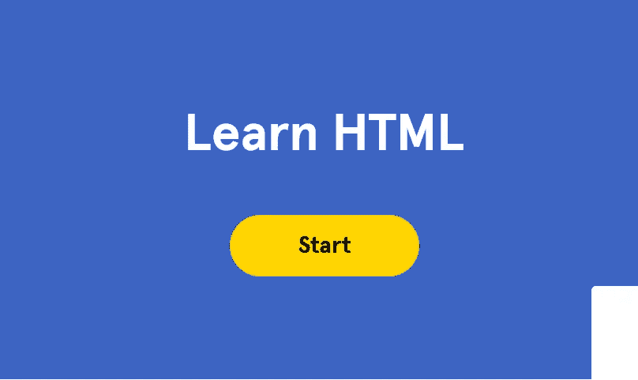

# 学习 HTML 5、CSS 3 和 Web 开发的 10 大免费课程

> 原文：<https://medium.com/javarevisited/top-10-free-courses-to-learn-html-5-css-3-and-web-development-872d62d97a97?source=collection_archive---------0----------------------->

弗洛里安·奥利佛在 [Unsplash](https://unsplash.com?utm_source=medium&utm_medium=referral) 上拍摄的照片

大家好，我已经在这个博客上分享了很多关于各种技术和编程语言的免费在线课程和书籍，如 [Python](/javarevisited/10-free-python-tutorials-and-courses-from-google-microsoft-and-coursera-for-beginners-96b9ad20b4e6) ， [Java](/javarevisited/10-books-java-developers-should-read-in-2020-e6222f25cc72) ， [C++](http://www.java67.com/2018/02/5-free-cpp-courses-to-learn-programming.html) ， [JavaScript](http://www.java67.com/2015/12/best-websites-to-learn-javascript-online.html) ， [PHP](http://www.java67.com/2018/02/5-free-php-and-mysql-courses-for-web-developers.html) ， [React](http://www.java67.com/2018/02/5-free-react-courses-for-web-developers.html) ， [Angular](http://www.java67.com/2018/01/top-5-free-angular-js-online-courses-for-web-developers.html) ， [Spring](http://www.java67.com/2017/11/top-5-free-core-spring-mvc-courses-learn-online.html) ，今天我带来了一些非常棒的免费课程来学习 web 基础知识

> 在这个创业的时代，Web 开发是程序员的重要技能。作为一个程序员或者软件开发人员，你应该知道如何创建一个网站，如何创建一个属于你自己的手机 app。

尽管这并不容易。编码就像艺术，许多人天生就有编码意识，我的意思是他们喜欢编码，他们喜欢创建网站、移动应用、游戏等，他们喜欢自动化。

他们是非常好的自学者，几乎可以自学任何东西，但是如果你没有这些技能，不要气馁。只要有毅力和努力，你也可以学到任何你想学的东西。以前我分享过一些[学习新技术的小技巧](http://www.java67.com/2017/12/10-ways-to-learn-new-technology-programming-language-or-framework.html)，书籍和课程是其中不可或缺的一部分。

我个人喜欢免费课程来开始学习新技术，例如，当我不得不学习 Apache Spark 时，我最近开始学习在线课程，然后是书籍，以便进行更全面的学习。

> *在线课程为你提供概要和必要的细节，让你不用投入太多时间就能开始学习。*

这也是一种更吸引人、更积极的学习方式。另一方面，书本比课程更被动一点，这就是为什么你必须有一些背景知识来掌握书本上的技术细节。

在这篇文章中，我将分享一些最好的免费在线课程，学习使用 HTML 和 CSS 进行 [Web 开发](http://javarevisited.blogspot.sg/2018/02/top-5-online-courses-to-learn-web-development.html#axzz5B6EWE6M7)。如果你是 web 开发领域的新手，那么你可以使用这些课程开始你在美丽的网站世界中的旅程。

顺便说一句，如果你能花几块钱在值得学习的东西上，那么你也应该看看 Colt_Steele 的 Web 开发人员训练营课程。这是我最喜欢的课程之一，也是学习 web 开发需要的唯一课程——HTML、CSS、JS、Node 等等！

</javarevisited/10-best-java-full-stack-web-development-courses-to-join-in-2020-6cd6cd2e5868>  

# 学习使用 HTML 和 CSS 进行 Web 开发的 10 大在线课程

这里是我收集的一些最好的免费网站开发课程。你可以在舒适的办公室和家里通过这些课程学习，也可以按照自己的进度学习。你可以放慢速度，做一些编码，然后重新开始。

## [**1。Web 开发实践:HTML / CSS 从头开始**](https://click.linksynergy.com/fs-bin/click?id=JVFxdTr9V80&subid=0&offerid=323058.1&type=10&tmpid=14538&RD_PARM1=https%3A%2F%2Fwww.udemy.com%2Fweb-development-learn-by-doing-html5-css3-from-scratch-introductory%2F)

本课程将向你介绍 web 开发的两大支柱:HTML 和 CSS。除此之外，你将学习这些支柱的基本作用，以及它们如何组合在一起形成网站。

在 HTML 部分，您将学习如何执行简单的任务，例如创建基本的网页、添加图像、改变颜色和构建列表，而在 CSS 部分，您将学习如何美化您的网页。

我知道现在每个人都使用 [Bootstrap](http://www.java67.com/2019/01/5-free-bootstrap-course-to-learn-online.html) 来使他们的网页变得漂亮和看起来专业，但是为了使用 Bootstrap，一个领先的 CSS 库，CSS 概念的基础知识是很重要的，这是你将在本课程中学到的。

**这里是加入这个免费课程的链接** - [网页开发做做](https://click.linksynergy.com/fs-bin/click?id=JVFxdTr9V80&subid=0&offerid=323058.1&type=10&tmpid=14538&RD_PARM1=https%3A%2F%2Fwww.udemy.com%2Fweb-development-learn-by-doing-html5-css3-from-scratch-introductory%2F)

## [**2。前端 Web 开发基础**](https://click.linksynergy.com/fs-bin/click?id=JVFxdTr9V80&subid=0&offerid=323058.1&type=10&tmpid=14538&RD_PARM1=https%3A%2F%2Fwww.udemy.com%2Ffoundations-of-front-end-development%2F)

这是 Udemy 上从头学习前端 web 开发的一门优秀课程，因为它不仅会教你 Web 开发的所有基本技术、[库](http://www.java67.com/2018/02/top-10-open-source-frameworks-and-libraries-java-web-developers.html)和[框架](https://dev.to/javinpaul/10-frameworks-java-and-web-developers-can-learn-in-2019-17ke)，还会向你展示如何通过构建真实的项目来有效地使用它们。

为了成为一名优秀的前端开发者，你不仅需要知道 [HTML](http://www.java67.com/2018/02/5-free-html-and-css-courses-to-learn-web-development.html) 、CSS、 [JavaScript](http://www.java67.com/2015/10/top-5-free-javascript-books-download-pdf-read-online.html) 还要知道 [Angular](https://hackernoon.com/top-10-angular-courses-tutorials-and-books-for-web-developers-e8a8e2c490c2?source=extreme_sidebar---------0-2--------------------) 、 [React](https://hackernoon.com/the-2018-react-js-roadmap-4d0a43814c02) 、BootStrap 等领先的框架和库。

本课程将以互动和全面的方式教你所有这些。免费课程很划算。

**这里是加入这个免费课程的链接**——[前端 Web 开发基础](https://click.linksynergy.com/fs-bin/click?id=JVFxdTr9V80&subid=0&offerid=323058.1&type=10&tmpid=14538&RD_PARM1=https%3A%2F%2Fwww.udemy.com%2Ffoundations-of-front-end-development%2F)

## [**3。学习 HTML & CSS:如何开始你的 Web 开发生涯**](https://click.linksynergy.com/fs-bin/click?id=JVFxdTr9V80&subid=0&offerid=323058.1&type=10&tmpid=14538&RD_PARM1=https%3A%2F%2Fwww.udemy.com%2Fhow-i-landed-a-web-development-job-earned-5k-freelancing%2F)

这是另一个学习 HTML 和 CSS 进行 web 开发的很好的课程，非常适合初级开发人员和希望在 2023 年成为 web 开发人员的计算机科学毕业生。

本课程分为 4 个重要部分:1 .)HTML 部分
2。)CSS 部分
3。)代码挑战决赛
4。)课程项目

你可以看到课程的结构非常好。前两节将从头到尾教你 [HTML](https://javarevisited.blogspot.com/2019/05/top-5-html-5-and-css-3-courses-for-web-developers.html) 和 [CSS](http://www.java67.com/2018/02/5-free-html-and-css-courses-to-learn-web-development.html) 第三节和第四节将测试你在前两节学到的知识。感谢迈克尔·博文免费提供这门课程。

**这里是加入这个免费 HTML 课程的链接**——[学习 HTML & CSS](https://click.linksynergy.com/fs-bin/click?id=JVFxdTr9V80&subid=0&offerid=323058.1&type=10&tmpid=14538&RD_PARM1=https%3A%2F%2Fwww.udemy.com%2Fhow-i-landed-a-web-development-job-earned-5k-freelancing%2F)

## [**4。从零开始学习响应式 Web 开发**](https://click.linksynergy.com/fs-bin/click?id=JVFxdTr9V80&subid=0&offerid=323058.1&type=10&tmpid=14538&RD_PARM1=https%3A%2F%2Fwww.udemy.com%2Flearn-responsive-web-development-from-scratch%2F)

如果我必须向所有想从事网页设计或前端开发的程序员、网页开发人员和计算机科学毕业生建议一件事，那就是响应主题和页面。

在当今世界，响应式设计只是因为人们使用不同的设备来访问网页，如手机、智能手机、平板电脑、台式机、笔记本电脑，甚至电视。

一个响应迅速的网页可以根据屏幕大小自动调整，并且对用户来说看起来很好，这就是为什么它很重要。

本课程将教你学习响应式 web 开发所需的所有知识，如框架、库、技术、最佳实践等。衷心感谢 Eduonix 学习解决方案讲师免费提供本课程。

## **5。** [**掌握 HTML5 的基础知识& CSS3:初学 Web 开发**](https://click.linksynergy.com/deeplink?id=CuIbQrBnhiw&mid=39197&murl=https%3A%2F%2Fwww.udemy.com%2Fcourse%2Fmaster-the-basics-of-html5-css3-beginner-web-development%2F)

这是最新的网络开发课程之一，你可以在 Udemy 上免费获得。这个 3 个小时长的免费课程重点介绍了 HTML 和 CSS 的最新版本，我指的是 HTML 5 和 CSS 3，这对于一个新的开发者来说非常重要。

如果你刚刚开始从零开始学习 web 开发，学习旧版本是没有意义的。通过学习更新版本，你一定会获得更好的性能，并创建更好的应用程序。

这也有助于你寻找一份网络开发工作，因为公司显然更喜欢拥有最新最伟大技术知识的候选人。

**这里是加入这个免费 HTML 课程的链接**——[掌握 HTML5 的基础知识& CSS3](https://click.linksynergy.com/deeplink?id=CuIbQrBnhiw&mid=39197&murl=https%3A%2F%2Fwww.udemy.com%2Fcourse%2Fmaster-the-basics-of-html5-css3-beginner-web-development%2F)

非常感谢导师 [Mindmekka](https://click.linksynergy.com/deeplink?id=CuIbQrBnhiw&mid=39197&murl=https%3A%2F%2Fwww.udemy.com%2Fuser%2Fmindmekka%2F) 免费提供这门课程。

## 6. [HTML5 简单游戏编程准备](http://bit.ly/2Mrxk04)

本课程为我的 HTML5 游戏开发课程提供了 HTML、CSS 和 JavaScript 的免费概述。学习用 HTML5 构建网页和手机游戏。即使你没有编程或网页开发的经验，你也可以创建自己的游戏。

本课程从 HTML5 中的 web 开发的快速概述开始，并向您展示所有现代页面中使用的基本 web 框架。然后，它使用嵌入在所有现代浏览器中的 JavaScript 语言教授基本的编程概念。

它介绍了 simpleGame.js 引擎，向您展示了该引擎是如何工作的，并介绍了一个免费的在线游戏开发工具。关于游戏编程的更多信息，请看我的另一门课。

<http://bit.ly/2Mrxk04>  

## 7.[html 5 的完整入门教程](http://bit.ly/2Oh70WN)

这是对 HTML 最全面的介绍之一，从简单的文本格式一直到 HTML5 提供的新标签。你将在仅仅一个周末的时间里从一个纯粹的初学者变成一个 HTML 基础扎实的人。

如果你已经了解 HTML，这是一个回顾 HTML5 中包含的新特性的好方法。完全免费！请继续关注即将到来的响应式设计课程，它将从本课程中获取您现有的 HTML5 知识，并帮助您构建响应式网站。

本课程面向谁:

*   Web 开发初学者
*   希望掌握最新 HTML5 标准的中级学习者

<http://bit.ly/2Oh70WN>  

## 8.[2 小时 HTML](https://www.youtube.com/watch?v=pQN-pnXPaVg)【FreeCodecamp 免费课程】

说到免费学习技术技能，FreeCodecamp 是一个很好的资源。他们的 Youtube 频道有最大的免费资源集合来学习技术技能，如 HTML、CSS、 [JavaScript](/javarevisited/my-favorite-free-tutorials-and-courses-to-learn-javascript-8f4d0a71faf2) 和 [Python](https://becominghuman.ai/7-best-python-online-courses-for-beginners-to-learn-programming-abe12cecb1ad) 。

在这个 2 小时的免费课程中，你将学习 HTML5 和 web 开发的基础知识。

以下是这门免费课程涵盖的主题:

1.  如何选择文本编辑器
2.  创建 HTML 文件
3.  基本标签、注释、样式和颜色
4.  格式化页面
5.  链接和图像
6.  视频和 Youtube iFrames
7.  列表、表格、div 和 Spans
8.  输入&表单、iFrames 和 Meta 标签

你可以在 Youtube 上免费观看这个 HTML 课程，或者点击这里:

## 9. [HTML & CSS:构建仪表板](http://bit.ly/2D0M8hd)

这是一个很好的练习 HTML 和 CSS 的课程。这是考验你作为开发人员技能的项目之一。用 sass 学习 HTML 和 CSS 中的一些高级特性。

非常适合初学者和有经验的开发人员。参加这个课程，用 HTML 和 CSS 建立一个仪表板。

这里是加入这个免费课程的链接— [HTML & CSS:构建一个仪表板](http://bit.ly/2D0M8hd)

<http://bit.ly/2D0M8hd>  

## 10.[从零开始学习 HTML5 和 CSS3](https://www.youtube.com/watch?v=mU6anWqZJcc)—全程

这是 [freeCodeCamp](https://medium.com/u/8b318225c16a?source=post_page-----872d62d97a97--------------------------------) 的另一个无广告课程，可能是最全面的课程，有 11 个小时的打包内容。

HTML 和 CSS 是从事网络开发的必备技能。HTML 是一种用于开发网页的标记语言。CSS 是一种负责网页布局和样式的语言。

在本课程中，我们将从头开始介绍这两种语言，在课程结束时，您将创建自己的项目

## 11.[通过 CodeCademy 学习 HTML](https://www.pjtra.com/t/TUJGR0lLR0JHRklJSkhCR0ZISk1N?url=https%3A%2F%2Fwww.codecademy.com%2Flearn%2Flearn-html)【免费互动课程】

这是另一个从零开始学习 HTML 的很棒的免费资源。如果你不知道 [**Codecademy**](https://bit.ly/codecademyhome) 是一个互动学习网站，学习基本的技术技能，如 HTML、CSS 和 JavaScript。

在这个免费的 Codecademy 课程中，你将学习所有用于构建 HTML 页面的通用 HTML 标签，这是所有网站的骨架。您还将能够创建 HTML 表格来有效地呈现表格数据。

您还将创建作品集项目来展示您的新技能。如果你是从零开始，那么我强烈建议你参加这个课程。在 Codecademy 上学习 HTML 比很多开发者想象的要容易。

以下是加入本课程的链接— [通过 CodeCademy 学习 HTML](https://www.pjtra.com/t/TUJGR0lLR0JHRklJSkhCR0ZISk1N?url=https%3A%2F%2Fwww.codecademy.com%2Flearn%2Flearn-html)

顺便说一句，如果你喜欢 Codecademy 平台，那么你也可以加入 CodeCademy PRO，这是一个面向程序员的订阅计划。它的年费大约是每月 15.99 美元，提供所有 Codecademy 的内容、课程、测验和项目。你可以用这个来赚取、练习&
应用工作技能。

<https://bit.ly/codecademypro>  

以上是关于免费使用 HTML 和 CSS 学习 web 开发的一些最好的课程。即使你知道 HTML 和 CSS，这些免费资源也是更新知识和填补空白的好方法。Web 开发是一项重要的技能，在这个创业的时代，我认为每个程序员都应该知道如何自己创建一个网站或移动应用程序。

其他**免费编程和 Web 开发**课程

1.  [面向程序员和开发人员的 20 多门免费教育课程](/javarevisited/20-free-educative-courses-for-programmers-and-software-engineers-a7135028350c)
2.  [学习数据结构和算法的 10 门免费课程](/javarevisited/top-10-free-data-structure-and-algorithms-courses-for-beginners-best-of-lot-ad807cc55f7a)
3.  [20 种免费资源让你从头开始学习编码](/javarevisited/top-20-sites-to-learn-coding-in-2020-f57ff63d9cb3)
4.  [面向初学者的 10 门免费 SQL 和数据库课程](/javarevisited/7-free-courses-to-learn-database-and-sql-for-programmers-and-data-scientist-e7ae19514ed2)
5.  [初学者学习 React Native 的 10 门免费课程](/javarevisited/my-favorite-free-react-native-courses-for-beginners-in-2020-4629f5274eb6?source=---------29----------------------------)
6.  [7 门免费的 Scala 和函数式编程课程](/javarevisited/7-free-scala-and-functional-programming-courses-for-beginners-370f3cd41a4e)
7.  [学习 Kubernetes for DevOps 的 7 门免费课程](/javarevisited/7-free-online-courses-to-learn-kubernetes-in-2020-3b8a68ec7abc?source=---------34------------------)
8.  [10 门面向初学者的免费 Docker 课程](/javarevisited/10-free-courses-to-learn-docker-and-devops-for-frontend-developers-691ac7652cee?source=---------94------------------)
9.  [2023 年学习云计算的 10 门免费课程](/javarevisited/10-free-courses-to-learn-cloud-computing-for-beginners-4f3cd984ddb1)
10.  [2023 年学习数据科学的 10 门免费课程](/javarevisited/10-free-data-science-online-courses-for-beginners-a5fe78c2cb7b)

感谢阅读这篇文章。如果你喜欢这些免费的网络开发课程，请与你的朋友和同事分享。如果您有任何问题或反馈，请留言。

如果你能花几块钱在值得学习的东西上，那么你也应该去看看 Colt_Steele 的 Web 开发者训练营课程。这是我最喜欢的课程之一，也是学习 web 开发需要的唯一课程——HTML、CSS、JS、Node 等等！

<https://click.linksynergy.com/deeplink?id=JVFxdTr9V80&mid=39197&murl=https%3A%2F%2Fwww.udemy.com%2Fthe-web-developer-bootcamp%2F> 