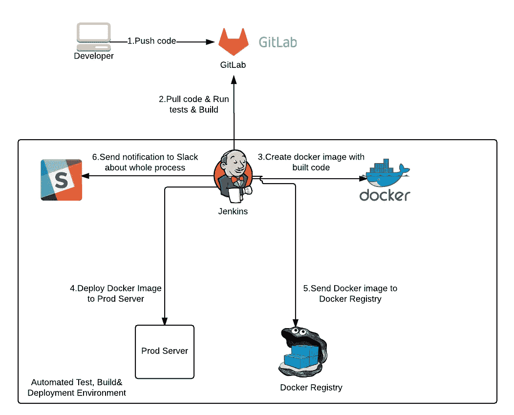
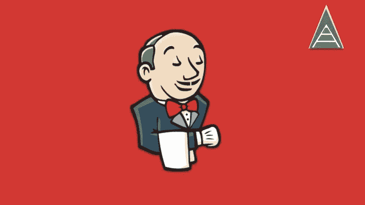
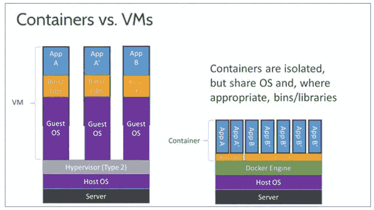
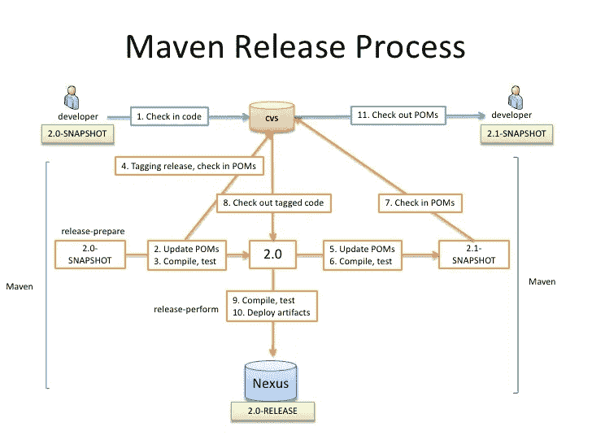
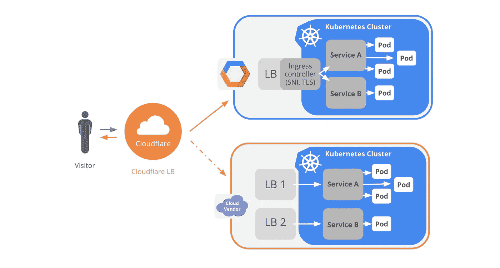
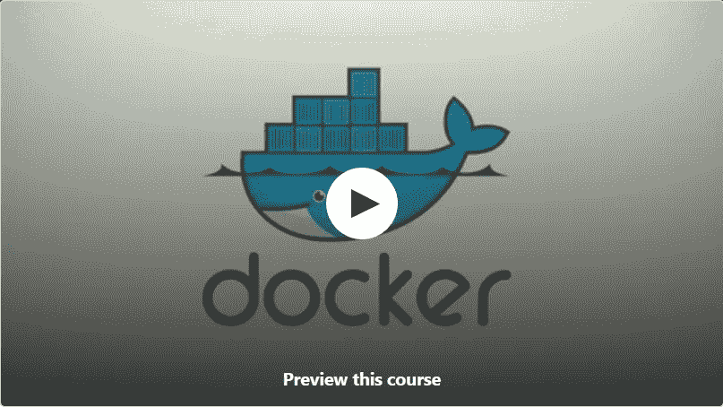
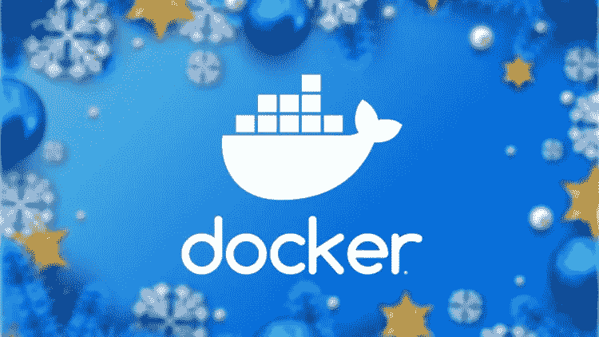
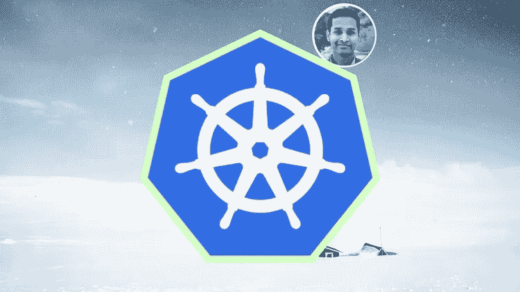

# 2023 年学习 Jenkins、Docker 和 Kubernetes 的 10 大免费 DevOps 课程

> 原文：<https://medium.com/javarevisited/top-10-free-courses-to-learn-jenkins-docker-and-kubernetes-for-devops-in-2020-best-of-lot-62a0541ffeb3?source=collection_archive---------0----------------------->

大家好，你们可能听说过 DevOps 以及它现在受到的所有关注。DevOps 是一个新现象，在高级开发人员中有一场成为 DevOps 工程师的疯狂竞赛。

嗯，我不是其中之一，因为我的热情是成为一名软件架构师，但我确实花了一些时间学习 DevOps，只是为了增加我在该领域的知识，因为我坚信一句话，jack of all and master of one :-)。

在 DevOps 的世界里，工具很重要，整个 DevOps 现象就是创建交付高质量软件的自动化管道，这在很大程度上依赖于 cleaver 对 Maven、 [Jenkins](/javarevisited/top-10-free-courses-to-learn-maven-jenkins-and-docker-for-java-developers-51fa7a1e66f6) 、 [Docker](/javarevisited/10-free-courses-to-learn-docker-and-devops-for-frontend-developers-691ac7652cee) 、Kubernetes 等工具的使用。

如果你正在 [**学习 2023 年的 devo PS**](/javarevisited/13-best-courses-to-learn-devops-for-senior-developers-in-2020-a2997ff7c33c)因为这样或那样的原因，正在寻找一些优秀的在线课程来启动你的旅程，那么你来对地方了。

在这篇文章中，我将分享一些最好的 DevOps 课程，这些课程也是免费的，涵盖了基本工具，如 [Maven](https://javarevisited.blogspot.com/2019/03/top-5-course-to-learn-apache-maven-for.html) 、 [Jenkins](http://www.java67.com/2018/02/6-free-maven-and-jenkins-online-courses-for-java-developers.html) 、 [Docker](http://www.java67.com/2018/02/5-free-docker-courses-for-java-and-DevOps-engineers.html) 和 [Kubernetes](https://javarevisited.blogspot.com/2019/01/top-5-free-kubernetes-courses-for-DevOps-Engineer.html) ，这些课程是每个 DevOps 工程师在 2023 年应该知道的
、
这些课程肯定不深入，但会为你提供足够的知识来开始和从事你的项目，并探索更多，这对初学者来说非常重要。

还有，不要因为这些是免费课程就觉得质量差。大多数课程由经验丰富的讲师讲授，他们是 DevOps 领域的专家，知道自己在讲什么。

这些课程只是出于营销和教育原因免费制作的。大多数时候，一旦他们达到促销目标，讲师还会将他们的免费课程转为付费课程，尤其是在 Udemy。o 请注意这一点，并在参加课程前检查价格。

顺便说一句，如果你只是在寻找一门涵盖基本 DevOps 和大部分这些工具的课程，那么我建议你加入 Udemy 的[**devo PS:Docker Jenkins GIT CI Pipeline 和 Maven**](https://click.linksynergy.com/deeplink?id=JVFxdTr9V80&mid=39197&murl=https%3A%2F%2Fwww.udemy.com%2Fdevops-training%2F) 课程的 Master。这不是免费的，但你可以在 Udemy 的许多 flash 销售中只花 10 美元买到它，它非常值得你花时间。

<https://click.linksynergy.com/deeplink?id=JVFxdTr9V80&mid=39197&murl=https%3A%2F%2Fwww.udemy.com%2Fdevops-training%2F>  

# DevOps 工程师学习 Maven、Jenkins、Docker 和 Kubernetes 的 10 门免费课程

互联网上有很多免费的课程、书籍和教程，但我只选择了其中的 10 个，这也是为了从 DevOps 的角度学习不同的工具。

这些课程将教你构建像 Maven 这样的工具，像 [Jenkins](https://dzone.com/articles/5-courses-to-learn-jenkins-and-ci-in-2019) 这样的 CI/CD 工具，像 [Docker](/@javinpaul/10-free-courses-to-learn-docker-and-devops-for-frontend-developers-691ac7652cee) 这样的容器和像 [Kubernetes](https://dev.to/javinpaul/top-10-courses-to-learn-docker-and-kubernetes-for-programmers-4lg0) 这样的容器管理技术，以及构建太像 [Apache Maven](https://dzone.com/articles/top-5-course-to-learn-apache-maven-for-java-develo) 或 Gradle。一旦你学会了这些工具，你应该能够更舒适地作为一名 DevOps 专业人员工作。您还应该能够在您的项目中实现 DevOps。

话不多说，下面是我列出的一些免费课程，可以学习一些基本的 DevOps 工具，比如 Maven、Jenkins、Docker 和 Kubernetes。

## 1.[詹金斯初学者教程——循序渐进](https://click.linksynergy.com/deeplink?id=JVFxdTr9V80&mid=39197&murl=https%3A%2F%2Fwww.udemy.com%2Fcourse%2Fjenkins-beginner-tutorial-step-by-step%2F)

毫无疑问，Jenkins 是 DevOps 工具链中不可或缺的一部分。它可能是最重要的工具，在 DevOps 现象出现之前就已经存在了。有些人认为 Jenkins 开创了 DevOps，因为正是这个工具首次引入了 Java 项目的自动化构建和部署。无论如何，谈到这个课程，它是一个用 Jenkins 2.0 构建、部署和测试的极好的课程。该课程是免费的，在 Udemy 上有超过 47K 名学生的平均 4.4 分，这充分说明了它的质量。

教官 Raghav Pal 既热情又非常清楚。课程节奏也很快，但解释得很好，而且切中要点，这意味着你会在很短的时间内学到很多东西。我学到了很多。

如果你不喜欢快节奏的课程，你也可以根据自己的方便放慢速度。简而言之，这是关于[詹金斯](https://javarevisited.blogspot.com/2015/01/difference-between-maven-ant-jenkins-and-hudson.html#axzz5YVj9VvGE)的最快、最吸引人、最明确的免费课程。

以下是加入本课程的链接— [JENKINS 初学者教程—循序渐进](https://click.linksynergy.com/deeplink?id=JVFxdTr9V80&mid=39197&murl=https%3A%2F%2Fwww.udemy.com%2Fcourse%2Fjenkins-beginner-tutorial-step-by-step%2F)

## 2.[集装箱 101](https://click.linksynergy.com/deeplink?id=JVFxdTr9V80&mid=39197&murl=https%3A%2F%2Fwww.udemy.com%2Fcontainers-101%2F)

像 Docker 这样的容器再次成为 DevOps 的重要组成部分，因为它允许它们快速伸缩，通过点击按钮建立新的环境，并从应用程序中抽象出 Harward 部分。良好的集装箱知识对于 [DevOps 专业人员](https://dzone.com/articles/the-devops-roadmap-for-programmers)来说是必不可少的，这也是本课程的帮助所在。再次强调，该课程是免费的，至少在撰写本文时是免费的，并且获得了超过 7.5K 名学生的平均 4.3 分的评分。

在本课程中，您将学习如何使用 [Kubernetes](https://javarevisited.blogspot.com/2019/01/top-5-free-kubernetes-courses-for-DevOps-Engineer.html) 、 [Docker](https://hackernoon.com/10-free-courses-to-learn-docker-for-programmers-and-devops-engineers-7ff2781fd6e0) 和 Helm 在现代容器平台上构建和部署应用程序。它包含超过 6 个小时的内容，所以它不是一个简单的课程。

实际上，它是一个录制的网络研讨会的集合，但内容非常出色，并且很好地概述了 Docker 和 DockerCopose。值得注意的是，最佳实践和实现技巧非常棒。

**以下是加入本课程的链接—** [**集装箱 101**](https://click.linksynergy.com/deeplink?id=JVFxdTr9V80&mid=39197&murl=https%3A%2F%2Fwww.udemy.com%2Fcontainers-101%2F)

## 3. [Maven 快速入门:通过示例快速介绍 Maven](https://click.linksynergy.com/deeplink?id=JVFxdTr9V80&mid=39197&murl=https%3A%2F%2Fwww.udemy.com%2Fmaven-quick-start%2F)

有些人可能会认为 Gradle 是比 Maven 更好的工具，这可能是真的，但我们不能忽视 Maven 在当前软件开发世界中的重要性和存在。毫无疑问，它是最常见的构建工具和依赖管理系统，大多数公司和初创公司都使用 Maven 来构建他们的项目，这使得它对于 [DevOps](https://dev.to/javinpaul/10-free-devops-courses-to-learn-jenkins-docker-and-maven-for-programmers-ohp) 工程师来说至关重要。

说到课程，是免费的课程，有 3 个小时的内容。它平均得到了近 2 万名学生 4.4 分的评分，令人印象深刻。

该课程提供了学习 Apache Maven 的分步指南。您将了解核心概念，如何将 Maven 与 [Eclipse](http://www.java67.com/2018/02/5-free-eclipse-and-junit-online-courses-java-developers.html) 一起使用，使用 Maven 构建 Java 项目，将 [Git 源代码控制](https://javarevisited.blogspot.com/2018/01/5-free-git-courses-for-programmers-to-learn-online.html)与 Maven 集成，并在 Maven 中查找和管理依赖项。

总之是 Java 开发者和 DevOps 工程师学习 Maven 的完美课程。

**这里是加入这个免费课程的链接—** [**Maven 快速入门:Maven 快速入门示例**](https://click.linksynergy.com/deeplink?id=JVFxdTr9V80&mid=39197&murl=https%3A%2F%2Fwww.udemy.com%2Fmaven-quick-start%2F)

## 4.[谷歌 Kubernetes 引擎入门](https://coursera.pxf.io/c/3294490/1164545/14726?u=https%3A%2F%2Fwww.coursera.org%2Flearn%2Fgoogle-kubernetes-engine)【Coursera】

除了 Docker，Kubernetes 是 DevOps 工程师的另一个非常棒的必备工具。现在几乎所有基于微服务的应用都在使用 Kubernetes 进行伸缩，这也是你需要了解和掌握 Kubernetes 的原因。

该课程将教你如何在 [Kubernetes](https://javarevisited.blogspot.com/2019/05/top-5-courses-to-learn-docker-and-kubernetes-for-devops.html#axzz69t3S0zAG) 中部署、管理和扩展容器化应用，这是谷歌的一款出色产品，可以帮助部署软件或 web 应用，扩展和管理容器化应用。它还涉及基于使用 Google Cloud 的云中部署。

本课程是 [**备考谷歌云认证:云 DevOps 工程师职业证书**](https://coursera.pxf.io/c/3294490/1164545/14726?u=https%3A%2F%2Fwww.coursera.org%2Fprofessional-certificates%2Fsre-devops-engineer-google-cloud) 的一部分，大概是备考 GCP DevOps 认证考试最好的材料。

<https://coursera.pxf.io/c/3294490/1164545/14726?u=https%3A%2F%2Fwww.coursera.org%2Fprofessional-certificates%2Fsre-devops-engineer-google-cloud>  

说到课程，这是 Coursera 上的免费课程，由[谷歌云](https://javarevisited.blogspot.com/2019/07/top-5-google-cloud-platform-gcp-courses-certifications-online.html)提供，提供 6 小时的内容。它已经在大约 3 万名学生中积累了 4.5 的评分，这非常令人印象深刻。顺便说一句，和很多其他[免费 Coursera 课程](http://www.java67.com/2019/02/top-10-free-algorithms-and-data.html)一样，你也可以免费旁听。

如果你想要一个证书，那么你需要购买课程，这也将让你获得许多测验，评估和同行评议。

你甚至可以在你的 LinkedIn 个人资料中展示该证书，这也可以吸引很多寻找这些前沿技能的招聘人员。

**这里是免费参加本课程的链接**——[开始使用 Google Kubernetes 引擎](https://coursera.pxf.io/c/3294490/1164545/14726?u=https%3A%2F%2Fwww.coursera.org%2Flearn%2Fgoogle-kubernetes-engine)

顺便说一句，如果你觉得 Coursera 的课程有用，那么我也建议你加入 Coursera Plus 的订阅计划，这是 Coursera 的一个订阅计划，可以让你无限制地访问他们最受欢迎的课程、专业、专业证书和指导项目。它每年花费大约 399 美元，但是它完全值你的钱，因为你得到了无限的证书

<https://coursera.pxf.io/c/3294490/1164545/14726?u=https%3A%2F%2Fwww.coursera.org%2Fcourseraplus>  

## 5.[面向 JAVA 开发人员的实用 DOCKER](https://click.linksynergy.com/deeplink?id=JVFxdTr9V80&mid=39197&murl=https%3A%2F%2Fwww.udemy.com%2Fcourse%2Fintroduction-to-docker-for-java-developers%2F)

和 Jenkins 一样，Docker 可能是 DevOps 工程师最必备的工具。它也是最受欢迎的部署微服务的容器。

谈到这门课程，它对 Java 开发人员来说又是一门极好的课程，包含大约 4 个小时的高质量免费内容，听起来可能不多，但它包含了大量信息。

这门课程是免费的，22000 名学生的平均评分为 4.5 分，令人印象深刻。指导老师也是专家，非常清晰自信。

课程也很有动手能力，如果你跟着做，你会立刻开始使用 Docker。您将首先学习如何安装和配置 [Docker](https://hackernoon.com/java-developers-learn-maven-jenkins-and-docker-using-these-free-courses-pnuc320j) ，然后学习更高级的主题，如使用 Dockerfile 构建自定义映像、管理映像和容器以及了解容器生命周期等。

**这是参加本课程**—[JAVA 开发人员实用工具](https://click.linksynergy.com/deeplink?id=JVFxdTr9V80&mid=39197&murl=https%3A%2F%2Fwww.udemy.com%2Fcourse%2Fintroduction-to-docker-for-java-developers%2F)的链接

简而言之，这是一个从 Docker 开始的极好的免费课程，Docker 正是你正在使用的容器。

## 6.[Jenkins 入门:初学者的关键概念](https://click.linksynergy.com/deeplink?id=JVFxdTr9V80&mid=39197&murl=https%3A%2F%2Fwww.udemy.com%2Fcourse%2Fjenkins-quick-start%2F)

这是另一个免费的 Udemy 课程，面向开发人员和 DevOps 工程师学习 Jenkins。在这个 1 小时 40 分钟的免费课程中，您将了解 Jenkins 的主要概念，包括**安装、配置和使用 Jenkins！**

以下是你将在这门免费课程中学到的主要内容:

1.  Jenkins 的安装和配置
2.  准备构建帐户
3.  管理插件
4.  创建和管理版本
5.  设置一个构建奴隶
6.  计划构建
7.  在从属节点上启动构建

学完本课程后，您就可以在自己的环境中实施 Jenkins 进行配置管理和部署了！

**这里是免费加入本课程的链接**——[Jenkins 入门:初学者的关键概念](https://click.linksynergy.com/deeplink?id=JVFxdTr9V80&mid=39197&murl=https%3A%2F%2Fwww.udemy.com%2Fcourse%2Fjenkins-quick-start%2F)

## 7.[码头工人必备](https://click.linksynergy.com/deeplink?id=JVFxdTr9V80&mid=39197&murl=https%3A%2F%2Fwww.udemy.com%2Fcourse%2Fdocker-essentials%2F)

这是一个很好的免费课程，可以学习 Docker 在 Udemy 上的关键概念。在这个 2 小时 50 分钟的免费在线课程中，您将通过 Docker 生态系统(Docker、Compose 和 Swarm)实际学习容器化和流程编排。

以下是您将在本课程中学到的关键技能

1.  对集装箱和码头有深入的了解。
2.  在深入实验室的帮助下，在开发和/或生产环境中使用 Docker。
3.  通过手工测验明确概念，并能够避免关于容器的常见误解。
4.  高效使用 Docker CLI
5.  使用 Docker 文件创建自定义 Docker 图像
6.  使用 Docker Compose 创建和运行多容器应用程序
7.  管理 Docker 集群

这门课程也非常实用和吸引人。它有超过 30 个 Docker 命令行、文件和应用程序的演示和超过 7 个 T2 测验来测试你的理解并在需要时纠正你自己！

**这里是免费加入这个码头工人课程的链接** — [码头工人基础知识](https://click.linksynergy.com/deeplink?id=JVFxdTr9V80&mid=39197&murl=https%3A%2F%2Fwww.udemy.com%2Fcourse%2Fdocker-essentials%2F)

## 8. [Kubernetes:入门](https://click.linksynergy.com/deeplink?id=JVFxdTr9V80&mid=39197&murl=https%3A%2F%2Fwww.udemy.com%2Fcourse%2Fkubernetes-getting-started%2F)

这是一个在 Udemy 上学习 Kubernetes 的免费在线课程。在这个 3 小时 40 分钟的免费课程中，您将了解容器编排引擎和 Kubernetes 的基础知识，开始进入 Kubernetes 的世界。

以下是你将在本课程中学到的关键技能—

1.  Kubernetes 基础。
2.  为什么我们需要一个好的容器编排引擎，以及为什么 Kubernetes 是您的首选
3.  深入了解什么是 pod，它们如何连接和通信
4.  如何编写 Pod 清单文件并在 Kubernetes 上部署它
5.  如何使用节点端口服务将应用程序公开到 internet 上。

总的来说，这是一个非常棒的免费 Kubernetes 课程，面向 DevOps 工程师、开发人员、管理员或任何有兴趣了解 Kubernetes 的人。

**以下是加入本课程的链接** — [Kubernetes:入门](https://click.linksynergy.com/deeplink?id=JVFxdTr9V80&mid=39197&murl=https%3A%2F%2Fwww.udemy.com%2Fcourse%2Fkubernetes-getting-started%2F)

## 9. [Kubernetes 初学者基础](https://click.linksynergy.com/deeplink?id=JVFxdTr9V80&mid=39197&murl=https%3A%2F%2Fwww.udemy.com%2Fcourse%2Fkubernetes-fundamentals-for-beginners%2F)

这是另一个学习 Kubernetes 关于 Udemy 基础知识的简短免费课程。本课程由 Arpit Roy 创建，将在 1 小时内为您提供 Kubernetes 架构和基础的概述。

以下是您将在这门免费课程中学到的重要知识:

1.  库伯内特的历史——它从何而来
2.  Kubernetes —什么和为什么
3.  Kubernetes 的大图
4.  有哪些高手？
5.  有哪些节点？
6.  理解期望的状态和声明性模型
7.  了解 pod、服务和部署

**这是加入本课程的链接**——[Kubernetes 初学者基础](https://click.linksynergy.com/deeplink?id=JVFxdTr9V80&mid=39197&murl=https%3A%2F%2Fwww.udemy.com%2Fcourse%2Fkubernetes-fundamentals-for-beginners%2F)

请注意，这只是针对初学者的入门课程，不包含任何演示或实验练习。关于 Kubernetes 的深入课程以及动手实验演示，请查看针对绝对初学者的[**Kubernetes——动手**](https://click.linksynergy.com/deeplink?id=JVFxdTr9V80&mid=39197&murl=https%3A%2F%2Fwww.udemy.com%2Fcourse%2Flearn-kubernetes%2F) 课程。

这些都是关于一些了解 DevOps 的最佳课程以及一些对于 DevOps 开发人员来说必不可少的工具，比如 Jenkins、Maven、Docker 和 Kubernetes。正如我说过的，DevOps 是一种新现象，但是对 DevOps 工程师的需求非常高，如果你想促进你的职业发展，你应该花点时间学习 DevOps 并提高你的形象。

其他**编程文章**您可能会喜欢
[2023 Java 开发人员路线图](https://javarevisited.blogspot.com/2019/10/the-java-developer-roadmap.html)
[2023 DevOps 开发人员路线图](https://hackernoon.com/the-2018-devops-roadmap-31588d8670cb)
[Java 程序员学习 Jenkins 的前 5 个课程](https://javarevisited.blogspot.com/2018/09/top-5-jenkins-courses-for-java-and-DevOps-Programmers.html)
[10 个工具每个 Java 开发人员都应该知道](http://www.java67.com/2018/04/10-tools-java-developers-should-learn.html)
[5 个深入学习 Kubernetes 的免费课程](https://javarevisited.blogspot.com/2019/01/top-5-free-kubernetes-courses-for-DevOps-Engineer.html)
[10 种您可以学习的编程语言](http://www.java67.com/2017/12/10-programming-languages-to-learn-in.html)
[2023 年成为更好的 Java 开发人员十大秘诀](http://javarevisited.blogspot.sg/2018/05/10-tips-to-become-better-java-developer.html)
[学习 Java 编程语言的十大理由](http://javarevisited.blogspot.sg/2013/04/10-reasons-to-learn-java-programming.html)
[15 学习 Docker、Kubernetes 和 AWS](/javarevisited/top-15-online-courses-to-learn-docker-kubernetes-and-aws-for-fullstack-developers-and-devops-d8cc4f16e773)
[2023 年 Java 框架学习前 5 名](http://javarevisited.blogspot.sg/2018/04/top-5-java-frameworks-to-learn-in-2018_27.html)
[10 测试库每一个 Java 开发人员都应该知道](https://javarevisited.blogspot.sg/2018/01/10-unit-testing-and-integration-tools-for-java-programmers.html)

感谢阅读本文至今。 如果您喜欢这些*学习 Jenkins、Docker 和 CI/CD* 的最佳免费 DevOps 课程，请与您的朋友和同事分享。如果您有任何问题或反馈，请留言。

**p . s .**——在 Coursera 上还有另一门优秀的免费课程，由弗吉尼亚大学提供，学习 [**DevOps 和**](https://coursera.pxf.io/c/3294490/1164545/14726?u=https%3A%2F%2Fwww.coursera.org%2Flearn%2Fuva-darden-continous-delivery-devops) 。如果您需要德文普斯认证和 Coursera 课程，您也可以查看该课程，它值得您花费时间，并获得了一些好评。

<https://coursera.pxf.io/c/3294490/1164545/14726?u=https%3A%2F%2Fwww.coursera.org%2Flearn%2Fuva-darden-continous-delivery-devops> 