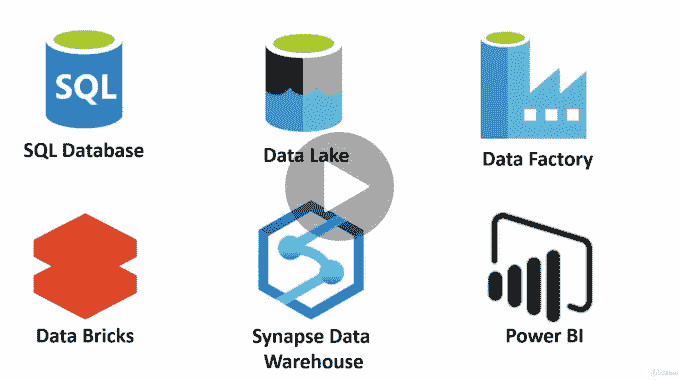
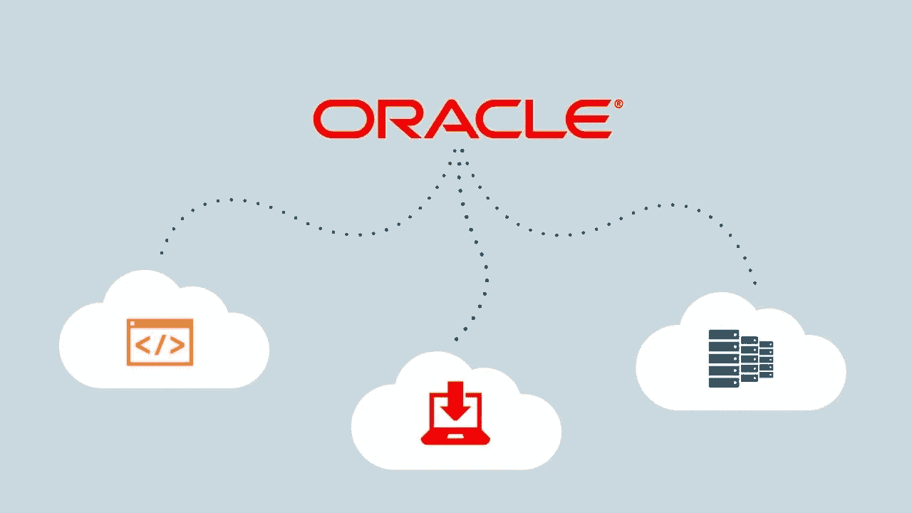
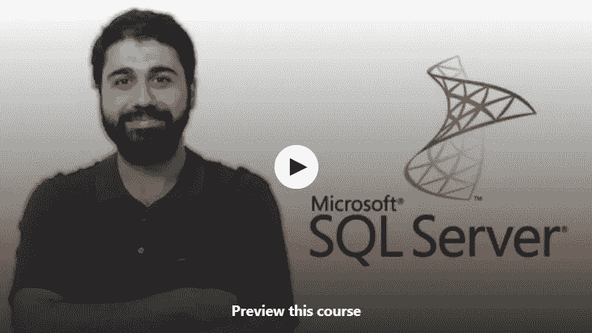
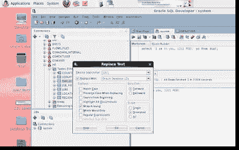
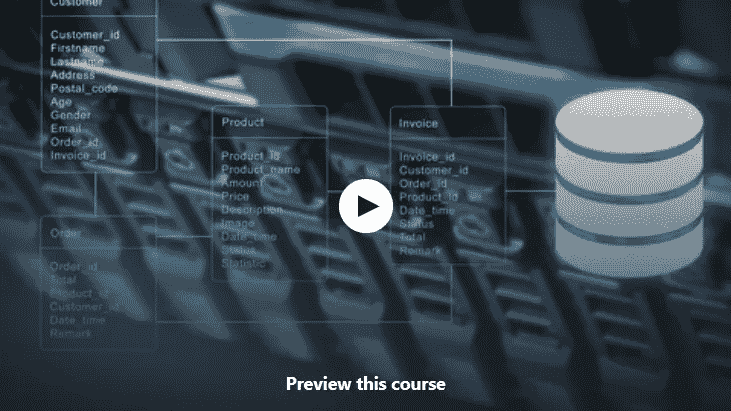
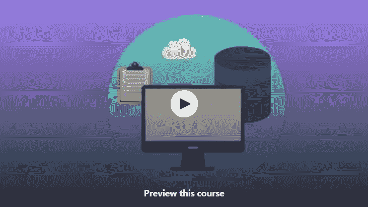
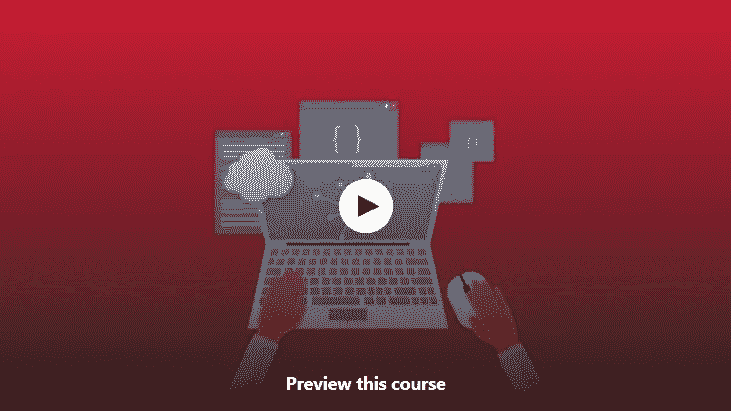
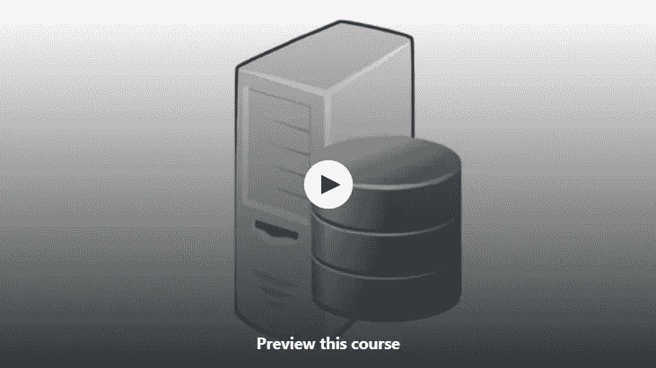

# 2023 年学习微软 SQL Server 和 Oracle 的 10 大免费课程

> 原文：<https://medium.com/javarevisited/top-10-free-courses-to-learn-microsoft-sql-server-and-oracle-database-in-2020-6708afcf4ad7?source=collection_archive---------0----------------------->

## 这些是从 Udemy 和 edX 学习 Oracle 和 Microsoft SQL Server 数据库的最佳免费课程

如果你是一名应用程序开发人员，就像使用 [Java](/javarevisited/top-5-java-online-courses-for-beginners-best-of-lot-1e1e240a758) 或[开发服务器端应用程序的人。NET 或任何其他使用数据库的编程语言，如 Oracle 和 Microsoft SQL Server，或者初级 DBA，那么你必须学习这些数据库技术，以便有效地工作。](/javarevisited/7-best-online-courses-to-learn-asp-net-core-and-mvc-in-depth-a68c1b728090)

尽管您的组织可能有 DBA 或数据库管理员来帮助您管理数据库，但更多情况下，最终是应用程序开发人员编写 SQL 脚本来创建数据、上传数据、查询数据，并编写复杂的[存储过程](http://javarevisited.blogspot.sg/2013/02/-create-and-call-mysql-stored-procedure-database-sql-example-tutorial.html)和触发器来实现应用程序功能。DBA 的工作主要是数据库安装、访问控制、安全和其他数据库管理工作。
T5[甲骨文](/javarevisited/6-best-pl-sql-and-oracle-courses-for-beginners-to-learn-online-effd07d5fd2)和[微软 SQL Server](/javarevisited/5-best-courses-to-learn-microsoft-sql-server-in-depth-e9f11b73c14a) 都是非常流行的数据库，许多组织用它们来存储数据。他们也有自己的 SQL 语言，如 [PL/SQL](http://javarevisited.blogspot.sg/2017/09/top-4-books-to-learn-oracle-plsql-best-must-read.html) 和 [T-SQL](http://javarevisited.blogspot.sg/2017/03/difference-between-sql-tsql-and-plsql.html) ，它们增强了 SQL，并允许您通过创建 SQL 脚本来做更强大的事情。如果你想学习 Oracle 和 SQL Server，那么你来对地方了。在本文中，我将分享 5 门免费的 Oracle 和 SQL server 课程，您可以在线学习这些技术或提高自己的知识。

我分享在线课程和书籍等免费资源已经有一段时间了，如果你是第一次来这里，那么你可以搜索这个博客，找到关于 [Java](http://javarevisited.blogspot.sg/2017/11/top-5-free-java-courses-for-beginners.html#axzz4zuIICRs9) 、 [Python](http://www.java67.com/2018/02/5-free-python-online-courses-for-beginners.html) 、 [Linux](http://www.java67.com/2018/02/5-free-linux-unix-courses-for-programmers-learn-online.html) 、 [Angular](http://www.java67.com/2018/01/top-5-free-angular-js-online-courses-for-web-developers.html) 、 [Spring](http://www.java67.com/2017/11/top-5-free-core-spring-mvc-courses-learn-online.html) 以及更多技术的免费课程。我热爱学习，不久前书籍还是我学习的主要来源。每当我想学习新的框架或编程语言时，我就买几本书开始学习，但自从我开始在 Udemy 上学习在线课程后，我就再也没有回头。它们是学习新东西的最好方法。我仍然阅读书籍，主要是为了深入了解概念，但我真的发现在线课程对新技术的开始很有帮助。我花更多时间学习在线课程的另一个原因是，如今它们比书本便宜得多，你可以在 Udemy 的 [flash sales](https://click.linksynergy.com/fs-bin/click?id=JVFxdTr9V80&offerid=323058.9409&type=3&subid=0) 上通过`$10.99`或`$9.99`获得课程。我还在 Udemy 上发现了许多在线课程，人们在那里分享他们的个人经验，这是最有效的学习方法。

# 免费学习 Oracle 和 Microsoft SQL Server 的 10 门最佳课程

不管怎样，还是回到正题吧。我在职业生涯中用过几个数据库，像 [MySQL](http://www.java67.com/2018/02/5-free-php-and-mysql-courses-for-web-developers.html) 、 [Oracle](http://javarevisited.blogspot.sg/2016/01/4-ways-to-find-nth-highest-salary-in.html#axzz56lZV00oe) 、 [SQL Server](http://www.java67.com/2018/01/top-4-free-microsoft-sql-server-books.html) 和 [PostgreSQL](https://javarevisited.blogspot.com/2020/02/top-5-courses-to-learn-postgresql-in.html) 。每当我改变项目时，我都在不同的数据库中工作，这迫使我学习其中的许多来正确地完成我的工作。

作为[软件开发人员](/javarevisited/11-essential-skills-to-become-software-developer-in-2020-c617e293e90e)，你必须了解 SQL 以及你正在使用的数据库。如果您在 Microsoft SQL Server 中工作，仅仅了解 SQL 是不够的。您必须对 Microsoft SQL Server 本身及其使用的查询语言(如 Transact-SQL 或 t-SQL)有所了解。
T13[Oracle](/javarevisited/8-free-oracle-database-and-sql-courses-for-beginners-f4e9b25b33c4)和 [MySQL](/@javinpaul/top-5-courses-to-learn-mysql-in-2020-4ffada70656f) 也是如此。要在 Oracle 数据库上有效工作，如编写 SQL 脚本、生成报告、上传和下载数据等，需要良好的 PL/SQL 知识。

这些**免费的在线课程和教程**对于从甲骨文和微软 SQL Server 开始学习非常有帮助。它们不是最全面的或提供深入的知识，但它们会给你足够的细节来执行你的日常任务。

## [1。微软 SQL 初学者(SQL Server 和 T-SQL)](https://click.linksynergy.com/deeplink?id=JVFxdTr9V80&mid=39197&murl=https%3A%2F%2Fwww.udemy.com%2Fcourse%2Fmicrosoft-sql-for-beginners-sql-server-and-t-sql%2F) 【免费】

这个免费的 Microsoft SQL Server 课程是为那些想学习数据库和 SQL for Microsoft SQL Server online 的初学者准备的。

本课程涵盖一系列主题，您将学习基本的数据库概念和 SQL，包括

1.  设置和安装 SQL Server
2.  安装示例数据库
3.  使用 WHERE 子句选择查询
4.  高级 SQL 查询
5.  连接、聚合函数和子查询
6.  存储过程和视图

**这里是免费报名的链接—** [微软 SQL 初学者(SQL Server 和 T-SQL)](https://click.linksynergy.com/deeplink?id=JVFxdTr9V80&mid=39197&murl=https%3A%2F%2Fwww.udemy.com%2Fcourse%2Fmicrosoft-sql-for-beginners-sql-server-and-t-sql%2F)

## 2. [Oracle SQL:最流行数据库简介](https://click.linksynergy.com/deeplink?id=JVFxdTr9V80&mid=39197&murl=https%3A%2F%2Fwww.udemy.com%2Fcourse%2Foracle-sql-an-introduction-to-the-most-popular-database%2F)

如果您想了解 Oracle SQL 和 SELECT 语句的六个主要子句，本初级课程适合您。

您将了解如何免费安装 Oracle Express Edition 和 Oracle SQL Developer 版本。

然后，我们将查看 SELECT 语句及其 6 个主要子句(SELECT、FROM、WHERE、GROUP BY、HAVING 和 ORDER BY)。

接下来，我们将看看你还需要知道什么，以及有助于你学习的资源(从免费到非常昂贵)。

不需要任何先验知识——只需要愿意学习。

**这里是免费注册的链接—** [一小时内 SQL Server！](https://click.linksynergy.com/deeplink?id=JVFxdTr9V80&mid=39197&murl=https%3A%2F%2Fwww.udemy.com%2Fcourse%2Fsql-server-in-one-hour%2F)

顺便说一句，如果你不介意花点钱学习 Oracle 和 PL/SQL 这样有价值的技能，那么我也推荐你去看看 Udemy 上的 [**Oracle PL/SQL 基础第一卷&第二卷**](https://click.linksynergy.com/deeplink?id=JVFxdTr9V80&mid=39197&murl=https%3A%2F%2Fwww.udemy.com%2Fcourse%2Foracle-plsql-fundamentals-vol-i-ii%2F) 课程。这是一门学习 Oracle 和 PL/SQL 的很好的课程，你可以在每月疯狂的 Udemy 销售中只花 9.99 美元。

## [3。SQL Server 在一个小时内！](https://click.linksynergy.com/deeplink?id=JVFxdTr9V80&mid=39197&murl=https%3A%2F%2Fwww.udemy.com%2Fcourse%2Fsql-server-in-one-hour%2F)【免费】

在这个简短的免费课程中，您将从头开始学习 Microsoft SQL Server 数据库系统并构建一个示例项目

在本课程中，您将从头开始学习 Microsoft SQL server。您将首先了解基本的数据库概念，然后我们将安装 SQL server，在 SQL server 中创建一个示例数据库。

我们将开始学习 SQL server 的基础知识，如插入/更新/删除语句、主键、排序和分组等。此外，我将创建一个示例 C#应用程序，并向您展示如何连接 SQL server 和构建一个小的登录表单。

**这里是免费报名的链接—** [一小时内 SQL Server！](https://click.linksynergy.com/deeplink?id=JVFxdTr9V80&mid=39197&murl=https%3A%2F%2Fwww.udemy.com%2Fcourse%2Fsql-server-in-one-hour%2F)

## [4。Oracle SQL 起点](https://click.linksynergy.com/deeplink?id=JVFxdTr9V80&mid=39197&murl=https%3A%2F%2Fwww.udemy.com%2Fcourse%2Foracle-sql-starting-point%2F)

在本课程中，您将学习如何安装和配置 install Oracle、SQL Developer，并深入了解 SQL、SQL Plus 和 SQL Developer

您将学习如何创建数据库连接、执行命令和脚本，并学习如何以更轻松的方式显示结果。

课程还教你如何使用不同的方法导出不同格式的数据，以及如何使用代码模板和代码片段更轻松快捷地编写代码。

了解您的工具对于成为一名优秀的开发人员非常重要，这也是我向使用 Oracle SQL Developer tool 处理 Oracle 数据库的程序员强烈推荐本课程的原因。它是免费的，所以你不会有任何损失。

**这里是免费报名的链接—** [Oracle SQL 起点](https://click.linksynergy.com/deeplink?id=JVFxdTr9V80&mid=39197&murl=https%3A%2F%2Fwww.udemy.com%2Fcourse%2Foracle-sql-starting-point%2F)

这是一门学习 Oracle SQL Server 的极好课程，Oracle SQL Server 是一个允许您连接到多个 Oracle 数据库并对它们运行 SQL 查询的集成开发环境或工具。

它就像 SQL server Management studio 或 TOAD，另一种连接和使用 Oracle 数据库的流行工具。

## [**5。微软 SQL Server —简介**](https://click.linksynergy.com/deeplink?id=JVFxdTr9V80&mid=39197&murl=https%3A%2F%2Fwww.udemy.com%2Fcourse%2Fmicrosoft-sql-server-an-introduction-2018-edition%2F)

这是一门从 Microsoft SQL Server 开始的非常棒的免费课程。无论您是应用程序开发人员还是有抱负的 DBA，您都将从本课程中受益。它非常详细，向您介绍了 SQL Server 的许多部分，例如

*   SQL Server Management Studio (SSMS，它允许您学习 T-SQL 和执行查询。
*   SQL Server Integration Services(SSIS)，可自动转换数据。
*   SQL Server Analysis Services (SSAS)，它允许创建多维数据集，以及
*   SQL Server Reporting Services(SSRS)，允许创建报表。

**这里是免费注册的链接—** [微软 SQL Server —简介](https://click.linksynergy.com/deeplink?id=JVFxdTr9V80&mid=39197&murl=https%3A%2F%2Fwww.udemy.com%2Fcourse%2Fmicrosoft-sql-server-an-introduction-2018-edition%2F)

您还将了解 Microsoft SQL Server 考试，以及去哪里了解更多信息并获得一些实际经验。

简而言之，对于任何想学习 SQL Server 和 T-SQL 的人来说，这是一门关于[微软 SQL Server](/javarevisited/7-free-courses-to-learn-database-and-sql-for-programmers-and-data-scientist-e7ae19514ed2) 的入门课程。您应该参加这个课程来开始您的 SQL Server 之旅，它也是免费的，所以您不会有任何损失。

## 6. [Oracle SQL —完整介绍](https://click.linksynergy.com/deeplink?id=JVFxdTr9V80&mid=39197&murl=https%3A%2F%2Fwww.udemy.com%2Fcourse%2Fintroduction-to-oracle-sql%2F)

Oracle 是有史以来最流行的关系数据库之一。这个免费课程向任何对 Oracle SQL 开发感兴趣的人(如应用程序开发人员和数据库管理员)介绍 Oracle SQL。这是一门基础课程，从 SQL 开始，所以如果你已经知道 SQL，那么你可能会对课程的缓慢进度感到厌倦。这不是你将看到的 [Oracle 课程](https://javarevisited.blogspot.com/2021/05/top-5-oracle-database-and-plsql-online-courses.html)中最好的，但最重要的是它是免费的，并提供了 Oracle SQL 的体面介绍。

简而言之，只有在您从零开始学习的情况下，才可以参加这个免费课程，否则请进入下一个更有趣的课程，该课程提供了一些使用 Oracle SQL Developer(Oracle 数据库最常用的工具)时有用的提示和技巧。

**这里是免费注册的链接—** [Oracle SQL —完整介绍](https://click.linksynergy.com/deeplink?id=JVFxdTr9V80&mid=39197&murl=https%3A%2F%2Fwww.udemy.com%2Fcourse%2Fintroduction-to-oracle-sql%2F)

## [**7。成为 SQL Server DBA 的终极指南**](https://click.linksynergy.com/fs-bin/click?id=JVFxdTr9V80&subid=0&offerid=323058.1&type=10&tmpid=14538&RD_PARM1=https%3A%2F%2Fwww.udemy.com%2Fthe-ultimate-guide-in-becoming-a-sql-server-dba%2F)

这个免费课程是专门为希望成为 SQL Server DBA 的 IT 专业人员设计的，这是一个非常赚钱的职业。我在伦敦和美国有许多 SQL Server DBA 朋友，他们作为顾问赚了很多钱，并激励了许多人进入数据库管理领域。

本课程将教你成为 SQL Server DBA 所想知道但又不敢问的一切。

本课程的主要目的是让人们了解 SQL Server 管理是什么，成为 SQL Server DBA 需要哪些技能和信息。

**这里是免费注册的链接—** [成为 SQL Server DBA 的终极指南](https://click.linksynergy.com/fs-bin/click?id=JVFxdTr9V80&subid=0&offerid=323058.1&type=10&tmpid=14538&RD_PARM1=https%3A%2F%2Fwww.udemy.com%2Fthe-ultimate-guide-in-becoming-a-sql-server-dba%2F)

您还将找到一些关于该工作的指导原则，并获得一些安装和浏览 SQL Server management studio 的实践经验。

## 8. [**高级数据库和 SQL 查询**](https://click.linksynergy.com/fs-bin/click?id=JVFxdTr9V80&subid=0&offerid=323058.1&type=10&tmpid=14538&RD_PARM1=https%3A%2F%2Fwww.udemy.com%2Fadvanced-tsql-querying-using-sql-2014%2F)

您可能知道不同的数据库供应商在其数据库中使用不同的 SQL 方言，这在 SQL 之上提供了额外的功能。

例如，Oracle 有 [PL/SQL](https://javarevisited.blogspot.com/2017/03/difference-between-sql-tsql-and-plsql.html) 而 Microsoft SQL Server 有 [T-SQL](https://javarevisited.blogspot.com/2020/02/top-5-courses-to-learn-microsoft-sql-server-mssql.html) 提供循环、运算符和函数来编写强大的 SQL Server 脚本和存储过程。

这个免费课程将教你那些高级的 T-SQL 查询概念，这将让你编写复杂的 SQL 查询。

本课程涵盖了视图、触发器、动态查询等高级概念。所有演示的 T-SQL 脚本都已上传。这门课程大约 2 个多小时，在每个概念的结尾都有作业。

**这里是免费注册的链接—** [高级数据库和 SQL 查询](https://click.linksynergy.com/fs-bin/click?id=JVFxdTr9V80&subid=0&offerid=323058.1&type=10&tmpid=14538&RD_PARM1=https%3A%2F%2Fwww.udemy.com%2Fadvanced-tsql-querying-using-sql-2014%2F)

## [9。使用 Transact-SQL 查询数据](https://www.awin1.com/cread.php?awinmid=6798&awinaffid=631878&clickref=&p=%5B%5Bhttps%3A%2F%2Fwww.edx.org%2Fcourse%2Fquerying-data-with-transact-sql-2)

除了 Oracle，Microsoft SQL Server 是另一种流行的关系数据库，它有自己的 SQL 方言 T-SQL。它为标准 SQL 提供了一些有用的函数和操作符。

如果你想学习微软 SQL Server 中的 SQL，那么这是适合你的课程。在这个来自 [edX](https://www.awin1.com/cread.php?awinmid=6798&awinaffid=631878&clickref=&p=%5B%5Bhttps%3A%2F%2Fwww.edx.org%2Fcourse%2Fcs50s-introduction-to-computer-science) 的免费在线培训课程中，您将学习如何免费安装 SQL Server Express，感谢 edX 团队

您还将学习如何创建表格和向表格中添加数据。一旦准备好数据库，就可以开始练习 SQL 查询了。这使得本课程非常适合初学 DBA 以及使用 MSSQL 的程序员和应用程序开发人员。

**这里是免费注册的链接—** [用 Transact-SQL 查询数据](https://www.awin1.com/cread.php?awinmid=6798&awinaffid=631878&clickref=&p=%5B%5Bhttps%3A%2F%2Fwww.edx.org%2Fcourse%2Fquerying-data-with-transact-sql-2)

## 10.[Oracle SQL 实战练习](https://click.linksynergy.com/deeplink?id=JVFxdTr9V80&mid=39197&murl=https%3A%2F%2Fwww.udemy.com%2Fcourse%2Foracle-and-sql-step-by-step-learning%2F)

这是另一个在 Udemy 上学习 Oracle SQL 的免费课程。课程教你 Oracle SQL。这门课程试图用两种方法传授知识。

1.讲座。这些讲座向您介绍了 Oracle SQL 的基础知识以及重要的细微差别。例如，除了学习空值的含义之外，您还将学习空值[可能有问题的情况。](https://javarevisited.blogspot.com/2017/01/how-to-check-for-null-values-in-sql.html)

2.练习—pdf->练习涉及视频中介绍的概念及其细微差别。

问题的答案和解释将在下一页提供。偶尔有些问题也可以请你就一个与讲座相关的话题做一些自我探索(推荐)。如果你没有时间这样做，你也可以看看下一页的答案和解释。

**这里是免费报名的链接—** [用 Transact-SQL 查询数据](https://www.awin1.com/cread.php?awinmid=6798&awinaffid=631878&clickref=&p=%5B%5Bhttps%3A%2F%2Fwww.edx.org%2Fcourse%2Fquerying-data-with-transact-sql-2)

以上是关于学习甲骨文和微软 SQL Server 的一些**免费在线培训课程。这些课程不仅教授您 Oracle 或 SQL Server 的基础知识，还教授他们使用的 SQL 方言，如 PL/SQL 和 T-SQL。如果您是一名应用程序开发人员或初级 DBA，正在努力学习这些技术，那么这些课程是很好的开始。**

其他**免费在线课程**面向程序员你可能喜欢的
[5 门免费课程面向初学者学习 Docker](/javarevisited/top-5-free-courses-to-learn-docker-for-beginners-best-of-lot-b2b1ad2b98ad)
[10 门免费课程面向 2023 年学习 AWS](/javarevisited/top-10-courses-to-learn-amazon-web-services-aws-cloud-in-2020-best-and-free-317f10d7c21d)
[5 门免费课程面向数据科学学习 R](/javarevisited/top-5-free-courses-to-learn-r-programming-for-data-science-and-statistics-in-2020-305bf1c6f24e)
[15 门免费课程面向初学者学习 Python 编程](/swlh/5-free-python-courses-for-beginners-to-learn-online-e1ca90687caf)
[10 门免费课程面向 Java 编程](/javarevisited/10-free-courses-to-learn-java-in-2019-22d1f33a3915)
[7 门免费课程面向 SQL 和数据库](/javarevisited/7-free-courses-to-learn-database-and-sql-for-programmers-and-data-scientist-e7ae19514ed2) [学习 Angular for Web 开发的书籍和课程](/javarevisited/7-free-courses-to-learn-database-and-sql-for-programmers-and-data-scientist-e7ae19514ed2)
[我最喜欢的免费课程学习数据结构和算法](/free-code-camp/these-are-the-best-free-courses-to-learn-data-structures-and-algorithms-in-depth-4d52f0d6b35a)
[我最喜欢的免费 JavaScript 初学者教程](/javarevisited/my-favorite-free-tutorials-and-courses-to-learn-javascript-8f4d0a71faf2)
[微软和谷歌的 10 个免费 Python 教程](/swlh/5-free-python-courses-for-beginners-to-learn-online-e1ca90687caf)
[100+ Udemy 免费课程学习编程](/javarevisited/100-free-programming-and-web-development-courses-on-udemy-free-resource-center-3f8415eb5e6f)
[我最喜欢的免费课程学习 Jenkins、Maven 和 Docker](/javarevisited/top-10-free-courses-to-learn-maven-jenkins-and-docker-for-java-developers-51fa7a1e66f6?source=collection_home---4------3-----------------------)

感谢您阅读本文。如果你喜欢这些免费的在线课程来学习微软 SQL Server 和 Oracle 数据库，那么请与你的朋友和同事分享。如果您有任何问题或反馈，请留言。

如果你不介意花点钱学习 Oracle 和 PL/SQL 这样有价值的技能，那么我也推荐你参加 Udemy 上的 [**Oracle PL/SQL 基础第一卷&第二卷**](https://click.linksynergy.com/deeplink?id=JVFxdTr9V80&mid=39197&murl=https%3A%2F%2Fwww.udemy.com%2Fcourse%2Foracle-plsql-fundamentals-vol-i-ii%2F) 课程。这是一门学习 Oracle 和 PL/SQL 的很好的课程，你可以在每月疯狂的 Udemy 销售中只花 9.99 美元。

 [## Oracle PL/SQL (PLSQL)基础第一卷和第二卷

### PL/SQL 数据库编程语言的完整介绍

udemy.com](https://click.linksynergy.com/deeplink?id=JVFxdTr9V80&mid=39197&murl=https%3A%2F%2Fwww.udemy.com%2Fcourse%2Foracle-plsql-fundamentals-vol-i-ii%2F) 

**P.P.S. —** 同样，如果你需要学习微软 SQL Server 的综合课程，那么我推荐 [**微软 SQL 初学者**](https://click.linksynergy.com/deeplink?id=JVFxdTr9V80&mid=39197&murl=https%3A%2F%2Fwww.udemy.com%2Fcourse%2Fmicrosoft-sql-for-beginners%2F) ，一门使用微软 SQL Server 和 T-SQL 语言学习 SQL 查询的综合课程。

 [## Microsoft SQL Server 和 T-SQL:从初级到高级

### 这是一门综合性课程，教您如何使用 Microsoft SQL Server 和 T-SQL 语言完成 SQL 查询。

udemy.com](https://click.linksynergy.com/deeplink?id=JVFxdTr9V80&mid=39197&murl=https%3A%2F%2Fwww.udemy.com%2Fcourse%2Fmicrosoft-sql-for-beginners%2F)