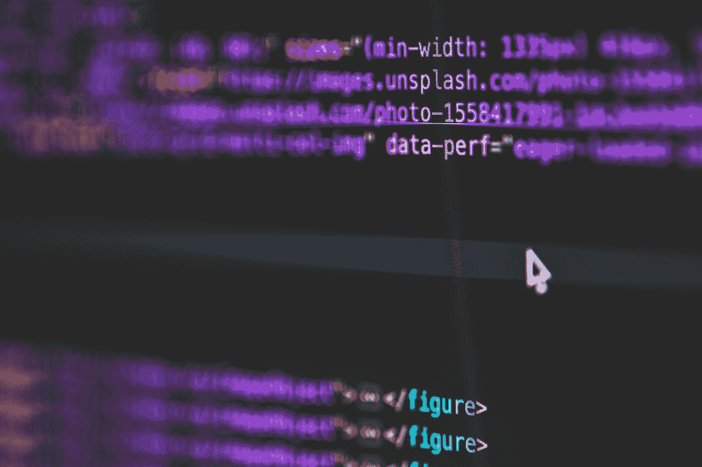
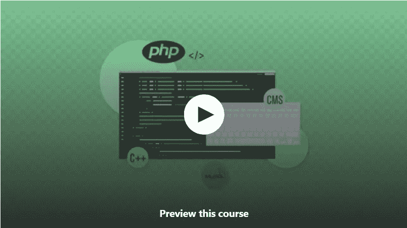
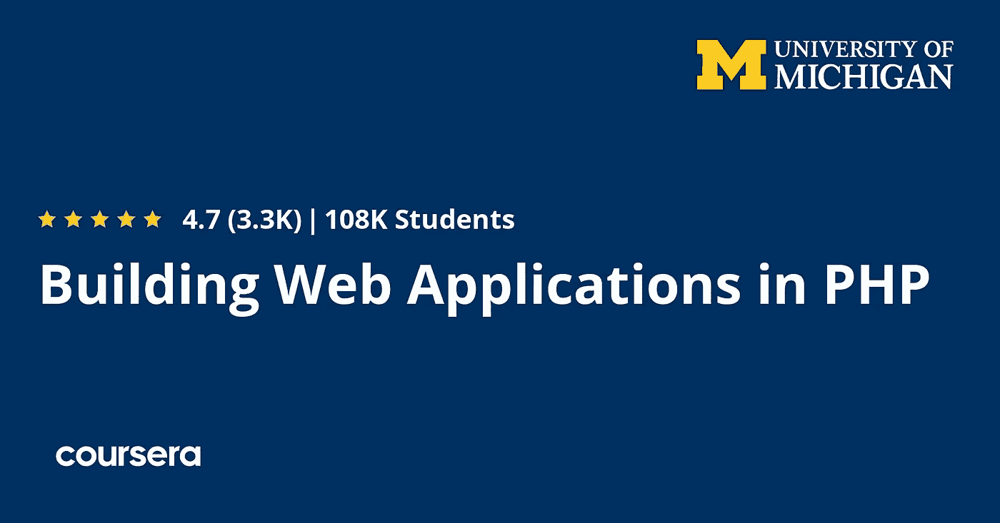
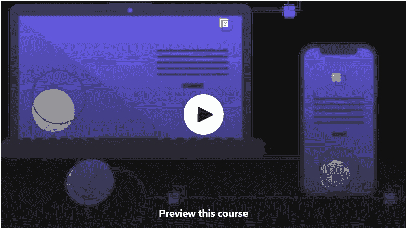
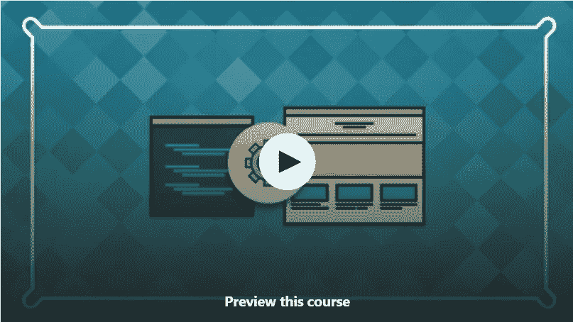
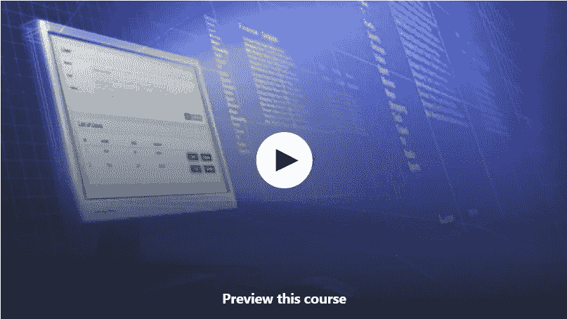
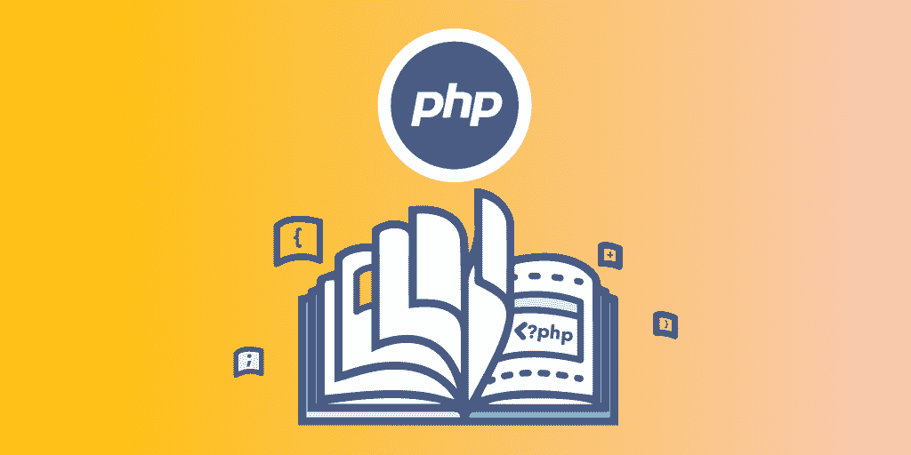

# 2023 年 Web 开发 10 大免费 PHP 和 MySQL 课程

> 原文：<https://medium.com/javarevisited/top-10-free-courses-to-learn-php-and-mysql-for-web-development-e96e69982675?source=collection_archive---------0----------------------->

## 2023 年，Udemy、Coursera、Pluralsight 和 Educative 为初学者提供最好的免费 PHP 和 MySQL 课程

马库斯·斯皮斯克在 [Unsplash](https://unsplash.com?utm_source=medium&utm_medium=referral) 上的照片

如果你想在短时间内构建 web 应用程序，那么没有比 PHP 和 MySQL 更好的技术了，如果你想在 2023 年学习 PHP 并寻找最好的免费资源，那么你来对地方了。

早些时候，我已经分享了针对初学者的 [**最佳 PHP 课程**](/javarevisited/10-best-php-courses-for-beginners-and-experienced-developers-db18057a814f) 和 [**最佳 Laravel 课程**](/javarevisited/7-best-laravel-online-courses-for-beginners-and-php-developers-61deac95f6b4) ，这是领先的 web 开发 PHP 框架之一，在这篇文章中，我将分享从零开始学习 PHP 并成为 web 开发人员的最佳免费课程。

人们可能会告诉你学习 [Java](http://www.java67.com/2018/08/top-10-free-java-courses-for-beginners-experienced-developers.html) ， [Angular](https://javarevisited.blogspot.com/2018/06/top-10-angular-tutorials-and-courses-for-web-developers.html#axzz5Ie75bPFF) ， [React](http://www.java67.com/2018/02/5-free-react-courses-for-web-developers.html) ， [JavaScript](http://www.java67.com/2018/04/top-5-free-javascript-courses-to-learn.html) ， [Python](https://javarevisited.blogspot.com/2018/12/10-free-python-courses-for-programmers.html) 或其他什么，但它们不像 PHP 那么简单，而且开发 web 应用程序或启动比使用 PHP 需要更长的时间。

PHP 和 MySQL 是非常强大的开源技术，允许程序员和 web 开发者创建功能强大的网站和应用程序，远远超出基本的 HTML。

PHP 是专门为生成交互式动态网站而创建的，也被称为服务器端脚本语言，而 [MySQL](http://javarevisited.blogspot.sg/2013/02/-create-and-call-mysql-stored-procedure-database-sql-example-tutorial.html#axzz56fRo1HGs) 是与 Oracle 和 Microsoft SQL Server 并列的领先关系数据库之一。

虽然使用 PHP 和 MySQL 创建一个网站看起来有些吓人，尤其是对于没有编程经验的人来说，但这并不困难。有了正确的指导和书籍、课程等资源，你可以在一周左右的时间内创建一个 PHP MySQL 网站。

从 [Java](http://javarevisited.blogspot.sg/2017/11/top-5-free-java-courses-for-beginners.html#axzz4zuIICRs9) 、 [Spring](http://www.java67.com/2017/11/top-5-free-core-spring-mvc-courses-learn-online.html) 、 [Eclipse](http://www.java67.com/2018/02/5-free-eclipse-and-junit-online-courses-java-developers.html) 、 [Maven](http://www.java67.com/2018/02/6-free-maven-and-jenkins-online-courses-for-java-developers.html) 、 [Linux](http://www.java67.com/2018/02/5-free-linux-unix-courses-for-programmers-learn-online.html) 以及其他几个对程序员和 web 开发人员来说很重要的关键技术开始，我已经分享了很多免费的资源，所以当有人请求我推荐一些学习 PHP 和 MySQL 的免费课程和书籍时，我想到了这篇文章。

我从 Udemy 和 Coursera 开始搜索，因为它们是我现在学习的首选。我以前是一个书呆子，我喜欢从书上学习，但自从我开始从在线课程学习以来，我从未回头。

这篇文章是这个简短研究的结果，我将分享一些最好的免费在线课程，你可以加入学习 PHP 和 MySQL。

# 2023 年面向初学者的 10 门最佳免费 PHP 和 MySQL 课程

正如我之前告诉你们的那样，我发现从在线课程中学习要比从书本中学习好得多，尽管书本仍然有深入学习某个主题的地方，但要快速开始，没有什么比在线培训课程更好的了。

这些免费课程大多来自受人尊敬的作者和培训机构，这使得它们可以免费用于推广目的，但它们有良好的结构化内容。你可以在自己舒适的办公室和家里免费使用它们学习 PHP 和 MySQL。

## 1. [PHP 初学者——成为 PHP 高手——CMS 项目](https://click.linksynergy.com/deeplink?id=JVFxdTr9V80&mid=39197&murl=https%3A%2F%2Fwww.udemy.com%2Fcourse%2Fphp-for-complete-beginners-includes-msql-object-oriented%2F)

这是从头开始学习 PHP 的最好的课程，如果你必须选择一门课程，就买这门。这是一门综合性的课程，但是老师会很好地进行分解，这样你就不会不知所措。这个课程非常深入。每当我需要的时候，支持都是一流的。

这是一门基于项目的课程，有很多练习。本课程的每一部分最后都有一个练习课，通过复习巩固所有内容。

我还创建了一个小应用程序，你可以下载它来帮助你练习 PHP。最重要的是，我们将建立一个像 WordPress、Joomla 或 Drupal 这样的令人敬畏的 CMS。

我学到了很多东西，并且已经能够将我学到的东西应用到客户身上。这位教师很容易理解，也很好听。强烈推荐这门课程，并期待埃德温的其他课程。太棒了。

 [## PHP 初学者-成为 PHP 大师- CMS 项目

### UDEMY 上评分最高的 PHP 课程......已经有超过 29，000 名学生选修了这门课程.........最佳评论 PHP…

udemy.com](https://click.linksynergy.com/deeplink?id=JVFxdTr9V80&mid=39197&murl=https%3A%2F%2Fwww.udemy.com%2Fcourse%2Fphp-for-complete-beginners-includes-msql-object-oriented%2F) 

## 2.[面向对象的 PHP & MVC](https://click.linksynergy.com/deeplink?id=JVFxdTr9V80&mid=39197&murl=https%3A%2F%2Fwww.udemy.com%2Fcourse%2Fobject-oriented-php-mvc%2F)

这是一个学习 PHP 的很棒的课程，主讲人不是别人，正是[布拉德·特拉弗斯](https://click.linksynergy.com/deeplink?id=JVFxdTr9V80&mid=39197&murl=https%3A%2F%2Fwww.udemy.com%2Fuser%2Fbrad-traversy%2F)，他是我在 Udemy 和 Youtube 上最喜欢的老师之一，这是他的另一个杰作。

在本课程中，我们将逐步使用面向对象的 PHP 构建一个名为 **TraversyMVC** 的完整定制 MVC(模型视图控制器)框架。我们将构建类似于 Codeigniter 的东西，但要轻得多。

这个框架是完全开源的，你可以自由地更改名称，添加内容等，并把它当作你自己的来使用。我们不仅要创建这个框架，还要在它的基础上构建一个名为**shareports**的应用程序，这有点像一个分享帖子的社交网络。该应用将包括。

1.  完全用户认证
2.  岗位准入控制
3.  服务器端表单验证
4.  引导 4 用户界面
5.  帖子 CRUD
6.  助手功能(即时消息和重定向)

最棒的是，您还可以将应用程序部署到互联网上，这将为您提供绝佳的学习体验。

我强烈推荐这门课程，下面是报名链接— [**面向对象 PHP & MVC**](https://click.linksynergy.com/deeplink?id=JVFxdTr9V80&mid=39197&murl=https%3A%2F%2Fwww.udemy.com%2Fcourse%2Fobject-oriented-php-mvc%2F)

 [## 用面向对象的 PHP 和 MVC 编程(终极课程)

### 在本课程中，我们将逐步构建一个完整的定制 MVC(模型视图控制器)框架，称为…

udemyy.com](https://click.linksynergy.com/deeplink?id=JVFxdTr9V80&mid=39197&murl=https%3A%2F%2Fwww.udemy.com%2Fcourse%2Fobject-oriented-php-mvc%2F) 

## [**3。初学 PHP 和 MySQL 教程**](https://click.linksynergy.com/fs-bin/click?id=JVFxdTr9V80&subid=0&offerid=562016.1&type=10&tmpid=14538&RD_PARM1=https%3A%2F%2Fwww.udemy.com%2Fphp-mysql-tutorial%2F) **【免费课程】**

这是学习 PHP 和 MySQL 教程的又一个最好的免费课程。这是一门免费课程，但比你在 Udemy 上找到的其他几门 PHP 和 MySQL 付费课程要好得多。

该课程结构良好，教授你构建 web 应用所需的所有基本 PHP 和 MySQL 概念、工具和资源。

与许多侧重于理论的在线课程不同，这门课程非常注重实践，基础设施不仅会告诉你，还会告诉你如何填充。这是我在购买在线课程前会看的一件事。

> 我不喜欢被动的课程，在这些课程中，讲师只是讲授或谈论演示，但从不实际展示。就像有人给你读一本书。

如果我买了一门课程，这意味着我想看一些实际的东西，因为这是学习新技术的最好方式。除非你看到事情发生，否则你的兴趣不会增长。

**这里是加入本课程的链接**—[PHP 和 MySQL 初学者教程](https://click.linksynergy.com/fs-bin/click?id=JVFxdTr9V80&subid=0&offerid=562016.1&type=10&tmpid=14538&RD_PARM1=https%3A%2F%2Fwww.udemy.com%2Fphp-mysql-tutorial%2F)

本课程由 [Infinite Skills](https://click.linksynergy.com/deeplink?id=CuIbQrBnhiw&mid=39197&murl=https%3A%2F%2Fwww.udemy.com%2Fuser%2Finfiniteskills%2F) 提供，长期培训师、讲师和顾问 Robert Tucker 自始至终出色地解释了如何创建一个功能性 PHP / [MySQ](https://javarevisited.blogspot.com/2013/05/difference-between-left-and-right-outer-join-sql-mysql.html) L 接口，解释了哪些地方需要重要的技术要点，而没有依赖过多的行话。

简而言之，**最好的免费 PHP 和 MySQL 课程之一**，学习如何自己开发一个全功能的 web 应用程序。

## 4.[用 PHP 构建 Web 应用](https://coursera.pxf.io/c/3294490/1164545/14726?u=https%3A%2F%2Fwww.coursera.org%2Flearn%2Fweb-applications-php)【免费 Coursera 课程】

这是 Coursera 上另一个非常棒的使用 PHP 学习 Web 开发的免费课程。这门课是由顶尖大学之一的密歇根大学开设的。

在本课程中，您将学习 web 应用程序的基本结构，以及 web 浏览器如何与 web 服务器交互。您将了解请求/响应周期，包括[GET](http://www.java67.com/2019/03/7-examples-of-httpurlconnection-in-java.html)/[POST](http://javarevisited.blogspot.sg/2012/03/get-post-method-in-http-and-https.html)/[Redirect](https://javarevisited.blogspot.com/2013/12/how-to-redirect-page-or-url-jQuery-JavaScript-Example.html#axzz5hkbSkP2N)。

您还将探索超文本标记语言(HTML)，以及 PHP 语言的基本语法和数据结构、变量、逻辑、迭代、数组、错误处理和全局变量等元素。

最后，您将获得安装和使用集成 PHP/MySQL 环境(如 XAMPP 或 MAMP)的技能和知识。

本课程也是 [**面向所有人的 Web 应用专业化认证的一部分，**](https://coursera.pxf.io/c/3294490/1164545/14726?u=https%3A%2F%2Fwww.coursera.org%2Fspecializations%2Fweb-applications) 这意味着完成本课程将被计入认证。

即使我知道 PHP 和 Web 开发，我仍然非常喜欢这门课，也从中学到了很多东西。强烈推荐给所有对使用 PHP 进行 Web 开发感兴趣的人。

**这是加入本课程的链接**——[用 PHP 构建 Web 应用](https://coursera.pxf.io/c/3294490/1164545/14726?u=https%3A%2F%2Fwww.coursera.org%2Flearn%2Fweb-applications-php)

如果你发现 Coursera 的课程很有用，因为它们是由知名公司如谷歌、IBM、亚马逊和世界上最好的大学创建的，我建议你加入 Coursera 的订阅计划[**Coursera Plu**](https://coursera.pxf.io/c/3294490/1164545/14726?u=https%3A%2F%2Fwww.coursera.org%2Fcourseraplus)**s**

 [## Coursera Plus |无限制访问 7，000 多门在线课程

### 用 Coursera Plus 投资你的职业目标。无限制访问 90%以上的课程、项目…

coursera.pxf.io](https://coursera.pxf.io/c/3294490/1164545/14726?u=https%3A%2F%2Fwww.coursera.org%2Fcourseraplus) 

这种单次订阅可以让你无限制地访问他们最受欢迎的**课程**、**专业化**、**专业证书**和**指导项目**。

## 5.[创建一个简单的简讯注册— PHP 和 MySQL](https://click.linksynergy.com/deeplink?id=CuIbQrBnhiw&mid=39197&murl=https%3A%2F%2Fwww.udemy.com%2Fcourse%2Fcreating-a-simple-newsletter-signup-using-php-and-mysql%2F) 【免费】

这是另一个从 Udemy 学习 PHP 和 MySQL 的很棒的免费课程。虽然之前的课程很好地教会了你 PHP 和 MySQL，并展示了一些重要的东西，但你真的需要自己做一个项目来应用你所学到的东西。

这对你的学习至关重要，这也是本课程教给你的。

在这个 1 小时[的免费 PHP 课程](https://www.java67.com/2018/02/5-free-php-and-mysql-courses-for-web-developers.html)中，你将学习如何添加一个时事通讯注册表单并保存到数据库中。PHP & MySQL 从零开始。已经有 8000 多名开发者加入了这个课程。

本课程将一步一步地教你如何创建项目，你在前面课程中学到的知识将帮助你掌握材料并完成手头的任务。

我建议你在课程结束时创建项目，并充分利用它。如果你是一个从未用 PHP 创建过大型项目的初学者，那么这门课程会给你很大帮助。它还可以帮助你为你的大学或学院创建最后一年的项目。

**这里是加入这个免费课程的链接**——[使用 PHP 和 MySQL 创建一个简单的简讯注册](https://click.linksynergy.com/deeplink?id=CuIbQrBnhiw&mid=39197&murl=https%3A%2F%2Fwww.udemy.com%2Fcourse%2Fcreating-a-simple-newsletter-signup-using-php-and-mysql%2F)

## [⑥**。实时聊天系统使用 PHP Mysql PDO 和 AJAX**](https://click.linksynergy.com/fs-bin/click?id=JVFxdTr9V80&subid=0&offerid=562016.1&type=10&tmpid=14538&RD_PARM1=https%3A%2F%2Fwww.udemy.com%2Freal-time-chat-system-using-php-mysql-pdo-and-ajax%2F) **【免费】**

这是另一个实践课程，通过构建一个项目，一个实时聊天系统，来教你 PHP 和 MySQL。

这实际上是我在大学最后一年提交的项目，你们中的许多人可能以前在不同的编程语言上做过。

我当时受到雅虎聊天信使的启发，因为没有脸书设计，但我喜欢这个项目，因为你可以很容易地与它联系起来，这使得学习更容易。

在本课程中，您将使用 PHP、AJAX 和 [MySQL](http://javarevisited.blogspot.sg/2012/12/sql-query-to-copy-duplicate-or-backup.html) 数据库构建一个实时在线聊天应用程序。该课程将教你一切从前面到后面，例如创建 HTML 的前端和样式使用 CSS，使其更具吸引力和美丽。

如果你已经知道 PHP 和 JavaScript 的基础知识，那么你会很容易理解。然而，本课程是在牢记所有水平的同时创建的，所以如果你是初学者，你仍然可以通过简单的方法轻松地学习本课程。

**这里是加入这个免费 PHP 课程的链接**——[使用 PHP、Mysql、PDO 和 AJAX 的实时聊天系统](https://click.linksynergy.com/fs-bin/click?id=JVFxdTr9V80&subid=0&offerid=562016.1&type=10&tmpid=14538&RD_PARM1=https%3A%2F%2Fwww.udemy.com%2Freal-time-chat-system-using-php-mysql-pdo-and-ajax%2F)

## [**7。构建 CRUD 应用— PHP & MySQL**](https://click.linksynergy.com/fs-bin/click?id=JVFxdTr9V80&subid=0&offerid=562016.1&type=10&tmpid=14538&RD_PARM1=https%3A%2F%2Fwww.udemy.com%2Fbuild-crud-application-php-mysql%2F) **【免费 Udemy 课程】**

这是另一个很棒的 PHP 和 MySQL 实践课程，它将通过实践来教你 PHP，而不仅仅是教概念和理论。

在本课程中，您将学习如何创建 CRUD 应用程序，大多数 web 应用程序都是这样的。CRUD 是创建、读取、更新和删除的简称，这是网站允许用户完成的四项基本任务。

学习这个概念将帮助你更好地理解如何用 PHP 创建一个注册系统，如果你建立像脸书这样的基于用户的网站，用户可以更新他们的消息或上传他们的图片，它也将帮助你让你的用户与数据交互。

在本课程中，您将构建一个简单的 TODO list 应用程序，帮助您理解 CRUD 操作是如何实现的以及分页是如何工作的。

**这里是加入本课程的链接** — [构建 CRUD 应用程序— PHP & Mysql](https://click.linksynergy.com/deeplink?id=CuIbQrBnhiw&mid=39197&murl=https%3A%2F%2Fwww.udemy.com%2Fcourse%2Fbuild-crud-application-php-mysql%2F)

您将构建一个数据库并与之交互，还将使用 Twitter 的 [Bootstrap](http://www.java67.com/2019/01/5-free-bootstrap-course-to-learn-online.html) 框架来设计您的网站。简而言之，这是初级 web 开发人员和 web 设计人员或者任何对使用 PHP 和 MySQL 进行 web 开发感兴趣的人的绝佳实践课程。

## 8.[从零开始学习 PHP](https://www.educative.io/courses/learn-php-from-scratch?affiliate_id=5073518643380224)【免费教育课程】

这门高度互动的课程向你介绍 PHP 的基本编程概念，PHP 是世界上最流行的语言之一。

它从一个简单的 Hello world 程序开始，然后介绍 PHP 中的一些常见概念，如条件语句、循环语句和逻辑。然后，它反映了函数和数组的概念，以及它们赋予程序员编写更好代码的能力。

最后，为了教授 PHP 中的高级概念，如类、继承和异常处理，本文进行了更深入的探讨。当你完成的时候，你将会很好地掌握 PHP 的基础知识，并准备好学习高级概念。

**这是本课程的链接**——[从头开始学习 PHP](https://www.educative.io/courses/learn-php-from-scratch?affiliate_id=5073518643380224)

而且，如果你发现教育平台和他们的搜索课程，像[搜索系统设计面试](https://www.educative.io/collection/5668639101419520/5649050225344512?affiliate_id=5073518643380224)，搜索面向对象编程面试，然后考虑获得 [**教育订阅**](https://www.educative.io/subscription?affiliate_id=5073518643380224) ，每月只需 14.9 美元就可以访问他们的 200 多门课程。非常划算，非常适合准备编码面试。

 [## 教育无限:保持领先

### 我们听到了您的反馈。你现在只需支付一次费用，就可以获得 Educative 上的所有课程。

www.educative.io](https://www.educative.io/subscription?affiliate_id=5073518643380224) 

## 9.[通过 Codecademy 学习 PHP](https://www.pntrs.com/t/TUJGR0lLR0JHRklJSkhCR0ZISk1N?url=https%3A%2F%2Fwww.codecademy.com%2Flearn%2Flearn-php)【免费在线课程】

如果你喜欢互动课程，那么你会喜欢这个来自 Codecademy 的免费 PHP 课程，它会教你一个对 web 开发者来说最重要的技能。PHP 是一种广泛使用的服务器端编程语言，这些年来变得越来越快越来越强大。

PHP 可以很好地处理 HTML 和数据库，对于任何对构建动态 web 应用感兴趣的人来说，它都是一种很好的语言。在这门课程中，你将学习 PHP 的基本编程概念。

PHP 是以下各项的基础:

*   许多 CMS ( [WordPress](/javarevisited/5-best-wordpress-courses-for-beginners-and-experienced-website-developers-b45f7976ee40) 、Drupal、Joomla)
*   电子商务平台(WooCommerce、Magento)
*   Web 开发框架(Laravel，CakePHP，Symfony)

以下是访问本课程的链接— [**学习 PHP**](https://www.pntrs.com/t/TUJGR0lLR0JHRklJSkhCR0ZISk1N?url=https%3A%2F%2Fwww.codecademy.com%2Flearn%2Flearn-php)

而且，如果你喜欢 Codecademy 平台，那么你也可以加入[**Codecademy PRO**](https://bit.ly/codecademypro)，这是一个面向程序员的高级订阅。它的年费大约是每月 15.99 美元，提供所有 Codecademy 的内容、课程、测验和项目。你可以用这个来挣钱，练习&
应用现成的技能。

 [## 学习编码最简单的方法:PRO | Codecademy

### 您学习编码所需的一切都由我们内部的专家团队设计。这意味着我们所有的独家…

bit.ly](https://bit.ly/codecademypro) 

## 10.[包含 5 个项目的完整 PHP MYSQL 专业课程](https://click.linksynergy.com/deeplink?id=JVFxdTr9V80&mid=39197&murl=https%3A%2F%2Fwww.udemy.com%2Fcourse%2Fthe-complete-php-mysql-professional-course%2F)

如果你喜欢基于项目的学习，那么你会喜欢这门课程。顾名思义，您将使用 PHP 构建 5 个项目，这对学习这种[最流行的 web 开发编程语言](/javarevisited/top-5-programming-languages-for-web-development-in-2021-f6fd4f564eb6)非常有用。

本课程的设计更具逻辑性，从简单到复杂，循序渐进。以下是对课程的描述

**路线图**:

积木基础 **5 小时 30 分钟**的内容

**项目:**

1.  [正则表达式](/javarevisited/7-best-regular-expression-courses-for-developers-to-learn-in-2021-9b8cb37bb3a5) **25 分钟**
2.  完成联系表格+电子邮件 **1 小时**的内容
3.  动态网页(目录项目) **1 小时**的内容
4.  基于 CMS 的员工管理 CRUD **2 小时+ 30 分钟**的内容
5.  CMS +管理面板与惊人的博客+ **免费引导** 4.2.1 **12 小时**的内容

本课程将集中于 PHP 所有的基础知识、构建模块和高级概念的全部细节，这些对初学者来说都是必不可少的。在本课程中，学生将在每一节之后构建一个项目，以了解 PHP 的真实表现。

最棒的是**学员可以免费观看 2 个小时以上的初始内容来决定是否购买这门课程。**

这里是报名的链接— [**完整的 PHP MYSQL 专业课程 5 个项目**](https://click.linksynergy.com/deeplink?id=JVFxdTr9V80&mid=39197&murl=https%3A%2F%2Fwww.udemy.com%2Fcourse%2Fthe-complete-php-mysql-professional-course%2F)

 [## 完整的 PHP MYSQL 专业课程，包含 5 个项目

### 你有没有想过为什么有这么多 PHP Mysql 课程，却很少提供实用技能？即使…

udemy.com](https://click.linksynergy.com/deeplink?id=JVFxdTr9V80&mid=39197&murl=https%3A%2F%2Fwww.udemy.com%2Fcourse%2Fthe-complete-php-mysql-professional-course%2F) 

以上是关于从零开始学习 PHP 和 MySQL 的一些**最好的**和**免费在线培训课程**。这些课程真的是很棒的资源，其中一些课程，尤其是[**初级 PHP 和 MySQL 教程"**](https://click.linksynergy.com/fs-bin/click?id=JVFxdTr9V80&subid=0&offerid=562016.1&type=10&tmpid=14538&RD_PARM1=https%3A%2F%2Fwww.udemy.com%2Fphp-mysql-tutorial%2F) 比许多付费课程都要好，182，255 名注册学生就是证明。

有些课程是付费的，但我不介意为这样的课程付费，因为它们是值得的。无论如何，你可以免费得到它和许多其他实用的课程来开始你的 PHP 和 MySQL 之旅。

其他**免费编程资源**你可能喜欢的
[2023 年 Web 开发者路线图](https://javarevisited.blogspot.com/2019/02/the-2019-web-developer-roadmap.html)
[2023 年 React JS 开发者路线图](https://javarevisited.blogspot.com/2018/10/the-2018-react-developer-roadmap.html)
[2023 年 DevOps 开发者路线图](https://javarevisited.blogspot.com/2018/09/the-2018-devops-roadmap-your-guide-to-become-DevOps-Engineer.html)
[5 门免费课程学习 Git 和 Github](http://javarevisited.blogspot.sg/2018/01/5-free-git-courses-for-programmers-to-learn-online.html#axzz568Oo1Jao)
[5 门免费 Eclipse 和 JUnit 课程面向 Java 开发者](http://www.java67.com/2018/02/5-free-eclipse-and-junit-online-courses-java-developers.html)
[5 门免费 Docker 课程面向 Java 和 DevOps 工程师](http://www.java67.com/2018/02/5-free-docker-courses-for-java-and-DevOps-engineers.html)
5 免费学习数据结构和算法的课程
[5 免费学习 Java 开发人员的 Spring 框架课程](http://www.java67.com/2017/11/top-5-free-core-spring-mvc-courses-learn-online.html)
[5 免费学习 Angular 的在线培训课程](http://www.java67.com/2018/01/top-5-free-angular-js-online-courses-for-web-developers.html)
[5 免费学习应用开发人员和系统管理员的 Linux 课程](http://www.java67.com/2018/02/5-free-linux-unix-courses-for-programmers-learn-online.html)
[Udemy](http://javarevisited.blogspot.sg/2018/01/top-10-udemy-courses-for-java-and-web-developers.html#axzz56TUKbQgM)的 10 大 Java 和 Web 开发课程

感谢您阅读本文。如果你喜欢这些 PHP 和 MySQL 课程，请与你的朋友和同事分享。如果您有任何问题或反馈，请留言。

## 结束语

感谢您阅读本文。你可能会想，有这么多东西要学，有这么多课程要参加，但你不需要担心。

很有可能你已经知道了大部分内容，也有很多有用的免费资源供你使用，我还在这里和那里链接了它们以及最好的资源，这些资源当然不是免费的，但很值钱。

我是 [Udemy](https://medium.com/u/b32aa0132f1b?source=post_page-----63836cd3e587----------------------) 和 [Coursera](https://medium.com/u/99c0fb464c1f?source=post_page-----63836cd3e587----------------------) 课程的特别粉丝，因为它们非常实惠，并且以很小的金额提供很多价值，但是你可以自由选择你想要的课程。

说到底，你应该对这里提到的事情有足够的知识和经验。

祝您的 Web 开发之旅好运！当然**不会很容易**，但是通过遵循这些[课程](https://javarevisited.blogspot.com/2018/02/top-5-online-courses-to-learn-web-development.html)和[路线图](https://javarevisited.blogspot.com/2018/10/the-2018-react-developer-roadmap.html)，你离成为你一直想成为的 Web 开发者更近了一步

如果你喜欢这篇文章，那么请考虑在 medium 上关注我( [javinpaul](https://medium.com/u/bb36d8439904?source=post_page-----63836cd3e587----------------------) )。如果你想在每篇新文章上得到通知，别忘了在 Twitter 上关注**[**javarevited**](https://twitter.com/javarevisited)！**

****附言——**如果你不介意花几块钱学习像 PHP 这样有用的技术技能，并寻找全面和最新的资源，那么我强烈推荐你在 Udemy 上查看 [**PHP for 初学者——成为 PHP 高手——CMS Project**](https://click.linksynergy.com/deeplink?id=CuIbQrBnhiw&mid=39197&murl=https%3A%2F%2Fwww.udemy.com%2Fcourse%2Fphp-for-complete-beginners-includes-msql-object-oriented%2F)。你可以在 Udemy 网站上花 10 美元购买这门课程。**

** [## PHP 初学者-成为 PHP 大师- CMS 项目

### UDEMY 上评分最高的 PHP 课程......已经有超过 90，000 名学生选修了这门课程.........最佳评论 PHP…

udemy.com](https://click.linksynergy.com/deeplink?id=CuIbQrBnhiw&mid=39197&murl=https%3A%2F%2Fwww.udemy.com%2Fcourse%2Fphp-for-complete-beginners-includes-msql-object-oriented%2F)**