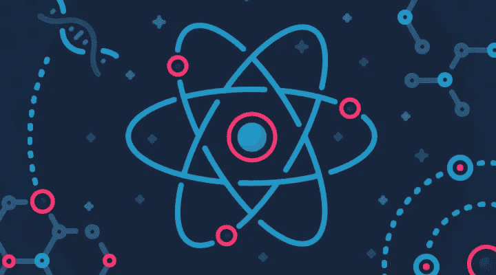
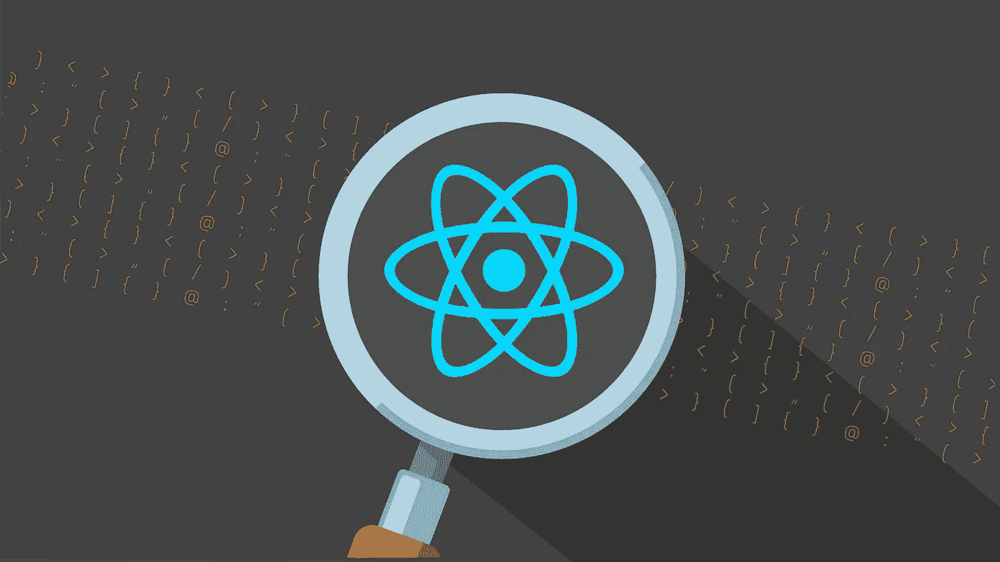
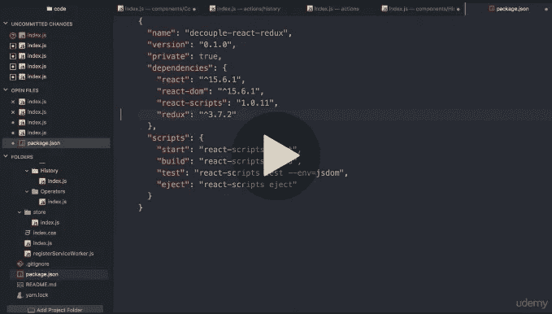
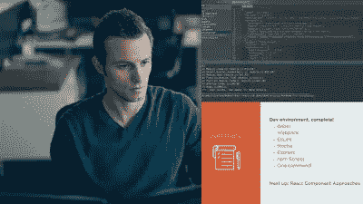
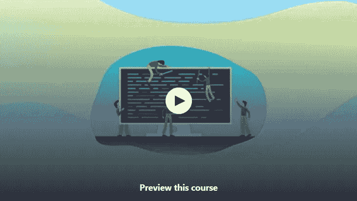
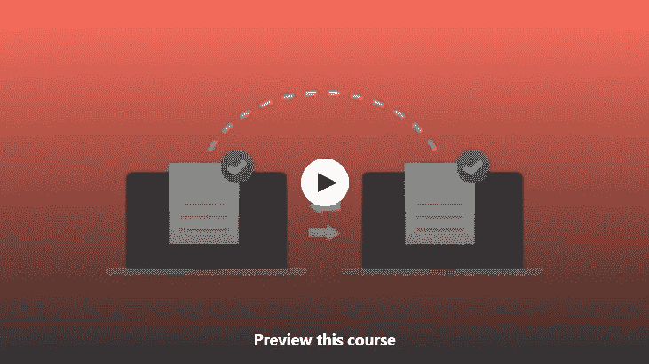
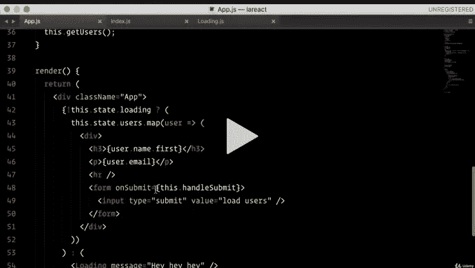

# 2023 年学习 React.js 的 10 大免费课程

> 原文：<https://medium.com/javarevisited/top-10-free-courses-to-learn-react-js-c14edbd3b35f?source=collection_archive---------0----------------------->

## 这些是最好的免费在线 React.js 课程，供初学 web 开发的人学习基本的 React.js 概念、钩子、状态管理和 Redux

大家好，如果你了解前端开发，你就会知道 React.js 是构建用户界面最流行的 Javascript 库之一。它得到了脸书的支持，通常被视为谷歌的棱角分明的框架的替代方案。

我有时会要求程序员学习 React.js，并分享资源，如[在线 React.js 课程](/@javinpaul/top-5-courses-to-learn-react-js-in-2019-best-of-lot-fa02cd96cdf0)和这个 [React 开发者路线图](/javarevisited/the-2019-react-js-developer-roadmap-9a8e290b8a56)。今天，我将分享一些免费的课程给那些没有能力支付在线培训费用的人。对于那些喜欢用免费课程学习新技术的人来说，这也是很好的选择。

React 也非常灵活、快速、易学，并且使用起来很有趣。它旨在使构建模块化、可重用的用户界面组件的过程简单而直观，这就是为什么大多数现代 GUI 和 web 应用程序都是使用 React 框架构建的。

它是在脸书上开发的，专注于 web 应用程序中 MVC 的“视图”方面。React 旨在开发大型应用程序，并且必须处理随时间变化的数据。因此，如果你需要快速更新，我的意思是更新单个组件而不更新整个 DOM，那么 React 是正确的框架。

一旦你知道了 React，你也可以使用这些知识，通过 [React Native](http://javarevisited.blogspot.sg/2018/02/5-react-native-courses-to-learn-mobile-development-using-JavaScript.html#axzz57VnjlcRl) 为 iPhone、iPad 和 Android 智能手机构建原生移动应用，这允许你使用 [JavaScript](/javarevisited/10-javascript-frameworks-and-libraries-to-learn-in-2020-best-of-lot-5f61f86c60b4) 编写原生移动应用。

与 [Ionic](/javarevisited/10-of-the-most-popular-javascript-frameworks-libraries-for-web-development-in-2019-a2c8cea68094) 或 [Cordova](https://javarevisited.blogspot.com/2020/01/10-things-mobile-app-developers-can-learn.html) ， [React Native](/hackernoon/top-5-react-native-courses-for-mobile-application-developers-b82febdf8a46) 不作为 web 应用程序运行，也不在 WebView 上运行，而是使用本地组件，这使它更具吸引力。

你也不需要花时间学习 [Java](http://javarevisited.blogspot.sg/2017/11/top-5-free-java-courses-for-beginners.html) 或 [Kotlin](http://javarevisited.blogspot.sg/2018/02/5-courses-to-learn-kotlin-programming-java-android.html#axzz56R4AatoQ) 用于 Android 应用开发和 [Swift](/javarevisited/top-5-online-courses-to-learn-ios-12-swift-in-2019-a35ae1be7b2b) 或 Objective C 用于编写 iOS 应用，你可以通过编写 Javascript 代码和使用 ReactNative 框架来创建移动应用。简而言之，React 是一个用于客户端 web 应用程序的高性能、反应式 UI 库。

> 顺便说一句，如果你不介意花几块钱学习像 React.js 这样有价值的东西，那么我也建议你在 Udemy 上看看 Max 的[**React——完整指南**](https://click.linksynergy.com/deeplink?id=JVFxdTr9V80&mid=39197&murl=https%3A%2F%2Fwww.udemy.com%2Fcourse%2Freact-the-complete-guide-incl-redux%2F) 课程。这是学习 React.js 的最全面、最新、最有吸引力和最实用的课程之一，涵盖了 Hooks、React Router 以及 Redux。它也不贵，你可以在 Udemy 上买到 9.99 美元。

# 2023 年学习反应的 10 门免费课程

下面是我列出的学习 React 开发库的一些免费课程。这些课程是免费的，但是它们对于了解 React 并开始您的旅程非常有用。一旦你完成了这些课程，你应该有足够的知识在你的项目中使用 React。你也可以拿起一本[的书](https://www.java67.com/2020/03/top-5-books-to-learn-reactjs-for-beginners.html)来深入学习 React，这样会更有意义，因为你已经知道了 React 的基础和词汇。

其实，这就是我做的事情，当我要深入学习一些东西的时候。从在线课程开始，快速上手，然后阅读一本书来巩固你的知识，深入学习一个概念，成为该技术的大师。

## **1。** [**仅用 1 小时就反应基本知识**](https://click.linksynergy.com/fs-bin/click?id=JVFxdTr9V80&subid=0&offerid=323058.1&type=10&tmpid=14538&RD_PARM1=https%3A%2F%2Fwww.udemy.com%2Freact-basic-in-just-1-hour%2F)

这个简短的课程将涵盖您需要了解的基本和核心概念，以启动和运行 ReactJS。

同样在本课程中，它将通过简单易懂的短视频让您快速上手。它以项目为导向，包含从简单到复杂的实践示例，将帮助您了解 React 的最基本概念，如 React 自定义语法和 JSX 变换组件、属性和状态，以及虚拟 DOM 的强大功能。

简而言之，这是一门很棒的课程，适合任何想学习 React 但没有太多 HTML 或 CSS 知识的人。

> 以下是免费参加本课程的链接—[1 小时内反应基础知识](https://click.linksynergy.com/fs-bin/click?id=JVFxdTr9V80&subid=0&offerid=323058.1&type=10&tmpid=14538&RD_PARM1=https%3A%2F%2Fwww.udemy.com%2Freact-basic-in-just-1-hour%2F)

## 2. [React 和 Redux Masterclass](https://click.linksynergy.com/deeplink?id=JVFxdTr9V80&mid=39197&murl=https%3A%2F%2Fwww.udemy.com%2Fcourse%2Flearning-react-and-redux-decoupling-with-stateless-components%2F)

本课程将深入介绍 React，您将了解以下内容

*   成分
*   JSX
*   状态
*   事件
*   形式

您还将学习如何重构应用程序，使其更具可测试性和可重用性(解耦),并通过 React 容器将无状态视图与无状态缩减器连接起来

> 以下是免费参加本课程的链接— [React 和 Redux Masterclass](https://click.linksynergy.com/deeplink?id=JVFxdTr9V80&mid=39197&murl=https%3A%2F%2Fwww.udemy.com%2Fcourse%2Flearning-react-and-redux-decoupling-with-stateless-components%2F)

## [**3。React.js:入门**](http://pluralsight.pxf.io/c/1193463/424552/7490?u=https%3A%2F%2Fwww.pluralsight.com%2Fcourses%2Freact-js-getting-started)

这是一个从 Pluralsight 学习 React.js 基础知识的很棒的课程。本课程为学生开始使用 React JS 库开发 web 应用程序做准备。

如果你不知道，React.js 是一个开源的 [JavaScript 库](http://javarevisited.blogspot.sg/2018/02/top-5-online-courses-to-learn-web-development.html)，用于创建专注于从 DOM 中抽象出来的 UI 的用户界面，以及单向的反应式数据流。本课程将使用一个示例 web 应用程序来解释如何在您的 web 应用程序中使用 React.js。

> 以下是免费参加本课程的链接— [React.js:入门](http://pluralsight.pxf.io/c/1193463/424552/7490?u=https%3A%2F%2Fwww.pluralsight.com%2Fcourses%2Freact-js-getting-started)

## 4.[使用 React 进行前端 Web 开发](https://coursera.pxf.io/c/3294490/1164545/14726?u=https%3A%2F%2Fwww.coursera.org%2Flearn%2Ffront-end-react)

如果您从未在 React 中做过任何事情，并且想要了解它是如何工作的以及如何开始，那么这是学习 React 的入门课程。

您将学习 React 组件的各个方面，包括 React 路由器及其在开发单页面应用程序中的使用。您还将学习如何设计受控表单。将向您介绍 Flux architecture 和 Redux。

> 这里是免费加入本课程的链接— [使用 React 进行前端 Web 开发](https://coursera.pxf.io/c/3294490/1164545/14726?u=https%3A%2F%2Fwww.coursera.org%2Flearn%2Ffront-end-react)

本课程也是 React Specialization 的 [**全栈 Web 开发的一部分，其中包含了更多的课程，教你成为全栈 JavaScript 开发人员所需的其他技能。**](https://coursera.pxf.io/c/3294490/1164545/14726?u=https%3A%2F%2Fwww.coursera.org%2Fspecializations%2Ffull-stack-react)

<https://coursera.pxf.io/c/3294490/1164545/14726?u=https%3A%2F%2Fwww.coursera.org%2Fspecializations%2Ffull-stack-react>  

但是为什么当你免费参加审计专业的课程时，你不会得到任何证书。如果你参加这个课程是为了获得 Coursera 证书，那么你需要注册参加这个专业或者参加一个订阅计划，比如 [**Coursera Plus**](https://coursera.pxf.io/c/3294490/1164545/14726?u=https%3A%2F%2Fwww.coursera.org%2Fcourseraplus) ，它可以提供超过 7000 个 Coursera 课程、项目和专业证书的无限制访问。

<https://coursera.pxf.io/c/3294490/1164545/14726?u=https%3A%2F%2Fwww.coursera.org%2Fcourseraplus>  

## **5。** [**反应基础**](https://click.linksynergy.com/deeplink?id=JVFxdTr9V80&mid=39197&murl=https%3A%2F%2Fwww.udemy.com%2Fcourse%2Freact-fundamentals%2F)

这是另一个极好的免费 Udemy 课程，从头开始学习 React 框架。本课程涵盖了 React 提供的特性，并解释了它们相对于其他流行选项的优缺点。它还探索了一些重要的主题，比如 React 的单向反应式数据流、虚拟 DOM 和用于描述标记的 JSX 语法。

> 以下是免费参加本课程的链接— [反应基础](https://click.linksynergy.com/deeplink?id=JVFxdTr9V80&mid=39197&murl=https%3A%2F%2Fwww.udemy.com%2Fcourse%2Freact-fundamentals%2F)

## [**6。使用 React 和 Flux 构建应用程序**](http://pluralsight.pxf.io/c/1193463/424552/7490?u=https%3A%2F%2Fwww.pluralsight.com%2Fcourses%2Freact-flux-building-applications) **【免费试用】**

这是一个很好的课程，从 React、React Router 和 Flux 开始，通过构建一个管理 Pluralsight 作者数据的真实世界风格的数据驱动应用程序。

本课程使用现代客户端开发堆栈，包括 Node、Browserify、Gulp 和 Bootstrap。

顺便说一句，这个课程和其他[多视课程](http://javarevisited.blogspot.sg/2017/12/top-10-pluralsight-courses-java-and-web-developers.html#axzz53viuJDer)不是完全免费的。你需要 Pluralsight 会员资格才能进入这些课程，但不要担心。Pluralsight 还提供 [10 天免费试用](http://pluralsight.pxf.io/c/1193463/424552/7490?u=https%3A%2F%2Fwww.pluralsight.com%2Flearn)。您可以用它来访问本课程。

这里是免费加入本课程的链接— [用 React 和 Flux 构建应用](http://pluralsight.pxf.io/c/1193463/424552/7490?u=https%3A%2F%2Fwww.pluralsight.com%2Fcourses%2Freact-flux-building-applications)

不过，如果你能负担得起的话，[plur sight 会员](https://pluralsight.pxf.io/c/1193463/424552/7490?u=https%3A%2F%2Fwww.pluralsight.com%2Flearn)完全物有所值。只需支付大约 29 美元，你就可以获得 5000 多门最新最棒技术的课程。

如果你想成为年度会员，大约需要 299 美元，对于这些课程和继续学习来说，这也是一个非常好的价格。他们现在还提供 33%的折扣，这意味着你只需 190 美元就可以获得年度会员资格。

<http://pluralsight.pxf.io/c/1193463/424552/7490?u=https%3A%2F%2Fwww.pluralsight.com%2Flearn>  

## [7。React vs Angular vs Vue.js 举例](https://click.linksynergy.com/fs-bin/click?id=JVFxdTr9V80&subid=0&offerid=323058.1&type=10&tmpid=14538&RD_PARM1=https%3A%2F%2Fwww.udemy.com%2Freact-vs-angular-vs-vuejs-by-example%2F)

面对各种各样的 javascript 库和框架，您可能会有点困惑，不知道从哪里开始。目前，javascript 世界的三大巨头是 React、 [Angular](/javarevisited/top-10-free-courses-to-learn-angular-framework-in-2020-bb62148c73d3) 和 [Vue.js](/javarevisited/10-free-vue-js-nuxt-js-online-courses-for-beginners-in-2021-a347ea2ad144) 。有时候，最好的办法是根据自己的经验来做决定。这正是本课程的目标。

我们要在 React，Angular，和 Vue.js 中设计开发一个单页的 app，这里的目标是帮助你根据自己的需求和喜好来确定自己最喜欢哪个工作流程。

> 以下是免费加入本课程的链接— [React vs Angular vs Vue.js 举例](https://click.linksynergy.com/fs-bin/click?id=JVFxdTr9V80&subid=0&offerid=323058.1&type=10&tmpid=14538&RD_PARM1=https%3A%2F%2Fwww.udemy.com%2Freact-vs-angular-vs-vuejs-by-example%2F)

## [8。React、Redux、React-Router、Hooks 和 Auth0](https://click.linksynergy.com/deeplink?id=JVFxdTr9V80&mid=39197&murl=https%3A%2F%2Fwww.udemy.com%2Fcourse%2Fmodern-react%2F)

这是一门免费的 React 课程，涵盖了付费课程中的所有内容。这是一个 4 小时 38 分钟的课程，涵盖 React、Redux、React-Router、Auth9 和 Hooks。

这些课程使用现代的 ES5、ES6、ES7 Javascript 语法，并将教你 React 如何在幕后工作。由于身份验证是必须的，通过本课程，您将能够轻松地将您的应用连接到 Auth0。您还将了解现代身份验证和路由模式。

> 以下是免费加入本课程的链接— [React、Redux、React-Router、Hooks 和 Auth0](https://click.linksynergy.com/deeplink?id=JVFxdTr9V80&mid=39197&murl=https%3A%2F%2Fwww.udemy.com%2Fcourse%2Fmodern-react%2F)

## [9。React 钩子和上下文(带 React-Redux 迁移指南)](https://click.linksynergy.com/deeplink?id=JVFxdTr9V80&mid=39197&murl=https%3A%2F%2Fwww.udemy.com%2Fcourse%2Freact-hooks-with-react-redux-migration%2F)

这是一个很好的免费课程，可以在 Udemy 上学习 React Hooks，在更深的层次上教授 React Hooks。你会学到一些东西，比如使用状态、[、使用效果](https://javarevisited.blogspot.com/2021/09/what-are-react-and-redux-hooks-example.html#ixzz76iXIGKAT)、使用证书、使用上下文

您还将学习如何在现有 Redux 代码中使用 React 钩子，以及如何使用上下文 API 管理全局状态。如果你想把你现有的 React 代码移植到钩子中，那么你应该加入这个课程。

> 这里是免费加入本课程的链接— [React 挂钩和上下文(带 React-Redux 迁移指南)](https://click.linksynergy.com/deeplink?id=JVFxdTr9V80&mid=39197&murl=https%3A%2F%2Fwww.udemy.com%2Fcourse%2Freact-hooks-with-react-redux-migration%2F)

## [10。React JS 前端 Web 开发初学者](https://click.linksynergy.com/deeplink?id=JVFxdTr9V80&mid=39197&murl=https%3A%2F%2Fwww.udemy.com%2Fcourse%2Freact-tutorial%2F)

这是另一个针对初学者的免费课程。在本课程中，您将学习 React JS 和现代 JavaScript 的核心基础知识，以便您能够**开始使用 [**React JS**](https://www.java67.com/2021/11/top-6-courses-to-learn-react-hooks.html) 构建闪电般快速的 web 应用**。

在这个课程中，你将从绝对的零开始学习现代 JavaScript 和**React JS**。您将学习发出 AJAX 请求从远程 API T21 获取数据并显示到您的 web 应用程序中。

> 这里是免费加入本课程的链接— [React JS 前端 Web 开发初学者](https://click.linksynergy.com/deeplink?id=JVFxdTr9V80&mid=39197&murl=https%3A%2F%2Fwww.udemy.com%2Fcourse%2Freact-tutorial%2F)

## 10.[全栈反应](https://gumroad.com/a/934179955)

如果你喜欢边看课程边看书，那么这本书是给你的。一个明智的开发人员会希望对 web 开发有一个全面的了解。为了获得这一点，你应该使用一些其他的由经验丰富的专业人员使用的学科。

在本书中，您将从 Anthony Accomazzo、Nate Murray、Ari Lerner、Clay 奥尔索普、David Guttman 和 Tyler McGinnis 等专家那里学习 Full Stack React。几乎没有哪本书能让你有机会在一个地方向这么多专家学习。

这本 React.js 书将拓宽你对多种框架和采用全栈开发的方法的理解。在理解了这篇重要文章中的主题后，你将成为一个自信的开发者。

所有的贡献者都是受人尊敬的作者和开发人员，对许多语言和框架都有丰富的经验

**这里是购买这本书**的链接。[全栈反应](https://gumroad.com/a/934179955)

以上就是免费学习 React JS 的一些**最佳课程**。React 得到了脸书的支持，是谷歌 Angular 框架的最大竞争对手。如果这次你对 web 开发是认真的，那么 React 是需要学习的重要框架之一。

您还可以使用 React Native 为 [Android](/hackernoon/top-5-courses-to-learn-android-for-java-programmers-667e03d995b4) 和 [iOS](https://hackernoon.com/top-5-courses-to-help-you-become-a-swift-and-ios-developer-bs853639) 开发原生移动应用，React Native 允许您用 JavaScript 编写移动应用。像 Redux 这样的框架在开发现代 GUI 时也能让您的工作变得简单。

其他**您可能想探索的免费在线课程**

1.  [完整的 Web 开发者路线图](/hackernoon/the-2019-web-developer-roadmap-ab89ac3c380e)
2.  我最喜欢的免费 JavaScript 初学者教程
3.  [15 门面向 Web 开发人员的 Docker、Kubernetes 和 AWS 课程](/javarevisited/top-15-online-courses-to-learn-docker-kubernetes-and-aws-for-fullstack-developers-and-devops-d8cc4f16e773)
4.  Web 开发人员可以学习的 10 个 JavaScript 框架
5.  [学习 Web 开发的前 5 门课程](/better-programming/my-5-favorite-courses-to-learn-web-development-in-2019-a5e74167f8b2)
6.  [我最喜欢的学习 HTML 和 CSS 的免费课程](/javarevisited/5-free-html-and-css-courses-to-learn-front-end-web-development-online-8b04517c6ecb?source=collection_home---4------0-----------------------)
7.  [面向前端开发者的 5 门免费 Docker 课程](/javarevisited/top-5-free-courses-to-learn-docker-for-beginners-best-of-lot-b2b1ad2b98ad)
8.  [初学者学习 SQL 和数据库的 7 门免费课程](/javarevisited/7-free-courses-to-learn-database-and-sql-for-programmers-and-data-scientist-e7ae19514ed2)
9.  [完整的 React.js 开发者路线图](/javarevisited/the-2019-react-js-developer-roadmap-9a8e290b8a56)
10.  [2023 年学习角的 10 本书和课程](/javarevisited/top-10-angular-books-and-courses-for-beginners-and-experienced-web-developers-best-of-lot-9a2dae87f04c)
11.  [初学者学习 React.js 的 5 本最佳书籍](/javarevisited/5-best-react-js-books-for-beginners-and-experienced-web-developers-e7b90b1ab9d2)
12.  [2023 年学习 React Native 的 5 门最佳课程](/@javinpaul/top-5-react-native-courses-for-mobile-application-developers-b82febdf8a46?source=---------112------------------)

# 结束语

感谢您阅读本文。你可能会想，有这么多东西要学，有这么多课程要参加，但你不需要担心。

很有可能你已经知道了大部分内容，也有很多有用的免费资源、书籍和网站可供你使用，我还在这里和那里链接了它们以及最好的资源，这些资源当然不是免费的，但值得花钱。

我特别喜欢[**【Udemy】**](https://click.linksynergy.com/fs-bin/click?id=JVFxdTr9V80&offerid=323058.9410&type=3&subid=0)**，** [**edX**](https://www.awin1.com/cread.php?awinmid=6798&awinaffid=631878&clickref=&p=) **，** [**教育性**](https://www.educative.io/subscription?affiliate_id=5073518643380224) **，**[**Coursera**](https://coursera.pxf.io/c/3294490/1164545/14726?u=https%3A%2F%2Fwww.coursera.org%2F)的课程，因为这些课程非常实惠，而且金额很小，但你可以自由选择你想要的课程。

说到底，你应该对这里提到的事情有足够的知识和经验。

祝您的 JavaScript 之旅好运！当然**不会很容易**，但是通过遵循这个路线图和指南，你离成为你一直想成为的 Web 开发者又近了一步

如果你喜欢这篇文章，那么请考虑在 medium 上关注我。如果你想得到每一个新帖子的通知，别忘了在 Twitter 上关注**[**javarevited**](https://twitter.com/javarevisited)！**

****附言**——如果你不介意花几块钱学习像 React.js 这样有价值的东西，那么我也建议你去看看 Udemy 上 Max 的[**React——完全指南**](https://click.linksynergy.com/deeplink?id=JVFxdTr9V80&mid=39197&murl=https%3A%2F%2Fwww.udemy.com%2Fcourse%2Freact-the-complete-guide-incl-redux%2F) 课程。**

**<https://click.linksynergy.com/deeplink?id=JVFxdTr9V80&mid=39197&murl=https%3A%2F%2Fwww.udemy.com%2Fcourse%2Freact-the-complete-guide-incl-redux%2F> ** 

## **你可能喜欢的其他媒体文章**

**</hackernoon/the-2019-web-developer-roadmap-ab89ac3c380e>  </javarevisited/12-free-courses-to-learn-javascript-and-es6-for-beginners-and-experienced-developers-aa35874c9a32>  </javarevisited/10-courses-to-learn-angular-for-web-development-6da1bd2856dc> **