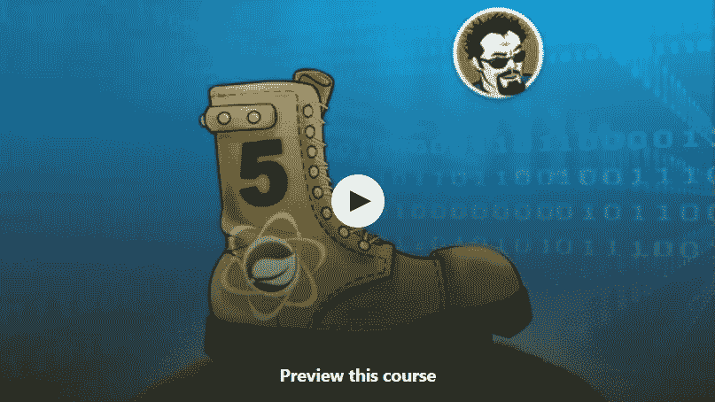
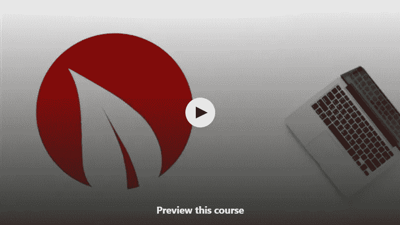
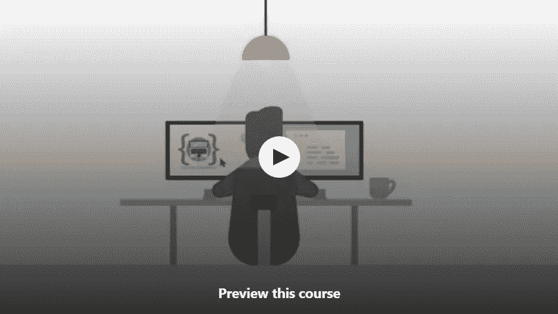
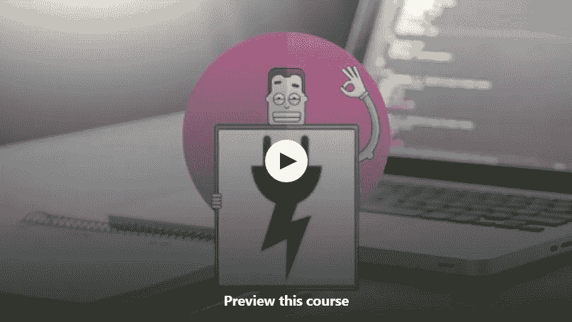
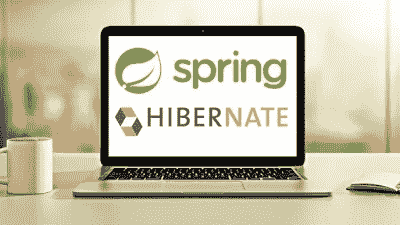

# 2023 年 Java 开发者学习 Spring 框架的 10 大免费课程

> 原文：<https://medium.com/javarevisited/top-10-free-courses-to-learn-spring-framework-for-java-developers-639db9348d25?source=collection_archive---------0----------------------->

大家好，我最近分享了很多资源，比如书籍和课程，当我发布我的学习 Spring 和 HibernateT3 的 [**前 8 名课程列表时，我的许多读者询问了类似的学习 Spring 框架**的**免费课程列表，如**](/javarevisited/8-best-spring-and-hibernate-training-courses-for-java-developers-acf09aa0e244) **[Core Spring](/javarevisited/10-best-online-courses-to-learn-spring-framework-in-2020-f7f73599c2fd) 、 [Spring MVC](/javarevisited/my-favorite-spring-mvc-courses-for-java-developers-5ede7f85dd88) 、 [Spring Security](/javarevisited/3-best-spring-security-books-and-resources-for-java-programmers-653d05c8afd4) 和 [Spring Boot](/javarevisited/top-10-courses-to-learn-spring-boot-in-2020-best-of-lot-6ffce88a1b6e) 。**

为了满足这个要求，早些时候我已经发布了 10 个免费的 Spring Boot 课程，今天我将分享免费的 Spring 框架课程来学习核心 Spring 和 Spring MVC。

在这个列表中，我整理了一些最好的在线免费课程，以按照您自己的速度从零开始学习 Spring Framework。您不仅可以学习提供依赖注入的核心 Spring like 框架，还可以学习 Spring MVC，这是 Java Web 开发人员最重要的框架，Spring Security 和 Spring Boot 可以让您的职业生涯更上一层楼。

我喜欢书籍和课程等免费资源，但有许多人认为免费资源不值得，它们往往不是最新的，从中学习纯粹是浪费时间。

嗯，他们确实有一个观点，免费资源大多已经过时，但免费资源并不意味着它们没有价值。付费资源肯定比免费资源好，但是，他们必须，你要付钱才能使用它们。

曾经有一段时间我买了很多书，现在依然如此，但现在我也专注于免费的书籍和课程。我学到的大部分东西都是来自免费资源。我们只需要小心翼翼地选择那些没有过时的好课程。

这些课程不仅旨在解释如何使用 Spring 框架构建 Java 项目，还将向您介绍 Spring 框架下的其他项目，如 Spring MVC、 [Spring Boot](/javarevisited/top-5-books-to-learn-spring-boot-and-microservices-for-experienced-java-developers-499a9d921d18) 、 [Spring Cloud](/javarevisited/5-best-courses-to-learn-spring-cloud-and-microservices-1ddea1af7012) 、Spring Batch、Spring Microservice 和 Spring Integration 等。

不过，如果你不介意花点钱学习像 spring framework 这样有价值的技能，那么我也建议你去看看 Udemy 上的 [**Spring Framework:初学者到大师**](https://click.linksynergy.com/fs-bin/click?id=JVFxdTr9V80&subid=0&offerid=323058.1&type=10&tmpid=14538&RD_PARM1=https%3A%2F%2Fwww.udemy.com%2Fspring-framework-5-beginner-to-guru%2F) 课程。这不是免费的，但非常实惠，在优购上你只需花 10 美元。这是最新的课程，涵盖春季 5 期。

<https://click.linksynergy.com/fs-bin/click?id=JVFxdTr9V80&subid=0&offerid=323058.1&type=10&tmpid=14538&RD_PARM1=https%3A%2F%2Fwww.udemy.com%2Fspring-framework-5-beginner-to-guru%2F>  

# 学习核心 Spring、Spring Boot 和 Spring MVC 的 10 个最佳免费课程

不再浪费时间，这里有一些最好的免费 Spring 课程，Java 开发者可以按照自己的进度在线学习 [Spring Core](/javarevisited/7-best-java-and-spring-developer-interview-books-and-courses-8df45282b67b) 、 [Spring MVC](https://javarevisited.blogspot.com/2020/08/top-5-courses-to-learn-spring-mvc-for.html) 和 [Spring Boot](/javarevisited/10-advanced-spring-boot-courses-for-experienced-java-developers-5e57606816bd) 。

我会随时更新这个列表，一旦发现好的免费课程可以分享，我会添加 Spring 5 课程。顺便说一句，清单上的大多数课程仍然是有价值的，教授永恒的基本概念。

## **1。** [**Spring 框架和依赖注入适合初学者**](https://click.linksynergy.com/fs-bin/click?id=JVFxdTr9V80&subid=0&offerid=323058.1&type=10&tmpid=14537&RD_PARM1=https%3A%2F%2Fwww.udemy.com%2Fspring-framework-video-tutorial%2F%3FsiteID%3DJVFxdTr9V80-8SNbhyaiGnts0o5GwK6r0A%2526LSNPUBID%3DJVFxdTr9V80)

这是学习 Spring 框架基础知识的最好的免费课程之一，比如依赖注入和控制反转。当我第一次学习 Spring 时，这些是驱动因素。我惊讶于这些技术是如何帮助你编写松散耦合的代码的，这些代码更容易测试和维护。

在这个循序渐进的 Spring 课程中，您将首先学习如何创建一个新的 Spring 应用程序，然后您将了解使用 Java 和基于注释的配置的 Spring 的依赖注入(IoC)特性的基础。

**这里是加入本课程的链接** — [Spring 框架和依赖注入初学者](https://click.linksynergy.com/fs-bin/click?id=JVFxdTr9V80&subid=0&offerid=323058.1&type=10&tmpid=14537&RD_PARM1=https%3A%2F%2Fwww.udemy.com%2Fspring-framework-video-tutorial%2F%3FsiteID%3DJVFxdTr9V80-8SNbhyaiGnts0o5GwK6r0A%2526LSNPUBID%3DJVFxdTr9V80)

这也是最受欢迎的在线免费 Spring 框架课程之一，已经有 27，604 名学生注册。

简而言之，如果你是 Spring 框架的新手，或者你知道 Spring 但不熟悉 Java 或基于注释的 Spring 配置，那么这是适合你的课程。

## **2。** [**引进 Spring Boot**](https://click.linksynergy.com/fs-bin/click?id=JVFxdTr9V80&subid=0&offerid=323058.1&type=10&tmpid=14537&RD_PARM1=https%3A%2F%2Fwww.udemy.com%2Fspring-boot-getting-started%2F%3FsiteID%3DJVFxdTr9V80-3gqihJuruthAeld__4bMQw%2526LSNPUBID%3DJVFxdTr9V80) **【自由】**

Spring Boot 是使用 Spring 框架的一种新的更好的方式，它在过去几年里已经真正起飞了。本课程不会教你什么是 Spring boot，但会帮助你建立自己的开发环境，这对于刚接触新技术的人来说是最难的事情。您还将从头开始创建一个 Hello World 应用程序，并了解构建 Spring Boot 应用程序所需的工具。

作为先决条件，你应该熟悉 Java 或 Groovy 和 Spring 框架。如果你不熟悉 Spring 框架，我建议你学习这个列表中的第一门 Spring 课程。这也是最受欢迎的免费春季课程之一，已经有 20，000 名学生注册了这门课程。注册后，您可以通过手机和电视访问本课程，并在成功完成课程后获得结业证书。

**这是加入本课程** — [介绍 Spring Boot](https://click.linksynergy.com/fs-bin/click?id=JVFxdTr9V80&subid=0&offerid=323058.1&type=10&tmpid=14537&RD_PARM1=https%3A%2F%2Fwww.udemy.com%2Fspring-boot-getting-started%2F%3FsiteID%3DJVFxdTr9V80-3gqihJuruthAeld__4bMQw%2526LSNPUBID%3DJVFxdTr9V80) 的链接

## **3。** [**弹簧基本面**](https://pluralsight.pxf.io/c/1193463/424552/7490?u=https%3A%2F%2Fwww.pluralsight.com%2Fcourses%2Fspring-fundamentals)

这是从 Pluralsight 的 Spring 框架开始的最佳课程之一。作者 Bryan Hansen 是盐湖城一家咨询公司 Software Technology Group 的董事，他编写并教授了大量 Java 和 Spring 课程。

在本课程中，您将通过浏览 Spring-like 中可用的各种配置方法来学习 Spring 开发的基础知识:
1 .XML 配置 2。使用注释的 XML 配置
3。Java 配置
4。以及如何读取属性文件。

学完本课程后，您就可以探索其他 Spring 项目了，比如 Spring MVC、Spring Boot 和 Spring 微服务。参加本课程不需要任何 Spring 经验，但是您应该熟悉 Java。

**这里是加入本课程的链接**——[春季基础](https://pluralsight.pxf.io/c/1193463/424552/7490?u=https%3A%2F%2Fwww.pluralsight.com%2Fcourses%2Fspring-fundamentals)

尽管如此，这个课程并不是完全免费的，因为你需要一个 [Pluralsight 会员资格](https://pluralsight.pxf.io/c/1193463/424552/7490?u=https%3A%2F%2Fwww.pluralsight.com%2Fpricing)，这是要花钱的，大约每月 29 美元或者每年 299 美元。不过，如果你想的话，你可以通过参加他们的 1 [0 天免费试用](https://pluralsight.pxf.io/c/1193463/424552/7490?u=https%3A%2F%2Fwww.pluralsight.com%2Flearn)来免费获得这门课程，它允许 200 分钟的免费学习。

还有同一作者[Bryan Hansen](https://medium.com/u/b76a6b7e6647?source=post_page-----639db9348d25--------------------------------)[**Spring Framework:Spring Fundamentals**](https://pluralsight.pxf.io/c/1193463/424552/7490?u=https%3A%2F%2Fwww.pluralsight.com%2Fcourses%2Fspring-framework-spring-fundamentals)的这个课程的新更新版本，如果你愿意，也可以去查那个。

<https://pluralsight.pxf.io/c/1193463/424552/7490?u=https%3A%2F%2Fwww.pluralsight.com%2Fcourses%2Fspring-framework-spring-fundamentals>  

## **4。**[Spring Boot 2 和 Spring 框架 5 简介](https://click.linksynergy.com/deeplink?id=JVFxdTr9V80&mid=39197&murl=https%3A%2F%2Fwww.udemy.com%2Fcourse%2Fintroduction-to-spring-boot-2-and-spring-framework-5%2F)

这是 Udemy 的另一个很棒的免费 Spring boot 和 Spring 5 免费课程，非常适合初学者，尤其是希望使用 Spring 框架开发基于互联网的 Java web 应用程序的 Java Web 开发人员。在本课程中，您将学习 Spring Boot 和 Spring Framework 5 的基本介绍。它涵盖了在 Spring MVC 中构建一个基本的应用程序、架构、控制器、视图、标签、验证和 ajax。

在本课程中，您将学到以下内容:

1.  如何创建 Spring Boot Web 应用程序
2.  如何创建新的 Spring Boot 项目
3.  如何用 Spring Data JPA 存储和检索数据
4.  如何使用百里香将数据库中的数据显示到网页上

**这里是加入本课程**——[Spring Boot 2 和 Spring 框架 5 简介](https://click.linksynergy.com/deeplink?id=JVFxdTr9V80&mid=39197&murl=https%3A%2F%2Fwww.udemy.com%2Fcourse%2Fintroduction-to-spring-boot-2-and-spring-framework-5%2F)的链接

## 5. [Spring Boot:从开发到部署的完整指南](http://bit.ly/2Ak1TDa)

这个免费的 Spring boot 课程提供了从开发到部署的完整指南。本课程由 Bhupendra Sharma 创建，将教你如何使用 [Spring boot](/javarevisited/10-advanced-spring-boot-courses-for-experienced-java-developers-5e57606816bd?source=collection_home---4------0-----------------------) 构建一个微服务应用程序

该课程有超过 2.5 小时的学习内容，超过 32，000 名学生加入了该课程。

**这是参加本课程的链接** — [Spring Boot:从开发到部署的完整指南](http://bit.ly/2Ak1TDa)

## 6.[使用 Spring 框架的 RESTful Web 服务——快速入门](http://bit.ly/2Dh2ma1)

这是另一个流行的免费 Spring 框架教程，来自 Udemy。它提供了用 Spring Boot 和 Spring MVC 构建 REST API 的快速入门。

在这 3 个小时的课程中，您将学到以下内容:

1.  如何使用 Spring 框架创建一个 RESTful Web 服务
2.  Ho 使用 Postman 发送 HTTP 请求并接收 JSON 或 XML 格式的 HTTP 响应
3.  如何创建 Web 服务端点来处理 HTTP 请求
4.  如何读取和验证 URL 查询字符串请求参数和 HTTP 请求正文
5.  如何处理 Java 异常并返回正确的 HTTP 响应
6.  如何将 RESTful Web 服务应用程序作为独立的应用程序来构建和运行

**这里是加入本课程的链接** — [使用 Spring Framework 的 RESTful Web 服务—快速入门](http://bit.ly/2Dh2ma1)

## 6.[构建 Angular 和 Spring MVC Web 应用](http://bit.ly/2Dknigm)

如果你正在寻找一个免费的在线课程来学习使用 Java 和 Spring 的全栈 web 开发，那么这个课程就是为你准备的。在这个由 [Bushan Sigur](https://medium.com/u/3383c761f122?source=post_page-----639db9348d25--------------------------------) 创建的 2 个小时的课程中，你将学到很多全栈 Java 开发者应该知道的东西。

完成本课程后，您应该能够:

1.  使用 Angular 和 Spring MVC 创建一个 web 应用程序
2.  使用 Angular 进行 HTTP 调用
3.  使用 Spring MVC 创建 RESTful API
4.  使用 Spring MVC 和 Hibernate 创建数据库应用程序

**这是加入本课程的链接**——[构建一个有角度的、有弹性的 MVC Web 应用](http://bit.ly/2Dknigm)

## 8.[利用微服务架构开发云原生应用](https://click.linksynergy.com/deeplink?id=JVFxdTr9V80&mid=39197&murl=https%3A%2F%2Fwww.udemy.com%2Fdeveloping-cloud-native-applications-microservices-architectures%2F)

如果你正在寻找一个使用 Spring 框架开发微服务的免费在线培训课程，那么这个课程就是为你准备的。

这是由 Burr Sutter 提供的官方 Red hat 培训课程，在这个 2.5 小时的课程中，您将学到以下内容:

1.  微服务架构基础和基础
2.  实践通过 DevOps 管道部署各种微服务框架的技术。

**这是参加本课程的链接** — [使用微服务架构开发云原生应用](https://click.linksynergy.com/deeplink?id=JVFxdTr9V80&mid=39197&murl=https%3A%2F%2Fwww.udemy.com%2Fdeveloping-cloud-native-applications-microservices-architectures%2F)

## 9.[轻松学习 Spring Boot！](https://click.linksynergy.com/deeplink?id=JVFxdTr9V80&mid=39197&murl=https%3A%2F%2Fwww.udemy.com%2Fcourse%2Fspring-boot-tutorial-beginners%2F)

这是一个学习 Spring 基础知识的短期课程，你将通过例子和面试问题以简单的方式学习 Spring Boot。

在本课程中，您将学到以下内容:

1.  什么是春靴？
2.  spring boot 是做什么的？
3.  Spring boot starter 依赖项
4.  自动配置和弹簧引导初始化器
5.  如何在 Eclipse 中创建 Spring boot 应用
6.  嵌入式服务器
7.  脂肪罐，独立罐，可运行罐

**以下是参加本课程的链接**——[轻松学习 Spring Boot！](https://click.linksynergy.com/deeplink?id=JVFxdTr9V80&mid=39197&murl=https%3A%2F%2Fwww.udemy.com%2Fcourse%2Fspring-boot-tutorial-beginners%2F)

不过，如果你想成为一名全栈 Java 开发人员，我也建议你看看 Karthikeya 的 [**全栈 Java bundle**](https://karpadoschool.teachable.com/a/aff_0wbz47cn/external?affcode=536712_cf-umzkm) **，**，它包含了成为全栈 Java 开发人员的许多课程。他非常友好地提供了一个月 1 美元的捆绑包，特别是针对 Java 访问的读者，

<https://karpadoschool.teachable.com/courses/karpado-premium-member?affcode=536712_cf-umzkm>  

## 10.[轻松学习 Spring Core！](https://click.linksynergy.com/deeplink?id=JVFxdTr9V80&mid=39197&murl=https%3A%2F%2Fwww.udemy.com%2Fcourse%2Fspring-online-training%2F)

这是学习 Spring 框架，尤其是 Spring Core 的一个很棒的、全面的、免费的课程。由@Karthikya 创建的这个 5 小时的课程将教你 Spring 框架的基础知识。

在本课程中，您将学到以下内容:

1.  控制容器的依赖注入和倒置
2.  自动连接和独立 Beans
3.  原型豆
4.  面向方面编程
5.  属性编辑器和工厂 Beans
6.  感知接口和 Bean 生命周期

**这里是加入本课程的链接**——[轻松学习 Spring Core！](https://click.linksynergy.com/deeplink?id=JVFxdTr9V80&mid=39197&murl=https%3A%2F%2Fwww.udemy.com%2Fcourse%2Fspring-online-training%2F)

## 11。 [**春季&初学冬眠**](https://click.linksynergy.com/link?id=JVFxdTr9V80&offerid=323058.647428&type=2&murl=https%3A%2F%2Fwww.udemy.com%2Fspring-hibernate-tutorial%2F)

这不是一门真正的免费课程，但我把它放在这里，因为它是我遇到的最实用的课程之一。在这个课程中，你将从零开始用 Spring MVC 和 Hibernate 构建一个完整的项目，因为你在 Udemy 上只需花 10 美元就可以得到它，所以它一点也不贵。将 Spring + Hibernate 课程放在这个列表中还有另一个原因，因为现实世界中的许多项目同时使用这两种框架。Spring 用于表示层、业务层和服务层，而 [Hibernate](/javarevisited/top-5-hibernate-online-training-courses-for-beginners-and-advance-java-programmers-469460596b2b) 用于后端和数据库层。

与其他只解释核心概念的课程不同，本课程的作者 Chad Darby 解释了你键入的每一行代码，对初学者非常有用。

总之，一起学习 Spring 和 Hibernate 比较好的在线课程之一，尤其是如果你是从零开始的话。

**这里是加入这个课程的链接** — [初学](https://click.linksynergy.com/link?id=JVFxdTr9V80&offerid=323058.647428&type=2&murl=https%3A%2F%2Fwww.udemy.com%2Fspring-hibernate-tutorial%2F)的春天&冬眠

以上是初学者在线学习的一些最好的免费春季课程。像 Java 一样，Spring 框架也是庞大的，不容易从一门课程中获得一切。

如果你想让他们学得更详细，你可能需要单独的课程来学习 Spring MVC、Spring Boot、Spring Batch、Spring Microservice，但是不要担心，我会分享一些免费的书籍和课程来分别介绍它们。

顺便说一句，如果你迫不及待，那么你也可以从这些资源入手，它们不一定是免费的，但很有价值:

1.  [Spring Framework 5:初学者到大师](https://click.linksynergy.com/fs-bin/click?id=JVFxdTr9V80&subid=0&offerid=323058.1&type=10&tmpid=14538&RD_PARM1=https%3A%2F%2Fwww.udemy.com%2Fspring-framework-5-beginner-to-guru%2F)
2.  [休息用弹簧大师课](http://courses.baeldung.com/p/rest-with-spring-the-master-class?affcode=22136_bkwjs9xa)
3.  欧根·帕拉斯基夫的春季安全大师课
4.  [Karpado 的全栈 Java 开发人员](https://karpadoschool.teachable.com/a/aff_0wbz47cn/external?affcode=536712_cf-umzkm)

感谢阅读这篇文章，如果你喜欢这些课程，那么请与你的朋友和同事分享。这是免费的，每个人都应该从中受益。如果您有任何问题或反馈，请留言。

<https://courses.baeldung.com/p/ls-certification-class?utm_source=javarevisited&utm_medium=web&utm_campaign=lss&affcode=22136_bkwjs9xa> 