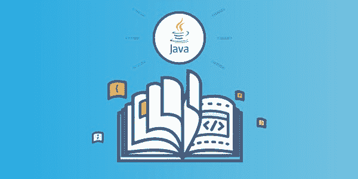
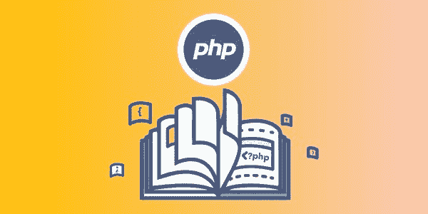
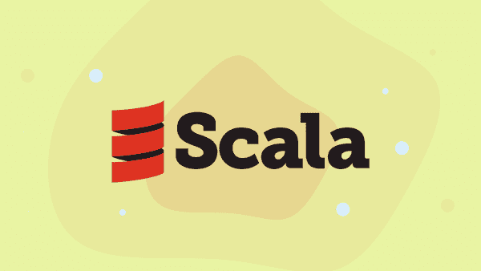
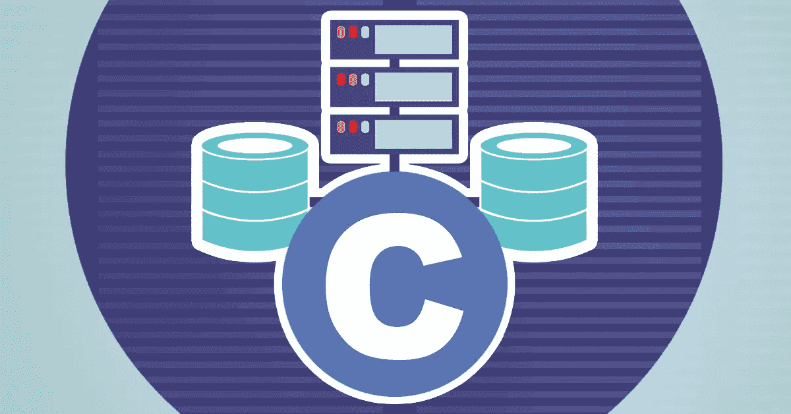
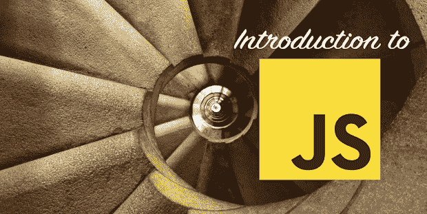
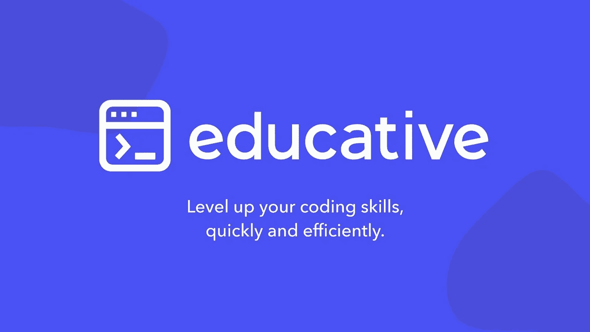

# 2023 年学习编程和编码的十大免费文本在线课程

> 原文：<https://medium.com/javarevisited/top-10-free-interactive-programming-courses-from-educative-for-beginners-to-learn-in-2021-713cbf96d4eb?source=collection_archive---------1----------------------->

## 从 Educative.io 免费学习 Python、JavaScript、Java、Scala、C、C++、JavaScript、PHP、Ruby、R 编程的编程和编码课程

image_credit — [教育性](https://www.educative.io/subscription?affiliate_id=5073518643380224)

大家好，如果你正在寻找免费的在线编程课程来学习像 [Python](/better-programming/top-5-courses-to-learn-python-in-2018-best-of-lot-26644a99e7ec) 、 [Java](/javarevisited/top-5-java-online-courses-for-beginners-best-of-lot-1e1e240a758) 、 [C++](/javarevisited/top-10-courses-to-learn-c-for-beginners-best-and-free-4afc262a544e) 和 [JavaScript](/javarevisited/10-best-online-courses-to-learn-javascript-in-2020-af5ed0801645) 这样的热门技能，那么你来对地方了。

早些时候，我已经分享了学习 [Python](https://javarevisited.blogspot.com/2018/03/top-5-courses-to-learn-python-in-2018.html) 、 [Java](https://javarevisited.blogspot.com/2018/05/top-5-java-courses-for-beginners-to-learn-online.html) 、 [C++](https://www.java67.com/2018/02/5-free-cpp-courses-to-learn-programming.html) 和 [JavaScript](/javarevisited/10-best-online-courses-to-learn-javascript-in-2020-af5ed0801645) 的最佳课程，今天，我将分享一些非常棒的、免费的、基于在线文本的互动课程，从 Educative 学习 Java、Python、C、C++、JavaScript、R、Scala 和 Web 开发。

如果你不知道， [Educative](https://www.educative.io/subscription?affiliate_id=5073518643380224) 是一个新的在线学习平台。与 Udemy 或 Pluralsight 等传统视频课程平台不同，它们为软件开发人员提供互动课程。

它们与其他在线学习平台有些不同，如 Udemy T21 或 Pluralsight，因为它们是基于文本的，你可以边做边学，因为它允许你在浏览器中运行代码。

> 由于设置开发环境是一项痛苦而复杂的任务，许多初学者被困在那里，Educative 的这一举措让您可以直接从他们的课程中运行代码，这确实是一项改变游戏规则的举措。

现在，您可以完全专注于学习，而不是试图下载和安装必要的软件。我不知道他们是怎么做到的；他们可能使用 [Docker](https://javarevisited.blogspot.com/2019/05/top-5-courses-to-learn-docker-and-kubernetes-for-devops.html) 或任何其他 VM 技术来允许你运行代码，但是无论他们在做什么，对初学者来说都是极好的。

我一直是 Udemy 的粉丝，因为我以 10 美元或 12 美元的微薄价格获得了许多优质课程，如[**Python 大师班**](http://bit.ly/2AGmZvj) ，但 Educative 确实有一些独特的东西可以提供。其基于文本的课程阅读速度更快，更重要的是，您可以在浏览器中试用代码示例。

他们还增加了一些测验和作业来保留你所学的知识，当你完成课程时，你也将获得证书。

他们的一些课程，如[探索系统设计面试](https://www.educative.io/collection/5668639101419520/5649050225344512?affiliate_id=5073518643380224)和[探索编码面试:编码问题的模式](https://www.educative.io/collection/5668639101419520/5671464854355968?affiliate_id=5073518643380224)对于准备编码面试的人来说非常有用。这些课程是由一个专家团队开发的，他们也参与了谷歌、微软、亚马逊等最著名的科技公司的招聘过程。

 [## 探索系统设计面试——互动学习

### 系统设计问题已经成为软件工程面试过程的标准部分。在这些方面的表现…

www.educative.io](https://www.educative.io/collection/5668639101419520/5649050225344512?affiliate_id=5073518643380224)  [## 探索编码面试:编码问题的模式——互动学习

### 编码面试一天比一天难。几年前，我温习了关键数据结构并浏览了…

www.educative.io](https://www.educative.io/collection/5668639101419520/5671464854355968?affiliate_id=5073518643380224) 

而且，如果你正在准备编码面试，一定要去看看那些课程，他们现在还提供对[教育会员](https://www.educative.io/subscription?affiliate_id=5073518643380224)的 50%折扣，所以这是一个获得会员资格的好时机，每月 18 美元就可以享受他们所有的高级课程，这对你来说是一个不错的投资。

# 2023 年学习 Python、Java、C++和 JavaScript 的 10 个最佳免费编程课程

除了这些课程，我进一步查看了该平台，并找到了一些有用的免费课程来学习 Python、Java、JavaScript 和 web 开发，今天我将与大家分享这些课程。

## 1.[从零开始学 Java】](https://www.educative.io/courses/learn-java-from-scratch?affiliate_id=5073518643380224)

Java 是我最喜欢的编程语言，它可能是学习和获得开发人员工作的最佳语言。对熟练的 Java 开发人员有很高的需求，而且报酬也很高。

如果你想成为一名 [Java 开发者](/javarevisited/top-10-frameworks-full-stack-java-developers-can-learn-in-2020-5995021401e5)，没有比从这门高度互动的免费编程课程开始更好的方法了。它从一个简单的 hello world 程序开始，并继续涵盖常见的概念，如条件语句、循环语句、简单的数学和 Java 中的逻辑。

最后，为了教授高级概念，如 Java 中的类&继承、泛型和数组列表，本课程进行了更深入的探讨。当你完成时，你将成为一名中级 Java 开发人员，准备好承担自己的项目。

**这里是加入这个免费 Java 编程课程的链接**——[从零开始学习 Java](https://www.educative.io/courses/learn-java-from-scratch?affiliate_id=5073518643380224)

如果你需要更多学习 Java 编程的资源，也可以看看这个[我最喜欢的免费课程列表，在 Medium 上学习 Java](/javarevisited/10-free-courses-to-learn-java-in-2019-22d1f33a3915) 。

## 2.[从零开始学习 Python](https://www.educative.io/courses/learn-python-from-scratch?affiliate_id=5073518643380224)

毫无疑问，Python 是当今最流行的编程语言，Python 程序员的需求量一直很大。随着它越来越受欢迎，它已经成为最接近每个程序员都必须知道的语言。

好消息是，这个交互式免费编程课程是一个完美的起点。本课程首先探索基本的构建模块，然后学习更高级的概念，如函数和循环。

它也有有趣的测验和编码挑战，这也将有助于强化课程中涵盖的所有概念。

最棒的是，**它是完全免费的**，所以你不需要支付任何费用。你只需要创建一个帐户来加入 Educative.io 上的课程。

**你可以在这里**注册这个免费的 Python 编程课程——[从零开始学 Python](https://www.educative.io/courses/learn-python-from-scratch?affiliate_id=5073518643380224)

并且，如果你需要更多的资源来学习 Java 编程，你也可以看看这个[免费 Python 编程课程](https://javarevisited.blogspot.com/2018/12/10-free-python-courses-for-programmers.html)的列表。

## 3.[从零开始学习 c++](https://www.educative.io/courses/learn-cpp-from-scratch?affiliate_id=5073518643380224)

C++是另一种在世界上广泛使用的编程语言。您会发现用 C++编写的应用程序涉及广泛的领域，如嵌入式编程、服务器端应用程序、游戏，甚至高频交易应用程序。

学习 C++不仅能让你成为一名更好的开发人员，还能为你作为一名 C++开发人员[打开几份高薪工作的大门](https://javarevisited.blogspot.com/2020/07/top-10-courses-to-learn-c-in-depth-best.html)，如果你想成为一名 C++开发人员，这门免费课程是一个很好的起点。

这个免费的交互式编程课程首先向你介绍 [C++](https://javarevisited.blogspot.com/2020/07/top-10-courses-to-learn-c-in-depth-best.html) 中的基本编程概念。它从一个简单的 hello world 程序开始，继续讨论常见的概念，如 C++中的条件语句、循环语句和函数。之后，你将学习指针和数组等基本主题，以及它们赋予程序员编写更好代码的能力。

最后，为了通过交互式挑战和练习来教授高级概念，如 C++中的类、继承和模板，本课程进行了更深入的探讨。

**这里是免费 C++课程的链接**——[从头开始学习 c++](https://www.educative.io/courses/learn-cpp-from-scratch?affiliate_id=5073518643380224)

而且，如果你需要更多的资源，看看这个为程序员和初学者提供的免费 C++课程列表。

## 4.从零开始学习 Web 开发

毫无疑问，Web 开发是一项有益的技能。建立网站的能力是一项伟大的技能，它可以让你终生受益。

问题是,[学习 Web 开发](/better-programming/my-5-favorite-courses-to-learn-web-development-in-2019-a5e74167f8b2)并不容易，有很多工具、语言、框架和库可供选择，很快就会让人不知所措。这就是像这样的引导式课程可以帮助你的地方。

这个*的免费网页开发课程*涵盖了网页开发者需要的一切。它从网页的基础开始，从用 [HTML](https://www.java67.com/2020/08/5-best-online-courses-to-learn-html-5.html) 语义标记你的页面到用 [CSS](/javarevisited/top-10-free-courses-to-learn-html-5-css-3-and-web-development-872d62d97a97) 样式化你的内容。

然后继续教你 JavaScript 的编程基础，到最后，你将足够舒适地使用 JavaScript 开发全功能的 web 模块，包括图像轮播和待办事项列表应用程序！

这里是加入这个免费网站开发课程的链接— [从零开始学习网站开发](https://www.educative.io/courses/learn-web-development-from-scratch?affiliate_id=5073518643380224)

而且，如果你需要更多的选择，看看这个为初学者和有经验的程序员提供的 [10 门网络开发课程的列表](https://dev.to/javinpaul/top-6-courses-to-learn-web-development-best-of-lot-2fae)。

## 5.[从零开始学习 PHP](https://www.educative.io/courses/learn-php-from-scratch?affiliate_id=5073518643380224)

就生产力而言，PHP 确实是一门伟大的语言。互联网上 50%的网站都在运行 PHP，这一事实充分说明了 PHP 的受欢迎程度。如果你想学习 PHP T21，这个高度互动的免费编程课程是一个很好的开始。它从一个简单的 Hello world 程序开始，继续涵盖 PHP 中的常见概念，如条件语句、循环语句和逻辑。

这里是免费 PHP 课程的链接— [从头开始学习 PHP](https://www.educative.io/courses/learn-php-from-scratch?affiliate_id=5073518643380224)

如果你需要更多的选择，可以看看这个免费学习 PHP 和 MySQL 的课程列表。

## 6.[从零开始学习 Scala】](https://www.educative.io/courses/learn-scala-from-scratch?affiliate_id=5073518643380224)

如果您是 Java 开发人员或者一直在关注 Scala，那么您应该知道 Scala 为您提供了快速有效地构建可伸缩程序的工具。

和 [Java](/javarevisited/10-free-courses-to-learn-java-in-2019-22d1f33a3915?source=collection_home---4------8-----------------------) 一样，它是一种静态类型的高级语言，将函数式编程和[面向对象编程](/swlh/5-free-object-oriented-programming-online-courses-for-programmers-156afd0a3a73)结合到一个灵活的包中。

对于熟练的 Scala 开发人员有很高的需求，因为很多公司像 Twitter、LinkedIn 都使用 Scala 来构建真正可扩展的系统，如果你想成为 Scala 开发人员，这个免费的编码课程可以帮助你。

**这里是加入免费 Scala 课程的链接**——[从头开始学习 Scala](https://www.educative.io/courses/learn-scala-from-scratch?affiliate_id=5073518643380224)

你可以免费参加这个课程，如果你需要更多的资源，查看这个[免费 Scala 课程列表](https://javarevisited.blogspot.com/2019/01/5-free-scala-programming-courses-for-java-programmers-learn-online.html)以获得更多选项。

## 7.[从零开始学习 R](https://www.educative.io/courses/learn-r-from-scratch?affiliate_id=5073518643380224)

R 编程语言可能是最流行的数据分析语言。由于其强大的统计功能、出色的绘图能力和通过包的可扩展性，它已经被使用了很多年。

这个交互式的[免费编码课程](https://hackernoon.com/20-best-courses-from-udemy-free-resource-center-to-learn-programming-and-coding-48873yjn)将让你快速上手，并且假设你没有 r 语言的先验知识。你将从最基础的开始，逐步学习像异常处理这样的高级概念。

当你完成的时候，你将能够自己用 R 编写详细的、有用的代码。

**这里是加入这个免费 R 编程课程的链接**——[从零开始学 R](https://www.educative.io/courses/learn-r-from-scratch?affiliate_id=5073518643380224)

如果你需要更多的资源，你也可以查看这份数据科学与编程的[免费 R 编程课程](https://hackernoon.com/5-free-r-programming-courses-for-data-scientists-and-ml-programmers-5732cb9e10)列表。

## 8.[从零开始学习 C 语言](https://www.educative.io/courses/learn-c-from-scratch)

c 是一切开始的地方，也是您开始编程之旅的地方。令人难以置信的高效和强大的 C 语言形成了许多其他语言的基础，如 [C++](/javarevisited/top-10-courses-to-learn-c-for-beginners-best-and-free-4afc262a544e) 和 [Java](/javarevisited/top-5-java-online-courses-for-beginners-best-of-lot-1e1e240a758) 。

它可以让你直接与内存和低级计算机操作进行交互，从而增强你的编程技能，加深你的理解。

这门全面且*免费的 C 编程课程*将向您介绍 C 语言的所有基本和高级编程概念。此外，它还解决了 c 语言中的内存、调试和并行编程问题。

这里是加入这个免费的 C 编程课程— [从零开始学习 C 语言](https://www.educative.io/courses/learn-c-from-scratch)

而且，如果你需要更多的资源来学习 C 编程，你应该看看这个为初学者准备的 [**最佳 C 编程课程**](https://javarevisited.blogspot.com/2019/11/top-5-courses-to-learn-c-programming-in.html) 列表。

## 9.[从零开始学习 Ruby](https://www.educative.io/courses/learn-ruby-from-scratch?affiliate_id=5073518643380224)

如果你想用 Ruby 编程语言开始你的编程生涯，那么这是一个很好的免费编程课程。

Ruby 是一种智能的、易于使用的、功能性的、[面向对象的编程语言](/javarevisited/my-favorite-courses-to-learn-object-oriented-programming-and-design-in-2019-197bab351733?source=---------103------------------)，它是 Perl 的脚本能力、Pythonic 能力等等的奇妙组合！

正如 [Ruby](/javarevisited/10-best-ruby-on-rails-courses-for-beginners-dca4d66e9f7b) 的创造者 Matsumoto 所暗示的:*“我希望看到 Ruby 帮助世界上的每一个程序员变得高效，并且享受编程，并且快乐。这是 Ruby 语言的主要目的。”*

这门入门课程将为您提供大量交互式编码插图、练习以及变量、内置类、对象、条件、块等不可或缺的主题支持的动手实践！

这里是加入免费 Ruby 编程课程的链接——[从零开始学习 Ruby](https://www.educative.io/courses/learn-ruby-from-scratch?affiliate_id=5073518643380224)

如果你需要更多的选择，你也可以在 Medium 上查看这个[免费 Ruby 课程](/javarevisited/top-5-free-courses-to-learn-ruby-and-rails-for-beginners-best-of-lot-e149fe03c964)的列表来获得一些想法。

## 10.。[JavaScript 简介:第一步](https://www.educative.io/courses/introduction-to-javascript-first-steps?affiliate_id=5073518643380224)

这是给完全初学者的 JavaScript 介绍。它将提供语言的基础。主题包括变量、运算符、函数、数组、对象和循环。

本课程由全栈工程师 Arnav Aggarwal 创建。Arnav 参加过一个编码训练营，并在另一个训练营教过书。他在理解人们如何学习编码方面有丰富的经验。

学完本课程后，您应该准备好通过高级课程或其他资源进一步学习。

**这里是加入这个免费 JavaScript 课程的链接**—[JavaScript 简介:第一步](https://www.educative.io/courses/introduction-to-javascript-first-steps?affiliate_id=5073518643380224)

而且，如果你需要更多的资源来学习 JavaScript，你应该看看这个为初学者准备的  [**我最喜欢的免费 JavaScript 课程**](/javarevisited/my-favorite-free-tutorials-and-courses-to-learn-javascript-8f4d0a71faf2) 列表。

以上是关于在教育平台上学习 Python、Java、C++和 JavaScript 的一些免费编程课程。这是一个很棒的在线学习网站，我真的很喜欢他们的课程材料和互动教学风格。

这不是一个视频，但你仍然可以通过做中学到很多东西，阅读总是比看视频更快，如果你喜欢从 Educative 的互动课程中学习，我强烈建议你参加 [**Educative 订阅**](https://www.educative.io/subscription?affiliate_id=5073518643380224) ，每月只需**18 美元**。

这对提高你的技能是一项巨大的投资。你会比看视频教程学得快一倍。非常感谢[教育团队](https://medium.com/u/163aa84775f6?source=post_page-----713cbf96d4eb--------------------------------)创建了这个令人敬畏的在线培训平台并提供这些免费的编程课程。

其他对开发者有用的免费编程资源

*   [学习 SQL 的免费课程](http://www.java67.com/2018/02/5-free-database-and-sql-query-courses-programmers.html)
*   [学习 Python 的免费课程](https://hackernoon.com/10-free-python-programming-courses-for-beginners-to-learn-online-38312f3b9912)
*   [学习算法的免费课程](https://hackernoon.com/10-free-data-structure-and-algorithm-courses-junior-developers-should-explore-978b72871af5)
*   [免费学习 C++](https://hackernoon.com/top-5-free-c-courses-to-learn-programming-in-2019-d27352277da0)
*   [学习 Linux 的免费课程](http://www.java67.com/2018/02/5-free-linux-unix-courses-for-programmers-learn-online.html)
*   [学习区块链的免费课程](http://www.java67.com/2018/02/5-free-blockchain-technology-courses.html)
*   [学习网页开发的免费课程](http://www.java67.com/2018/03/top-5-free-courses-to-learn-web-development.html)
*   [学习 JavaScript 的免费课程](http://www.java67.com/2018/04/top-5-free-javascript-courses-to-learn.html)
*   [免费学习棱角分明的课程](http://www.java67.com/2018/01/top-5-free-angular-js-online-courses-for-web-developers.html)
*   [学习 React JS 的免费课程](http://www.java67.com/2018/02/5-free-react-courses-for-web-developers.html)
*   [学习 OOP 的免费课程](http://www.java67.com/2018/02/5-free-object-oriented-programming-online-courses.html)
*   [学习 Java 的免费课程](http://www.java67.com/2018/08/top-10-free-java-courses-for-beginners-experienced-developers.html)
*   [学习 HTML 和 CSS 的免费课程](http://www.java67.com/2018/02/5-free-html-and-css-courses-to-learn-web-development.html)
*   [学习数据结构和算法的免费课程](http://www.java67.com/2019/02/top-10-free-algorithms-and-data.html)
*   [学习 Nodejs 的免费课程](https://www.java67.com/2019/07/top-5-free-nodejs-courses-for-web-development.html)
*   [学习 Git 和 Github 的免费课程](https://javarevisited.blogspot.com/2018/01/5-free-git-courses-for-programmers-to-learn-online.html)
*   [学习 Bash 的免费课程](https://www.java67.com/2019/04/top-5-free-course-to-learn-bash-shell-scripting-linux.html)
*   [我最喜欢的免费课程学习 TypeScript](/javarevisited/top-10-free-typescript-courses-to-learn-online-best-of-lot-44bce9da41d1)
*   [13 门面向初学者的免费 JavaScript 课程](/javarevisited/12-free-courses-to-learn-javascript-and-es6-for-beginners-and-experienced-developers-aa35874c9a32)
*   [面向开发者的 7 门免费区块链课程](/javarevisited/7-free-courses-to-learn-blockchain-in-2020-764e66b47ebe)

感谢您阅读本文。如果你喜欢这些来自 Educative 的免费编程课程，那么请与你的朋友和同事分享。如果您有任何问题或反馈，请留言。

**P. S. —** 如果你正在寻找一个最佳教育课程的列表，那么你也可以看看我的关于 [**10 个程序员最佳教育课程**](https://javarevisited.blogspot.com/2020/05/top-10-educative-courses-for-programmers.html) 的帖子，里面有很多资源可以找到优质的免费编程资源，比如书籍和课程。

 [## 探索系统设计面试——互动学习

### 系统设计问题已经成为软件工程面试过程的标准部分。在这些方面的表现…

www.educative.io](https://www.educative.io/collection/5668639101419520/5649050225344512?affiliate_id=5073518643380224)