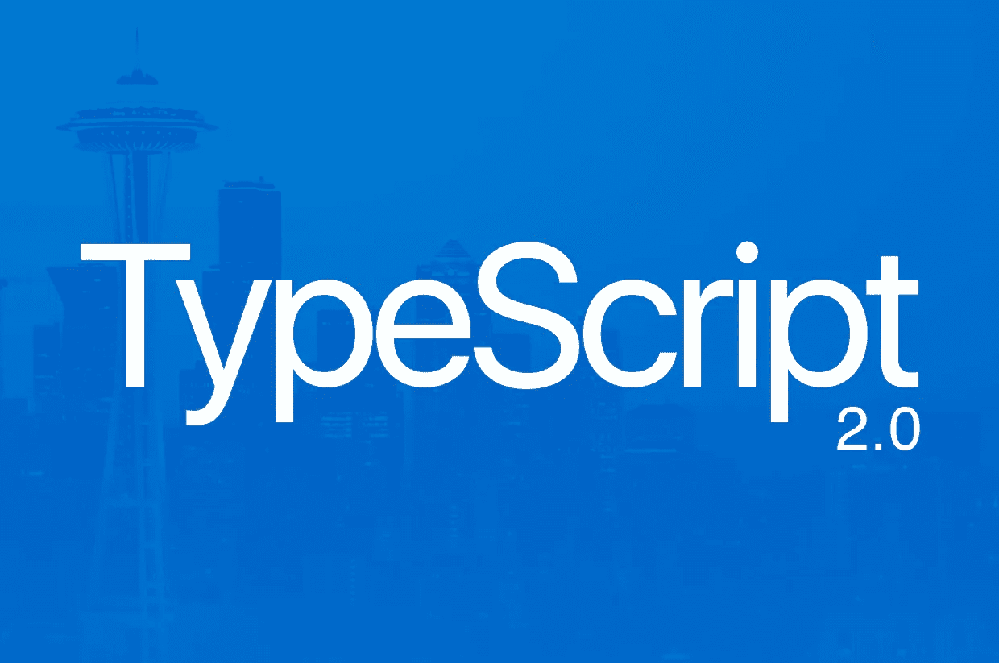
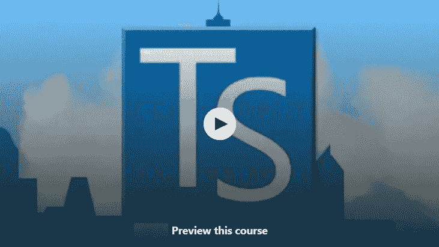
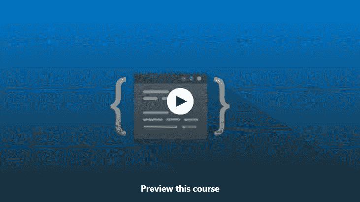
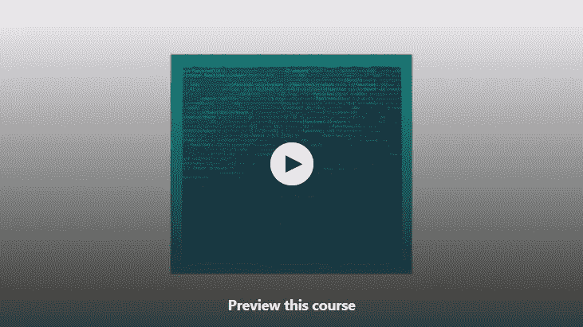
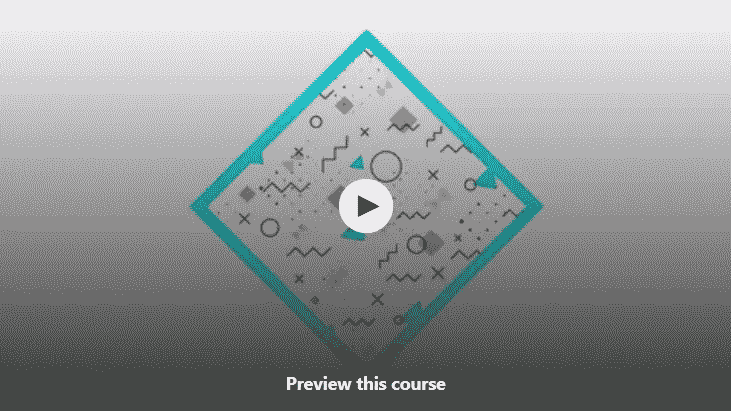
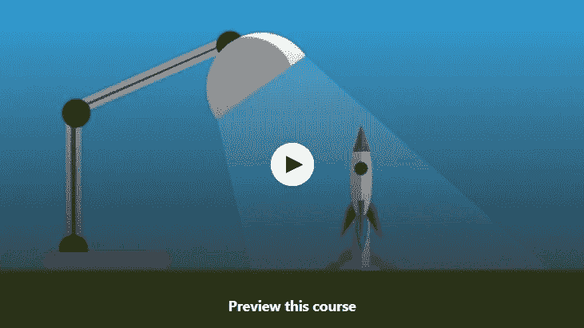
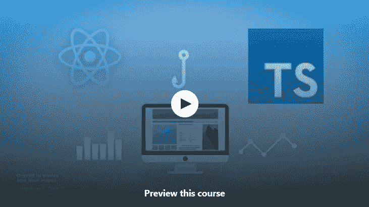
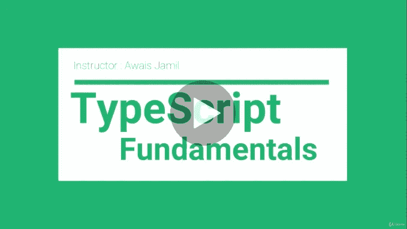
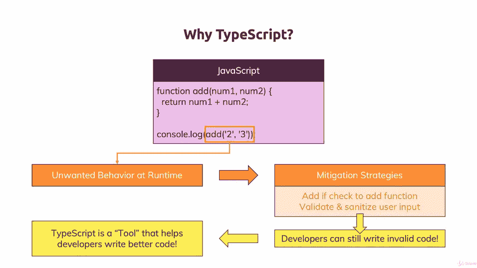

# 2023 年面向初学者的 10 大免费打字课程——最好的

> 原文：<https://medium.com/javarevisited/top-10-free-typescript-courses-to-learn-online-best-of-lot-44bce9da41d1?source=collection_archive---------0----------------------->

如果你有兴趣学习 TypeScript 或 [Angular](/javarevisited/10-courses-to-learn-angular-for-web-development-6da1bd2856dc) ，这是一个流行的用于开发前端的 JavaScript 框架，它使用 TypeScript 并寻找一些资源，如书籍、教程和课程，那么你来对地方了。

过去，我曾分享过 [**最佳打字稿课程**](/javarevisited/7-best-courses-to-learn-typescript-in-depth-58439e1ce729) 和 [**最佳 JavaScript 课程**](/javarevisited/10-best-online-courses-to-learn-javascript-in-2020-af5ed0801645) ，在本文中，我将分享一些**最佳免费打字稿在线课程**，你可以用它们来学习这种强大的编程语言。

对于那些不知道 [TypeScript](https://www.typescriptlang.org/) 的人来说，它是微软的一种新的动态类型编程语言，通过添加一些有助于面向对象应用程序开发的新特性，特别是类型的引入，增强了 [JavaScript 的](http://www.java67.com/2018/04/top-5-free-javascript-courses-to-learn.html)编程语法。

顾名思义， **TypeScript** 是类型和 [JavaScript](/javarevisited/my-favorite-free-tutorials-and-courses-to-learn-javascript-8f4d0a71faf2) 的组合，这意味着现在你的代码中有了合适的变量，比如字符串或整数变量，并且更少需要担心的与类型安全相关的错误。TypeScript 的好处是它可以编译成可以在浏览器上运行的本机 JavaScript 代码，这意味着你现在有了一个更好的语法来编写代码，你也可以利用 JavaScript 的普遍性。

# 2023 为什么要学 TypeScript？

大多数 web 开发人员学习 TypeScript 是因为 [Angular 2](http://www.java67.com/2018/01/top-10-web-mobile-and-big-data-framework-libraries-technologies-programmers-should-learn-in-2018.html) ，这是最强大的 JavaScript 框架和库之一。Angular 背后的谷歌选择 TypeScript 作为 Angular 开发的官方语言，就像他们选择了 [Kotlin](http://javarevisited.blogspot.sg/2018/02/5-courses-to-learn-kotlin-programming-java-android.html) 作为 [Android](http://javarevisited.blogspot.sg/2018/02/5-react-native-courses-to-learn-mobile-development-using-JavaScript.html) 的官方语言一样。

其实我是开始学 Angular 才知道 TypeScript 的。但是，学习 TypeScript 还有更多原因，其中最重要的是现代 JavaScript 开发所需的更有用的特性。

TypeScript 包含了几个很酷的特性，比如**类**、**模块**、**继承**，将应用程序开发提升到了一个新的层次。这将在未来的 JavaScript 版本中出现，这将使编码和开发比现在少一年。

[TypeScript](https://www.java67.com/2018/05/top-5-free-typescript-courses-to-learn.html) 也在 WinJS 中使用，WinJS 是 JavaScript 的 Windows 库。你可以用 WinJS 为 Windows Mobile 和 Windows 10 操作系统制作素材。它还减少了在 [JavaScript](http://javarevisited.blogspot.sg/2018/04/top-5-java-frameworks-to-learn-in-2018_27.html#axzz5DmwFLA1K) 代码中很常见的错误，由于 JavaScript 的动态、非类型化格式，很难调试和排除故障。通过使用 TypeScript，你可以在编译时发现许多这样的错误。如果你将一个字符串值赋给一个数值变量，那么 **TypeScript 编译器**会警告你，反之亦然。TypeScript 对于大型 JavaScript 项目特别有用，比如一个有 10，000 行代码的项目。TypeScript 项目比 JavaScript 代码更容易维护。

虽然这些免费课程开始时很好，但它们不如一些付费课程全面，如果你不介意为在线课程支付一些钱，那么 Max 的 [**理解 TypeScript**](https://click.linksynergy.com/fs-bin/click?id=JVFxdTr9V80&subid=0&offerid=323058.1&type=10&tmpid=14538&RD_PARM1=https%3A%2F%2Fwww.udemy.com%2Funderstanding-typescript%2F) 可能是目前你可以获得的在线学习 TypeScript 的最佳资源。

<https://click.linksynergy.com/fs-bin/click?id=JVFxdTr9V80&subid=0&offerid=323058.1&type=10&tmpid=14538&RD_PARM1=https%3A%2F%2Fwww.udemy.com%2Funderstanding-typescript%2F>  

# 2023 年为初学者提供的 10 门免费最佳打字稿课程

事不宜迟，这里列出了一些**免费的 TypeScript 课程，你可以加入**来学习这种令人敬畏的新编程语言。顺便说一句，在我们开始真正的课程之前，有一点关于定价的说明。

在撰写本文时，所有这些课程都可以在 [Udemy](/javarevisited/100-free-programming-and-web-development-courses-on-udemy-free-resource-center-3f8415eb5e6f) 上免费获得，但它们可以转变为付费课程，因为一旦教师达到他们的推广目标，他们通常会将免费课程转变为付费课程，所以请在参加课程前检查价格。

## **1。** [**打字稿简介**](https://click.linksynergy.com/fs-bin/click?id=JVFxdTr9V80&subid=0&offerid=323058.1&type=10&tmpid=14538&RD_PARM1=https%3A%2F%2Fwww.udemy.com%2Ftypescript%2F)

这是 Udemy 上最受欢迎的学习 TypeScript 的免费课程。已经有超过 33，000 名学生参加了该课程，并获得了超过 3700 个四星评级。

在这次**免费打字课程** e 中，丹尼尔·斯特恩老师解释了什么是打字以及你为什么要学习打字。课程很短，但无论有多难，都有真实的例子和材料来解释。通过参加本课程，您将在深入了解各种 TypeScript 功能之前，学习如何在 Mac 或 PC 上设置 TypeScript。这门课程分为三个主要部分。在第一部分中，您将了解在哪里可以使用 TypeScript，比如哪些项目更适合使用 TypeScript(主要是包含数千行代码的大型项目)

**这里是加入本课程的链接—** [**1。**](https://click.linksynergy.com/fs-bin/click?id=JVFxdTr9V80&subid=0&offerid=323058.1&type=10&tmpid=14538&RD_PARM1=https%3A%2F%2Fwww.udemy.com%2Ftypescript%2F) 打字稿介绍

在本节中，您将学习一些实际操作的东西，比如使用 NPM 安装 TypeScript，如何使用命令行将 TypeScript 编译成 [JavaScript](http://javarevisited.blogspot.sg/2017/02/top-5-javascript-books-to-learn-best-of-lot-must-read.html) ，以及了解常见的 TypeScript 编译器错误。

第三部分，也是最后一部分讲述了有趣的类型脚本特性，比如你会学到类型，它们是如何使用的，什么类型是可用的等等。您还将了解接口、继承和类。

似乎有另一个用 TypeScript 构建应用程序的板块，但目前还是空的。将来，我们可能也会在该部分看到一些内容。总的来说，从 TypeScript 开始是一门不错的免费课程。

## **2。** [**打字基础**](https://click.linksynergy.com/fs-bin/click?id=JVFxdTr9V80&subid=0&offerid=323058.1&type=10&tmpid=14538&RD_PARM1=https%3A%2F%2Fwww.udemy.com%2Fts-fundamental%2F)

这是另一个学习 TypeScript 的免费课程。在本课程讲师中，卡蒂克·KK 解释了 TypeScript 相对于 JavaScript 的优势，包括改进的编码体验、更多为浏览器编写 OOP 应用的工具，以及由于类型的引入而产生的更少的错误。本课程分为 15 个部分，每个部分解释一个关键的打字稿概念。该课程从 typescript 的基本介绍开始，然后转向在 Visual Studio 代码中安装和配置 TypeScript，这是许多 Web 开发人员正在使用的免费 IDE。

**以下是加入本课程的链接—** [**打字基础**](https://click.linksynergy.com/fs-bin/click?id=JVFxdTr9V80&subid=0&offerid=323058.1&type=10&tmpid=14538&RD_PARM1=https%3A%2F%2Fwww.udemy.com%2Fts-fundamental%2F)

稍后你会学到枚举、数组、函数、Lambdas、类、接口和其他面向对象的特性以及泛型、模块和其他类型脚本特性。

课程还讲解了 [JavaScript](/javarevisited/5-free-books-to-learn-javascript-for-beginners-4cca79834262) 的类型脚本和模块加载器中的名称空间。简而言之，一门从 TypeScript 开始的好课程应该有更多真实世界的例子、场景和解释。

还有，要想获得这门课的大部分内容，需要具备 JavaScript 的基础知识。

## **3。** [**打字入门**](https://click.linksynergy.com/fs-bin/click?id=JVFxdTr9V80&subid=0&offerid=323058.1&type=10&tmpid=14538&RD_PARM1=https%3A%2F%2Fwww.udemy.com%2Fgetting-started-with-typescript%2F)

这是另一个简短的 TypeScript 课程，供初学者从 TypeScript 开始。在本课程中，您将学习一些基础知识，例如什么是 TypeScript，JavaScript 和 TypeScript 之间有什么好处和区别。

您还将学习如何安装和配置 TypeScript，使用 let 和 [var](http://javarevisited.blogspot.sg/2018/03/finally-java-10-has-var-to-declare-local-variables.html) 声明变量，使用类型，并学习如何编译和运行 TypeScript 程序。

该课程还有一个关于扩展 TypeScript 的部分，其中谈到了 [jQuery](http://www.java67.com/2018/04/top-5-free-jquery-courses-for-web-developers.html) 、类型和 npm。总的来说，这是一门很好的 TypeScript 入门课程。

**以下是加入本课程的链接—** [**打字入门**](https://click.linksynergy.com/fs-bin/click?id=JVFxdTr9V80&subid=0&offerid=323058.1&type=10&tmpid=14538&RD_PARM1=https%3A%2F%2Fwww.udemy.com%2Fgetting-started-with-typescript%2F)

为了获得最大的好处，需要掌握 JavaScript T21、HTML 和 CSS 的基础知识。

## **4。** [**打字稿速成教程**](https://click.linksynergy.com/fs-bin/click?id=JVFxdTr9V80&subid=0&offerid=323058.1&type=10&tmpid=14538&RD_PARM1=https%3A%2F%2Fwww.udemy.com%2Ftypescript-fast-crash-course%2F) **【免费 Udemy 教程】**

顾名思义，这是一门类型脚本速成课程，它将很快教会你类型脚本的基本概念。

如果你没有几周或几个月的时间来学习 TypeScript，那么这是一门理想的课程。你将很快学会类型脚本的基本概念，如[类和接口](http://www.java67.com/2016/08/difference-between-class-and-interface-in-java.html)、类型、模块等。

简而言之，一个伟大的入门打字教程，让初学者快速上手。一旦你完成了这门课程，你就有足够的知识通过阅读一本书或参加其他更全面的课程来更深入地学习打字稿。导师也很热情，让学习变得有趣又轻松。

**这里是免费加入本课程的链接—** [**打字速成班**](https://click.linksynergy.com/fs-bin/click?id=JVFxdTr9V80&subid=0&offerid=323058.1&type=10&tmpid=14538&RD_PARM1=https%3A%2F%2Fwww.udemy.com%2Ftypescript-fast-crash-course%2F)

## **5。** [**打字稿设计图案**](https://click.linksynergy.com/fs-bin/click?id=JVFxdTr9V80&subid=0&offerid=323058.1&type=10&tmpid=14538&RD_PARM1=https%3A%2F%2Fwww.udemy.com%2Ftypescript-design-patterns%2F)

这是面向已经熟悉 JavaScript 和 TypeScript 的开发人员的高级 TypeScript 课程之一。本课程将教你如何实现经典的 GOF 设计模式，如[装饰器](http://javarevisited.blogspot.sg/2011/11/decorator-design-pattern-java-example.html)、[适配器](http://javarevisited.blogspot.sg/2016/08/adapter-design-pattern-in-java-example.html)、[策略](http://javarevisited.blogspot.sg/2015/07/strategy-design-pattern-and-open-closed-principle-java-example.html)、[观察者](http://javarevisited.blogspot.sg/2011/12/observer-design-pattern-java-example.html)、[外观](https://javarevisited.blogspot.com/2015/01/adapter-vs-decorator-vs-facade-vs-proxy-pattern-java.html)、[命令](https://javarevisited.blogspot.sg/2016/05/command-design-pattern-in-java-example-code.html)以及其他类型的脚本。

为什么要使用设计模式？嗯，因为它只不过是对常见编程问题的经过尝试和测试的解决方案。

**这里是免费加入本课程的链接—** [**打字设计模式**](https://click.linksynergy.com/fs-bin/click?id=JVFxdTr9V80&subid=0&offerid=323058.1&type=10&tmpid=14538&RD_PARM1=https%3A%2F%2Fwww.udemy.com%2Ftypescript-design-patterns%2F)

您在开发应用程序时面临的大多数问题已经被他人解决了，您可以利用他们在设计模式方面的工作和经验。

互联网上有很多东西可以学习[面向对象设计模式](http://javarevisited.blogspot.sg/2018/02/top-5-java-design-pattern-courses-for-developers.html)，但是这个课程对于在 TypeScript 上实现这些模式非常有帮助。如果你以前不熟悉这些概念，本课程中给出的真实世界的例子也使你很容易理解这些模式。总的来说，面向开发人员的高级 TypeScript 课程。

## [6。打字稿，快速简单](https://click.linksynergy.com/deeplink?id=JVFxdTr9V80&mid=39197&murl=https%3A%2F%2Fwww.udemy.com%2Fcourse%2Ftypescript-quick-and-easy%2F)【免费课程 Udemy】

本课程由 Sepehr Esmaeili 创建，是学习 TypeScript 的一种快速而实用的方法，在本课程结束时，您不仅会对 TypeScript 有很好的了解，还会对 JavaScript 编程的发展方向以及 JS 应用程序的架构如何变化以适应大规模项目有所了解。

除此之外，你还将学习 ES6 的现代特性，TypeScript 中的类型，ES6 和 TypeScript 中的**基于类的面向对象编程**，**泛型**，**模块，**和**装饰器**。

**这里是免费加入本课程的链接—** [打字稿，快速简单](https://click.linksynergy.com/deeplink?id=JVFxdTr9V80&mid=39197&murl=https%3A%2F%2Fwww.udemy.com%2Fcourse%2Ftypescript-quick-and-easy%2F)

这门课程也可以被认为是那些计划学习 [**Angular 2.0**](/javarevisited/top-10-angular-books-and-courses-for-beginners-and-experienced-web-developers-best-of-lot-9a2dae87f04c) 或者准备使用新的 ionic 框架开发移动 app 的人的先修课程。

## 7.[具有现代反应的打字稿(即挂钩、上下文、悬念)](https://click.linksynergy.com/deeplink?id=JVFxdTr9V80&mid=39197&murl=https%3A%2F%2Fwww.udemy.com%2Fcourse%2Ftypescript-with-react-hooks-and-context%2F)

这是另一个在 Udemy 上免费学习 TypeScript 的免费课程，Udemy 是在线学习的最佳地点之一。本课程由 Richard Oliver Bray 创建，将教你如何将 typescript 添加到 create-react-app 项目中，以及如何使用 webpack 和 babel 从头开始将它添加到 react 项目中。

您将在 react typescript 项目中了解一些 React 挂钩(useState、useContext、useReducer 和 useEffect)，以及使用悬念延迟加载组件。您还将使用 useReducer 和上下文重新创建 redux(或 redux 原则)。

**这里是免费加入本课程的链接—** [用 modern React 打字稿](https://click.linksynergy.com/deeplink?id=JVFxdTr9V80&mid=39197&murl=https%3A%2F%2Fwww.udemy.com%2Fcourse%2Ftypescript-with-react-hooks-and-context%2F)

本课程处于中级/高级水平，假设您以前使用过 React 和 Redux，但是您不需要了解任何类型脚本。如果你不知道 React，你可以从查看这些 [React 和 Redux 课程](https://javarevisited.blogspot.com/2018/08/top-5-react-js-and-redux-courses-to-learn-online.html#axzz5r06B3egD)开始。

## 8.[初学者完整打字稿](https://click.linksynergy.com/deeplink?id=JVFxdTr9V80&mid=39197&murl=https%3A%2F%2Fwww.udemy.com%2Fcourse%2Ftypescript-fundamentals%2F)【免费课程】

这是在 Udemy 上在线学习 TypeScript 的一门很棒的免费实践课程。这个课程将教你如何使用一种强大而有趣的编程语言更快更少错误地创建浏览器应用程序。

首先，您将学习如何配置 TypeScript 项目。接下来，您将探索如何创建和使用您自己的类型。最后，您将发现如何为您能想到的任何 JavaScript 库获得强大的类型支持。

**这里是免费加入本课程的链接—** [初学者的完整打字稿](https://click.linksynergy.com/deeplink?id=JVFxdTr9V80&mid=39197&murl=https%3A%2F%2Fwww.udemy.com%2Fcourse%2Ftypescript-fundamentals%2F)

完成本课程后，您将很好地理解 TypeScript 最重要的特性，以及开始使用 TypeScript 构建客户端 web 应用程序和 [NodeJS](/javarevisited/top-10-online-courses-to-learn-node-js-in-depth-8ef0e31ca139) 应用程序所需的技能。

## 9.[理解打字稿— 202](https://click.linksynergy.com/deeplink?id=JVFxdTr9V80&mid=39197&murl=https%3A%2F%2Fwww.udemy.com%2Fcourse%2Funderstanding-typescript%2F) `[3](https://click.linksynergy.com/deeplink?id=JVFxdTr9V80&mid=39197&murl=https%3A%2F%2Fwww.udemy.com%2Fcourse%2Funderstanding-typescript%2F)` [版](https://click.linksynergy.com/deeplink?id=JVFxdTr9V80&mid=39197&murl=https%3A%2F%2Fwww.udemy.com%2Fcourse%2Funderstanding-typescript%2F)【免费教程】

当谈到在线学习 TypeScript 时，这是我最喜欢的课程，它不是免费的，但它是如此之好，以至于我无法抗拒谈论它。由 Maximilian Schwarzüller 创建，这可能是在线学习 TypeScript 的最佳课程。

该课程结构良好，涵盖了 Web 开发人员需要了解的关于 TypeScript 的所有内容。本课程以项目为基础，您将在每章之后继续构建小模块，以练习您之前所学的内容。这种声誉和应用确实有助于更好地学习 TypeScript 核心概念。

**这里是免费加入本课程的链接—** [理解打字稿— 2023 版](https://click.linksynergy.com/deeplink?id=JVFxdTr9V80&mid=39197&murl=https%3A%2F%2Fwww.udemy.com%2Fcourse%2Funderstanding-typescript%2F)

当谈到材料的质量时，它非常清晰，有高质量的图片、声音，内容本身也非常有吸引力和信息量。我必须说，AcadMind 知道如何创建课程，Max 是用简单方式解释复杂概念的大师。

如果你能负担得起，而且不是很贵，因为你只需花 10 美元就能在网上买到，那么 Maximilian Schwarzmüller 的 [**理解 TypeScript**](https://click.linksynergy.com/deeplink?id=JVFxdTr9V80&mid=39197&murl=https%3A%2F%2Fwww.udemy.com%2Fcourse%2Funderstanding-typescript%2F) 可能是目前你能得到的在线学习 TypeScript 的最佳资源。

以上是一些最好的免费在线学习 TypeScript 的课程，你可以在办公室和家里舒适地学习。这些在线课程是你在业余时间开始学习 TypeScript 的好方法，最重要的是它们是免费的。

不过，你也应该在加入课程前查看价格，因为在 Udemy 中，一旦讲师达到他们的促销目标，一些免费课程就会自动转换为付费课程。

其他**网页开发资源**你可能喜欢

*   每个软件开发人员都应该学习的 11 项基本技能
*   [面向程序员的 10 门 Java 和 Web 开发课程](https://javarevisited.blogspot.com/2018/01/top-10-udemy-courses-for-java-and-web-developers.html)
*   [每个软件工程师都应该学习的 10 件事](/swlh/10-things-every-programmer-should-know-26ba37cfcaf4)
*   [2023 年 Java 和 Web 开发者可以学习的 10 个框架](https://dev.to/javinpaul/10-frameworks-java-and-web-developers-can-learn-in-2019-17ke)
*   [每个网络开发者都应该学会的 10 件事](https://javarevisited.blogspot.com/2020/01/10-things-web-developers-should-learn.html)
*   [为网络开发者提供 5 门免费的 JavaScript 课程](http://www.java67.com/2018/04/top-5-free-javascript-courses-to-learn.html)
*   [面向 JavaScript 开发者的 5 门免费 React JS 课程](http://www.java67.com/2018/02/5-free-react-courses-for-web-developers.html)
*   面向 Java 和 DevOps 工程师的 5 门免费 Docker 课程
*   [5 为网络开发者提供的免费 HTML 和 CSS 课程](http://www.java67.com/2018/02/5-free-html-and-css-courses-to-learn-web-development.html)
*   [完整的 JavaScript 课程 2023:构建真正的项目！](https://click.linksynergy.com/deeplink?id=JVFxdTr9V80&mid=39197&murl=https%3A%2F%2Fwww.udemy.com%2Fthe-complete-javascript-course%2F)

感谢您阅读本文。如果你喜欢这些打字稿课程，那么请与你的朋友和同事分享。如果您有任何问题或反馈，请给我留言。

## 你可能喜欢的其他网络开发文章

</javarevisited/10-courses-to-learn-angular-for-web-development-6da1bd2856dc>  </hackernoon/the-2019-web-developer-roadmap-ab89ac3c380e>  </javarevisited/10-of-the-most-popular-javascript-frameworks-libraries-for-web-development-in-2019-a2c8cea68094> 