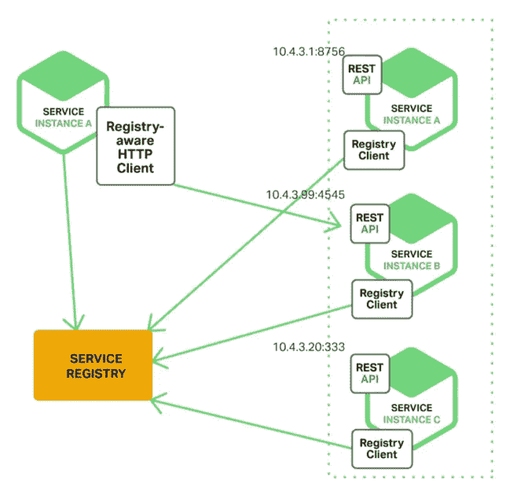

# 面向 1 到 3 年经验丰富的程序员的 35 个 Java 面试问题

> 原文：<https://medium.com/javarevisited/top-10-java-interview-questions-for-3-to-4-years-experienced-programmers-c4bf6d8b5e7b?source=collection_archive---------0----------------------->

这里列出了一些有用的 Java 面试问题，供有 2 到 5 年经验的 Java 程序员参考。作为一名经验丰富的开发人员，您应该了解 OOP 概念、Java 基础知识、 **Java 集合框架**、Java 5 和 6 中引入的多线程和并发实用程序、调试 Java 应用程序、算法和数据…