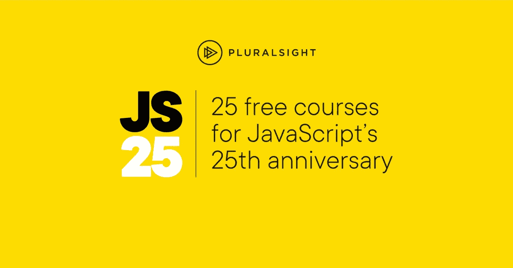
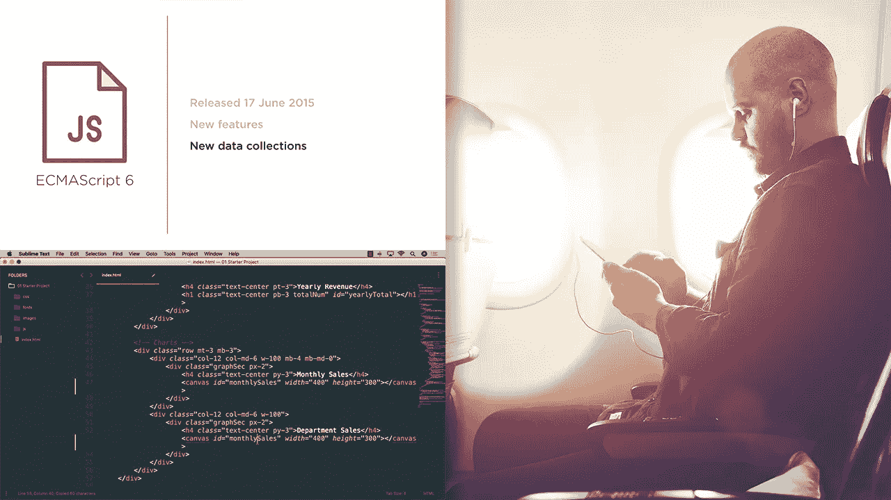
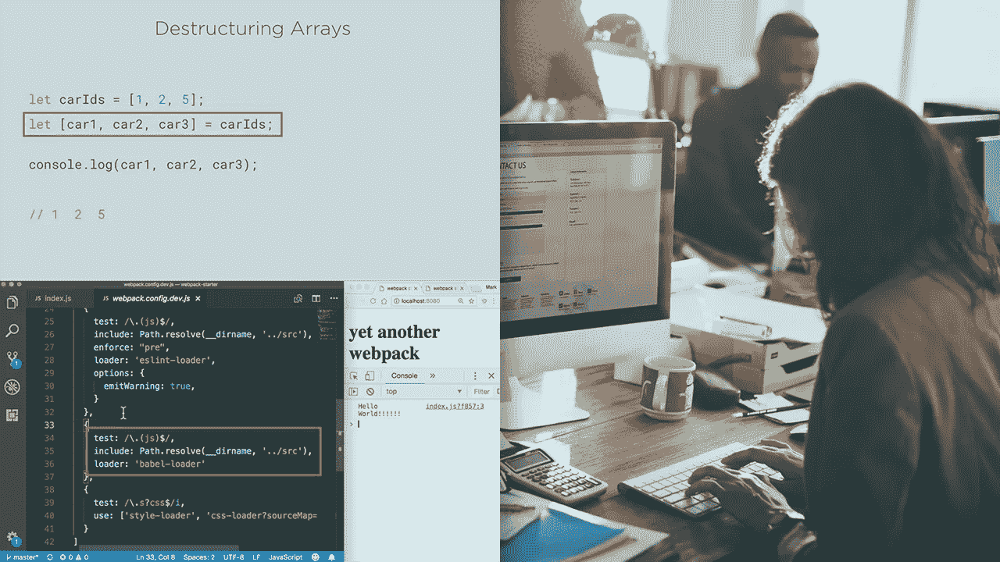
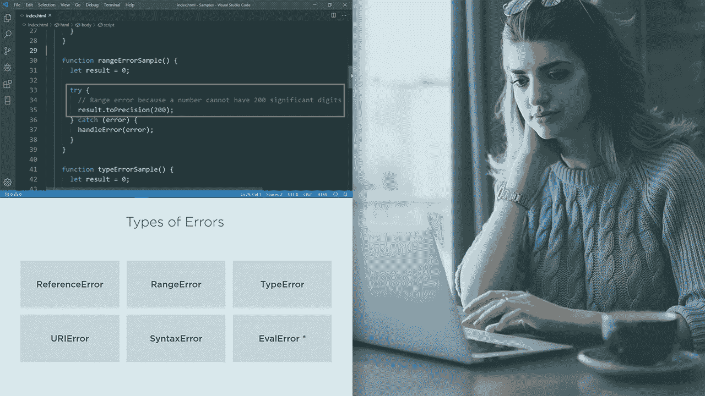
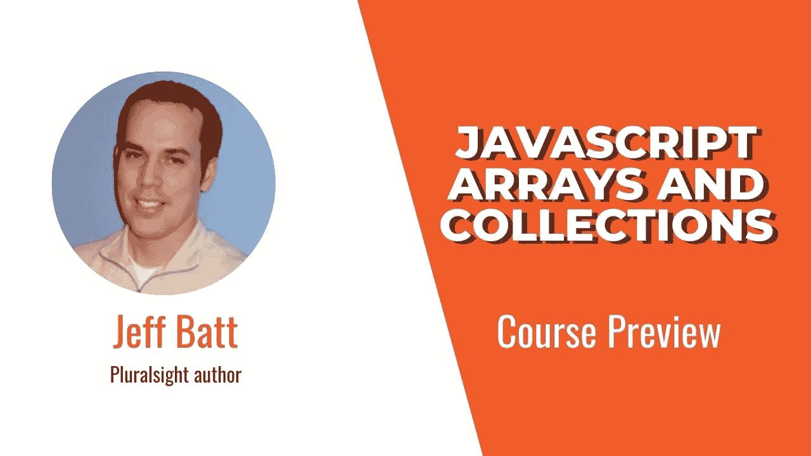
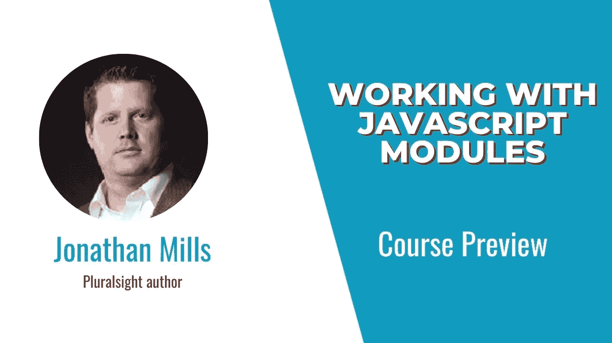
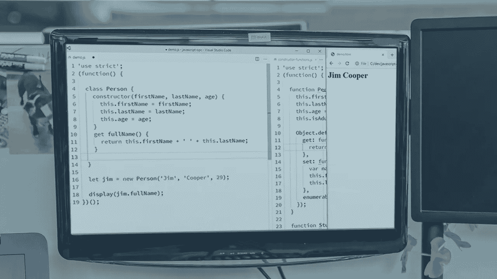
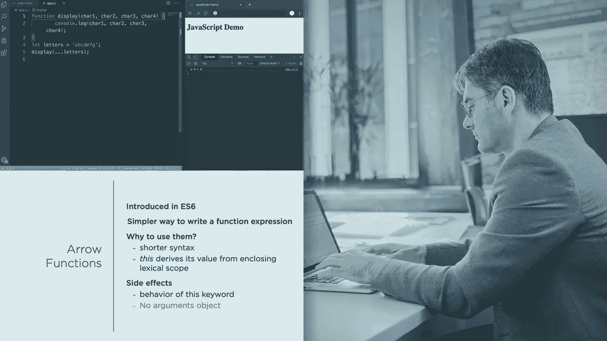
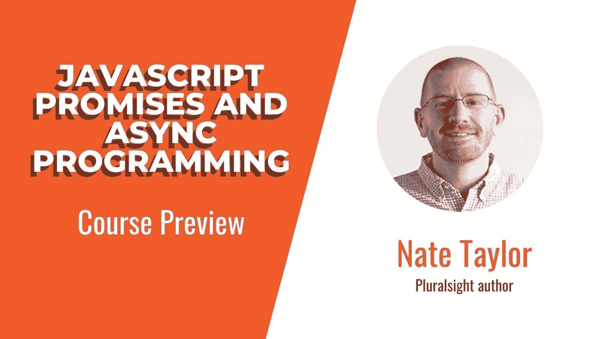
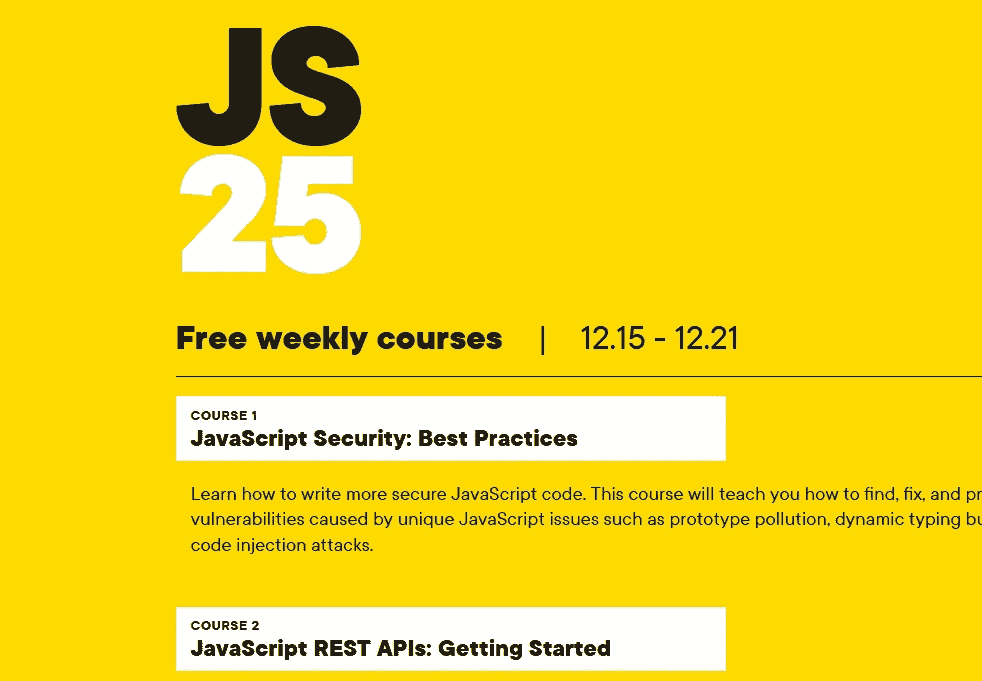

# 面向初学者和有经验者的 10 个最佳 JavaScript 和 Web 开发课程

> 原文：<https://medium.com/javarevisited/top-10-javascript-courses-from-pluralsight-to-learn-in-2021-26352abe4fcd?source=collection_archive---------3----------------------->

## Pluralsight 还提供 JS 25，你可以免费获得 Pluralsight 的 25 门 JavaScript 课程。每周 5 节免费的 JavaScript 课程。

大家好，如果你正在学习 JavaScript 并在 Pluralsight 上寻找最好的 JavaScript 课程，那么你来对地方了。在过去，我已经分享了 [**最佳 JavaScript 课程**](/javarevisited/10-best-online-courses-to-learn-javascript-in-2020-af5ed0801645) 和[书籍](/javarevisited/5-best-javascript-books-for-beginners-and-experienced-web-developers-2c6353d1cc85)，但与此同时，我收到了许多来自 Pluralsight 的关于最佳 JavaScript 课程的查询？

如果你是 Pluralsight 会员，你应该参加哪些在线课程，或者只是 Pluralsight 上针对初学者和高级 web 开发人员的最佳 JavaScript 课程。

我已经分享了 Pluralsight 的[最佳 React.js 课程](https://javarevisited.blogspot.com/2020/08/top-10-pluralsight-courses-to-learn-React.js.html)和[最佳 Java 和 web 开发课程](https://javarevisited.blogspot.com/2017/12/top-10-pluralsight-courses-java-and-web-developers.html)，现在我要写的是你可以在 Pluralsight 上学习的*最佳 Javascript 课程*。

我在这里列出的课程不仅仅是为了这个周末，也是为了这个周末以后，你可以随时带着它们深入学习 JavaScript。

所以像许多其他人一样，如果你正在学习 JavaScript 并填补你的知识空白，或者想让你的技能更上一层楼，这些来自 Pluralsight 的 [JavaScript 课程一定会帮助你。

你也可以使用这个列表在周末**学习 JavaScript**，因为我将列出从初学者到中级到高级的课程，这样你就可以有一个平稳的学习进度。](https://www.java67.com/2020/08/top-10-pluralsight-courses-to-learn-JavaScript.html)

# 2022 年面向初学者的 10 门最佳 JavaScript 和 Web 开发课程

无论如何，不要再浪费你的时间了，这里有一个来自 Pluralsight 的最好的 JavaScript 课程列表。你可以利用这些课程在这个周末学习 JavaScript，或者你可以在方便的时候以 Pluralsight 会员的身份观看。

## 1. [JavaScript 编程基础知识](https://pluralsight.pxf.io/c/1193463/424552/7490?u=https%3A%2F%2Fwww.pluralsight.com%2Fcourses%2Fjavascript-programming-basics)

这是 JavaScript 初学者最好的 Pluralsight 课程之一。如果你不知道什么是 JavaScript，为什么你应该学习它，那就参加这个课程。

Kyle Simpson 的《JavaScript anything》非常好，他的课程帮助我了解了很多关于 JavaScript 语言的知识，这是开始你的 JavaScript 之旅的一个很好的课程。

**这里是加入这个在线课程的链接**——[JavaScript 编程基础](https://pluralsight.pxf.io/c/1193463/424552/7490?u=https%3A%2F%2Fwww.pluralsight.com%2Fcourses%2Fjavascript-programming-basics)

## 2. [JavaScript:入门](https://pluralsight.pxf.io/c/1193463/424552/7490?u=https%3A%2F%2Fwww.pluralsight.com%2Fcourses%2Fjavascript-getting-started)

如果您刚刚开始学习 JavaScript，这是 Pluralsight 上的另一个很好的课程。由 Mark Zamoyta 创建的这门 Pluralsight JavaScript 课程将通过大量的实践来教授您所需的核心基础知识。

以下是您将在本课程中学到的重要知识:

*   你能用 JavaScript 构建什么样的应用程序
*   语言的 JavaScript 编程基础
*   如何建立一个现代的，反应灵敏的网页？

因此，如果你是 JavaScript 编程语言的新手，从 Kyle Simpson 以前的课程或本课程开始你的旅程，两者都很好。

**这里是加入这个 Java 初学者课程的链接** — [JavaScript:入门](https://pluralsight.pxf.io/c/1193463/424552/7490?u=https%3A%2F%2Fwww.pluralsight.com%2Fcourses%2Fjavascript-getting-started)

## 3. [JavaScript:语法和操作符](https://pluralsight.pxf.io/c/1193463/424552/7490?u=https%3A%2F%2Fwww.pluralsight.com%2Fcourses%2Fjavascript-syntax-operators)

这是 Pluralsight 上的另一个初级 JavaScript 课程。如果您已经做过一些 JavaScript 编程并了解基础知识，这是一门很好的课程，可以通过一些实践来学习 JavaScript 语法和操作符。本课程由 Paul D. Sheriff 创建，他是一位拥有 30 多年经验的技术爱好者。

这就是你要学的东西:

*   JavaScript 语法
*   JavaScript 异常处理
*   javascript 运算符

虽然这仍然是一门初级的 JavaScript 课程，但是获得一些关于 JavaScript 编程基础的实践是很好的。

**这里是加入本课程的链接**——[JavaScript:语法和运算符](https://pluralsight.pxf.io/c/1193463/424552/7490?u=https%3A%2F%2Fwww.pluralsight.com%2Fcourses%2Fjavascript-syntax-operators)

## 4. [JavaScript:变量和类型](https://pluralsight.pxf.io/c/1193463/424552/7490?u=https%3A%2F%2Fwww.pluralsight.com%2Fcourses%2Fjavascript-variables-types)

本课程是之前关于 Pluralsight 的 JavaScript 课程的延续，它们是关于 [Pluralsight](/javarevisited/top-10-pluralsight-courses-to-learn-programming-and-software-development-during-covid-19-stay-at-30b7d8a4f88f) 的 JavaScript 学习路线的一部分。在本课程中，您将通过变量和类型(JavaScript 中的核心数据)提高您的 JavaScript 技能。以下是你将在本课程中学到的东西

*   如何在 JavaScript 程序中使用变量
*   如何使用文字和赋值
*   如何使用基本类型，如字符串、数字、布尔值等

完成本课程后，您将对 JavaScript 变量和类型有一个坚实的理解，这对于编写真实世界的 JavaScript 代码非常非常重要。

**这里是加入本课程** — [JavaScript:变量和类型](https://pluralsight.pxf.io/c/1193463/424552/7490?u=https%3A%2F%2Fwww.pluralsight.com%2Fcourses%2Fjavascript-variables-types)的链接

## 5. [JavaScript:数组和集合](https://pluralsight.pxf.io/c/1193463/424552/7490?u=https%3A%2F%2Fwww.pluralsight.com%2Fcourses%2Fjavascript-arrays-collections)

这是另一个很棒的面向初学者的 JavaScript 课程。由 Jeff Batt 创建的这个课程将教你数组和集合的基础知识。您还将了解 ES 6 和更高阶的数组方法，如 [map](/javarevisited/how-to-use-streams-map-filter-and-collect-methods-in-java-1e13609a318b) 、 [filter](https://www.java67.com/2016/08/java-8-stream-filter-method-example.html) 、forEach，这些方法对于在 JavaScript 中处理数据非常重要。

以下是你将在本课程中学到的东西:

*   如何使用高级数组方法
*   如何探索使用独特的数据集
*   如何用映射存储键和值对

本课程还将向您介绍如何使用集合和地图以及类型化数组，以便您可以轻松地在具有更多功能的 web 应用程序中存储和处理数据。

**这是加入本课程的链接**——[JavaScript:数组和集合](https://pluralsight.pxf.io/c/1193463/424552/7490?u=https%3A%2F%2Fwww.pluralsight.com%2Fcourses%2Fjavascript-arrays-collections)

## 6.[使用 JavaScript 模块](https://pluralsight.pxf.io/c/1193463/424552/7490?u=https%3A%2F%2Fwww.pluralsight.com%2Fcourses%2Fworking-javascript-modules)

JavaScript 的核心是对模块的透彻了解，除了这门课之外，没有多少课程关注 JavaScript 模块。本课程由 Jonathan Mills 创建，将教你如何使用模块将你的代码分解成易于管理的部分。以下是你将在本课程中学到的东西

*   什么是 JavaScript 模块，为什么要使用它们。
*   如何从 JavaScript 模块导入和导出代码？
*   如何在真实的应用程序中使用模块？

在编写 web 应用程序时，JavaScript 代码可能会很快变得难以维护和理解，掌握好模块知识将有助于这一点。

完成本课程后，您将掌握 JavaScript 模块的基础知识，这将有助于您构建更易于维护的 JavaScript 应用程序。

**这是加入本模块课程** — [使用 JavaScript 模块](https://pluralsight.pxf.io/c/1193463/424552/7490?u=https%3A%2F%2Fwww.pluralsight.com%2Fcourses%2Fworking-javascript-modules)的链接

## 7. [JavaScript 对象、原型和类](/javarevisited/top-10-pluralsight-courses-to-learn-programming-and-software-development-during-covid-19-stay-at-30b7d8a4f88f?source=---------11------------------)

除了数组、集合和模块，对象、原型和类在 javascript 应用程序中被广泛使用，对于任何 JavaScript 开发人员来说，掌握这些核心概念的知识都是必不可少的。

由 Jim Cooper 创建的这门课程将让你深入了解在创建对象和使用[继承](https://javarevisited.blogspot.com/2012/10/what-is-inheritance-in-java-and-oops-programming.html)时原型在幕后发生了什么。

这里是你要学习的东西:

*   创建对象和属性的不同方法
*   修改属性描述符、使用构造函数、getters 和 setters 等等
*   如何使用类创建对象和处理继承

完成本课程后，您将掌握创建强大且结构良好的应用程序所需的 JavaScript 对象、原型和类的技能和知识，这些应用程序可以利用 JavaScript 的动态能力。

**这是加入本课程的链接**——[JavaScript 对象、原型和类](/javarevisited/top-10-pluralsight-courses-to-learn-programming-and-software-development-during-covid-19-stay-at-30b7d8a4f88f?source=---------11------------------)

## 8. [JavaScript:函数](https://www.java67.com/2020/10/best-javascript-courses-for.html)

JavaScript 代码很难维护，尤其是当您在几个月甚至几年的时间里不断向项目添加新特性的时候。如果您不小心，您可能会得到杂乱无章的代码，其中项目的几个部分实际上在执行相同的任务(复制-粘贴和复制代码)，并且一个功能的任何更改都可能导致代码的其他几个部分的更改。这个课程通过教你如何创建模块化的、可读性更强的代码，来提供如何处理这种情况的方法。

以下是你将学到的关键知识:

*   JavaScript 函数基础
*   JavaScript 中的**箭头函数**是什么，它是如何提高可读性的？
*   如何编写多个函数相互交互的 JavaScript 代码？

完成本课程后，您将掌握用 JavaScript 编写模块化、可重用且简洁的代码所需的技能和知识。

**以下是加入本课程的链接** — [JavaScript:函数](https://www.java67.com/2020/10/best-javascript-courses-for.html)

## 9. [JavaScript:承诺和异步编程](/javarevisited/10-best-online-courses-to-learn-javascript-in-2020-af5ed0801645)

异步编程是 JavaScript 编程最强大的特性之一，但同时也很难掌握。由 Nate Taylor 创建的这门课程揭开了 JavaScript 中异步编程的神秘面纱，并提供了对它的深入理解。

以下是你在本课程中学到的东西

*   如何在 JavaScript 中消费承诺
*   如何用 JavaScript 创建自己的承诺
*   如何在 JavaScript 中使用 async 和 await

完成本课程后，您将具备处理异步代码所需的 JavaScript 承诺的必要技能和知识。

**这是加入高级 JavaScript 课程** — [JavaScript:承诺和异步编程](/javarevisited/10-best-online-courses-to-learn-javascript-in-2020-af5ed0801645)的链接

## 10.[高级 JavaScript](https://www.java67.com/2020/10/best-javascript-courses-for.html)

这是 Pluralsight 上的另一个 JavaScript 高级课程。本课程由本列表中第一门课程的讲师凯尔·辛普森创建。

本课程面向有经验的 JavaScript 开发人员或任何想要深入学习 JavaScript 的人。

您可以参加本课程，深入了解 JavaScript 如何在浏览器中编译、优化和执行的核心机制。

**这里是加入这个 JavaScript 课程**——[高级 JavaScript](https://www.java67.com/2020/10/best-javascript-courses-for.html) 的链接

## 11.JavaScript:好的部分

这是一个有点老的球场，但我想在这里提到它，因为它有点独特。JavaScript 有不好的部分，很多时候掩盖了它好的部分，这就是你在这门课中学到的。

道格拉斯声称 JavaScript 拥有任何编程语言中最好的部分。他解释了为什么要上这门课，测试了函数式编程，并在课程的最后一堂课中讲述了单子。

**这里是加入这个 JavaScript 在线课程**——[JavaScript:精彩部分](https://pluralsight.pxf.io/c/1193463/424552/7490?u=https%3A%2F%2Fwww.pluralsight.com%2Fadvanced-javascript)的链接

如果你喜欢书，道格拉斯也写了一本同名的书[**JavaScript:The Good Parts**](https://www.amazon.com/JavaScript-Good-Parts-Douglas-Crockford/dp/0596517742?tag=javamysqlanta-20)，这是最值得推荐的 JavaScript 书籍之一。

<https://www.amazon.com/JavaScript-Good-Parts-Douglas-Crockford/dp/0596517742?tag=javamysqlanta-20>  

# Pluralsight 的 25 门免费 JavaScript 课程

而且，最棒的是，Pluralsight 还推出了 JS 25，在 JavaScript 完成 25 周年之际，你可以免费获得 Pluralsight 的 25 门 JavaScript 课程。

每周他们都会发布 5 门免费的 JavaScript 课程，你可以用它们来掌握不同的 JavaScript 领域，比如安全性、对象、模块等等。这些课程真的很好，你可以查看完整的课程表和课程列表[这里](https://pluralsight.pxf.io/c/1193463/424552/7490?u=https%3A%2F%2Fwww.pluralsight.com%2Foffer%2Ffree-tech-skills)

以上是关于在 Pluralsight 上学习 JavaScript 的一些**最佳课程。如果你是一名程序员或软件开发人员，我强烈推荐你获得一个 [**Pluralsight 会员资格**](https://pluralsight.pxf.io/c/1193463/424552/7490?u=https%3A%2F%2Fwww.pluralsight.com%2Flearn) ，这是你在学习中所能做的最好投资。**

我相信，你不会后悔你的决定。它也是你可以送给你的程序员丈夫/妻子以及热爱[编程](/javarevisited/7-best-coding-course-to-learn-programming-with-zero-experience-in-2020-52f7d0d9cb80)、[编码](/javarevisited/top-20-sites-to-learn-coding-in-2020-f57ff63d9cb3)和 web 技术的朋友的最好礼物之一。

面向 JavaScript 和 Web 开发人员的其他**开发资源**

*   [2022 年网络开发者路线图](https://javarevisited.blogspot.com/2019/02/the-2019-web-developer-roadmap.html)
*   [2022 年学习 Angular 的十大课程](/javarevisited/10-courses-to-learn-angular-for-web-development-6da1bd2856dc)
*   [Java 和 Web 开发人员应该学习的 10 个框架](https://javarevisited.blogspot.com/2018/01/10-frameworks-java-and-web-developers-should-learn.html)
*   为有经验的开发者提供的 10 门免费 Java 课程
*   [5 门免费课程学习芯泉和 Spring Boot](http://www.java67.com/2017/11/top-5-free-core-spring-mvc-courses-learn-online.html)
*   [我最喜欢的学习 GraphQL 的课程](/javarevisited/top-5-graphql-tutorials-and-courses-for-beginners-fb5543506fc2)
*   [2022 年学习 Docker 的 10 门免费课程](http://www.java67.com/2018/02/5-free-docker-courses-for-java-and-DevOps-engineers.html)
*   [2022 年 React JS 开发者路线图](https://hackernoon.com/the-2018-react-js-roadmap-4d0a43814c02)
*   [面向 DevOps 工程师的五大免费 Kubernetes 课程](https://javarevisited.blogspot.com/2019/01/top-5-free-kubernetes-courses-for-DevOps-Engineer.html#axzz5d2bEyYmv)
*   [2022 年学习 Maven 和 Jenkins 的 5 门免费课程](http://www.java67.com/2018/02/6-free-maven-and-jenkins-online-courses-for-java-developers.html)
*   [面向程序员的 2022 年 DevOps 路线图](https://javarevisited.blogspot.com/2018/09/the-2018-devops-roadmap-your-guide-to-become-DevOps-Engineer.html)
*   [Web 开发人员应该知道的 10 个 JavaScript 框架](http://www.java67.com/2019/01/top-10-javascript-frameworks-and-libraries-for-web-developers.html)
*   [在线学习的 5 门最佳 React.js 课程](/javarevisited/5-best-react-js-books-for-beginners-and-experienced-web-developers-e7b90b1ab9d2)
*   [2022 年学习 React Native 的五大课程](/@javinpaul/top-5-react-native-courses-for-mobile-application-developers-b82febdf8a46?source=---------112------------------)
*   [5 本最适合初学者的 React.js 书籍](/javarevisited/5-best-react-js-books-for-beginners-and-experienced-web-developers-e7b90b1ab9d2)
*   [学习 React 钩子和上下文 API 的 10 门免费课程](/javarevisited/top-10-free-courses-to-learn-react-js-c14edbd3b35f)

感谢您阅读本文。如果你喜欢 Pluralsight 的这些*最好的 JavaScript 和 Web 开发课程，那么请与你的朋友和同事分享。如果您有任何问题或反馈，请留言。*

如果你还在考虑 Pluralsight 会员资格是否值得，那么我建议你报名参加他们 [**的这个免费周末 10 天免费试用**](https://pluralsight.pxf.io/c/1193463/424552/7490?u=https%3A%2F%2Fwww.pluralsight.com%2Flearn) 并查看这些课程。

<https://pluralsight.pxf.io/c/1193463/424552/7490?u=https%3A%2F%2Fwww.pluralsight.com%2Flearn> 