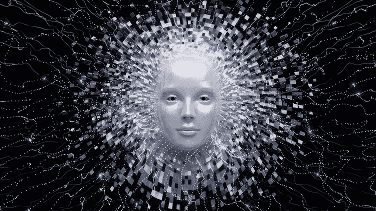
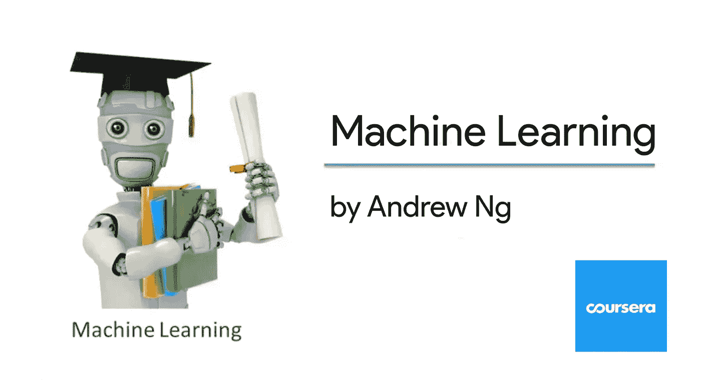
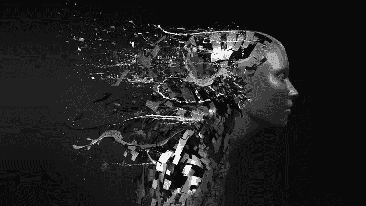
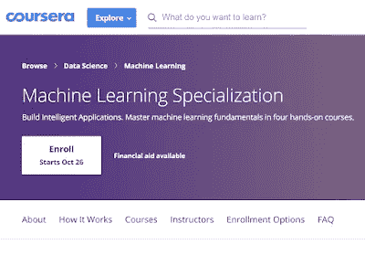
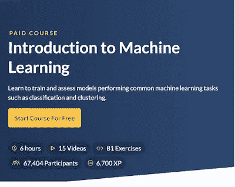
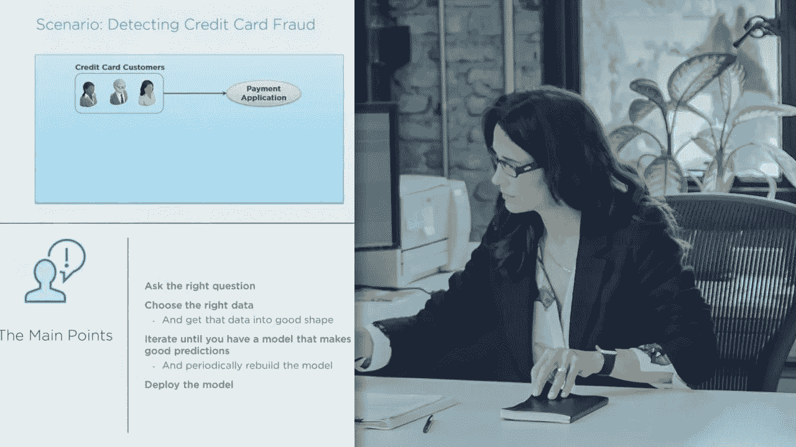
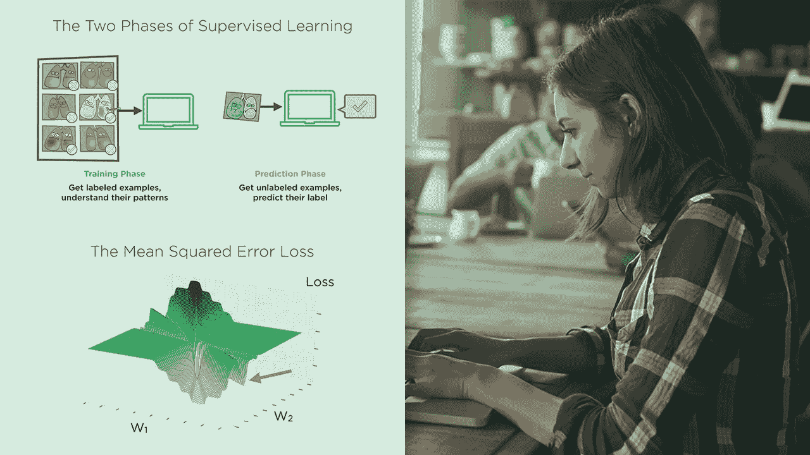
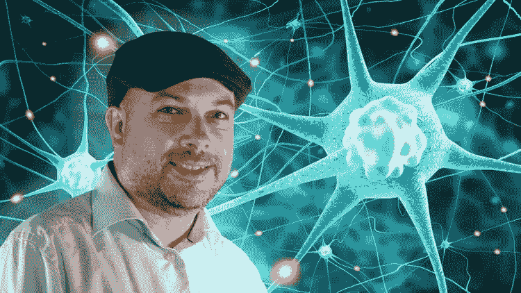

# 2023 年 10 大最佳机器学习课程和认证

> 原文：<https://medium.com/javarevisited/top-10-machine-learning-and-data-science-certifications-and-training-courses-for-beginners-and-a6308497b764?source=collection_archive---------0----------------------->

如果你的目标是在 2023 年学习机器学习，并寻找最好的机器学习在线课程，那么你来对地方了。在过去，我已经分享了 [**免费的数据科学课程**](/javarevisited/my-favorite-data-science-and-machine-learning-courses-from-coursera-udemy-and-pluralsight-eafc73acc73f) ，在这篇文章中，我将分享 2023 年初学者学习的绝对最好的机器学习课程。

如果你今天在技术领域工作，就像你是一名程序员或软件工程师，那么我肯定你听说过像[数据科学](https://javarevisited.blogspot.com/2018/03/top-5-data-science-and-machine-learning-online-courses-to-learn-online.html)、[机器学习](https://javarevisited.blogspot.com/2018/10/top-8-python-libraries-for-data-science-machine-learning.html)、[深度学习](https://javarevisited.blogspot.com/2019/08/top-5-courses-to-learn-deep-learning.html)、[人工智能](https://javarevisited.blogspot.com/2019/10/top-5-courses-to-learn-artificial-intelligence-AI.html)等术语。

它们是影响每一个行业的最新技术，就像它第一次出现时一样。不管你是为银行或保险部门、航空航天或国防部门工作，所有领域都受到了 It 的影响，在不久的将来，它们将受到机器学习和人工智能的影响。

这就是为什么在 2023 年学习数据科学和机器学习很重要，如果你正在寻找一些像课程和认证这样的好资源，那么你来对地方了。

在本文中，我分享了来自 [Coursera](https://coursera.pxf.io/c/3294490/1164545/14726?u=https%3A%2F%2Fwww.coursera.org%2F) 、 [Udemy](https://javarevisited.blogspot.com/2019/10/udemy-vs-pluralsight-review-which-is-better-to-learn-code.html) 、 [Pluralsight](https://javarevisited.blogspot.com/2019/10/pluralsight-vs-codecademy-which-is-best-online-learning-platform.html) 、 [DataCamp](/javarevisited/10-best-and-free-datacamp-courses-to-learn-python-and-data-skills-in-2021-39e42682fd76) 、 [Udacity](https://imp.i115008.net/c/3294490/786224/11298?u=https%3A%2F%2Fwww.udacity.com%2F) 等平台的最佳机器学习认证。其中一些是免费的，但是如果你需要认证的话，大部分是需要付费的。

如果你在疑惑什么是机器学习？让我给你一个简单的概述。机器学习就是训练机器来完成这项工作，这在以前只有人类才能做到，例如，看到一张照片并识别出汽车、人或黄瓜等物体是什么。

是的，日本有一个程序员已经用 [TensorFlow](https://hackernoon.com/top-5-tensorflow-and-ml-courses-for-programmers-8b30111cad2c) ，一个机器学习库筛选出了最好的黄瓜，由于他父母多年的黄瓜种植经验，这只能由他们来完成。有很多这样的故事告诉我们机器学习和人工智能的力量，这就是为什么越来越多的计算机科学毕业生、程序员，甚至专家工程师正在了解[人工智能](/javarevisited/7-best-courses-to-learn-artificial-intelligence-in-2020-26d59d62f6fe)、[机器学习](/javarevisited/top-10-resources-to-learn-data-science-and-machine-learning-best-of-lot-f153e1f44e89)和[深度学习](https://hackernoon.com/10-machine-learning-data-science-and-deep-learning-courses-for-programmers-7edc56078cde)。这与 20 世纪 80 年代的游戏革命非常相似，当时程序员通过编写一个简单的游戏，如越狱、俄罗斯方块，甚至动画角色，都会感到兴奋。如今，计算机科学毕业生对编写能够识别图像或手势中的对象的程序感到兴奋。

这就是为什么我建议每个程序员学习人工智能、数据科学、深度学习。[机器学习](https://javarevisited.blogspot.com/2018/10/data-science-and-machine-learning-courses-using-python-and-R-programming.html)是当今一些最酷的技术创新的背后，与流行的看法相反；然而，要成功应用机器学习，你不需要成为数学天才。从职业的角度来看，这也很重要，因为今天的许多工作在未来都将被机器取代。如果你拥有这些技能，你将更有可能在这个领域找到新的技术工作，这些工作也很吸引人，而且利润丰厚。

作为一名面临任何现实世界问题的数据科学家，你首先需要确定机器学习是否能提供合适的解决方案数据科学家享受着薪酬最高的工作之一，平均工资 **$12 万，**根据 Glassdoor 和 Indeed 的数据，那只是平均水平！这不仅仅是为了钱，工作也很令人兴奋！

# 2023 年机器学习十大在线课程

机器学习有几门认证课程。我已经列出了一些顶级课程，大部分是免费的或者至少是负担得起的，这将帮助你成为一名 ML 专家。

本文列出的一些课程对于开启你在这个令人兴奋且快速发展的机器学习领域的旅程来说非常棒。但是，其他课程可以带你进入稍微高级一些的方面。

当然，这是艰苦的工作，但如果你愿意追求什么，你会发现成功和克服困难的方法。

总之，事不宜迟，这里列出了一些学习机器学习、数据科学、人工智能和深度学习的最佳课程:

## [1。机器学习 A-Z:数据科学实践 Python&R(Udemy 最佳课程)](https://click.linksynergy.com/fs-bin/click?id=JVFxdTr9V80&subid=0&offerid=323058.1&type=10&tmpid=14538&RD_PARM1=https%3A%2F%2Fwww.udemy.com%2Fmachinelearning%2F)

这是学习机器学习算法的课程之一。它将从两位数据科学专家那里教你如何用 Python 和 R 创建机器学习算法。这是一门实践课程，包含大量代码示例供您练习。

以下是您将在本培训课程中学到的关键技能:

*   如何在[Python](/swlh/5-free-python-courses-for-beginners-to-learn-online-e1ca90687caf)R 上掌握机器学习
*   如何建立稳健的机器学习模型
*   如何做出准确的预测
*   如何为你的企业创造强大的附加值
*   如何将机器学习用于个人目的
*   如何处理特定主题，如强化学习、 [NLP](https://www.java67.com/2020/07/top-5-courses-to-learn-natural-language-processing-NLP.html) 和深度学习
*   如何处理像 Dime 这样的高级技术

简而言之，学习用 Python 和 R 语言创建机器学习算法的最好的 Udemy 培训课程之一，来自两位数据科学专家基里尔·叶列缅科和哈德琳·德·庞特维斯，他们也是令人敬畏的导师。

**这里是加入本课程的链接** — [机器学习 A-Z:数据科学中的动手 Python&R](https://click.linksynergy.com/fs-bin/click?id=JVFxdTr9V80&subid=0&offerid=323058.1&type=10&tmpid=14538&RD_PARM1=https%3A%2F%2Fwww.udemy.com%2Fmachinelearning%2F)

## 2.[吴恩达的机器学习](https://coursera.pxf.io/c/3294490/1164545/14726?u=https%3A%2F%2Fwww.coursera.org%2Flearn%2Fmachine-learning) (Coursera 最佳课程)

这大概就是人工智能和人工智能先驱吴恩达和斯坦福大学教授的流行的机器学习认证，其中也包括认证。

您将在本课程中学习的每一个主题上接受测试，根据完成情况和您获得的最终分数，您将获得证书。

这门[课程](https://click.linksynergy.com/fs-bin/click?id=JVFxdTr9V80&subid=0&offerid=467035.1&type=10&tmpid=18061&RD_PARM1=https%3A%2F%2Fwww.coursera.org%2Flearn%2Fmachine-learning)确实为你作为开发者增加了价值，让你很好地理解你提出的所有机器学习算法背后的数学原理。

我个人真的很喜欢这个。吴恩达用 Octave 带你完成这个课程，Octave 是一个很好的工具，可以在你的项目中使用它之前测试你的算法。

**这里是加入本课程的链接**——[吴恩达的机器学习(Coursera)](https://coursera.pxf.io/c/3294490/1164545/14726?u=https%3A%2F%2Fwww.coursera.org%2Flearn%2Fmachine-learning)

## [3。深度学习 A-Z:动手人工神经网络(Udemy)](https://click.linksynergy.com/fs-bin/click?id=JVFxdTr9V80&subid=0&offerid=323058.1&type=10&tmpid=14538&RD_PARM1=https%3A%2F%2Fwww.udemy.com%2Fdeeplearning%2F)

本课程将向两位机器学习和数据科学专家教授如何用 Python 创建深度学习算法。这也是一门顶级的实践课程，它将通过给出一些真实世界的例子来教你深度学习。

以下是您将在本课程中学到的重要内容:

*   理解人工神经网络背后的直觉
*   在实践中应用[人工神经网络](https://javarevisited.blogspot.com/2019/08/top-5-courses-to-learn-deep-learning.html)
*   理解卷积神经网络背后的直觉
*   在实践中应用卷积神经网络
*   理解递归神经网络背后的直觉

简而言之，这是一个很好的培训课程，可以从两位机器学习和数据科学专家那里学习用 Python 创建深度学习算法。包括模板。

**以下是加入本课程的链接** — [深度学习 A-Z:动手操作人工神经网络(Udemy)](https://click.linksynergy.com/fs-bin/click?id=JVFxdTr9V80&subid=0&offerid=323058.1&type=10&tmpid=14538&RD_PARM1=https%3A%2F%2Fwww.udemy.com%2Fdeeplearning%2F)

## 4.[uda city 机器学习简介(免费)](https://imp.i115008.net/c/1193463/786224/11298?u=https%3A%2F%2Fwww.udacity.com%2Fcourse%2Fintro-to-machine-learning--ud009app)

这门课程提供你机器学习的理论和实践。这门课最棒的一点是它是由塞巴斯蒂安教授的。那么，是的，你猜对了，自动驾驶汽车背后的男人。

这门课程当然让机器学习变得更加有趣。它也给你用 [Python](https://javarevisited.blogspot.com/2018/05/10-reasons-to-learn-python-programming.html) 编程的经验。这也是一门免费的课程，尽管不会颁发证书。

如果需要认证，之前的课程更好，但我也推荐这个，因为很刺激。

**这里是加入本课程的链接** — [机器学习简介](https://imp.i115008.net/c/1193463/786224/11298?u=https%3A%2F%2Fwww.udacity.com%2Fcourse%2Fintro-to-machine-learning--ud009app)

## 5.[Courser 的机器学习专业化](https://coursera.pxf.io/c/3294490/1164545/14726?u=https%3A%2F%2Fwww.coursera.org%2Fspecializations%2Fmachine-learning) a

这是最近在 [Coursera](https://javarevisited.blogspot.com/2019/10/top-5-coursera-professional-certificates-for-programmers-IT-professionals.html) 增加的关于机器学习的认证课程之一。这门关于机器学习专门化的课程实际上由六门课程组成。

它讨论构建机器学习应用，主要使用深度学习。对于那些想要超越传统机器学习方法的人来说，这是一门极好的课程。顺便说一句，这种完全专业化有点贵，354 美元。但是你将有机会完成一个顶点项目来结束这个课程。

**这里是加入本认证**——[机器学习专精](https://coursera.pxf.io/c/3294490/1164545/14726?u=https%3A%2F%2Fwww.coursera.org%2Fspecializations%2Fmachine-learning)的链接

或者，如果你觉得 Coursera 的课程有用，因为它们是由世界各地知名的公司和大学创建的，我建议你加入 Coursera 的订阅计划 **Coursera Plus**

这使您可以无限制地访问他们最受欢迎的课程、专业、专业证书和指导项目。它每年花费大约 399 美元，但是它完全物有所值，因为你可以获得无限的证书。

<https://coursera.pxf.io/c/3294490/1164545/14726?u=https%3A%2F%2Fwww.coursera.org%2Fcourseraplus>  

## 6.[data camp 机器学习简介](https://datacamp.pxf.io/c/1193463/1012793/13294?u=https%3A%2F%2Fwww.datacamp.com%2Fcourses%2Fintroduction-to-machine-learning-with-r)

这个关于机器学习的认证课程最适合 R 专业人士。它期望你事先有关于 [R 编程语言](https://becominghuman.ai/top-5-free-courses-to-learn-r-programming-for-data-science-and-statistics-in-2020-305bf1c6f24e?source=collection_home---4------0-----------------------)的工作知识。

本课程专注于传授使用机器学习有效训练模型的有用知识。

课程内容互动有趣，部分内容免费。不过，在几个免费模块之后，整个课程每月 25 美元。

顺便说一句，如果你想学习 R 编程，也可以看看这份[免费 R 编程课程列表](https://hackernoon.com/5-free-r-programming-courses-for-data-scientists-and-ml-programmers-5732cb9e10)。

## 7.[通过复数视觉理解机器学习](https://pluralsight.pxf.io/c/1193463/424552/7490?u=https%3A%2F%2Fwww.pluralsight.com%2Fcourses%2Fpython-understanding-machine-learning)

本课程提供了对该主题的简短介绍，仅假设有基本的 IT 背景。如果你一直在寻找进入这个关键话题的方法，这就是你的课程。需要简短、清晰的机器学习介绍？看这个。

顺便说一句，你需要一个 [**多视会员**](http://pluralsight.pxf.io/c/1193463/424552/7490?u=https%3A%2F%2Fwww.pluralsight.com%2Flearn) 才能进入这个课程，费用大约每月 29 美元或每年 299 美元。我有一个，我也建议所有开发人员都有这个计划，因为 Pluralsight 就像软件开发人员的网飞。

拥有超过 5000+所有最新主题的优质课程。因为我们程序员每天都要学习新的东西，所以 299 美元的投资是不错的。顺便说一下，它还提供了一个 [**10 天免费试用**](http://pluralsight.pxf.io/c/1193463/424552/7490?u=https%3A%2F%2Fwww.pluralsight.com%2Flearn) 没有任何义务，可以让你观看 200 小时的内容。您可以通过注册试用免费观看本课程。

**这里是加入本课程** — [通过 Pluralsight 了解机器学习](https://pluralsight.pxf.io/c/1193463/424552/7490?u=https%3A%2F%2Fwww.pluralsight.com%2Fcourses%2Fpython-understanding-machine-learning)的链接

## 8.[用于数据科学和机器学习的 Python 训练营](https://click.linksynergy.com/fs-bin/click?id=JVFxdTr9V80&subid=0&offerid=323058.1&type=10&tmpid=14538&RD_PARM1=https%3A%2F%2Fwww.udemy.com%2Fpython-for-data-science-and-machine-learning-bootcamp%2F)

这是另一个关于数据科学和机器学习的好课程，它将教授如何使用 NumPy、Pandas、Seaborn、Matplotlib、Plotly、Scikit-Learn、[机器学习](https://becominghuman.ai/top-10-courses-to-learn-tensorflow-for-machine-learning-in-2020-39a31e7cd84b)、 [Tensorflow](https://becominghuman.ai/top-10-courses-to-learn-tensorflow-for-machine-learning-in-2020-39a31e7cd84b) 等等。

最适合软件开发人员，或者希望过渡到利润丰厚的数据科学职业道路的程序员，或者金融或其他非科技行业中希望过渡到科技行业的[数据分析师](https://javarevisited.blogspot.com/2019/10/top-5-courses-to-learn-pandas-for-data-analysis-python.html)可以使用这门课程来学习如何使用代码而不是工具来分析数据。但是，你需要一些编码或脚本方面的经验才能成功。

**这里是加入本课程的链接**——[Python 数据科学和机器学习训练营](https://click.linksynergy.com/fs-bin/click?id=JVFxdTr9V80&subid=0&offerid=323058.1&type=10&tmpid=14538&RD_PARM1=https%3A%2F%2Fwww.udemy.com%2Fpython-for-data-science-and-machine-learning-bootcamp%2F)

## 9.[如何看待机器学习算法(Pluralsight)](https://pluralsight.pxf.io/c/1193463/424552/7490?u=https%3A%2F%2Fwww.pluralsight.com%2Fcourses%2Fmachine-learning-algorithms)

在本课程中，您将学习如何确定四种基本方法中的哪一种来解决问题:分类、回归、聚类或推荐。接下来，您将学习如何设置问题陈述、特征和标签。

最后，你会插上一个标准算法来解决问题。本课程结束时，您将具备识别机器学习应用机会并抓住它所需的技能和知识。

**以下是加入本课程的链接**——[如何看待机器学习算法(Pluralsight)](https://pluralsight.pxf.io/c/1193463/424552/7490?u=https%3A%2F%2Fwww.pluralsight.com%2Fcourses%2Fmachine-learning-algorithms)

## 10.[Python 中的数据可视化](https://gumroad.com/a/502068339)

如果你爱书胜过在线课程，并且正在寻找一些严肃的书来学习 Python 中的数据可视化，那么这是最适合你的书。

这本书由丹尼尔·尼尔森创作，适合初级和中级 Python 开发人员，并通过使用 [Pandas](https://javarevisited.blogspot.com/2019/10/top-5-courses-to-learn-pandas-for-data-analysis-python.html) 进行简单的数据操作来教你关键的可视化技能，涵盖了 Matplotlib 和 Seaborn 等核心绘图库，并向你展示如何利用 Altair 等声明性和实验性库。

以下是你将在本书中学到的关键技能:

我们将涵盖:

*   基于 Matplotlib 的库
*   [JavaScript 库](/javarevisited/7-best-online-courses-to-learn-d3-js-for-data-visualization-in-2020-1a8c79add4e4)
*   JSON 库
*   WebGL 库

这本书有 11 章，通篇涵盖了所有基本的机器学习 python 库，如 T2 熊猫、Matplotlib、Seaborn、Bokeh、Altair、Plotly、GGPlot、GeoPandas 和 VisPy。

这里是购买这本书的链接—[Python 中的数据可视化](https://gumroad.com/a/502068339)

## 11.[数据科学，深度学习，&用 Python 进行机器学习](https://click.linksynergy.com/fs-bin/click?id=JVFxdTr9V80&subid=0&offerid=323058.1&type=10&tmpid=14538&RD_PARM1=https%3A%2F%2Fwww.udemy.com%2Fdata-science-and-machine-learning-with-python-hands-on%2F)

如果你是一名程序员，希望进入这一令人兴奋的新职业轨道，或者是一名数据分析师，希望过渡到机器学习行业，那么这是最适合你的课程。本课程将向您传授现实世界中的行业数据科学家所使用的基本技术。

以下是您将在本培训课程中学到的关键技能—

*   如何用 Tensorflow 和 Keras 构建人工神经网络
*   如何使用深度学习对图像、数据和情感进行分类
*   如何使用线性回归、多项式回归和多元回归进行预测
*   用 MatPlotLib 和 Seaborn 实现数据可视化
*   如何用 Apache Spark 的 MLLib 实现大规模机器学习

简而言之，一个完整的动手机器学习教程，有数据科学，Tensorflow，人工智能，神经网络。非常感谢弗兰克·凯恩创建了这个课程。

以下是加入本课程的链接— [数据科学、深度学习、&使用 Python 的机器学习](https://click.linksynergy.com/fs-bin/click?id=JVFxdTr9V80&subid=0&offerid=323058.1&type=10&tmpid=14538&RD_PARM1=https%3A%2F%2Fwww.udemy.com%2Fdata-science-and-machine-learning-with-python-hands-on%2F)

这就是关于学习数据科学和机器学习课程的一些**最佳课程的全部内容**你可以参加这些课程，成为一名数据科学家或机器学习专家。除此之外，还有很多使用 R 编程语言和 Python 的免费资源。如果你愿意，你也可以看看这些免费的 R 课程。

其他有用的**数据科学和机器学习**资源

*   [2023 年学习 Python 的 5 大课程](http://javarevisited.blogspot.sg/2018/03/top-5-courses-to-learn-python-in-2018.html)
*   [免费学习 Python 编码的五大网站](https://javarevisited.blogspot.com/2019/09/5-websites-to-learn-python-for-free.html)
*   [5 门免费课程学习机器学习的 R 编程](http://www.java67.com/2018/09/top-5-free-R-programming-courses-for-Data-Science-Machine-Learning-Programmers.html)
*   [从零开始学习 Python 的前 5 本书](https://javarevisited.blogspot.com/2019/07/top-5-books-to-learn-python-in-2019.html)
*   [为了更好地学习，你可以做的 8 个 Python 项目](/@javinpaul/8-projects-you-can-buil-to-learn-python-in-2020-251dd5350d56)
*   [排名前五的数据科学和机器学习课程](https://hackernoon.com/top-5-data-science-and-machine-learning-course-for-programmers-e724cfb9940a)
*   [前 5 名张量流和机器学习课程](https://hackernoon.com/top-5-tensorflow-and-ml-courses-for-programmers-8b30111cad2c)
*   [8 大 Python 机器学习库](https://javarevisited.blogspot.com/2018/10/top-8-python-libraries-for-data-science-machine-learning.html)
*   [9 门学习 PyTorch、Keras、Sci-kit 和 MatPlotLib 的课程](https://becominghuman.ai/10-free-courses-to-learn-python-machine-learning-libraries-scikit-learn-numpy-pandas-keras-3c77ba1a6907)
*   2023 年程序员可以学习的 10 项技术
*   [2023 年学习 Python 的 5 门免费课程](http://www.java67.com/2018/02/5-free-python-online-courses-for-beginners.html)
*   [日本黄瓜农民如何使用深度学习和 TensorFlow](https://cloud.google.com/blog/products/gcp/how-a-japanese-cucumber-farmer-is-using-deep-learning-and-tensorflow)
*   [每个程序员都应该知道的 10 件事](https://javarevisited.blogspot.com/2019/01/10-things-every-programmer-and-software-engineer-should-know.html)

感谢您阅读本文。如果你觉得这些深度学习和机器学习课程有用，那么请分享给你的朋友和同事。如果您有任何问题或反馈，请留言。

**P. S.** —如果你决心学习数据科学和机器学习技能但负担不起这些在线培训课程，并且需要一些免费课程来学习 2023 年的机器学习，那么你也可以看看这个面向程序员的学习 [**机器学习算法、软件、深度学习**](http://bit.ly/2DNKMdZ) 。这是完全免费的，你只需要一个 Udemy 帐户就可以加入这个课程。

<http://bit.ly/2DNKMdZ> 