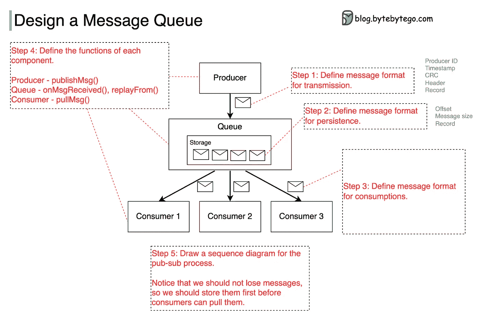
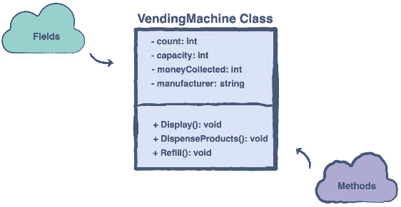
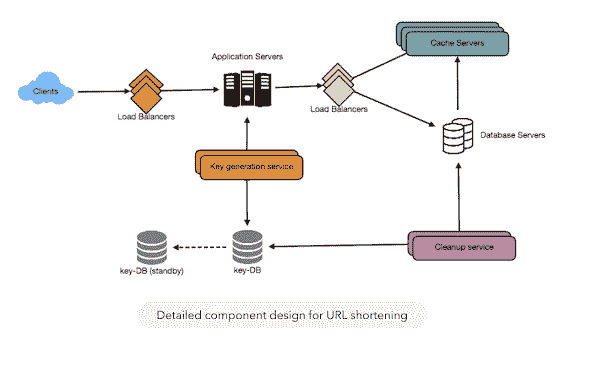
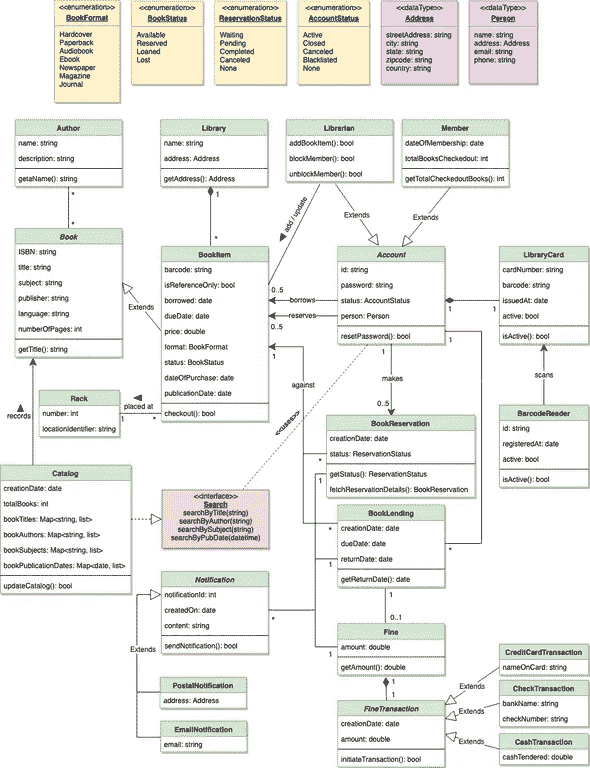

# 10 大面向对象的分析和设计面试问题和有经验的开发人员的问题

> 原文：<https://medium.com/javarevisited/top-10-object-oriented-analysis-and-design-interview-questions-and-problems-for-experienced-6c3a53b7cb26?source=collection_archive---------0----------------------->

## 在下一次编程工作面试之前，通过解决这些面向对象的设计问题来检查你的面向对象的分析和设计技能

测试候选人的面向对象的分析和设计技能在编程工作面试中很常见。像你如何设计自动售货机或交通控制系统这样的问题在面向对象编程语言面试中非常常见，像 [Java](https://www.java67.com/2018/02/5-online-courses-to-learn-java-9-better.html) 和 [C++](http://www.java67.com/2018/02/5-free-cpp-courses-to-learn-programming.html) 。设计一个软件系统需要良好的面向对象设计和分析工具的经验和知识。

你不仅应该擅长 OOP 基础，如抽象、继承、多态、封装、耦合、内聚、关联、聚合或组合，还应该精通几个关键的面向对象设计原则，如[面向对象设计的坚实原则](/javarevisited/10-oop-design-principles-you-can-learn-in-2020-f7370cccdd31)，这是编写灵活且可维护代码的基础。

对于设计一个可维护的软件或 Java 应用程序来说，知道什么时候使用一个接口上的类也是必不可少的。现在，问题是你如何发展这样的技能？你需要练习，努力练习。这就是我在这里分享一些 Java 编程访谈中常见的面向对象设计问题的原因。

反正软件设计有很多方面，面向对象的系统设计只是其中之一。有时，您可能会被要求为电子商务应用程序设计一个数据库。[数据库设计](/javarevisited/5-best-books-to-learn-sql-and-database-design-for-programmers-and-developers-1e7839df2f3e)与[面向对象设计](/javarevisited/my-favorite-courses-to-learn-object-oriented-programming-and-design-in-2019-197bab351733?source=---------103------------------)完全不同。在那里，你需要遵循灵活的、可维护的设计和标准化的规则。您需要确保您的表是第三范式，并且在重复数据和查询数据的容易性之间有一个很好的平衡。

顺便说一句，这个教程是关于面向对象系统设计的，我会分享这方面的问题。稍后我会写关于 SQL 和数据库设计的文章，给你更多的信息和一些练习题。

另一件要注意的事情是，现在网上有几门很好的课程，可以帮助你解决编码面试这个具有挑战性的问题。我试过 Educative 的 [**找系统设计面试**](https://www.educative.io/collection/5668639101419520/5649050225344512?affiliate_id=5073518643380224) 和 [**找面向对象设计面试**](https://www.educative.io/collection/5668639101419520/5692201761767424?affiliate_id=5073518643380224) 课程，不得不说他们准备得很好。这些课程是由谷歌、脸书、微软和亚马逊的招聘经理设计的。他们不仅有一套精心挑选的案例研究，这些案例在顶级科技公司被反复询问，而且还提供了处理不同面向对象设计场景的全面经验。

# 10 面向对象和软件设计面试问题和难题

下面是我在编程工作面试中经常被问到的面向对象和软件设计问题。你不仅会在亚马逊、谷歌、微软和脸书这样的大公司中发现这类问题，也会在 Infosys、Wipro、TCS 和 Cognizant 这样的小型初创公司和服务型公司中发现这类问题。

虽然要做全面的准备，我还是建议你看一下 [**Java 编程访谈曝光**](http://www.amazon.com/Java-Programming-Interviews-Exposed-Markham/dp/1118722868?tag=javamysqlanta-20) ，里面包含了所有重要 Java 话题的问题，像核心 Java、数据结构和算法、多线程、垃圾收集、JVM 内部机制，以及 Spring 和 Hibernate 等框架。

## 问题 1:用 Java 设计一台自动售货机([解决方案](http://javarevisited.blogspot.com/2016/06/design-vending-machine-in-java.html))

你需要设计一个遵循以下要求的自动售货机:
1。它应该接受 1、5、10、25、50 美分的硬币，即 1 便士、5 美分、10 美分、25 美分以及 1 美元和 2 美元的纸币

2.允许用户选择糖果(10)、零食(50)、坚果(90)、可乐(25)、百事可乐(35)、苏打水(45)等产品

3.允许用户通过取消请求获得退款。

4.返回所选产品和剩余的更改(如果有)

5.允许自动售货机供应商的重置操作

在寻找解决方案之前，您可以尝试自己解决问题。至少要想出类和方法名以及类之间的关系。准备 UML 图是额外的收获。

## 问题二:设计一个类似 bit.ly 的 URL shortener 服务？([解](https://www.educative.io/collection/5668639101419520/5649050225344512?affiliate_id=5073518643380224))

你需要设计一个类似 bit.ly 或者 goo.gl 的 URL shortener 服务，你可以插入完整的 URL，得到一个短的。你的短 URL 也应该记录它被访问的次数。您的系统还应该能够处理并发用户和每天数百万的 URL 缩短。想想审计和簿记。

顺便说一句，如果你纠结于从这些问题入手，那么你也可以看看 [**钻研系统设计面试**](https://www.educative.io/collection/5668639101419520/5649050225344512?affiliate_id=5073518643380224) ，里面有整整一章是关于设计像 TinyURL、Google URL、Bitly 这样的 URL 缩短服务。

这是同一课程的系统图，解释了 URL 缩短服务的不同组成部分。我强烈建议你查看课程，这一课也可以免费预习。

## 问题 3:用你的编程语言设计一个 Lift 系统？

电梯是至少两部电梯的组合，一部上行，另一部下行。目标是最小化用户的等待时间。如果电梯安装在 20 层以上的高层建筑上，你要确保你的设计会如何发展。

平均等待时间不少于 30 秒的 40 层楼需要多少台电梯服务？考虑电梯的停车策略，例如，电梯应该停在哪一层，还是应该一直向上或向下等。

如果你需要解决方案，你可以看下面的视频，它解释了如何一步一步地设计一个电梯系统，但是正如我所说的，你必须首先尝试进行基本的设计。

## 问题 4:用 Java 还是 C++设计实现 LRU 缓存？

LRU 缓存代表最近最少使用。它应该从缓存中移除最近最少使用的项，以便为新项腾出空间。考虑缓存的持久性策略。你如何在崩溃后建立缓存？让我给你一个提示，你可以使用一个 [LinkedHashMap](http://www.java67.com/2012/08/difference-between-hashmap-and-LinkedHashMap-Java.html) 在 Java 中构建一个 LRU 缓存。

如果你需要完整的解决方案，你也可以通过[**Backtobackswe**](https://backtobackswe.com/?utm_source=JAVIN5&utm_medium=digitial-affiliate&utm_campaign=patners)查看这个 YouTube 视频，这是准备编码面试的最佳地点之一

## 问题 5:设计一个路口的交通控制器系统？

你需要设计一个软件来控制来自四面八方的交通路口的交通灯。它应该遵守基本的交通规则，允许行人过马路，并在合理的时间内让车辆通过。对于一个方向的高流量，例如早晚高峰时段，如何优化等待时间？

如果你需要一些帮助，那么关于设计航空公司管理系统的类似问题可以在 [**上找到，钻研面向对象设计面试**](https://www.educative.io/collection/5668639101419520/5692201761767424?affiliate_id=5073518643380224) 课程，你可以通过那堂课来学习如何处理这样的问题。

## 问题 6:停车库怎么设计？

这是另一个流行的面向对象设计和系统设计问题，也是 FAANG 公司经常问的问题。许多人表示，这是在亚马逊采访期间向他们提出的问题。大多数时候面试官只会给你这样模糊的要求，你需要问一些问题来澄清它应该如何表现，比如有多少停车位，一个停车位是如何被占用、保留或释放的等等。

如果你需要帮助来解决这个问题，你可以随时从 Exponent 的 YouTube 频道查看这个视频。如果你不知道 [**指数**](https://www.tryexponent.com/?ref=javinpaul2) 是专门做 FAANG 面试准备的，他们有一门很棒的 [**系统设计课程**](https://www.tryexponent.com/courses/system-design-interview?ref=javinpaul2) 帮助很多人明确了 FAANG 公司的系统设计面试。

## 问题 7:设计一个交易头寸聚合器或投资组合管理器？

你需要设计一个系统，在这个系统中，交易是实时进行的，你需要通过合计每个符号的买入和卖出交易来计算实际头寸。你还需要在账户上分配交易，这是交易的一部分。

以下是设计该系统时需要遵循的规则和约束:

1.当方向是买入，操作是新的或修正的，你需要随着你的敞口增加而增加仓位。

2.当方向是卖出，操作被取消，你需要增加仓位，因为你的敞口没有减少。

3.当方向为买入，操作为取消时，减仓；

4.当方向是卖出，操作是新的或修改，减少头寸。

如果你需要解决方案，可以看[这个教程](https://javarevisited.blogspot.com/2022/03/how-to-design-trade-position-calculator.html)我用 Java 一步一步解决了这个问题。

## 问题 8:如何设计分布式消息队列？

这是另一个有趣的面向对象设计问题，在系统设计面试中经常被问到。在这个问题中，你需要设计一个分布式消息队列。

以下是高水平要求:

1.  制片人发送消息
2.  消费者消费信息
3.  消息可以重复使用，也可以只使用一次

你将如何处理这个问题？给你一个提示，这里有一个来自 [**ByteByteGo**](https://bytebytego.com?fpr=javarevisited) 和 Alex Xu 的很好的图表，他们是最受欢迎的系统设计访谈书之一的作者，名为 [**系统设计访谈——一个内部人员的指南**](https://www.amazon.com/System-Design-Interview-insiders-Second/dp/B08CMF2CQF/?tag=javamysqlanta-20)

## 问题 9:如何用 Java 或者自己喜欢的编程语言设计一个图书馆管理系统？

这是另一个测试你的面向对象设计技能的有趣问题，在这个问题中你需要设计一个库管理系统，它应该允许你

1.  添加新书，
2.  向读者出租或发行一本书，
3.  临近到期日时发送提醒
4.  并打印一份过期图书的报告。
5.  它还应该提供搜索功能，以便读者可以很容易地找到书籍。

这是一个巨大的 OOP 设计问题，不容易解决，但也不难。但是如果你需要指导，你可以查看 Educative 的 [**研究面向对象设计面试**](https://www.educative.io/collection/5668639101419520/5692201761767424?affiliate_id=5073518643380224) 课程中的解决方案，但它是免费提供的。

## 问题 10——如何设计 21 点游戏？

如果你玩过纸牌游戏，那么你会对流行的纸牌游戏很熟悉。现在你需要用你的面向对象编程技能，用 Java 或你最喜欢的编程语言设计和创建一个 21 点游戏。

[**钻研面向对象设计面试**](https://www.educative.io/collection/5668639101419520/5692201761767424?affiliate_id=5073518643380224) 课程有一个解决方案，但它不是免费的，不过别担心，这里有一个不错的 YouTube 教程，它将教你如何用 Java 创建 21 点。

## 其他**流行的面向对象设计问题**你可以练习:

1.  如何设计一台 ATM 机？
2.  如何用 Java 设计一个井字游戏？
3.  如何用 Java 设计俄罗斯方块游戏？
4.  如何设计汽车租赁系统
5.  如何设计一个电影票系统
6.  用 Java 设计一个国际象棋游戏
7.  用 Java 设计一个酒店管理系统？
8.  [如何设计 YouTube](https://bytebytego.com/courses/system-design-interview/design-youtube?fpr=javarevisited) ？
9.  [如何设计像 WhatsApp 或 Facebook Messenger 这样的聊天系统](https://www.tryexponent.com/courses/system-design-interview?ref=javinpaul2)
10.  [Whatsapp 系统设计](https://www.java67.com/2018/05/top-20-system-design-interview-questions-answers-programming.html)

这些都在**编程工作面试中常见的面向对象设计问题列表**中。正如我所说，面向对象的分析和设计是求职面试中最受欢迎的技能。如果你能展示出色的[设计](http://javarevisited.blogspot.sg/2016/06/java-object-oriented-analysis-and-design-vending-machine-part-2.html)和[编码技能](http://www.java67.com/2016/02/5-books-to-improve-coding-skills-of.html)，以及写一份好的 JUnit 测试，这会给面试官留下极好的印象。每个人都喜欢优秀专业开发人员，单元测试是区分专业和非专业软件工程师的东西之一。如果你被问到任何其他面向对象的设计问题或者任何与软件设计相关的问题，请随时与我们分享。

## 最佳系统设计和面向对象的面试资源

如果你需要更多的资源，如书籍和在线课程来准备系统设计面试，以下是我的建议:

*   [**【掌握系统设计】采访弗兰克·凯恩**](https://click.linksynergy.com/deeplink?id=JVFxdTr9V80&mid=39197&murl=https%3A%2F%2Fwww.udemy.com%2Fcourse%2Fsystem-design-interview-prep%2F)
*   [**探寻教育的制度设计**](https://www.educative.io/collection/5668639101419520/5649050225344512?affiliate_id=5073518643380224) 访谈
*   [**软件设计与架构专业化【Coursera】**](https://coursera.pxf.io/c/3294490/1164545/14726?u=https%3A%2F%2Fwww.coursera.org%2Fspecializations%2Fsoftware-design-architecture)
*   [**CodeKarle 在 Udemy 上的系统设计面试课程**](https://bit.ly/3D2qsRS)
*   [**按指数系统设计面试过程和模拟面试**](https://www.tryexponent.com/courses/system-design-interview?ref=javinpaul2)
*   [字节跳动](https://bytebytego.com?fpr=javarevisited)系统设计访谈课程，Alex Wu
*   [**Web 应用&软件架构 101【educative . io】**](https://www.educative.io/courses/web-application-software-architecture-101?affiliate_id=5073518643380224)
*   [**【Udemy 课程】实用系统设计**](https://click.linksynergy.com/deeplink?id=JVFxdTr9V80&mid=39197&murl=https%3A%2F%2Fwww.udemy.com%2Fcourse%2Fpragmatic-system-design%2F)
*   [为软件工程师&经理](https://www.educative.io/courses/grokking-modern-system-design-software-engineers-managers?affiliate_id=5073518643380224)钻研现代系统设计

感谢您阅读本文。如果你喜欢这些面向对象的设计问题，那么请与你的朋友和同事分享。如果您有任何问题或疑问，请留言，

**p . s .**——如果您需要更多问题，我建议您查看 Educative 上的 [**探索面向对象设计面试**](https://www.educative.io/collection/5668639101419520/5692201761767424?affiliate_id=5073518643380224) 课程，这是一个互动学习平台。本课程是掌握 OODI 的完整指南。它是由谷歌、脸书、微软和亚马逊的招聘经理设计的，包含了这些科技巨头常见的面向对象设计问题的解决方案。

 [## 探索面向对象的设计面试——互动学习

### 面向对象设计一直是软件工程面试过程的关键部分。大多数的…

www.educative.io](https://www.educative.io/collection/5668639101419520/5692201761767424?affiliate_id=5073518643380224)