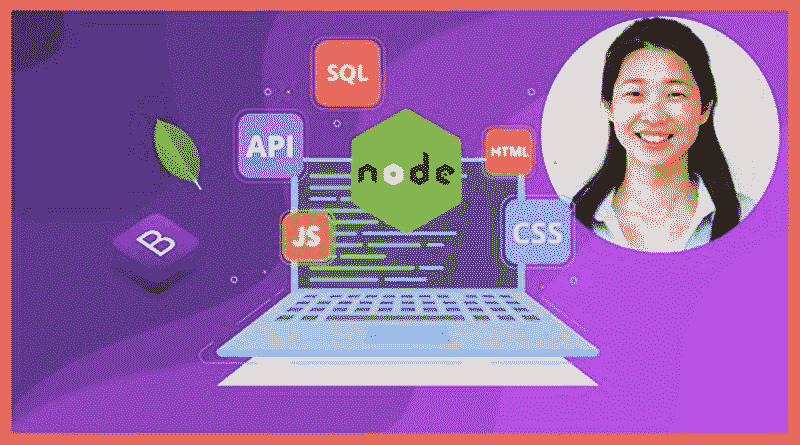
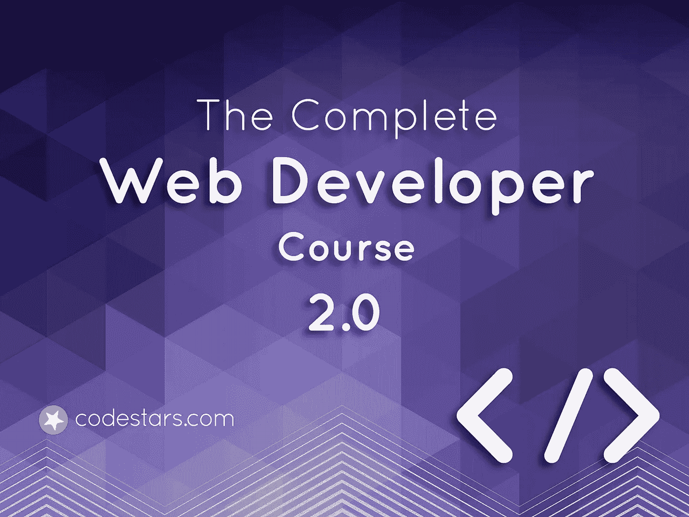
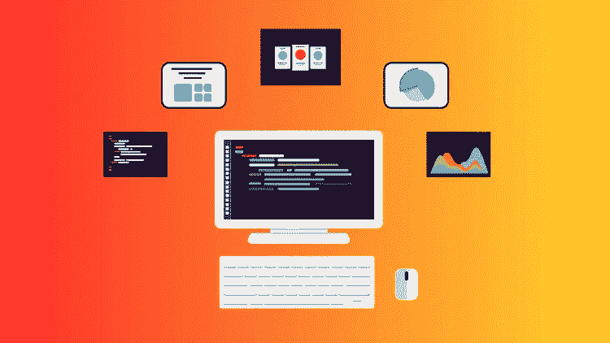
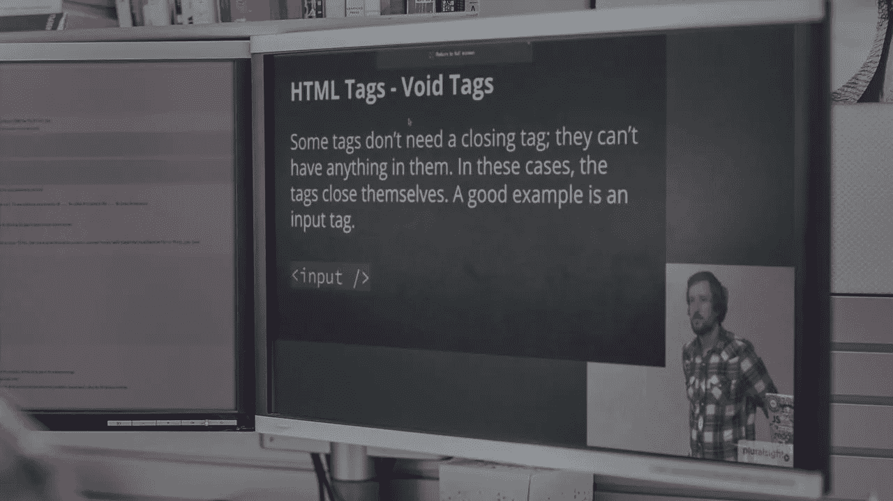
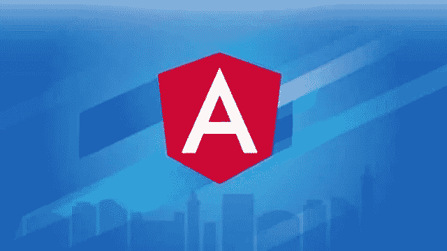
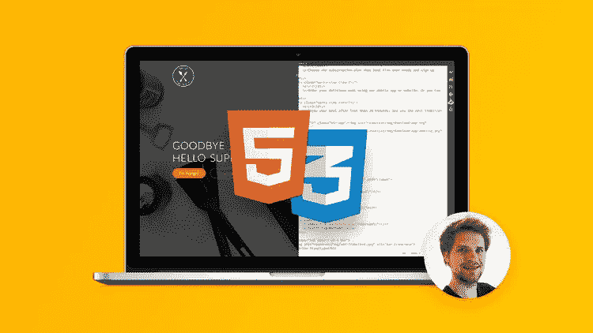

# 2023 年成为 FullStack Web 开发人员的 10 大在线课程[更新]

> 原文：<https://medium.com/javarevisited/top-10-online-courses-to-become-a-fullstack-web-developer-in-2020-d608a6b63232?source=collection_archive---------0----------------------->

大家好，如果你想学习 [Web 开发](http://www.java67.com/2019/01/top-10-javascript-frameworks-and-libraries-for-web-developers.html)或者想在 2023 年成为一名全栈 Web 开发者，那么你来对地方了。在这篇文章中，我将分享你在 2023 年成为一名网页开发者可以参加的最好的在线课程。

毫无疑问，Web 开发是一个非常令人兴奋的职业，在经济上也是有回报的。如果你擅长创建 web 应用程序，你也可以创建自己的网站和自己的企业，成为一名企业家。从自由职业者的角度来看，网页开发也是非常重要的，因为你会在像 Upwork 这样的网站上找到很多工作，这些网站需要网页开发人员或涉及某种网页开发工作。

现在，关于如何在 2023 年学习 web 开发并成为每个公司都想雇佣的全栈 Web 开发人员，最好的方法是什么，以及你如何才能遵循它。毫无疑问，做实际工作是最好的学习方式。所以，如果你想成为一名网络开发人员，那就开发一个网络应用程序，但这说起来容易做起来难。

当你开始你的 web app 开发之旅时，你会意识到你需要学习很多技术，比如 [HTML](http://www.java67.com/2018/02/5-free-html-and-css-courses-to-learn-web-development.html) ， [CSS](http://javarevisited.blogspot.sg/2014/02/how-to-create-tab-ui-using-html-css-jQuery-JavaScript-JSP.html) ， [JavaScript](http://www.java67.com/2018/04/top-5-free-javascript-courses-to-learn.html) ，框架比如 [Angular](http://www.java67.com/2018/01/top-5-free-angular-js-online-courses-for-web-developers.html) ， [React](http://www.java67.com/2018/02/5-free-react-courses-for-web-developers.html) ， [Node JS](http://javarevisited.blogspot.sg/2018/01/top-5-nodejs-and-express-js-online-courses-for-web-developers.html) ，[数据库素材](/javarevisited/7-free-courses-to-learn-database-and-sql-for-programmers-and-data-scientist-e7ae19514ed2)，一些 [Linux 知识](/javarevisited/top-10-courses-to-learn-linux-command-line-in-2020-best-and-free-f3ee4a78d0c0?source=collection_home---4------0-----------------------)，最重要的是编码。

这就是为什么最好先从一本综合性的书或者网络课程开始。他们将为你提供所有必要的信息，并教你一个网站开发者所需的所有技术。以前，我更喜欢书本，但从去年开始，我完全专注于网络课程，因为我发现它们更适合学习。它们提供了比仅仅阅读书籍更积极的教育，你也可以很快了解重要的东西，但选择正确的课程非常困难，这就是本文将帮助你的地方。

顺便说一句，如果你赶时间，看不完整篇文章，就从 Udemy 上的 [**完全 Web Developer 2023:零到精通**](https://click.linksynergy.com/deeplink?id=JVFxdTr9V80&mid=39197&murl=https%3A%2F%2Fwww.udemy.com%2Fcourse%2Fthe-complete-web-developer-zero-to-mastery%2F) 作者 [Andrei Neagoie](https://medium.com/u/942670ffec21?source=post_page-----d608a6b63232--------------------------------) 。最好学的课程是网页开发。如果你有时间查看和复习一些最好的课程，让我们开始吧。

 [## 2023 年的完全网络开发者:零到精通

### 刚刚更新为 2023 年！通过学习最受欢迎的技能，在 2023 年成为 Fullstack Web 开发人员！这是其中之一…

udemy.com](https://click.linksynergy.com/deeplink?id=JVFxdTr9V80&mid=39197&murl=https%3A%2F%2Fwww.udemy.com%2Fcourse%2Fthe-complete-web-developer-zero-to-mastery%2F) 

# 2023 年初学者学习 Web 开发的 10 大课程

互联网上充斥着在线 web 开发课程，如果你陷入了错误的课程，那么你最终会失去你的时间和金钱。这是非常重要的，选择最好的课程，并坚持下去，直到你学会了基础知识。

我在这方面做了一些研究，我准备分享一些我目前用来学习和提高 Web 开发技能的最好的在线课程。

是的，即使你对 Web 开发很熟悉，也可以拿它们来填补学习上的空白。它们对于初学者和中级 web 开发人员来说都很棒。

## 1.【2023 年网络开发训练营

这是 Angela Yu 的一门精彩的在线课程，她是另一位专业的新兵训练营教练。我第一次知道 [Angela Yu](https://medium.com/u/5a5584f78d27?source=post_page-----d608a6b63232--------------------------------) 是在我参加她的 [iOS 开发课程](https://click.linksynergy.com/deeplink?id=JVFxdTr9V80&mid=39197&murl=https%3A%2F%2Fwww.udemy.com%2Fios-12-app-development-bootcamp%2F)的时候，从那以后，我就成了她的粉丝。她是 Udemy 上最好的导师之一，她清晰、简单的讲解，有趣的幻灯片，热情的演讲风格，以及非常好听的声音，让她的课程更加精彩。她的课程在内容方面也是最好的。这门特殊的课程大约有 40 个小时的内容，涵盖了你作为一名 web 开发人员所需要的所有技术。

把 HTML，CSS，JavaScript 覆盖的相当好，然后跳转到 Bootstrap， [jQuery](http://www.java67.com/2018/04/top-5-free-jquery-courses-for-web-developers.html) ，NodeJS，数据库， [SQL](https://javarevisited.blogspot.com/2018/12/top-5-free-microsoft-sql-server-and-transact-sql-online-courses.html) ，Git 和 Github，API， [MongoDB](https://javarevisited.blogspot.com/2019/01/top-5-mongodb-online-training-courses.html) ，Mongoose，后端开发工作。

她还接触 Linux 命令行，这是任何 web 开发人员除了部署之外的另一项重要技能。课程也是很动手的，你会自己开发一个 web 应用。

**这是参加本课程的链接**——[2023 年网络开发训练营](https://click.linksynergy.com/deeplink?id=JVFxdTr9V80&mid=39197&murl=https%3A%2F%2Fwww.udemy.com%2Fthe-complete-web-development-bootcamp%2F)

总之，2023 年学习 Web 开发最好最牛逼的课程之一。它还获得了 30，446 分的平均 4.7 分，这使它成为 Udemy 上评分最高的课程。

## 2.[柯尔特·斯蒂尔的网络开发者训练营](https://click.linksynergy.com/deeplink?id=JVFxdTr9V80&mid=39197&murl=https%3A%2F%2Fwww.udemy.com%2Fthe-web-developer-bootcamp%2F)

这门课程是 Web 开发人员的圣经，也可能是 Udemy 上最好的课程之一。讲师柯尔特·斯蒂尔做了出色的工作，涵盖了 web 开发所需的所有技术。选择合适的课程的一个重要方面不仅仅是内容，还有教师，因为如果你无法与教师沟通，或者他很无聊、反应迟钝或缺乏热情，那么你将什么也学不到。正如柯尔特·斯蒂尔所说，“这是唯一一门由专业训练营教练教授的在线课程”，他作为训练营教练的经历在这门课程中得到了真实的展现。

这门课程不仅涵盖了 web 开发的三大要素，我指的是 HTML、CSS 和 JavaScript，还探索了现代 Web 开发的其他必备要素，如 [Bootstrap](http://www.java67.com/2019/01/5-free-bootstrap-course-to-learn-online.html) 和 [Node JS](https://javarevisited.blogspot.com/2019/01/10-web-development-frameworks-fullstack-developer-should-learn.html) 。

**这是参加本课程的链接** — [柯尔特·斯蒂尔](https://click.linksynergy.com/deeplink?id=JVFxdTr9V80&mid=39197&murl=https%3A%2F%2Fwww.udemy.com%2Fthe-web-developer-bootcamp%2F)的网络开发人员训练营

因为它不仅教授 web 开发，还教授如何编码，所以它涵盖了 [Git](https://javarevisited.blogspot.com/2018/01/5-free-git-courses-for-programmers-to-learn-online.html) 和 Github、[数据库](https://javarevisited.blogspot.com/2018/05/top-5-sql-and-database-courses-to-learn-online.html)和后端技术。所以，对于想成为全栈式 web 开发人员的人来说，这也很棒。

谈到社会证明，这门课程得到了 376，699 名学生的平均 4.6 分的评分，这是一个惊人的成绩，当然也说明了课程的质量。另一方面，该课程将对更新一些过时的视频有很大帮助，这也是列表中的下一门课程有所帮助的地方。

## 3.[完整的 Web 开发者课程 2.0 Rob Percival](https://click.linksynergy.com/deeplink?id=JVFxdTr9V80&mid=39197&murl=https%3A%2F%2Fwww.udemy.com%2Fthe-complete-web-developer-course-2%2F)

如果因为某些原因，你不能连接到柯尔特·斯蒂尔或余，那么这是你应该参加的课程。导师[罗布·帕西瓦尔](https://medium.com/u/479f328b80ac?source=post_page-----d608a6b63232--------------------------------)是另一位指导大师，拥有出色的教学技巧。

和之前的教官一样，他也是清晰，简单，易懂。我也是从他的 [iOS 开发课程](https://click.linksynergy.com/deeplink?id=JVFxdTr9V80&mid=39197&murl=https%3A%2F%2Fwww.udemy.com%2Fios-12-developer-course%2F)开始了解他的，这也是一个极好的资源。就内容而言，本课程与前两个课程相似，教你 HTML、CSS 和 JavaScript，但它也继续解释如何使用 jQuery、Bootstrap 和 WordPress 来创建一个现代外观的网站。

在后端站点上，涵盖了 [PHP](http://www.java67.com/2018/02/5-free-php-and-mysql-courses-for-web-developers.html) 、 [MySQL](https://javarevisited.blogspot.com/2018/05/top-5-mysql-courses-to-learn-online.html) 、 [Python](https://javarevisited.blogspot.com/2018/12/10-free-python-courses-for-programmers.html) 。如果你喜欢 Python，那么后端栈最适合你。像 Rob 的所有课程一样，这也是一门实践性很强的课程，充满了测验、练习题和练习。

**这是加入本课程的链接**——[完整的 Web 开发者课程 2.0 Rob Percival](https://click.linksynergy.com/deeplink?id=JVFxdTr9V80&mid=39197&murl=https%3A%2F%2Fwww.udemy.com%2Fthe-complete-web-developer-course-2%2F)

您还将学习使用强大的 API，如 Google Map 和 Twitter，它们对于现代 web 开发至关重要。

除此之外，你还将获得一个为期一年的免费虚拟主机，3 个专业的引导主题，以及一本他的畅销书 [**如何在学习编码的同时赚到 1000 美元**](https://www.amazon.com/How-Earn-While-Learning-Code-ebook/dp/B00KG5D5MO?tag=javamysqlanta-20) ，以及 CCA(剑桥认证机构)的 5 个免费认证。

说到社会证明，这门课程在 201803 名报名的学生中得到了 n 个平均 4.5 的评分，非常可观。

总体来说 2023 年学习 Web 开发的一门优秀课程，成为你一直想成为的 Web 开发者。

## 4.[高级 Web 开发人员训练营](https://click.linksynergy.com/deeplink?id=JVFxdTr9V80&mid=39197&murl=https%3A%2F%2Fwww.udemy.com%2Fthe-advanced-web-developer-bootcamp%2F)

最后三门课程是为那些想从零开始学习 Web 开发，没有任何编码或编程经验的初学者准备的，但是如果你已经知道了 HTML、CSS 和 JavaScript 等 Web 开发的基础知识，并且想更上一层楼，该怎么办呢？好吧，那么这道菜是给你的。这是柯尔特·斯蒂尔和他的 steam 的另一个大型课程，内容超过 34 小时，涵盖了广泛的高级 web 技术，如 CSS 动画、Flexbox、 [React](https://hackernoon.com/the-2018-react-js-roadmap-4d0a43814c02) 、Redux、SVG、使用 [D3](https://javarevisited.blogspot.com/2019/09/top-5-courses-to-learn-d3js-best.html) 的数据可视化等。

它还涵盖了高级 JavaScript 主题，如同步 JavaScript 和 AJAX、单页面应用程序、重构 JavaScript、[面向对象编程](/swlh/5-free-object-oriented-programming-online-courses-for-programmers-156afd0a3a73)、Jasmine 测试、函数式编程以及 ES2015、ES 2016 和 ES 2017。正如柯尔特所说，这个课程可以很容易地分成 4 到 5 个课程，但是你只需要支付一个课程的费用，就可以在一个课程中完成所有的课程。

**这是参加本课程的链接**——[高级 Web 开发人员训练营](https://click.linksynergy.com/deeplink?id=JVFxdTr9V80&mid=39197&murl=https%3A%2F%2Fwww.udemy.com%2Fthe-advanced-web-developer-bootcamp%2F)

这也意味着你不需要从头到尾完成这门课程，你可以选择不同的学习路径来学习你现在想要的东西，稍后再回来学习其他的东西。例如，您可以现在开始学习 React，以后再回来用 Jasmine 学习测试。与来自柯尔特·斯蒂尔的其他训练营课程一样，它也有大量的练习和测验，以确保您理解和掌握这些先进的概念。谈到社会证明，这门课程得到了 47，584 名学生的平均 4.4 分，这简直太棒了。对于那些熟悉 HTML、CSS 和 JavaScript，并希望提升自己的 web 开发技能以在 2023 年成为更好的 Web 开发人员的人来说，这是一门理想的课程。

## 5.[Web 开发入门](http://pluralsight.pxf.io/c/1193463/424552/7490?u=https%3A%2F%2Fwww.pluralsight.com%2Fcourses%2Fweb-development-intro)

这是另一个面向 web 开发人员的初学者课程，但不是来自 Udemy。我也有一个 [Pluralsight](https://javarevisited.blogspot.com/2017/12/top-10-pluralsight-courses-java-and-web-developers.html) 会员资格，所以我也在那里学习，这是我发现的一门课程，对一个初学 web 开发的人来说很棒。本课程涵盖了创建现代网站所需的所有工具。它不仅深入涵盖了超文本标记语言(HTML)、层叠样式表(CSS)和 JavaScript 等“三大”web 开发技术，还涵盖了 GitHub 和 Node.js 的入门知识。

本课程为您提供了 2023 年成为专业 web 开发人员所需的技能。

**这里是加入本课程的链接** — [网页开发入门](http://pluralsight.pxf.io/c/1193463/424552/7490?u=https%3A%2F%2Fwww.pluralsight.com%2Fcourses%2Fweb-development-intro)

顺便说一句，你需要一个 [Pluralsight 会员](/javarevisited/top-10-pluralsight-courses-to-learn-programming-and-software-development-during-covid-19-stay-at-30b7d8a4f88f)才能进入这个课程，这个课程每月花费大约 29 美元，每年节省 299 美元(14%)。

我有一个年度会员，我可以说这完全值得，因为它提供了 5000 多门最新技术的课程以及测验和练习。

如果你已经拥有 Pluralsight 会员资格，那么你应该参加这个课程，如果没有，那么至少把这个课程作为他们的 [**10 天免费试用**](http://pluralsight.pxf.io/c/1193463/424552/7490?u=https%3A%2F%2Fwww.pluralsight.com%2Flearn) 的一部分，它允许你观看 200 分钟。

## 6.[棱角分明-完整指南(2023 年版)](https://click.linksynergy.com/deeplink?id=JVFxdTr9V80&mid=39197&murl=https%3A%2F%2Fwww.udemy.com%2Fcourse%2Fthe-complete-guide-to-angular-2%2F)

Angular 是 web 开发人员最重要的技能之一，这是学习 Angular 10(以前的“Angular 2”)和使用 Angular.js 的继任者构建令人敬畏的反应式 web 应用程序的最佳课程

以下是你将在本课程中学到的主要内容—

*   如何使用 [Angular 10](/javarevisited/10-courses-to-learn-angular-for-web-development-6da1bd2856dc) 创建现代的、复杂的、反应灵敏的、可伸缩的 web 应用程序
*   完全理解 Angular 应用程序背后的架构以及如何使用它
*   利用所获得的对角度基础的深刻理解，快速将自己树立为前端开发人员
*   使用最现代的 JavaScript 框架之一创建单页面应用程序

**以下是加入本课程的链接** — [Angular —完全指南(2023 版)](https://click.linksynergy.com/deeplink?id=JVFxdTr9V80&mid=39197&murl=https%3A%2F%2Fwww.udemy.com%2Fcourse%2Fthe-complete-guide-to-angular-2%2F)

## 7.[完整的 JavaScript 课程 2023:构建真实的项目！](https://click.linksynergy.com/deeplink?id=JVFxdTr9V80&mid=39197&murl=https%3A%2F%2Fwww.udemy.com%2Fcourse%2Fthe-complete-javascript-course%2F)

JavaScript 可能是任何 web 开发人员最重要的东西，这个在线课程非常适合学习 JavaScript，包括项目、挑战、测验、JavaScript ES6+、OOP、AJAX 和 Webpack

以下是您将在本课程中学到的主要内容:

*   如何用 ES5 和 ES6+创建漂亮的真实应用程序(这里没有无聊的玩具应用程序)
*   JavaScript 和编程基础:变量、布尔逻辑、if/else、循环、函数、数组等。
*   高级的 [JavaScript 特性](/javarevisited/my-favorite-free-tutorials-and-courses-to-learn-javascript-8f4d0a71faf2)比如‘this’关键字、函数构造器、原型继承、一级函数、闭包
*   异步 JavaScript:事件循环、承诺、异步/等待、AJAX 和 API
*   2023 年的现代 JavaScript:NPM、网络包、巴别塔和 ES6 模块
*   理解 JavaScript 如何在幕后工作
*   ES6 新增内容:箭头函数、类、默认和 rest 参数等。

总的来说，这是在线学习 JavaScript 的最佳课程之一，对初学者和有经验的程序员都很有用。

**这里是加入本课程的链接**——[2023 年完整 JavaScript 课程:构建真实项目！](https://click.linksynergy.com/deeplink?id=JVFxdTr9V80&mid=39197&murl=https%3A%2F%2Fwww.udemy.com%2Fcourse%2Fthe-complete-javascript-course%2F)

## 8.[现代反应与 Redux【2023 更新】](https://click.linksynergy.com/deeplink?id=JVFxdTr9V80&mid=39197&murl=https%3A%2F%2Fwww.udemy.com%2Fcourse%2Freact-redux%2F)

与 Angular 一起，React.js 是另一个流行的前端开发库，这是一个通过 React 路由器、Webpack 和 Create-React-App 掌握 React v16.6.3 和 Redux 的很好的课程。包括钩子！

以下是您将在本课程中学到的关键技能:

*   使用 [React JS 和 Redux](/@javinpaul/top-5-courses-to-learn-react-js-in-2019-best-of-lot-fa02cd96cdf0) 构建惊人的单页面应用程序
*   掌握构造 Redux 应用程序背后的基本概念
*   实现构建可组合组件的能力
*   做一个工程师，向其他人解释 Redux 是如何工作的，因为你非常了解基本原理
*   熟练掌握支持 React 的工具链，包括 NPM、Webpack、Babel 和 ES6/ES2015 JavaScript 语法

**以下是加入本课程的链接**——[现代与 Redux 的反应【2023 更新】](https://click.linksynergy.com/deeplink?id=JVFxdTr9V80&mid=39197&murl=https%3A%2F%2Fwww.udemy.com%2Fcourse%2Freact-redux%2F)

## 9.[用 HTML5 和 CSS3 构建反应灵敏的真实世界网站](https://click.linksynergy.com/deeplink?id=JVFxdTr9V80&mid=39197&murl=https%3A%2F%2Fwww.udemy.com%2Fcourse%2Fdesign-and-develop-a-killer-website-with-html5-and-css3%2F)

你可能想知道为什么我在这个列表上有一门 HTML 和 CSS 课程，因为它是 web 开发人员的基础和最重要的技术。本课程提供了从零开始逐步学习现代网页设计、HTML5 和 CSS3 的最简单方法。设计和编码一个巨大的项目。

这是 Jonas Schmedtmann 的另一门很棒的课程，以下是你将在 Udemy 最畅销课程中学到的关键知识:

*   构建真实网站的真实技能:专业、美观、真正响应迅速的网站
*   这是一个庞大的项目，它将教会你开始使用 [HTML5](/javarevisited/5-free-html-and-css-courses-to-learn-front-end-web-development-online-8b04517c6ecb?source=collection_home---4------0-----------------------) 和 [CSS3](/javarevisited/top-10-free-courses-to-learn-html-5-css-3-and-web-development-872d62d97a97) 所需的一切
*   经过验证的 7 个真实步骤，从完全无到全功能和优化的网站
*   简单易用的网页设计指南和技巧，让你的网站脱颖而出
*   学习超级酷的 jQuery 效果，如动画、滚动效果和“粘性”导航

作为课程的一部分，你还可以免费获得 Jonas 的电子书*“使用 HTML5 & CSS3"* 进行 Web 设计和开发的最佳资源”。

**这是加入本课程的链接**——[用 HTML5 和 CSS3 构建响应性真实世界网站](https://click.linksynergy.com/deeplink?id=JVFxdTr9V80&mid=39197&murl=https%3A%2F%2Fwww.udemy.com%2Fcourse%2Fdesign-and-develop-a-killer-website-with-html5-and-css3%2F)

## 10.[面向结果的 Web 开发人员](https://click.linksynergy.com/deeplink?id=JVFxdTr9V80&mid=39197&murl=https%3A%2F%2Fwww.udemy.com%2Fcourse%2Fresult-oriented-web-developer-course%2F)

这是绝对初学者最好的 web 开发课程之一。里面塞满了 50+小时的内容包括 [HTML5](/javarevisited/top-10-free-courses-to-learn-html-5-css-3-and-web-development-872d62d97a97) 、 [CSS3](https://www.java67.com/2020/08/5-best-online-courses-to-learn-html-5.html) 、 [Flexbox](/javarevisited/top-5-advanced-css-courses-to-learn-flexbox-grid-and-sass-da8e37b09b1d?source=---------8------------------) 、 [JavaScript](/javarevisited/10-best-online-courses-to-learn-javascript-in-2020-af5ed0801645) 、 [Node.js](/javarevisited/top-10-online-courses-to-learn-node-js-in-depth-8ef0e31ca139) 、 [MongoDB](/javarevisited/5-best-mongodb-courses-to-learn-nosql-for-beginners-in-2020-42df5af5496c) 等。而且是不断更新的。

但是这门课真正与众不同的是它如何有效地使用视觉和动画来解释理论。它让你很清楚也很容易理解为什么要做某事，而不仅仅是如何去做。

这个训练营式课程的另一个好处是，你将从零开始建立 9 个真实世界的网站。这些项目非常庞大，包含许多元素，是你投资组合的完美补充。

此外，您将学习如何通过混合使用媒体查询和 Flexbox 来使这些网站响应迅速。CSS[和 JavaScript](https://javarevisited.blogspot.com/2020/09/top-5-css-cascading-style-sheet-courses-for-beginners.html)[部分无疑是我见过的最适合初学者的部分。](/javarevisited/12-free-courses-to-learn-javascript-and-es6-for-beginners-and-experienced-developers-aa35874c9a32)

这门课的另一个好处是，老师真的会牵着你的手，快速回答每个学生的每个问题。简而言之，一个真正以结果为导向的课程，你可以加入成为一名网站开发人员。

**这是加入本课程的链接** — [以结果为导向的 Web 开发人员](https://click.linksynergy.com/deeplink?id=JVFxdTr9V80&mid=39197&murl=https%3A%2F%2Fwww.udemy.com%2Fcourse%2Fresult-oriented-web-developer-course%2F)

## 11.2023 年的完全网络开发者:零到精通

这是另一个完整的课程，学习网络开发人员应该知道的一切。这也是一门学习编码并在 2023 年成为一名 Web 开发人员的伟大课程，有 HTML、CSS、Javascript、React、Node.js、机器学习&更多！

以下是您将在本课程中学到的主要内容:

*   这些技能可以让你申请像网页开发人员、软件开发人员、前端开发人员、 [JavaScript 开发人员](/javarevisited/12-free-courses-to-learn-javascript-and-es6-for-beginners-and-experienced-developers-aa35874c9a32)和[全栈开发人员](/javarevisited/top-10-frameworks-full-stack-java-developers-can-learn-in-2020-5995021401e5)这样的工作
*   了解 2023 年科技公司背后实际使用的现代技术
*   构建 10 个以上可以炫耀的真实世界的 Web 开发项目
*   了解编写干净、高性能、无错误代码的最佳实践
*   掌握现代[网站开发基础](/better-programming/my-5-favorite-courses-to-learn-web-development-in-2019-a5e74167f8b2)以及高级话题
*   初级和高级 JavaScript 主题
*   学习 [React + Redux](/javarevisited/top-10-free-courses-to-learn-react-js-c14edbd3b35f) 构建丰富的前端应用
*   使用 [NodeJS](/javarevisited/top-10-online-courses-to-learn-node-js-in-depth-8ef0e31ca139) 编写服务器端 JavaScript
*   学习实现用户认证
*   使用 Express、SQL 和 PostgreSQL 创建可扩展的全栈应用程序

总的来说，这是学习 Web 开发的最完整和最新的课程之一。

**这里是加入本课程的链接**——[2023 年的完全网络开发者:零到精通](https://academy.zerotomastery.io/p/complete-web-developer-zero-to-mastery?affcode=441520_zytgk2dn)

顺便说一句，你需要一个 **ZTM 会员**来观看这个课程，这个课程每月花费大约 29 美元，但也提供了许多超级吸引人和有用的课程，比如这个 [Python 课程](https://academy.zerotomastery.io/p/complete-python-developer-zero-to-mastery?affcode=441520_zytgk2dn)和这个 [JavaScript Web 项目:20 个项目](https://academy.zerotomastery.io/p/javascript-projects?affcode=441520_zytgk2dn)来建立你的作品集课程。

如果你像我一样是一个不断学习的人，那么我建议你去申请会员资格，而不是购买单一的课程，你不仅会省钱，而且会使学习变得容易，因为你不需要每次想学习新东西时都购买课程。

以上是 2023 年学习 web 开发的一些**最佳在线课程。正如我所说的，前三门课程在本质上是非常相似的，你只需要注册其中的一门。我建议你要么参加柯尔特的课程，要么参加安吉拉的课程，这取决于你和谁联系得更好。

一旦你熟悉了 Web 开发基础知识，你就可以参加第四个课程“高级 Web 开发人员训练营”来进一步提升你作为现代 Web 开发人员的技能。

其他**编程文章**你可能喜欢的
[2023 年学习 Python 的 10 个理由](https://javarevisited.blogspot.sg/2018/05/10-reasons-to-learn-python-programming.html)
[2023 年 React JS 开发者路线图](https://javarevisited.blogspot.com/2018/10/the-2018-react-developer-roadmap.html)
[10 个框架全栈软件工程师要学的](https://javarevisited.blogspot.com/2019/01/10-web-development-frameworks-fullstack-developer-should-learn.html)
[前 5 门课程要学 Angular 2023 年](https://javarevisited.blogspot.com/2018/06/5-best-courses-to-learn-angular.html)
[前 5 门课程要学 React](https://javarevisited.blogspot.com/2018/08/top-5-react-js-and-redux-courses-to-learn-online.html)

[2023 年 DevOps 开发者路线图](https://javarevisited.blogspot.com/2018/09/the-2018-devops-roadmap-your-guide-to-become-DevOps-Engineer.html)
[2023 年学习 Python 的 5 大课程](https://javarevisited.blogspot.com/2018/03/top-5-courses-to-learn-python-in-2018.html)
[50+面向程序员的数据结构与算法课程](http://www.java67.com/2018/06/data-structure-and-algorithm-interview-questions-programmers.html)
[7 大面向初学者的最佳打字稿课程](/javarevisited/7-best-courses-to-learn-typescript-in-depth-58439e1ce729)**

感谢您阅读本文。如果你喜欢这些在线网络开发课程，请与你的朋友和同事分享。如果您有任何问题或反馈，请留言。

如果你喜欢听和看而不是阅读，那么你也可以在 Youtube 频道上观看这篇文章的视频，作为 2023 年成为全栈开发人员的最佳课程****。**如果你还没有**订阅**我们的频道，请务必订阅，以便获得下一个视频的通知。**

****P. S.** —如果你热衷于学习网页开发，但正在寻找一些免费资源开始，你也可以查看 [**网页开发人员网页设计:创建漂亮的网站！**](https://click.linksynergy.com/deeplink?id=JVFxdTr9V80&mid=39197&murl=https%3A%2F%2Fwww.udemy.com%2Fcourse%2Fweb-design-secrets%2F)Udemy 上的课程。它是由 Jonas Schmedtmann 创建的，已经有超过 49 万名学生加入了这个免费课程。**

** [## 免费网页设计教程-网页开发人员的网页设计:建立美丽的网站！

### 重要提示:这门课的内容也包含在我的另一门关于网页设计和开发的课程中

udemy.com](https://click.linksynergy.com/deeplink?id=JVFxdTr9V80&mid=39197&murl=https%3A%2F%2Fwww.udemy.com%2Fcourse%2Fweb-design-secrets%2F) 

**P. P. S —** 快速更新，**[**plur sight 免费周末**](/javarevisited/pluralsight-free-weekend-2020-3e0ff26e7a31) 就在这里，你可以在这个周末免费访问所有 7000+plur sight 课程和项目。好好利用这一点，学习一项新技能或提升现有技能。不要错过这个，这只是这个周末。这又是一个链接:**

** [## 2023 年免费周末观光

### 所有 Pluralsight 7000+在线课程、40+互动课程和 20+项目仅在本周末免费(14 日至…

medium.com](/javarevisited/pluralsight-free-weekend-2020-3e0ff26e7a31)****